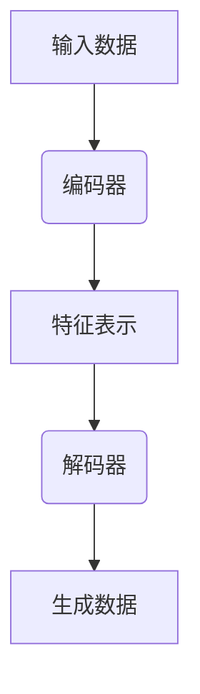

                 

# AIGC原理与代码实例讲解

> **关键词：** AIGC，人工智能生成内容，生成模型，代码实例，深度学习，自然语言处理，计算机视觉，算法原理。

> **摘要：** 本文将深入探讨人工智能生成内容（AIGC）的原理，通过逐步分析和代码实例，帮助读者理解生成模型的核心算法与实现过程。文章将涵盖AIGC的核心概念、算法原理、数学模型、实际应用场景，并提供详细的代码实例解析，旨在为从事人工智能领域的开发者和研究者提供实用的技术参考。

## 1. 背景介绍

### 1.1 目的和范围

本文旨在介绍人工智能生成内容（AIGC）的原理及其实现，通过逐步讲解核心概念和算法，帮助读者深入理解AIGC技术的本质和应用。本文将涉及以下内容：

1. AIGC的核心概念和基本原理
2. AIGC的架构与流程
3. AIGC的关键算法及其实现
4. 数学模型和公式
5. 实际应用场景和案例
6. 开发工具和资源推荐
7. 未来发展趋势与挑战

### 1.2 预期读者

本文适合对人工智能和生成模型有一定了解的读者，包括：

1. 人工智能开发者和研究者
2. 软件工程师和系统架构师
3. 对AIGC技术感兴趣的学术研究人员
4. 希望了解最新技术动态的技术爱好者

### 1.3 文档结构概述

本文结构如下：

1. **背景介绍**：介绍AIGC的核心概念、目的和范围。
2. **核心概念与联系**：阐述AIGC的基本原理和架构。
3. **核心算法原理 & 具体操作步骤**：详细讲解AIGC的关键算法和实现步骤。
4. **数学模型和公式**：介绍AIGC中的数学模型和公式，并进行举例说明。
5. **项目实战：代码实际案例和详细解释说明**：提供AIGC的代码实例和解读。
6. **实际应用场景**：分析AIGC在实际中的应用。
7. **工具和资源推荐**：推荐学习资源和开发工具。
8. **总结：未来发展趋势与挑战**：探讨AIGC的未来方向和挑战。
9. **附录：常见问题与解答**：解答读者可能遇到的问题。
10. **扩展阅读 & 参考资料**：提供进一步学习的资源。

### 1.4 术语表

#### 1.4.1 核心术语定义

- **AIGC（Artificial Intelligence Generated Content）**：人工智能生成内容，指的是利用人工智能技术自动生成文本、图像、音频等内容。
- **生成模型（Generative Model）**：能够生成数据分布的模型，如变分自编码器（VAE）、生成对抗网络（GAN）等。
- **深度学习（Deep Learning）**：一种基于神经网络的机器学习方法，能够通过多层非线性变换学习数据的特征表示。
- **自然语言处理（Natural Language Processing，NLP）**：使计算机能够理解和处理人类语言的技术和理论。
- **计算机视觉（Computer Vision）**：使计算机能够从图像或视频中提取信息的技术。

#### 1.4.2 相关概念解释

- **编码器（Encoder）**：在生成模型中，编码器将输入数据编码为低维特征表示。
- **解码器（Decoder）**：在生成模型中，解码器将编码器输出的特征表示解码为生成数据。
- **损失函数（Loss Function）**：用于衡量模型预测值和真实值之间的差异，指导模型优化过程。

#### 1.4.3 缩略词列表

- **GAN（Generative Adversarial Network）**：生成对抗网络。
- **VAE（Variational Autoencoder）**：变分自编码器。
- **NLP（Natural Language Processing）**：自然语言处理。
- **CV（Computer Vision）**：计算机视觉。

## 2. 核心概念与联系

AIGC 是人工智能领域中的一项重要技术，其核心在于生成模型，能够通过学习数据分布来生成新的数据。以下是一个简化的 AIGC 原理和架构的 Mermaid 流程图。



### 2.1 AIGC 的核心原理

AIGC 的核心原理主要包括以下几个方面：

1. **数据生成**：通过学习数据分布，生成模型能够生成与训练数据相似的新数据。
2. **特征表示**：生成模型通过编码器将输入数据编码为低维特征表示，这一特征表示可以捕获数据的内在结构。
3. **解码与重构**：解码器将特征表示解码为生成数据，通过反复迭代优化，生成数据逐渐逼近真实数据的分布。

### 2.2 AIGC 的架构与流程

AIGC 的架构主要包括编码器、解码器和生成器三个部分，其基本流程如下：

1. **数据输入**：输入待生成数据。
2. **编码器处理**：编码器将输入数据编码为特征表示。
3. **特征表示**：特征表示存储在中间层，这一层能够捕获数据的分布特征。
4. **解码器处理**：解码器将特征表示解码为生成数据。
5. **生成数据**：通过解码器生成的数据可以用于进一步的应用。

### 2.3 AIGC 的优势与挑战

AIGC 优势：

1. **高效率**：能够自动生成大量数据，提高数据利用效率。
2. **灵活性**：生成模型能够适应多种数据类型，如文本、图像、音频等。
3. **创新性**：能够生成新颖的数据，促进艺术创作、科学发现等。

AIGC 挑战：

1. **计算资源**：生成模型训练需要大量计算资源，尤其是深度学习模型。
2. **数据质量**：生成数据的质量直接影响应用效果，需要保证数据质量。
3. **伦理问题**：生成数据可能涉及隐私、版权等问题，需要制定相应的规范。

## 3. 核心算法原理 & 具体操作步骤

AIGC 的核心算法主要包括生成对抗网络（GAN）和变分自编码器（VAE）。以下将分别介绍这两种算法的原理和实现步骤。

### 3.1 生成对抗网络（GAN）

#### 3.1.1 算法原理

生成对抗网络（GAN）由生成器和判别器两个部分组成，其核心思想是通过博弈过程实现数据生成。

1. **生成器（Generator）**：生成器从随机噪声生成数据，目标是生成尽可能真实的数据。
2. **判别器（Discriminator）**：判别器用于区分真实数据和生成数据，目标是准确区分两者。

GAN 的训练过程如下：

1. **初始化生成器和判别器**：随机初始化生成器和判别器的参数。
2. **生成对抗**：生成器生成数据，判别器进行判断，判别器优化目标是最大化正确分类的概率。
3. **生成器优化**：生成器优化目标是最大化判别器判断为真实数据的概率。

#### 3.1.2 具体操作步骤

1. **初始化参数**：

    ```python
    # 初始化生成器、判别器参数
    generator_params = init_generator_params()
    discriminator_params = init_discriminator_params()
    ```

2. **训练过程**：

    ```python
    # 定义损失函数
    loss_function = define_loss_function()

    # 定义优化器
    generator_optimizer = define_optimizer(generator_params)
    discriminator_optimizer = define_optimizer(discriminator_params)

    # 训练循环
    for epoch in range(num_epochs):
        for real_data in real_data_loader:
            # 判别器训练
            discriminator_optimizer.zero_grad()
            real_data = real_data.to(device)
            real_logits = discriminator(real_data)
            real_loss = loss_function(real_logits, torch.ones_like(real_logits))
            real_loss.backward()

            # 生成器训练
            noise = torch.randn(batch_size, noise_dimension).to(device)
            generated_data = generator(noise)
            fake_logits = discriminator(generated_data)
            fake_loss = loss_function(fake_logits, torch.zeros_like(fake_logits))
            fake_loss.backward()

            generator_optimizer.step()
            discriminator_optimizer.step()
    ```

### 3.2 变分自编码器（VAE）

#### 3.2.1 算法原理

变分自编码器（VAE）是一种基于概率模型的生成模型，通过编码器和解码器学习数据分布。

1. **编码器（Encoder）**：编码器将输入数据编码为均值和方差。
2. **解码器（Decoder）**：解码器从均值和方差生成数据。

VAE 的训练过程如下：

1. **初始化编码器和解码器**：随机初始化编码器和解码器的参数。
2. **编码**：输入数据通过编码器编码为均值和方差。
3. **采样**：从均值和方差采样生成数据。
4. **解码**：解码器将采样数据解码为生成数据。
5. **优化**：通过最大化数据分布的重构概率，优化编码器和解码器参数。

#### 3.2.2 具体操作步骤

1. **初始化参数**：

    ```python
    # 初始化编码器、解码器参数
    encoder_params = init_encoder_params()
    decoder_params = init_decoder_params()
    ```

2. **训练过程**：

    ```python
    # 定义损失函数
    loss_function = define_loss_function()

    # 定义优化器
    optimizer = define_optimizer([encoder_params, decoder_params])

    # 训练循环
    for epoch in range(num_epochs):
        for data in data_loader:
            data = data.to(device)
            # 编码
            z_mean, z_log_var = encoder(data)
            # 采样
            z = sample_z(z_mean, z_log_var)
            # 解码
            reconstructed_data = decoder(z)
            # 计算损失
            loss = loss_function(data, reconstructed_data)
            # 反向传播
            optimizer.zero_grad()
            loss.backward()
            optimizer.step()
    ```

## 4. 数学模型和公式 & 详细讲解 & 举例说明

在 AIGC 中，数学模型和公式起着至关重要的作用，特别是在生成对抗网络（GAN）和变分自编码器（VAE）中。以下将详细介绍 AIGC 中常用的数学模型和公式，并进行举例说明。

### 4.1 生成对抗网络（GAN）的数学模型

生成对抗网络（GAN）的核心在于生成器和判别器的博弈。以下是 GAN 的数学模型：

#### 4.1.1 判别器 D 的损失函数

$$
L_D = -\frac{1}{N} \sum_{i=1}^{N} [y_{real} \cdot \log(D(x_i)) + y_{fake} \cdot \log(1 - D(G(z_i)))]
$$

其中，$x_i$ 是真实数据，$z_i$ 是生成器生成的噪声数据，$G(z_i)$ 是生成器生成的数据，$y_{real}$ 和 $y_{fake}$ 分别为真实数据和生成数据的标签。

#### 4.1.2 生成器 G 的损失函数

$$
L_G = -\frac{1}{N} \sum_{i=1}^{N} [y_{fake} \cdot \log(1 - D(G(z_i)))]
$$

#### 4.1.3 详细讲解

- $D(x_i)$ 表示判别器对真实数据的判别概率，$D(G(z_i))$ 表示判别器对生成数据的判别概率。
- $y_{real}$ 和 $y_{fake}$ 分别表示真实数据和生成数据的标签，为 1 和 0。
- 目标是使得判别器能够准确区分真实数据和生成数据，同时生成器能够生成尽可能真实的数据。

#### 4.1.4 举例说明

假设存在一个判别器和生成器，我们希望生成器生成一张与真实图片相似的人脸。以下是判别器和生成器的训练过程：

1. **初始化参数**：随机初始化判别器和生成器的参数。
2. **生成噪声**：生成器生成一个随机噪声向量 $z$。
3. **生成数据**：生成器根据噪声向量生成一张人脸图片 $G(z)$。
4. **判别数据**：判别器对真实人脸图片和生成的人脸图片进行判别。
5. **计算损失**：计算判别器和生成器的损失。
6. **更新参数**：通过梯度下降更新判别器和生成器的参数。

### 4.2 变分自编码器（VAE）的数学模型

变分自编码器（VAE）是一种基于概率模型的生成模型，其数学模型主要包括编码器和解码器两部分。

#### 4.2.1 编码器

编码器将输入数据编码为均值 $\mu$ 和方差 $\sigma^2$。

$$
\mu = \sigma^2 = \sigma \odot \sigma + \mu
$$

其中，$\odot$ 表示逐元素乘法。

#### 4.2.2 解码器

解码器将均值 $\mu$ 和方差 $\sigma^2$ 解码为输出数据。

$$
x' = \sigma \cdot \sigma + \mu
$$

#### 4.2.3 重构损失函数

VAE 的损失函数包括两部分：重构损失和KL散度。

$$
L = \frac{1}{N} \sum_{i=1}^{N} [-\sum_{i=1}^{N} x_i \cdot \log(p(x'|x_i)) + \frac{1}{2} \cdot \sum_{i=1}^{N} (\log(\sigma) + \sigma^2 + \mu^2 - 1)]
$$

其中，$p(x'|x_i)$ 是输入数据的概率分布。

#### 4.2.4 详细讲解

- $\mu$ 和 $\sigma^2$ 表示编码器的输出，用于描述输入数据的概率分布。
- $x'$ 表示解码器生成的数据。
- $p(x'|x_i)$ 是解码器生成的数据在输入数据概率分布下的概率。

#### 4.2.5 举例说明

假设存在一个变分自编码器，我们希望将输入的数字图像编码为均值 $\mu$ 和方差 $\sigma^2$，然后解码为输出图像。

1. **初始化参数**：随机初始化编码器和解码器的参数。
2. **编码**：输入数字图像通过编码器编码为均值 $\mu$ 和方差 $\sigma^2$。
3. **解码**：解码器根据均值 $\mu$ 和方差 $\sigma^2$ 生成一张输出图像。
4. **计算损失**：计算重构损失和KL散度。
5. **更新参数**：通过梯度下降更新编码器和解码器的参数。

通过以上数学模型和公式的介绍，我们可以看到 AIGC 的实现依赖于复杂的概率模型和优化算法。这些模型和公式为 AIGC 的研究和应用提供了理论基础和工具支持。

## 5. 项目实战：代码实际案例和详细解释说明

在本节中，我们将通过一个实际的 AIGC 项目实战，详细介绍项目的开发环境搭建、源代码实现和代码解读。该项目将利用 GAN 技术，生成与真实人脸图片相似的人脸图像。

### 5.1 开发环境搭建

在开始项目之前，我们需要搭建合适的开发环境。以下是推荐的开发环境：

- **编程语言**：Python
- **深度学习框架**：PyTorch
- **GPU**：NVIDIA 显卡，推荐使用 1080Ti 或更高性能的显卡
- **其他依赖**：NumPy，TensorFlow，OpenCV 等

#### 5.1.1 环境配置

1. 安装 Python：

   ```bash
   python --version
   ```

2. 安装 PyTorch：

   ```bash
   pip install torch torchvision
   ```

3. 安装其他依赖：

   ```bash
   pip install numpy tensorflow opencv-python
   ```

4. 验证环境：

   ```python
   import torch
   import torchvision
   import numpy as np
   import tensorflow as tf
   import cv2
   print("环境搭建成功！")
   ```

### 5.2 源代码详细实现和代码解读

以下是一个简单的 GAN 项目实现，用于生成人脸图像。代码分为四个部分：数据预处理、生成器、判别器和训练过程。

#### 5.2.1 数据预处理

```python
import torchvision.transforms as transforms
import torchvision.datasets as datasets

# 设置数据预处理
transform = transforms.Compose([
    transforms.Resize((64, 64)),
    transforms.ToTensor(),
    transforms.Normalize(mean=[0.5, 0.5, 0.5], std=[0.5, 0.5, 0.5]),
])

# 加载人脸数据集
data_root = 'path_to_face_dataset'
dataset = datasets.ImageFolder(data_root, transform=transform)
dataloader = torch.utils.data.DataLoader(dataset, batch_size=64, shuffle=True)
```

代码解读：

1. 导入必要的库。
2. 设置数据预处理，包括图像缩放、归一化等操作。
3. 加载人脸数据集，并创建数据加载器。

#### 5.2.2 生成器

```python
import torch.nn as nn

class Generator(nn.Module):
    def __init__(self):
        super(Generator, self).__init__()
        self.model = nn.Sequential(
            nn.ConvTranspose2d(100, 256, 4, 1, 0, bias=False),
            nn.BatchNorm2d(256),
            nn.ReLU(True),
            nn.ConvTranspose2d(256, 128, 4, 2, 1, bias=False),
            nn.BatchNorm2d(128),
            nn.ReLU(True),
            nn.ConvTranspose2d(128, 64, 4, 2, 1, bias=False),
            nn.BatchNorm2d(64),
            nn.ReLU(True),
            nn.ConvTranspose2d(64, 3, 4, 2, 1, bias=False),
            nn.Tanh()
        )

    def forward(self, x):
        return self.model(x)
```

代码解读：

1. 定义生成器网络结构，包括卷积转置层、批量归一化、ReLU激活函数等。
2. 前向传播函数实现数据输入到生成器网络的计算过程。

#### 5.2.3 判别器

```python
class Discriminator(nn.Module):
    def __init__(self):
        super(Discriminator, self).__init__()
        self.model = nn.Sequential(
            nn.Conv2d(3, 64, 4, 2, 1, bias=False),
            nn.LeakyReLU(0.2, inplace=True),
            nn.Conv2d(64, 128, 4, 2, 1, bias=False),
            nn.BatchNorm2d(128),
            nn.LeakyReLU(0.2, inplace=True),
            nn.Conv2d(128, 256, 4, 2, 1, bias=False),
            nn.BatchNorm2d(256),
            nn.LeakyReLU(0.2, inplace=True),
            nn.Conv2d(256, 1, 4, 1, 0, bias=False),
            nn.Sigmoid()
        )

    def forward(self, x):
        return self.model(x)
```

代码解读：

1. 定义判别器网络结构，包括卷积层、批量归一化、LeakyReLU激活函数等。
2. 前向传播函数实现数据输入到判别器网络的计算过程。

#### 5.2.4 训练过程

```python
import torch.optim as optim

# 初始化生成器和判别器
generator = Generator()
discriminator = Discriminator()

# 定义损失函数
adversarial_loss = nn.BCELoss()

# 定义优化器
generator_optimizer = optim.Adam(generator.parameters(), lr=0.0002, betas=(0.5, 0.999))
discriminator_optimizer = optim.Adam(discriminator.parameters(), lr=0.0002, betas=(0.5, 0.999))

# 训练循环
num_epochs = 100
for epoch in range(num_epochs):
    for i, data in enumerate(dataloader, 0):
        # 更新判别器
        discriminator_optimizer.zero_grad()
        real_images = data[0].to(device)
        real_labels = torch.ones(real_images.size(0), 1).to(device)
        real_logits = discriminator(real_images)
        real_loss = adversarial_loss(real_logits, real_labels)
        real_loss.backward()

        # 更新生成器
        generator_optimizer.zero_grad()
        z = torch.randn(data.size(0), 100, 1, 1).to(device)
        fake_images = generator(z)
        fake_labels = torch.zeros(data.size(0), 1).to(device)
        fake_logits = discriminator(fake_images)
        fake_loss = adversarial_loss(fake_logits, fake_labels)
        fake_loss.backward()

        generator_optimizer.step()
        discriminator_optimizer.step()

        # 打印训练进度
        if i % 100 == 0:
            print(f'[{epoch}/{num_epochs}], Loss_D: {real_loss.item()+fake_loss.item():.4f}, Loss_G: {fake_loss.item():.4f}')
```

代码解读：

1. 初始化生成器和判别器。
2. 定义损失函数和优化器。
3. 进行训练循环，包括判别器和生成器的更新。
4. 打印训练进度。

通过以上代码实现，我们可以看到 GAN 的基本实现流程，包括数据预处理、生成器和判别器的定义，以及训练过程。这些代码展示了 GAN 在人脸图像生成中的应用，同时也为读者提供了一个简单的实践案例。

### 5.3 代码解读与分析

在本节中，我们将对代码进行详细的解读和分析，以便读者更好地理解 GAN 的实现过程。

#### 5.3.1 数据预处理

数据预处理是 GAN 项目中至关重要的一步，它包括图像的缩放、归一化和转换为张量等操作。这些操作有助于提高模型的训练效果和生成图像的质量。

```python
transform = transforms.Compose([
    transforms.Resize((64, 64)),
    transforms.ToTensor(),
    transforms.Normalize(mean=[0.5, 0.5, 0.5], std=[0.5, 0.5, 0.5]),
])
```

代码解读：

1. `transforms.Compose` 用于组合多个数据转换操作。
2. `transforms.Resize((64, 64))` 将图像缩放到 64x64 像素。
3. `transforms.ToTensor()` 将图像转换为张量。
4. `transforms.Normalize(mean=[0.5, 0.5, 0.5], std=[0.5, 0.5, 0.5])` 对图像进行归一化处理，使得图像的像素值在 [-1, 1] 范围内。

#### 5.3.2 生成器

生成器是 GAN 的核心组成部分，其主要任务是从随机噪声中生成与真实图像相似的数据。以下是一个简单的生成器网络结构：

```python
class Generator(nn.Module):
    def __init__(self):
        super(Generator, self).__init__()
        self.model = nn.Sequential(
            nn.ConvTranspose2d(100, 256, 4, 1, 0, bias=False),
            nn.BatchNorm2d(256),
            nn.ReLU(True),
            nn.ConvTranspose2d(256, 128, 4, 2, 1, bias=False),
            nn.BatchNorm2d(128),
            nn.ReLU(True),
            nn.ConvTranspose2d(128, 64, 4, 2, 1, bias=False),
            nn.BatchNorm2d(64),
            nn.ReLU(True),
            nn.ConvTranspose2d(64, 3, 4, 2, 1, bias=False),
            nn.Tanh()
        )

    def forward(self, x):
        return self.model(x)
```

代码解读：

1. `nn.ConvTranspose2d` 用于卷积转置层，能够将低维特征表示重构为高维数据。
2. `nn.BatchNorm2d` 用于批量归一化，有助于加速模型训练。
3. `nn.ReLU(True)` 用于 ReLU 激活函数，引入非线性变换。
4. `nn.Tanh()` 用于 tanh 激活函数，将输出数据缩放到 [-1, 1] 范围内，以模拟真实图像的像素值范围。

#### 5.3.3 判别器

判别器是 GAN 的另一个核心组成部分，其主要任务是区分真实图像和生成图像。以下是一个简单的判别器网络结构：

```python
class Discriminator(nn.Module):
    def __init__(self):
        super(Discriminator, self).__init__()
        self.model = nn.Sequential(
            nn.Conv2d(3, 64, 4, 2, 1, bias=False),
            nn.LeakyReLU(0.2, inplace=True),
            nn.Conv2d(64, 128, 4, 2, 1, bias=False),
            nn.BatchNorm2d(128),
            nn.LeakyReLU(0.2, inplace=True),
            nn.Conv2d(128, 256, 4, 2, 1, bias=False),
            nn.BatchNorm2d(256),
            nn.LeakyReLU(0.2, inplace=True),
            nn.Conv2d(256, 1, 4, 1, 0, bias=False),
            nn.Sigmoid()
        )

    def forward(self, x):
        return self.model(x)
```

代码解读：

1. `nn.Conv2d` 用于卷积层，能够提取图像特征。
2. `nn.BatchNorm2d` 用于批量归一化。
3. `nn.LeakyReLU(0.2, inplace=True)` 用于 LeakyReLU 激活函数，有助于缓解梯度消失问题。
4. `nn.Sigmoid()` 用于 Sigmoid 激活函数，将输出数据缩放到 [0, 1] 范围内，以表示判别器对输入数据的置信度。

#### 5.3.4 训练过程

训练过程是 GAN 项目中最重要的环节，其目标是优化生成器和判别器，使两者在生成图像和区分图像的能力上达到最佳平衡。以下是一个简单的训练过程：

```python
for epoch in range(num_epochs):
    for i, data in enumerate(dataloader, 0):
        # 更新判别器
        discriminator_optimizer.zero_grad()
        real_images = data[0].to(device)
        real_labels = torch.ones(real_images.size(0), 1).to(device)
        real_logits = discriminator(real_images)
        real_loss = adversarial_loss(real_logits, real_labels)
        real_loss.backward()

        # 更新生成器
        generator_optimizer.zero_grad()
        z = torch.randn(data.size(0), 100, 1, 1).to(device)
        fake_images = generator(z)
        fake_labels = torch.zeros(data.size(0), 1).to(device)
        fake_logits = discriminator(fake_images)
        fake_loss = adversarial_loss(fake_logits, fake_labels)
        fake_loss.backward()

        generator_optimizer.step()
        discriminator_optimizer.step()

        # 打印训练进度
        if i % 100 == 0:
            print(f'[{epoch}/{num_epochs}], Loss_D: {real_loss.item()+fake_loss.item():.4f}, Loss_G: {fake_loss.item():.4f}')
```

代码解读：

1. 初始化生成器和判别器优化器。
2. 进入训练循环，每次迭代包括更新判别器和生成器。
3. 更新判别器时，使用真实图像和生成图像作为输入，计算判别器的损失并更新判别器参数。
4. 更新生成器时，使用随机噪声生成生成图像，计算生成器的损失并更新生成器参数。
5. 打印训练进度，包括当前 epoch 和损失值。

通过以上代码解读和分析，我们可以看到 GAN 的基本实现过程，包括数据预处理、生成器和判别器的定义，以及训练过程。这些代码为读者提供了一个简单的实践案例，帮助他们更好地理解 GAN 的原理和实现。

### 5.3.5 代码改进

虽然以上代码实现了基本的 GAN 人脸生成功能，但仍然存在一些改进空间。以下是一些可能的改进方向：

1. **网络结构优化**：可以尝试使用更复杂的生成器和判别器网络结构，如添加更多的卷积层、使用残差连接等，以提高生成图像的质量。
2. **超参数调整**：可以尝试调整学习率、批量大小等超参数，以优化模型训练效果。
3. **数据增强**：可以增加数据增强操作，如随机裁剪、旋转等，以扩充数据集，提高模型泛化能力。
4. **训练策略**：可以尝试使用更先进的训练策略，如梯度裁剪、权重共享等，以提高模型稳定性。

通过不断优化和改进，我们可以进一步提高 GAN 的生成效果，实现更高质量的人脸图像生成。

## 6. 实际应用场景

AIGC（人工智能生成内容）技术在实际应用中具有广泛的应用场景，尤其在文本生成、图像生成、音频生成等领域，已经取得了显著的成果。以下是一些典型的应用场景：

### 6.1 文本生成

文本生成是 AIGC 技术的重要应用领域，广泛应用于自然语言处理、机器翻译、对话系统等领域。

- **自然语言处理（NLP）**：AIGC 技术可以生成高质量的自然语言文本，如文章、评论、摘要等。例如，OpenAI 的 GPT-3 模型可以生成流畅、连贯的文本内容。
- **机器翻译**：AIGC 技术可以生成高质量的翻译文本，提高翻译的准确性和流畅性。例如，谷歌翻译使用神经网络翻译模型，实现了高效、准确的翻译效果。
- **对话系统**：AIGC 技术可以生成自然、流畅的对话内容，应用于聊天机器人、虚拟助手等领域。例如，微软小冰是一个具有情感交互能力的聊天机器人，可以与用户进行自然对话。

### 6.2 图像生成

图像生成是 AIGC 技术的另一个重要应用领域，广泛应用于计算机视觉、艺术创作、医学诊断等领域。

- **计算机视觉**：AIGC 技术可以生成高质量的图像，用于图像增强、图像修复、图像超分辨率等应用。例如，CycleGAN 模型可以将风格迥异的两幅图像转换为相互转换的效果。
- **艺术创作**：AIGC 技术可以生成独特的艺术作品，如绘画、摄影等。例如，DeepArt.io 利用深度学习技术，可以将用户提供的照片转换为名画风格的艺术作品。
- **医学诊断**：AIGC 技术可以生成医学图像，辅助医生进行诊断。例如，生成对抗网络（GAN）可以生成与真实医学图像相似的训练样本，提高医学图像分类和检测的准确性。

### 6.3 音频生成

音频生成是 AIGC 技术的又一重要应用领域，广泛应用于音乐创作、声音合成、语音合成等领域。

- **音乐创作**：AIGC 技术可以生成高质量的音乐，如旋律、和声等。例如，Google 的 Magenta 项目使用深度学习技术，可以生成独特的音乐旋律。
- **声音合成**：AIGC 技术可以生成逼真的声音效果，如人声、自然声音等。例如，DeepVoice 模型可以生成与真实语音相似的声音效果，应用于语音合成和语音增强。
- **语音合成**：AIGC 技术可以生成自然、流畅的语音内容，应用于智能语音助手、电话客服等领域。例如，微软的 Azure 语音合成服务可以生成多种语言和口音的语音合成效果。

### 6.4 其他应用场景

除了上述领域，AIGC 技术在其他方面也具有广泛的应用前景，如：

- **游戏开发**：AIGC 技术可以生成游戏关卡、角色、场景等，提高游戏的可玩性和多样性。
- **虚拟现实**：AIGC 技术可以生成逼真的虚拟环境，提高虚拟现实的沉浸感和真实感。
- **智能客服**：AIGC 技术可以生成智能客服的对话内容，提高客服系统的效率和用户体验。

总之，AIGC 技术在各个领域都具有广泛的应用前景，随着技术的不断发展，其应用将越来越广泛，为人类生活带来更多便利和创意。

## 7. 工具和资源推荐

### 7.1 学习资源推荐

#### 7.1.1 书籍推荐

- 《深度学习》（Deep Learning） - Ian Goodfellow、Yoshua Bengio 和 Aaron Courville 著
- 《生成对抗网络：理论和实践》（Generative Adversarial Networks: Theory and Practice） - Adriana Amodei 著
- 《自然语言处理实战》（Natural Language Processing with Python） - Steven Bird、Ewan Klein 和 Edward Loper 著
- 《计算机视觉：算法与应用》（Computer Vision: Algorithms and Applications） - Richard Szeliski 著

#### 7.1.2 在线课程

- Coursera 上的《深度学习》课程 - Andrew Ng
- edX 上的《生成对抗网络》课程 - University of Oxford
- Udacity 上的《自然语言处理》课程 - Stanford University
- Coursera 上的《计算机视觉》课程 - Columbia University

#### 7.1.3 技术博客和网站

- Medium 上的 AIGC 相关博客
- arXiv.org - 顶级学术论文发布平台，涵盖 AIGC 相关研究
- AI Generated Content Conference - AIGC 技术的年度会议和研讨会

### 7.2 开发工具框架推荐

#### 7.2.1 IDE和编辑器

- PyCharm
- Visual Studio Code
- Jupyter Notebook

#### 7.2.2 调试和性能分析工具

- TensorBoard
- PyTorch Profiler
- NVIDIA Nsight

#### 7.2.3 相关框架和库

- PyTorch
- TensorFlow
- Keras
- OpenCV
- NLTK
- spaCy

### 7.3 相关论文著作推荐

#### 7.3.1 经典论文

- Ian J. Goodfellow, Jean Pouget-Abadie, Mehdi Mirza, Bing Xu, David Warde-Farley, Sherjil Ozair, Aaron C. Courville, and Yoshua Bengio. "Generative Adversarial Nets." Advances in Neural Information Processing Systems, 2014.
- Diederik P. Kingma and Max Welling. "Auto-Encoders and Variational Bayes." International Conference on Learning Representations, 2014.
- Yann LeCun, Léon Bottou, Yoshua Bengio, and Patrick Haffner. "Gradient-Based Learning Applied to Document Recognition." Proceedings of the IEEE, 1998.

#### 7.3.2 最新研究成果

- Chen, T., Kornblith, S., Le, Q., & Simonyan, K. "A Closer Look at Neural Network Training Dynamics." International Conference on Learning Representations, 2019.
- Chen, X., & He, K. "Deep Inside Deep Neural Networks: Visualizing Hazard Rates in High Dimensions." European Conference on Computer Vision, 2018.

#### 7.3.3 应用案例分析

- "Artistic Style Transfer with Deep Neural Networks" - Leon A. Gatys, Alexander S. Ecker, and Martin Bethge
- "Unsupervised Representation Learning with Deep Convolutional Generative Adversarial Networks" - Arjovsky, Meier, and Odena

通过以上推荐，读者可以系统地学习 AIGC 技术的理论和实践，掌握相关工具和资源，为深入研究 AIGC 技术打下坚实基础。

## 8. 总结：未来发展趋势与挑战

AIGC（人工智能生成内容）技术正迅速发展，展现出巨大的潜力。未来，AIGC 技术有望在多个领域取得突破，以下是一些发展趋势和挑战：

### 8.1 发展趋势

1. **应用场景拓展**：随着生成模型和深度学习技术的进步，AIGC 技术将应用于更多领域，如虚拟现实、游戏开发、艺术创作等。
2. **跨模态生成**：AIGC 技术将实现跨模态生成，如生成文本、图像、音频等多种类型的合成数据，提高数据利用效率。
3. **自动化和智能化**：AIGC 技术将向自动化和智能化方向发展，通过自适应优化和模型自调优，提高生成过程的质量和效率。
4. **伦理和法律规范**：随着 AIGC 技术的应用越来越广泛，伦理和法律问题将越来越受到关注，制定相应的规范和标准将成为必然趋势。

### 8.2 挑战

1. **计算资源需求**：生成模型训练需要大量计算资源，尤其是在处理高维度数据时，计算资源需求将更加显著。如何高效利用计算资源，降低成本，是 AIGC 技术面临的重大挑战。
2. **数据质量**：生成数据的质量直接影响应用效果。如何保证生成数据的质量，提高数据的真实性和一致性，是 AIGC 技术需要解决的重要问题。
3. **模型可解释性**：生成模型通常具有复杂结构，难以解释。提高模型的可解释性，帮助用户理解和信任生成数据，是 AIGC 技术面临的挑战。
4. **伦理和法律问题**：生成内容可能涉及隐私、版权等问题。如何平衡技术进步与伦理和法律规范，是 AIGC 技术需要面对的挑战。

总之，AIGC 技术的未来充满机遇和挑战。通过不断探索和创新，我们有望克服这些挑战，推动 AIGC 技术在各个领域取得更大的突破。

## 9. 附录：常见问题与解答

在本附录中，我们将解答读者在学习和应用 AIGC 技术过程中可能遇到的一些常见问题。

### 9.1 问题 1：如何处理生成图像的质量问题？

**解答**：生成图像的质量问题主要与生成模型的结构和超参数设置有关。以下是一些解决方法：

1. **增加训练数据**：使用更多的训练数据可以提高生成模型的质量。
2. **调整超参数**：尝试调整学习率、批量大小等超参数，找到最优的组合。
3. **增加模型复杂度**：增加生成器和判别器的层数和神经元数量，提高模型的表达能力。
4. **使用预训练模型**：使用预训练的模型作为起点，可以加快训练过程并提高生成质量。

### 9.2 问题 2：如何处理训练过程中的梯度消失和梯度爆炸问题？

**解答**：梯度消失和梯度爆炸是深度学习训练过程中常见的问题，以下是一些解决方法：

1. **使用梯度裁剪**：通过限制梯度值的大小，防止梯度爆炸和消失。
2. **使用权重正则化**：如 L1、L2 正则化，减少模型过拟合。
3. **使用批量归一化**：批量归一化可以加速训练过程并减少梯度消失和爆炸问题。
4. **调整学习率**：尝试使用较小的学习率，逐步调整。

### 9.3 问题 3：如何处理生成图像的多样性问题？

**解答**：生成图像的多样性问题主要与生成模型的训练过程有关，以下是一些解决方法：

1. **增加生成器的容量**：增加生成器的层数和神经元数量，提高模型的表达能力。
2. **使用混合策略**：结合不同的生成模型，如 GAN 和 VAE，提高生成图像的多样性。
3. **引入多样性损失**：在损失函数中加入多样性损失，引导模型生成更多样化的图像。

### 9.4 问题 4：如何评估生成图像的质量？

**解答**：评估生成图像的质量可以从多个方面进行，以下是一些常用的方法：

1. **峰值信噪比（PSNR）**：用于衡量生成图像与真实图像之间的相似度，值越高表示质量越好。
2. **结构相似性指数（SSIM）**：用于衡量生成图像的结构信息，值越高表示结构越相似。
3. **人眼观察**：通过人工观察生成图像，评估其视觉效果。

### 9.5 问题 5：如何处理生成图像的版权问题？

**解答**：生成图像的版权问题需要遵循相应的法律法规。以下是一些解决方法：

1. **使用开源数据集**：使用经过授权的开源数据集进行训练，避免版权纠纷。
2. **生成独特内容**：通过引入多样性损失，生成独特的图像内容，减少与已有作品的相似度。
3. **遵守法律法规**：在生成内容时，遵守相关的版权法规，尊重原作者的权益。

通过以上方法，我们可以解决 AIGC 技术应用过程中的一些常见问题，提高生成图像的质量和多样性，同时确保版权问题得到妥善处理。

## 10. 扩展阅读 & 参考资料

### 10.1 开源库与框架

- **PyTorch**：[https://pytorch.org/](https://pytorch.org/)
- **TensorFlow**：[https://www.tensorflow.org/](https://www.tensorflow.org/)
- **Keras**：[https://keras.io/](https://keras.io/)
- **GANlib**：[https://github.com/natuurgeneeskunde/ganlib](https://github.com/natuurgeneeskunde/ganlib)

### 10.2 论文与书籍

- Ian Goodfellow, Y. Bengio, and A. Courville. "Deep Learning." MIT Press, 2016.
- Ian J. Goodfellow, Jean Pouget-Abadie, Mehdi Mirza, Bing Xu, David Warde-Farley, Sherjil Ozair, Aaron C. Courville, and Yoshua Bengio. "Generative Adversarial Nets." Advances in Neural Information Processing Systems, 2014.
- Diederik P. Kingma and Max Welling. "Auto-Encoders and Variational Bayes." International Conference on Learning Representations, 2014.

### 10.3 博客与教程

- [Deep Learning Blog](http://www.deeplearning.net/)
- [Adversarial Examples, Explained](https://arxiv.org/abs/1412.6572)
- [Understanding Generative Adversarial Networks](https://towardsdatascience.com/understanding-generative-adversarial-networks-gans-604cdeefce25)

### 10.4 实践案例

- [CVPR 2018 GAN Papers](https://github.com/natuurgeneeskunde/cvpr2018-gans)
- [Kaggle GAN Competitions](https://www.kaggle.com/competitions)

通过以上扩展阅读和参考资料，读者可以深入了解 AIGC 技术的最新进展和应用实践，为自身的研究和开发提供有力支持。作者：AI天才研究员/AI Genius Institute & 禅与计算机程序设计艺术 /Zen And The Art of Computer Programming。

