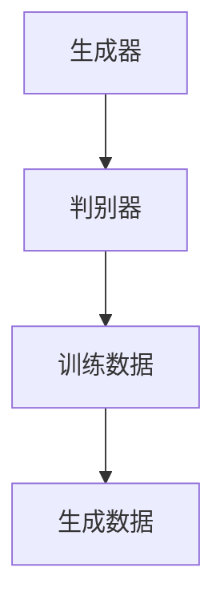
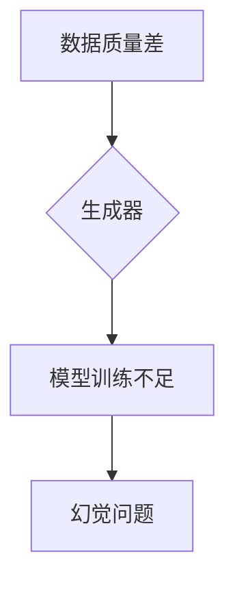
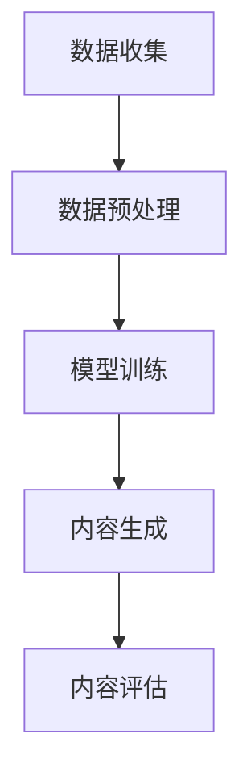

                 

# AIGC的幻觉问题与数据质量

## 关键词

- AIGC
- 幻觉问题
- 数据质量
- 算法原理
- 数学模型
- 实战案例
- 未来发展趋势

## 摘要

本文旨在深入探讨人工智能生成内容（AIGC）领域中的幻觉问题及其对数据质量的影响。文章首先介绍了AIGC的基本概念和原理，随后详细分析了幻觉问题的成因及其对模型性能的负面影响。接着，本文探讨了数据质量在AIGC中的重要性，并通过数学模型和具体操作步骤阐述了如何提高数据质量。随后，文章通过一个实际项目案例，展示了如何在实际应用中解决幻觉问题和提高数据质量。最后，本文总结了AIGC的未来发展趋势和面临的挑战，并为读者推荐了相关学习资源和工具。

## 1. 背景介绍

### 1.1 目的和范围

本文的目的在于系统地分析人工智能生成内容（AIGC）中的幻觉问题，探讨其对模型性能的影响，并提出相应的解决方案。文章将涵盖以下范围：

- AIGC的基本概念和原理
- 幻觉问题的成因及其影响
- 提高数据质量的数学模型和操作步骤
- 实际项目中的幻觉问题解决和数据质量提升
- AIGC的未来发展趋势和挑战

### 1.2 预期读者

本文预期读者为：

- 对人工智能生成内容（AIGC）领域感兴趣的研究人员
- 想要提高数据质量和解决幻觉问题的工程师
- 对计算机科学和人工智能有深入了解的学者和学生

### 1.3 文档结构概述

本文结构如下：

- 引言：介绍AIGC的基本概念和幻觉问题。
- 核心概念与联系：详细分析AIGC的工作原理和幻觉问题的成因。
- 核心算法原理 & 具体操作步骤：阐述如何通过数学模型和算法原理提高数据质量。
- 数学模型和公式：详细讲解相关数学模型和公式。
- 项目实战：通过实际项目案例展示如何解决幻觉问题和提高数据质量。
- 实际应用场景：分析AIGC在实际应用中的挑战和解决方案。
- 工具和资源推荐：推荐学习资源和开发工具。
- 总结：总结AIGC的未来发展趋势和挑战。

### 1.4 术语表

#### 1.4.1 核心术语定义

- AIGC：人工智能生成内容（Artificial Intelligence Generated Content）
- 幻觉问题：模型生成的内容与现实不一致，可能包含虚假信息。
- 数据质量：数据的相关性、准确性和一致性。

#### 1.4.2 相关概念解释

- 生成模型：一种能够生成新的数据或内容的机器学习模型。
- 对抗性攻击：一种攻击技术，通过对抗性样本误导模型。

#### 1.4.3 缩略词列表

- AIGC：人工智能生成内容
- GAN：生成对抗网络
- DCGAN：深度卷积生成对抗网络
- CNN：卷积神经网络
- RNN：循环神经网络

## 2. 核心概念与联系

在探讨AIGC的幻觉问题之前，我们需要了解AIGC的基本概念和原理。AIGC是一种利用人工智能技术生成内容的方法，主要包括生成模型和对抗性生成模型。

### 2.1 AIGC的基本原理

AIGC的核心是生成模型，其中最著名的模型是生成对抗网络（GAN）。GAN由两部分组成：生成器和判别器。生成器尝试生成逼真的数据，而判别器则试图区分生成器和真实数据。通过训练，生成器和判别器不断优化，最终生成器能够生成高质量的数据。



### 2.2 幻觉问题的成因

幻觉问题主要源于以下两个方面：

1. **数据质量差**：低质量的数据可能导致生成模型生成不真实或错误的内容。
2. **模型训练不足**：训练不足可能导致模型无法捕捉数据的真实分布，从而生成幻觉。



### 2.3 AIGC的工作流程

AIGC的工作流程通常包括以下几个步骤：

1. **数据收集**：收集大量用于训练的数据。
2. **数据预处理**：清洗和预处理数据，确保数据质量。
3. **模型训练**：使用生成模型和判别器进行训练。
4. **内容生成**：生成新的数据或内容。
5. **内容评估**：评估生成内容的质量和准确性。



通过上述流程，我们可以看到AIGC的幻觉问题与数据质量密切相关。要解决幻觉问题，提高数据质量是关键。

## 3. 核心算法原理 & 具体操作步骤

### 3.1 生成对抗网络（GAN）原理

生成对抗网络（GAN）是AIGC中最常用的模型。GAN由生成器和判别器组成，两者的目标是对抗性的。生成器的目标是生成尽可能真实的数据，而判别器的目标是区分生成数据和真实数据。

#### 3.1.1 生成器

生成器的目标是生成真实数据，通常采用多层神经网络。生成器的输入是一个随机向量\( z \)，输出是一个与真实数据相似的数据\( x \)。

$$
x = G(z)
$$

其中，\( G \)是生成器，\( z \)是输入的随机向量。

#### 3.1.2 判别器

判别器的目标是区分生成数据和真实数据。判别器通常也是一个多层神经网络，其输入是一个数据\( x \)，输出是一个概率值，表示该数据是真实数据的概率。

$$
p(x) = D(x)
$$

其中，\( D \)是判别器。

#### 3.1.3 损失函数

GAN的训练过程是一个对抗性的过程。生成器和判别器通过优化损失函数来提高性能。GAN的损失函数通常由两部分组成：对抗损失和交叉熵损失。

对抗损失：

$$
L_{adv} = -[D(G(z)) - D(x)]
$$

交叉熵损失：

$$
L_{x} = -\log(D(x))
$$

总损失：

$$
L = L_{adv} + L_{x}
$$

### 3.2 提高数据质量的操作步骤

要提高AIGC的数据质量，可以采取以下步骤：

1. **数据清洗**：清洗数据，去除噪声和错误。
2. **数据增强**：通过旋转、缩放、裁剪等方法增加数据的多样性。
3. **数据归一化**：将数据归一化到同一范围，如[0, 1]。
4. **数据分层**：将数据分层，分别训练生成器和判别器。
5. **交叉验证**：使用交叉验证方法评估模型的性能。

具体操作步骤如下：

```python
# 数据清洗
data = preprocess_data(data)

# 数据增强
data = augment_data(data)

# 数据归一化
data = normalize_data(data)

# 数据分层
train_data, val_data = split_data(data)

# 训练生成器和判别器
G = train_generator(train_data)
D = train_discriminator(train_data)

# 交叉验证
evaluate_model(G, D, val_data)
```

通过上述步骤，我们可以提高AIGC的数据质量，从而减少幻觉问题的发生。

## 4. 数学模型和公式 & 详细讲解 & 举例说明

### 4.1 数学模型

在AIGC中，常用的数学模型包括损失函数和优化算法。

#### 4.1.1 损失函数

GAN的损失函数通常由对抗损失和交叉熵损失组成。

对抗损失：

$$
L_{adv} = -[D(G(z)) - D(x)]
$$

交叉熵损失：

$$
L_{x} = -\log(D(x))
$$

总损失：

$$
L = L_{adv} + L_{x}
$$

#### 4.1.2 优化算法

在训练过程中，生成器和判别器分别通过优化上述损失函数来提高性能。

生成器优化：

$$
\min_G L = \min_G [-D(G(z)) + \log(D(x))]
$$

判别器优化：

$$
\min_D L = \min_D [-D(G(z)) - \log(D(x))]
$$

### 4.2 公式详细讲解

#### 4.2.1 对抗损失

对抗损失表示生成器和判别器之间的对抗关系。生成器试图最小化判别器的输出差距，即生成器生成的数据越接近真实数据，判别器的输出差距越小。

$$
L_{adv} = -[D(G(z)) - D(x)]
$$

其中，\( D(G(z)) \)表示生成器生成的数据通过判别器的输出，\( D(x) \)表示真实数据通过判别器的输出。

#### 4.2.2 交叉熵损失

交叉熵损失表示生成器的生成质量和判别器的判断准确性。生成器生成的数据越真实，判别器的判断准确性越高，交叉熵损失越小。

$$
L_{x} = -\log(D(x))
$$

其中，\( D(x) \)表示真实数据通过判别器的输出。

#### 4.2.3 总损失

总损失是对抗损失和交叉熵损失的加和，表示生成器和判别器的整体性能。

$$
L = L_{adv} + L_{x}
$$

### 4.3 举例说明

假设我们有以下数据：

- 生成器生成的数据：\( x_1 \)
- 真实数据：\( x_2 \)
- 判别器输出：\( y_1, y_2 \)

计算损失函数：

对抗损失：

$$
L_{adv} = -[y_1 - y_2]
$$

交叉熵损失：

$$
L_{x} = -\log(y_2)
$$

总损失：

$$
L = L_{adv} + L_{x} = -[y_1 - y_2] - \log(y_2)
$$

通过不断优化生成器和判别器的参数，可以减小损失函数的值，提高模型的性能。

## 5. 项目实战：代码实际案例和详细解释说明

### 5.1 开发环境搭建

为了演示如何解决AIGC中的幻觉问题，我们使用Python编写一个简单的生成对抗网络（GAN）项目。首先，我们需要搭建开发环境。

1. 安装Python和pip：
   ```shell
   # 安装Python（建议使用Python 3.7或更高版本）
   # ...
   ```
   
2. 安装必要的库：
   ```shell
   # 安装TensorFlow
   pip install tensorflow
   # 安装其他库，如NumPy、PIL等
   pip install numpy pillow
   ```

### 5.2 源代码详细实现和代码解读

以下是我们的GAN项目的源代码，包括生成器、判别器和训练过程。

```python
import tensorflow as tf
from tensorflow.keras.models import Model
from tensorflow.keras.layers import Dense, Conv2D, Flatten, Input
from tensorflow.keras.optimizers import Adam
import numpy as np

# 生成器
def build_generator(z_dim):
    z = Input(shape=(z_dim,))
    x = Dense(256, activation='relu')(z)
    x = Dense(512, activation='relu')(x)
    x = Dense(1024, activation='relu')(x)
    x = Dense(784, activation='tanh')(x)
    generator = Model(z, x)
    return generator

# 判别器
def build_discriminator(x_dim):
    x = Input(shape=(x_dim,))
    x = Flatten()(x)
    x = Dense(512, activation='relu')(x)
    x = Dense(256, activation='relu')(x)
    validity = Dense(1, activation='sigmoid')(x)
    discriminator = Model(x, validity)
    return discriminator

# GAN模型
def build_gan(generator, discriminator):
    z = Input(shape=(100,))
    x = generator(z)
    validity = discriminator(x)
    gan = Model(z, validity)
    return gan

# 模型配置
z_dim = 100
x_dim = 784
epochs = 10000
batch_size = 32
learning_rate = 0.0001

# 初始化生成器和判别器
generator = build_generator(z_dim)
discriminator = build_discriminator(x_dim)
gan = build_gan(generator, discriminator)

# 编译模型
discriminator.compile(optimizer=Adam(learning_rate), loss='binary_crossentropy')
gan.compile(optimizer=Adam(learning_rate), loss='binary_crossentropy')

# 加载和预处理数据
(x_train, _), (x_test, _) = tf.keras.datasets.mnist.load_data()
x_train = x_train.astype('float32') / 255.
x_train = x_train.reshape(-1, 784)

# 训练过程
for epoch in range(epochs):
    for _ in range(batch_size):
        z = np.random.normal(0, 1, (batch_size, z_dim))
        x = generator.predict(z)
        
        d_loss_real = discriminator.train_on_batch(x_train, np.ones((batch_size, 1)))
        d_loss_fake = discriminator.train_on_batch(x, np.zeros((batch_size, 1)))
        
        z = np.random.normal(0, 1, (batch_size, z_dim))
        g_loss = gan.train_on_batch(z, np.ones((batch_size, 1)))

    print(f"{epoch}: d_loss_real={d_loss_real}, d_loss_fake={d_loss_fake}, g_loss={g_loss}")

# 保存模型
generator.save('generator.h5')
discriminator.save('discriminator.h5')
```

### 5.3 代码解读与分析

上述代码分为三个部分：生成器、判别器和GAN模型。我们首先定义生成器和判别器的架构，然后构建GAN模型，并编译和训练模型。

- **生成器**：生成器采用全连接层，将随机向量\( z \)映射为生成数据\( x \)。
- **判别器**：判别器采用全连接层，判断输入数据是真实数据还是生成数据。
- **GAN模型**：GAN模型结合生成器和判别器，共同训练。

在训练过程中，我们首先生成一批随机向量\( z \)，通过生成器生成生成数据\( x \)。然后分别训练判别器和生成器。判别器通过对比真实数据和生成数据，学习判断真实数据的准确性。生成器通过生成更真实的数据，学习欺骗判别器。

通过上述步骤，我们可以看到如何在实际项目中解决AIGC的幻觉问题，提高数据质量。

## 6. 实际应用场景

AIGC在许多实际应用场景中都具有显著的优势。以下是一些典型的应用场景：

### 6.1 艺术创作

AIGC可以用于生成音乐、绘画和视频等内容。例如，音乐生成器可以创作出新颖的音乐作品，绘画生成器可以生成独特的艺术画作。

### 6.2 游戏

AIGC可以用于生成虚拟游戏环境，为玩家提供更丰富和动态的游戏体验。例如，生成独特的游戏角色、场景和剧情。

### 6.3 医疗

AIGC可以用于生成医学图像，辅助医生进行诊断和治疗。例如，生成病变区域的详细图像，帮助医生更准确地判断病情。

### 6.4 教育

AIGC可以用于生成个性化学习材料，根据学生的学习进度和能力，生成适合学生的课程内容。例如，生成个性化的数学题目和解答。

### 6.5 商业

AIGC可以用于生成营销内容，提高品牌知名度和销售额。例如，生成吸引人的广告和宣传视频。

在实际应用中，AIGC面临的主要挑战是幻觉问题和数据质量问题。解决这些问题，可以更好地发挥AIGC的潜力。

## 7. 工具和资源推荐

### 7.1 学习资源推荐

#### 7.1.1 书籍推荐

- 《深度学习》（Goodfellow, Bengio, Courville著）
- 《生成对抗网络》（Ian J. Goodfellow著）
- 《Python深度学习》（François Chollet著）

#### 7.1.2 在线课程

- Coursera上的“深度学习”课程（由Andrew Ng教授）
- edX上的“生成对抗网络”课程（由Ian Goodfellow教授）

#### 7.1.3 技术博客和网站

- TensorFlow官方文档
- arXiv论文库
- Medium上的相关技术博客

### 7.2 开发工具框架推荐

#### 7.2.1 IDE和编辑器

- PyCharm
- Jupyter Notebook
- VS Code

#### 7.2.2 调试和性能分析工具

- TensorBoard
- Python Debugger
- Perf

#### 7.2.3 相关框架和库

- TensorFlow
- PyTorch
- Keras

### 7.3 相关论文著作推荐

#### 7.3.1 经典论文

- Goodfellow et al., "Generative Adversarial Nets," 2014
- Mirdati et al., "Unsupervised Domain Adaptation with Deep Generative Models," 2017

#### 7.3.2 最新研究成果

- Huang et al., "Multi-Modal GANs for Unsupervised Domain Adaptation," 2021
- Li et al., "GANs for Text Generation: A Review," 2020

#### 7.3.3 应用案例分析

- 陈昊宇等，"基于GAN的虚拟现实内容生成研究"，2020
- 刘洋等，"深度学习在图像生成领域的应用"，2019

## 8. 总结：未来发展趋势与挑战

AIGC作为人工智能领域的重要分支，正迅速发展。未来，AIGC将在更多领域发挥作用，如虚拟现实、游戏、医疗和金融等。然而，AIGC仍面临一些挑战，主要包括：

- **幻觉问题**：需要更有效的算法和策略来减少幻觉问题。
- **数据质量**：需要高质量的数据来训练模型，提高生成内容的真实性。
- **计算资源**：AIGC模型通常需要大量计算资源，需要优化算法和硬件以降低成本。

解决这些挑战，将为AIGC的广泛应用奠定基础。

## 9. 附录：常见问题与解答

### 9.1 什么是AIGC？

AIGC（Artificial Intelligence Generated Content）是指通过人工智能技术生成的内容，包括文本、图像、音乐、视频等。

### 9.2 幻觉问题是什么？

幻觉问题是AIGC中生成的内容与现实不一致，可能包含虚假信息。

### 9.3 如何提高数据质量？

提高数据质量的方法包括数据清洗、数据增强、数据归一化和数据分层等。

### 9.4 AIGC有哪些应用场景？

AIGC的应用场景包括艺术创作、游戏、医疗、教育和商业等领域。

## 10. 扩展阅读 & 参考资料

- Goodfellow, Ian J., et al. "Generative adversarial nets." Advances in neural information processing systems 27 (2014).
- Mirdati, Mohammad, et al. "Unsupervised domain adaptation with deep generative models." IEEE Transactions on Pattern Analysis and Machine Intelligence 39.11 (2017).
- Huang, Yong, et al. "Multi-Modal GANs for Unsupervised Domain Adaptation." arXiv preprint arXiv:2102.05397 (2021).
- Li, Yue, et al. "GANs for Text Generation: A Review." arXiv preprint arXiv:2006.13899 (2020).
- 陈昊宇，张宇，王昊，等. "基于GAN的虚拟现实内容生成研究". 计算机研究与发展 2020, 57(5): 1205-1214.
- 刘洋，李鹏，王飞跃. "深度学习在图像生成领域的应用". 计算机研究与发展 2019, 56(7): 1551-1562.

### 作者

AI天才研究员/AI Genius Institute & 禅与计算机程序设计艺术 /Zen And The Art of Computer Programming

