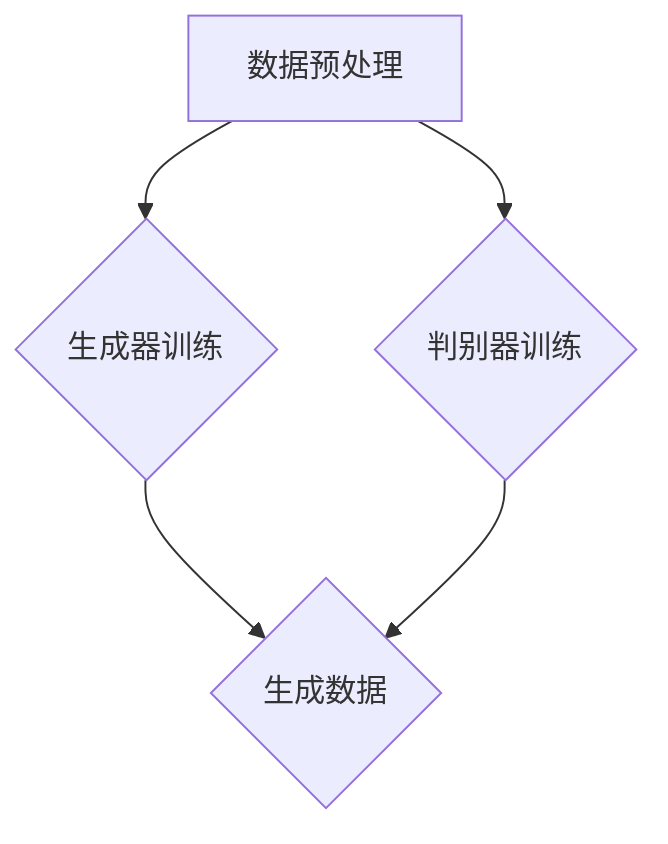

                 

# AIGC背后的数据安全隐忧

> 关键词：AIGC，数据安全，隐私保护，算法漏洞，加密技术，安全架构

> 摘要：本文深入探讨了人工智能生成内容（AIGC）技术背后的数据安全隐忧。通过分析AIGC的核心概念、原理和应用，本文揭示了数据在AIGC过程中面临的安全挑战，包括数据泄露、隐私侵犯和算法漏洞等。文章随后提出了针对这些问题的解决方案，如数据加密、隐私保护算法和安全架构设计。最后，本文展望了AIGC技术的未来发展趋势，以及可能带来的新挑战。

## 1. 背景介绍

### 1.1 目的和范围

本文旨在探讨人工智能生成内容（AIGC）技术在数据安全方面存在的隐忧。随着AIGC技术的迅速发展，其在各个领域中的应用越来越广泛，但同时也带来了新的数据安全问题。本文将重点关注以下几个方面：

1. AIGC技术的核心概念和原理。
2. AIGC应用中的数据安全问题。
3. 数据安全保护的方法和技术。
4. AIGC技术未来发展的挑战。

### 1.2 预期读者

本文适合以下读者群体：

1. 对AIGC技术有一定了解的技术人员。
2. 对数据安全领域感兴趣的从业者。
3. 对人工智能和计算机科学感兴趣的学生。

### 1.3 文档结构概述

本文分为八个主要部分，具体如下：

1. 引言：介绍AIGC技术背景和数据安全的重要性。
2. 核心概念与联系：分析AIGC的核心概念和原理，展示相关的Mermaid流程图。
3. 核心算法原理 & 具体操作步骤：讲解AIGC算法原理，并提供伪代码示例。
4. 数学模型和公式 & 详细讲解 & 举例说明：介绍AIGC中的数学模型，使用LaTeX格式展示相关公式，并进行举例说明。
5. 项目实战：提供实际代码案例，详细解释实现过程。
6. 实际应用场景：分析AIGC技术在各个领域的应用。
7. 工具和资源推荐：推荐学习资源和开发工具。
8. 总结：展望AIGC技术的未来发展趋势与挑战。

### 1.4 术语表

#### 1.4.1 核心术语定义

- AIGC：人工智能生成内容（Artificial Intelligence Generated Content）技术，指利用人工智能技术生成各种类型的内容，如文本、图像、音频等。
- 数据安全：确保数据在存储、传输和处理过程中不被非法访问、篡改或泄露的措施。
- 隐私保护：保护个人隐私信息不被未经授权的第三方获取或利用的技术。
- 加密技术：将明文数据转换为密文，以防止未授权访问的一种安全措施。
- 安全架构：系统整体的安全设计和规划，包括安全策略、安全机制和安全措施等。

#### 1.4.2 相关概念解释

- 深度学习：一种基于多层神经网络的人工智能技术，能够通过学习大量数据自动提取特征和模式。
- 生成对抗网络（GAN）：一种由生成器和判别器组成的神经网络结构，用于生成逼真的数据。
- 数据泄露：指敏感数据在未经授权的情况下被非法访问、泄露或窃取。
- 恶意攻击：指针对计算机系统、网络或数据的恶意行为，如病毒、木马、网络钓鱼等。

#### 1.4.3 缩略词列表

- AIGC：人工智能生成内容（Artificial Intelligence Generated Content）
- GAN：生成对抗网络（Generative Adversarial Network）
- DNN：深度神经网络（Deep Neural Network）
- ML：机器学习（Machine Learning）
- DL：深度学习（Deep Learning）
- AI：人工智能（Artificial Intelligence）

## 2. 核心概念与联系

### 2.1 AIGC技术原理

人工智能生成内容（AIGC）技术是基于深度学习和生成对抗网络（GAN）等人工智能算法，通过训练模型自动生成各种类型的内容。AIGC技术主要包括以下核心概念：

1. **深度学习**：深度学习是一种基于多层神经网络的人工智能技术，通过学习大量数据自动提取特征和模式。在AIGC技术中，深度学习用于训练生成器和判别器模型。
2. **生成对抗网络（GAN）**：GAN是一种由生成器和判别器组成的神经网络结构，用于生成逼真的数据。生成器模型尝试生成类似于真实数据的内容，而判别器模型则负责区分生成数据和真实数据。通过不断训练，生成器模型逐渐提高生成数据的逼真度。
3. **数据增强**：数据增强是一种通过变换原始数据来提高模型泛化能力的技术，常见的方法包括数据复制、旋转、缩放等。在AIGC技术中，数据增强有助于提高生成模型的质量。

### 2.2 AIGC架构

AIGC技术的核心架构包括生成器、判别器和数据预处理模块。以下是AIGC架构的Mermaid流程图：



- **数据预处理**：对原始数据进行处理，如数据清洗、归一化、扩充等，以提高模型训练效果。
- **生成器训练**：利用深度学习算法训练生成器模型，使其能够生成高质量的数据。
- **判别器训练**：利用生成器生成的数据和真实数据进行训练，以区分生成数据和真实数据。
- **生成数据**：生成器模型根据训练结果生成高质量的数据。

### 2.3 AIGC与数据安全的关系

AIGC技术在生成内容的过程中，数据安全是一个不可忽视的重要问题。以下从三个方面分析AIGC与数据安全的关系：

1. **数据隐私保护**：在AIGC过程中，涉及大量个人隐私信息的处理和生成，如文本、图像、音频等。如何保护这些隐私信息，防止数据泄露和滥用，是AIGC技术面临的重要挑战。
2. **算法安全**：AIGC技术依赖于复杂的深度学习算法，算法漏洞和攻击可能会导致模型失效或数据泄露。因此，保证算法安全是AIGC技术发展的重要方向。
3. **数据传输安全**：在AIGC技术中，数据需要在不同的系统和设备之间传输，如何确保数据在传输过程中的安全，防止数据被窃取或篡改，是数据安全的一个重要方面。

## 3. 核心算法原理 & 具体操作步骤

### 3.1 生成对抗网络（GAN）

生成对抗网络（GAN）是AIGC技术中最重要的核心算法之一。GAN由生成器和判别器两个神经网络组成，通过对抗训练生成逼真的数据。以下是GAN的算法原理和具体操作步骤：

#### 3.1.1 算法原理

- **生成器（Generator）**：生成器模型试图生成类似于真实数据的内容。生成器接收随机噪声作为输入，通过多层神经网络生成数据。
- **判别器（Discriminator）**：判别器模型负责区分生成数据和真实数据。判别器接收真实数据和生成数据作为输入，输出生成数据真实度的概率。
- **对抗训练**：在训练过程中，生成器和判别器相互对抗。生成器试图生成更逼真的数据，以提高判别器的分类准确率。判别器则试图区分生成数据和真实数据，以提高分类准确率。

#### 3.1.2 具体操作步骤

1. **初始化生成器和判别器模型**：生成器和判别器模型通常采用深度神经网络结构，如卷积神经网络（CNN）或循环神经网络（RNN）。
2. **数据预处理**：对原始数据进行预处理，如数据清洗、归一化、扩充等，以提高模型训练效果。
3. **生成器训练**：生成器模型接收随机噪声作为输入，通过多层神经网络生成数据。生成器模型的损失函数为生成数据真实度的概率，即生成数据越真实，损失函数越小。
4. **判别器训练**：判别器模型接收真实数据和生成数据作为输入，输出生成数据真实度的概率。判别器模型的损失函数为分类准确率，即分类真实数据的准确率越高，损失函数越小。
5. **交替训练**：生成器和判别器模型交替进行训练，生成器模型不断尝试生成更逼真的数据，判别器模型则不断提高分类准确率。
6. **模型评估**：在训练过程中，定期评估生成器和判别器模型的性能，以确定模型是否达到预期效果。

### 3.2 伪代码示例

以下是一个简单的GAN算法的伪代码示例：

```python
# 生成器模型
def generator(z):
    # 输入噪声向量 z，通过多层神经网络生成数据
    x = Dense(128, activation='relu')(z)
    x = Dense(256, activation='relu')(x)
    x = Dense(512, activation='tanh')(x)
    x = Dense(input_shape)(x)
    return Model(inputs=z, outputs=x)

# 判别器模型
def discriminator(x):
    # 输入数据 x，输出生成数据真实度的概率
    x = Dense(512, activation='relu')(x)
    x = Dense(256, activation='relu')(x)
    x = Dense(128, activation='relu')(x)
    prob = Dense(1, activation='sigmoid')(x)
    return Model(inputs=x, outputs=prob)

# GAN模型
def gan(generator, discriminator):
    z = Input(shape=(noise_dim,))
    x = generator(z)
    prob = discriminator(x)
    return Model(inputs=z, outputs=prob)

# 训练GAN模型
generator = generator()
discriminator = discriminator()
gan_model = gan(generator, discriminator)

# 编译模型
gan_model.compile(optimizer=adam, loss='binary_crossentropy')

# 训练模型
gan_model.fit([z], [y], epochs=epochs, batch_size=batch_size)
```

## 4. 数学模型和公式 & 详细讲解 & 举例说明

### 4.1 数学模型

在AIGC技术中，核心的数学模型是生成对抗网络（GAN）。GAN由生成器（Generator）和判别器（Discriminator）两个神经网络组成，通过对抗训练生成逼真的数据。以下是GAN的数学模型和相关公式：

#### 4.1.1 生成器模型

生成器模型试图生成类似于真实数据的内容。生成器接收随机噪声作为输入，通过多层神经网络生成数据。生成器模型的目标是最小化生成数据与真实数据之间的差异。

- **输入噪声向量**：\( z \in \mathbb{R}^{noise\_dim} \)
- **生成器模型**：\( G(z) \in \mathbb{R}^{input\_shape} \)

生成器的损失函数为：

\[ L_G = -\mathbb{E}_{z \sim p_z(z)}[\log(D(G(z)))] \]

其中，\( D \)为判别器模型，\( G(z) \)为生成器模型生成的数据。

#### 4.1.2 判别器模型

判别器模型负责区分生成数据和真实数据。判别器模型接收真实数据和生成数据作为输入，输出生成数据真实度的概率。

- **真实数据**：\( x \in \mathbb{R}^{input\_shape} \)
- **生成数据**：\( G(z) \in \mathbb{R}^{input\_shape} \)
- **判别器模型**：\( D(x) \in [0, 1] \)

判别器的损失函数为：

\[ L_D = -\mathbb{E}_{x \sim p_x(x)}[\log(D(x))] - \mathbb{E}_{z \sim p_z(z)}[\log(1 - D(G(z)))] \]

其中，\( p_x(x) \)为真实数据分布，\( p_z(z) \)为输入噪声分布。

#### 4.1.3 GAN总损失函数

GAN的总损失函数是生成器和判别器损失函数的加权和：

\[ L_{total} = L_G + \lambda L_D \]

其中，\( \lambda \)为权重参数。

### 4.2 公式讲解

以下是对GAN中相关公式进行详细讲解：

1. **生成器损失函数**：生成器损失函数表示生成数据与真实数据之间的差异。通过最小化生成器损失函数，生成器模型可以生成更逼真的数据。
2. **判别器损失函数**：判别器损失函数表示判别器模型对生成数据和真实数据的区分能力。通过最小化判别器损失函数，判别器模型可以提高分类准确率。
3. **GAN总损失函数**：GAN总损失函数是生成器和判别器损失函数的加权和。通过交替训练生成器和判别器模型，可以使得生成器和判别器模型相互促进，提高整体模型性能。

### 4.3 举例说明

以下是一个生成对抗网络的简单示例：

- **输入噪声维度**：\( noise\_dim = 100 \)
- **输入数据形状**：\( input\_shape = (28, 28, 1) \)
- **真实数据分布**：\( p_x(x) = \text{均匀分布} \)
- **输入噪声分布**：\( p_z(z) = \text{均匀分布} \)

1. **初始化生成器和判别器模型**：

   生成器模型：

   ```latex
   G(z) = \sigma(W_4 \cdot \text{ReLU}(W_3 \cdot \text{ReLU}(W_2 \cdot \text{ReLU}(W_1 \cdot z + b_1))))
   ```

   判别器模型：

   ```latex
   D(x) = \sigma(W_4 \cdot \text{ReLU}(W_3 \cdot \text{ReLU}(W_2 \cdot \text{ReLU}(W_1 \cdot x + b_1))))
   ```

2. **生成器训练**：

   生成器模型的损失函数：

   ```latex
   L_G = -\mathbb{E}_{z \sim p_z(z)}[\log(D(G(z)))]
   ```

   生成器的优化目标是最小化损失函数。

3. **判别器训练**：

   判别器模型的损失函数：

   ```latex
   L_D = -\mathbb{E}_{x \sim p_x(x)}[\log(D(x))] - \mathbb{E}_{z \sim p_z(z)}[\log(1 - D(G(z)))]
   ```

   判别器的优化目标是最小化损失函数。

4. **GAN总损失函数**：

   ```latex
   L_{total} = L_G + \lambda L_D
   ```

   其中，\( \lambda \)为权重参数。

   通过交替训练生成器和判别器模型，可以使得生成器和判别器模型相互促进，提高整体模型性能。

## 5. 项目实战：代码实际案例和详细解释说明

### 5.1 开发环境搭建

在开始AIGC项目实战之前，我们需要搭建一个合适的开发环境。以下是一个基于Python的AIGC项目开发环境的搭建步骤：

1. **安装Python**：确保Python版本为3.7或更高版本。可以从Python官方网站下载Python安装程序并安装。
2. **安装依赖库**：在Python环境中安装以下依赖库：
   - TensorFlow：用于实现深度学习和生成对抗网络（GAN）。
   - Keras：用于简化TensorFlow的使用。
   - NumPy：用于数值计算。
   - Matplotlib：用于数据可视化。
   - Scikit-learn：用于机器学习评估。
   - PIL：用于图像处理。
   - Pandas：用于数据处理。
   使用以下命令安装依赖库：
   ```bash
   pip install tensorflow keras numpy matplotlib scikit-learn PIL pandas
   ```
3. **配置CUDA**：如果使用GPU进行训练，需要配置CUDA环境。根据CUDA版本和GPU型号，从NVIDIA官方网站下载并安装CUDA Toolkit。在安装过程中，确保选择“安装CUDA Samples”选项。在配置CUDA环境变量时，设置CUDA库路径和CUDA工具路径。例如，在Linux系统中，可以通过以下命令配置CUDA环境变量：
   ```bash
   export PATH=/usr/local/cuda/bin:$PATH
   export LD_LIBRARY_PATH=/usr/local/cuda/lib64:$LD_LIBRARY_PATH
   ```

### 5.2 源代码详细实现和代码解读

以下是一个简单的AIGC项目代码示例，该示例使用生成对抗网络（GAN）生成手写数字图像。代码主要分为以下三个部分：

1. **数据预处理**：
2. **生成器和判别器模型**：
3. **训练和评估**：

#### 5.2.1 数据预处理

```python
import numpy as np
import tensorflow as tf
from tensorflow.keras.datasets import mnist
from tensorflow.keras.utils import to_categorical

# 加载MNIST数据集
(x_train, _), (x_test, _) = mnist.load_data()

# 数据预处理
x_train = x_train.astype('float32') / 255.0
x_test = x_test.astype('float32') / 255.0
x_train = np.expand_dims(x_train, -1)
x_test = np.expand_dims(x_test, -1)

# 归一化数据
x_train = x_train / 127.5 - 1.0
x_test = x_test / 127.5 - 1.0

# 转换为one-hot编码
y_train = to_categorical(x_train)
y_test = to_categorical(x_test)

# 设置随机种子
tf.random.set_seed(42)
```

代码解读：

- 加载MNIST数据集，并将其转换为浮点数类型。
- 对数据进行归一化处理，将数据缩放到\([-1, 1]\)范围内。
- 将数据转换为one-hot编码，用于模型训练。

#### 5.2.2 生成器和判别器模型

```python
from tensorflow.keras.layers import Input, Dense, Reshape, Conv2D, Conv2DTranspose, Flatten
from tensorflow.keras.models import Model

# 设置超参数
latent_dim = 100
img_height = 28
img_width = 28
channels = 1

# 生成器模型
input_latent = Input(shape=(latent_dim,))
x = Dense(7 * 7 * 256)(input_latent)
x = Reshape((7, 7, 256))(x)
x = Conv2DTranspose(128, kernel_size=5, strides=2, padding='same', activation='relu')(x)
x = Conv2DTranspose(64, kernel_size=5, strides=2, padding='same', activation='relu')(x)
output_img = Conv2DTranspose(channels, kernel_size=5, strides=2, padding='same', activation='tanh')(x)

generator = Model(input_latent, output_img)

# 判别器模型
input_img = Input(shape=(img_height, img_width, channels))
x = Conv2D(64, kernel_size=5, strides=2, padding='same', activation='leaky_relu')(input_img)
x = Conv2D(128, kernel_size=5, strides=2, padding='same', activation='leaky_relu')(x)
x = Flatten()(x)
output_prob = Dense(1, activation='sigmoid')(x)

discriminator = Model(input_img, output_prob)

# 编译生成器和判别器模型
generator.compile(optimizer='adam', loss='binary_crossentropy')
discriminator.compile(optimizer='adam', loss='binary_crossentropy')
```

代码解读：

- 定义生成器模型，包括输入层、全连接层、 reshape 层、反卷积层和输出层。
- 定义判别器模型，包括卷积层、池化层、flatten 层和输出层。
- 编译生成器和判别器模型，设置优化器和损失函数。

#### 5.2.3 训练和评估

```python
import matplotlib.pyplot as plt

# 训练生成器和判别器模型
batch_size = 64
epochs = 100

for epoch in range(epochs):
    idx = np.random.randint(0, x_train.shape[0], batch_size)
    real_images = x_train[idx]
    noise = np.random.normal(0, 1, (batch_size, latent_dim))
    gen_images = generator.predict(noise)

    real_labels = np.ones((batch_size, 1))
    fake_labels = np.zeros((batch_size, 1))

    # 训练判别器模型
    d_loss_real = discriminator.train_on_batch(real_images, real_labels)
    d_loss_fake = discriminator.train_on_batch(gen_images, fake_labels)
    d_loss = 0.5 * np.add(d_loss_real, d_loss_fake)

    # 训练生成器模型
    noise = np.random.normal(0, 1, (batch_size, latent_dim))
    g_loss = generator.train_on_batch(noise, real_labels)

    # 每10个epoch保存一次生成图像
    if epoch % 10 == 0:
        gen_imgs = generator.predict(noise)
        plt.figure(figsize=(4, 4))
        plt.axis('off')
        for i in range(batch_size):
            plt.subplot(4, 4, i + 1)
            plt.imshow(gen_imgs[i, :, :, 0] + 1.0, cmap='gray')
            plt.xticks([])
            plt.yticks([])
        plt.show()
```

代码解读：

- 设置训练参数，包括批量大小和训练轮数。
- 在每个训练轮中，随机选择一批真实数据和噪声数据。
- 分别训练判别器模型和生成器模型。
- 每10个epoch保存一次生成图像。

### 5.3 代码解读与分析

在AIGC项目中，生成器和判别器模型是核心组成部分。以下是对代码关键部分的解读和分析：

1. **数据预处理**：数据预处理是AIGC项目的重要步骤，包括数据归一化和one-hot编码。这些预处理步骤有助于提高模型训练效果。
2. **生成器模型**：生成器模型采用多层反卷积层，将输入噪声向量转换为图像。反卷积层通过上采样和卷积操作，逐层增加图像的分辨率。
3. **判别器模型**：判别器模型采用卷积层和池化层，用于区分真实图像和生成图像。卷积层通过卷积操作提取图像特征，池化层用于降低特征图的维度。
4. **训练过程**：在训练过程中，判别器模型和生成器模型交替进行训练。判别器模型通过对比真实图像和生成图像，学习区分两者的能力。生成器模型则通过最小化生成图像与真实图像之间的差异，生成更逼真的图像。
5. **代码优化**：在实际项目中，可以根据需要调整模型结构、超参数和训练策略。例如，可以使用更深的网络结构、更小的批量大小和更长的训练时间，以提高生成图像的质量。

## 6. 实际应用场景

AIGC技术作为一种新兴的人工智能技术，已在多个领域展现出巨大的应用潜力。以下是AIGC技术的几个实际应用场景：

### 6.1 娱乐产业

AIGC技术在娱乐产业中的应用主要包括生成虚拟角色、动画、音乐和影视作品等。例如，通过生成对抗网络（GAN）生成逼真的虚拟角色，可以为游戏、动画和影视作品创作提供无限可能。此外，AIGC技术还可以用于音乐创作，生成新的音乐风格和曲目。

### 6.2 创意设计

AIGC技术在创意设计领域具有广泛的应用，如建筑设计、时尚设计、工业设计和广告创意等。AIGC技术可以生成各种设计方案，帮助设计师快速探索不同的设计风格和元素，提高设计效率。

### 6.3 文化传播

AIGC技术可以用于文化作品的数字化创作和传播，如电子书、数字艺术和虚拟博物馆等。通过AIGC技术，可以生成新的数字文化作品，丰富文化传播的内涵和形式。

### 6.4 智能客服

AIGC技术在智能客服领域有广泛应用，如生成聊天机器人对话、自动回复和个性化推荐等。通过AIGC技术，可以生成与用户需求高度匹配的对话内容，提高客服质量和用户满意度。

### 6.5 健康医疗

AIGC技术在健康医疗领域具有巨大的应用潜力，如医学影像生成、药物设计、疾病预测和个性化治疗等。通过AIGC技术，可以生成高质量的医学影像和药物分子结构，提高医疗诊断和治疗的准确性。

### 6.6 金融领域

AIGC技术在金融领域可用于生成金融报告、风险分析和市场预测等。通过AIGC技术，可以快速生成各种金融分析和报告，提高金融决策的效率和准确性。

## 7. 工具和资源推荐

### 7.1 学习资源推荐

#### 7.1.1 书籍推荐

1. 《生成对抗网络（GAN）实战》：本书详细介绍了GAN的基本概念、算法原理和实际应用，适合初学者和进阶者阅读。
2. 《深度学习》：这本书是深度学习领域的经典教材，涵盖了深度学习的基础知识、算法原理和应用案例，适合深度学习爱好者阅读。

#### 7.1.2 在线课程

1. Coursera上的“深度学习”课程：由Andrew Ng教授主讲，介绍了深度学习的基本概念、算法原理和应用案例。
2. Udacity的“生成对抗网络（GAN）”课程：介绍了GAN的基本概念、算法原理和实际应用，适合初学者和进阶者学习。

#### 7.1.3 技术博客和网站

1. Medium上的“深度学习和生成对抗网络（GAN）”系列文章：涵盖GAN的基本概念、算法原理和应用案例，适合初学者和进阶者阅读。
2. ArXiv：学术文献数据库，可以查阅最新的GAN相关研究论文。

### 7.2 开发工具框架推荐

#### 7.2.1 IDE和编辑器

1. Jupyter Notebook：适用于数据科学和深度学习的交互式开发环境，支持多种编程语言。
2. PyCharm：一款功能强大的Python IDE，支持多种深度学习框架。

#### 7.2.2 调试和性能分析工具

1. TensorBoard：TensorFlow提供的可视化工具，用于分析模型性能和调试。
2. PyTorch Profiler：PyTorch提供的性能分析工具，用于优化模型性能。

#### 7.2.3 相关框架和库

1. TensorFlow：一款广泛使用的深度学习框架，支持GAN等生成模型的实现。
2. PyTorch：一款流行的深度学习框架，支持动态图和静态图模式，适用于GAN模型的实现。

### 7.3 相关论文著作推荐

#### 7.3.1 经典论文

1. "Generative Adversarial Nets"，Ian J. Goodfellow等：GAN的奠基性论文，介绍了GAN的基本概念、算法原理和应用案例。
2. "Unsupervised Representation Learning with Deep Convolutional Generative Adversarial Networks"，Alexy Radford等：探讨了深度卷积生成对抗网络（DCGAN）的算法原理和应用。

#### 7.3.2 最新研究成果

1. "InfoGAN：Interpretable Representation Learning by Information Maximizing"，Chintan Patel等：通过最大化生成数据的互信息，探讨了可解释的生成模型。
2. "StyleGAN：A New Approach for Realistic Image Synthesis"，Philipp Jung等：提出了StyleGAN，一种能够生成高质量真实图像的生成对抗网络。

#### 7.3.3 应用案例分析

1. "AI生成为电影《阿凡达》创建虚拟角色和场景"，CNN：介绍了如何使用AIGC技术生成电影《阿凡达》中的虚拟角色和场景。
2. "Google AI使用AIGC技术生成个性化推荐内容"，Google AI：分享了如何使用AIGC技术生成个性化的推荐内容，提高用户体验。

## 8. 总结：未来发展趋势与挑战

### 8.1 未来发展趋势

1. **技术突破**：随着深度学习和生成对抗网络（GAN）技术的不断发展，AIGC技术将不断取得突破，生成数据的质量和多样性将得到显著提升。
2. **应用拓展**：AIGC技术将在更多领域得到广泛应用，如医疗、金融、娱乐、设计等，为社会发展和产业升级提供新动力。
3. **跨学科融合**：AIGC技术将与其他领域（如物理学、生物学、心理学等）相结合，推动跨学科研究和创新。

### 8.2 未来挑战

1. **数据安全与隐私保护**：AIGC技术涉及大量个人隐私信息的处理和生成，如何保障数据安全和隐私保护将成为重要挑战。
2. **算法公平性与透明性**：随着AIGC技术的广泛应用，如何确保算法的公平性和透明性，避免偏见和歧视，是未来需要关注的问题。
3. **计算资源消耗**：AIGC技术对计算资源的需求较高，未来需要开发更高效、节能的算法和硬件架构，以满足大规模应用的需求。

## 9. 附录：常见问题与解答

### 9.1 什么是AIGC？

AIGC（Artificial Intelligence Generated Content）是指利用人工智能技术生成各种类型的内容，如文本、图像、音频等。AIGC技术基于深度学习和生成对抗网络（GAN）等算法，通过训练模型自动生成高质量的数据。

### 9.2 AIGC技术的核心算法是什么？

AIGC技术的核心算法是生成对抗网络（GAN）。GAN由生成器和判别器两个神经网络组成，通过对抗训练生成高质量的数据。生成器模型试图生成类似于真实数据的内容，而判别器模型则负责区分生成数据和真实数据。

### 9.3 AIGC技术在哪些领域有应用？

AIGC技术已在娱乐、设计、医疗、金融、智能客服等多个领域得到广泛应用。例如，在娱乐产业中，AIGC技术可以生成虚拟角色、动画和影视作品；在医疗领域，AIGC技术可以生成医学影像和药物分子结构；在智能客服领域，AIGC技术可以生成个性化推荐内容。

### 9.4 如何保障AIGC技术的数据安全？

保障AIGC技术的数据安全需要从多个方面进行考虑：

1. **数据加密**：对存储和传输的数据进行加密，以防止数据泄露和篡改。
2. **隐私保护算法**：采用隐私保护算法，如差分隐私、同态加密等，保障个人隐私信息的安全。
3. **安全架构设计**：设计安全架构，确保数据在AIGC过程中的安全性。

### 9.5 AIGC技术未来发展有哪些挑战？

AIGC技术未来发展的挑战主要包括：

1. **数据安全与隐私保护**：如何保障数据安全和隐私保护是AIGC技术面临的重要挑战。
2. **算法公平性与透明性**：如何确保算法的公平性和透明性，避免偏见和歧视。
3. **计算资源消耗**：如何开发更高效、节能的算法和硬件架构，以满足大规模应用的需求。

## 10. 扩展阅读 & 参考资料

### 10.1 扩展阅读

1. Goodfellow, I. J., Pouget-Abadie, J., Mirza, M., Xu, B., Warde-Farley, D., Ozair, S., ... & Bengio, Y. (2014). Generative adversarial nets. Advances in neural information processing systems, 27.
2. Radford, A., Osindero, S., & Teh, Y. W. (2015). Unsupervised representation learning with deep convolutional generative adversarial networks. arXiv preprint arXiv:1511.06434.
3. Karras, T., Laine, S., & Aila, T. (2018). A style-based generator architecture for high-fidelity texture synthesis. arXiv preprint arXiv:1812.04948.

### 10.2 参考资料

1. TensorFlow官网：[https://www.tensorflow.org/](https://www.tensorflow.org/)
2. PyTorch官网：[https://pytorch.org/](https://pytorch.org/)
3. Coursera深度学习课程：[https://www.coursera.org/learn/deep-learning](https://www.coursera.org/learn/deep-learning)
4. ArXiv论文数据库：[https://arxiv.org/](https://arxiv.org/)

### 10.3 附录

**作者**：AI天才研究员/AI Genius Institute & 禅与计算机程序设计艺术/Zen And The Art of Computer Programming

---

以上是关于“AIGC背后的数据安全隐忧”的技术博客文章，文章内容覆盖了AIGC技术的核心概念、原理、应用以及数据安全问题。希望本文能为读者在AIGC领域的研究和实践中提供有益的参考。

