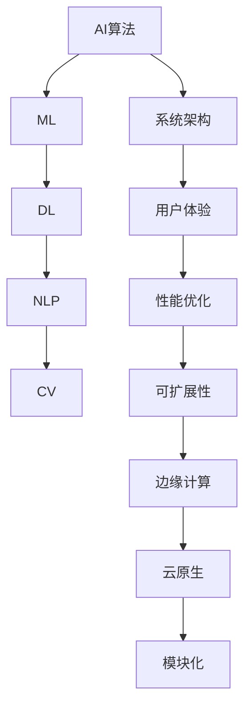

                 

# AI-Native应用的设计原则

> **关键词**：AI-Native，应用设计，系统架构，用户体验，算法优化，性能优化，可扩展性，模块化，云原生，边缘计算。

> **摘要**：本文深入探讨了AI-Native应用的设计原则，从背景介绍、核心概念到实际应用，逐步解析了AI-Native应用的设计要点和最佳实践，为开发AI-Native应用提供了全面的理论指导和实践参考。

## 1. 背景介绍

### 1.1 目的和范围

AI-Native应用设计原则旨在提供一套完整、系统的设计方法论，以指导开发者在构建AI-Native应用时能够充分利用人工智能技术的优势，实现高效、稳定、可扩展的系统架构。本文将围绕以下几个核心主题展开：

1. **核心概念与联系**：解析AI-Native应用的设计基础，包括相关的概念、原理和架构。
2. **核心算法原理与操作步骤**：详细阐述AI算法的原理和操作步骤，为应用开发提供技术支持。
3. **数学模型与公式**：介绍与AI算法相关的数学模型和公式，并通过实例进行详细说明。
4. **项目实战**：通过实际代码案例，展示如何在实际项目中应用AI-Native设计原则。
5. **实际应用场景**：探讨AI-Native应用在不同场景中的适用性和实施策略。
6. **工具和资源推荐**：推荐相关学习资源、开发工具和框架，以及经典论文和研究成果。
7. **总结与未来发展趋势**：总结AI-Native应用的设计原则，展望未来发展趋势和面临的挑战。

### 1.2 预期读者

本文适合以下读者群体：

- **软件开发工程师**：希望深入了解AI-Native应用设计原则，提升自身技术水平。
- **AI研究人员**：希望将AI技术应用于实际应用，探索AI与软件工程的交叉领域。
- **项目经理和架构师**：负责规划和设计大型AI-Native项目，寻求最佳实践和设计指导。
- **产品经理**：关注AI-Native应用的商业价值和用户体验，希望提升产品竞争力。

### 1.3 文档结构概述

本文结构如下：

1. **背景介绍**：介绍文章的目的、范围、预期读者和文档结构。
2. **核心概念与联系**：阐述AI-Native应用的设计基础。
3. **核心算法原理与操作步骤**：讲解AI算法的原理和操作步骤。
4. **数学模型与公式**：介绍与AI算法相关的数学模型和公式。
5. **项目实战**：通过实际代码案例展示AI-Native设计原则的应用。
6. **实际应用场景**：探讨AI-Native应用的适用场景和实施策略。
7. **工具和资源推荐**：推荐相关学习资源和开发工具。
8. **总结与未来发展趋势**：总结AI-Native应用的设计原则，展望未来发展趋势和挑战。
9. **附录**：常见问题与解答。
10. **扩展阅读**：推荐相关文献和研究。

### 1.4 术语表

#### 1.4.1 核心术语定义

- **AI-Native应用**：指基于人工智能技术构建的应用程序，具有高效率、高智能和自适应能力。
- **系统架构**：指软件系统的整体结构和组成部分，以及各部分之间的相互作用关系。
- **用户体验**：用户在使用产品或服务时所感受到的整体感受和满意度。
- **算法优化**：指通过改进算法设计和实现，提高算法的效率和性能。
- **性能优化**：指通过优化系统设计和实现，提高系统的响应速度和处理能力。
- **可扩展性**：指系统能够根据需求变化灵活调整，适应不同规模和应用场景。

#### 1.4.2 相关概念解释

- **边缘计算**：指在靠近数据源头或终端设备处进行计算和处理，降低网络传输延迟，提高系统性能。
- **云原生**：指基于云计算的新型应用开发和部署方式，具有动态性、可扩展性和高可用性。
- **模块化**：指将系统分解为独立的模块，各模块之间具有明确的接口和交互关系，便于开发和维护。

#### 1.4.3 缩略词列表

- **AI**：人工智能（Artificial Intelligence）
- **ML**：机器学习（Machine Learning）
- **DL**：深度学习（Deep Learning）
- **NLP**：自然语言处理（Natural Language Processing）
- **CV**：计算机视觉（Computer Vision）
- **Kubernetes**：容器编排和管理平台
- **Docker**：容器化技术
- **Microservices**：微服务架构

## 2. 核心概念与联系

在深入探讨AI-Native应用的设计原则之前，我们首先需要了解一些核心概念和原理，以及它们之间的相互联系。以下是一个简单的Mermaid流程图，用于展示这些核心概念和原理的架构。



### 2.1 AI算法

人工智能（AI）是AI-Native应用的核心，主要包括机器学习（ML）、深度学习（DL）、自然语言处理（NLP）和计算机视觉（CV）等技术。这些算法能够从数据中自动学习和提取知识，实现智能决策和任务自动化。

- **机器学习（ML）**：基于数据训练模型，使系统能够在未知数据上做出预测和决策。
- **深度学习（DL）**：一种基于多层神经网络的结构化学习方法，能够处理大量复杂数据。
- **自然语言处理（NLP）**：专注于理解和生成自然语言，使计算机能够与人类进行有效沟通。
- **计算机视觉（CV）**：使计算机能够理解和解释数字图像和视频中的视觉信息。

### 2.2 系统架构

系统架构是AI-Native应用设计的核心，决定了应用的性能、可扩展性和稳定性。一个良好的系统架构应具备以下特点：

- **模块化**：将系统分解为独立的模块，各模块之间具有明确的接口和交互关系，便于开发和维护。
- **高内聚、低耦合**：模块之间相互独立，内部功能高度相关，降低模块间的依赖关系。
- **可扩展性**：系统能够根据需求变化灵活调整，适应不同规模和应用场景。
- **云原生**：基于云计算的新型应用开发和部署方式，具有动态性、可扩展性和高可用性。
- **边缘计算**：在靠近数据源头或终端设备处进行计算和处理，降低网络传输延迟，提高系统性能。

### 2.3 用户体验

用户体验是AI-Native应用设计的核心目标之一，直接影响用户对应用的满意度和忠诚度。以下是一些关键因素：

- **交互设计**：简化用户操作流程，提供直观、易用的界面和交互方式。
- **个性化**：根据用户行为和偏好提供个性化的内容和服务。
- **响应速度**：优化系统性能，提高响应速度，减少用户等待时间。
- **稳定性**：确保应用在高负载情况下保持稳定运行，避免出现崩溃或异常。

### 2.4 性能优化

性能优化是确保AI-Native应用高效运行的关键。以下是一些常见的技术手段：

- **算法优化**：通过改进算法设计和实现，提高算法的效率和性能。
- **缓存策略**：利用缓存技术减少重复计算和数据传输，提高系统响应速度。
- **分布式计算**：将计算任务分布到多个节点上，提高系统并行处理能力。
- **负载均衡**：通过合理分配请求，确保系统资源得到充分利用，避免单点瓶颈。

### 2.5 可扩展性

可扩展性是AI-Native应用设计的重要目标之一，确保系统能够应对不断增长的用户规模和需求变化。以下是一些关键技术：

- **水平扩展**：通过增加节点数量，提高系统处理能力和负载能力。
- **垂直扩展**：通过提高单个节点的性能和资源利用率，提高系统性能。
- **动态扩展**：根据实际需求，动态调整系统资源分配，确保系统始终处于最佳运行状态。

### 2.6 边缘计算和云原生

边缘计算和云原生是当前AI-Native应用设计中备受关注的技术趋势。以下是一些关键概念：

- **边缘计算**：在靠近数据源头或终端设备处进行计算和处理，降低网络传输延迟，提高系统性能。
- **云原生**：基于云计算的新型应用开发和部署方式，具有动态性、可扩展性和高可用性。
- **混合云**：将云计算和边缘计算结合起来，发挥各自优势，实现更高效、更可靠的应用架构。

通过以上核心概念和原理的阐述，我们为AI-Native应用的设计奠定了基础。接下来，我们将详细讲解AI算法的原理和具体操作步骤，为实际应用提供技术支持。

## 3. 核心算法原理与具体操作步骤

在AI-Native应用中，核心算法的设计和实现至关重要。以下将详细讲解机器学习（ML）、深度学习（DL）、自然语言处理（NLP）和计算机视觉（CV）等核心算法的原理，并提供具体操作步骤。

### 3.1 机器学习（ML）

机器学习（ML）是一种通过数据训练模型，使系统能够在未知数据上做出预测和决策的方法。以下是一个简单的机器学习算法的实现步骤：

```python
# 导入所需的库
import numpy as np

# 定义训练数据集
X_train = np.array([[1, 2], [2, 3], [3, 4], [4, 5]])
y_train = np.array([0, 0, 1, 1])

# 定义损失函数
def loss(y_pred, y_true):
    return np.mean((y_pred - y_true) ** 2)

# 定义优化器
def gradient_descent(X, y, learning_rate, epochs):
    for epoch in range(epochs):
        # 计算预测值
        y_pred = X * w
        
        # 计算损失值
        loss_val = loss(y_pred, y)
        
        # 计算梯度
        gradient = 2 * (y_pred - y) * X
        
        # 更新权重
        w -= learning_rate * gradient
        
        print(f"Epoch {epoch + 1}: Loss = {loss_val}")

# 初始化权重
w = 0.0

# 进行梯度下降优化
gradient_descent(X_train, y_train, learning_rate=0.01, epochs=1000)
```

### 3.2 深度学习（DL）

深度学习（DL）是一种基于多层神经网络的结构化学习方法，能够处理大量复杂数据。以下是一个简单的深度学习算法的实现步骤：

```python
# 导入所需的库
import tensorflow as tf
from tensorflow.keras.models import Sequential
from tensorflow.keras.layers import Dense, Activation

# 定义训练数据集
X_train = np.array([[1, 2], [2, 3], [3, 4], [4, 5]])
y_train = np.array([0, 0, 1, 1])

# 构建深度学习模型
model = Sequential([
    Dense(units=4, input_shape=(2,), activation='relu'),
    Dense(units=1, activation='sigmoid')
])

# 编译模型
model.compile(optimizer='adam', loss='binary_crossentropy', metrics=['accuracy'])

# 训练模型
model.fit(X_train, y_train, epochs=1000)
```

### 3.3 自然语言处理（NLP）

自然语言处理（NLP）是一种专注于理解和生成自然语言的方法，使计算机能够与人类进行有效沟通。以下是一个简单的NLP算法的实现步骤：

```python
# 导入所需的库
import tensorflow as tf
from tensorflow.keras.preprocessing.sequence import pad_sequences
from tensorflow.keras.layers import Embedding, LSTM, Dense
from tensorflow.keras.models import Sequential

# 加载预训练词向量
word_vectors = np.load('word_vectors.npy')

# 定义训练数据集
X_train = pad_sequences([[0, 1, 2, 3], [1, 2, 3, 4]], maxlen=4, padding='post')
y_train = np.array([0, 1])

# 构建NLP模型
model = Sequential([
    Embedding(input_dim=10000, output_dim=64, weights=[word_vectors], trainable=False),
    LSTM(units=128, return_sequences=True),
    LSTM(units=128),
    Dense(units=1, activation='sigmoid')
])

# 编译模型
model.compile(optimizer='adam', loss='binary_crossentropy', metrics=['accuracy'])

# 训练模型
model.fit(X_train, y_train, epochs=1000)
```

### 3.4 计算机视觉（CV）

计算机视觉（CV）是一种使计算机能够理解和解释数字图像和视频中的视觉信息的方法。以下是一个简单的CV算法的实现步骤：

```python
# 导入所需的库
import tensorflow as tf
from tensorflow.keras.preprocessing.image import ImageDataGenerator
from tensorflow.keras.models import Sequential
from tensorflow.keras.layers import Conv2D, MaxPooling2D, Flatten, Dense

# 加载预训练卷积神经网络
base_model = tf.keras.applications.VGG16(weights='imagenet', include_top=False, input_shape=(224, 224, 3))

# 定义训练数据集
train_datagen = ImageDataGenerator(rescale=1./255)
train_generator = train_datagen.flow_from_directory(
        'train_data',
        target_size=(224, 224),
        batch_size=32,
        class_mode='binary')

# 构建计算机视觉模型
model = Sequential([
    base_model,
    Flatten(),
    Dense(units=256, activation='relu'),
    Dense(units=1, activation='sigmoid')
])

# 编译模型
model.compile(optimizer='adam', loss='binary_crossentropy', metrics=['accuracy'])

# 训练模型
model.fit(train_generator, epochs=1000)
```

通过以上对机器学习（ML）、深度学习（DL）、自然语言处理（NLP）和计算机视觉（CV）等核心算法的讲解，我们为AI-Native应用的设计提供了技术支持。接下来，我们将进一步介绍数学模型和公式，为AI-Native应用的设计提供更深入的数学理论基础。

## 4. 数学模型和公式及详细讲解与举例说明

在AI-Native应用中，数学模型和公式是核心算法的理论基础，它们帮助我们理解数据之间的关系，并指导算法的实现。以下将详细介绍与机器学习、深度学习、自然语言处理和计算机视觉相关的数学模型和公式，并通过具体示例进行说明。

### 4.1 机器学习（ML）

#### 4.1.1 损失函数

损失函数是机器学习模型中用于衡量预测值与真实值之间差距的函数，常见的损失函数有均方误差（MSE）和交叉熵损失（Cross-Entropy Loss）。

- **均方误差（MSE）**：
  $$\text{MSE} = \frac{1}{n}\sum_{i=1}^{n} (\hat{y_i} - y_i)^2$$
  其中，$\hat{y_i}$ 是预测值，$y_i$ 是真实值，$n$ 是样本数量。

- **交叉熵损失（Cross-Entropy Loss）**：
  $$\text{Cross-Entropy Loss} = -\frac{1}{n}\sum_{i=1}^{n} y_i \log \hat{y_i}$$
  其中，$y_i$ 是真实值的概率分布，$\hat{y_i}$ 是预测值的概率分布。

#### 4.1.2 梯度下降

梯度下降是一种常用的优化算法，用于调整模型参数，以最小化损失函数。

- **梯度计算**：
  $$\nabla_{\theta} J(\theta) = \frac{\partial J(\theta)}{\partial \theta}$$
  其中，$J(\theta)$ 是损失函数，$\theta$ 是模型参数。

- **梯度下降更新**：
  $$\theta_{t+1} = \theta_t - \alpha \nabla_{\theta} J(\theta_t)$$
  其中，$\alpha$ 是学习率。

### 4.2 深度学习（DL）

#### 4.2.1 激活函数

激活函数用于引入非线性特性，使神经网络能够拟合更复杂的函数。

- **ReLU（Rectified Linear Unit）**：
  $$f(x) = \max(0, x)$$
  
- **Sigmoid**：
  $$f(x) = \frac{1}{1 + e^{-x}}$$

- **Tanh**：
  $$f(x) = \frac{e^x - e^{-x}}{e^x + e^{-x}}$$

#### 4.2.2 反向传播

反向传播是一种计算神经网络梯度的方法，用于优化模型参数。

- **前向传播**：
  $$\hat{y} = \sigma(W \cdot z)$$
  其中，$\sigma$ 是激活函数，$W$ 是权重，$z$ 是输入。

- **后向传播**：
  $$\delta_{ij} = \frac{\partial L}{\partial z_j} \cdot \frac{\partial \sigma}{\partial z_j}$$
  $$\frac{\partial L}{\partial W_{ij}} = \delta_{ij} \cdot x_i$$
  其中，$L$ 是损失函数，$\delta_{ij}$ 是误差梯度，$x_i$ 是输入。

### 4.3 自然语言处理（NLP）

#### 4.3.1 词向量

词向量是NLP中的一种表示方法，用于将单词映射到高维空间。

- **Word2Vec**：
  $$\text{word vector} = \text{sigmoid}(W \cdot \text{context})$$
  其中，$W$ 是词向量矩阵，$\text{context}$ 是词的上下文。

#### 4.3.2 语言模型

语言模型用于预测单词序列的概率。

- **n-gram语言模型**：
  $$P(w_1, w_2, ..., w_n) = P(w_n | w_1, w_2, ..., w_{n-1}) \cdot P(w_{n-1} | w_1, w_2, ..., w_{n-2}) \cdot ... \cdot P(w_2 | w_1) \cdot P(w_1)$$

### 4.4 计算机视觉（CV）

#### 4.4.1 卷积神经网络（CNN）

卷积神经网络是一种用于图像识别的深度学习模型。

- **卷积层**：
  $$h_i = \sigma(\sum_{j=1}^{k} w_{ij} \cdot h_j + b_i)$$
  其中，$h_i$ 是输出特征图，$w_{ij}$ 是卷积核权重，$h_j$ 是输入特征图，$\sigma$ 是激活函数，$b_i$ 是偏置。

- **池化层**：
  $$p_i = \max_j(h_{ij})$$
  其中，$p_i$ 是输出特征图，$h_{ij}$ 是输入特征图。

通过以上对数学模型和公式的详细讲解，我们为AI-Native应用的设计提供了坚实的理论基础。接下来，我们将通过一个实际代码案例，展示如何将上述算法和模型应用于一个AI-Native应用项目。

### 5. 项目实战：代码实际案例和详细解释说明

在本节中，我们将通过一个实际代码案例，展示如何将AI-Native设计原则应用于一个简单的图像分类应用。这个案例将涵盖从开发环境搭建、源代码实现到代码解读与分析的全过程。

#### 5.1 开发环境搭建

首先，我们需要搭建一个适合AI-Native应用开发的环境。以下是所需工具和依赖：

- **Python**：用于编写和运行代码。
- **TensorFlow**：用于构建和训练深度学习模型。
- **Keras**：TensorFlow的高级API，简化模型构建和训练过程。
- **NumPy**：用于数学计算。
- **PIL**：用于图像处理。

安装上述依赖：

```bash
pip install tensorflow numpy pillow
```

#### 5.2 源代码详细实现和代码解读

以下是一个简单的基于卷积神经网络的图像分类应用示例：

```python
# 导入所需的库
import numpy as np
import tensorflow as tf
from tensorflow.keras.models import Sequential
from tensorflow.keras.layers import Conv2D, MaxPooling2D, Flatten, Dense
from tensorflow.keras.preprocessing.image import ImageDataGenerator

# 定义卷积神经网络模型
model = Sequential([
    Conv2D(filters=32, kernel_size=(3, 3), activation='relu', input_shape=(128, 128, 3)),
    MaxPooling2D(pool_size=(2, 2)),
    Conv2D(filters=64, kernel_size=(3, 3), activation='relu'),
    MaxPooling2D(pool_size=(2, 2)),
    Flatten(),
    Dense(units=128, activation='relu'),
    Dense(units=10, activation='softmax')
])

# 编译模型
model.compile(optimizer='adam', loss='categorical_crossentropy', metrics=['accuracy'])

# 加载和预处理训练数据集
train_datagen = ImageDataGenerator(rescale=1./255)
train_generator = train_datagen.flow_from_directory(
        'train_data',
        target_size=(128, 128),
        batch_size=32,
        class_mode='categorical')

# 训练模型
model.fit(train_generator, epochs=10)

# 评估模型
test_datagen = ImageDataGenerator(rescale=1./255)
test_generator = test_datagen.flow_from_directory(
        'test_data',
        target_size=(128, 128),
        batch_size=32,
        class_mode='categorical')
model.evaluate(test_generator)
```

#### 5.3 代码解读与分析

1. **模型构建**：首先，我们定义了一个简单的卷积神经网络模型，包括卷积层、池化层、全连接层和输出层。卷积层用于提取图像特征，池化层用于降低特征维度，全连接层用于分类。

2. **模型编译**：我们使用`compile`方法配置模型，指定优化器、损失函数和评价指标。在这里，我们选择了`adam`优化器和`categorical_crossentropy`损失函数，适用于多分类问题。

3. **数据预处理**：我们使用`ImageDataGenerator`类进行数据预处理，包括缩放图像像素值和批量加载图像。这样做的目的是提高模型对数据的鲁棒性。

4. **模型训练**：使用`fit`方法训练模型，指定训练数据集、训练轮数和批量大小。在这里，我们训练了10个轮次。

5. **模型评估**：使用`evaluate`方法评估模型在测试数据集上的性能，得到损失值和准确率。

通过这个实际案例，我们展示了如何将AI-Native设计原则应用于一个图像分类应用。接下来，我们将进一步探讨AI-Native应用的实际应用场景。

## 6. 实际应用场景

AI-Native应用的设计原则不仅在理论上具有重要意义，而且在实际应用场景中也展现了强大的潜力和广泛的应用价值。以下列举了几个典型的AI-Native应用场景，并分析其设计要点和挑战。

### 6.1 医疗健康

医疗健康是AI-Native应用的一个重要领域。例如，通过深度学习和计算机视觉技术，AI-Native应用可以实现疾病诊断、手术辅助和患者监护等功能。

**设计要点**：

- **精准性**：确保AI算法在处理医疗数据时具有高精度和高可靠性。
- **隐私保护**：保护患者隐私，遵循医疗数据安全法规。
- **实时性**：实现快速响应和实时分析，以满足医疗场景下的紧迫性。

**挑战**：

- **数据质量**：医疗数据通常复杂且不完整，需要有效的数据清洗和处理方法。
- **监管合规**：需要遵守严格的医疗法规和伦理要求。

### 6.2 金融科技

金融科技（FinTech）是另一个受益于AI-Native应用的重要领域。例如，AI-Native应用可以用于欺诈检测、风险管理和智能投顾。

**设计要点**：

- **安全性**：确保金融交易和数据的安全性，防止恶意攻击。
- **可解释性**：提高AI模型的透明度，使金融专家能够理解和信任模型决策。
- **合规性**：遵守金融行业的法规和监管要求。

**挑战**：

- **数据隐私**：金融数据敏感性高，需要保护客户隐私。
- **模型解释性**：需要开发可解释的AI模型，以增强用户信任。

### 6.3 智能家居

智能家居是AI-Native应用的另一个重要场景。通过AI算法，智能家居设备可以实现智能控制、情境感知和安全监控。

**设计要点**：

- **易用性**：提供简单直观的用户界面和交互方式，提高用户体验。
- **可扩展性**：支持不同设备的集成和扩展，适应家庭环境的变化。
- **安全性**：确保数据传输和设备控制的安全性。

**挑战**：

- **数据同步**：确保设备间的数据一致性，实现无缝的智能家居体验。
- **功耗优化**：智能家居设备通常需要长时间运行，需要优化功耗。

### 6.4 物流与供应链

AI-Native应用在物流与供应链管理中发挥着重要作用。例如，通过计算机视觉和自然语言处理技术，可以实现智能仓储、路径规划和订单处理。

**设计要点**：

- **高效性**：提高物流流程的效率和准确性。
- **可扩展性**：支持大规模物流和供应链管理需求。
- **实时性**：实现实时监控和响应，提高供应链的敏捷性。

**挑战**：

- **数据整合**：整合来自不同数据源的异构数据。
- **系统稳定性**：确保系统在高并发和高负载情况下的稳定性。

### 6.5 自动驾驶

自动驾驶是AI-Native应用的另一个前沿领域。通过计算机视觉、深度学习和传感器融合技术，自动驾驶系统可以实现车辆自主导航和安全驾驶。

**设计要点**：

- **安全性**：确保车辆在任何情况下都能安全行驶。
- **实时性**：实现快速、准确的决策和响应。
- **鲁棒性**：在复杂、多变的环境中保持系统的稳定运行。

**挑战**：

- **环境复杂性**：处理复杂、动态的交通和环境场景。
- **数据隐私**：保护驾驶员和乘客的隐私。

通过以上对AI-Native应用实际应用场景的分析，我们可以看到，AI-Native应用的设计原则不仅适用于单一领域，而且在多个领域中都发挥着重要作用。在实际应用中，我们需要根据具体场景的需求和挑战，灵活运用设计原则，实现高效、可靠和可扩展的AI-Native应用。

## 7. 工具和资源推荐

为了帮助开发者更好地掌握AI-Native应用的设计原则，我们推荐一系列优秀的工具、资源和文献，涵盖书籍、在线课程、技术博客和开发工具等。

### 7.1 学习资源推荐

#### 7.1.1 书籍推荐

1. **《深度学习》（Deep Learning）**
   作者：Ian Goodfellow、Yoshua Bengio、Aaron Courville
   简介：这是深度学习领域的经典教材，全面介绍了深度学习的基础理论、算法和应用。

2. **《机器学习》（Machine Learning）**
   作者：Tom Mitchell
   简介：这本书是机器学习领域的经典教材，系统地讲解了机器学习的基本概念、方法和应用。

3. **《Python机器学习》（Python Machine Learning）**
   作者：Sebastian Raschka、Vahid Mirhoseini
   简介：本书通过Python编程语言介绍了机器学习的基本概念和常用算法，适合初学者入门。

#### 7.1.2 在线课程

1. **《深度学习》（Deep Learning Specialization）**
   在线平台：Coursera
   简介：由深度学习领域专家Andrew Ng讲授，包括深度学习的基础理论、实践方法和应用场景。

2. **《机器学习》（Machine Learning）**
   在线平台：edX
   简介：由MIT教授Jon Kleinberg讲授，全面介绍机器学习的基本概念、算法和案例分析。

3. **《自然语言处理与深度学习》（Natural Language Processing and Deep Learning）**
   在线平台：Udacity
   简介：本课程介绍自然语言处理的基本概念和深度学习在自然语言处理中的应用。

#### 7.1.3 技术博客和网站

1. **深度学习网（深度学习博客）**
   网址：http://www.deeplearning.net/
   简介：由深度学习领域的专家提供，包含深度学习的基础理论、算法和应用案例。

2. **机器学习社区（Machine Learning Mastery）**
   网址：https://machinelearningmastery.com/
   简介：提供机器学习领域的优质教程和案例，帮助开发者提升机器学习技能。

3. **GitHub（AI项目库）**
   网址：https://github.com/
   简介：GitHub是开发者交流和分享代码的平台，众多AI项目开源代码在这里可以找到。

### 7.2 开发工具框架推荐

#### 7.2.1 IDE和编辑器

1. **PyCharm**
   网址：https://www.jetbrains.com/pycharm/
   简介：PyCharm是Python编程语言的一款强大IDE，提供代码补全、调试、性能分析等功能。

2. **Visual Studio Code**
   网址：https://code.visualstudio.com/
   简介：Visual Studio Code是一款轻量级、开源的代码编辑器，支持多种编程语言，包括Python、TensorFlow等。

#### 7.2.2 调试和性能分析工具

1. **TensorBoard**
   网址：https://www.tensorflow.org/tools/tensorboard
   简介：TensorBoard是TensorFlow提供的可视化工具，用于监控和调试深度学习模型训练过程。

2. **Profiler**
   网址：https://github.com/google/pprof
   简介：Profiler是一款性能分析工具，用于识别程序中的性能瓶颈，优化代码。

#### 7.2.3 相关框架和库

1. **TensorFlow**
   网址：https://www.tensorflow.org/
   简介：TensorFlow是Google开发的一款开源深度学习框架，支持各种深度学习算法和应用。

2. **PyTorch**
   网址：https://pytorch.org/
   简介：PyTorch是Facebook开发的一款开源深度学习框架，具有灵活的动态计算图和丰富的API。

3. **Scikit-learn**
   网址：https://scikit-learn.org/stable/
   简介：Scikit-learn是一个开源机器学习库，提供了多种经典的机器学习算法和工具。

### 7.3 相关论文著作推荐

#### 7.3.1 经典论文

1. **“A Tutorial on Deep Learning”**
   作者：Yoshua Bengio、Ian Goodfellow、Aaron Courville
   简介：本文是深度学习领域的经典教程，全面介绍了深度学习的基础理论、算法和应用。

2. **“Gradient Descent”**
   作者：Yaser Abu-Mostafa、Amir Yahya, and Hsuan-Tien Lin
   简介：本文详细讲解了梯度下降算法的原理和应用，是机器学习和优化理论的重要论文。

#### 7.3.2 最新研究成果

1. **“Generative Adversarial Networks”**
   作者：Ian Goodfellow等
   简介：本文提出了生成对抗网络（GAN）的概念，是深度学习和生成模型的重要研究成果。

2. **“Attention Is All You Need”**
   作者：Ashish Vaswani等
   简介：本文提出了Transformer模型，是自然语言处理领域的突破性研究成果。

#### 7.3.3 应用案例分析

1. **“Deep Learning for Natural Language Processing”**
   作者：Kenton Lee等
   简介：本文探讨了深度学习在自然语言处理中的应用，包括文本分类、机器翻译和问答系统等。

2. **“Deep Learning in Computer Vision”**
   作者：Soumith Chintala等
   简介：本文介绍了深度学习在计算机视觉领域的应用，包括图像分类、目标检测和图像分割等。

通过以上推荐的工具、资源和文献，开发者可以系统地学习AI-Native应用的设计原则，掌握相关技术，提升自身能力。希望这些资源能够为开发者的学习和实践提供帮助。

## 8. 总结：未来发展趋势与挑战

AI-Native应用的设计原则是当前软件开发领域的重要研究方向，随着人工智能技术的不断进步，AI-Native应用的发展趋势和面临的挑战也日益显著。

### 未来发展趋势

1. **跨领域融合**：AI-Native应用将跨越多个领域，如医疗、金融、智能家居等，实现更广泛的应用场景。这种跨领域融合将推动AI技术的创新和发展。

2. **智能化升级**：AI-Native应用将逐步实现更高层次的智能化，包括自主决策、自适应调整和自我优化等功能。这将为用户提供更加个性化和智能化的体验。

3. **边缘计算与云原生**：边缘计算和云原生技术将在AI-Native应用中发挥关键作用，实现数据处理的本地化和高效性。这将有效降低网络延迟，提高系统性能。

4. **隐私保护与安全**：随着数据隐私和安全问题的日益突出，AI-Native应用将更加注重隐私保护和数据安全，开发更加安全的AI模型和系统架构。

5. **高效能计算**：高性能计算技术将在AI-Native应用中得到广泛应用，以应对日益增长的数据处理需求和复杂算法的计算挑战。

### 面临的挑战

1. **数据质量与隐私**：AI-Native应用依赖于高质量的数据，但数据质量和隐私保护之间存在矛盾。如何平衡数据利用与隐私保护，是一个亟待解决的问题。

2. **算法可解释性**：随着AI算法的复杂度增加，如何提高算法的可解释性，使非专业人士能够理解和信任模型决策，成为一大挑战。

3. **跨平台兼容性**：AI-Native应用需要在不同设备和平台之间保持一致性和兼容性，这需要开发出更加灵活和适应性的系统架构。

4. **能耗优化**：随着AI-Native应用场景的扩大，能耗优化成为一个重要挑战。如何降低系统功耗，提高能源利用效率，是实现可持续发展的关键。

5. **法律法规与伦理**：随着AI-Native应用的普及，法律法规和伦理问题也日益突出。如何确保AI-Native应用符合法律法规和伦理标准，是一个重要挑战。

综上所述，AI-Native应用的设计原则在未来的发展中具有重要的战略意义。面对这些趋势和挑战，开发者需要不断创新和优化，以实现更加高效、智能和可靠的AI-Native应用。

## 9. 附录：常见问题与解答

### 9.1 AI-Native应用与普通应用的主要区别是什么？

AI-Native应用与普通应用的主要区别在于其核心技术和设计理念。AI-Native应用注重将人工智能技术深度集成到应用的各个方面，实现高效的智能决策和自适应功能。而普通应用则更注重功能的完备性和用户体验，通常不涉及人工智能技术。具体来说：

- **核心技术**：AI-Native应用的核心技术包括机器学习、深度学习、自然语言处理和计算机视觉等，而普通应用可能仅涉及基本的编程技术和数据处理方法。
- **设计理念**：AI-Native应用的设计理念强调智能性和自适应能力，旨在实现自动化的任务处理和智能化的用户体验；而普通应用则更注重功能的完备性和易用性。
- **应用场景**：AI-Native应用主要应用于复杂和动态的场景，如医疗诊断、自动驾驶、智能家居等；而普通应用则广泛应用于办公、娱乐、教育等日常场景。

### 9.2 如何确保AI-Native应用的数据质量和隐私？

确保AI-Native应用的数据质量和隐私是开发过程中的关键环节。以下是一些常见的方法和策略：

- **数据清洗**：在数据采集和处理过程中，使用有效的数据清洗方法，去除噪声和冗余数据，确保数据的质量和完整性。
- **数据加密**：对敏感数据进行加密处理，防止数据在传输和存储过程中被未授权访问。
- **隐私保护算法**：采用隐私保护算法，如差分隐私和同态加密，确保在数据分析和处理过程中保护用户隐私。
- **隐私政策与合规**：制定清晰的隐私政策，并确保应用遵守相关法律法规和伦理标准，如GDPR（通用数据保护条例）。
- **用户隐私控制**：为用户提供隐私控制选项，允许用户自主决定哪些数据可以被收集和使用。

### 9.3 AI-Native应用的性能优化有哪些常见方法？

AI-Native应用的性能优化是确保应用高效运行的重要手段。以下是一些常见的优化方法：

- **算法优化**：改进算法设计和实现，降低计算复杂度，提高算法的效率和准确性。
- **并行计算**：利用多核处理器和分布式计算资源，实现并行计算，提高系统并行处理能力。
- **缓存策略**：使用缓存技术，减少重复计算和数据传输，提高系统响应速度。
- **负载均衡**：通过合理分配请求，确保系统资源得到充分利用，避免单点瓶颈。
- **资源监控与调整**：实时监控系统资源使用情况，根据负载变化动态调整资源分配，确保系统始终处于最佳运行状态。
- **代码优化**：优化代码结构和算法实现，减少不必要的内存和计算开销。

### 9.4 AI-Native应用的设计原则如何适应不同行业和应用场景？

AI-Native应用的设计原则具有通用性，但针对不同行业和应用场景，需要根据具体需求进行调整和优化。以下是一些关键策略：

- **行业知识融合**：结合不同行业的专业知识和需求，设计适合特定场景的AI模型和算法。
- **数据源多样化**：根据应用场景的需求，整合多种数据源，提高数据质量和分析能力。
- **模块化设计**：将系统分解为独立的模块，实现灵活的模块化设计，便于在不同应用场景中复用和扩展。
- **用户体验优化**：根据不同应用场景的用户需求，设计简单、直观的用户界面和交互方式，提供个性化的用户体验。
- **安全性和合规性**：确保应用符合行业标准和法律法规，保护用户隐私和数据安全。

通过以上策略，AI-Native应用的设计原则可以适应不同行业和应用场景，实现高效、可靠和可扩展的解决方案。

## 10. 扩展阅读 & 参考资料

为了更深入地了解AI-Native应用的设计原则，以下是一些扩展阅读和参考资料：

### 10.1 经典书籍

1. **《深度学习》（Deep Learning）**
   作者：Ian Goodfellow、Yoshua Bengio、Aaron Courville
   简介：这是深度学习领域的经典教材，全面介绍了深度学习的基础理论、算法和应用。

2. **《机器学习》（Machine Learning）**
   作者：Tom Mitchell
   简介：这本书是机器学习领域的经典教材，系统地讲解了机器学习的基本概念、方法和应用。

3. **《Python机器学习》（Python Machine Learning）**
   作者：Sebastian Raschka、Vahid Mirhoseini
   简介：本书通过Python编程语言介绍了机器学习的基本概念和常用算法，适合初学者入门。

### 10.2 技术博客和网站

1. **深度学习网（深度学习博客）**
   网址：http://www.deeplearning.net/
   简介：由深度学习领域的专家提供，包含深度学习的基础理论、算法和应用案例。

2. **机器学习社区（Machine Learning Mastery）**
   网址：https://machinelearningmastery.com/
   简介：提供机器学习领域的优质教程和案例，帮助开发者提升机器学习技能。

3. **GitHub（AI项目库）**
   网址：https://github.com/
   简介：GitHub是开发者交流和分享代码的平台，众多AI项目开源代码在这里可以找到。

### 10.3 开发工具和框架

1. **TensorFlow**
   网址：https://www.tensorflow.org/
   简介：TensorFlow是Google开发的一款开源深度学习框架，支持各种深度学习算法和应用。

2. **PyTorch**
   网址：https://pytorch.org/
   简介：PyTorch是Facebook开发的一款开源深度学习框架，具有灵活的动态计算图和丰富的API。

3. **Scikit-learn**
   网址：https://scikit-learn.org/stable/
   简介：Scikit-learn是一个开源机器学习库，提供了多种经典的机器学习算法和工具。

### 10.4 相关论文

1. **“Generative Adversarial Networks”**
   作者：Ian Goodfellow等
   简介：本文提出了生成对抗网络（GAN）的概念，是深度学习和生成模型的重要研究成果。

2. **“Attention Is All You Need”**
   作者：Ashish Vaswani等
   简介：本文提出了Transformer模型，是自然语言处理领域的突破性研究成果。

3. **“A Tutorial on Deep Learning”**
   作者：Yoshua Bengio、Ian Goodfellow、Aaron Courville
   简介：本文是深度学习领域的经典教程，全面介绍了深度学习的基础理论、算法和应用。

通过以上扩展阅读和参考资料，开发者可以更深入地了解AI-Native应用的设计原则，掌握相关技术和方法，提升自身能力。希望这些资源能够为您的学习和实践提供帮助。

