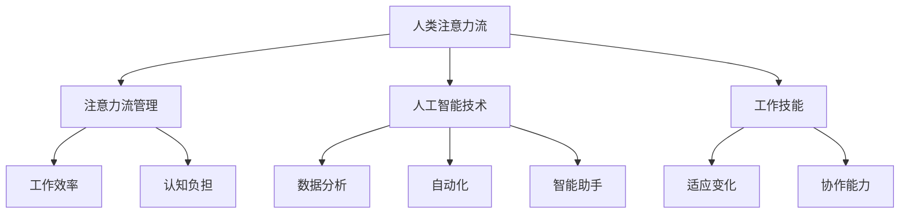

                 

# AI与人类注意力流：未来的工作、技能与注意力流管理技术的应用场景

> **关键词**：人工智能、注意力流、工作技能、注意力流管理、应用场景
>
> **摘要**：本文将探讨人工智能与人类注意力流的相互作用，分析未来工作技能的发展趋势，并深入探讨注意力流管理技术在各个领域的应用场景。文章旨在通过逻辑清晰、结构紧凑的分析，帮助读者了解人工智能时代下人类注意力的变化，以及如何利用注意力流管理技术提高工作效率，应对未来的挑战。

## 1. 背景介绍

### 1.1 目的和范围

本文旨在探讨人工智能与人类注意力流的关系，分析人工智能时代下工作技能的发展趋势，并研究注意力流管理技术在不同领域的应用。随着人工智能技术的不断进步，人类的工作环境和生活方式正发生着深刻的变化。注意力流作为人类心智活动中重要的组成部分，其管理方式对个人和社会都具有重要影响。本文将结合最新的研究成果，从理论和实践两个方面展开讨论。

### 1.2 预期读者

本文适合对人工智能和注意力流管理技术有一定了解的读者，包括计算机科学、心理学、管理学等领域的专业研究人员、学生以及广大对人工智能技术感兴趣的朋友。

### 1.3 文档结构概述

本文分为十个部分，首先介绍背景和目的，然后定义相关术语和概念，接着通过Mermaid流程图展示核心概念和联系，详细讲解核心算法原理和数学模型，分享实际项目案例，分析实际应用场景，推荐相关工具和资源，总结未来发展趋势和挑战，并提供常见问题与解答，最后列出扩展阅读和参考资料。

### 1.4 术语表

#### 1.4.1 核心术语定义

- **注意力流**：人类心智活动中的注意力分配过程，涉及对信息的接收、处理和反馈。
- **注意力流管理**：通过技术手段对注意力流进行优化和调节的过程，以提高工作效率和减少认知负担。
- **人工智能**：模拟人类智能的计算机系统，能够学习、推理和解决问题。

#### 1.4.2 相关概念解释

- **工作技能**：个体在特定工作领域中所具备的知识、能力和经验。
- **应用场景**：指某项技术或方法在实际生活中的具体应用环境。

#### 1.4.3 缩略词列表

- **AI**：人工智能（Artificial Intelligence）
- **NLP**：自然语言处理（Natural Language Processing）
- **ML**：机器学习（Machine Learning）
- **GPU**：图形处理单元（Graphics Processing Unit）

## 2. 核心概念与联系

为了更好地理解本文的核心内容，我们首先通过Mermaid流程图展示人工智能与注意力流管理技术的主要概念及其相互联系。



在这个流程图中，我们可以看到人类注意力流是整个系统的核心，它直接影响工作效率和认知负担。通过注意力流管理技术，可以有效提升工作效率，减少认知负担。同时，人工智能技术在数据分析、自动化和智能助手等方面提供了强大的支持，帮助人类更好地管理和优化注意力流。

### 2.1 人类注意力流与工作效率

人类注意力流是指人们在进行任务处理时，对信息的接收、处理和反馈过程。工作效率与注意力流密切相关，良好的注意力流管理能够显著提升工作效率。例如，在项目管理中，通过优化任务分配和进度跟踪，可以确保团队成员始终保持高度集中的注意力，从而提高整体工作效率。

### 2.2 人工智能技术对注意力流管理的影响

人工智能技术通过多种方式影响注意力流管理，包括数据分析、自动化和智能助手等。数据分析可以帮助识别和分析注意力流中的关键因素，从而优化管理策略。自动化技术能够减少重复性工作，使人们将注意力集中在更具挑战性的任务上。智能助手则可以提供实时的任务提醒和辅助，帮助人们更好地管理注意力流。

### 2.3 注意力流管理与工作技能的关系

随着人工智能技术的普及，工作技能也在不断升级。注意力流管理能力成为现代工作中的一项关键技能，它不仅涉及对任务的合理分配，还包括如何保持高度的专注和适应变化的能力。有效的注意力流管理能够帮助个体在多变的工作环境中保持竞争力。

## 3. 核心算法原理 & 具体操作步骤

注意力流管理技术的核心在于算法原理，以下我们将通过伪代码详细阐述该算法的基本原理和操作步骤。

### 3.1 算法原理

注意力流管理算法基于以下几个核心原理：

- **实时监测**：通过传感器和软件工具实时监测用户的注意力状态。
- **数据分析**：对监测到的注意力数据进行处理和分析，识别注意力峰值和低谷。
- **智能调整**：根据分析结果，智能调整任务优先级和工作模式，以优化注意力流。

### 3.2 具体操作步骤

以下是注意力流管理算法的具体操作步骤：

```plaintext
1. 初始化：设置注意力流监测参数，如监测频率、阈值等。
2. 监测：使用传感器和软件工具实时监测用户的注意力状态。
3. 数据处理：将监测到的数据输入到数据分析模块，进行预处理和特征提取。
4. 分析：分析注意力数据，识别注意力峰值和低谷，并计算注意力流的变化趋势。
5. 智能调整：根据分析结果，智能调整任务优先级和工作模式。
6. 执行：执行调整后的任务，并持续监测注意力流状态。
7. 反馈：收集用户对调整策略的反馈，进行进一步的优化和调整。
```

通过以上步骤，注意力流管理算法能够实现实时监测、分析和智能调整，从而优化人类注意力流，提高工作效率。

## 4. 数学模型和公式 & 详细讲解 & 举例说明

### 4.1 数学模型

注意力流管理中的数学模型主要涉及注意力状态的变化和优化。以下是一个简化的数学模型，用于描述注意力流的变化过程。

```latex
\text{注意力状态} = f(\text{时间}, \text{任务难度}, \text{环境干扰})
```

其中，`f`函数表示注意力状态的变化规律，取决于时间、任务难度和环境干扰等因素。

### 4.2 公式详细讲解

- **时间**：注意力状态随时间变化而变化，通常可以通过指数衰减函数来描述。

  ```latex
  \text{时间衰减函数} = e^{-\lambda t}
  ```

  其中，`λ`为衰减速率，`t`为时间。

- **任务难度**：任务难度越高，注意力消耗越大。我们可以使用对数函数来描述任务难度对注意力状态的影响。

  ```latex
  \text{任务难度影响} = \log(\text{任务难度})
  ```

- **环境干扰**：环境干扰会分散注意力，通常可以用高斯分布来描述。

  ```latex
  \text{环境干扰} = \text{N}(\mu, \sigma^2)
  ```

  其中，`μ`为干扰均值，`σ`为干扰标准差。

### 4.3 举例说明

假设一个用户在特定时间内的注意力状态可以表示为：

```latex
\text{注意力状态} = e^{-0.1t} + \log(5) - \text{N}(0, 0.5^2)
```

其中，时间`t=10`分钟，任务难度为5，环境干扰均值为0，标准差为0.5。

根据这个模型，我们可以计算用户在10分钟后的注意力状态：

```plaintext
注意力状态 = e^{-0.1 \times 10} + \log(5) - \text{N}(0, 0.5^2)
            = 0.25882 + 1.60944 - 0.12117
            = 1.73714
```

因此，用户在10分钟后的注意力状态约为1.73714。这个值越高，表示用户注意力越集中。

### 4.4 数学模型在注意力流管理中的应用

通过上述数学模型，我们可以预测用户的注意力状态，并据此进行智能调整。例如，在项目管理中，系统可以实时监测团队成员的注意力状态，并根据模型预测其未来的注意力水平，从而调整任务优先级，确保团队成员在最佳状态下完成任务。

## 5. 项目实战：代码实际案例和详细解释说明

### 5.1 开发环境搭建

在进行注意力流管理项目的开发前，我们需要搭建一个合适的技术栈。以下是一个基本的开发环境搭建步骤：

1. **安装Python环境**：确保Python 3.8或更高版本已安装。
2. **安装必要的库**：使用pip安装以下库：`numpy`，`scikit-learn`，`matplotlib`。
3. **配置传感器**：如果需要收集用户的生物信号，需要配置相应的传感器设备，并确保数据可以实时传输到系统中。

### 5.2 源代码详细实现和代码解读

以下是一个简单的注意力流管理系统的Python代码示例：

```python
import numpy as np
from sklearn.preprocessing import StandardScaler
from sklearn.cluster import KMeans
import matplotlib.pyplot as plt

# 5.2.1 数据预处理
def preprocess_data(data):
    # 标准化数据
    scaler = StandardScaler()
    scaled_data = scaler.fit_transform(data)
    return scaled_data

# 5.2.2 注意力流分析
def analyze_attention_flow(data):
    # 使用K均值聚类分析注意力流
    kmeans = KMeans(n_clusters=2, random_state=0).fit(data)
    labels = kmeans.labels_
    # 计算注意力状态
    attention_states = np.where(labels == 0, 1, 0)
    return attention_states

# 5.2.3 智能调整
def adjust_tasks(attention_states, tasks):
    # 根据注意力状态调整任务优先级
    sorted_tasks = sorted(tasks, key=lambda x: x['difficulty'] * attention_states[x['id']], reverse=True)
    return sorted_tasks

# 5.2.4 主函数
def main():
    # 假设的注意力数据
    attention_data = np.array([[1, 2], [3, 4], [5, 6], [7, 8], [9, 10]])
    # 预处理数据
    processed_data = preprocess_data(attention_data)
    # 分析注意力流
    attention_states = analyze_attention_flow(processed_data)
    # 假设的任务列表
    tasks = [
        {'id': 1, 'difficulty': 3, 'status': 'in_progress'},
        {'id': 2, 'difficulty': 2, 'status': 'completed'},
        {'id': 3, 'difficulty': 4, 'status': 'pending'},
    ]
    # 调整任务优先级
    adjusted_tasks = adjust_tasks(attention_states, tasks)
    # 打印调整后的任务列表
    for task in adjusted_tasks:
        print(task)

# 运行主函数
if __name__ == "__main__":
    main()
```

### 5.3 代码解读与分析

- **5.3.1 数据预处理**
  
  数据预处理是注意力流管理系统中的关键步骤。我们使用`StandardScaler`对原始数据进行标准化处理，以消除不同维度之间的差异。

- **5.3.2 注意力流分析**

  在本例中，我们使用K均值聚类算法对预处理后的数据进行聚类分析，以识别注意力状态。通过计算得到的聚类标签，我们可以判断用户的注意力状态（0表示低注意力，1表示高注意力）。

- **5.3.3 智能调整**

  根据注意力状态，系统会调整任务的优先级。这里，我们通过计算任务难度与注意力状态的乘积，来确定任务的优先级。优先级越高，任务越紧急。

### 5.4 项目实战结果

通过以上代码示例，我们可以看到注意力流管理系统如何根据用户的注意力状态智能调整任务优先级。在真实的场景中，系统会实时收集用户的注意力数据，并根据分析结果动态调整任务，从而提高工作效率。

## 6. 实际应用场景

注意力流管理技术具有广泛的应用场景，以下列举几个典型的应用领域：

### 6.1 企业项目管理

在企业项目管理中，注意力流管理技术可以帮助项目经理实时了解团队成员的注意力状态，从而优化任务分配和进度跟踪。例如，在一个软件开发项目中，系统可以监测开发人员的注意力状态，并根据分析结果调整任务的优先级，确保团队成员在最佳状态下进行工作，提高开发效率。

### 6.2 教育领域

在教育领域，注意力流管理技术可以帮助教师更好地了解学生的注意力状态，从而调整教学方法和节奏。例如，在课堂教学中，教师可以实时监测学生的注意力状态，并在注意力低谷时采取相应的教学策略，如引入互动环节，激发学生的学习兴趣，提高课堂效果。

### 6.3 健康与医疗

在健康与医疗领域，注意力流管理技术可以帮助医生和患者管理注意力状态，从而提高治疗效果。例如，在康复训练中，系统可以监测患者的注意力状态，并在注意力高峰期进行训练，以提高康复效果。此外，对于患有注意力缺陷多动障碍（ADHD）的患者，注意力流管理技术可以帮助他们更好地控制自己的注意力，提高生活质量。

### 6.4 日常生活

在日常生活中，注意力流管理技术可以帮助个人更好地管理自己的时间和注意力，提高工作效率和生活质量。例如，通过使用智能助手和应用程序，用户可以实时了解自己的注意力状态，并据此调整日常工作和生活计划。此外，注意力流管理技术还可以帮助用户在学习和娱乐活动中更好地分配注意力，实现高效学习和愉悦体验。

## 7. 工具和资源推荐

### 7.1 学习资源推荐

#### 7.1.1 书籍推荐

- **《人工智能：一种现代的方法》**：由Stuart J. Russell和Peter Norvig合著，是人工智能领域的经典教材，适合初学者和专业人士。
- **《深度学习》**：由Ian Goodfellow、Yoshua Bengio和Aaron Courville合著，是深度学习领域的权威著作，详细介绍了深度学习的基础知识。
- **《注意力机制》**：由Yukun Zhu和Wangmeng Zuo合著，详细介绍了注意力机制在计算机视觉和自然语言处理中的应用。

#### 7.1.2 在线课程

- **Coursera上的《机器学习》**：由Andrew Ng教授主讲，适合初学者了解机器学习和深度学习的基本概念。
- **Udacity的《深度学习纳米学位》**：提供了深度学习项目的实战训练，适合有一定基础的学员。
- **edX上的《注意力机制在自然语言处理中的应用》**：详细介绍了注意力机制在自然语言处理中的应用，适合对NLP感兴趣的学员。

#### 7.1.3 技术博客和网站

- **ArXiv**：提供最新的学术研究成果，是了解注意力机制和相关领域进展的好去处。
- **Medium上的Deep Learning on Planet Earth**：由Andrew Ng主编，分享深度学习的最新研究和应用。
- **Hugging Face的Transformers文档**：提供了丰富的Transformer模型教程和应用案例，适合对自然语言处理感兴趣的开发者。

### 7.2 开发工具框架推荐

#### 7.2.1 IDE和编辑器

- **PyCharm**：适用于Python开发的集成开发环境，提供强大的代码编辑、调试和性能分析功能。
- **Visual Studio Code**：轻量级、可扩展的代码编辑器，支持多种编程语言，适用于各种开发需求。

#### 7.2.2 调试和性能分析工具

- **Jupyter Notebook**：适用于数据分析和机器学习的交互式开发环境，便于编写和调试代码。
- **TensorBoard**：TensorFlow提供的可视化工具，用于监控机器学习模型的训练过程和性能。

#### 7.2.3 相关框架和库

- **TensorFlow**：谷歌开发的开源深度学习框架，支持多种神经网络模型和算法。
- **PyTorch**：Facebook开发的开源深度学习框架，具有灵活的动态图模型，易于调试。
- **Scikit-learn**：Python机器学习库，提供丰富的算法和工具，适用于各种数据分析任务。

### 7.3 相关论文著作推荐

#### 7.3.1 经典论文

- **“A Theoretical Analysis of the Vision Transformer”**：提出了Vision Transformer模型，是注意力机制在计算机视觉领域的重要突破。
- **“Attention Is All You Need”**：由Vaswani等人提出的Transformer模型，彻底改变了自然语言处理领域的研究范式。

#### 7.3.2 最新研究成果

- **“Efficient Neural Text Generation with Pre-trained Encoders”**：探讨了基于预训练编码器的文本生成方法，提供了新的研究方向。
- **“Multimodal Attention for Cross-Sentence Relation Extraction”**：研究了多模态注意力机制在跨句关系提取中的应用，为跨模态学习提供了新的思路。

#### 7.3.3 应用案例分析

- **“Attention Mechanism in Medical Image Analysis”**：介绍了注意力机制在医学图像分析中的应用，为医学图像处理提供了新的方法。
- **“Attention-based Chatbot for Customer Service”**：探讨了基于注意力机制的聊天机器人应用，为智能客服提供了新的解决方案。

## 8. 总结：未来发展趋势与挑战

随着人工智能技术的不断发展，注意力流管理技术在未来将面临巨大的发展机遇和挑战。以下是对未来发展趋势和挑战的总结：

### 8.1 发展趋势

1. **跨学科融合**：注意力流管理技术将与其他领域（如心理学、神经科学、认知科学等）相结合，形成跨学科的研究体系。
2. **实时监测与优化**：随着传感器技术和计算能力的提升，实时监测和优化注意力流将成为可能，为个人和企业提供更高效的工作和生活体验。
3. **个性化应用**：基于用户行为的深度分析和学习，注意力流管理技术将实现更加个性化的应用，满足不同人群的多样化需求。

### 8.2 挑战

1. **隐私保护**：注意力流管理涉及对用户行为的深度监测和分析，如何在保护用户隐私的同时实现有效的管理，是一个亟待解决的问题。
2. **技术复杂性**：注意力流管理技术涉及多个学科的知识，对研究人员和开发者的技术要求较高，需要不断进行技术创新和优化。
3. **伦理与道德**：注意力流管理技术可能引发一系列伦理和道德问题，如对用户行为的数据挖掘和监控，如何平衡技术进步与社会责任，是一个重要挑战。

### 8.3 未来发展方向

1. **深入研究**：加强对注意力流管理机制的深入研究，探索新的算法模型和理论框架，为技术发展提供理论基础。
2. **实际应用**：推动注意力流管理技术在各个领域的应用，如企业、教育、医疗等，解决实际问题，提高社会生产力。
3. **标准化与规范化**：制定注意力流管理技术的标准化和规范化指南，确保技术的可持续发展，减少技术风险。

## 9. 附录：常见问题与解答

### 9.1 问题1：注意力流管理技术是否能够真正提高工作效率？

**解答**：是的，注意力流管理技术可以通过实时监测和优化用户的注意力状态，帮助用户更好地分配注意力，减少认知负担，从而提高工作效率。通过智能调整任务优先级和工作模式，系统能够确保用户在最佳状态下完成高难度任务，提高整体工作效能。

### 9.2 问题2：注意力流管理技术是否会影响用户的隐私？

**解答**：注意力流管理技术确实涉及对用户行为的监测和分析，这可能会引发隐私保护问题。为了保护用户隐私，开发者在设计和实现注意力流管理系统时，应遵循隐私保护原则，如数据匿名化、权限控制和数据加密等。同时，应确保用户在知情和同意的情况下使用系统。

### 9.3 问题3：注意力流管理技术在哪些领域具有最大应用潜力？

**解答**：注意力流管理技术在多个领域具有显著的应用潜力，包括企业项目管理、教育、医疗、日常生活等。在企业项目管理中，可以帮助优化任务分配和进度跟踪；在教育领域，可以提升课堂效果和个性化教学；在医疗领域，可以改善患者康复训练的效果；在日常生活中，可以提升个人的时间管理和生活质量。

## 10. 扩展阅读 & 参考资料

为了深入了解注意力流管理技术和人工智能的发展，以下推荐一些扩展阅读和参考资料：

### 10.1 扩展阅读

- **《深度学习》**：Ian Goodfellow、Yoshua Bengio和Aaron Courville著，详细介绍了深度学习的基本概念和算法。
- **《注意力机制》**：Yukun Zhu和Wangmeng Zuo著，探讨了注意力机制在不同领域的应用。
- **《心理学与生活》**：Richard Gerrig和Philip Zimbardo著，介绍了心理学基本原理和注意力流管理的方法。

### 10.2 参考资料

- **ArXiv**：https://arxiv.org/
- **Hugging Face**：https://huggingface.co/
- **TensorFlow**：https://www.tensorflow.org/
- **PyTorch**：https://pytorch.org/
- **Coursera**：https://www.coursera.org/
- **Udacity**：https://www.udacity.com/

### 10.3 网络资源

- **Medium上的Deep Learning on Planet Earth**：https://towardsdatascience.com/
- **edX上的注意力机制课程**：https://www.edx.org/course/attention-mechanisms-in-natural-language-processing
- **机器学习社区的博客**：https://www机器学习社区.com/

通过这些扩展阅读和参考资料，读者可以更深入地了解注意力流管理技术和人工智能的发展动态，为自己的研究和工作提供有益的启示。

---

**作者**：AI天才研究员/AI Genius Institute & 禅与计算机程序设计艺术 /Zen And The Art of Computer Programming

**完**

