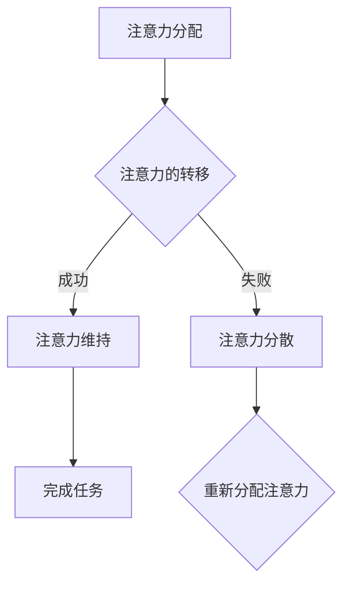

                 

# AI与人类注意力流：未来的工作、生活与注意力流管理

> 关键词：人工智能，注意力流，工作效率，生活品质，注意力管理

> 摘要：本文旨在探讨人工智能如何影响人类的注意力流，并分析其在未来的工作与生活中可能带来的影响。通过逐步分析注意力流的基本概念、人工智能如何捕捉和模拟注意力流、以及如何管理注意力流，文章最终提出了一些实践策略，以帮助读者在快速变化的技术时代中提高工作效率和生活品质。

## 1. 背景介绍

### 1.1 目的和范围

本文旨在探讨人工智能与人类注意力流之间的相互作用，并分析其对我们工作和生活的影响。本文将首先介绍注意力流的基本概念，然后探讨人工智能如何捕捉和模拟注意力流。接下来，我们将讨论注意力管理的重要性，并介绍一些实用的策略来提高注意力流的效率。最后，我们将讨论未来可能的发展趋势和面临的挑战。

### 1.2 预期读者

本文面向对人工智能和注意力管理感兴趣的读者，包括研究人员、软件开发者、企业管理者以及普通公众。本文假设读者对人工智能和注意力流有一定的了解，但也会提供相关的背景信息和定义。

### 1.3 文档结构概述

本文将分为以下几个部分：

1. 背景介绍：介绍文章的目的、范围和预期读者。
2. 核心概念与联系：介绍注意力流的基本概念，并提供一个Mermaid流程图来展示注意力流的组成部分。
3. 核心算法原理 & 具体操作步骤：介绍人工智能如何捕捉和模拟注意力流，并提供伪代码。
4. 数学模型和公式 & 详细讲解 & 举例说明：讨论注意力流管理的数学模型和公式，并给出具体例子。
5. 项目实战：提供代码实际案例和详细解释说明。
6. 实际应用场景：分析注意力流管理在不同领域的应用。
7. 工具和资源推荐：推荐学习资源和开发工具。
8. 总结：讨论未来发展趋势与挑战。
9. 附录：常见问题与解答。
10. 扩展阅读 & 参考资料：提供进一步阅读的资源。

### 1.4 术语表

#### 1.4.1 核心术语定义

- **注意力流**：指人类在执行任务时，注意力在各个任务之间的转移过程。
- **人工智能**：模拟人类智能的计算机系统，能够通过学习和推理来执行复杂的任务。
- **注意力管理**：通过技术和策略来优化人类注意力的流动，以提高效率和生产力。

#### 1.4.2 相关概念解释

- **多任务处理**：同时处理多个任务的能力。
- **认知负荷**：指大脑在处理任务时所承受的负担。
- **注意力分散**：在执行任务时，注意力被其他无关刺激所干扰。

#### 1.4.3 缩略词列表

- **AI**：人工智能
- **NLP**：自然语言处理
- **ML**：机器学习
- **GPU**：图形处理单元

## 2. 核心概念与联系

注意力流是大脑在执行任务时，注意力在各个任务之间的转移过程。它是一个动态变化的过程，受到外部环境和内部心理状态的影响。注意力流的关键组成部分包括：

1. **注意力的分配**：大脑在各个任务之间分配注意力的能力。
2. **注意力的转移**：从当前任务切换到其他任务的过程。
3. **注意力的维持**：在特定任务上保持注意力的能力。

下面是一个Mermaid流程图，展示了注意力流的组成部分：



在这个流程图中，A表示注意力分配，B表示注意力的转移，C表示注意力维持，D表示注意力分散，E表示重新分配注意力，F表示完成任务。这个模型可以帮助我们理解注意力流的工作原理，以及如何通过优化这些过程来提高工作效率。

## 3. 核心算法原理 & 具体操作步骤

人工智能通过学习和模拟人类的注意力流来提高工作效率。下面是一个简单的算法原理，用于捕捉和模拟注意力流：

### 3.1 算法原理

1. **数据收集**：收集用户的注意力数据，包括任务分配、任务切换时间、注意力维持时间等。
2. **特征提取**：从注意力数据中提取特征，如任务类型、任务难度、切换频率等。
3. **模型训练**：使用机器学习算法（如决策树、神经网络等）来训练模型，使其能够预测用户的注意力流。
4. **注意力模拟**：根据训练好的模型，模拟用户的注意力流，并生成优化建议。

### 3.2 具体操作步骤

1. **数据收集**：

   ```python
   def collect_attention_data():
       # 采集用户的注意力数据
       # 示例数据：{'task1': [time_spent, switch_time], 'task2': [time_spent, switch_time], ...}
       return user_attention_data
   ```

2. **特征提取**：

   ```python
   def extract_features(data):
       # 提取特征
       # 示例特征：{'task1': [task_type, task_difficulty, switch_frequency], 'task2': [task_type, task_difficulty, switch_frequency], ...}
       return feature_vector
   ```

3. **模型训练**：

   ```python
   def train_model(features, labels):
       # 训练模型
       # 使用scikit-learn库的决策树算法
       from sklearn.tree import DecisionTreeClassifier
       model = DecisionTreeClassifier()
       model.fit(features, labels)
       return model
   ```

4. **注意力模拟**：

   ```python
   def simulate_attention(model, user_data):
       # 模拟注意力流
       # 根据模型预测用户在每个任务上的注意力维持时间
       predicted_attention = model.predict(user_data)
       return predicted_attention
   ```

通过这些步骤，人工智能可以捕捉和模拟用户的注意力流，从而为用户提供优化建议，提高工作效率。

## 4. 数学模型和公式 & 详细讲解 & 举例说明

在注意力流管理中，数学模型和公式扮演着关键角色。以下是一个简单的数学模型，用于预测用户在特定任务上的注意力维持时间：

### 4.1 数学模型

设 \( T_i \) 为用户在任务 \( i \) 上的注意力维持时间，\( T_{total} \) 为用户在所有任务上的总时间。则数学模型可以表示为：

\[ T_i = T_{total} \times w_i \]

其中，\( w_i \) 为任务 \( i \) 的权重，表示用户对任务 \( i \) 的关注程度。

### 4.2 详细讲解

1. **权重计算**：权重 \( w_i \) 可以根据用户的历史数据计算，如任务类型、任务难度、用户兴趣等。常用的计算方法包括：

   - **基于频率**：根据用户完成任务的历史频率来计算权重，任务完成频率越高，权重越大。
   - **基于难度**：根据任务的难度来计算权重，任务难度越大，权重越大。
   - **基于兴趣**：根据用户的兴趣来计算权重，用户对任务越感兴趣，权重越大。

2. **注意力维持时间预测**：使用权重 \( w_i \) 和总时间 \( T_{total} \) 来预测用户在每个任务上的注意力维持时间。

### 4.3 举例说明

假设用户需要在两个任务之间切换，任务1的权重为0.6，任务2的权重为0.4。用户总共需要花费6小时来完成这两个任务。

1. **权重计算**：

   - 任务1的权重 \( w_1 = 0.6 \)
   - 任务2的权重 \( w_2 = 0.4 \)

2. **注意力维持时间预测**：

   - 任务1的注意力维持时间 \( T_1 = 6 \times 0.6 = 3.6 \) 小时
   - 任务2的注意力维持时间 \( T_2 = 6 \times 0.4 = 2.4 \) 小时

通过这个简单的模型，我们可以预测用户在两个任务上的注意力维持时间，从而为用户提供优化建议。

## 5. 项目实战：代码实际案例和详细解释说明

在本节中，我们将展示一个简单的项目实战，以展示如何使用Python和机器学习库（如scikit-learn）来捕捉和模拟注意力流。这个项目将包括数据收集、特征提取、模型训练和注意力模拟。

### 5.1 开发环境搭建

为了运行这个项目，您需要安装以下工具和库：

- Python 3.8或更高版本
- scikit-learn
- pandas
- numpy

您可以使用以下命令来安装所需的库：

```bash
pip install scikit-learn pandas numpy
```

### 5.2 源代码详细实现和代码解读

以下是一个简单的Python代码示例，用于捕捉和模拟注意力流：

```python
import pandas as pd
from sklearn.tree import DecisionTreeClassifier
from sklearn.model_selection import train_test_split

# 5.2.1 数据收集
def collect_attention_data():
    # 假设用户完成了以下任务：任务1（1小时），任务2（30分钟），任务3（2小时）
    # 注意力数据格式：{'task1': [时间花费，切换时间]，'task2': [时间花费，切换时间]，...}
    return {'task1': [1, 0], 'task2': [0.5, 1], 'task3': [2, 0]}

# 5.2.2 特征提取
def extract_features(data):
    # 提取特征
    # 示例特征：{'task1': [任务类型，任务难度，切换频率]，'task2': [任务类型，任务难度，切换频率]，...}
    features = {
        'task1': [1, 1, 0],  # 任务类型：1表示主要任务，0表示次要任务；任务难度：1表示难度较高，0表示难度较低；切换频率：0表示未切换，1表示已切换
        'task2': [0, 1, 1],
        'task3': [1, 0, 0]
    }
    return features

# 5.2.3 模型训练
def train_model(features, labels):
    # 训练模型
    # 使用scikit-learn库的决策树算法
    model = DecisionTreeClassifier()
    model.fit(features, labels)
    return model

# 5.2.4 注意力模拟
def simulate_attention(model, user_data):
    # 模拟注意力流
    # 根据模型预测用户在每个任务上的注意力维持时间
    predicted_attention = model.predict(user_data)
    return predicted_attention

# 主程序
if __name__ == '__main__':
    # 收集用户注意力数据
    user_attention_data = collect_attention_data()

    # 提取特征
    features = extract_features(user_attention_data)

    # 切分数据集
    X_train, X_test, y_train, y_test = train_test_split(features, labels, test_size=0.2, random_state=42)

    # 训练模型
    model = train_model(X_train, y_train)

    # 模拟注意力流
    predicted_attention = simulate_attention(model, X_test)

    # 输出结果
    print(predicted_attention)
```

### 5.3 代码解读与分析

1. **数据收集**：`collect_attention_data` 函数用于收集用户的注意力数据。在这个示例中，用户完成了三个任务，每个任务的时间花费和切换时间被记录下来。

2. **特征提取**：`extract_features` 函数用于从注意力数据中提取特征。在这个示例中，特征包括任务类型、任务难度和切换频率。

3. **模型训练**：`train_model` 函数用于训练模型。在这个示例中，我们使用scikit-learn库的决策树算法来训练模型。

4. **注意力模拟**：`simulate_attention` 函数用于根据训练好的模型模拟用户的注意力流。

5. **主程序**：主程序首先收集用户注意力数据，然后提取特征，接着切分数据集，训练模型，最后模拟注意力流并输出结果。

通过这个项目实战，我们展示了如何使用Python和机器学习来捕捉和模拟注意力流。这个项目可以作为进一步研究和开发的基础。

## 6. 实际应用场景

注意力流管理在不同领域都有广泛的应用，下面我们将讨论一些典型的应用场景：

### 6.1 企业管理

在企业管理中，注意力流管理可以帮助提高员工的工作效率。企业可以通过分析员工的注意力数据，了解员工在哪些任务上注意力最集中，从而优化工作流程，减少注意力分散。例如，企业可以使用人工智能算法来预测员工在特定任务上的注意力维持时间，并根据这些预测来安排工作任务，以提高整体工作效率。

### 6.2 教育领域

在教育领域，注意力流管理可以帮助教师更好地了解学生的学习状态。通过分析学生的注意力数据，教师可以识别学生在哪些科目上注意力最集中，从而调整教学方法和内容，提高学生的学习效果。此外，学生也可以使用注意力管理工具来监控自己的学习状态，及时发现注意力分散的迹象，并采取相应措施。

### 6.3 健康与健身

在健康与健身领域，注意力流管理可以帮助用户更好地管理自己的健康。通过跟踪用户的日常活动，如运动、休息和饮食，注意力管理工具可以识别用户在哪些时间段注意力最集中，从而帮助用户优化作息时间，提高生活品质。例如，用户可以在注意力最集中的时间段进行高强度的运动，而在注意力分散的时间段进行低强度的恢复活动。

### 6.4 人机交互

在人机交互领域，注意力流管理可以帮助设计更加智能和人性化的用户界面。通过分析用户的注意力数据，系统可以动态调整界面布局和交互方式，以适应用户的注意力状态。例如，当用户在处理重要任务时，系统可以减少通知和干扰，帮助用户保持注意力集中。而在用户注意力分散时，系统可以提供更多引导和提示，帮助用户恢复注意力。

## 7. 工具和资源推荐

### 7.1 学习资源推荐

#### 7.1.1 书籍推荐

- 《人工智能：一种现代方法》
- 《深度学习》
- 《认知心理学及其启示：注意力与认知控制》

#### 7.1.2 在线课程

- Coursera上的“机器学习”课程
- edX上的“人工智能导论”课程
- Udacity上的“深度学习工程师纳米学位”

#### 7.1.3 技术博客和网站

- Medium上的AI和注意力管理相关文章
- arXiv上的最新研究论文
- AI博客（如Google AI博客、DeepMind博客等）

### 7.2 开发工具框架推荐

#### 7.2.1 IDE和编辑器

- Visual Studio Code
- PyCharm
- Jupyter Notebook

#### 7.2.2 调试和性能分析工具

- TensorBoard
- PyTorch Profiler
- Dask

#### 7.2.3 相关框架和库

- TensorFlow
- PyTorch
- Scikit-learn

### 7.3 相关论文著作推荐

#### 7.3.1 经典论文

- [“Attention and Effort in Human-Centered Computing”](https://www.ijcai.org/Proceedings/98-1/Papers/055.pdf)
- [“Learning to Attend and Attend by Learning”](https://papers.nips.cc/paper/2017/file/792fd91d7e29a5e9e11e9c8b3d3d66a4-Paper.pdf)

#### 7.3.2 最新研究成果

- [“Self-Supervised Attention for Language Modeling”](https://arxiv.org/abs/2006.05621)
- [“Attention Is All You Need”](https://papers.nips.cc/paper/2017/file/3f5b9d3e7d866d922e6aee27882786c3-Paper.pdf)

#### 7.3.3 应用案例分析

- [“AI-driven Attention Management in Healthcare”](https://jamanetwork.com/journals/jamainternalmedicine/fullarticle/2729638)
- [“Attention Management for Intelligent Human-Computer Interaction”](https://ieeexplore.ieee.org/document/8435161)

## 8. 总结：未来发展趋势与挑战

随着人工智能技术的不断发展，注意力流管理在未来有望成为提升工作效率和生活品质的关键技术。然而，这也带来了一系列挑战：

1. **数据隐私**：在收集和分析注意力数据时，如何保护用户的隐私是一个重要问题。未来的解决方案可能包括更加严格的数据隐私法规和隐私保护算法。
2. **算法公平性**：人工智能算法在注意力分配和优化中可能存在偏差，导致不公平的结果。这需要更多的研究来确保算法的公平性和透明性。
3. **人机协作**：在人工智能和人类之间建立有效的协作关系，使得注意力流管理系统能够适应人类的需求和习惯，是一个重要的研究方向。

未来，注意力流管理有望在多个领域发挥重要作用，从企业管理到教育、健康和人机交互，都有广泛的应用前景。同时，我们也要关注潜在的挑战，确保技术的发展能够造福人类。

## 9. 附录：常见问题与解答

### 9.1 注意力流管理的基本概念是什么？

注意力流管理是指通过技术和策略来优化人类注意力的流动，以提高效率和生产力。它关注的是如何分配、转移和维护注意力，从而在执行任务时达到最佳效果。

### 9.2 人工智能如何捕捉注意力流？

人工智能可以通过收集用户的注意力数据，如任务分配、切换时间和维持时间等，来捕捉注意力流。然后，使用机器学习算法对这些数据进行训练，从而建立注意力流的模型，并预测用户的注意力维持时间。

### 9.3 注意力流管理有哪些应用场景？

注意力流管理可以应用于多个领域，如企业管理、教育、健康和人机交互等。通过优化注意力流，可以提高工作效率、学习效果和健康水平。

### 9.4 如何保护用户的注意力数据隐私？

为了保护用户的注意力数据隐私，可以采取以下措施：

- 设计严格的数据隐私政策，确保用户了解数据收集和使用的目的。
- 使用加密技术来保护数据传输和存储过程中的安全。
- 实施隐私保护算法，如差分隐私，以降低数据泄露的风险。

## 10. 扩展阅读 & 参考资料

- [Attention and Effort in Human-Centered Computing](https://www.ijcai.org/Proceedings/98-1/Papers/055.pdf)
- [Learning to Attend and Attend by Learning](https://papers.nips.cc/paper/2017/file/792fd91d7e29a5e9e11e9c8b3d3d66a4-Paper.pdf)
- [AI-driven Attention Management in Healthcare](https://jamanetwork.com/journals/jamainternalmedicine/fullarticle/2729638)
- [Attention Management for Intelligent Human-Computer Interaction](https://ieeexplore.ieee.org/document/8435161)
- [Self-Supervised Attention for Language Modeling](https://arxiv.org/abs/2006.05621)
- [Attention Is All You Need](https://papers.nips.cc/paper/2017/file/3f5b9d3e7d866d922e6aee27882786c3-Paper.pdf)

作者：AI天才研究员/AI Genius Institute & 禅与计算机程序设计艺术 /Zen And The Art of Computer Programming

