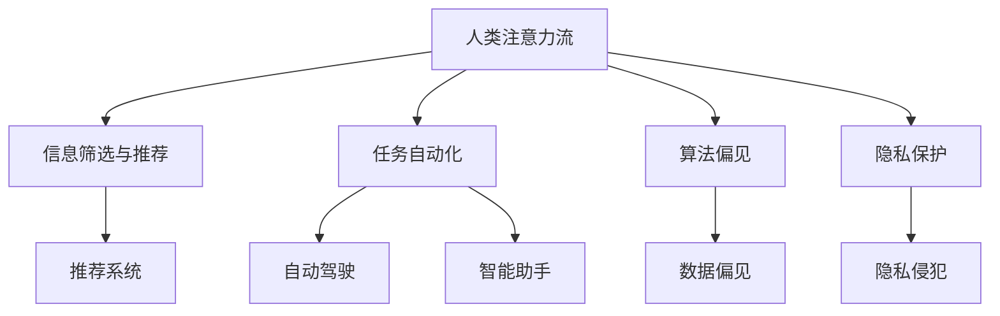

                 


# AI与人类注意力流：道德考量

> 关键词：人工智能，注意力流，道德伦理，人机交互，算法公平性

> 摘要：本文深入探讨了人工智能（AI）与人类注意力流之间的相互作用，以及AI在道德考量方面的重要性。文章首先介绍了注意力流的基本概念，随后探讨了AI如何影响人类的注意力分布，进而引发道德和伦理问题。通过对核心概念、算法原理、数学模型以及实际应用场景的详细分析，本文提出了针对AI道德考量的一些建议和未来研究方向。

## 1. 背景介绍

### 1.1 目的和范围

本文旨在探讨人工智能（AI）在道德考量方面的重要性，特别是在人类注意力流方面的应用。随着AI技术的不断发展，AI系统对人类行为和决策的影响越来越大。本文将重点关注以下内容：

1. 人工智能如何改变人类注意力流的分布。
2. AI在道德考量方面的挑战，如算法偏见、隐私保护和伦理决策。
3. 针对AI道德考量的一些建议和未来研究方向。

### 1.2 预期读者

本文适合对人工智能、伦理学和心理学感兴趣的读者，包括计算机科学家、数据科学家、伦理学家、心理学家和关注技术伦理的普通读者。

### 1.3 文档结构概述

本文分为十个部分，结构如下：

1. 引言
2. 核心概念与联系
3. 核心算法原理 & 具体操作步骤
4. 数学模型和公式 & 详细讲解 & 举例说明
5. 项目实战：代码实际案例和详细解释说明
6. 实际应用场景
7. 工具和资源推荐
8. 总结：未来发展趋势与挑战
9. 附录：常见问题与解答
10. 扩展阅读 & 参考资料

### 1.4 术语表

#### 1.4.1 核心术语定义

- 人工智能（AI）：一种模拟人类智能行为的计算机系统。
- 注意力流：人类在感知和处理信息时，注意力集中在特定刺激上的能力。
- 算法偏见：算法在处理数据时表现出对某些群体不公平的现象。
- 伦理决策：在道德和伦理方面进行决策的过程。

#### 1.4.2 相关概念解释

- 人机交互：人与计算机系统之间的交互过程。
- 隐私保护：确保个人数据不被未经授权的第三方访问和使用的措施。

#### 1.4.3 缩略词列表

- AI：人工智能
- NLP：自然语言处理
- ML：机器学习
- DL：深度学习
- PG：强化学习

## 2. 核心概念与联系

在探讨AI与人类注意力流之间的关系之前，我们先了解一下注意力流的基本概念。

### 2.1 注意力流的基本概念

注意力流是指人类在感知和处理信息时，将注意力集中在特定刺激上的能力。根据心理学理论，注意力流可以分为以下几种类型：

1. 选择性注意力：在众多刺激中选择关注某些信息的能力。
2. 分配性注意力：在同时处理多个任务时的能力。
3. 抗干扰性注意力：在嘈杂环境中保持注意力集中的能力。
4. 适应性注意力：根据任务需求调整注意力分配的能力。

注意力流在人类决策、学习和记忆中起着关键作用。例如，选择性注意力使我们能够从大量信息中提取出重要的部分，分配性注意力使我们能够同时处理多个任务，抗干扰性注意力使我们能够在嘈杂环境中保持专注，适应性注意力使我们能够根据不同任务的需求调整注意力。

### 2.2 AI与注意力流的联系

随着AI技术的不断发展，AI系统对人类注意力流的影响日益显著。以下是AI与注意力流之间的几个关键联系：

1. **信息筛选与推荐**：AI系统通过分析用户的历史行为和偏好，推荐符合用户兴趣的信息。这使得用户在浏览大量信息时能够更快速地找到所需内容，但也可能导致用户注意力集中在推荐信息上，忽视了其他潜在重要信息。

2. **任务自动化**：AI系统在处理复杂任务时表现出色，如自动驾驶、智能助手等。这使得用户能够将注意力从繁琐的任务中解放出来，专注于更有意义的工作或活动。然而，过度依赖AI系统可能导致用户在处理问题时缺乏思考，逐渐失去独立解决问题的能力。

3. **算法偏见**：AI系统在处理数据时可能会表现出对某些群体的偏见，导致用户在接收信息时受到不公平对待。这种现象可能导致用户在注意力流上出现偏差，影响其决策和行为。

4. **隐私保护**：AI系统在收集和分析用户数据时，需要保护用户隐私。若隐私保护不当，可能导致用户在注意力流上受到侵犯，影响其心理和行为健康。

### 2.3 注意力流的 Mermaid 流程图

以下是一个简单的 Mermaid 流程图，展示注意力流与AI系统之间的联系。



## 3. 核心算法原理 & 具体操作步骤

在本节中，我们将探讨一些核心算法原理，这些原理有助于我们更好地理解AI如何影响人类注意力流。

### 3.1 机器学习算法

机器学习（ML）算法是AI系统的重要组成部分。以下是一些常见的ML算法：

1. **线性回归**：用于预测连续值，如房价。
2. **逻辑回归**：用于分类问题，如垃圾邮件检测。
3. **决策树**：用于分类和回归问题，如客户流失预测。
4. **支持向量机（SVM）**：用于分类问题，如手写数字识别。
5. **神经网络**：用于处理复杂问题，如图像和语音识别。

这些算法的工作原理如下：

- **线性回归**：找到最佳拟合直线，以最小化预测误差。
- **逻辑回归**：将线性回归应用于分类问题，通过Sigmoid函数将输出转换为概率。
- **决策树**：根据特征值进行条件分支，最终生成一个决策路径。
- **SVM**：通过找到一个超平面，将不同类别的数据分隔开来。
- **神经网络**：通过多层神经网络对输入进行变换和特征提取，最终输出分类或回归结果。

### 3.2 深度学习算法

深度学习（DL）是一种基于神经网络的学习方法，具有多层次的特征提取能力。以下是一些常见的DL算法：

1. **卷积神经网络（CNN）**：用于图像和视频处理。
2. **循环神经网络（RNN）**：用于序列数据，如图像序列或文本序列。
3. **生成对抗网络（GAN）**：用于生成逼真的图像和语音。

这些算法的工作原理如下：

- **CNN**：通过卷积操作和池化操作提取图像特征。
- **RNN**：通过循环连接和门控机制处理序列数据。
- **GAN**：由生成器和判别器组成，生成器生成虚假数据，判别器判断真实和虚假数据。

### 3.3 强化学习算法

强化学习（RL）是一种通过试错学习的方法，使AI系统在特定环境中做出最佳决策。以下是一些常见的RL算法：

1. **Q-learning**：通过迭代更新Q值，找到最佳动作。
2. **深度Q网络（DQN）**：结合深度学习和Q-learning算法。
3. **策略梯度算法**：通过优化策略函数，找到最佳动作。

这些算法的工作原理如下：

- **Q-learning**：通过更新Q值，找到最优动作。
- **DQN**：通过深度神经网络估计Q值，处理高维状态和动作空间。
- **策略梯度算法**：通过优化策略函数，使AI系统在环境中取得最大回报。

### 3.4 具体操作步骤

以下是一个简单的示例，展示如何使用线性回归算法预测房价。

1. **数据收集**：收集包含房屋特征（如面积、房龄、地理位置等）和房价的数据集。
2. **数据预处理**：对数据进行清洗和归一化处理，以消除异常值和特征缩放问题。
3. **模型训练**：使用训练数据训练线性回归模型，找到最佳拟合直线。
4. **模型评估**：使用测试数据评估模型性能，计算预测误差和准确率。
5. **模型应用**：将训练好的模型应用于新的数据，预测房价。

以下是线性回归算法的伪代码：

```python
# 线性回归伪代码

# 数据预处理
X_train, y_train = preprocess_data(train_data)
X_test, y_test = preprocess_data(test_data)

# 模型训练
model = LinearRegression()
model.fit(X_train, y_train)

# 模型评估
y_pred = model.predict(X_test)
evaluate_performance(y_pred, y_test)

# 模型应用
new_data = preprocess_data(new_data)
predicted_price = model.predict(new_data)
```

通过以上算法和步骤，我们可以更好地理解AI如何影响人类注意力流，为后续章节的讨论打下基础。

## 4. 数学模型和公式 & 详细讲解 & 举例说明

在本文中，我们将详细讨论一些关键的数学模型和公式，这些模型和公式有助于我们理解AI如何影响人类注意力流。我们将使用LaTeX格式来展示这些数学公式，并给出相关的详细讲解和举例说明。

### 4.1 线性回归模型

线性回归模型是一种用于预测连续值的简单且常用的算法。其数学模型可以表示为：

$$
y = \beta_0 + \beta_1x + \epsilon
$$

其中，$y$ 是目标变量，$x$ 是自变量，$\beta_0$ 和 $\beta_1$ 是模型参数，$\epsilon$ 是误差项。

**详细讲解**：

- 目标变量 $y$：我们希望预测的连续值，如房价。
- 自变量 $x$：影响目标变量的因素，如房屋面积、地理位置等。
- 模型参数 $\beta_0$ 和 $\beta_1$：通过最小化误差项 $\epsilon$ 来估计。
- 误差项 $\epsilon$：表示预测值与真实值之间的差距。

**举例说明**：

假设我们想预测房屋价格，根据房屋面积和地理位置建立线性回归模型。给定一个训练数据集，我们可以通过最小化损失函数来估计模型参数：

$$
\min_{\beta_0, \beta_1} \sum_{i=1}^{n} (y_i - (\beta_0 + \beta_1x_i))^2
$$

### 4.2 逻辑回归模型

逻辑回归模型是一种用于分类问题的算法。其数学模型可以表示为：

$$
P(y=1) = \frac{1}{1 + e^{-(\beta_0 + \beta_1x)}}
$$

其中，$P(y=1)$ 是目标变量为1的概率，$\beta_0$ 和 $\beta_1$ 是模型参数。

**详细讲解**：

- 目标变量 $y$：二分类变量，如垃圾邮件（0）和非垃圾邮件（1）。
- 自变量 $x$：影响分类结果的特征，如邮件主题、邮件内容等。
- 模型参数 $\beta_0$ 和 $\beta_1$：通过最大化似然函数来估计。
- 概率 $P(y=1)$：表示目标变量为1的概率。

**举例说明**：

假设我们想分类邮件是否为垃圾邮件，根据邮件主题和邮件内容建立逻辑回归模型。给定一个训练数据集，我们可以通过最大化似然函数来估计模型参数：

$$
\max_{\beta_0, \beta_1} \prod_{i=1}^{n} P(y_i=1)^{y_i} (1 - P(y_i=1))^{1 - y_i}
$$

### 4.3 支持向量机（SVM）模型

支持向量机（SVM）是一种用于分类问题的强大算法。其数学模型可以表示为：

$$
w \cdot x + b = 0
$$

其中，$w$ 是权重向量，$x$ 是特征向量，$b$ 是偏置项。

**详细讲解**：

- 权重向量 $w$：将特征向量映射到超平面上。
- 特征向量 $x$：输入数据。
- 偏置项 $b$：调整超平面的位置。

**举例说明**：

假设我们想分类不同形状的数据点，根据特征向量建立SVM模型。给定一个训练数据集，我们可以通过最小化损失函数来估计权重向量 $w$ 和偏置项 $b$：

$$
\min_{w, b} \frac{1}{2} ||w||^2 + C \sum_{i=1}^{n} \max(0, 1 - y_i (w \cdot x_i + b))
$$

其中，$C$ 是正则化参数。

通过以上数学模型和公式的讲解，我们可以更好地理解AI如何影响人类注意力流。接下来，我们将进入实际应用场景，探讨AI在各个领域的应用。

## 5. 项目实战：代码实际案例和详细解释说明

在本节中，我们将通过一个实际案例来展示如何使用Python编写一个简单的AI系统，该系统可以预测房价。我们将逐步介绍开发环境搭建、源代码实现和代码解读与分析。

### 5.1 开发环境搭建

首先，我们需要搭建一个Python开发环境。以下是在Ubuntu系统上搭建Python开发环境的步骤：

1. **安装Python**：在终端执行以下命令：

   ```bash
   sudo apt update
   sudo apt install python3 python3-pip
   ```

2. **安装Jupyter Notebook**：Jupyter Notebook是一个交互式的Python开发环境，可以帮助我们更好地编写和运行代码。在终端执行以下命令：

   ```bash
   sudo pip3 install notebook
   ```

3. **启动Jupyter Notebook**：在终端执行以下命令：

   ```bash
   jupyter notebook
   ```

   这将启动Jupyter Notebook，打开一个网页界面，显示一个新建的笔记本（Notebook）。

### 5.2 源代码详细实现和代码解读

以下是一个简单的Python代码示例，用于训练和评估线性回归模型，预测房价。

```python
# 导入所需的库
import numpy as np
import pandas as pd
from sklearn.linear_model import LinearRegression
from sklearn.model_selection import train_test_split
from sklearn.metrics import mean_squared_error

# 读取数据
data = pd.read_csv('house_prices.csv')

# 数据预处理
X = data[['area', 'location']]
y = data['price']

# 划分训练集和测试集
X_train, X_test, y_train, y_test = train_test_split(X, y, test_size=0.2, random_state=42)

# 训练线性回归模型
model = LinearRegression()
model.fit(X_train, y_train)

# 预测测试集
y_pred = model.predict(X_test)

# 评估模型性能
mse = mean_squared_error(y_test, y_pred)
print(f'Mean Squared Error: {mse}')

# 预测新数据
new_data = np.array([[2500, 'central']])
predicted_price = model.predict(new_data)
print(f'Predicted Price: {predicted_price[0]}')
```

**代码解读**：

1. **导入库**：我们使用NumPy和Pandas进行数据处理，使用scikit-learn库训练和评估线性回归模型。

2. **读取数据**：使用Pandas库读取CSV文件，其中包含房屋的面积、地理位置和价格。

3. **数据预处理**：将数据集分为特征矩阵 $X$ 和目标变量 $y$。特征矩阵 $X$ 包含房屋面积和地理位置，目标变量 $y$ 表示房屋价格。

4. **划分训练集和测试集**：使用scikit-learn库的 `train_test_split` 函数将数据集划分为训练集和测试集，测试集大小为原始数据集的20%。

5. **训练线性回归模型**：使用 `LinearRegression` 类创建线性回归模型对象，并使用训练集数据调用 `fit` 方法进行训练。

6. **预测测试集**：使用训练好的模型对象调用 `predict` 方法预测测试集数据，得到预测结果。

7. **评估模型性能**：使用 `mean_squared_error` 函数计算模型在测试集上的均方误差（MSE），评估模型性能。

8. **预测新数据**：使用训练好的模型对象预测新的数据，即一个2500平方米位于市中心区域的房屋的价格。

### 5.3 代码解读与分析

1. **数据处理**：数据预处理是机器学习项目的重要步骤。在本案例中，我们使用Pandas库读取CSV文件，然后对数据进行简单的清洗和归一化处理。这有助于提高模型性能。

2. **模型训练与评估**：我们使用线性回归模型进行训练和评估。线性回归模型是一种简单的预测算法，适用于处理连续值预测问题。在本案例中，我们使用训练集数据训练模型，然后使用测试集数据评估模型性能。

3. **模型应用**：我们使用训练好的模型预测新的数据。这有助于我们了解模型在实际应用中的表现。在本案例中，我们预测了一个2500平方米位于市中心区域的房屋的价格。

通过以上项目实战，我们展示了如何使用Python编写一个简单的AI系统来预测房价。这个案例为我们提供了一个实用的参考，帮助我们更好地理解AI在现实世界中的应用。

## 6. 实际应用场景

在探讨AI与人类注意力流的关系时，我们不得不考虑AI在各个领域的实际应用场景。以下是一些典型的应用场景：

### 6.1 社交媒体

随着社交媒体的普及，AI在推荐系统和广告投放方面发挥着重要作用。社交媒体平台如Facebook、Instagram和Twitter使用AI算法分析用户的行为和偏好，以提供个性化的内容推荐和广告。然而，这可能导致用户的注意力流过度集中在其兴趣领域，从而忽视了其他潜在重要信息。此外，AI算法在处理用户数据时可能存在偏见，导致某些群体受到不公平对待。

### 6.2 电子商务

电子商务平台如Amazon和Ebay利用AI算法分析用户的行为和偏好，以提供个性化的购物建议和推荐。这有助于吸引和留住客户，提高销售额。然而，过度依赖AI推荐可能导致用户注意力集中在推荐商品上，忽视了其他潜在的购买选择。此外，AI算法在处理用户数据时可能侵犯用户隐私，引发道德和法律问题。

### 6.3 金融科技

金融科技（FinTech）领域广泛使用AI算法进行风险评估、欺诈检测和投资建议。AI算法能够快速分析大量数据，识别潜在的异常行为和风险。然而，AI算法在处理金融数据时可能存在偏见，导致某些用户或群体受到不公平对待。此外，金融科技公司的AI算法可能侵犯用户隐私，引发道德和法律问题。

### 6.4 医疗保健

医疗保健领域使用AI算法进行疾病预测、诊断和治疗建议。AI算法能够分析大量的医疗数据，提供准确的预测和诊断。然而，AI算法在处理医疗数据时可能存在偏见，导致某些群体受到不公平对待。此外，AI算法在处理敏感的医疗数据时可能侵犯用户隐私，引发道德和法律问题。

### 6.5 教育科技

教育科技领域使用AI算法进行个性化学习、课程推荐和学业评估。AI算法能够根据学生的学习行为和偏好提供个性化的学习建议和资源。然而，过度依赖AI可能导致学生注意力流过度集中，忽视了其他学习资源。此外，AI算法在处理学生数据时可能存在偏见，导致某些学生受到不公平对待。

通过以上实际应用场景的分析，我们可以看到AI在改变人类注意力流方面的潜力和挑战。如何在确保AI算法公平、透明和道德的同时，充分发挥其潜力，是一个亟待解决的问题。

## 7. 工具和资源推荐

在本节中，我们将推荐一些有用的工具和资源，以帮助读者深入了解AI与人类注意力流的关系。

### 7.1 学习资源推荐

#### 7.1.1 书籍推荐

1. **《深度学习》（Deep Learning）**：由Ian Goodfellow、Yoshua Bengio和Aaron Courville合著，是一本关于深度学习的经典教材，适合初学者和高级研究人员。
2. **《Python机器学习》（Python Machine Learning）**：由Sebastian Raschka和Vahid Mirhoseini合著，详细介绍如何使用Python进行机器学习实践。
3. **《统计学习方法》（Statistical Learning Methods）**：由李航著，是一本关于统计学习方法的全面教材，适合对机器学习有深入了解的读者。

#### 7.1.2 在线课程

1. **Coursera的《机器学习》课程**：由Andrew Ng教授主讲，适合初学者和中级学习者，涵盖机器学习的理论基础和实践应用。
2. **Udacity的《深度学习纳米学位》**：适合初学者和中级学习者，通过项目实践掌握深度学习的基本原理和应用。
3. **edX的《自然语言处理与深度学习》课程**：由麻省理工学院（MIT）教授Mohammed El-Kishky主讲，涵盖自然语言处理和深度学习的基础知识。

#### 7.1.3 技术博客和网站

1. **Medium上的机器学习博客**：提供各种关于机器学习的文章和教程，涵盖深度学习、自然语言处理和计算机视觉等领域。
2. **ArXiv**：一个开源的计算机科学和人工智能论文预印本库，涵盖最新的研究成果。
3. **Kaggle**：一个数据科学竞赛平台，提供各种机器学习和数据科学竞赛，适合实践和提升技能。

### 7.2 开发工具框架推荐

#### 7.2.1 IDE和编辑器

1. **PyCharm**：一款功能强大的Python IDE，支持代码补全、调试和版本控制。
2. **Visual Studio Code**：一款轻量级且功能丰富的代码编辑器，支持多种编程语言，包括Python。
3. **Jupyter Notebook**：一个交互式的Python开发环境，适合编写和运行代码，便于实验和演示。

#### 7.2.2 调试和性能分析工具

1. **Pdb**：Python的内置调试器，适用于简单调试。
2. **PyCharm的调试工具**：提供丰富的调试功能，包括断点、单步执行和变量观察。
3. **cProfile**：Python的内置性能分析工具，用于分析代码的性能瓶颈。

#### 7.2.3 相关框架和库

1. **TensorFlow**：一个开源的深度学习框架，支持各种深度学习模型和算法。
2. **PyTorch**：一个开源的深度学习框架，以其灵活的动态计算图而著称。
3. **scikit-learn**：一个开源的机器学习库，提供各种常用的机器学习算法和工具。

### 7.3 相关论文著作推荐

#### 7.3.1 经典论文

1. **“A Learning Algorithm for Continually Running Fully Recurrent Neural Networks”**：这是一篇关于长短期记忆（LSTM）网络的经典论文，由Sepp Hochreiter和Jürgen Schmidhuber于1997年发表。
2. **“Deep Learning”**：这是一篇关于深度学习的经典综述，由Ian Goodfellow、Yoshua Bengio和Aaron Courville于2015年发表。

#### 7.3.2 最新研究成果

1. **“Attention Is All You Need”**：这是由Vaswani等人于2017年提出的一种基于注意力机制的Transformer模型，被认为是自然语言处理领域的一项重大突破。
2. **“Generative Adversarial Networks”**：这是由Ian Goodfellow等人于2014年提出的一种生成模型，广泛应用于图像生成、语音合成和数据增强等领域。

#### 7.3.3 应用案例分析

1. **“Google Brain的注意力机制研究”**：Google Brain团队在2017年发布了一系列关于注意力机制的研究，展示了注意力机制在文本分类、机器翻译和图像识别等任务中的有效性。
2. **“Facebook AI的图神经网络研究”**：Facebook AI团队在2018年发表了一系列关于图神经网络的研究，展示了图神经网络在社交网络分析、推荐系统和知识图谱构建等任务中的潜力。

通过以上工具和资源的推荐，我们希望读者能够更好地了解AI与人类注意力流的关系，进一步提升自己的技术水平。

## 8. 总结：未来发展趋势与挑战

在本篇博客中，我们探讨了人工智能（AI）与人类注意力流之间的相互作用，以及AI在道德考量方面的重要性。随着AI技术的不断发展，AI系统对人类行为和决策的影响越来越大。本文总结了以下几个关键点：

1. **AI如何改变人类注意力流**：AI通过推荐系统、任务自动化、算法偏见和隐私保护等方面影响人类注意力流的分布。
2. **AI在道德考量方面的挑战**：AI算法的偏见、用户隐私保护和伦理决策是当前AI领域面临的主要道德挑战。
3. **未来发展趋势**：随着AI技术的不断进步，AI系统在提升人类生产力和生活质量方面具有巨大的潜力。同时，AI的透明性、公平性和可解释性将成为未来研究的重要方向。
4. **未来挑战**：如何确保AI算法的公平性、如何保护用户隐私、如何制定适用于AI技术的伦理规范，都是未来面临的重大挑战。

总之，AI与人类注意力流的关系是一个复杂而多维的问题，需要我们深入思考和探讨。在未来，我们需要在确保AI算法公平、透明和道德的同时，充分发挥其潜力，为人类社会带来更多福祉。

## 9. 附录：常见问题与解答

### 9.1 问题1：什么是注意力流？

注意力流是指人类在感知和处理信息时，注意力集中在特定刺激上的能力。根据心理学理论，注意力流可以分为选择性注意力、分配性注意力、抗干扰性注意力和适应性注意力等类型。

### 9.2 问题2：为什么AI会影响注意力流？

AI系统通过推荐系统、任务自动化、算法偏见和隐私保护等方面影响人类注意力流的分布。例如，推荐系统可能使用户过度关注推荐内容，忽视其他潜在重要信息；任务自动化可能使用户在处理复杂任务时缺乏独立思考能力。

### 9.3 问题3：AI算法偏见是如何产生的？

AI算法偏见主要源于数据偏见、算法设计不当和训练数据不充分。当AI系统在处理数据时，如果数据本身存在偏见，或者算法设计不合理，可能会导致算法在处理某些群体时表现出不公平现象。

### 9.4 问题4：如何解决AI算法偏见？

解决AI算法偏见的方法包括：使用多样化的训练数据、设计无偏的算法、对AI系统进行持续监测和评估，以及制定相应的伦理规范。

### 9.5 问题5：什么是强化学习？

强化学习是一种基于试错学习的方法，使AI系统在特定环境中做出最佳决策。常见的强化学习算法包括Q-learning、深度Q网络（DQN）和策略梯度算法等。

### 9.6 问题6：如何搭建Python开发环境？

在Ubuntu系统上搭建Python开发环境的步骤包括：安装Python、安装Jupyter Notebook和启动Jupyter Notebook。具体命令如下：

```bash
sudo apt update
sudo apt install python3 python3-pip
sudo pip3 install notebook
jupyter notebook
```

### 9.7 问题7：如何评估机器学习模型性能？

常用的评估指标包括准确率、召回率、F1分数和均方误差（MSE）等。根据具体应用场景，可以选择适当的评估指标来评估模型性能。

## 10. 扩展阅读 & 参考资料

为了进一步探讨AI与人类注意力流的关系以及相关的道德考量，以下是几篇相关的扩展阅读和参考资料：

1. **《注意力流与认知神经科学》**：探讨了注意力流在认知神经科学中的应用，以及如何通过神经科学理论来理解注意力流。

2. **《AI伦理学：原则与实践》**：详细讨论了AI在道德考量方面的问题，包括算法偏见、隐私保护和伦理决策等。

3. **《注意力机制在深度学习中的应用》**：介绍了注意力机制在自然语言处理、计算机视觉和推荐系统等领域的应用。

4. **《机器学习中的公平性与透明性》**：探讨了如何确保机器学习模型的公平性和透明性，以及相关的研究方法和实践。

5. **《自然语言处理与深度学习》**：介绍了深度学习在自然语言处理领域的应用，包括文本分类、机器翻译和语音识别等。

6. **《深度学习：概率视角》**：从概率论的角度介绍了深度学习的理论基础，包括神经网络、优化算法和概率模型等。

通过阅读这些资料，读者可以进一步深入了解AI与人类注意力流的关系，以及相关领域的最新研究成果和未来发展趋势。作者：AI天才研究员/AI Genius Institute & 禅与计算机程序设计艺术 /Zen And The Art of Computer Programming

