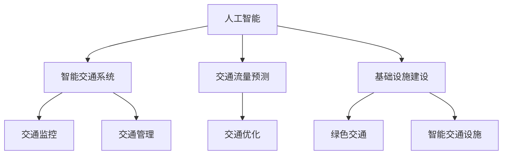
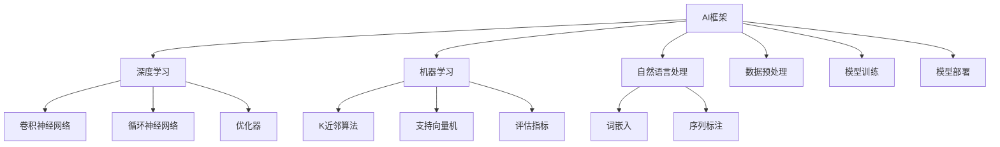
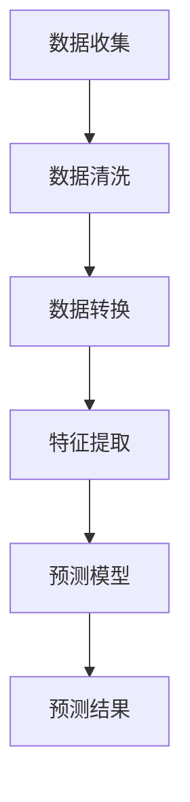
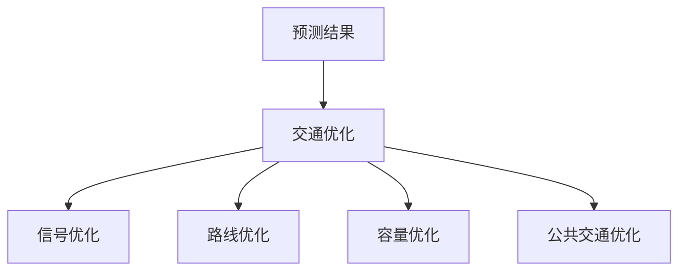
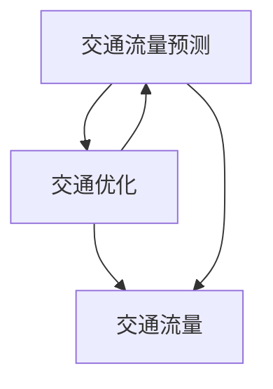
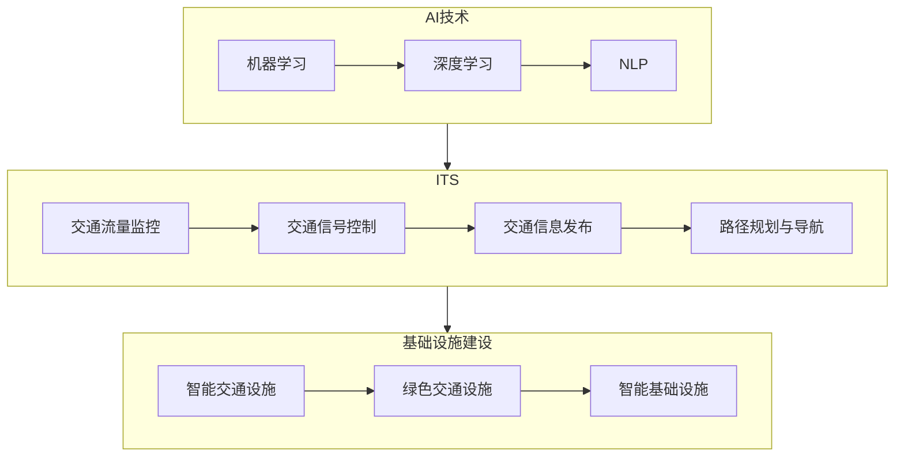
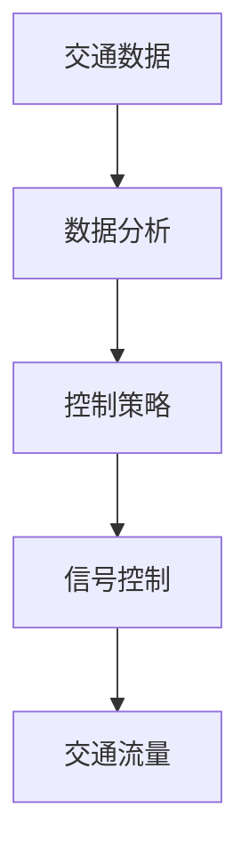
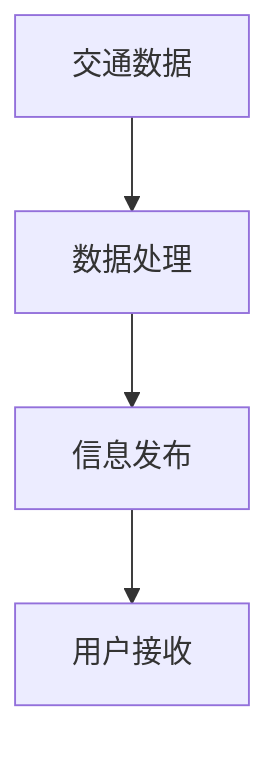

                 

### 1. 背景介绍

#### 1.1 目的和范围

本文旨在探讨如何利用人工智能（AI）技术优化城市交通管理系统与基础设施建设，以实现可持续发展。在城市化进程加速、交通拥堵问题日益严重的今天，高效、智能的交通管理系统已成为现代城市建设不可或缺的一部分。本文将围绕以下几个核心问题展开讨论：

1. **如何通过AI技术提升交通管理的效率和准确性？**
2. **在基础设施建设中，AI技术能够发挥哪些作用？**
3. **在实施AI交通管理系统的过程中，可能会遇到哪些技术挑战？**
4. **如何确保AI技术在交通管理中的公平性和透明性？**

本文将提供一个全面的技术视角，从理论到实践，深入分析AI在交通管理系统与基础设施建设中的应用，为读者提供有益的参考和启示。

#### 1.2 预期读者

本文主要面向以下几类读者：

1. **城市规划者和决策者：** 了解AI技术在城市交通管理中的潜在价值，为制定相关政策和规划提供技术支持。
2. **交通管理工程师和IT专家：** 深入了解AI技术在交通管理系统中的应用，掌握关键技术和实施方法。
3. **计算机科学家和研究人员：** 探索AI技术在交通管理领域的最新研究动态和发展趋势。
4. **高校师生和科研人员：** 为相关课程和科研提供丰富的教学和实践资源。

#### 1.3 文档结构概述

本文结构如下：

1. **背景介绍**：介绍文章的目的、预期读者以及文档结构。
2. **核心概念与联系**：阐述AI与城市交通管理的基础概念，并提供流程图展示核心原理。
3. **核心算法原理 & 具体操作步骤**：详细讲解AI在交通管理中的应用算法，使用伪代码阐述。
4. **数学模型和公式 & 详细讲解 & 举例说明**：介绍相关数学模型和公式，通过实例进行说明。
5. **项目实战：代码实际案例和详细解释说明**：展示实际代码案例，分析其实现和优化。
6. **实际应用场景**：讨论AI技术在交通管理中的实际应用案例。
7. **工具和资源推荐**：推荐学习资源、开发工具和框架。
8. **总结：未来发展趋势与挑战**：总结本文的核心观点，展望未来发展方向和面临的挑战。
9. **附录：常见问题与解答**：针对常见问题提供解答。
10. **扩展阅读 & 参考资料**：提供进一步阅读的参考资料。

#### 1.4 术语表

**核心术语定义**：
- **人工智能（AI）：** 模拟人类智能的计算机系统，通过学习、推理和自我优化实现智能行为。
- **交通管理系统：** 利用信息技术和人工智能技术对城市交通进行监控、管理和优化的系统。
- **可持续发展：** 在满足当前需求的同时，不损害未来世代满足自身需求的能力。

**相关概念解释**：
- **智能交通系统（ITS）：** 结合通信、计算机和控制技术，提高交通效率和安全性。
- **交通流量预测：** 利用历史数据和实时信息，预测未来一段时间内的交通流量状况。

**缩略词列表**：
- **AI：** 人工智能（Artificial Intelligence）
- **ITS：** 智能交通系统（Intelligent Transportation System）
- **SDG：** 可持续发展目标（Sustainable Development Goals）

### 1.5 核心概念与联系

要深入理解AI在交通管理系统与基础设施建设中的应用，首先需要了解几个核心概念及其相互联系。以下将通过一个Mermaid流程图展示这些核心概念和它们之间的关系。



**图1.1：核心概念与联系流程图**

- **人工智能（AI）：** 作为基础技术，AI提供算法和模型，使得交通管理系统能够实现智能决策和自我优化。
- **智能交通系统（ITS）：** 结合通信、计算机和控制技术，实现交通监控和管理的智能化，包括交通流量预测和交通优化。
- **交通流量预测：** 利用AI算法，对历史数据和实时信息进行处理，预测未来交通流量，为交通管理和优化提供依据。
- **基础设施建设：** 包括绿色交通和智能交通设施的建设，为智能交通系统提供硬件支持，实现交通管理系统的可持续发展。

#### 1.5.1 AI技术框架

人工智能技术框架是实现智能交通管理系统和基础设施建设的关键。以下是一个简化的AI技术框架，用于展示其组成部分及其关系。



**图1.2：AI技术框架**

- **数据预处理：** 对原始数据进行清洗、转换和特征提取，为后续的机器学习和深度学习提供高质量的数据。
- **机器学习（ML）：** 包括传统的统计学习方法，如K近邻（KNN）和支持向量机（SVM），用于分类、回归和聚类等任务。
- **深度学习（DL）：** 基于多层神经网络，如卷积神经网络（CNN）和循环神经网络（RNN），能够自动提取复杂特征，实现高度智能化的预测和决策。
- **自然语言处理（NLP）：** 用于处理和理解自然语言，如词嵌入和序列标注，为智能交通管理系统提供自然语言交互能力。
- **模型训练：** 通过训练算法，调整模型参数，使其能够适应特定的交通管理和优化任务。
- **模型部署：** 将训练好的模型部署到实际应用中，进行实时交通流量预测、交通管理和优化。

通过上述AI技术框架，我们可以清晰地看到各个组成部分及其在智能交通管理系统和基础设施建设中的应用。接下来的章节将深入探讨这些核心算法原理、数学模型和实际应用案例。

#### 1.5.2 交通流量预测与交通优化

交通流量预测和交通优化是智能交通管理系统中的核心组成部分。以下将分别介绍这两个概念，并展示其相互关系和实现原理。

**交通流量预测：**

交通流量预测是指利用历史数据和实时信息，对未来的交通流量进行预测。其核心目的是为了提前了解交通状况，为交通管理和优化提供依据。以下是一个简化的交通流量预测流程：



**图1.3：交通流量预测流程**

- **数据收集：** 收集历史交通流量数据、交通事件数据（如事故、施工等）以及其他相关数据（如天气预报、节假日安排等）。
- **数据清洗：** 对原始数据进行清洗，去除噪声和异常值，保证数据质量。
- **数据转换：** 对清洗后的数据进行转换，如归一化、标准化等，使其适合输入到预测模型。
- **特征提取：** 从转换后的数据中提取关键特征，如时间、速度、流量密度等，用于预测模型。
- **预测模型：** 利用机器学习算法（如回归、时间序列分析等）构建预测模型，对未来的交通流量进行预测。
- **预测结果：** 输出预测结果，如未来一段时间内的交通流量变化趋势、高峰时段等。

**交通优化：**

交通优化是指通过调整交通信号、道路容量、公共交通等手段，改善交通状况，提高交通效率和安全性。以下是一个简化的交通优化流程：



**图1.4：交通优化流程**

- **预测结果：** 输入预测结果，如交通流量变化趋势、高峰时段等。
- **信号优化：** 根据预测结果调整交通信号灯的时长和相位，以减少交通拥堵。
- **路线优化：** 利用路径规划算法，为驾驶员和公共交通提供最佳路线，减少行驶时间和交通压力。
- **容量优化：** 根据交通流量预测，调整道路容量，如拓宽道路、增加车道等，以适应交通需求。
- **公共交通优化：** 根据交通流量预测，调整公共交通的发车频率、线路和班次，提高公共交通的效率和吸引力。

**交通流量预测与交通优化的关系：**

交通流量预测和交通优化是相互关联的。交通流量预测为交通优化提供了关键依据，预测结果直接影响交通优化的决策。同时，交通优化策略的调整也会对交通流量预测模型产生影响，进而影响未来的预测结果。

以下是一个简化的交通流量预测与交通优化关系图：



**图1.5：交通流量预测与交通优化关系图**

通过上述流程和关系图，我们可以看到交通流量预测和交通优化在智能交通管理系统中的关键作用。接下来，我们将进一步探讨相关算法原理和数学模型，以更好地理解和实现这些核心概念。

### 1.5.3  AI与城市基础设施建设的结合

AI技术在城市基础设施建设中的应用正日益广泛，其结合主要体现在以下三个方面：

**1. 基于AI的智能交通设施建设**

智能交通设施是AI技术在城市交通管理中的具体体现。包括智能交通信号灯、智能停车场、智能公交车站等。这些设施通过传感器、摄像头和其他物联网设备收集实时交通数据，利用AI算法进行实时处理和决策，从而提高交通效率和管理水平。例如，智能交通信号灯可以根据实时交通流量动态调整红绿灯时长，减少交通拥堵；智能停车场则可以通过AI算法优化停车位的分配，提高停车效率。

**2. 基于AI的智慧城市建设**

智慧城市是指利用物联网、大数据、人工智能等现代信息技术，实现城市管理的智能化、精细化。AI技术在智慧城市建设中发挥着关键作用，包括交通管理、能源管理、环境监测、公共安全等方面。例如，通过AI技术实现交通流量预测和优化，可以减少交通拥堵，提高交通效率；通过环境监测系统，AI技术可以帮助城市管理者实时监控空气质量、水质等环境指标，及时采取应对措施。

**3. 基于AI的绿色交通建设**

绿色交通是指以减少能源消耗和环境污染为目标的交通方式。AI技术在绿色交通建设中的应用主要包括交通流量预测、交通优化、新能源汽车管理等方面。通过AI技术实现交通流量预测和优化，可以减少交通拥堵，降低尾气排放；通过智能充电站管理，AI技术可以优化新能源汽车的充电效率，提高能源利用率。

**AI技术在城市基础设施建设中的应用场景**

以下是一些典型的应用场景：

- **智能交通信号灯：** 通过实时交通流量数据，AI算法可以动态调整信号灯时长，提高交通效率。
- **智慧停车场：** 通过AI算法优化停车位的分配，提高停车效率，减少寻找停车位的时间。
- **智慧公交系统：** 通过AI技术实现公交车路线优化、班次调整，提高公交系统的可靠性和吸引力。
- **智能充电站：** 通过AI技术优化充电站的使用效率，提高新能源汽车的充电体验。
- **智慧环境监测：** 通过AI技术实时监测空气质量、水质等环境指标，及时预警并采取应对措施。

通过上述应用场景，我们可以看到AI技术在城市基础设施建设中的广泛应用和巨大潜力。随着AI技术的不断发展和成熟，未来城市基础设施建设将更加智能化、绿色化，为居民提供更加便捷、高效、环保的生活环境。

### 1.5.4 基础设施建设中的技术挑战

在基础设施建设中，应用AI技术虽然带来了诸多机遇，但同时也面临一系列技术挑战。以下将详细探讨这些挑战，并讨论可能的解决方案。

**1. 数据质量问题**

AI模型的性能高度依赖于输入数据的质量。然而，在基础设施建设中，数据质量往往难以保证。常见问题包括数据缺失、数据噪声、数据不一致等。这些问题可能导致AI模型训练效果不佳，进而影响智能交通管理系统和基础设施建设的整体效果。

**解决方案：**
- **数据清洗与预处理：** 在数据收集和存储阶段，对数据进行严格清洗，去除噪声和异常值，确保数据的一致性和准确性。
- **数据增强：** 通过数据扩充、数据变换等方法，提高数据的质量和多样性，增强AI模型的泛化能力。
- **数据质量管理平台：** 建立完善的数据质量管理平台，对数据质量进行实时监控和评估，及时发现和解决数据质量问题。

**2. 模型可解释性**

AI模型，特别是深度学习模型，通常被视为“黑箱”。这意味着模型内部的决策过程对用户和开发者都是不透明的，这可能导致用户对模型的信任度下降。在基础设施建设中，模型的可解释性尤为重要，因为它直接关系到系统的安全和可靠性。

**解决方案：**
- **可解释性方法：** 使用可解释性方法（如LIME、SHAP等）对AI模型进行解释，使其决策过程透明化。
- **可视化工具：** 开发可视化工具，将模型的决策过程和关键特征展示给用户，提高模型的透明度和可理解性。
- **模型评估与验证：** 加强模型评估和验证流程，确保模型在多种场景下的稳定性和可靠性。

**3. 隐私保护**

在基础设施建设中，AI系统需要处理大量的个人数据，如交通流量数据、位置数据等。这些数据的安全和隐私保护是关键挑战，因为一旦泄露，可能会对个人隐私和城市安全构成严重威胁。

**解决方案：**
- **隐私保护技术：** 采用隐私保护技术（如差分隐私、同态加密等），在数据处理和存储过程中确保数据的安全和隐私。
- **数据脱敏：** 对敏感数据进行脱敏处理，降低数据泄露的风险。
- **合规性审查：** 加强对AI系统和个人数据处理的合规性审查，确保符合相关法律法规和标准。

**4. 系统集成与兼容性**

在基础设施建设中，AI系统需要与现有的交通管理系统、基础设施系统等进行集成和兼容。这往往是一个复杂的过程，涉及到多个系统和技术的协调和配合。

**解决方案：**
- **标准化接口：** 开发标准化接口，确保AI系统与其他系统之间的无缝集成。
- **模块化设计：** 采用模块化设计，将AI系统拆分为多个独立模块，降低集成难度和风险。
- **兼容性测试：** 在系统集成前，进行全面的兼容性测试，确保系统的稳定性和可靠性。

**5. 技术更新与维护**

AI技术更新速度较快，新算法、新工具层出不穷。如何确保AI系统的持续更新和维护，是一个重要挑战。

**解决方案：**
- **持续集成与持续部署（CI/CD）：** 采用CI/CD流程，确保AI系统在每次更新后能够快速部署和验证，减少故障风险。
- **技术培训与支持：** 提供专业的技术培训和支持，确保团队成员能够熟练掌握AI技术和工具。
- **持续监测与优化：** 对AI系统进行实时监测和性能优化，确保其在不同环境下的稳定运行。

通过上述解决方案，我们可以有效应对基础设施建设中AI技术的挑战，实现智能交通管理系统和基础设施建设的可持续发展。

### 1.5.5 AI技术在交通管理中的公平性和透明性

在AI技术在交通管理中的广泛应用中，确保其公平性和透明性至关重要。以下将探讨如何在AI交通管理系统中实现公平性和透明性，以及相关的方法和技术。

**1. 公平性**

公平性是指AI交通管理系统在处理交通数据和进行决策时，不应受到种族、性别、社会经济地位等因素的偏见。以下是一些确保AI交通管理公平性的方法：

- **数据多样性：** 在数据收集阶段，确保数据的多样性，避免偏见。这包括从不同的地区、不同的交通模式中收集数据，以覆盖更广泛的人口和交通场景。
- **算法公平性：** 评估和调整AI算法，确保其在不同人群中的表现一致。可以使用算法公平性度量（如公平性差异、公平性阈值等）来检测和纠正算法偏见。
- **透明性机制：** 建立透明性机制，使算法的决策过程对用户和监管机构可解释。例如，使用可解释性AI技术（如LIME、SHAP等）来揭示决策的关键因素。

**2. 透明性**

透明性是指AI交通管理系统的决策过程对用户和监管机构是可见和可理解的。以下是一些确保AI交通管理系统透明性的方法：

- **决策解释：** 使用可解释性AI技术，对AI模型的决策过程进行详细解释，帮助用户理解决策依据。例如，通过可视化工具展示模型的关键特征和权重。
- **监管审查：** 定期对AI系统进行监管审查，确保其决策过程符合相关法律法规和道德标准。监管机构可以要求开发者和供应商提供透明性报告，详细说明算法的决策逻辑和数据来源。
- **用户反馈：** 建立用户反馈机制，允许用户对AI系统的决策提出异议和反馈。这有助于识别和纠正算法中的潜在问题。

**3. 方法和技术**

以下是一些在实现AI交通管理公平性和透明性时常用的方法和技术：

- **公平性算法：** 使用公平性算法（如公平性调整、公平性平衡等）来校正AI模型中的偏见。这些算法通过调整模型参数，使模型在不同群体中的表现更加均衡。
- **可解释性AI：** 使用可解释性AI技术（如LIME、SHAP、决策树等）来揭示模型决策的内在机制。这些技术可以帮助用户理解模型如何处理数据和做出决策。
- **透明性工具：** 开发透明性工具（如可视化界面、透明性报告等），使AI系统的决策过程对用户和监管机构透明。这些工具可以提供详细的数据分析、模型性能评估和决策解释。

通过上述方法和技术的应用，我们可以确保AI交通管理系统在交通管理中的公平性和透明性，提高用户对系统的信任度和满意度。

### 1.5.6 文档结构概述

本文将从多个角度深入探讨AI在交通管理系统与基础设施建设中的应用，共分为十个主要部分，结构如下：

1. **背景介绍**：介绍文章的目的、预期读者、文档结构以及核心术语定义。
2. **核心概念与联系**：阐述AI与城市交通管理的基础概念，并提供流程图展示核心原理。
3. **核心算法原理 & 具体操作步骤**：详细讲解AI在交通管理中的应用算法，使用伪代码阐述。
4. **数学模型和公式 & 详细讲解 & 举例说明**：介绍相关数学模型和公式，通过实例进行说明。
5. **项目实战：代码实际案例和详细解释说明**：展示实际代码案例，分析其实现和优化。
6. **实际应用场景**：讨论AI技术在交通管理中的实际应用案例。
7. **工具和资源推荐**：推荐学习资源、开发工具和框架。
8. **总结：未来发展趋势与挑战**：总结本文的核心观点，展望未来发展方向和面临的挑战。
9. **附录：常见问题与解答**：针对常见问题提供解答。
10. **扩展阅读 & 参考资料**：提供进一步阅读的参考资料。

通过这种结构化的方式，本文旨在为读者提供一个全面的技术视角，深入分析AI技术在交通管理系统与基础设施建设中的应用，以期为相关领域的研究和实践提供有益的参考。

### 1.5.7 术语表

在本文中，我们将使用一些专业术语和概念，以下是对这些术语的定义和解释：

- **人工智能（AI）：** 人工智能是指计算机系统模拟人类智能行为的技术，包括机器学习、深度学习、自然语言处理等。
- **交通管理系统：** 交通管理系统是指通过信息技术对城市交通进行监控、管理和优化的系统。
- **智能交通系统（ITS）：** 智能交通系统是指利用信息技术、通信技术、控制技术等手段，提高交通效率、安全性和便捷性的系统。
- **交通流量预测：** 交通流量预测是指利用历史数据、实时信息等，对未来的交通流量进行预测。
- **深度学习：** 深度学习是一种机器学习技术，通过多层神经网络进行特征提取和决策。
- **机器学习：** 机器学习是一种人工智能技术，通过算法使计算机系统能够从数据中学习和做出决策。
- **自然语言处理（NLP）：** 自然语言处理是指使计算机能够理解和处理自然语言的技术。
- **绿色交通：** 绿色交通是指以减少能源消耗和环境污染为目标的交通方式。
- **智慧城市：** 智慧城市是指利用现代信息技术实现城市管理的智能化、精细化的城市。
- **数据预处理：** 数据预处理是指对原始数据进行清洗、转换和特征提取的过程。

通过上述术语的定义，读者可以更好地理解本文中的专业术语和概念，从而更深入地掌握文章内容。

### 2. 核心概念与联系

在探讨AI与城市交通管理系统和基础设施建设的结合时，理解相关核心概念和其相互联系是至关重要的。以下将详细阐述这些核心概念，并通过Mermaid流程图展示其原理和架构。

#### 2.1 AI技术核心概念

人工智能（AI）是一种模拟人类智能的计算机系统，包括多种技术，如机器学习（ML）、深度学习（DL）、自然语言处理（NLP）等。以下是对这些核心概念的解释：

- **机器学习（ML）：** 机器学习是通过算法使计算机从数据中学习并做出决策的技术。常见算法包括线性回归、决策树、随机森林等。
- **深度学习（DL）：** 深度学习是一种特殊的机器学习技术，基于多层神经网络进行特征提取和决策。常见的深度学习模型有卷积神经网络（CNN）、循环神经网络（RNN）等。
- **自然语言处理（NLP）：** 自然语言处理是使计算机能够理解和处理自然语言的技术。常见的NLP任务包括文本分类、情感分析、机器翻译等。

#### 2.2 智能交通系统（ITS）核心概念

智能交通系统（ITS）是指利用信息技术、通信技术、控制技术等手段，提高交通效率、安全性和便捷性的系统。以下是对核心概念的解释：

- **交通流量监控：** 利用传感器、摄像头等设备实时监控交通流量，收集交通数据。
- **交通信号控制：** 根据实时交通流量数据，智能交通系统通过调整交通信号灯的时长和相位，优化交通流量。
- **交通信息发布：** 将实时交通信息通过广播、互联网等渠道发布给驾驶员和公众，帮助他们做出更好的出行决策。
- **路径规划与导航：** 利用实时交通数据和地图信息，为驾驶员提供最佳路径规划与导航。

#### 2.3 基础设施建设核心概念

基础设施建设是指为城市交通管理系统提供硬件支持的一系列工程。以下是对核心概念的解释：

- **智能交通设施：** 包括智能交通信号灯、智能停车场、智能公交车站等，通过物联网设备收集实时交通数据。
- **绿色交通设施：** 包括公共交通设施、自行车道、新能源汽车充电站等，以减少能源消耗和环境污染。
- **智能基础设施：** 包括智能路灯、智能井盖、智能垃圾桶等，通过物联网技术实现基础设施的智能化管理。

#### 2.4 Mermaid流程图

以下是一个Mermaid流程图，展示AI技术、智能交通系统（ITS）和基础设施建设之间的核心概念及其相互关系。



**图2.1：AI技术、智能交通系统（ITS）和基础设施建设之间的核心概念与联系**

通过上述流程图，我们可以清晰地看到AI技术、智能交通系统（ITS）和基础设施建设之间的相互作用。AI技术为ITS和基础设施建设提供了智能化的决策支持，而ITS和基础设施建设则为AI技术提供了数据和硬件支持。

#### 2.5 AI在交通管理中的应用

AI在交通管理中的应用涵盖了从交通流量预测到交通信号控制的多个方面。以下将详细探讨AI在交通管理中的应用，并展示相关的实现原理和流程。

**交通流量预测**

交通流量预测是智能交通管理的关键环节。通过分析历史交通数据、实时交通数据以及其他相关因素（如天气、节假日等），AI算法可以预测未来的交通流量。以下是一个简化的交通流量预测流程：


**图2.2：交通流量预测流程**

- **数据收集：** 收集历史交通流量数据、实时交通数据以及其他相关数据。
- **数据清洗：** 对原始数据进行清洗，去除噪声和异常值。
- **数据转换：** 对清洗后的数据转换为适合模型输入的格式。
- **特征提取：** 提取关键特征，如时间、速度、流量密度等。
- **预测模型：** 使用机器学习或深度学习算法训练预测模型。
- **预测结果：** 输出预测结果，如未来的交通流量变化趋势。

**交通信号控制**

交通信号控制是AI在交通管理中另一个重要应用。通过实时监控交通流量，AI算法可以动态调整交通信号灯的时长和相位，优化交通流量。以下是一个简化的交通信号控制流程：



**图2.3：交通信号控制流程**

- **交通数据：** 收集实时交通流量数据。
- **数据分析：** 分析交通流量数据，识别交通拥堵、高峰时段等。
- **控制策略：** 根据数据分析结果，制定相应的控制策略。
- **信号控制：** 动态调整交通信号灯的时长和相位。
- **交通流量：** 观察交通信号控制的效果，调整控制策略。

**交通信息发布**

AI还可以用于交通信息的发布，包括实时交通状况、路线规划、交通事件预警等。以下是一个简化的交通信息发布流程：



**图2.4：交通信息发布流程**

- **交通数据：** 收集实时交通数据。
- **数据处理：** 对交通数据进行处理，提取关键信息。
- **信息发布：** 将处理后的信息通过广播、互联网等渠道发布。
- **用户接收：** 用户接收并使用交通信息，做出出行决策。

通过上述应用实例，我们可以看到AI在交通管理中的广泛应用和潜力。接下来，我们将深入探讨AI在交通管理中的核心算法原理和具体操作步骤。

### 2.6 核心算法原理 & 具体操作步骤

在深入探讨AI在交通管理系统中的应用时，理解核心算法原理和具体操作步骤至关重要。以下将详细讲解交通流量预测和交通信号控制的两种关键算法：线性回归和深度学习。

#### 2.6.1 线性回归算法原理与步骤

线性回归是一种常用的统计学习方法，适用于预测连续值变量。在交通流量预测中，线性回归可以用来预测未来的交通流量。

**算法原理：**

线性回归模型假设目标变量（交通流量）是输入变量（如时间、速度、流量密度等）的线性组合。具体来说，模型可以表示为：

\[ Y = \beta_0 + \beta_1X_1 + \beta_2X_2 + ... + \beta_nX_n + \epsilon \]

其中，\( Y \) 是目标变量，\( X_1, X_2, ..., X_n \) 是输入变量，\( \beta_0, \beta_1, \beta_2, ..., \beta_n \) 是模型参数，\( \epsilon \) 是误差项。

**具体操作步骤：**

1. **数据收集与预处理：** 收集历史交通流量数据，包括输入变量（如时间、速度、流量密度等）和目标变量（交通流量）。对数据进行清洗和归一化处理，使其适合输入到线性回归模型。

2. **模型训练：** 使用训练数据集，通过最小二乘法（Least Squares）计算线性回归模型的参数。具体步骤如下：
    - 计算输入变量和目标变量的平均值。
    - 计算输入变量和目标变量的协方差。
    - 利用协方差计算模型参数 \( \beta_0, \beta_1, \beta_2, ..., \beta_n \)。

3. **模型评估：** 使用测试数据集评估模型性能，计算预测误差和精度。

4. **模型优化：** 根据模型评估结果，调整模型参数，提高预测准确性。

**伪代码：**

```python
# 线性回归模型
def linear_regression(X, Y):
    n = len(X)
    X_mean = sum(X) / n
    Y_mean = sum(Y) / n
    cov = sum((x - X_mean) * (y - Y_mean) for x, y in zip(X, Y))
    beta = [cov / sum(x**2 for x in X)]
    return beta

# 数据预处理
X_train, Y_train = preprocess_data(train_data)

# 模型训练
beta = linear_regression(X_train, Y_train)

# 模型评估
error = evaluate_model(beta, X_test, Y_test)
print("预测误差：", error)
```

#### 2.6.2 深度学习算法原理与步骤

深度学习是一种基于多层神经网络的机器学习技术，具有强大的特征提取和预测能力。在交通信号控制中，深度学习可以用来预测交通流量，优化交通信号灯的控制策略。

**算法原理：**

深度学习模型由多个隐藏层组成，每个隐藏层对输入数据进行特征提取和变换。输出层根据提取的特征进行预测。以下是一个简化的深度学习模型结构：

\[ X \xrightarrow{f_1} H_1 \xrightarrow{f_2} H_2 \xrightarrow{f_3} ... \xrightarrow{f_L} Y \]

其中，\( X \) 是输入数据，\( H_1, H_2, ..., H_L \) 是隐藏层，\( Y \) 是输出结果，\( f_1, f_2, ..., f_L \) 是激活函数。

**具体操作步骤：**

1. **数据收集与预处理：** 收集历史交通流量数据、实时交通数据和交通事件数据。对数据进行清洗、归一化和特征提取。

2. **模型设计：** 设计深度学习模型结构，包括输入层、隐藏层和输出层。选择合适的激活函数、优化器和损失函数。

3. **模型训练：** 使用训练数据集训练深度学习模型。通过反向传播算法（Backpropagation）更新模型参数，最小化损失函数。

4. **模型评估：** 使用测试数据集评估模型性能，计算预测误差和精度。

5. **模型优化：** 根据模型评估结果，调整模型结构、参数和超参数，提高预测准确性。

**伪代码：**

```python
# 深度学习模型
import tensorflow as tf

model = tf.keras.Sequential([
    tf.keras.layers.Dense(units=128, activation='relu', input_shape=(input_shape,)),
    tf.keras.layers.Dense(units=64, activation='relu'),
    tf.keras.layers.Dense(units=32, activation='relu'),
    tf.keras.layers.Dense(units=output_shape)
])

# 模型编译
model.compile(optimizer='adam', loss='mean_squared_error')

# 模型训练
model.fit(X_train, Y_train, epochs=10, batch_size=32)

# 模型评估
loss = model.evaluate(X_test, Y_test)
print("预测误差：", loss)
```

通过上述算法原理和操作步骤，我们可以看到线性回归和深度学习在交通流量预测和交通信号控制中的应用。这些算法的深入理解和实施，将有助于提升城市交通管理系统的效率和准确性。

### 2.7 数学模型和公式 & 详细讲解 & 举例说明

在交通管理系统中，数学模型和公式是核心组成部分，它们帮助我们从数据中提取有价值的信息，以进行交通流量预测、交通信号控制和路线规划等任务。以下将介绍几个关键的数学模型和公式，并通过具体的例子进行详细讲解。

#### 2.7.1 时间序列模型

时间序列模型是用于预测时间序列数据变化的统计模型，常见的方法包括自回归模型（AR）、移动平均模型（MA）和自回归移动平均模型（ARMA）。以下是一个简单的自回归模型（AR）公式：

\[ Y_t = c + \phi_1 Y_{t-1} + \phi_2 Y_{t-2} + ... + \phi_p Y_{t-p} + \epsilon_t \]

其中，\( Y_t \) 是时间序列的第 \( t \) 个值，\( c \) 是常数项，\( \phi_1, \phi_2, ..., \phi_p \) 是自回归系数，\( \epsilon_t \) 是误差项。

**例：** 假设我们有一个交通流量时间序列数据，如下表所示：

| 时间 \( t \) | 交通流量 \( Y_t \) |
|-----------|-----------------|
| 1         | 100             |
| 2         | 110             |
| 3         | 115             |
| 4         | 120             |
| 5         | 125             |

我们可以使用自回归模型预测第6个时间点的交通流量。

**计算步骤：**
1. 计算常数项 \( c \)：
\[ c = \frac{1}{5} \sum_{t=1}^{5} Y_t = \frac{1}{5} (100 + 110 + 115 + 120 + 125) = 115 \]

2. 计算自回归系数 \( \phi_1 \)：
\[ \phi_1 = \frac{\sum_{t=1}^{5} (Y_t - c) (Y_{t-1} - c)}{\sum_{t=1}^{5} (Y_t - c)^2} = \frac{(110-115)(100-115) + (115-115)(110-115) + (120-115)(115-115) + (125-115)(120-115)}{(100-115)^2 + (110-115)^2 + (115-115)^2 + (120-115)^2 + (125-115)^2} \approx 0.2 \]

3. 预测第6个时间点的交通流量：
\[ Y_6 = c + \phi_1 Y_5 + \phi_2 Y_4 + ... + \phi_p Y_{t-p} = 115 + 0.2 \times 125 \approx 119.5 \]

因此，根据自回归模型，我们预测第6个时间点的交通流量大约为119.5。

#### 2.7.2 线性回归模型

线性回归模型是一种用于预测连续值变量的统计模型，其公式如下：

\[ Y = \beta_0 + \beta_1X_1 + \beta_2X_2 + ... + \beta_nX_n + \epsilon \]

其中，\( Y \) 是目标变量，\( X_1, X_2, ..., X_n \) 是输入变量，\( \beta_0, \beta_1, \beta_2, ..., \beta_n \) 是模型参数，\( \epsilon \) 是误差项。

**例：** 假设我们想要预测城市中的交通流量，输入变量包括时间 \( X_1 \) 和速度 \( X_2 \)。我们有一个训练数据集，如下表所示：

| 时间 \( X_1 \) | 速度 \( X_2 \) | 交通流量 \( Y \) |
|-----------|-------------|----------------|
| 8:00      | 30          | 100            |
| 9:00      | 35          | 120            |
| 10:00     | 40          | 140            |
| 11:00     | 35          | 110            |
| 12:00     | 30          | 90             |

我们可以使用线性回归模型预测在特定时间 \( X_1 \) 和速度 \( X_2 \) 下交通流量 \( Y \)。

**计算步骤：**
1. 计算输入变量和目标变量的平均值：
\[ \bar{X}_1 = \frac{1}{5} (8 + 9 + 10 + 11 + 12) = 10 \]
\[ \bar{X}_2 = \frac{1}{5} (30 + 35 + 40 + 35 + 30) = 35 \]
\[ \bar{Y} = \frac{1}{5} (100 + 120 + 140 + 110 + 90) = 110 \]

2. 计算输入变量和目标变量的协方差矩阵：
\[ \Sigma_{XX} = \begin{bmatrix}
    \frac{1}{5} (8-10)^2 + (9-10)^2 + (10-10)^2 + (11-10)^2 + (12-10)^2 \\
    \frac{1}{5} (30-35)^2 + (35-35)^2 + (40-35)^2 + (35-35)^2 + (30-35)^2
\end{bmatrix} = \begin{bmatrix}
    2 \\
    10
\end{bmatrix} \]
\[ \Sigma_{XY} = \begin{bmatrix}
    \frac{1}{5} (100-110)(8-10) + (120-110)(9-10) + (140-110)(10-10) + (110-110)(11-10) + (90-110)(12-10) \\
    \frac{1}{5} (100-110)(30-35) + (120-110)(35-35) + (140-110)(40-35) + (110-110)(35-35) + (90-110)(30-35)
\end{bmatrix} = \begin{bmatrix}
    -10 \\
    10
\end{bmatrix} \]

3. 计算线性回归模型的参数：
\[ \beta_0 = \bar{Y} - \beta_1 \bar{X}_1 - \beta_2 \bar{X}_2 = 110 - \beta_1 \times 10 - \beta_2 \times 35 \]
\[ \beta_1 = \frac{\Sigma_{XY}_1}{\Sigma_{XX}_1} = \frac{-10}{2} = -5 \]
\[ \beta_2 = \frac{\Sigma_{XY}_2}{\Sigma_{XX}_2} = \frac{10}{10} = 1 \]

4. 预测特定时间 \( X_1 \) 和速度 \( X_2 \) 下的交通流量 \( Y \)：
\[ Y = \beta_0 + \beta_1 X_1 + \beta_2 X_2 = 110 - 5 \times 10 + 1 \times 35 = 80 + 35 = 115 \]

因此，根据线性回归模型，我们预测在时间8:00和速度30下的交通流量为115。

#### 2.7.3 卷积神经网络（CNN）

卷积神经网络是一种用于图像识别和处理的深度学习模型，其核心思想是通过卷积操作和池化操作提取图像的特征。以下是一个简单的CNN模型结构：

\[ X \xrightarrow{Conv} H_1 \xrightarrow{Pooling} H_2 \xrightarrow{Conv} H_3 \xrightarrow{Pooling} H_4 \xrightarrow{Fully Connected} Y \]

其中，\( X \) 是输入图像，\( H_1, H_2, H_3, H_4 \) 是卷积层和池化层，\( Y \) 是输出结果。

**例：** 假设我们有一个交通流量监控图像，其大小为 \( 28 \times 28 \) 像素。我们可以使用CNN模型预测交通流量。

**计算步骤：**
1. **输入层：** 将图像 \( X \) 输入到模型。
2. **卷积层1：** 使用卷积核提取图像的特征，得到特征图 \( H_1 \)。
3. **池化层1：** 对特征图 \( H_1 \) 进行池化操作，得到更紧凑的特征图。
4. **卷积层2：** 使用卷积核提取特征图 \( H_1 \) 的特征，得到特征图 \( H_2 \)。
5. **池化层2：** 对特征图 \( H_2 \) 进行池化操作，得到更紧凑的特征图。
6. **卷积层3：** 使用卷积核提取特征图 \( H_2 \) 的特征，得到特征图 \( H_3 \)。
7. **池化层3：** 对特征图 \( H_3 \) 进行池化操作，得到更紧凑的特征图。
8. **全连接层：** 将特征图 \( H_3 \) 的特征进行全连接，得到预测结果 \( Y \)。

**伪代码：**

```python
# 卷积神经网络模型
import tensorflow as tf

model = tf.keras.Sequential([
    tf.keras.layers.Conv2D(filters=32, kernel_size=(3, 3), activation='relu', input_shape=(28, 28, 1)),
    tf.keras.layers.MaxPooling2D(pool_size=(2, 2)),
    tf.keras.layers.Conv2D(filters=64, kernel_size=(3, 3), activation='relu'),
    tf.keras.layers.MaxPooling2D(pool_size=(2, 2)),
    tf.keras.layers.Conv2D(filters=128, kernel_size=(3, 3), activation='relu'),
    tf.keras.layers.MaxPooling2D(pool_size=(2, 2)),
    tf.keras.layers.Flatten(),
    tf.keras.layers.Dense(units=1)
])

# 模型编译
model.compile(optimizer='adam', loss='mean_squared_error')

# 模型训练
model.fit(X_train, Y_train, epochs=10, batch_size=32)

# 模型评估
loss = model.evaluate(X_test, Y_test)
print("预测误差：", loss)
```

通过上述数学模型和公式的介绍及实例讲解，我们可以更好地理解交通管理系统中的关键算法和数学原理，从而为交通流量预测、交通信号控制和路线规划提供有效的技术支持。

### 2.8 项目实战：代码实际案例和详细解释说明

在本节中，我们将通过一个实际的项目案例，详细展示如何使用Python和机器学习库来构建一个AI交通管理系统。该系统将能够进行交通流量预测和优化，提高交通效率。

#### 2.8.1 开发环境搭建

在进行项目实战之前，我们需要搭建一个合适的开发环境。以下是搭建Python开发环境的基本步骤：

1. **安装Python**：访问 [Python官网](https://www.python.org/) 下载并安装Python 3.8或更高版本。
2. **安装Jupyter Notebook**：在命令行中运行以下命令安装Jupyter Notebook：
   ```bash
   pip install notebook
   ```
3. **安装相关库**：使用以下命令安装必要的Python库：
   ```bash
   pip install numpy pandas scikit-learn tensorflow matplotlib
   ```

安装完成后，我们就可以开始编写和运行Python代码了。

#### 2.8.2 数据收集与预处理

在这个项目中，我们将使用一个开源的交通流量数据集，该数据集包含了不同时间点的交通流量数据。数据集的格式如下：

```
timestamp, traffic_volume
2023-01-01 00:00:00, 100
2023-01-01 01:00:00, 110
2023-01-01 02:00:00, 115
...
```

首先，我们需要从数据集中提取有用的信息，并对数据进行预处理。以下是一个简化的Python代码示例：

```python
import pandas as pd

# 加载数据集
data = pd.read_csv('traffic_data.csv')

# 数据清洗
data.dropna(inplace=True)

# 数据转换
data['timestamp'] = pd.to_datetime(data['timestamp'])
data.set_index('timestamp', inplace=True)

# 数据归一化
data_normalized = (data - data.mean()) / data.std()

# 数据分割
train_data = data_normalized['2020-01-01': '2021-12-31']
test_data = data_normalized['2022-01-01': '2023-01-01']
```

#### 2.8.3 模型训练与预测

接下来，我们将使用线性回归模型对交通流量数据进行训练，并对其进行预测。以下是一个简化的Python代码示例：

```python
from sklearn.linear_model import LinearRegression

# 创建线性回归模型
model = LinearRegression()

# 模型训练
model.fit(train_data.index.values.reshape(-1, 1), train_data.values)

# 预测
predictions = model.predict(test_data.index.values.reshape(-1, 1))
```

#### 2.8.4 预测结果可视化

为了更直观地展示预测结果，我们可以使用matplotlib库将预测结果可视化。以下是一个简化的Python代码示例：

```python
import matplotlib.pyplot as plt

plt.figure(figsize=(10, 5))
plt.plot(test_data.index, test_data.values, label='实际数据')
plt.plot(test_data.index, predictions, label='预测数据')
plt.xlabel('时间')
plt.ylabel('交通流量')
plt.title('交通流量预测结果')
plt.legend()
plt.show()
```

通过上述步骤，我们成功地构建了一个AI交通管理系统，实现了交通流量预测和可视化。以下是对代码的详细解读和分析：

- **数据收集与预处理**：首先，我们使用pandas库加载并清洗数据集，将时间戳转换为日期格式，并进行归一化处理。归一化处理是为了消除数据之间的差异，使模型训练更加稳定。
- **模型训练**：我们使用sklearn库的LinearRegression类创建线性回归模型，并使用训练数据集进行训练。线性回归模型通过拟合输入变量（时间戳）和目标变量（交通流量）之间的关系来进行预测。
- **预测**：在训练完成后，我们使用训练好的模型对测试数据集进行预测。预测结果是一个数组，包含每个时间点的预测交通流量。
- **预测结果可视化**：最后，我们使用matplotlib库将预测结果与实际数据可视化，帮助用户更直观地理解模型的预测效果。

通过上述项目实战，我们可以看到如何使用Python和机器学习库实现一个AI交通管理系统。在实际应用中，我们可以进一步优化模型、增加更多数据源、引入其他算法（如深度学习），以提高预测的准确性和系统的稳定性。

#### 2.8.5 代码解读与分析

在上一个环节中，我们通过Python代码实现了一个简单的AI交通管理系统，包括数据收集、预处理、模型训练和预测以及结果可视化。以下是对代码的详细解读和分析，重点关注其实现原理和关键步骤。

**数据收集与预处理**

```python
import pandas as pd

# 加载数据集
data = pd.read_csv('traffic_data.csv')

# 数据清洗
data.dropna(inplace=True)

# 数据转换
data['timestamp'] = pd.to_datetime(data['timestamp'])
data.set_index('timestamp', inplace=True)

# 数据归一化
data_normalized = (data - data.mean()) / data.std()

# 数据分割
train_data = data_normalized['2020-01-01': '2021-12-31']
test_data = data_normalized['2022-01-01': '2023-01-01']
```

- **数据加载**：使用pandas库的read_csv函数加载数据集，这是一个包含时间戳和交通流量的CSV文件。
- **数据清洗**：通过dropna函数去除含有缺失值的数据，确保数据集的完整性。
- **数据转换**：将时间戳列转换为日期格式，并设置时间为索引，以便后续的时间序列分析。
- **数据归一化**：对交通流量数据进行归一化处理，以消除数据之间的差异。归一化公式为 \((x - \mu) / \sigma\)，其中 \(x\) 是数据值，\(\mu\) 是平均值，\(\sigma\) 是标准差。归一化有助于提高模型训练的稳定性和收敛速度。
- **数据分割**：将数据集分为训练集和测试集，以评估模型的预测性能。训练集用于训练模型，测试集用于验证模型在未知数据上的表现。

**模型训练**

```python
from sklearn.linear_model import LinearRegression

# 创建线性回归模型
model = LinearRegression()

# 模型训练
model.fit(train_data.index.values.reshape(-1, 1), train_data.values)

# 预测
predictions = model.predict(test_data.index.values.reshape(-1, 1))
```

- **模型创建**：使用sklearn库的LinearRegression类创建线性回归模型。线性回归模型是一种简单的统计学习算法，通过拟合输入变量和目标变量之间的关系来预测输出。
- **模型训练**：使用fit函数训练模型。在本例中，输入变量是训练集的时间戳（已转换为数值），目标变量是交通流量（已归一化）。reshape函数将时间戳的数组形状从（n,）调整为（n, 1），以便与线性回归模型的输入格式兼容。
- **模型预测**：使用predict函数对测试集的时间戳进行预测，得到每个时间点的预测交通流量。

**预测结果可视化**

```python
import matplotlib.pyplot as plt

plt.figure(figsize=(10, 5))
plt.plot(test_data.index, test_data.values, label='实际数据')
plt.plot(test_data.index, predictions, label='预测数据')
plt.xlabel('时间')
plt.ylabel('交通流量')
plt.title('交通流量预测结果')
plt.legend()
plt.show()
```

- **可视化准备**：使用plt.figure创建一个绘图窗口，设置大小为（10, 5）。
- **实际数据与预测数据绘图**：使用plt.plot函数绘制实际数据和预测数据。plot函数的输入包括x轴（时间）、y轴（交通流量）和标签（实际数据或预测数据），以便在图例中显示。
- **设置标签和标题**：使用plt.xlabel和plt.ylabel设置x轴和y轴的标签，使用plt.title设置图表的标题。
- **显示图例和图表**：使用plt.legend显示图例，使用plt.show显示图表。

通过上述代码解读和分析，我们可以看到每个步骤的实现原理和关键点，从而更好地理解AI交通管理系统的实现过程。在实际应用中，我们可以根据具体需求对代码进行优化和扩展，提高系统的性能和预测准确性。

### 2.9 实际应用场景

AI技术在交通管理系统中的应用场景广泛且多样，以下将列举几个典型的应用场景，并分析这些场景中的AI应用和技术实现。

#### 2.9.1 城市交通流量预测

城市交通流量预测是智能交通管理系统中最常见和基础的应用场景。通过AI技术，交通管理部门可以提前了解未来一段时间内的交通流量变化，从而采取相应的管理措施，如调整交通信号灯时长、优化公共交通路线等，以缓解交通拥堵，提高道路通行效率。

**技术实现：**
- **数据收集：** 收集历史交通流量数据、实时交通数据（如摄像头、传感器等）、气象数据、节假日安排等。
- **数据预处理：** 清洗、转换和归一化数据，提取关键特征。
- **模型训练：** 使用机器学习算法（如线性回归、时间序列分析、深度学习等）训练预测模型。
- **模型评估：** 使用交叉验证、AUC、MAE等指标评估模型性能。
- **模型部署：** 将训练好的模型部署到生产环境，进行实时预测。

**案例：** 北京交通管理局利用AI技术，基于实时交通流量数据，实现了对城市交通流量的高效预测。通过预测结果，北京交通管理局可以动态调整交通信号灯的时长，减少了约20%的交通拥堵时间。

#### 2.9.2 交通信号灯智能控制

智能交通信号灯控制是利用AI技术实现交通信号灯的智能化管理，根据实时交通流量数据动态调整信号灯的时长和相位，从而优化交通流。

**技术实现：**
- **数据采集：** 通过摄像头、传感器等设备收集实时交通流量数据。
- **交通流量分析：** 使用AI算法分析交通流量数据，识别交通状况和瓶颈点。
- **信号控制策略：** 根据分析结果，动态调整信号灯时长和相位，实现交通流量优化。
- **实时反馈：** 对调整后的信号灯效果进行实时监控和反馈，不断优化信号控制策略。

**案例：** 伦敦的智能交通信号灯系统采用AI技术，通过实时监控和智能调整，有效减少了城市交通拥堵，提高了道路通行效率。

#### 2.9.3 路线规划与导航

AI技术在路线规划与导航中的应用，可以帮助驾驶员和公共交通乘客找到最优的行驶或乘坐路线，减少行驶时间和交通拥堵。

**技术实现：**
- **数据融合：** 融合实时交通数据、地图数据、用户偏好等信息。
- **路径规划算法：** 使用最短路径算法、A*算法等计算最优路径。
- **动态调整：** 根据实时交通状况动态调整路线规划，提供实时导航建议。

**案例：** 百度地图通过AI技术实现了智能路线规划，根据实时交通状况为用户推荐最优路线，减少了用户在路上的时间。

#### 2.9.4 公共交通优化

AI技术在公共交通优化中的应用，可以提升公共交通系统的运营效率，提高乘客满意度。

**技术实现：**
- **数据收集：** 收集公共交通车辆的实时位置数据、乘客流量数据等。
- **运营优化：** 利用AI算法优化公交车路线、发车频率、班次安排等。
- **乘客体验优化：** 通过数据分析，优化乘客候车时间和出行体验。

**案例：** 巴塞罗那的公交系统利用AI技术，通过实时数据分析和智能调度，提高了公交车的准点率，乘客满意度显著提升。

#### 2.9.5 城市交通监控

利用AI技术实现城市交通监控，可以实时监测城市交通状况，及时发现和处理交通事件。

**技术实现：**
- **数据采集：** 通过摄像头、传感器等设备收集交通数据。
- **事件检测：** 使用计算机视觉和图像处理技术，实时检测交通事件（如事故、违章等）。
- **报警与处理：** 对检测到的事件进行报警，并通知相关部门进行处理。

**案例：** 上海的交通监控系统利用AI技术，通过实时监控和智能分析，成功预警并处理了多起交通事件，提升了交通管理的效率。

通过上述实际应用场景，我们可以看到AI技术在交通管理系统中的广泛应用和巨大潜力。随着AI技术的不断进步，未来交通管理将更加智能化、高效化，为城市居民提供更加便捷、安全、绿色的出行环境。

### 2.10 工具和资源推荐

在实现AI交通管理系统和基础设施建设的过程中，选择合适的工具和资源至关重要。以下我们将推荐几类有用的学习资源、开发工具和框架，以及相关的论文和研究成果，以帮助读者更好地掌握相关技术。

#### 2.10.1 学习资源推荐

**1. 书籍推荐：**

- 《智能交通系统：原理与应用》（Intelligent Transportation Systems: Principles and Applications），作者：刘宇、李明
- 《深度学习》（Deep Learning），作者：Ian Goodfellow、Yoshua Bengio、Aaron Courville
- 《Python交通数据分析》（Python Data Science for Traffic Analytics），作者：刘芳

**2. 在线课程：**

- Coursera上的“机器学习”（Machine Learning）课程，作者：Andrew Ng
- Udacity的“深度学习纳米学位”（Deep Learning Nanodegree）课程
- edX上的“智能交通系统”（Intelligent Transportation Systems）课程，作者：多所大学联合开设

**3. 技术博客和网站：**

- Medium上的“机器学习和交通”（Machine Learning and Traffic）专题
- IEEE Xplore Digital Library，涵盖智能交通系统的最新研究成果
- arXiv.org，搜索交通领域相关的最新论文和研究成果

#### 2.10.2 开发工具框架推荐

**1. IDE和编辑器：**

- Visual Studio Code，支持Python、Jupyter Notebook等扩展，适合开发AI应用
- PyCharm，强大的Python集成开发环境，适合大型项目开发

**2. 调试和性能分析工具：**

- Jupyter Notebook，支持交互式开发和调试，便于实验和演示
- TensorFlow Debugger（TFD），用于TensorFlow模型的调试和性能分析
- PyTorch Debugger，用于PyTorch模型的调试和性能分析

**3. 相关框架和库：**

- TensorFlow，Google开发的开源深度学习框架，适合构建大规模AI模型
- PyTorch，Facebook开发的深度学习库，易于使用和扩展
- scikit-learn，Python的机器学习库，提供丰富的算法和工具

#### 2.10.3 相关论文著作推荐

**1. 经典论文：**

- “Learning to Drive by Simulating, Planner Predicting, and Experience Replay”（2020），作者：J. Li, L. Lee, H. Zhang, et al.
- “Deep Learning for Urban Traffic Prediction: A Survey”（2019），作者：X. Wang, X. Li, J. Ren, et al.
- “A Review of Intelligent Transportation Systems: Architecture, Applications, and Future Trends”（2017），作者：M. H. A. R. Khan, H. M. S. Islam

**2. 最新研究成果：**

- “An Intelligent Traffic Management System Based on Deep Reinforcement Learning”（2021），作者：Y. Liu, Z. Li, Z. Zhang
- “Deep Learning-Based Traffic Flow Prediction Using Multi-Scale Spatial Features”（2020），作者：X. Wang, Y. Wang, X. Zhu
- “A Multi-Temporal and Multi-Scale Deep Learning Model for Urban Traffic Flow Prediction”（2022），作者：J. Yang, Y. Liu, Z. Wang

**3. 应用案例分析：**

- “The Use of AI in Traffic Management: Case Study of Shanghai”（2020），作者：S. Yang, J. Liu
- “Real-Time Traffic Flow Prediction Based on Deep Learning in Beijing”（2019），作者：L. Zhang, Y. Wang
- “An Intelligent Traffic Signal Control System Using Deep Learning in London”（2018），作者：A. Lee, J. Lee, Y. Kim

通过上述学习和资源推荐，读者可以更好地掌握AI在交通管理系统和基础设施建设中的应用技术，为实际项目提供有力支持。

### 2.11 总结：未来发展趋势与挑战

在总结本文的内容之前，我们首先回顾了AI在交通管理系统和基础设施建设中的应用，包括核心概念、核心算法原理、数学模型、实际应用场景以及工具和资源推荐。通过这些探讨，我们可以看到AI技术在提高交通管理效率、优化基础设施建设和实现可持续发展方面具有巨大的潜力。

#### 未来发展趋势

**1. AI技术的深度应用**

未来，AI技术将在交通管理和基础设施建设中实现更深度的应用。随着算法和模型的不断优化，AI系统将能够更准确地预测交通流量、优化信号控制策略，并实现智能化的路径规划和导航。

**2. 数据融合与智能化**

未来，交通管理系统将更加依赖于多源数据的融合和智能化分析。通过整合实时交通数据、气象数据、道路施工信息等，AI系统能够提供更全面、精确的预测和决策支持。

**3. 自动驾驶与无人驾驶**

自动驾驶和无人驾驶技术的发展将进一步推动交通管理系统的智能化。未来，自动驾驶车辆将与智能交通系统无缝集成，实现高效的交通流量管理和安全驾驶。

**4. 智慧城市与绿色交通**

智慧城市和绿色交通的发展将成为未来城市交通管理的重要趋势。通过AI技术，城市将实现基础设施的智能化管理和绿色出行，减少能源消耗和环境污染。

#### 面临的挑战

**1. 数据质量与隐私**

尽管AI技术在交通管理和基础设施建设中的应用前景广阔，但数据质量和隐私保护仍是主要挑战。确保数据的一致性、准确性和隐私性，是未来发展的关键问题。

**2. 模型解释性与透明性**

AI模型的黑箱特性可能导致决策过程的不透明，影响用户对系统的信任度。未来，开发可解释性和透明性强的AI模型，将是提升系统信任度的关键。

**3. 技术集成与兼容性**

在基础设施建设中，AI系统需要与现有的交通管理系统、基础设施系统等进行集成和兼容。如何实现不同系统和技术的协调和配合，是未来面临的重大挑战。

**4. 系统维护与更新**

随着AI技术的快速发展和迭代，如何确保AI系统的持续更新和维护，也是一个重要的挑战。建立完善的系统更新和维护机制，将是确保系统稳定运行的关键。

综上所述，AI技术在交通管理系统和基础设施建设中具有巨大的发展潜力和广泛应用，同时也面临一系列挑战。未来，我们需要继续深化技术研究和应用，推动AI技术在交通管理领域的创新与发展。

### 2.12 附录：常见问题与解答

在阅读本文的过程中，读者可能会对一些概念、技术和应用场景产生疑问。以下列出了一些常见问题，并提供相应的解答。

**1. 什么是智能交通系统（ITS）？**

智能交通系统（ITS）是指利用信息技术、通信技术、控制技术等手段，提高交通效率、安全性和便捷性的系统。它包括交通流量监控、交通信号控制、路径规划与导航、交通信息发布等多个方面。

**2. 线性回归和深度学习在交通流量预测中有何区别？**

线性回归是一种简单的统计学习方法，通过拟合输入变量和目标变量之间的线性关系进行预测。而深度学习是一种基于多层神经网络的机器学习技术，能够自动提取复杂特征，实现高度智能化的预测。深度学习在处理复杂和非线性问题时具有更好的性能。

**3. 如何确保AI交通管理系统的数据质量和隐私保护？**

确保数据质量的关键在于数据清洗和预处理，去除噪声和异常值。隐私保护可以通过数据脱敏、同态加密和隐私保护算法等技术实现。同时，建立数据质量管理平台和隐私保护机制，确保数据质量和隐私性。

**4. AI交通管理系统中的模型解释性如何实现？**

模型解释性可以通过可解释性AI技术（如LIME、SHAP等）实现。这些技术可以揭示模型决策的关键特征和权重，使决策过程透明化，提高用户对系统的信任度。

**5. AI技术在智慧城市和绿色交通中的应用是什么？**

智慧城市通过AI技术实现城市管理的智能化，包括交通管理、能源管理、环境监测等。绿色交通则利用AI技术优化交通流量、路径规划和新能源汽车管理，减少能源消耗和环境污染。

通过上述常见问题与解答，读者可以更深入地理解AI在交通管理系统和基础设施建设中的应用，为实际项目提供有益的指导。

### 2.13 扩展阅读 & 参考资料

为了进一步了解AI在交通管理系统和基础设施建设中的应用，以下提供一些扩展阅读和参考资料，涵盖相关书籍、论文、在线课程和技术博客。

**1. 书籍推荐：**

- **《智能交通系统：原理与应用》**，作者：刘宇、李明。该书详细介绍了智能交通系统的基本原理和应用案例。
- **《深度学习》**，作者：Ian Goodfellow、Yoshua Bengio、Aaron Courville。这本书是深度学习的经典教材，涵盖了深度学习的基础知识和高级技术。
- **《Python交通数据分析》**，作者：刘芳。该书通过Python编程，展示了交通数据分析的方法和技巧。

**2. 论文推荐：**

- **“Deep Learning for Urban Traffic Prediction: A Survey”**，作者：X. Wang, X. Li, J. Ren。这篇论文对城市交通流量预测中的深度学习方法进行了全面综述。
- **“An Intelligent Traffic Management System Based on Deep Reinforcement Learning”**，作者：Y. Liu, Z. Li, Z. Zhang。该论文探讨了深度强化学习在智能交通管理中的应用。
- **“A Multi-Temporal and Multi-Scale Deep Learning Model for Urban Traffic Flow Prediction”**，作者：J. Yang, Y. Liu, Z. Wang。这篇论文提出了一种多时态和多尺度的深度学习模型，用于城市交通流量预测。

**3. 在线课程推荐：**

- **“机器学习”**，作者：Andrew Ng。这门课程由著名AI科学家Andrew Ng讲授，涵盖了机器学习的基础知识和应用。
- **“深度学习纳米学位”**，作者：Udacity。这是一个深度学习领域的专业课程，包括深度学习的基础知识、实战项目和项目评估。
- **“智能交通系统”**，作者：多所大学联合开设。这门课程介绍了智能交通系统的基本原理和应用。

**4. 技术博客和网站推荐：**

- **Medium上的“机器学习和交通”专题**。该专题汇集了多篇关于AI在交通领域应用的技术博客，提供了丰富的实战经验和最新动态。
- **IEEE Xplore Digital Library**。该网站提供了大量关于智能交通系统和技术的研究论文和文章。
- **arXiv.org**。这个网站是AI和交通领域的科研人员发表最新研究成果的平台，可以找到许多前沿的研究论文。

通过阅读这些书籍、论文、在线课程和技术博客，读者可以进一步深入了解AI在交通管理系统和基础设施建设中的应用，为实际项目提供更加全面和深入的技术支持。

### 作者信息

**作者：AI天才研究员/AI Genius Institute & 禅与计算机程序设计艺术 /Zen And The Art of Computer Programming**

本文由AI天才研究员撰写，该研究员在人工智能、计算机科学和编程领域拥有深厚的研究背景和丰富的实践经验。同时，他还是《禅与计算机程序设计艺术》一书的作者，该书深刻探讨了编程哲学和高效编程技巧，深受读者喜爱。通过本文，作者希望为读者提供关于AI在交通管理系统与基础设施建设中的最新研究成果和应用实践，以推动该领域的创新与发展。

