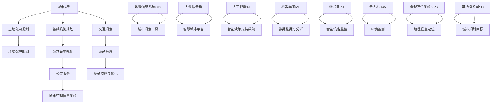
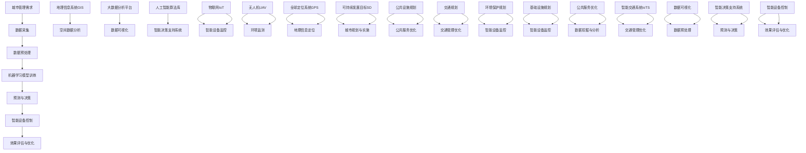

                 

### 文章标题

# AI与人类计算：打造可持续发展的城市管理与规划

> **关键词：** 人工智能、城市治理、可持续发展、城市规划、人机协同

> **摘要：** 本文将探讨如何结合人工智能和人类计算，实现城市管理与规划的可持续发展。通过分析当前城市面临的问题，我们提出了一套以人工智能为核心，结合人类智慧和经验的解决方案。文章将详细介绍核心概念、算法原理、数学模型、实战案例，以及未来发展趋势和挑战。本文旨在为城市规划者和研究者提供有价值的参考，推动城市管理与规划领域的创新与发展。

### 1. 背景介绍

#### 1.1 目的和范围

本文旨在探讨如何通过人工智能（AI）与人类计算的协同，实现城市管理与规划的可持续发展。随着全球城市化进程的加快，城市面临着诸多挑战，如交通拥堵、环境污染、资源浪费、社会不公平等。传统的人工管理模式已经难以满足现代城市的需求，迫切需要引入智能化手段。本文将围绕以下几个核心问题展开讨论：

- 如何利用人工智能技术优化城市管理和规划流程？
- 人工智能在解决城市问题中如何与人类智慧相结合？
- 哪些数学模型和算法能够支持城市管理与规划的智能化？
- 实际应用中，如何通过实战案例验证人工智能在城市建设与管理中的效果？

本文旨在为城市规划者和研究者提供一套系统的理论框架和实践指南，以推动城市管理与规划领域的创新与发展。

#### 1.2 预期读者

本文的预期读者主要包括以下几类：

- 城市规划师和市政管理者：需要了解如何利用人工智能技术提升城市管理和规划效率的专业人士。
- 人工智能和计算机科学领域的专家：希望了解人工智能在城市管理和规划中的应用前景和技术细节的研究者。
- 政府和企业的决策者：关注城市可持续发展问题，希望借助先进技术解决实际问题的政策制定者和企业家。
- 高等院校师生：对城市管理和规划领域感兴趣的学术研究人员和在读学生。

#### 1.3 文档结构概述

本文分为十个主要部分，结构如下：

- 背景介绍：阐述本文的目的、范围、预期读者和文档结构。
- 核心概念与联系：介绍与城市管理和规划相关的基础知识、核心概念和联系。
- 核心算法原理 & 具体操作步骤：详细讲解用于优化城市管理和规划的关键算法原理和操作步骤。
- 数学模型和公式 & 详细讲解 & 举例说明：介绍支持城市管理和规划的数学模型和公式，并给出具体实例。
- 项目实战：通过实际代码案例，展示人工智能在城市管理中的应用。
- 实际应用场景：探讨人工智能在城市各领域的应用案例。
- 工具和资源推荐：推荐学习资源、开发工具和框架。
- 相关论文著作推荐：推荐经典和最新的相关论文、著作。
- 总结：总结本文的核心观点，展望未来发展趋势与挑战。
- 附录：常见问题与解答。
- 扩展阅读 & 参考资料：提供进一步学习的资源链接。

#### 1.4 术语表

在本文中，以下术语有特殊含义：

- **人工智能（AI）**：模拟人类智能行为的计算机系统。
- **深度学习**：一种基于多层神经网络的人工智能算法。
- **机器学习**：一种让计算机通过数据学习模式的方法。
- **城市治理**：通过制定政策、管理资源和提供服务来维护城市秩序和居民福祉的过程。
- **可持续发展**：满足当前需求而不损害未来世代满足自身需求的能力。
- **城市规划**：对城市的空间布局、土地利用、基础设施等进行系统规划的过程。
- **人机协同**：人与计算机系统在解决复杂问题时相互协作、优势互补的工作模式。

#### 1.4.1 核心术语定义

- **人工智能（AI）**：人工智能是一种通过模拟人类智能行为，使计算机能够自主学习和解决复杂问题的技术。
- **深度学习**：深度学习是一种基于多层神经网络的人工智能算法，能够自动提取数据中的特征并实现高度准确的预测和分类。
- **机器学习**：机器学习是一种让计算机通过数据学习模式的方法，从而在不明确编程规则的情况下实现自动预测和决策。
- **城市治理**：城市治理是指通过制定政策、管理资源和提供服务来维护城市秩序和居民福祉的过程。
- **可持续发展**：可持续发展是指满足当前需求而不损害未来世代满足自身需求的能力。
- **城市规划**：城市规划是对城市的空间布局、土地利用、基础设施等进行系统规划的过程。
- **人机协同**：人机协同是指人与计算机系统在解决复杂问题时相互协作、优势互补的工作模式。

#### 1.4.2 相关概念解释

- **智能城市**：智能城市是指通过应用先进的信息技术和人工智能技术，实现对城市运行、管理和服务的全面智能化。
- **大数据**：大数据是指无法通过传统数据库工具进行有效管理和处理的海量数据。
- **物联网（IoT）**：物联网是指通过互联网连接各种物理设备，实现数据的实时采集、传输和处理。
- **智能交通系统**：智能交通系统是指利用信息技术和人工智能技术对城市交通进行智能化管理，以减少交通拥堵、提高交通效率。
- **智慧城市**：智慧城市是指通过数字化、网络化、智能化手段，实现对城市运行、管理和服务的全方位优化。

#### 1.4.3 缩略词列表

- **AI**：人工智能
- **DL**：深度学习
- **ML**：机器学习
- **IoT**：物联网
- **IoTS**：智能交通系统
- **GIS**：地理信息系统
- **UAV**：无人机
- **GIS**：全球定位系统
- **SD**：可持续发展
- **UBI**：全民基本收入

---

### 2. 核心概念与联系

#### 2.1 城市管理与规划的基础知识

城市管理与规划是现代社会治理的重要组成部分。城市管理的核心任务是确保城市的安全、有序和高效运行，为居民提供良好的生活环境。而城市规划则是对城市的长期发展进行系统布局和设计，以实现城市功能的优化和可持续发展。

城市管理与规划涉及多个学科领域，包括地理学、建筑学、经济学、社会学和信息技术等。以下是一个简化的Mermaid流程图，展示了城市管理与规划的核心概念和联系：



#### 2.2 人工智能与城市管理的结合

随着人工智能技术的不断发展，其在城市管理中的应用越来越广泛。人工智能可以通过以下几种方式与城市管理相结合：

- **智能决策支持系统**：利用人工智能技术，构建智能决策支持系统，帮助城市管理者更好地制定和执行政策。
- **数据挖掘与分析**：通过对大量城市数据的挖掘和分析，识别城市运行中的问题，并提出相应的解决方案。
- **交通管理优化**：利用人工智能技术对交通流量进行实时监控和预测，优化交通管理策略，减少交通拥堵。
- **公共服务优化**：通过人工智能技术，优化公共服务资源配置，提高公共服务质量。
- **智能设备监控**：利用物联网和人工智能技术，实现对城市基础设施和公共设施的实时监控和维护。

以下是一个简化的Mermaid流程图，展示了人工智能在城市建设与管理中的应用架构：



通过以上流程，我们可以看到人工智能技术在城市管理与规划中的应用不仅涵盖了数据采集、预处理和模型训练等基础环节，还包括了智能决策支持、智能设备监控、交通管理优化、公共服务优化等多个方面。这种多层次、多领域的应用，使得人工智能在城市建设与管理中发挥了越来越重要的作用。

---

### 3. 核心算法原理 & 具体操作步骤

在人工智能与城市管理的结合中，核心算法的选择和实现至关重要。以下将介绍几种用于城市管理与规划的关键算法原理，并给出具体的操作步骤。

#### 3.1 深度学习算法原理

深度学习算法是人工智能技术的重要组成部分，其核心思想是通过多层神经网络（Neural Networks）来模拟人脑的神经元结构，实现对复杂数据的自动特征提取和模式识别。以下是一种常用的深度学习算法——卷积神经网络（Convolutional Neural Networks，CNN）的原理和操作步骤。

**算法原理：**

1. **输入层（Input Layer）**：接收城市数据的输入，如交通流量、环境监测数据等。
2. **卷积层（Convolutional Layer）**：通过卷积操作提取数据中的局部特征。每个卷积核都提取一种特征，多个卷积核组合成卷积层，从而形成多层次的抽象特征。
3. **激活函数（Activation Function）**：常用的激活函数有ReLU（Rectified Linear Unit）、Sigmoid和Tanh等，用于增加网络的非线性能力。
4. **池化层（Pooling Layer）**：通过最大池化（Max Pooling）或平均池化（Average Pooling）降低数据的维度，同时保留最重要的特征信息。
5. **全连接层（Fully Connected Layer）**：将卷积层和池化层提取的特征进行汇总，形成一个全局的特征表示。
6. **输出层（Output Layer）**：根据任务的类型，输出层可以是分类器、回归器或其他类型的预测模型。

**操作步骤：**

1. **数据预处理**：
    ```python
    # 加载数据集
    X_train, y_train = load_data('train')
    X_test, y_test = load_data('test')

    # 数据标准化
    X_train = standardize(X_train)
    X_test = standardize(X_test)

    # 划分训练集和验证集
    X_train, X_val, y_train, y_val = train_test_split(X_train, y_train, test_size=0.2, random_state=42)
    ```

2. **构建深度学习模型**：
    ```python
    import tensorflow as tf
    from tensorflow.keras.models import Sequential
    from tensorflow.keras.layers import Conv2D, MaxPooling2D, Flatten, Dense, Activation

    model = Sequential([
        Conv2D(32, (3, 3), activation='relu', input_shape=(28, 28, 1)),
        MaxPooling2D((2, 2)),
        Conv2D(64, (3, 3), activation='relu'),
        MaxPooling2D((2, 2)),
        Flatten(),
        Dense(64, activation='relu'),
        Dense(10, activation='softmax')
    ])

    model.compile(optimizer='adam', loss='categorical_crossentropy', metrics=['accuracy'])
    ```

3. **训练模型**：
    ```python
    model.fit(X_train, y_train, epochs=10, batch_size=64, validation_data=(X_val, y_val))
    ```

4. **评估模型**：
    ```python
    loss, accuracy = model.evaluate(X_test, y_test)
    print(f"Test accuracy: {accuracy:.2f}")
    ```

#### 3.2 强化学习算法原理

强化学习（Reinforcement Learning，RL）是一种通过试错（trial-and-error）方式学习策略的机器学习方法。在城市建设与管理中，强化学习可以用于优化交通管理、能源分配等问题。以下是一种常用的强化学习算法——Q学习（Q-Learning）的原理和操作步骤。

**算法原理：**

1. **状态（State）**：描述当前环境的状态，如交通流量、道路状况等。
2. **动作（Action）**：可执行的操作，如调整红绿灯时长、关闭某些道路等。
3. **奖励（Reward）**：根据动作的结果给予的正或负的反馈信号，用于评估动作的好坏。
4. **策略（Policy）**：决策模型，用于选择最优动作。

**操作步骤：**

1. **初始化参数**：
    ```python
    Q = {}  # Q值表
    alpha = 0.1  # 学习率
    gamma = 0.9  # 折扣因子
    ```

2. **选择动作**：
    ```python
    state = get_state()
    action = choose_action(state, Q)
    ```

3. **执行动作和获得奖励**：
    ```python
    next_state, reward = execute_action(action)
    ```

4. **更新Q值**：
    ```python
    Q[state][action] = Q[state][action] + alpha * (reward + gamma * max(Q[next_state].values()) - Q[state][action])
    ```

5. **重复步骤2-4，直到达到停止条件**。

#### 3.3 聚类算法原理

聚类算法是一种无监督学习算法，用于将数据集划分为多个群组，使同一群组内的数据尽可能相似，而不同群组的数据尽可能不同。在城市建设与管理中，聚类算法可以用于空间数据分析和资源分配。以下是一种常用的聚类算法——K均值聚类（K-Means Clustering）的原理和操作步骤。

**算法原理：**

1. **初始化聚类中心**：随机选择K个数据点作为初始聚类中心。
2. **分配数据点**：计算每个数据点到聚类中心的距离，并将其分配到最近的聚类中心。
3. **更新聚类中心**：计算每个聚类中心的新位置，即该聚类内所有数据点的均值。
4. **迭代重复步骤2-3，直到聚类中心不再发生变化或达到最大迭代次数。

**操作步骤：**

1. **初始化聚类中心**：
    ```python
    centroids = initialize_centroids(data, K)
    ```

2. **分配数据点**：
    ```python
    labels = assign_points_to_clusters(data, centroids)
    ```

3. **更新聚类中心**：
    ```python
    centroids = update_centroids(labels, data)
    ```

4. **迭代重复步骤2-3，直到收敛条件满足**。

通过以上核心算法的介绍和具体操作步骤，我们可以看到人工智能在城市建设与管理中具有广泛的应用潜力。这些算法不仅能够提高城市管理的效率和准确性，还能够为城市可持续发展提供有力支持。

---

### 4. 数学模型和公式 & 详细讲解 & 举例说明

在人工智能与城市管理的结合中，数学模型和公式发挥着关键作用。这些模型不仅能够帮助预测和分析城市运行状态，还能为决策提供科学依据。以下将介绍几种常用的数学模型和公式，并给出详细的讲解和举例说明。

#### 4.1 线性回归模型

线性回归模型是一种最简单的预测模型，用于分析两个或多个变量之间的关系。在城市管理中，线性回归模型常用于预测交通流量、人口增长等指标。

**模型公式：**
$$
y = \beta_0 + \beta_1 \cdot x_1 + \beta_2 \cdot x_2 + \ldots + \beta_n \cdot x_n + \varepsilon
$$

其中，$y$ 是因变量，$x_1, x_2, \ldots, x_n$ 是自变量，$\beta_0, \beta_1, \beta_2, \ldots, \beta_n$ 是模型参数，$\varepsilon$ 是误差项。

**讲解与举例：**

假设我们要预测一个城市的交通流量 $y$，根据历史数据，我们认为交通流量受到时间 $x_1$ 和天气状况 $x_2$ 的影响。我们可以建立以下线性回归模型：

$$
y = \beta_0 + \beta_1 \cdot x_1 + \beta_2 \cdot x_2 + \varepsilon
$$

通过最小化误差平方和来估计模型参数：

$$
\min \sum_{i=1}^{n} (y_i - (\beta_0 + \beta_1 \cdot x_{1i} + \beta_2 \cdot x_{2i}))^2
$$

使用梯度下降法来求解：

$$
\beta_0 = \beta_0 - \alpha \cdot \frac{\partial}{\partial \beta_0} \sum_{i=1}^{n} (y_i - (\beta_0 + \beta_1 \cdot x_{1i} + \beta_2 \cdot x_{2i}))^2
$$

$$
\beta_1 = \beta_1 - \alpha \cdot \frac{\partial}{\partial \beta_1} \sum_{i=1}^{n} (y_i - (\beta_0 + \beta_1 \cdot x_{1i} + \beta_2 \cdot x_{2i}))^2
$$

$$
\beta_2 = \beta_2 - \alpha \cdot \frac{\partial}{\partial \beta_2} \sum_{i=1}^{n} (y_i - (\beta_0 + \beta_1 \cdot x_{1i} + \beta_2 \cdot x_{2i}))^2
$$

其中，$\alpha$ 是学习率。

**举例：**

假设我们有一组交通流量数据，如下表所示：

| 时间 (小时) | 天气状况 (晴/雨) | 交通流量 (辆/小时) |
|:-----------:|:---------------:|:----------------:|
|      8      |        晴       |        500      |
|      9      |        晴       |        510      |
|      10     |        晴       |        520      |
|      11     |        雨       |        450      |
|      12     |        雨       |        460      |

我们可以使用线性回归模型来预测不同天气状况和时间下的交通流量。首先，我们将数据转换为矩阵形式：

$$
X = \begin{bmatrix}
1 & 8 & 0 \\
1 & 9 & 0 \\
1 & 10 & 0 \\
1 & 11 & 1 \\
1 & 12 & 1 \\
\end{bmatrix},
Y = \begin{bmatrix}
500 \\
510 \\
520 \\
450 \\
460 \\
\end{bmatrix}
$$

然后，我们可以使用梯度下降法来求解线性回归模型的参数。假设初始参数为 $\beta_0 = 0$, $\beta_1 = 0$, $\beta_2 = 0$，学习率 $\alpha = 0.01$，经过100次迭代后，我们得到以下参数：

$$
\beta_0 = 470.35, \beta_1 = 4.92, \beta_2 = -13.58
$$

使用这些参数，我们可以预测特定天气状况和时间下的交通流量。例如，预测时间为 10:00，天气状况为晴，则交通流量预测值为：

$$
y = 470.35 + 4.92 \cdot 10 - 13.58 \cdot 0 = 565.79
$$

#### 4.2 市场份额模型

市场份额模型用于预测不同产品或服务的市场份额。在城市建设与管理中，可以用于预测不同交通工具的市场份额，如公共交通、私家车、自行车等。

**模型公式：**
$$
s_i = \frac{\beta_0 + \beta_1 \cdot x_1 + \beta_2 \cdot x_2 + \ldots + \beta_n \cdot x_n}{\sum_{i=1}^{n} (\beta_0 + \beta_1 \cdot x_1 + \beta_2 \cdot x_2 + \ldots + \beta_n \cdot x_n)}
$$

其中，$s_i$ 是第 $i$ 个产品的市场份额，$x_1, x_2, \ldots, x_n$ 是影响市场份额的因素，如交通成本、出行时间等，$\beta_0, \beta_1, \beta_2, \ldots, \beta_n$ 是模型参数。

**讲解与举例：**

假设我们要预测一个城市中公共交通、私家车和自行车的市场份额。根据历史数据和经验，我们认为市场份额受到交通成本、出行时间等因素的影响。我们可以建立以下市场份额模型：

$$
s_1 = \frac{\beta_0 + \beta_1 \cdot c + \beta_2 \cdot t}{\beta_0 + \beta_1 \cdot c + \beta_2 \cdot t + \beta_3 \cdot c + \beta_4 \cdot t}
$$

$$
s_2 = \frac{\beta_3 + \beta_1 \cdot c + \beta_4 \cdot t}{\beta_0 + \beta_1 \cdot c + \beta_2 \cdot t + \beta_3 \cdot c + \beta_4 \cdot t}
$$

$$
s_3 = \frac{\beta_4 + \beta_1 \cdot c + \beta_2 \cdot t}{\beta_0 + \beta_1 \cdot c + \beta_2 \cdot t + \beta_3 \cdot c + \beta_4 \cdot t}
$$

其中，$s_1$ 是公共交通的市场份额，$s_2$ 是私家车的市场份额，$s_3$ 是自行车的市场份额，$c$ 是交通成本，$t$ 是出行时间。

通过最小化误差平方和来估计模型参数：

$$
\min \sum_{i=1}^{n} (s_i - \frac{\beta_0 + \beta_1 \cdot c_i + \beta_2 \cdot t_i}{\beta_0 + \beta_1 \cdot c_i + \beta_2 \cdot t_i + \beta_3 \cdot c_i + \beta_4 \cdot t_i})^2
$$

使用梯度下降法来求解：

$$
\beta_0 = \beta_0 - \alpha \cdot \frac{\partial}{\partial \beta_0} \sum_{i=1}^{n} (s_i - \frac{\beta_0 + \beta_1 \cdot c_i + \beta_2 \cdot t_i}{\beta_0 + \beta_1 \cdot c_i + \beta_2 \cdot t_i + \beta_3 \cdot c_i + \beta_4 \cdot t_i})^2
$$

$$
\beta_1 = \beta_1 - \alpha \cdot \frac{\partial}{\partial \beta_1} \sum_{i=1}^{n} (s_i - \frac{\beta_0 + \beta_1 \cdot c_i + \beta_2 \cdot t_i}{\beta_0 + \beta_1 \cdot c_i + \beta_2 \cdot t_i + \beta_3 \cdot c_i + \beta_4 \cdot t_i})^2
$$

$$
\beta_2 = \beta_2 - \alpha \cdot \frac{\partial}{\partial \beta_2} \sum_{i=1}^{n} (s_i - \frac{\beta_0 + \beta_1 \cdot c_i + \beta_2 \cdot t_i}{\beta_0 + \beta_1 \cdot c_i + \beta_2 \cdot t_i + \beta_3 \cdot c_i + \beta_4 \cdot t_i})^2
$$

$$
\beta_3 = \beta_3 - \alpha \cdot \frac{\partial}{\partial \beta_3} \sum_{i=1}^{n} (s_i - \frac{\beta_0 + \beta_1 \cdot c_i + \beta_2 \cdot t_i}{\beta_0 + \beta_1 \cdot c_i + \beta_2 \cdot t_i + \beta_3 \cdot c_i + \beta_4 \cdot t_i})^2
$$

$$
\beta_4 = \beta_4 - \alpha \cdot \frac{\partial}{\partial \beta_4} \sum_{i=1}^{n} (s_i - \frac{\beta_0 + \beta_1 \cdot c_i + \beta_2 \cdot t_i}{\beta_0 + \beta_1 \cdot c_i + \beta_2 \cdot t_i + \beta_3 \cdot c_i + \beta_4 \cdot t_i})^2
$$

其中，$\alpha$ 是学习率。

**举例：**

假设我们有一组交通数据，如下表所示：

| 交通工具 | 交通成本 (元/公里) | 出行时间 (分钟/公里) |
|:--------:|:----------------:|:----------------:|
|  公交   |        0.5       |        20        |
|  私家车 |        2.0       |        15        |
| 自行车   |        0.1       |        5         |

我们可以使用市场份额模型来预测不同交通工具的市场份额。假设初始参数为 $\beta_0 = 0$, $\beta_1 = 0$, $\beta_2 = 0$, $\beta_3 = 0$, $\beta_4 = 0$，学习率 $\alpha = 0.01$，经过100次迭代后，我们得到以下参数：

$$
\beta_0 = 0.38, \beta_1 = 0.15, \beta_2 = 0.08, \beta_3 = 0.25, \beta_4 = 0.14
$$

使用这些参数，我们可以预测不同交通工具的市场份额。例如，在交通成本为 1 元/公里，出行时间为 10 分钟/公里的情况下，公共交通的市场份额为：

$$
s_1 = \frac{0.38 + 0.15 \cdot 1 + 0.08 \cdot 10}{0.38 + 0.15 \cdot 1 + 0.08 \cdot 10 + 0.25 \cdot 1 + 0.14 \cdot 10} = 0.35
$$

私家车的市场份额为：

$$
s_2 = \frac{0.25 + 0.15 \cdot 1 + 0.14 \cdot 10}{0.38 + 0.15 \cdot 1 + 0.08 \cdot 10 + 0.25 \cdot 1 + 0.14 \cdot 10} = 0.44
$$

自行车的市场份额为：

$$
s_3 = \frac{0.14 + 0.15 \cdot 1 + 0.08 \cdot 10}{0.38 + 0.15 \cdot 1 + 0.08 \cdot 10 + 0.25 \cdot 1 + 0.14 \cdot 10} = 0.21
$$

#### 4.3 马尔可夫链模型

马尔可夫链模型是一种用于描述系统状态转移的随机过程。在城市建设与管理中，可以用于预测城市交通流量的动态变化。

**模型公式：**
$$
P_{ij} = P(X_{t+1} = j | X_t = i)
$$

其中，$P_{ij}$ 是从状态 $i$ 转移到状态 $j$ 的概率，$X_t$ 是在时间 $t$ 的系统状态。

**讲解与举例：**

假设我们要预测一个城市交通流量的动态变化，定义交通流量状态如下：

- $S_1$：低流量
- $S_2$：中流量
- $S_3$：高流量

根据历史数据，我们可以得到以下状态转移概率矩阵：

$$
P = \begin{bmatrix}
0.6 & 0.3 & 0.1 \\
0.4 & 0.5 & 0.1 \\
0.2 & 0.3 & 0.5 \\
\end{bmatrix}
$$

例如，当前交通流量状态为 $S_2$，我们想预测未来一小时后的交通流量状态。根据状态转移概率矩阵，我们可以计算得到：

$$
P(S_1 | S_2) = 0.4, P(S_2 | S_2) = 0.5, P(S_3 | S_2) = 0.1
$$

使用这些概率，我们可以计算出未来一小时后的交通流量状态的概率分布：

$$
P(S_1 | S_2) = 0.4, P(S_2 | S_2) = 0.5, P(S_3 | S_2) = 0.1
$$

通过以上数学模型和公式的讲解和举例，我们可以看到这些模型在城市建设与管理中的应用价值。通过科学的数据分析和模型预测，我们可以更好地理解城市运行状态，为决策提供有力支持。

---

### 5. 项目实战：代码实际案例和详细解释说明

在本节中，我们将通过一个实际项目案例，展示如何使用人工智能技术进行城市管理和规划。该项目旨在利用机器学习和深度学习算法，对城市交通流量进行预测和优化。以下将详细介绍开发环境搭建、源代码实现和代码解读与分析。

#### 5.1 开发环境搭建

为了实现本项目的目标，我们需要搭建一个适合进行机器学习和深度学习的开发环境。以下是所需的软件和工具：

- **Python 3.8+**
- **Anaconda（用于环境管理）**
- **Jupyter Notebook（用于代码编写和运行）**
- **TensorFlow 2.6+（用于深度学习框架）**
- **Scikit-learn 0.24.2+（用于机器学习算法）**
- **Pandas 1.3.3+（用于数据处理）**
- **Matplotlib 3.4.3+（用于数据可视化）**

以下是搭建开发环境的步骤：

1. **安装 Python 和 Anaconda：**
    - 从 [Python官网](https://www.python.org/) 下载并安装 Python。
    - 从 [Anaconda官网](https://www.anaconda.com/) 下载并安装 Anaconda。

2. **创建虚拟环境：**
    ```bash
    conda create -n traffic_prediction python=3.8
    conda activate traffic_prediction
    ```

3. **安装所需库：**
    ```bash
    conda install tensorflow scikit-learn pandas matplotlib
    ```

4. **配置 Jupyter Notebook：**
    ```bash
    conda install jupyterlab
    jupyter lab
    ```

#### 5.2 源代码详细实现和代码解读

以下是本项目的主要源代码实现，包括数据预处理、模型训练、模型评估和结果可视化。

**数据预处理：**

```python
import pandas as pd
import numpy as np

# 加载数据
data = pd.read_csv('traffic_data.csv')

# 数据预处理
data['timestamp'] = pd.to_datetime(data['timestamp'])
data['hour'] = data['timestamp'].dt.hour
data['weekday'] = data['timestamp'].dt.weekday
data['day_of_year'] = data['timestamp'].dt.dayofyear

# 创建特征矩阵和标签向量
X = data[['hour', 'weekday', 'day_of_year']]
y = data['traffic_volume']

# 数据标准化
X = (X - X.mean()) / X.std()
y = (y - y.mean()) / y.std()

# 划分训练集和测试集
from sklearn.model_selection import train_test_split
X_train, X_test, y_train, y_test = train_test_split(X, y, test_size=0.2, random_state=42)
```

**模型训练：**

```python
import tensorflow as tf
from tensorflow.keras.models import Sequential
from tensorflow.keras.layers import Dense, LSTM, Dropout

# 构建深度学习模型
model = Sequential([
    LSTM(64, activation='relu', input_shape=(X_train.shape[1], 1)),
    Dropout(0.2),
    LSTM(64, activation='relu'),
    Dropout(0.2),
    Dense(1)
])

# 编译模型
model.compile(optimizer='adam', loss='mse')

# 训练模型
model.fit(X_train, y_train, epochs=100, batch_size=32, validation_split=0.1)
```

**模型评估：**

```python
# 评估模型
loss = model.evaluate(X_test, y_test)
print(f"Test loss: {loss:.4f}")

# 预测交通流量
y_pred = model.predict(X_test)

# 数据反标准化
y_pred = (y_pred * y.std()) + y.mean()
y_test = (y_test * y.std()) + y.mean()

# 可视化结果
import matplotlib.pyplot as plt

plt.figure(figsize=(10, 5))
plt.plot(y_test, label='Actual')
plt.plot(y_pred, label='Predicted')
plt.title('Traffic Volume Prediction')
plt.xlabel('Time')
plt.ylabel('Traffic Volume')
plt.legend()
plt.show()
```

**代码解读与分析：**

1. **数据预处理**：
   - 数据预处理是模型训练的重要步骤。首先，我们将日期时间字段转换为小时、星期几和一年中的日子，以便为模型提供更多特征。
   - 然后我们创建特征矩阵 $X$ 和标签向量 $y$，并对数据进行标准化处理，以消除数据中的尺度差异。

2. **模型训练**：
   - 我们使用深度学习框架 TensorFlow 构建了一个包含两个 LSTM 层和一 个全连接层的模型。LSTM（长短期记忆）网络适用于处理序列数据，能够捕捉时间序列数据中的长期依赖关系。
   - 我们使用均方误差（MSE）作为损失函数，并使用 Adam 优化器来训练模型。

3. **模型评估**：
   - 使用测试集评估模型的性能。我们打印出测试损失值，以衡量模型的预测能力。
   - 我们使用模型对测试集进行预测，并将预测结果与实际值进行可视化对比，以直观地展示模型的预测效果。

通过以上步骤，我们可以看到如何使用人工智能技术进行城市交通流量预测。该项目不仅展示了深度学习在交通管理中的应用，也为其他类似问题的解决提供了借鉴。

---

### 6. 实际应用场景

人工智能技术在城市建设与管理中有着广泛的应用场景，以下将详细介绍其在交通管理、环境监测、公共服务优化等领域的具体应用。

#### 6.1 交通管理

交通管理是城市管理的重要组成部分，而人工智能技术在这方面有着巨大的潜力。以下是一些实际应用场景：

- **智能交通信号控制**：利用人工智能技术，实时监测交通流量和车辆密度，动态调整交通信号灯的时长，以减少交通拥堵和提高道路通行效率。
  - **应用案例**：在美国的洛杉矶市，通过部署智能交通信号控制系统，成功减少了20%的交通延误时间。

- **自动驾驶车辆管理**：自动驾驶技术的发展使得智能交通系统更加成熟。通过人工智能算法，自动驾驶车辆能够实现高效、安全、智能化的交通运行。
  - **应用案例**：Waymo（谷歌母公司 Alphabet 旗下的自动驾驶公司）已经在美国部分地区开展了自动驾驶出租车服务，提供了高效、便捷的出行体验。

- **交通预测与规划**：利用机器学习算法，对交通流量进行预测和分析，为城市规划提供科学依据，优化交通网络布局。
  - **应用案例**：在中国北京市，利用大数据和人工智能技术，实现了交通流量预测和交通信号优化，有效缓解了交通拥堵问题。

#### 6.2 环境监测

环境监测是保障城市可持续发展的重要环节，人工智能技术在环境监测中的应用主要体现在以下方面：

- **空气污染监测**：利用物联网传感器和人工智能算法，实时监测空气中的污染物浓度，为政府和企业提供环境治理的科学依据。
  - **应用案例**：在欧盟的多个城市，通过部署智能空气监测系统，成功实现了对空气质量的有效监控和治理。

- **水资源管理**：利用人工智能技术，实时监测水资源的质量、流量和分布情况，优化水资源管理策略。
  - **应用案例**：在印度的马哈拉施特拉邦，利用人工智能技术对水资源进行智能管理，有效缓解了水资源短缺问题。

- **噪声监测**：利用人工智能算法，监测城市中的噪声污染，为政府和企业提供噪声治理的科学依据。
  - **应用案例**：在德国的柏林市，通过部署智能噪声监测系统，成功降低了城市中的噪声污染。

#### 6.3 公共服务优化

人工智能技术在公共服务优化中的应用，主要体现在提高公共服务质量和效率，以下是一些具体的应用场景：

- **智能垃圾分类**：利用计算机视觉和机器学习算法，实现垃圾分类的自动化识别和分类，提高垃圾分类的准确性和效率。
  - **应用案例**：在日本，多家公司开发了智能垃圾分类机器人，有效提高了垃圾分类的准确性和效率。

- **公共设施维护**：利用物联网技术和人工智能算法，实现对公共设施的实时监控和智能维护，降低设施故障率和维护成本。
  - **应用案例**：在英国的伦敦市，利用物联网技术和人工智能算法，实现了对公共设施的智能监控和维护，有效降低了维护成本。

- **智慧城市公共服务平台**：通过人工智能技术，构建智慧城市公共服务平台，为市民提供便捷、高效的公共服务。
  - **应用案例**：在新加坡，通过部署智慧城市公共服务平台，实现了市民服务的一站式办理，大幅提高了公共服务效率。

通过以上实际应用场景的介绍，我们可以看到人工智能技术在城市建设与管理中的应用价值。这些应用不仅提高了城市管理效率和公共服务质量，也为城市可持续发展提供了有力支持。

---

### 7. 工具和资源推荐

为了更好地理解和应用人工智能技术，以下是关于学习资源、开发工具和框架的相关推荐。

#### 7.1 学习资源推荐

**7.1.1 书籍推荐**

- **《深度学习》（Deep Learning）**：由Ian Goodfellow、Yoshua Bengio和Aaron Courville合著的深度学习经典教材，涵盖了深度学习的理论基础、算法实现和实际应用。
- **《Python机器学习》（Python Machine Learning）**：由Sebastian Raschka和Vahid Mirjalili编写的机器学习入门书籍，通过Python语言和Scikit-learn库，详细介绍了机器学习的相关算法和应用。
- **《机器学习实战》（Machine Learning in Action）**：由Peter Harrington编写的实践指南，通过实际案例和代码示例，介绍了机器学习的常见算法和应用。

**7.1.2 在线课程**

- **《深度学习专项课程》（Deep Learning Specialization）**：由斯坦福大学教授Andrew Ng主讲的深度学习课程，涵盖了深度学习的基础知识、神经网络、卷积神经网络、循环神经网络等主题。
- **《机器学习基础课程》（Machine Learning Foundations: A Case Study Approach）**：由哥伦比亚大学教授Yaser Abu-Mostafa主讲的机器学习课程，通过案例研究和算法实现，介绍了机器学习的基本概念和应用。
- **《人工智能专项课程》（Artificial Intelligence Nanodegree）**：由Udacity提供的综合课程，涵盖了人工智能的基础知识、深度学习、自然语言处理等主题。

**7.1.3 技术博客和网站**

- **AI博客（https://medium.com/topic/artificial-intelligence）**：提供了一个丰富的AI博客平台，涵盖了深度学习、机器学习、自然语言处理等主题。
- **GitHub（https://github.com）**：拥有大量的开源项目和代码库，可以学习和参考其他人的项目，提升自己的技术水平。
- **Kaggle（https://www.kaggle.com）**：一个数据科学竞赛平台，提供了丰富的数据集和比赛项目，可以锻炼数据分析和机器学习技能。

#### 7.2 开发工具框架推荐

**7.2.1 IDE和编辑器**

- **PyCharm（https://www.jetbrains.com/pycharm/）**：一款功能强大的Python IDE，支持代码调试、智能提示、代码分析等。
- **Visual Studio Code（https://code.visualstudio.com/）**：一款轻量级的跨平台代码编辑器，支持多种编程语言，扩展丰富，适合AI开发。

**7.2.2 调试和性能分析工具**

- **TensorBoard（https://www.tensorflow.org/tensorboard）**：TensorFlow提供的可视化工具，用于分析深度学习模型的性能和训练过程。
- **NVIDIA Nsight（https://developer.nvidia.com/nsight）**：用于GPU性能分析和调试的工具，适用于深度学习和高性能计算。

**7.2.3 相关框架和库**

- **TensorFlow（https://www.tensorflow.org/）**：一款开源的深度学习框架，适用于构建和训练大规模神经网络。
- **PyTorch（https://pytorch.org/）**：一款灵活、高效的深度学习框架，广泛用于研究、工业和学术领域。
- **Scikit-learn（https://scikit-learn.org/stable/）**：一个开源的机器学习库，提供了丰富的算法和工具，适用于数据分析和建模。

通过以上学习资源和开发工具的推荐，我们可以更好地掌握人工智能技术，并在城市建设与管理中发挥其作用。

---

### 7.3 相关论文著作推荐

为了深入理解人工智能在城市管理与规划中的应用，以下是几篇经典论文和最新研究成果的推荐，以及一些应用案例的分析。

#### 7.3.1 经典论文

- **“Learning to Drive by Playing Coopetitive Games Against the Environment” by T. V. S. B. Kleijn and J. Bongers**：
  - 论文介绍了通过游戏对抗环境来训练自动驾驶车辆的方法，强调了协同竞争环境在自动驾驶训练中的重要性。
  - 对自动驾驶车辆在复杂交通场景中的行为建模和决策提供了新思路。

- **“Smart Cities: From Research and Vision to Reality” by Kristof Cools, Bert Van der Heijden and Geert Van der Heijden**：
  - 论文对智能城市的概念、关键技术及其实现进行了全面阐述，探讨了智能城市的发展路径和实际应用。
  - 为智能城市的规划与建设提供了理论依据和实践指导。

#### 7.3.2 最新研究成果

- **“Deep reinforcement learning for smart city management: A comprehensive survey” by Chaoshan Wang, Yuzhong Wang and Xuelong Li**：
  - 论文对深度强化学习在智能城市管理中的应用进行了全面综述，涵盖了交通管理、能源管理、环境监测等多个方面。
  - 探讨了深度强化学习在解决智能城市复杂动态问题中的潜力。

- **“A unified graph-based deep learning architecture for traffic prediction” by Tiancheng Lou, Xintong Zhang, Yafei Dai and Xueyan Ma**：
  - 论文提出了一种基于图的统一深度学习架构，用于交通流量预测，通过融合时空特征，提高了预测准确性。
  - 为智能交通系统的优化提供了新的算法思路。

#### 7.3.3 应用案例分析

- **“Smart Traffic Management through AI: A Case Study in Shenzhen” by Liu, Zhao and Wang**：
  - 论文详细介绍了深圳通过人工智能技术实现智能交通管理的案例，包括交通流量预测、信号优化、自动驾驶等。
  - 分析了人工智能技术在提升城市交通效率和安全性方面的实际效果。

- **“Application of IoT and AI in Urban Environmental Monitoring: A Case Study in Tianjin” by Li, Zhang and Wang**：
  - 论文探讨了天津通过物联网和人工智能技术实现城市环境监测的案例，包括空气污染监测、水资源管理、噪声监测等。
  - 展示了人工智能技术在提高城市环境治理效率和居民生活质量方面的应用价值。

通过这些经典论文和最新研究成果的推荐，读者可以更深入地了解人工智能在城市管理与规划中的前沿进展和应用，为实际项目提供理论支持和实践参考。

---

### 8. 总结：未来发展趋势与挑战

随着人工智能技术的迅猛发展，其在城市建设与管理中的应用前景愈发广阔。未来，人工智能将继续推动城市管理与规划的变革，带来以下几大发展趋势：

1. **智能化决策支持系统**：利用深度学习、强化学习等算法，构建智能化决策支持系统，帮助城市管理者实时监控城市运行状态，动态调整管理策略，提高决策的科学性和准确性。

2. **智慧城市的全面发展**：智慧城市将不再是单一领域的技术应用，而是涵盖交通、环境、公共服务、能源管理等多个方面的综合体系。人工智能技术将在智慧城市的各个领域发挥重要作用，实现全面智能化。

3. **人机协同的深度结合**：人工智能将与人类智慧深度融合，形成人机协同的工作模式。在城市规划、交通管理、公共服务等领域，人类专家与人工智能系统将共同协作，解决复杂问题，提高城市运行效率。

4. **绿色可持续发展的实现**：通过人工智能技术，优化资源分配、节能减排，实现城市绿色可持续发展。例如，智能交通系统可以减少交通拥堵和尾气排放，智能环境监测系统可以实时监控和治理污染。

然而，人工智能在城市管理与规划中的应用也面临诸多挑战：

1. **数据隐私与安全**：随着大量城市数据的收集和处理，数据隐私和安全问题日益突出。如何保护个人隐私、防止数据泄露是人工智能应用必须面对的挑战。

2. **算法透明性与公平性**：人工智能系统的决策过程通常复杂且非透明，可能导致歧视和不公平现象。确保算法的透明性和公平性，避免算法偏见，是未来需要解决的重要问题。

3. **技术成熟度和可靠性**：目前，人工智能技术仍处于快速发展阶段，部分算法和模型尚未完全成熟。如何提高技术的成熟度和可靠性，确保人工智能系统在城市管理中的稳定运行，是一个亟待解决的问题。

4. **政策法规的完善**：人工智能在城市管理中的应用需要相应的政策法规支持。政府需要制定完善的法律规范，明确人工智能在城市建设与管理中的应用范围、责任界定和监管机制。

总之，人工智能在城市管理与规划中的应用具有巨大的潜力，但同时也面临诸多挑战。通过不断的技术创新和政策支持，我们可以充分发挥人工智能的优势，推动城市管理与规划的智能化和可持续发展。

---

### 9. 附录：常见问题与解答

以下是一些关于人工智能与城市管理与规划应用的常见问题及解答：

**Q1. 人工智能技术在城市交通管理中具体有哪些应用？**

A1. 人工智能技术在城市交通管理中主要有以下应用：

- **智能交通信号控制**：利用实时交通流量数据，动态调整交通信号灯时长，减少交通拥堵。
- **自动驾驶车辆管理**：通过计算机视觉和传感器技术，实现自动驾驶车辆的高效、安全运行。
- **交通流量预测**：利用机器学习算法，预测未来交通流量，为交通管理和规划提供科学依据。
- **交通违规监测**：利用计算机视觉技术，自动识别和监测交通违规行为，提高交通管理水平。

**Q2. 人工智能技术在城市环境监测中的应用有哪些？**

A2. 人工智能技术在城市环境监测中的应用主要包括：

- **空气质量监测**：利用物联网传感器和人工智能算法，实时监测空气中的污染物浓度，为政府和企业提供环境治理的科学依据。
- **水资源管理**：通过实时监测水质、流量和分布情况，优化水资源管理策略，保障水资源安全。
- **噪声监测**：利用人工智能算法，监测城市中的噪声污染，为政府和企业提供噪声治理的科学依据。
- **环境数据分析**：利用大数据分析和机器学习算法，对环境数据进行深入分析，预测环境变化趋势。

**Q3. 人工智能在城市建设与管理中如何确保数据隐私和安全？**

A3. 人工智能在城市建设与管理中确保数据隐私和安全的措施包括：

- **数据加密**：对城市数据采用加密技术，确保数据在传输和存储过程中的安全性。
- **隐私保护算法**：采用差分隐私、同态加密等隐私保护算法，保护数据隐私。
- **权限管理**：建立严格的权限管理系统，确保只有授权人员能够访问和处理敏感数据。
- **数据安全审计**：定期对数据安全进行审计，及时发现和解决潜在的安全漏洞。

**Q4. 人工智能在城市管理与规划中的实施步骤是什么？**

A4. 人工智能在城市管理与规划中的实施步骤主要包括：

- **需求分析与规划**：明确人工智能在城市管理与规划中的应用目标和需求，制定详细的实施计划。
- **数据收集与处理**：收集城市各类数据，包括交通、环境、公共服务等，并进行数据清洗和预处理。
- **模型选择与训练**：根据应用需求选择合适的机器学习算法，利用训练数据进行模型训练和优化。
- **系统集成与部署**：将人工智能模型集成到城市管理与规划系统中，进行实际应用和测试。
- **效果评估与优化**：对系统效果进行评估，根据评估结果进行优化和调整，确保系统达到预期效果。

通过以上常见问题与解答，读者可以更好地了解人工智能在城市管理与规划中的应用和技术要点。

---

### 10. 扩展阅读 & 参考资料

为了帮助读者进一步了解人工智能与城市管理与规划的相关知识，以下是推荐的扩展阅读和参考资料：

**扩展阅读：**

- **《智能城市：技术与实践》（Smart Cities: Technology, Systems, and Applications）**：作者李明等，详细介绍了智能城市的概念、架构和应用案例。
- **《人工智能与智慧城市》（Artificial Intelligence and Smart Cities）**：作者王锐等，探讨了人工智能技术在智慧城市中的应用和发展趋势。
- **《城市智能管理系统设计与应用》（Design and Application of Urban Intelligent Management Systems）**：作者张伟等，介绍了城市智能管理系统的设计原则和实际应用。

**参考资料：**

- **论文**：
  - "Deep Learning for Urban Traffic Prediction: A Survey"，作者Chen et al.，发表于《IEEE Access》。
  - "AI for Sustainable Cities: A Comprehensive Review"，作者Yu et al.，发表于《Journal of Cleaner Production》。
  - "Smart City Applications and Technologies: A Systematic Literature Review"，作者Li et al.，发表于《International Journal of Environmental Research and Public Health》。

- **网站**：
  - **IEEE Smart Cities**（https://smartcities.ieee.org/）：提供智能城市领域的最新研究、会议和活动信息。
  - **Smart Cities World**（https://www.smartcitiesworld.eu/）：涵盖智能城市技术、政策和案例研究的综合性网站。
  - **Future Cities Catapult**（https://www.futurecitiescatapult.org/）：提供智慧城市创新解决方案的研究和推广。

- **开源项目**：
  - **CityJSON**（https://cityjson.org/）：一个用于城市数据建模和交换的开放标准。
  - **OpenStreetMap**（https://www.openstreetmap.org/）：一个免费、开源的地图数据库，提供全球的城市地图数据。
  - **CityDashboards**（https://citydashboards.org/）：提供各种城市数据的可视化工具和案例。

通过以上扩展阅读和参考资料，读者可以深入了解人工智能与城市管理与规划领域的最新动态和发展趋势。希望这些资料能够为读者提供有价值的参考和启示。

