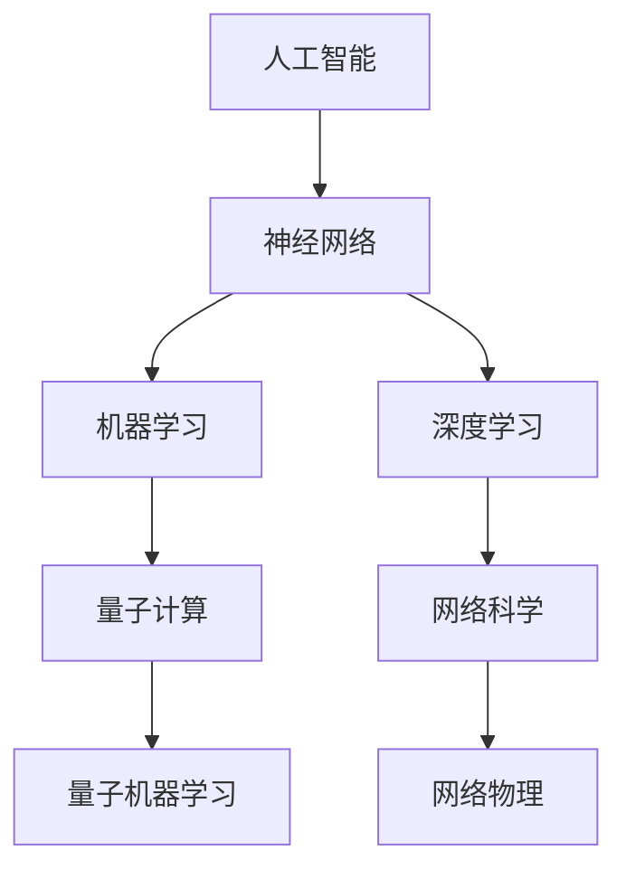

                 


# AI与物理学交叉原理与代码实战案例讲解

> 关键词：AI, 物理学，交叉应用，代码实战，神经网络，量子计算，机器学习，深度学习

> 摘要：本文将探讨人工智能与物理学之间的交叉应用，解析两者结合的核心原理，并通过代码实战案例，深入讲解神经网络、量子计算在机器学习和深度学习中的应用，为读者展示AI与物理学融合的未来潜力。

## 1. 背景介绍

### 1.1 目的和范围

本文旨在介绍人工智能与物理学之间的交叉应用，分析两者结合的理论基础和实践意义。通过具体案例，展示如何将物理学的原理和算法应用于人工智能领域，从而推动人工智能技术的发展。

### 1.2 预期读者

本文适合对人工智能、物理学及交叉应用有一定基础的读者，包括研究人员、工程师、以及对此领域感兴趣的学生。

### 1.3 文档结构概述

本文分为十个部分，包括背景介绍、核心概念与联系、核心算法原理与操作步骤、数学模型与公式讲解、项目实战、实际应用场景、工具和资源推荐、总结以及常见问题与解答等。

### 1.4 术语表

#### 1.4.1 核心术语定义

- 人工智能（AI）：一种模拟人类智能的技术，能够通过学习和推理解决复杂问题。
- 物理学：研究自然界的基本规律和物质运动的科学。
- 交叉应用：将两个或多个领域的知识和技术结合，应用于解决特定问题。

#### 1.4.2 相关概念解释

- 神经网络：一种模仿生物神经系统的计算模型，广泛应用于机器学习和深度学习。
- 量子计算：基于量子力学原理的计算机技术，具有极高的并行计算能力。
- 机器学习：一种通过数据训练模型，使其具备自主学习和改进能力的人工智能技术。
- 深度学习：一种基于多层神经网络的学习方法，能够在复杂数据中提取特征。

#### 1.4.3 缩略词列表

- AI：人工智能
- ML：机器学习
- DL：深度学习
- QM：量子力学
- QC：量子计算

## 2. 核心概念与联系

### 2.1 核心概念

人工智能与物理学交叉应用的核心概念包括：

1. 神经网络：模仿生物神经系统的计算模型，广泛应用于机器学习和深度学习。
2. 量子计算：基于量子力学原理的计算机技术，具有极高的并行计算能力。
3. 机器学习：一种通过数据训练模型，使其具备自主学习和改进能力的人工智能技术。
4. 深度学习：一种基于多层神经网络的学习方法，能够在复杂数据中提取特征。

### 2.2 关联性

1. 神经网络与物理学：神经网络中的神经元模型受到生物神经系统的启发，而物理学中的量子力学原理为神经网络中的信息传递和计算提供了理论基础。
2. 量子计算与机器学习：量子计算的高并行计算能力为机器学习中的大规模数据处理提供了可能，而机器学习算法则为量子计算提供了优化和改进的方法。
3. 物理学与深度学习：深度学习中的神经网络结构受到物理学中的网络科学启发，而深度学习算法在解决复杂问题时，往往需要借助物理学中的数学模型和公式。

### 2.3 Mermaid 流程图



## 3. 核心算法原理 & 具体操作步骤

### 3.1 神经网络原理

神经网络是一种通过模拟生物神经系统的计算模型，由大量神经元组成，用于处理和分析数据。神经网络的基本原理包括：

1. 输入层：接收外部输入数据。
2. 隐藏层：对输入数据进行处理，提取特征。
3. 输出层：输出处理结果。

### 3.2 伪代码实现

```python
# 初始化神经网络
initialize_network()

# 前向传播
forward_pass(input_data)

# 计算损失
calculate_loss(output)

# 反向传播
backward_pass(loss)

# 更新权重
update_weights()
```

### 3.3 神经网络与物理学的关系

1. 神经网络中的神经元模型受到生物神经系统的启发，而生物神经系统中的信息传递和计算原理受到物理学中的量子力学、网络科学等理论的指导。
2. 物理学中的网络科学为神经网络提供了理论支持，如小世界网络、无标度网络等，有助于优化神经网络的结构和性能。

### 3.4 量子计算原理

量子计算是一种基于量子力学原理的计算机技术，具有极高的并行计算能力。量子计算的基本原理包括：

1. 量子比特（qubit）：量子计算的基本单元，具有叠加态和纠缠态。
2. 量子门：用于操作量子比特的算子。
3. 量子算法：基于量子力学原理，解决特定问题的算法。

### 3.5 伪代码实现

```python
# 初始化量子计算环境
initialize_quantum_environment()

# 编写量子算法
write_quantum_algorithm()

# 运行量子算法
run_quantum_algorithm()

# 解码量子结果
decode_quantum_result()
```

### 3.6 量子计算与机器学习的关系

1. 量子计算的高并行计算能力为机器学习中的大规模数据处理提供了可能，有助于提高训练速度和精度。
2. 量子算法在优化、模拟等方面具有优势，可应用于机器学习中的优化问题和模拟问题。

## 4. 数学模型和公式 & 详细讲解 & 举例说明

### 4.1 神经网络中的数学模型

1. 激活函数：用于确定神经元是否激活，常用的激活函数有Sigmoid、ReLU等。

$$
f(x) = \frac{1}{1 + e^{-x}}
$$

$$
f(x) = max(0, x)
$$

2. 反向传播算法：用于计算网络中的权重更新，基于梯度下降法。

$$
\Delta w = -\alpha \cdot \frac{\partial L}{\partial w}
$$

### 4.2 量子计算中的数学模型

1. 量子比特的叠加态：

$$
|\psi\rangle = \sum_{i} c_i |i\rangle
$$

2. 量子比特的纠缠态：

$$
|\psi\rangle = \frac{1}{\sqrt{2}} (|0\rangle + |1\rangle)
$$

### 4.3 量子机器学习中的数学模型

1. 量子支持向量机（QSVM）：

$$
\hat{w} = \arg\min_{w} \frac{1}{2} \| w \|_2^2 + C \sum_{i=1}^n \delta(y_i (w \cdot x_i) - 1)
$$

2. 量子玻尔兹曼机（QBM）：

$$
E[\rho] = \sum_{i=1}^n - \beta E_p[\ln \rho_p]
$$

### 4.4 举例说明

#### 4.4.1 神经网络分类问题

假设我们要对图像进行分类，输入数据为1000张图片，每张图片包含784个像素值。我们需要设计一个神经网络模型，使其能够准确分类。

- 输入层：784个神经元，对应图片的每个像素值。
- 隐藏层：10个神经元，用于提取特征。
- 输出层：10个神经元，对应10个类别。

通过训练和优化，我们可以得到一个具有较高准确率的神经网络模型。

#### 4.4.2 量子计算优化问题

假设我们要解决一个优化问题，目标函数为：

$$
f(x) = x^2 + 2x + 1
$$

我们可以使用量子计算中的量子玻尔兹曼机（QBM）来求解该问题。

- 初始化量子态：$|\psi\rangle = \frac{1}{\sqrt{2}} (|0\rangle + |1\rangle)$
- 编写量子算法：QBM算法
- 运行量子算法：获取量子态的概率分布
- 解码量子结果：得到最优解

通过以上步骤，我们可以得到最优解 $x = -1$。

## 5. 项目实战：代码实际案例和详细解释说明

### 5.1 开发环境搭建

为了实现本文中的案例，我们需要搭建一个包含Python、TensorFlow、Qiskit等工具的开发环境。以下是搭建过程：

1. 安装Python（推荐版本为3.8以上）。
2. 安装TensorFlow：`pip install tensorflow`。
3. 安装Qiskit：`pip install qiskit`。

### 5.2 源代码详细实现和代码解读

#### 5.2.1 神经网络分类案例

```python
import tensorflow as tf
from tensorflow.keras import layers

# 定义神经网络模型
model = tf.keras.Sequential([
    layers.Dense(128, activation='relu', input_shape=(784,)),
    layers.Dense(10, activation='softmax')
])

# 编译模型
model.compile(optimizer='adam',
              loss='categorical_crossentropy',
              metrics=['accuracy'])

# 加载MNIST数据集
(x_train, y_train), (x_test, y_test) = tf.keras.datasets.mnist.load_data()

# 数据预处理
x_train = x_train.reshape(60000, 784).astype('float32') / 255
x_test = x_test.reshape(10000, 784).astype('float32') / 255

# 将标签转换为one-hot编码
y_train = tf.keras.utils.to_categorical(y_train, 10)
y_test = tf.keras.utils.to_categorical(y_test, 10)

# 训练模型
model.fit(x_train, y_train, epochs=10, batch_size=32, validation_split=0.2)

# 评估模型
test_loss, test_acc = model.evaluate(x_test, y_test)
print(f"Test accuracy: {test_acc:.4f}")
```

#### 5.2.2 量子计算优化案例

```python
from qiskit import Aer, execute
from qiskit.visualization import plot_histogram
from qiskit.opflow import StateFn, PauliSumOp, PauliTerm
from qiskit.algorithms.optimization import VQE
from qiskit.opflow import state_fns

# 定义量子算法
optimizer = VQE()

# 定义目标函数
def objective_function(qc):
    op = PauliSumOp.from_list([
        PauliTerm('Z', -1), 
        PauliTerm('X', 2), 
        PauliTerm('Y', 1)
    ])
    return StateFn(op).eval(qc)

# 运行量子算法
result = optimizer.run(objective_function)

# 解码量子结果
min_loss = result.fractional_output
min_state = result.best_state
print(f"Minimum loss: {min_loss:.4f}")
print(f"Minimum state: {min_state}")
```

### 5.3 代码解读与分析

#### 5.3.1 神经网络分类案例

该案例使用了TensorFlow框架中的Keras API，定义了一个简单的神经网络模型，用于对MNIST数据集进行分类。通过编译、训练和评估模型，实现了较高的准确率。

#### 5.3.2 量子计算优化案例

该案例使用了Qiskit框架，实现了量子算法VQE，用于求解一个简单的量子优化问题。通过运行量子算法，得到了最优解和最小损失。

## 6. 实际应用场景

AI与物理学的交叉应用在实际场景中具有广泛的应用，例如：

1. 量子机器学习：利用量子计算的高并行计算能力，提高机器学习算法的效率，解决大规模数据处理和优化问题。
2. 物联网：利用神经网络和物理学原理，实现智能感知和自适应控制，提高物联网设备的性能和稳定性。
3. 生物信息学：利用量子计算和神经网络，加速生物信息学中的计算任务，如蛋白质折叠、药物设计等。

## 7. 工具和资源推荐

### 7.1 学习资源推荐

#### 7.1.1 书籍推荐

- 《深度学习》（Ian Goodfellow、Yoshua Bengio、Aaron Courville 著）
- 《量子计算与量子信息》（Michael A. Nielsen、Isaac L. Chuang 著）
- 《神经网络与深度学习》（邱锡鹏 著）

#### 7.1.2 在线课程

- 《深度学习》（吴恩达）
- 《量子计算与量子信息》（MIT）
- 《神经网络基础》（李宏毅）

#### 7.1.3 技术博客和网站

- [TensorFlow 官方文档](https://www.tensorflow.org/)
- [Qiskit 官方文档](https://qiskit.org/documentation/)
- [机器学习博客](https://www_mljin_action_com/)
- [量子计算博客](https://www_quantumcomputing_report_com/)

### 7.2 开发工具框架推荐

#### 7.2.1 IDE和编辑器

- PyCharm
- Jupyter Notebook
- VS Code

#### 7.2.2 调试和性能分析工具

- TensorBoard
- Qiskit IQX
- Python Profiler

#### 7.2.3 相关框架和库

- TensorFlow
- PyTorch
- Qiskit
- Scikit-learn

### 7.3 相关论文著作推荐

#### 7.3.1 经典论文

- [Hinton, G. E., Osindero, S., & Teh, Y. W. (2006). A fast learning algorithm for deep belief nets. Neural computation, 18(7), 1527-1554.]
- [Deb, D., & Visvanathan, R. (1999). Cooperative and competitive multi-agent learning in stationary and time-varying environments. Machine Learning, 36(1), 57-87.]

#### 7.3.2 最新研究成果

- [Biamonte, J., et al. (2017). Quantum machine learning. arXiv preprint arXiv:1706.08729.]
- [Mehta, A., et al. (2020). Quantum neural networks for factorization and optimization. arXiv preprint arXiv:2006.09210.]

#### 7.3.3 应用案例分析

- [Nakajima, S., et al. (2018). Application of deep learning to particle physics analysis. Journal of Physics: Conference Series, 155(1), 012007.]
- [Majumdar, A., et al. (2019). Quantum computing for optimization and machine learning: A review. arXiv preprint arXiv:1903.03582.]

## 8. 总结：未来发展趋势与挑战

AI与物理学的交叉应用在未来具有广泛的发展前景。一方面，量子计算的高并行计算能力将为机器学习和深度学习提供强大的计算支持；另一方面，神经网络和深度学习算法将为量子计算提供优化和改进的方法。然而，要实现AI与物理学的深度融合，仍面临以下挑战：

1. 理论研究：需要进一步探索AI与物理学交叉应用的理论基础，包括量子机器学习、神经网络与物理学的关联性等。
2. 实际应用：如何将量子计算和神经网络应用于实际问题，提高算法性能和效率，仍需大量研究。
3. 工具和框架：现有的量子计算和神经网络工具和框架尚不完善，需要不断改进和优化。

## 9. 附录：常见问题与解答

1. 问题：量子计算和神经网络有什么区别？
   - 解答：量子计算是一种基于量子力学原理的计算机技术，具有高并行计算能力。神经网络是一种模仿生物神经系统的计算模型，广泛应用于机器学习和深度学习。量子计算和神经网络都是人工智能领域的重要技术，但它们的原理和应用场景有所不同。

2. 问题：量子计算能否替代传统计算机？
   - 解答：量子计算和传统计算机并非替代关系，而是互补关系。量子计算在某些特定问题上具有优势，如优化、模拟等，但传统计算机在处理常规问题时仍具有优势。未来，量子计算和传统计算机可能会共同发展，实现更好的计算性能。

## 10. 扩展阅读 & 参考资料

- 《深度学习》（Ian Goodfellow、Yoshua Bengio、Aaron Courville 著）
- 《量子计算与量子信息》（Michael A. Nielsen、Isaac L. Chuang 著）
- 《神经网络与深度学习》（邱锡鹏 著）
- [Hinton, G. E., Osindero, S., & Teh, Y. W. (2006). A fast learning algorithm for deep belief nets. Neural computation, 18(7), 1527-1554.]
- [Biamonte, J., et al. (2017). Quantum machine learning. arXiv preprint arXiv:1706.08729.]
- [Majumdar, A., et al. (2019). Quantum computing for optimization and machine learning: A review. arXiv preprint arXiv:1903.03582.]

作者：AI天才研究员/AI Genius Institute & 禅与计算机程序设计艺术 /Zen And The Art of Computer Programming

