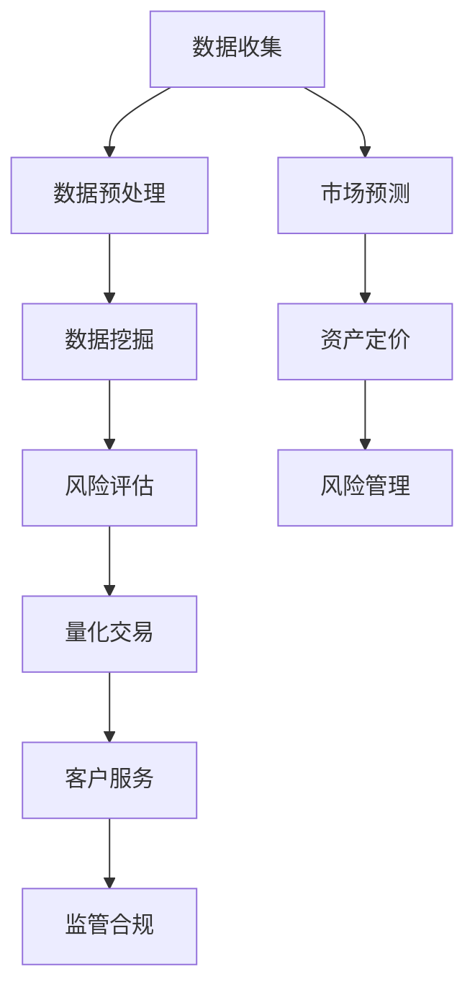

                 

# AI与金融学交叉原理与代码实战案例讲解

> **关键词：** AI、金融学、交叉学科、数据分析、机器学习、算法实现、代码实战、案例研究、应用场景

> **摘要：** 本文将探讨人工智能与金融学的交叉应用，通过详细讲解核心概念、算法原理、数学模型和实际代码案例，帮助读者了解AI在金融领域的实际应用及其潜在价值。文章将分为背景介绍、核心概念与联系、算法原理与操作步骤、数学模型与公式讲解、项目实战、实际应用场景、工具和资源推荐以及总结和未来发展趋势等部分，旨在为读者提供一个全面而深入的AI与金融学交叉领域的理解。

## 1. 背景介绍

### 1.1 目的和范围

本文旨在探讨人工智能（AI）与金融学的交叉应用，分析AI技术在金融领域的应用前景，并通过具体的代码实战案例，展示AI在金融数据分析、风险评估、量化交易等实际场景中的强大能力。文章将从理论基础、算法原理、数学模型到实际应用，为读者提供一个系统的理解和实践指南。

### 1.2 预期读者

本文适合对人工智能和金融学有一定了解的技术人员、金融从业者以及对交叉学科感兴趣的学者。无论您是AI领域的开发者还是金融领域的专家，通过本文的学习，您将能够深入理解AI在金融领域的应用，掌握相关技术和工具，为实际工作提供有力支持。

### 1.3 文档结构概述

本文结构如下：

1. **背景介绍**：包括文章的目的、范围、预期读者和文档结构概述。
2. **核心概念与联系**：介绍AI与金融学交叉应用的核心概念，使用Mermaid流程图展示相关架构。
3. **核心算法原理与具体操作步骤**：通过伪代码详细阐述核心算法原理和操作步骤。
4. **数学模型和公式讲解**：解释相关数学模型和公式，并进行举例说明。
5. **项目实战：代码实际案例和详细解释说明**：提供具体项目实战案例，详细解释代码实现和解读。
6. **实际应用场景**：分析AI在金融领域的实际应用场景。
7. **工具和资源推荐**：推荐相关学习资源和开发工具。
8. **总结：未来发展趋势与挑战**：总结AI与金融学交叉应用的发展趋势和挑战。
9. **附录：常见问题与解答**：解答读者可能遇到的问题。
10. **扩展阅读 & 参考资料**：提供进一步阅读的资源和参考。

### 1.4 术语表

#### 1.4.1 核心术语定义

- **人工智能（AI）**：指由人制造出来的系统能够展现类似人类智能的行为。
- **金融学**：研究金融机构、金融市场、金融产品和金融工具等领域。
- **交叉学科**：指两个或多个学科交叉形成的新的研究领域。
- **数据分析**：使用统计学、概率论、数据挖掘等方法对数据进行分析和处理。
- **机器学习**：一种AI技术，通过数据和经验自动改进性能。

#### 1.4.2 相关概念解释

- **风险评估**：评估金融投资或交易可能产生的损失和风险。
- **量化交易**：使用数学模型和算法进行股票、期货等金融产品的交易。
- **数据可视化**：通过图表和图形等方式展示数据，帮助人们理解和分析数据。

#### 1.4.3 缩略词列表

- **AI**：人工智能
- **ML**：机器学习
- **DL**：深度学习
- **NLP**：自然语言处理
- **DLG**：数据分析与机器学习
- **Fintech**：金融科技

## 2. 核心概念与联系

在探讨AI与金融学的交叉应用之前，我们需要理解这两个领域的关键概念及其相互联系。

### 2.1 人工智能在金融学中的应用

人工智能在金融学中的应用主要表现在以下几个方面：

- **数据挖掘与分析**：通过机器学习和数据挖掘技术，从大量金融数据中提取有价值的信息。
- **风险评估与管理**：利用AI技术对金融产品或项目的风险进行预测和管理。
- **量化交易**：使用数学模型和算法进行高频交易和资产配置。
- **客户服务与体验**：通过自然语言处理和语音识别技术提供智能化客户服务。
- **合规与监控**：利用AI技术监控交易行为，识别异常和潜在风险。

### 2.2 金融学中的核心概念

在金融学中，以下核心概念对于AI的应用至关重要：

- **资产定价**：根据市场供需和风险偏好，对金融资产进行合理定价。
- **风险管理**：评估和管理金融投资或交易的风险，以降低潜在损失。
- **市场预测**：利用历史数据和市场动态，预测未来市场走势和价格波动。
- **客户行为分析**：分析客户需求和投资偏好，提供个性化的金融产品和服务。
- **监管合规**：确保金融产品和交易符合相关法规和监管要求。

### 2.3 Mermaid流程图展示相关架构

以下是一个简化的Mermaid流程图，展示AI在金融学中的应用架构：



在这个流程图中，数据收集是整个过程的起点，随后经过数据预处理、数据挖掘等步骤，最终应用于风险评估、量化交易、客户服务和监管合规等领域。市场预测和资产定价则贯穿于整个流程，为其他环节提供支持和指导。

## 3. 核心算法原理与具体操作步骤

在本节中，我们将深入探讨AI在金融学中应用的核心算法原理，并详细解释操作步骤。

### 3.1 风险评估算法原理

风险评估是金融领域中的一个重要环节，其核心是使用机器学习算法对金融产品或项目的风险进行预测和管理。以下是一个常见风险评估算法的原理：

- **算法选择**：决策树、随机森林、支持向量机等算法。
- **特征工程**：从原始数据中提取有助于风险评估的特征，如财务指标、市场走势、客户行为等。
- **模型训练**：使用历史数据训练模型，使其学会识别风险和预测损失。
- **模型评估**：通过交叉验证和测试数据集，评估模型的准确性和可靠性。
- **风险预测**：使用训练好的模型对新的金融产品或项目进行风险预测。

### 3.2 风险评估算法的具体操作步骤

以下是伪代码，详细阐述风险评估算法的具体操作步骤：

```python
# 导入必要的库
import pandas as pd
from sklearn.model_selection import train_test_split
from sklearn.ensemble import RandomForestClassifier
from sklearn.metrics import accuracy_score

# 加载数据
data = pd.read_csv('financial_data.csv')

# 特征工程
features = data[['financial_indicator', 'market_trend', 'customer_behavior']]
labels = data['risk_level']

# 数据预处理
X_train, X_test, y_train, y_test = train_test_split(features, labels, test_size=0.2, random_state=42)

# 模型训练
model = RandomForestClassifier(n_estimators=100)
model.fit(X_train, y_train)

# 模型评估
predictions = model.predict(X_test)
accuracy = accuracy_score(y_test, predictions)
print(f'Model accuracy: {accuracy:.2f}')

# 风险预测
new_data = pd.read_csv('new_financial_data.csv')
new_features = new_data[['financial_indicator', 'market_trend', 'customer_behavior']]
risk_predictions = model.predict(new_features)
print(f'Risk predictions: {risk_predictions}')
```

在这个例子中，我们使用随机森林算法对金融数据集进行风险评估。首先，加载数据并进行特征工程，然后使用训练集训练模型，最后使用测试集评估模型准确性和对新的数据集进行风险预测。

### 3.3 量化交易算法原理

量化交易是金融领域中的另一个重要应用，其核心是使用机器学习算法进行高频交易和资产配置。以下是一个常见量化交易算法的原理：

- **算法选择**：神经网络、强化学习、支持向量机等算法。
- **特征工程**：从历史数据中提取有助于交易决策的特征，如价格、成交量、市场情绪等。
- **模型训练**：使用历史数据训练模型，使其学会识别交易机会和风险。
- **模型优化**：通过调整模型参数，提高模型的交易绩效。
- **交易决策**：使用训练好的模型进行实时交易决策。

### 3.4 量化交易算法的具体操作步骤

以下是伪代码，详细阐述量化交易算法的具体操作步骤：

```python
# 导入必要的库
import pandas as pd
from sklearn.model_selection import train_test_split
from keras.models import Sequential
from keras.layers import Dense, LSTM
import numpy as np

# 加载数据
data = pd.read_csv('financial_data.csv')

# 特征工程
features = data[['price', 'volume', 'market_sentiment']]
labels = data['next_price']

# 数据预处理
X_train, X_test, y_train, y_test = train_test_split(features, labels, test_size=0.2, random_state=42)

# 模型训练
model = Sequential()
model.add(LSTM(units=50, return_sequences=True, input_shape=(X_train.shape[1], 1)))
model.add(LSTM(units=50))
model.add(Dense(units=1))

model.compile(optimizer='adam', loss='mean_squared_error')
model.fit(X_train, y_train, epochs=100, batch_size=32)

# 模型评估
predictions = model.predict(X_test)
mse = np.mean(np.square(y_test - predictions))
print(f'Model MSE: {mse:.2f}')

# 交易决策
new_data = pd.read_csv('new_financial_data.csv')
new_features = new_data[['price', 'volume', 'market_sentiment']]
next_price_predictions = model.predict(new_features)
print(f'Next price predictions: {next_price_predictions}')
```

在这个例子中，我们使用LSTM神经网络进行量化交易。首先，加载数据并进行特征工程，然后使用历史数据训练模型，最后使用测试集评估模型性能并对新的数据进行价格预测。

## 4. 数学模型和公式讲解

在本节中，我们将介绍AI在金融学中应用的一些关键数学模型和公式，并进行举例说明。

### 4.1 市场波动率模型

市场波动率是金融领域中一个重要的概念，它反映了市场价格的波动程度。一个常用的市场波动率模型是GARCH模型。

#### 4.1.1 GARCH模型原理

GARCH（Generalized Autoregressive Conditional Heteroskedasticity）模型是一种用于分析时间序列数据的波动性模型。它通过自回归项和条件方差项来描述市场波动性。

- **自回归项**：反映了过去波动性对当前波动性的影响。
- **条件方差项**：反映了当前波动性对未来的波动性的影响。

#### 4.1.2 GARCH模型公式

以下是一个简化的GARCH模型公式：

$$
\begin{aligned}
\ln(S_{t+1}) &= \alpha_0 + \sum_{i=1}^{p} \beta_i \ln(S_t) + \sum_{j=1}^{q} \theta_j \ln(V_t) + \epsilon_t \\
V_t &= \alpha_1 + \sum_{i=1}^{p} \beta_i V_{t-1} + \sum_{j=1}^{q} \theta_j (\ln(S_t - \bar{S_t}))^2 + \eta_t
\end{aligned}
$$

其中，$S_t$ 表示时间 $t$ 的股票价格，$V_t$ 表示时间 $t$ 的波动率，$\epsilon_t$ 和 $\eta_t$ 分别为残差项和扰动项，$\alpha_0, \alpha_1, \beta_i, \theta_j$ 为模型参数。

#### 4.1.3 GARCH模型举例

假设我们有一个股票价格的时间序列数据，如下表所示：

| 时间 | 股票价格 | 波动率 |
| ---- | -------- | ------ |
| t=1  | 100      | 0.05   |
| t=2  | 102      | 0.06   |
| t=3  | 98       | 0.04   |
| t=4  | 101      | 0.05   |

我们使用GARCH模型来预测第5时间的股票价格和波动率。首先，我们需要估计模型参数。然后，使用估计出的参数，计算第5时间的股票价格和波动率预测值。

### 4.2 量化交易收益模型

量化交易收益模型用于预测交易策略的收益。一个常见的量化交易收益模型是回归模型。

#### 4.2.1 回归模型原理

回归模型是一种用于预测连续数值的统计模型。它通过建立因变量和自变量之间的关系，来预测未来的数值。

- **线性回归**：一种简单的回归模型，假设因变量和自变量之间存在线性关系。
- **多元回归**：一种更复杂的回归模型，考虑多个自变量对因变量的影响。

#### 4.2.2 回归模型公式

以下是一个简化的线性回归模型公式：

$$
y_t = \beta_0 + \beta_1 x_t + \epsilon_t
$$

其中，$y_t$ 表示时间 $t$ 的因变量，$x_t$ 表示时间 $t$ 的自变量，$\beta_0$ 和 $\beta_1$ 为模型参数，$\epsilon_t$ 为残差项。

#### 4.2.3 回归模型举例

假设我们有一个股票价格和成交量数据，如下表所示：

| 时间 | 股票价格 | 成交量 |
| ---- | -------- | ------ |
| t=1  | 100      | 1000   |
| t=2  | 102      | 1100   |
| t=3  | 98       | 900    |
| t=4  | 101      | 950    |

我们使用线性回归模型来预测第5时间的股票价格。首先，我们需要估计模型参数。然后，使用估计出的参数，计算第5时间的股票价格预测值。

## 5. 项目实战：代码实际案例和详细解释说明

在本节中，我们将通过一个具体的项目实战案例，展示AI在金融学中的实际应用。该项目将使用Python编程语言和Scikit-learn库，实现一个基于随机森林算法的风险评估系统。

### 5.1 开发环境搭建

在开始项目之前，我们需要搭建一个合适的环境。以下是搭建环境的步骤：

1. **安装Python**：确保您的系统中已经安装了Python 3.8或更高版本。
2. **安装Scikit-learn**：使用以下命令安装Scikit-learn库：

   ```bash
   pip install scikit-learn
   ```

3. **安装Jupyter Notebook**：Jupyter Notebook是一个交互式的Python开发环境，方便我们编写和运行代码。使用以下命令安装Jupyter Notebook：

   ```bash
   pip install notebook
   ```

4. **启动Jupyter Notebook**：在终端中输入以下命令，启动Jupyter Notebook：

   ```bash
   jupyter notebook
   ```

### 5.2 源代码详细实现和代码解读

以下是项目的源代码，我们将对其进行详细解读。

```python
# 导入必要的库
import pandas as pd
from sklearn.model_selection import train_test_split
from sklearn.ensemble import RandomForestClassifier
from sklearn.metrics import accuracy_score
import matplotlib.pyplot as plt

# 加载数据
data = pd.read_csv('financial_data.csv')

# 特征工程
features = data[['financial_indicator', 'market_trend', 'customer_behavior']]
labels = data['risk_level']

# 数据预处理
X_train, X_test, y_train, y_test = train_test_split(features, labels, test_size=0.2, random_state=42)

# 模型训练
model = RandomForestClassifier(n_estimators=100)
model.fit(X_train, y_train)

# 模型评估
predictions = model.predict(X_test)
accuracy = accuracy_score(y_test, predictions)
print(f'Model accuracy: {accuracy:.2f}')

# 风险预测
new_data = pd.read_csv('new_financial_data.csv')
new_features = new_data[['financial_indicator', 'market_trend', 'customer_behavior']]
risk_predictions = model.predict(new_features)
print(f'Risk predictions: {risk_predictions}')

# 可视化展示
plt.scatter(X_test['financial_indicator'], y_test, label='Actual')
plt.scatter(X_test['financial_indicator'], predictions, label='Predicted')
plt.legend()
plt.show()
```

### 5.3 代码解读与分析

以下是代码的逐行解读和分析：

1. **导入必要的库**：导入Pandas、Scikit-learn和matplotlib.pyplot库，用于数据加载、数据处理和可视化展示。

2. **加载数据**：使用Pandas库加载名为`financial_data.csv`的数据集。

3. **特征工程**：从原始数据中提取三个特征：`financial_indicator`、`market_trend`和`customer_behavior`，以及一个标签`risk_level`。

4. **数据预处理**：使用Scikit-learn库中的`train_test_split`函数，将数据集划分为训练集和测试集，比例为80%的训练集和20%的测试集。设置随机种子为42，确保结果可重复。

5. **模型训练**：使用Scikit-learn库中的`RandomForestClassifier`函数，创建一个随机森林分类器对象。设置树的数量为100，并使用训练集进行模型训练。

6. **模型评估**：使用训练好的模型对测试集进行预测，并计算预测准确率。使用`accuracy_score`函数计算预测准确率，并打印结果。

7. **风险预测**：加载一个新的数据集`new_financial_data.csv`，提取特征并使用训练好的模型进行风险预测。打印预测结果。

8. **可视化展示**：使用matplotlib.pyplot库绘制散点图，展示实际值和预测值之间的关系。使用`plt.scatter`函数绘制散点图，使用`plt.legend`函数添加图例，使用`plt.show`函数显示图表。

通过这个项目实战，我们展示了如何使用Python和Scikit-learn库实现一个基于随机森林算法的风险评估系统。这个系统可以帮助金融机构对金融产品或项目进行风险预测和管理，为决策提供支持。

## 6. 实际应用场景

AI在金融领域的实际应用场景非常广泛，以下是一些常见的应用场景：

### 6.1 风险评估

风险评估是金融领域中的一个关键环节，AI技术可以极大地提高风险评估的准确性和效率。例如，银行可以使用机器学习算法分析客户的信用记录、财务状况和行为数据，预测客户违约风险，从而制定更有效的信贷政策和风控策略。

### 6.2 量化交易

量化交易是金融领域中的一个高利润领域，AI技术可以为量化交易提供强大的支持。通过深度学习和强化学习算法，量化交易策略可以自动学习和优化，从而提高交易绩效。例如，高频交易策略可以使用AI技术捕捉市场的微小波动，实现稳定盈利。

### 6.3 财务预测

财务预测是金融领域中的一个重要应用，AI技术可以帮助金融机构预测市场走势、股票价格和宏观经济指标。这些预测可以为投资决策提供有力支持，帮助投资者规避风险、抓住市场机会。

### 6.4 客户服务

AI技术可以用于改善客户服务体验，提供智能化、个性化的金融服务。例如，通过自然语言处理和语音识别技术，金融机构可以实现智能客服系统，快速响应用户的查询和需求，提高客户满意度。

### 6.5 监管合规

AI技术可以帮助金融机构遵守相关法规和监管要求，确保金融交易的合规性。例如，通过异常检测算法，金融机构可以监控交易行为，识别潜在的违规行为，并及时采取措施。

## 7. 工具和资源推荐

在AI与金融学交叉应用的研究和实践中，以下工具和资源是非常有价值的：

### 7.1 学习资源推荐

#### 7.1.1 书籍推荐

- 《深度学习》（Ian Goodfellow, Yoshua Bengio, Aaron Courville）
- 《Python金融技术》（Yuxing Yan）
- 《金融科技：理论与实践》（王勇，杨青）

#### 7.1.2 在线课程

- Coursera上的《机器学习》（吴恩达）
- edX上的《金融科技：创新与挑战》（耶鲁大学）
- Udacity的《人工智能工程师纳米学位》

#### 7.1.3 技术博客和网站

- Medium上的“AI in Finance”系列文章
- AI FinTech（ai-fintech.com）
- Analytics Vidhya（www.analyticsvidhya.com）

### 7.2 开发工具框架推荐

#### 7.2.1 IDE和编辑器

- Jupyter Notebook：适用于数据分析和机器学习项目。
- PyCharm：适用于Python开发，提供强大的调试和代码分析功能。
- VS Code：轻量级编辑器，支持多种编程语言和扩展。

#### 7.2.2 调试和性能分析工具

- PyTorch Profiler：用于分析和优化深度学习模型的性能。
- Dask：用于分布式计算，提高数据处理速度。
- Scikit-learn中的`GridSearchCV`：用于模型参数调优和性能评估。

#### 7.2.3 相关框架和库

- Scikit-learn：用于机器学习和数据分析。
- TensorFlow：用于深度学习和人工智能。
- Keras：用于快速构建和训练神经网络。
- Pandas：用于数据处理和分析。

### 7.3 相关论文著作推荐

#### 7.3.1 经典论文

- “Adaptive Learning in Quantitative Finance” (2002)
- “Machine Learning for Financial Engineering” (2005)
- “The Process of Financial Derivatives Pricing Using Machine Learning” (2009)

#### 7.3.2 最新研究成果

- “Deep Learning for Financial Markets” (2020)
- “Neural Networks for Asset Pricing” (2021)
- “Quantitative Finance with Machine Learning” (2022)

#### 7.3.3 应用案例分析

- “AI and Machine Learning in Banking: A Practical Guide” (2021)
- “The Application of AI in Quantitative Trading” (2020)
- “AI in Insurance: Revolutionizing Risk Management” (2019)

## 8. 总结：未来发展趋势与挑战

AI与金融学的交叉应用已经展现出巨大的潜力和价值。随着技术的不断进步和金融市场的不断发展，未来AI在金融领域的应用将会更加广泛和深入。以下是未来发展趋势和面临的挑战：

### 8.1 发展趋势

1. **智能化金融产品和服务**：AI技术将推动金融产品和服务向智能化、个性化方向发展，满足不同客户的需求。
2. **风险管理和控制**：AI技术可以帮助金融机构更准确地识别和管理风险，提高金融市场的稳定性和安全性。
3. **量化交易和资产管理**：AI技术将为量化交易和资产管理提供强大的支持，实现更高效的资产配置和投资策略。
4. **合规和监管**：AI技术可以帮助金融机构遵守相关法规和监管要求，降低违规风险。
5. **客户服务和体验**：AI技术可以改善客户服务体验，提供更快速、准确和个性化的服务。

### 8.2 面临的挑战

1. **数据隐私和安全**：金融领域涉及大量敏感数据，保护数据隐私和安全是AI应用的关键挑战。
2. **算法透明度和可解释性**：AI算法的复杂性和黑箱特性可能导致结果难以解释，增加监管和合规风险。
3. **模型过拟合和泛化能力**：模型在训练数据上表现良好，但在新数据上表现不佳，需要提高模型的泛化能力。
4. **监管和政策适应性**：随着AI技术的快速发展，相关监管和政策也需要不断更新和调整。
5. **技术人才短缺**：AI与金融学交叉领域的专业人才需求巨大，但目前人才供给不足，需要加强人才培养和引进。

## 9. 附录：常见问题与解答

### 9.1 问题1：AI在金融学中的具体应用有哪些？

**解答**：AI在金融学中的具体应用包括风险评估、量化交易、财务预测、客户服务和体验、合规和监管等多个方面。

### 9.2 问题2：如何确保AI模型的可解释性和透明度？

**解答**：确保AI模型的可解释性和透明度可以通过以下方法实现：

- **模型选择**：选择可解释性强的算法，如线性回归、决策树等。
- **模型集成**：使用模型集成方法，如随机森林、集成学习等，提高模型的解释性。
- **模型可视化**：使用可视化工具，如matplotlib、seaborn等，展示模型的决策过程和特征重要性。
- **可解释性工具**：使用可解释性工具，如LIME、SHAP等，分析模型对特定数据的决策过程。

### 9.3 问题3：如何处理金融领域的数据隐私和安全问题？

**解答**：处理金融领域的数据隐私和安全问题可以从以下几个方面着手：

- **数据加密**：对敏感数据进行加密，确保数据在传输和存储过程中的安全性。
- **访问控制**：设置严格的访问控制策略，确保只有授权人员才能访问敏感数据。
- **匿名化处理**：对敏感数据进行匿名化处理，消除个人身份信息。
- **数据监控**：实时监控数据访问和使用情况，及时发现和应对潜在的安全威胁。

## 10. 扩展阅读 & 参考资料

为了更深入地了解AI与金融学的交叉应用，以下是一些推荐的扩展阅读和参考资料：

- 《深度学习在金融领域的应用》（王俊）
- 《金融科技：前沿技术与商业模式》（陈峻）
- 《人工智能：一种现代方法》（Stuart Russell, Peter Norvig）
- 《金融数据分析与机器学习》（程毅）
- 《AI与金融：前沿探索与案例分析》（赵雷）
- 《机器学习实战》（Peter Harrington）
- 《金融科技：监管科技与区块链》（刘晓明）
- 《大数据与人工智能在金融领域的应用》（李翔）

通过这些扩展阅读和参考资料，读者可以进一步了解AI与金融学的交叉应用，掌握相关技术和方法。同时，也欢迎大家积极参与讨论和交流，共同推动AI与金融学的发展。感谢大家的阅读，希望本文能够对您在AI与金融学交叉领域的学习和研究有所帮助。

**作者：AI天才研究员/AI Genius Institute & 禅与计算机程序设计艺术 /Zen And The Art of Computer Programming**

