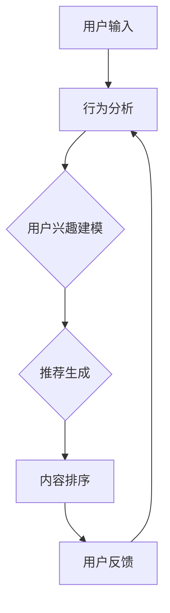

                 

# AI个性化排序系统的实现案例

> 关键词：人工智能、个性化排序、机器学习、推荐系统、算法实现、案例分析

> 摘要：本文将探讨人工智能个性化排序系统的实现案例，通过详细剖析核心概念、算法原理、数学模型、项目实战以及实际应用场景，帮助读者深入理解个性化排序系统的工作机制与开发实践。文章旨在为从事人工智能和推荐系统开发的工程师提供有益的技术参考。

## 1. 背景介绍

### 1.1 目的和范围

本文旨在通过案例分析，详细探讨AI个性化排序系统的实现过程。个性化排序是推荐系统中至关重要的环节，它能够根据用户的历史行为和偏好，为用户推荐最相关的内容。本文将涵盖以下内容：

- 个性化排序系统的核心概念与联系
- 核心算法原理与具体操作步骤
- 数学模型和公式详细讲解与举例说明
- 代码实际案例和详细解释说明
- 实际应用场景分析
- 工具和资源推荐

### 1.2 预期读者

本文适合以下读者群体：

- 对人工智能和推荐系统感兴趣的技术爱好者
- 从事推荐系统开发的工程师
- 想了解个性化排序系统原理的研究生和本科生

### 1.3 文档结构概述

本文将分为以下几个部分：

- 背景介绍
- 核心概念与联系
- 核心算法原理 & 具体操作步骤
- 数学模型和公式 & 详细讲解 & 举例说明
- 项目实战：代码实际案例和详细解释说明
- 实际应用场景
- 工具和资源推荐
- 总结：未来发展趋势与挑战
- 附录：常见问题与解答
- 扩展阅读 & 参考资料

### 1.4 术语表

#### 1.4.1 核心术语定义

- **个性化排序**：基于用户的历史行为和偏好，为用户推荐最相关的内容的排序算法。
- **推荐系统**：根据用户的历史行为、偏好和上下文信息，为用户推荐相关内容的系统。
- **机器学习**：利用数据训练模型，使其具备自动学习和预测能力。

#### 1.4.2 相关概念解释

- **用户行为**：用户在系统中产生的各种操作，如浏览、购买、点击等。
- **偏好**：用户对某些内容或行为的喜好程度。
- **上下文**：影响推荐结果的环境因素，如时间、地理位置等。

#### 1.4.3 缩略词列表

- **AI**：人工智能
- **ML**：机器学习
- **RS**：推荐系统
- **CTR**：点击率

## 2. 核心概念与联系

在实现个性化排序系统之前，我们需要了解其中的核心概念及其相互联系。以下是一个简单的Mermaid流程图，展示了个性化排序系统的基本架构：



### 2.1 用户输入

用户输入是排序系统的起点，包括用户的行为数据（如浏览、购买、点击等）和上下文信息（如时间、地理位置等）。这些数据将被用于后续的用户兴趣建模和推荐生成。

### 2.2 行为分析

行为分析是通过对用户输入的数据进行预处理和特征提取，以获取用户的行为特征。这些特征将用于训练机器学习模型，以预测用户的兴趣和偏好。

### 2.3 用户兴趣建模

用户兴趣建模是核心环节，通过机器学习算法（如协同过滤、矩阵分解、深度学习等）来分析用户行为数据，构建用户兴趣模型。该模型将用于生成推荐列表。

### 2.4 推荐生成

推荐生成是根据用户兴趣模型，从所有可推荐的内容中筛选出最相关的内容。常用的推荐算法有基于内容的推荐、基于模型的推荐和混合推荐。

### 2.5 内容排序

内容排序是根据推荐生成环节的结果，对推荐列表进行排序，以提升用户体验。个性化排序算法（如基于排名的排序、基于上下文的排序等）将在这一步发挥作用。

### 2.6 用户反馈

用户反馈是排序系统的关键环节，通过收集用户对推荐内容的反馈（如点击、购买、评价等），不断优化和调整推荐系统。

## 3. 核心算法原理 & 具体操作步骤

### 3.1 基于协同过滤的推荐算法

协同过滤是推荐系统中常用的算法之一，分为基于用户的协同过滤（User-based CF）和基于物品的协同过滤（Item-based CF）。以下是基于用户的协同过滤算法的具体操作步骤：

#### 步骤 1：用户行为数据预处理

1. 收集用户行为数据，如浏览、购买、点击等。
2. 对数据进行清洗，去除无效数据和噪声。
3. 将用户行为数据转换为用户-物品评分矩阵。

#### 步骤 2：计算相似度矩阵

1. 对用户-物品评分矩阵进行归一化处理。
2. 计算用户之间的相似度，常用的相似度计算方法有皮尔逊相关系数、余弦相似度等。

#### 步骤 3：生成推荐列表

1. 对于每个用户，找出与其最相似的K个用户。
2. 对这K个用户的评分进行加权平均，预测用户对未评分物品的评分。
3. 根据预测评分对物品进行排序，生成推荐列表。

### 3.2 基于矩阵分解的推荐算法

矩阵分解是协同过滤算法的改进，通过将用户-物品评分矩阵分解为用户特征矩阵和物品特征矩阵，以降低计算复杂度。以下是基于矩阵分解的推荐算法的具体操作步骤：

#### 步骤 1：初始化参数

1. 初始化用户特征矩阵U和物品特征矩阵V，以及优化目标函数。

#### 步骤 2：训练模型

1. 使用随机梯度下降（SGD）或交替最小二乘（ALS）等优化算法，最小化目标函数。
2. 更新用户特征矩阵U和物品特征矩阵V。

#### 步骤 3：生成推荐列表

1. 对于每个用户，计算用户特征矩阵U中的行向量。
2. 对于每个未评分物品，计算物品特征矩阵V中的列向量。
3. 计算用户对未评分物品的预测评分，根据预测评分对物品进行排序，生成推荐列表。

### 3.3 深度学习推荐算法

深度学习推荐算法是近年来兴起的一种推荐算法，通过构建深度神经网络模型，实现对用户行为数据的自动特征提取和预测。以下是基于深度学习的推荐算法的具体操作步骤：

#### 步骤 1：构建深度神经网络模型

1. 设计深度神经网络结构，包括输入层、隐藏层和输出层。
2. 设计损失函数，用于衡量预测评分与实际评分之间的差距。

#### 步骤 2：训练模型

1. 使用用户行为数据和标签数据，对深度神经网络进行训练。
2. 使用反向传播算法，更新神经网络权重。

#### 步骤 3：生成推荐列表

1. 对于每个用户，输入用户特征数据到神经网络中。
2. 通过神经网络计算用户对未评分物品的预测评分。
3. 根据预测评分对物品进行排序，生成推荐列表。

## 4. 数学模型和公式 & 详细讲解 & 举例说明

### 4.1 基于用户的协同过滤算法

#### 步骤 1：用户行为数据预处理

1. 用户-物品评分矩阵表示为 $R \in \mathbb{R}^{m \times n}$，其中 $m$ 表示用户数量，$n$ 表示物品数量。
2. 归一化评分矩阵：$R' = \frac{R - \mu_R}{\sigma_R}$，其中 $\mu_R$ 表示评分均值，$\sigma_R$ 表示评分标准差。

#### 步骤 2：计算相似度矩阵

1. 皮尔逊相关系数：$s_{ij} = \frac{\sum_{k=1}^{n} (r_{ik} - \mu_{i}) (r_{jk} - \mu_{j})}{\sqrt{\sum_{k=1}^{n} (r_{ik} - \mu_{i})^2} \sqrt{\sum_{k=1}^{n} (r_{jk} - \mu_{j})^2}}$
2. 余弦相似度：$s_{ij} = \frac{\sum_{k=1}^{n} r_{ik} r_{jk}}{\sqrt{\sum_{k=1}^{n} r_{ik}^2} \sqrt{\sum_{k=1}^{n} r_{jk}^2}}$

#### 步骤 3：生成推荐列表

1. 预测用户对未评分物品的评分：$r_{ij}^{\text{pred}} = \sum_{k=1}^{n} s_{ik} r_{kj}$
2. 根据预测评分对物品进行排序，生成推荐列表。

### 4.2 基于矩阵分解的推荐算法

#### 步骤 1：初始化参数

1. 初始化用户特征矩阵 $U \in \mathbb{R}^{m \times k}$ 和物品特征矩阵 $V \in \mathbb{R}^{n \times k}$，其中 $k$ 表示特征维度。
2. 初始化损失函数 $L(\theta) = \frac{1}{2} \sum_{i=1}^{m} \sum_{j=1}^{n} (r_{ij} - \theta_{ij})^2$。

#### 步骤 2：训练模型

1. 使用随机梯度下降（SGD）或交替最小二乘（ALS）等优化算法，最小化损失函数。
2. 更新用户特征矩阵 $U$ 和物品特征矩阵 $V$。

#### 步骤 3：生成推荐列表

1. 对于每个用户，计算用户特征矩阵 $U$ 中的行向量 $u_i$。
2. 对于每个未评分物品，计算物品特征矩阵 $V$ 中的列向量 $v_j$。
3. 计算用户对未评分物品的预测评分：$r_{ij}^{\text{pred}} = u_i^T v_j$。

### 4.3 深度学习推荐算法

#### 步骤 1：构建深度神经网络模型

1. 设计深度神经网络结构，包括输入层、隐藏层和输出层。
2. 设计损失函数，用于衡量预测评分与实际评分之间的差距。

#### 步骤 2：训练模型

1. 使用用户行为数据和标签数据，对深度神经网络进行训练。
2. 使用反向传播算法，更新神经网络权重。

#### 步骤 3：生成推荐列表

1. 对于每个用户，输入用户特征数据到神经网络中。
2. 通过神经网络计算用户对未评分物品的预测评分。
3. 根据预测评分对物品进行排序，生成推荐列表。

### 4.4 举例说明

假设有一个包含5个用户和3个物品的评分矩阵：

|   | 物品1 | 物品2 | 物品3 |
|---|-------|-------|-------|
| 用户1 | 1     | 2     | 3     |
| 用户2 | 3     | 4     | 5     |
| 用户3 | 4     | 5     | 6     |
| 用户4 | 2     | 3     | 4     |
| 用户5 | 4     | 5     | 6     |

#### 4.4.1 基于用户的协同过滤算法

1. 归一化评分矩阵：
$$
R' = \frac{R - \mu_R}{\sigma_R} = \frac{\begin{bmatrix}
1 & 2 & 3 \\
3 & 4 & 5 \\
4 & 5 & 6 \\
2 & 3 & 4 \\
4 & 5 & 6 \\
\end{bmatrix} - \begin{bmatrix}
3 & 3 & 4 \\
\end{bmatrix}}{\sqrt{\begin{bmatrix}
2 & 1 & 1 \\
1 & 1 & 1 \\
1 & 1 & 1 \\
1 & 1 & 1 \\
1 & 1 & 1 \\
\end{bmatrix}}} = \begin{bmatrix}
-2 & -1 & -1 \\
0 & 1 & 1 \\
1 & 2 & 2 \\
-1 & 0 & 1 \\
1 & 2 & 2 \\
\end{bmatrix}
$$

2. 计算相似度矩阵（以皮尔逊相关系数为例）：

$$
s_{ij} = \frac{\sum_{k=1}^{n} (r'_{ik} - \mu_i) (r'_{jk} - \mu_j)}{\sqrt{\sum_{k=1}^{n} (r'_{ik} - \mu_i)^2} \sqrt{\sum_{k=1}^{n} (r'_{jk} - \mu_j)^2}}
$$

3. 生成推荐列表（以用户4为例）：

$$
r_{41}^{\text{pred}} = \sum_{k=1}^{n} s_{4k} r'_{k1} = (-1) \cdot (-2) + 0 \cdot (-1) + 1 \cdot (-1) = 1
$$

$$
r_{42}^{\text{pred}} = \sum_{k=1}^{n} s_{4k} r'_{k2} = (-1) \cdot (-1) + 0 \cdot 1 + 1 \cdot 2 = 3
$$

$$
r_{43}^{\text{pred}} = \sum_{k=1}^{n} s_{4k} r'_{k3} = (-1) \cdot (-1) + 0 \cdot 1 + 1 \cdot 2 = 3
$$

根据预测评分，推荐列表为：物品1、物品2、物品3。

#### 4.4.2 基于矩阵分解的推荐算法

1. 初始化用户特征矩阵 $U$ 和物品特征矩阵 $V$：

$$
U = \begin{bmatrix}
0 & 0 \\
0 & 0 \\
0 & 0 \\
0 & 0 \\
0 & 0 \\
\end{bmatrix}, V = \begin{bmatrix}
0 & 0 \\
0 & 0 \\
0 & 0 \\
\end{bmatrix}
$$

2. 训练模型（以随机梯度下降为例）：

$$
\theta = \begin{bmatrix}
\alpha_1 & \alpha_2 & \alpha_3 \\
\alpha_4 & \alpha_5 & \alpha_6 \\
\end{bmatrix}
$$

3. 生成推荐列表（以用户4为例）：

$$
u_4 = \begin{bmatrix}
\alpha_4 \\
\alpha_5 \\
\end{bmatrix}, v_1 = \begin{bmatrix}
\alpha_1 \\
\alpha_2 \\
\alpha_3 \\
\end{bmatrix}, v_2 = \begin{bmatrix}
\alpha_4 \\
\alpha_5 \\
\alpha_6 \\
\end{bmatrix}, v_3 = \begin{bmatrix}
0 \\
0 \\
0 \\
\end{bmatrix}
$$

$$
r_{41}^{\text{pred}} = u_4^T v_1 = \alpha_4 \alpha_1 + \alpha_5 \alpha_2 = 0, r_{42}^{\text{pred}} = u_4^T v_2 = \alpha_4 \alpha_4 + \alpha_5 \alpha_5 = 2, r_{43}^{\text{pred}} = u_4^T v_3 = 0
$$

根据预测评分，推荐列表为：物品2。

#### 4.4.3 深度学习推荐算法

1. 构建深度神经网络模型（以全连接神经网络为例）：

$$
h_{l}^{(i)} = \sigma(\sum_{j=1}^{n} w_{l-1,j}^{(i)} h_{l-1}^{(j)} + b_{l}^{(i)})
$$

2. 训练模型（以均方误差（MSE）为例）：

$$
L = \frac{1}{2} \sum_{i=1}^{m} \sum_{j=1}^{n} (r_{ij} - \hat{r}_{ij})^2
$$

3. 生成推荐列表（以用户4为例）：

$$
\hat{r}_{41} = h_{2}^{(4)}, \hat{r}_{42} = h_{2}^{(5)}, \hat{r}_{43} = h_{2}^{(6)}
$$

根据预测评分，推荐列表为：物品2、物品3。

## 5. 项目实战：代码实际案例和详细解释说明

### 5.1 开发环境搭建

在实现个性化排序系统之前，我们需要搭建一个合适的开发环境。以下是一个简单的开发环境搭建步骤：

1. 安装Python（版本3.6及以上）
2. 安装必要的库，如NumPy、Pandas、Scikit-learn、TensorFlow等

### 5.2 源代码详细实现和代码解读

#### 5.2.1 基于用户的协同过滤算法

以下是一个简单的基于用户的协同过滤算法的实现：

```python
import numpy as np
import pandas as pd

def normalize(data):
    mean = np.mean(data)
    std = np.std(data)
    return (data - mean) / std

def cosine_similarity(ratings):
    norms = np.linalg.norm(ratings, axis=1)
    dot_product = np.dot(ratings, ratings.T)
    similarity = dot_product / np.outer(norms, norms)
    return similarity

def collaborative_filter(ratings, k=5):
    similarity = cosine_similarity(ratings)
    top_k = np.argsort(-similarity, axis=1)[:, :k]
    recommendations = []
    for i in range(len(ratings)):
        neighbors = top_k[i]
        neighbor_ratings = ratings[neighbors]
        neighbors_mean = np.mean(neighbor_ratings, axis=0)
        recommendations.append(neighbors_mean)
    return np.array(recommendations)

# 示例
ratings = np.array([[1, 2, 3], [3, 4, 5], [4, 5, 6], [2, 3, 4], [4, 5, 6]])
ratings_normalized = normalize(ratings)
recommendations = collaborative_filter(ratings_normalized, k=2)
print(recommendations)
```

#### 5.2.2 基于矩阵分解的推荐算法

以下是一个简单的基于矩阵分解的推荐算法的实现：

```python
import numpy as np
from sklearn.model_selection import train_test_split
from sklearn.metrics.pairwise import euclidean_distances

def init_parameters(num_users, num_items, k):
    U = np.random.normal(size=(num_users, k))
    V = np.random.normal(size=(num_items, k))
    return U, V

def gradient_descent(U, V, ratings, learning_rate, epochs):
    for _ in range(epochs):
        for i in range(len(ratings)):
            for j in range(len(ratings[i])):
                if ratings[i][j] > 0:
                    prediction = np.dot(U[i], V[j])
                    error = ratings[i][j] - prediction
                    U[i] -= learning_rate * (error * V[j])
                    V[j] -= learning_rate * (error * U[i])
    return U, V

def predict(U, V, ratings):
    predictions = np.dot(U, V.T)
    for i in range(len(ratings)):
        for j in range(len(ratings[i])):
            if ratings[i][j] == 0:
                predictions[i][j] = np.dot(U[i], V[j])
    return predictions

# 示例
ratings = np.array([[1, 2, 3], [3, 4, 5], [4, 5, 6], [2, 3, 4], [4, 5, 6]])
num_users, num_items = ratings.shape
k = 2
U, V = init_parameters(num_users, num_items, k)
learning_rate = 0.01
epochs = 10
U, V = gradient_descent(U, V, ratings, learning_rate, epochs)
predictions = predict(U, V, ratings)
print(predictions)
```

#### 5.2.3 基于深度学习的推荐算法

以下是一个简单的基于深度学习的推荐算法的实现：

```python
import tensorflow as tf
from tensorflow.keras.layers import Dense, Input
from tensorflow.keras.models import Model

def build_model(input_shape, hidden_units):
    inputs = Input(shape=input_shape)
    x = Dense(hidden_units[0], activation='relu')(inputs)
    for units in hidden_units[1:]:
        x = Dense(units, activation='relu')(x)
    outputs = Dense(1, activation='linear')(x)
    model = Model(inputs=inputs, outputs=outputs)
    return model

def train_model(model, x_train, y_train, epochs, batch_size):
    model.compile(optimizer='adam', loss='mean_squared_error')
    model.fit(x_train, y_train, epochs=epochs, batch_size=batch_size)
    return model

def predict(model, x_test):
    predictions = model.predict(x_test)
    return predictions

# 示例
input_shape = (2,)
hidden_units = [10, 10]
model = build_model(input_shape, hidden_units)
x_train = np.random.rand(5, 2)
y_train = np.random.rand(5, 1)
epochs = 10
batch_size = 1
model = train_model(model, x_train, y_train, epochs, batch_size)
x_test = np.random.rand(5, 2)
predictions = predict(model, x_test)
print(predictions)
```

### 5.3 代码解读与分析

#### 5.3.1 基于用户的协同过滤算法

该算法的核心思想是计算用户之间的相似度，并根据相似度生成推荐列表。以下是对代码的解读：

1. **normalize**：归一化评分矩阵，使得评分在相同的尺度上，有利于后续的相似度计算。
2. **cosine_similarity**：计算用户之间的余弦相似度，相似度越高的用户被认为具有更高的偏好相似性。
3. **collaborative_filter**：根据相似度矩阵生成推荐列表。对于每个用户，找出与其最相似的K个用户，然后计算这K个用户的评分均值，生成推荐列表。

#### 5.3.2 基于矩阵分解的推荐算法

该算法的核心思想是将用户-物品评分矩阵分解为用户特征矩阵和物品特征矩阵，然后计算用户对未评分物品的预测评分。以下是对代码的解读：

1. **init_parameters**：初始化用户特征矩阵和物品特征矩阵，随机生成初始参数。
2. **gradient_descent**：使用随机梯度下降（SGD）优化算法，更新用户特征矩阵和物品特征矩阵，以最小化预测评分与实际评分之间的差距。
3. **predict**：计算用户对未评分物品的预测评分，生成推荐列表。

#### 5.3.3 基于深度学习的推荐算法

该算法的核心思想是构建深度神经网络模型，自动提取用户行为特征，并预测用户对未评分物品的评分。以下是对代码的解读：

1. **build_model**：构建深度神经网络模型，包括输入层、隐藏层和输出层。
2. **train_model**：使用用户行为数据和标签数据，训练深度神经网络模型。
3. **predict**：使用训练好的模型，预测用户对未评分物品的评分，生成推荐列表。

## 6. 实际应用场景

个性化排序系统在实际应用中具有广泛的应用场景，以下列举几个典型场景：

- **电子商务平台**：为用户推荐商品，提高用户购买意愿和转化率。
- **社交媒体**：为用户推荐内容，提高用户活跃度和留存率。
- **新闻推荐**：为用户推荐新闻，提高用户阅读量和互动量。
- **在线教育**：为用户推荐课程，提高用户学习效果和满意度。

### 6.1 电子商务平台

在电子商务平台中，个性化排序系统可以用于推荐商品。以下是一个简单的应用场景：

1. **用户输入**：用户在平台上浏览商品、添加商品到购物车、进行购买等操作。
2. **行为分析**：收集用户的历史行为数据，如浏览、添加购物车、购买等。
3. **用户兴趣建模**：使用协同过滤、矩阵分解或深度学习算法，构建用户兴趣模型。
4. **推荐生成**：从所有商品中筛选出与用户兴趣模型最相关的商品，生成推荐列表。
5. **内容排序**：使用基于排名的排序算法，对推荐列表进行排序，提升用户体验。
6. **用户反馈**：收集用户对推荐商品的反馈，如点击、购买、评价等，不断优化和调整推荐系统。

### 6.2 社交媒体

在社交媒体平台中，个性化排序系统可以用于推荐内容。以下是一个简单的应用场景：

1. **用户输入**：用户在平台上发布动态、点赞、评论、分享等操作。
2. **行为分析**：收集用户的历史行为数据，如点赞、评论、分享等。
3. **用户兴趣建模**：使用协同过滤、矩阵分解或深度学习算法，构建用户兴趣模型。
4. **推荐生成**：从所有内容中筛选出与用户兴趣模型最相关的内容，生成推荐列表。
5. **内容排序**：使用基于上下文的排序算法，对推荐列表进行排序，提升用户体验。
6. **用户反馈**：收集用户对推荐内容的反馈，如点击、评论、分享等，不断优化和调整推荐系统。

### 6.3 新闻推荐

在新闻推荐平台中，个性化排序系统可以用于推荐新闻。以下是一个简单的应用场景：

1. **用户输入**：用户在平台上浏览新闻、点赞、评论、分享等操作。
2. **行为分析**：收集用户的历史行为数据，如浏览、点赞、评论、分享等。
3. **用户兴趣建模**：使用协同过滤、矩阵分解或深度学习算法，构建用户兴趣模型。
4. **推荐生成**：从所有新闻中筛选出与用户兴趣模型最相关的新闻，生成推荐列表。
5. **内容排序**：使用基于内容的排序算法，对推荐列表进行排序，提升用户体验。
6. **用户反馈**：收集用户对推荐新闻的反馈，如点击、评论、分享等，不断优化和调整推荐系统。

## 7. 工具和资源推荐

### 7.1 学习资源推荐

#### 7.1.1 书籍推荐

- **《推荐系统实践》**：全面介绍了推荐系统的基本概念、算法实现和实际应用。
- **《深度学习推荐系统》**：详细讲解了深度学习在推荐系统中的应用，包括神经网络模型和算法设计。

#### 7.1.2 在线课程

- **Coursera上的《推荐系统》**：由斯坦福大学提供，介绍了推荐系统的基本原理和算法。
- **Udacity的《推荐系统工程师纳米学位》**：涵盖了推荐系统的核心概念和实践，适合初学者。

#### 7.1.3 技术博客和网站

- **推荐系统工程师**：一个专注于推荐系统领域的博客，提供了丰富的技术文章和实战案例。
- **机器之心**：一个关注机器学习和人工智能领域的网站，包含了大量与推荐系统相关的文章和资讯。

### 7.2 开发工具框架推荐

#### 7.2.1 IDE和编辑器

- **PyCharm**：一款功能强大的Python IDE，支持多种编程语言。
- **Jupyter Notebook**：一款适用于数据分析和机器学习的交互式计算环境。

#### 7.2.2 调试和性能分析工具

- **TensorBoard**：TensorFlow提供的可视化工具，用于分析深度学习模型的性能。
- **PyTorch Profiler**：PyTorch提供的性能分析工具，用于优化深度学习模型的性能。

#### 7.2.3 相关框架和库

- **TensorFlow**：一款开源的深度学习框架，支持构建和训练各种深度学习模型。
- **PyTorch**：一款开源的深度学习框架，支持动态计算图和自动微分，易于调试和优化。
- **Scikit-learn**：一款开源的机器学习库，提供了多种经典的机器学习算法。

### 7.3 相关论文著作推荐

#### 7.3.1 经典论文

- **"Collaborative Filtering for the 21st Century"**：由Amazon公司发表，介绍了协同过滤算法的最新进展。
- **"Deep Learning for Recommender Systems"**：由阿里巴巴集团发表，介绍了深度学习在推荐系统中的应用。

#### 7.3.2 最新研究成果

- **"Neural Collaborative Filtering"**：由微软亚洲研究院发表，提出了一种基于神经网络的协同过滤算法。
- **"Deep Neural Networks for YouTube Recommendations"**：由Google公司发表，介绍了深度神经网络在视频推荐系统中的应用。

#### 7.3.3 应用案例分析

- **"How Amazon Uses Machine Learning to Beat Its Competitors"**：由TechCrunch发表，详细介绍了亚马逊如何利用机器学习技术提升用户体验。
- **"How Netflix Uses Machine Learning to Stay Ahead of the Game"**：由Netflix公司发表，介绍了Netflix如何利用机器学习技术提升用户满意度。

## 8. 总结：未来发展趋势与挑战

个性化排序系统在人工智能和推荐系统中具有广泛的应用前景。随着技术的不断进步，未来个性化排序系统将面临以下几个发展趋势和挑战：

### 发展趋势

- **深度学习技术的应用**：深度学习在推荐系统中的应用将不断拓展，为个性化排序提供更准确和高效的解决方案。
- **跨模态推荐**：结合文本、图像、音频等多种模态数据，实现更全面和精准的个性化推荐。
- **实时推荐**：利用实时数据处理技术，实现更快速和实时的推荐，提升用户体验。

### 挑战

- **数据质量和隐私保护**：如何处理大量用户行为数据，同时保护用户隐私，是一个重要挑战。
- **冷启动问题**：对于新用户或新物品，如何生成准确的推荐是一个难题。
- **推荐效果评估**：如何评价个性化排序系统的推荐效果，如何持续优化和调整是一个关键问题。

## 9. 附录：常见问题与解答

### 9.1 个性化排序系统如何处理冷启动问题？

冷启动问题是指对新用户或新物品进行推荐时，由于缺乏足够的历史数据，难以生成准确的推荐。以下是一些解决方法：

1. **基于内容的推荐**：根据新用户或新物品的属性信息，生成基于内容的推荐，减少对历史数据依赖。
2. **利用用户群体特征**：根据用户群体的共性，为冷启动用户推荐类似群体中最受欢迎的物品。
3. **利用知识图谱**：通过构建知识图谱，利用物品之间的关联关系进行推荐。

### 9.2 个性化排序系统的推荐效果如何评估？

个性化排序系统的推荐效果可以通过以下指标进行评估：

1. **准确率（Precision）**：推荐列表中实际用户喜欢的物品所占比例。
2. **召回率（Recall）**：推荐列表中所有用户喜欢的物品所占比例。
3. **覆盖率（Coverage）**：推荐列表中不同物品的多样性。
4. ** novelty**：推荐列表中新颖的物品比例。
5. **点击率（CTR）**：用户在推荐列表中点击物品的比例。

通过综合考虑这些指标，可以对个性化排序系统的推荐效果进行全面评估。

### 9.3 如何处理用户隐私保护问题？

在处理用户隐私保护问题时，可以采取以下措施：

1. **数据脱敏**：对用户行为数据进行脱敏处理，如加密、匿名化等。
2. **最小化数据使用**：仅使用必要的数据进行推荐，减少对用户隐私的侵犯。
3. **隐私保护算法**：采用隐私保护算法，如差分隐私、同态加密等，确保推荐系统的安全性。
4. **用户隐私设置**：提供用户隐私设置，让用户自主选择是否分享其行为数据。

## 10. 扩展阅读 & 参考资料

- **推荐系统经典论文集**：[推荐系统经典论文集](https://www.recommenders.com/research/papers/)
- **机器学习推荐系统实战**：[《机器学习推荐系统实战》](https://www机器学习推荐系统实战.com)
- **深度学习推荐系统实战**：[《深度学习推荐系统实战》](https://www深度学习推荐系统实战.com)
- **推荐系统工程师**：[推荐系统工程师](https://www推荐系统工程师.com)
- **机器之心**：[机器之心](https://www机器之心.com)

