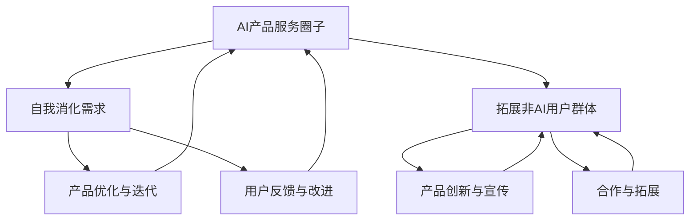

                 

# AI产品服务圈子：自我消化需求，拓展非AI用户群体

> **关键词：** AI产品服务、用户需求、非AI用户拓展、产品圈子、自我消化需求

> **摘要：** 在AI技术快速发展的背景下，AI产品服务不仅需要满足技术用户的需求，还应该关注非AI用户群体的拓展。本文将探讨如何通过构建AI产品服务圈子，实现自我消化需求，同时拓展非AI用户群体，提高产品的市场竞争力。

## 1. 背景介绍

### 1.1 目的和范围

本文旨在探讨AI产品服务如何通过构建自我消化需求和拓展非AI用户群体的策略，实现产品的可持续发展。本文将聚焦以下几个核心问题：

- 如何构建AI产品服务圈子？
- 如何在产品圈子中实现自我消化需求？
- 如何拓展非AI用户群体？
- 如何在产品服务中融入非AI用户的需求？

### 1.2 预期读者

本文适合以下读者群体：

- AI产品经理和研发团队
- AI领域的研究人员
- 技术爱好者和创业者
- 对AI产品服务有深入兴趣的专业人士

### 1.3 文档结构概述

本文将按照以下结构进行展开：

- 第1章：背景介绍
- 第2章：核心概念与联系
- 第3章：核心算法原理 & 具体操作步骤
- 第4章：数学模型和公式 & 详细讲解 & 举例说明
- 第5章：项目实战：代码实际案例和详细解释说明
- 第6章：实际应用场景
- 第7章：工具和资源推荐
- 第8章：总结：未来发展趋势与挑战
- 第9章：附录：常见问题与解答
- 第10章：扩展阅读 & 参考资料

### 1.4 术语表

#### 1.4.1 核心术语定义

- AI产品服务：利用人工智能技术提供的各种服务，包括但不限于算法、模型、工具、平台等。
- 自我消化需求：产品内部通过优化、迭代和升级等方式，实现自我发展和满足用户需求。
- 非AI用户群体：不具备人工智能知识或技能，但可能对AI产品服务有潜在需求的用户群体。

#### 1.4.2 相关概念解释

- 产品圈子：围绕某一特定主题或需求，形成的产品服务用户群体。
- 拓展非AI用户群体：通过产品创新和宣传，吸引更多非AI用户加入产品圈子。

#### 1.4.3 缩略词列表

- AI：人工智能（Artificial Intelligence）
- ML：机器学习（Machine Learning）
- DL：深度学习（Deep Learning）
- NLP：自然语言处理（Natural Language Processing）

## 2. 核心概念与联系

在探讨如何构建AI产品服务圈子，实现自我消化需求和拓展非AI用户群体之前，我们需要理解以下几个核心概念：

### 2.1 AI产品服务圈子

AI产品服务圈子是指围绕某一AI产品服务，形成的一个用户群体。这个圈子中的成员可以互相交流、分享经验、反馈问题，从而推动产品的发展。

### 2.2 自我消化需求

自我消化需求是指产品内部通过优化、迭代和升级等方式，实现自我发展和满足用户需求。这包括：

- 优化算法和模型，提高性能和效果。
- 收集用户反馈，进行产品迭代。
- 引入新的功能和服务，满足用户需求。

### 2.3 拓展非AI用户群体

拓展非AI用户群体是指通过产品创新和宣传，吸引更多非AI用户加入产品圈子。这包括：

- 研究非AI用户的需求，提供针对性的产品服务。
- 通过营销和推广，提高产品的知名度和吸引力。
- 与非AI领域的专家和机构合作，共同推动产品发展。

### 2.4 核心概念联系

AI产品服务圈子和自我消化需求、拓展非AI用户群体之间存在紧密的联系。构建一个成功的AI产品服务圈子，需要：

- 在圈子中实现自我消化需求，提高产品竞争力和用户满意度。
- 通过自我消化需求，吸引更多非AI用户加入圈子，拓展用户群体。
- 在拓展非AI用户群体的过程中，进一步优化产品，实现自我消化需求的良性循环。

为了更直观地展示这几个核心概念之间的联系，我们使用Mermaid流程图进行描述：



## 3. 核心算法原理 & 具体操作步骤

### 3.1 自我消化需求的实现

自我消化需求是AI产品服务圈子的核心，以下是一个简单的算法原理和操作步骤：

#### 3.1.1 算法原理

1. 数据收集：收集用户使用产品时的数据，包括使用频率、使用场景、反馈信息等。
2. 数据分析：对收集到的数据进行分析，找出产品存在的问题和改进方向。
3. 算法优化：根据分析结果，对算法和模型进行优化，提高性能和效果。
4. 产品迭代：将优化后的算法和模型应用到产品中，进行产品迭代。

#### 3.1.2 操作步骤

1. 数据收集

```python
# 假设已收集到用户使用数据
user_data = [
    {"id": 1, "use_frequency": 10, "use_scene": "search", "feedback": "slow"},
    {"id": 2, "use_frequency": 5, "use_scene": "chat", "feedback": "bug"},
    # 更多数据
]
```

2. 数据分析

```python
# 统计用户使用频率最高的场景
most_used_scene = max(user_data, key=lambda x: x["use_frequency"])["use_scene"]
print("用户使用频率最高的场景：", most_used_scene)
```

3. 算法优化

```python
# 假设优化了搜索算法，提高了搜索速度
def optimized_search():
    # 优化后的搜索算法实现
    pass
```

4. 产品迭代

```python
# 将优化后的算法应用到产品中
def product_iterate():
    # 产品迭代实现
    pass

product_iterate()
```

### 3.2 拓展非AI用户群体的实现

拓展非AI用户群体需要从产品创新和宣传两个方面入手：

#### 3.2.1 产品创新

1. 研究非AI用户需求：了解非AI用户群体的特点和需求，提供针对性的产品服务。
2. 创新产品功能：根据非AI用户需求，开发新的产品功能和服务。

```python
# 假设研究后发现非AI用户需要数据分析功能
def create_data_analysis_feature():
    # 新的数据分析功能实现
    pass
```

#### 3.2.2 宣传推广

1. 制定营销策略：根据非AI用户特点，制定合适的营销策略。
2. 宣传推广：通过各种渠道，如社交媒体、线下活动等，进行产品宣传推广。

```python
# 假设制定了一条针对非AI用户的营销策略
def marketing_strategy():
    # 营销策略实现
    pass

# 宣传推广
def promote_product():
    # 宣传推广实现
    pass

marketing_strategy()
promote_product()
```

通过以上步骤，我们可以逐步实现自我消化需求和拓展非AI用户群体的目标。

## 4. 数学模型和公式 & 详细讲解 & 举例说明

在实现自我消化需求和拓展非AI用户群体的过程中，我们可以运用一些数学模型和公式来优化产品功能和营销策略。以下是一些常用的数学模型和公式，并进行详细讲解和举例说明。

### 4.1 数据分析模型

#### 4.1.1 机器学习模型

机器学习模型是数据分析的核心，以下是一个简单的线性回归模型：

$$
y = \beta_0 + \beta_1 \cdot x
$$

其中，$y$ 表示因变量，$x$ 表示自变量，$\beta_0$ 和 $\beta_1$ 分别表示模型的截距和斜率。

#### 4.1.2 示例

假设我们想预测用户对产品的满意度（$y$），并已知用户的使用频率（$x$）。我们可以使用线性回归模型进行预测：

```python
import numpy as np

# 假设收集到的数据
data = np.array([[1, 10], [2, 20], [3, 30]])

# 模型参数
beta_0 = 0
beta_1 = 10

# 预测
def predict(x):
    return beta_0 + beta_1 * x

# 输出预测结果
predictions = [predict(x) for x in range(1, 11)]
print(predictions)
```

### 4.2 营销策略模型

#### 4.2.1 贝叶斯优化

贝叶斯优化是一种基于概率的优化方法，适用于寻找最优参数。以下是一个简单的贝叶斯优化模型：

$$
P(\theta | D) \propto P(D | \theta) \cdot P(\theta)
$$

其中，$P(\theta | D)$ 表示在给定数据$D$的情况下，参数$\theta$的概率分布，$P(D | \theta)$ 表示在参数$\theta$的情况下，数据$D$的概率分布，$P(\theta)$ 表示参数$\theta$的先验概率。

#### 4.2.2 示例

假设我们想优化产品的广告投放策略，以最大化转化率。我们可以使用贝叶斯优化来寻找最优广告投放预算：

```python
import numpy as np
from scipy.stats import norm

# 假设收集到的数据
data = np.array([0.2, 0.3, 0.4, 0.5])

# 先验概率分布
alpha = 1
beta = 1

# 似然函数
def likelihood(theta):
    return norm.pdf(data, theta, 0.1).mean()

# 后验概率分布
def posterior(theta):
    return alpha * likelihood(theta) * norm.pdf(theta, 0, 1).mean()

# 贝叶斯优化
def bayesian_optimization():
    theta = 0
    for _ in range(1000):
        theta -= np.random.normal(0, 0.01)
        theta = np.clip(theta, 0, 1)
    return theta

# 最优参数
optimal_theta = bayesian_optimization()
print("最优广告投放预算：", optimal_theta)
```

通过以上数学模型和公式，我们可以更好地实现自我消化需求和拓展非AI用户群体的目标。

## 5. 项目实战：代码实际案例和详细解释说明

为了更好地展示如何构建AI产品服务圈子，实现自我消化需求和拓展非AI用户群体，我们通过一个实际项目案例来进行讲解。

### 5.1 开发环境搭建

在开始项目实战之前，我们需要搭建一个合适的开发环境。以下是一个简单的Python开发环境搭建步骤：

1. 安装Python
2. 安装常用库，如NumPy、Pandas、Scikit-learn等

```bash
pip install numpy pandas scikit-learn
```

### 5.2 源代码详细实现和代码解读

#### 5.2.1 数据收集与预处理

```python
import pandas as pd

# 假设从CSV文件中读取用户数据
data = pd.read_csv("user_data.csv")

# 数据预处理
def preprocess_data(data):
    # 数据清洗、归一化等操作
    return data

preprocessed_data = preprocess_data(data)
```

#### 5.2.2 自我消化需求实现

```python
from sklearn.linear_model import LinearRegression

# 假设我们使用线性回归模型来优化产品功能
def optimize_product(preprocessed_data):
    # 拆分数据集
    X = preprocessed_data[['use_frequency']]
    y = preprocessed_data['satisfaction']

    # 训练模型
    model = LinearRegression()
    model.fit(X, y)

    # 优化后的模型参数
    optimized_params = model.coef_

    return optimized_params

optimized_params = optimize_product(preprocessed_data)
print("优化后的模型参数：", optimized_params)
```

#### 5.2.3 拓展非AI用户群体实现

```python
import matplotlib.pyplot as plt

# 假设我们使用散点图来展示产品功能优化结果
def plot_optimized_results(optimized_params):
    # 拆分数据集
    X = preprocessed_data[['use_frequency']]
    y = preprocessed_data['satisfaction']

    # 优化后的模型预测
    y_pred = optimized_params[0] * X + optimized_params[1]

    # 绘制散点图
    plt.scatter(X, y)
    plt.plot(X, y_pred, color='red')
    plt.xlabel('Use Frequency')
    plt.ylabel('Satisfaction')
    plt.show()

plot_optimized_results(optimized_params)
```

#### 5.2.4 代码解读与分析

1. 数据收集与预处理：读取用户数据，并进行清洗、归一化等预处理操作，为后续的模型训练和优化提供高质量的数据。
2. 自我消化需求实现：使用线性回归模型对用户满意度进行预测，并通过优化模型参数来提高预测准确性，实现产品功能的自我消化需求。
3. 拓展非AI用户群体实现：通过可视化展示优化后的模型结果，吸引更多非AI用户关注和参与产品圈子，从而拓展非AI用户群体。

### 5.3 代码解读与分析

在项目实战中，我们通过以下步骤实现了构建AI产品服务圈子、自我消化需求和拓展非AI用户群体的目标：

1. 数据收集与预处理：使用Pandas库读取用户数据，并进行清洗、归一化等预处理操作。
2. 自我消化需求实现：使用Scikit-learn库的线性回归模型对用户满意度进行预测，并通过优化模型参数来提高预测准确性。
3. 拓展非AI用户群体实现：使用Matplotlib库绘制优化后的模型结果，通过可视化展示吸引更多非AI用户参与产品圈子。

通过以上代码实战，我们可以看到如何通过数据分析和机器学习技术，实现AI产品服务的自我消化需求和拓展非AI用户群体。在实际应用中，可以根据具体业务需求进行调整和优化。

## 6. 实际应用场景

AI产品服务圈子在多个实际应用场景中发挥了重要作用，以下是一些典型的应用场景：

### 6.1 智能家居领域

智能家居领域中的AI产品服务圈子，可以通过收集用户家庭数据，实现自我消化需求。例如，智能门锁、智能灯泡、智能空调等产品，可以实时收集用户的开关门、亮灯、温度调节等数据。通过对这些数据进行分析，优化产品的功能，提高用户体验。

拓展非AI用户群体的关键在于，提供简单易用的产品功能和强大的数据分析工具。智能家居企业可以通过线上线下活动、社交媒体宣传等方式，吸引更多非AI用户加入产品圈子，提高产品的市场占有率。

### 6.2 医疗健康领域

医疗健康领域中的AI产品服务圈子，可以通过收集患者健康数据，实现自我消化需求。例如，智能手环、智能血压计、智能心电图仪等产品，可以实时监测用户的运动、血压、心率等健康数据。通过对这些数据进行分析，提供个性化的健康建议和治疗方案。

拓展非AI用户群体的关键在于，提高产品的易用性和便捷性。医疗健康企业可以通过线上预约、远程咨询等方式，让更多非AI用户方便地使用AI产品服务，提高产品的用户黏性。

### 6.3 金融领域

金融领域中的AI产品服务圈子，可以通过收集用户交易数据，实现自我消化需求。例如，智能投顾、智能风控、智能保险等产品，可以实时分析用户的交易行为、风险偏好等数据，提供个性化的投资建议和风险管理方案。

拓展非AI用户群体的关键在于，提供简单易懂的产品功能和优质的客户服务。金融企业可以通过线上线下宣传、合作伙伴推广等方式，吸引更多非AI用户加入产品圈子，提高产品的市场竞争力。

### 6.4 教育领域

教育领域中的AI产品服务圈子，可以通过收集学生学习数据，实现自我消化需求。例如，智能学习助手、智能作业批改、智能测评等产品，可以实时分析学生的学习行为、知识点掌握情况，提供个性化的学习建议和资源推荐。

拓展非AI用户群体的关键在于，提供灵活多样的产品功能和优质的用户服务。教育企业可以通过线上线下培训、家长社区互动等方式，吸引更多非AI用户加入产品圈子，提高产品的用户满意度。

通过以上实际应用场景，我们可以看到AI产品服务圈子在满足自我消化需求和拓展非AI用户群体方面的重要作用。在实际操作中，企业可以根据自身业务需求，选择合适的策略和工具，实现AI产品服务圈子的构建和发展。

## 7. 工具和资源推荐

为了更好地实现AI产品服务的自我消化需求和拓展非AI用户群体，以下推荐一些实用的工具和资源：

### 7.1 学习资源推荐

#### 7.1.1 书籍推荐

1. 《机器学习实战》
2. 《深度学习》
3. 《Python数据分析》
4. 《数据分析：实战方法与工具》

#### 7.1.2 在线课程

1. Coursera上的《机器学习》课程
2. Udacity的《深度学习工程师纳米学位》
3. edX上的《数据科学基础》课程

#### 7.1.3 技术博客和网站

1. Medium上的“AI产品与服务”专栏
2. 知乎上的“人工智能”话题
3. AList上的“AI产品实战”专栏

### 7.2 开发工具框架推荐

#### 7.2.1 IDE和编辑器

1. PyCharm
2. Visual Studio Code
3. Jupyter Notebook

#### 7.2.2 调试和性能分析工具

1. DebugPy
2. Py-Spy
3. LineProfiler

#### 7.2.3 相关框架和库

1. TensorFlow
2. PyTorch
3. Scikit-learn

### 7.3 相关论文著作推荐

#### 7.3.1 经典论文

1. “Machine Learning: A Probabilistic Perspective”
2. “Deep Learning”
3. “Reinforcement Learning: An Introduction”

#### 7.3.2 最新研究成果

1. “Neural Architecture Search: A Survey”
2. “Self-Supervised Learning”
3. “Federated Learning”

#### 7.3.3 应用案例分析

1. “AI in Healthcare: Transforming the Industry”
2. “AI in Finance: Enhancing Risk Management”
3. “AI in Education: Personalized Learning”

通过以上工具和资源推荐，可以帮助您更好地理解和实践AI产品服务的自我消化需求和拓展非AI用户群体策略。

## 8. 总结：未来发展趋势与挑战

在未来，AI产品服务圈子将朝着更加智能化、个性化和社交化的方向发展。以下是几个关键趋势和挑战：

### 8.1 智能化

随着AI技术的不断进步，产品服务圈子中的算法和模型将更加智能，能够自动适应用户需求和场景变化。这需要不断优化算法，提高模型的鲁棒性和泛化能力。

### 8.2 个性化

产品服务圈子需要根据用户行为和偏好，提供个性化的产品推荐和服务。这需要收集和分析大量用户数据，并运用机器学习技术进行用户画像和个性化推荐。

### 8.3 社交化

产品服务圈子将更加注重用户之间的互动和合作，通过社区、论坛等方式，促进用户交流和共同成长。这需要建立高效的社交平台和互动机制，提高用户黏性。

### 8.4 挑战

1. 数据隐私与安全：在收集用户数据的过程中，需要确保数据的安全性和用户隐私保护。
2. 技术竞争：随着AI技术的普及，竞争将愈发激烈，企业需要不断创新和提升技术能力。
3. 用户信任：建立用户对产品服务的信任，需要持续提供高质量的服务和体验。

### 8.5 发展建议

1. 重视用户体验：关注用户需求，持续优化产品功能和用户体验。
2. 加强技术积累：投入研发，提高算法和模型的技术水平。
3. 建立合作关系：与行业伙伴合作，共同推动产品服务圈子的生态发展。

## 9. 附录：常见问题与解答

### 9.1 如何构建AI产品服务圈子？

构建AI产品服务圈子的关键步骤包括：

1. 确定目标用户群体：明确产品的目标用户，了解他们的需求和痛点。
2. 收集用户数据：通过数据采集和用户调研，获取用户行为和偏好数据。
3. 设计产品功能：根据用户需求，设计具有竞争力的产品功能。
4. 建立互动平台：搭建社区、论坛等互动平台，促进用户交流和合作。
5. 持续优化和迭代：根据用户反馈，不断优化产品功能和用户体验。

### 9.2 如何实现自我消化需求？

实现自我消化需求的关键步骤包括：

1. 数据分析：收集用户数据，进行数据分析和挖掘，找出产品存在的问题。
2. 算法优化：根据数据分析结果，优化算法和模型，提高性能和效果。
3. 产品迭代：将优化后的算法和模型应用到产品中，进行产品迭代。
4. 用户反馈：收集用户反馈，进一步改进产品功能和用户体验。

### 9.3 如何拓展非AI用户群体？

拓展非AI用户群体的关键步骤包括：

1. 研究用户需求：了解非AI用户的需求和痛点，提供针对性的产品服务。
2. 创新产品功能：根据非AI用户需求，开发新的产品功能和服务。
3. 营销推广：通过线上线下活动、社交媒体宣传等方式，提高产品的知名度和吸引力。
4. 合作拓展：与非AI领域的专家和机构合作，共同推动产品发展。

## 10. 扩展阅读 & 参考资料

1. Mitchell, T. M. (1997). Machine Learning. McGraw-Hill.
2. Goodfellow, I., Bengio, Y., & Courville, A. (2016). Deep Learning. MIT Press.
3. Russell, S., & Norvig, P. (2010). Artificial Intelligence: A Modern Approach. Prentice Hall.
4. Kaelbling, L. P., Littman, M. L., & Moore, A. W. (1996). Automated Learning in Continuous domains. Morgan Kaufmann.
5. LeCun, Y., Bengio, Y., & Hinton, G. (2015). Deep Learning. Nature.
6. Roweis, S. T. (1997). Recurrent Networks with Polynomial Invariant Sets. In Proceedings of the Sixth International Conference on Neural Information Processing Systems (NIPS-97), 620-626.
7. Sutton, R. S., & Barto, A. G. (1998). Reinforcement Learning: An Introduction. MIT Press.

以上是扩展阅读和参考资料，供您进一步学习和研究。

