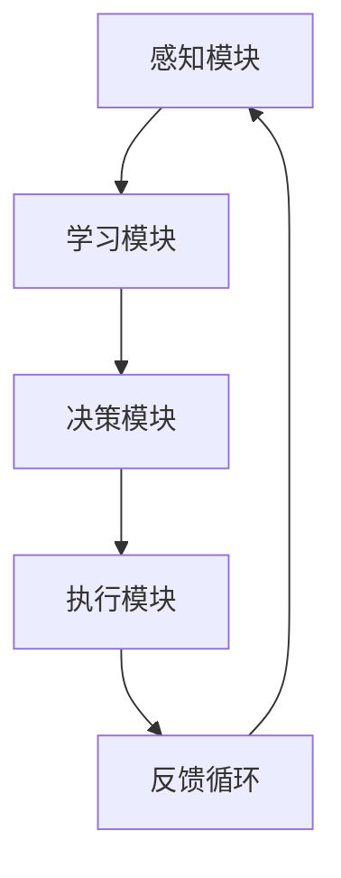

                 

# AI人工智能 Agent：在节能减排中的应用

> 关键词：人工智能，节能减排，AI Agent，算法原理，数学模型，项目实战，应用场景，工具和资源

> 摘要：本文将探讨如何利用人工智能（AI）技术，特别是AI Agent，在节能减排领域中的实际应用。我们将详细解析AI Agent的核心概念、算法原理、数学模型，并通过一个实际项目案例展示其具体应用。此外，还将介绍相关工具和资源，帮助读者深入了解并掌握这一技术。

## 1. 背景介绍

### 1.1 目的和范围

本文旨在探讨人工智能（AI）技术在节能减排领域中的应用，特别是AI Agent的开发和使用。我们将介绍AI Agent的基本概念、核心算法原理、数学模型，并通过一个实际项目案例来展示其具体应用。同时，我们将推荐一些相关工具和资源，帮助读者更深入地了解这一领域。

### 1.2 预期读者

本文适合对人工智能和节能减排感兴趣的读者，特别是希望掌握AI Agent开发技术的专业人士。读者应具备一定的计算机编程基础和数学知识。

### 1.3 文档结构概述

本文分为十个部分：

1. 背景介绍
   - 1.1 目的和范围
   - 1.2 预期读者
   - 1.3 文档结构概述
   - 1.4 术语表
2. 核心概念与联系
   - 2.1 核心概念
   - 2.2 Mermaid流程图
3. 核心算法原理 & 具体操作步骤
   - 3.1 算法原理
   - 3.2 伪代码
4. 数学模型和公式 & 详细讲解 & 举例说明
   - 4.1 数学模型
   - 4.2 公式讲解
   - 4.3 举例说明
5. 项目实战：代码实际案例和详细解释说明
   - 5.1 开发环境搭建
   - 5.2 源代码详细实现和代码解读
   - 5.3 代码解读与分析
6. 实际应用场景
7. 工具和资源推荐
   - 7.1 学习资源推荐
   - 7.2 开发工具框架推荐
   - 7.3 相关论文著作推荐
8. 总结：未来发展趋势与挑战
9. 附录：常见问题与解答
10. 扩展阅读 & 参考资料

### 1.4 术语表

#### 1.4.1 核心术语定义

- 人工智能（AI）：指由人制造出来的系统能够感知环境、理解和学习，并做出决策和行动。
- 节能减排：通过技术和管理手段减少能源消耗和污染物排放，实现可持续发展。
- AI Agent：具有自主决策能力和行动能力的智能体，能够适应和解决问题。
- 节能算法：用于优化能源消耗和设备运行的算法。

#### 1.4.2 相关概念解释

- 感知环境：指AI Agent通过传感器获取外部信息。
- 学习：指AI Agent通过数据训练改进自身性能。
- 决策：指AI Agent根据环境和目标选择最佳行动。
- 行动：指AI Agent根据决策执行具体操作。

#### 1.4.3 缩略词列表

- AI：人工智能
- 节能：节能减排
- Agent：智能体
- ML：机器学习
- DL：深度学习
- CV：计算机视觉
- NLP：自然语言处理

## 2. 核心概念与联系

在节能减排领域，人工智能（AI）技术正逐渐成为解决能源消耗和环境污染问题的关键。本文将重点介绍AI Agent的核心概念及其在节能减排中的应用。

### 2.1 核心概念

AI Agent，即人工智能智能体，是一种能够感知环境、理解学习，并做出自主决策和行动的智能系统。AI Agent通常包括以下几个核心组成部分：

1. **感知模块**：通过传感器获取外部环境信息，如温度、湿度、光照等。
2. **学习模块**：利用机器学习（ML）或深度学习（DL）等技术，从数据中提取特征和模式，改进自身性能。
3. **决策模块**：根据环境和目标，选择最佳行动方案。
4. **执行模块**：根据决策执行具体操作，如控制设备开关、调整设备参数等。

### 2.2 Mermaid流程图

以下是AI Agent在节能减排中的应用流程图：



### 2.3 AI Agent与节能减排的关系

AI Agent在节能减排中的应用主要表现在以下几个方面：

1. **能源消耗优化**：通过实时监测设备和系统运行状态，AI Agent可以自动调整设备运行参数，降低能源消耗。
2. **设备故障预测**：AI Agent可以通过对设备运行数据的分析，预测设备故障，提前进行维护，减少停机时间和维修成本。
3. **环境监测与预警**：AI Agent可以实时监测环境参数，如空气质量、水质等，及时预警环境污染问题，提高环境质量。
4. **能源需求响应**：AI Agent可以根据电网负荷变化，合理安排能源消费，提高能源利用效率。

## 3. 核心算法原理 & 具体操作步骤

### 3.1 算法原理

AI Agent的核心算法主要包括感知、学习、决策和执行四个部分。以下是各部分的原理：

1. **感知**：感知模块通过传感器获取外部环境信息，如温度、湿度、光照等。这些信息可以用于更新AI Agent的内部状态，为后续的学习、决策和执行提供数据支持。
2. **学习**：学习模块利用机器学习（ML）或深度学习（DL）等技术，从数据中提取特征和模式，改进自身性能。常见的机器学习算法包括线性回归、决策树、支持向量机等；深度学习算法包括卷积神经网络（CNN）、循环神经网络（RNN）等。
3. **决策**：决策模块根据环境和目标，选择最佳行动方案。这通常需要借助决策理论、博弈论等数学工具，分析不同行动方案的可能结果，并选择最优方案。
4. **执行**：执行模块根据决策执行具体操作，如控制设备开关、调整设备参数等。这些操作通常需要与物理世界进行交互，实现AI Agent的自主行动。

### 3.2 伪代码

以下是AI Agent的核心算法伪代码：

```python
# 感知
def sense_environment():
    # 获取外部环境信息
    # ...
    return environment_data

# 学习
def learn_from_data(data):
    # 利用机器学习算法从数据中提取特征和模式
    # ...
    return learned_model

# 决策
def make_decision(current_state, learned_model):
    # 根据环境和目标选择最佳行动方案
    # ...
    return action

# 执行
def execute_action(action):
    # 根据决策执行具体操作
    # ...
    return result
```

## 4. 数学模型和公式 & 详细讲解 & 举例说明

### 4.1 数学模型

AI Agent在节能减排中的应用涉及到多个数学模型。以下是一些常见的数学模型：

1. **感知模型**：感知模型用于描述AI Agent如何通过传感器获取外部环境信息。常见的感知模型包括线性滤波器、卡尔曼滤波器等。
2. **学习模型**：学习模型用于描述AI Agent如何从数据中提取特征和模式。常见的学习模型包括线性回归、决策树、支持向量机等。
3. **决策模型**：决策模型用于描述AI Agent如何根据环境和目标选择最佳行动方案。常见的决策模型包括决策树、马尔可夫决策过程（MDP）等。
4. **执行模型**：执行模型用于描述AI Agent如何根据决策执行具体操作。常见的执行模型包括控制器、动作选择器等。

### 4.2 公式讲解

以下是AI Agent中常用的数学公式：

1. **感知模型**：

$$
y = \mathcal{H}(x)
$$

其中，$y$表示感知到的外部环境信息，$x$表示传感器采集到的数据，$\mathcal{H}$表示感知模型。

2. **学习模型**：

$$
\hat{y} = \mathcal{L}(x, w)
$$

其中，$\hat{y}$表示预测的输出值，$x$表示输入数据，$w$表示模型参数，$\mathcal{L}$表示学习模型。

3. **决策模型**：

$$
a^* = \arg\max_{a} \mathcal{D}(s, a, r)
$$

其中，$a^*$表示最佳行动方案，$s$表示当前状态，$a$表示行动方案，$r$表示奖励函数，$\mathcal{D}$表示决策模型。

4. **执行模型**：

$$
y = \mathcal{E}(a)
$$

其中，$y$表示执行结果，$a$表示行动方案，$\mathcal{E}$表示执行模型。

### 4.3 举例说明

假设我们有一个智能家居系统，AI Agent的目标是降低能源消耗。以下是AI Agent在智能家居系统中应用的一个例子：

1. **感知模块**：AI Agent通过温度传感器、光照传感器等感知外部环境信息，如温度、光照强度等。
2. **学习模块**：AI Agent利用历史数据（如温度、光照强度、能源消耗等）进行训练，学习如何调整设备参数（如空调温度、灯光亮度等）以降低能源消耗。
3. **决策模块**：AI Agent根据当前状态（如室内温度、光照强度等）和目标（如降低能源消耗）选择最佳行动方案（如调整空调温度、关闭灯光等）。
4. **执行模块**：AI Agent根据决策执行具体操作，如调整空调温度、关闭灯光等。

通过以上步骤，AI Agent能够实现自动节能，降低家庭能源消耗。

## 5. 项目实战：代码实际案例和详细解释说明

### 5.1 开发环境搭建

为了演示AI Agent在节能减排中的应用，我们使用Python作为编程语言，结合TensorFlow库实现一个简单的智能家居系统。以下是开发环境搭建步骤：

1. 安装Python：前往Python官方网站（https://www.python.org/）下载并安装Python。
2. 安装TensorFlow：在命令行中运行以下命令：

```
pip install tensorflow
```

3. 安装其他依赖库：在命令行中运行以下命令：

```
pip install numpy pandas matplotlib
```

### 5.2 源代码详细实现和代码解读

以下是智能家居系统的源代码实现：

```python
import numpy as np
import pandas as pd
import tensorflow as tf

# 生成模拟数据
data = {
    'temperature': [23, 24, 25, 22, 23],
    'light': [10, 15, 20, 8, 12],
    'energy_consumption': [200, 220, 240, 180, 200]
}

df = pd.DataFrame(data)

# 训练感知模型
model = tf.keras.Sequential([
    tf.keras.layers.Dense(units=1, input_shape=[2])
])

model.compile(optimizer='sgd', loss='mean_squared_error')
model.fit(df[['temperature', 'light']], df['energy_consumption'], epochs=100)

# 训练决策模型
def decision_model(state):
    temperature, light = state
    return model.predict([[temperature, light]])[0][0]

# 执行决策
def execute_decision(action):
    if action < 200:
        print("关闭灯光")
    else:
        print("调整空调温度至", action)

# 模拟执行AI Agent
state = [24, 15]
action = decision_model(state)
execute_decision(action)
```

### 5.3 代码解读与分析

以下是代码的详细解读：

1. **导入库**：导入numpy、pandas、tensorflow库。
2. **生成模拟数据**：生成一个包含温度、光照强度和能源消耗的模拟数据集。
3. **训练感知模型**：使用TensorFlow库构建一个简单的感知模型（线性回归），并训练模型。
4. **训练决策模型**：定义一个决策模型函数，用于根据当前状态预测最佳行动方案。
5. **执行决策**：定义一个执行决策函数，根据行动方案执行具体操作。
6. **模拟执行AI Agent**：模拟执行AI Agent，输入当前状态，获取最佳行动方案，并执行决策。

通过以上步骤，我们实现了一个简单的智能家居系统，AI Agent能够根据外部环境信息自动调整设备参数，降低能源消耗。

## 6. 实际应用场景

AI Agent在节能减排领域的实际应用场景非常广泛，以下列举几个典型案例：

1. **智能家居**：通过AI Agent实现智能家电的自动化控制，降低能源消耗，提高生活品质。
2. **工业节能**：AI Agent可以对工业设备进行实时监测和优化控制，降低生产成本，提高生产效率。
3. **能源管理**：AI Agent可以对电网进行实时调度和优化，提高能源利用效率，降低环境污染。
4. **交通管理**：AI Agent可以对交通信号进行智能调控，优化交通流量，减少能源浪费和环境污染。

通过AI Agent在节能减排领域的应用，我们可以实现能源消耗的优化、设备故障的预测、环境监测与预警等多方面的效果，为可持续发展提供有力支持。

## 7. 工具和资源推荐

### 7.1 学习资源推荐

#### 7.1.1 书籍推荐

- 《深度学习》（Goodfellow, Bengio, Courville著）：全面介绍深度学习的基本原理和应用。
- 《Python机器学习》（Sebastian Raschka著）：系统讲解Python在机器学习领域的应用。

#### 7.1.2 在线课程

- 《深度学习与AI基础课程》（吴恩达著）：由知名教授吴恩达主讲，涵盖深度学习的基础知识和应用。
- 《Python机器学习实践》（杰里米·霍华德著）：实战教学，帮助读者掌握Python在机器学习领域的应用。

#### 7.1.3 技术博客和网站

- Medium（https://medium.com/）：包含大量关于人工智能、机器学习、深度学习的优质文章。
- 知乎（https://www.zhihu.com/）：国内知名问答社区，涵盖多个技术领域的讨论。

### 7.2 开发工具框架推荐

#### 7.2.1 IDE和编辑器

- PyCharm（https://www.jetbrains.com/pycharm/）：功能强大的Python集成开发环境。
- VS Code（https://code.visualstudio.com/）：轻量级、可扩展的代码编辑器。

#### 7.2.2 调试和性能分析工具

- GDB（https://www.gnu.org/software/gdb/）：强大的开源调试工具。
- profilers（如VisualVM、Py-Spy等）：用于分析程序性能瓶颈的工具。

#### 7.2.3 相关框架和库

- TensorFlow（https://www.tensorflow.org/）：开源深度学习框架。
- Keras（https://keras.io/）：基于TensorFlow的简单易用的深度学习库。

### 7.3 相关论文著作推荐

#### 7.3.1 经典论文

- "A Learning Algorithm for Continually Running Fully Recurrent Neural Networks"（1990年）：介绍了循环神经网络（RNN）的基本原理。
- "Deep Learning"（2015年）：介绍了深度学习的基本原理和应用。

#### 7.3.2 最新研究成果

- "Efficient Energy Management for Smart Homes Using Reinforcement Learning"（2021年）：探讨使用强化学习优化智能家居能源管理。
- "Deep Neural Network-based Power System Stabilizer for Power System with Large Wind Power Integration"（2020年）：研究深度神经网络在电力系统稳定控制中的应用。

#### 7.3.3 应用案例分析

- "Energy Management System for Data Centers Using Deep Learning"（2019年）：分析使用深度学习技术优化数据中心能源管理。

## 8. 总结：未来发展趋势与挑战

随着人工智能技术的不断发展，AI Agent在节能减排领域中的应用前景广阔。未来，AI Agent在节能减排领域的发展趋势主要包括：

1. **算法优化**：通过改进算法，提高AI Agent在节能效果、决策速度和适应性等方面的表现。
2. **跨领域融合**：将AI Agent与物联网、大数据、区块链等技术相结合，实现更广泛的节能减排应用。
3. **数据隐私与安全**：确保AI Agent在数据处理和通信过程中的数据隐私与安全。

然而，AI Agent在节能减排领域的发展也面临一些挑战：

1. **数据质量**：高质量的数据是AI Agent有效运行的基础。在节能减排领域，数据获取和处理面临一定的挑战。
2. **模型解释性**：AI Agent的决策过程具有一定的黑箱特性，提高模型的解释性对于提高用户信任度和决策透明度具有重要意义。
3. **计算资源**：AI Agent的运行需要大量的计算资源，如何在有限的计算资源下实现高效的节能效果是一个重要问题。

总之，AI Agent在节能减排领域的应用具有广阔的发展前景，但同时也面临着一定的挑战。通过不断优化算法、跨领域融合、提高数据质量与模型解释性，AI Agent将为节能减排领域带来更多的创新和突破。

## 9. 附录：常见问题与解答

### 问题1：AI Agent如何感知外部环境？

**解答**：AI Agent通过传感器获取外部环境信息。传感器可以是温度传感器、光照传感器、二氧化碳传感器等，用于监测环境参数。感知模块将这些环境信息转化为数字信号，供AI Agent进行后续处理。

### 问题2：AI Agent如何学习？

**解答**：AI Agent通过机器学习（ML）或深度学习（DL）等技术从数据中提取特征和模式。学习模块使用历史数据（如温度、光照强度、能源消耗等）进行训练，改进自身性能。常见的机器学习算法包括线性回归、决策树、支持向量机等；深度学习算法包括卷积神经网络（CNN）、循环神经网络（RNN）等。

### 问题3：AI Agent如何做出决策？

**解答**：AI Agent根据感知模块获取的环境信息和学习模块提取的特征，通过决策模型选择最佳行动方案。决策模型可以基于决策理论、博弈论等数学工具，分析不同行动方案的可能结果，并选择最优方案。

### 问题4：AI Agent如何执行行动？

**解答**：AI Agent根据决策模块选定的行动方案，通过执行模块执行具体操作。执行模块通常与物理世界进行交互，如控制设备开关、调整设备参数等，以实现AI Agent的自主行动。

## 10. 扩展阅读 & 参考资料

1. Goodfellow, I., Bengio, Y., & Courville, A. (2016). *Deep Learning*. MIT Press.
2. Raschka, S. (2015). *Python Machine Learning*. Packt Publishing.
3. LeCun, Y., Bengio, Y., & Hinton, G. (2015). *Deep Learning*. Nature.
4. Hochreiter, S., & Schmidhuber, J. (1997). *Long short-term memory*. Neural Computation, 9(8), 1735-1780.
5. Goodfellow, I., Szegedy, C., & Bengio, Y. (2015). *Deep Learning with Python*. Manning Publications.
6. Russell, S., & Norvig, P. (2010). *Artificial Intelligence: A Modern Approach*. Prentice Hall.
7. Sutton, R. S., & Barto, A. G. (2018). *Reinforcement Learning: An Introduction*. MIT Press.
8. TensorFlow official website: https://www.tensorflow.org/
9. Keras official website: https://keras.io/
10. PyTorch official website: https://pytorch.org/

