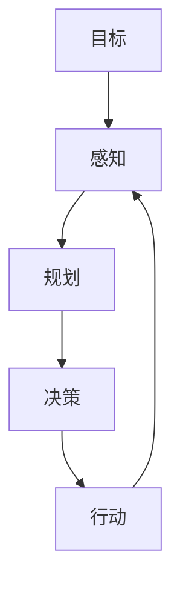
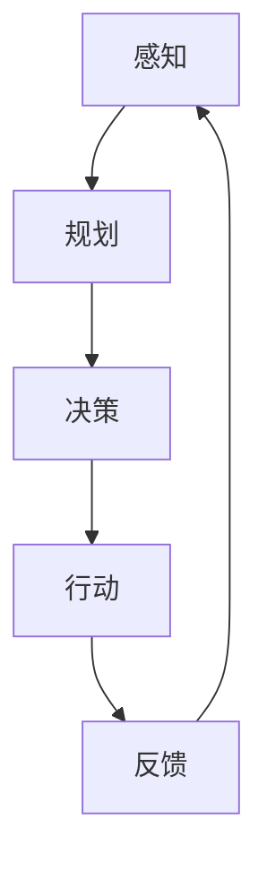

                 

# AI人工智能 Agent：基础理论解析

> **关键词**：人工智能，智能代理，Agent体系结构，算法原理，数学模型，实际应用，项目实战

> **摘要**：本文将深入探讨AI人工智能 Agent的基础理论，包括其核心概念、架构、算法原理、数学模型以及实际应用。通过详细解析和项目实战，读者将全面了解AI智能代理的工作机制，为未来在相关领域的深入研究和应用打下坚实基础。

## 1. 背景介绍

### 1.1 目的和范围

本文旨在系统性地介绍人工智能 Agent 的基础理论，帮助读者理解和掌握智能代理的概念、架构和关键技术。文章将涵盖以下内容：

- 智能代理的定义和核心特征
- 智能代理体系结构及其组成部分
- 智能代理的核心算法原理和数学模型
- 实际应用场景及项目实战案例
- 相关工具和资源的推荐

### 1.2 预期读者

本文适合对人工智能和计算机科学有一定了解的读者，包括：

- 计算机科学专业学生和研究人员
- 数据科学家和人工智能工程师
- AI领域的开发者和实践者
- 对人工智能技术感兴趣的一般读者

### 1.3 文档结构概述

本文结构如下：

1. **背景介绍**：介绍文章的目的、范围、预期读者以及文档结构。
2. **核心概念与联系**：阐述智能代理的核心概念、原理和架构，并使用Mermaid流程图展示。
3. **核心算法原理 & 具体操作步骤**：详细讲解智能代理的核心算法原理，并提供伪代码示例。
4. **数学模型和公式 & 详细讲解 & 举例说明**：介绍智能代理的数学模型，使用LaTeX格式展示公式，并提供实例解释。
5. **项目实战：代码实际案例和详细解释说明**：通过实际项目案例展示智能代理的应用，并提供代码解读和分析。
6. **实际应用场景**：探讨智能代理在不同领域的应用。
7. **工具和资源推荐**：推荐学习资源、开发工具和框架。
8. **总结：未来发展趋势与挑战**：总结智能代理的发展趋势和面临的挑战。
9. **附录：常见问题与解答**：回答读者可能关心的问题。
10. **扩展阅读 & 参考资料**：提供进一步阅读的参考资料。

### 1.4 术语表

#### 1.4.1 核心术语定义

- **智能代理（AI Agent）**：能够自主地感知环境、采取行动并与其他实体交互的计算机程序。
- **感知（Perception）**：智能代理对环境状态的获取和理解。
- **行动（Action）**：智能代理对环境进行的操作。
- **目标（Goal）**：智能代理希望实现的状态或结果。
- **规划（Planning）**：智能代理为达成目标而制定行动方案的过程。
- **决策（Decision）**：智能代理在多种行动方案中选择最佳方案的过程。

#### 1.4.2 相关概念解释

- **状态（State）**：描述环境或系统当前状况的一系列属性。
- **动作空间（Action Space）**：智能代理可以采取的所有可能行动集合。
- **奖励（Reward）**：智能代理采取某一行动后获得的即时奖励或惩罚。
- **马尔可夫决策过程（MDP）**：描述智能代理与环境的交互模型，包含状态空间、动作空间、状态转移概率和奖励函数。
- **强化学习（Reinforcement Learning）**：一种机器学习方法，通过试错和奖励反馈来学习最优策略。

#### 1.4.3 缩略词列表

- **AI**：人工智能
- **Agent**：代理
- **MDP**：马尔可夫决策过程
- **RL**：强化学习

## 2. 核心概念与联系

在介绍智能代理的核心概念之前，我们需要明确其基本原理和架构。以下将使用Mermaid流程图展示智能代理的原理和架构，以便读者更好地理解。



### 2.1 核心概念

#### 智能代理的基本原理

智能代理的核心在于其自主性，即能够自主感知环境、制定目标、规划行动并采取行动。这个过程可以分为以下几个步骤：

1. **感知**：智能代理通过传感器获取环境状态信息。
2. **规划**：基于感知到的环境状态和目标，智能代理制定一系列可能的行动方案。
3. **决策**：从多个行动方案中选择一个最佳方案。
4. **行动**：智能代理执行所选的行动方案。
5. **反馈**：通过执行结果进行反馈，用于调整和优化智能代理的行为。

#### 智能代理的体系结构

智能代理的体系结构可以分为以下几个部分：

1. **感知模块**：用于获取环境状态信息，可以是传感器数据、图像、语音等。
2. **规划模块**：基于感知到的环境状态和目标，生成多个行动方案。
3. **决策模块**：选择最佳行动方案。
4. **执行模块**：执行所选的行动方案，通常与外部设备或系统相连。
5. **学习模块**：通过反馈调整和优化智能代理的行为。

### 2.2 Mermaid流程图

以下是一个简单的Mermaid流程图，展示了智能代理的核心概念和架构：



在这个流程图中，每个模块代表智能代理的一个基本功能，它们相互协作，使智能代理能够有效地与环境交互。

## 3. 核心算法原理 & 具体操作步骤

智能代理的核心在于其算法原理，其中强化学习是一种重要的方法。在本节中，我们将详细讲解强化学习的基本原理和具体操作步骤，并提供伪代码示例。

### 3.1 强化学习基本原理

强化学习是一种通过试错和反馈来学习最优策略的机器学习方法。其基本原理包括以下几个方面：

1. **状态（State）**：描述智能代理当前所处的环境状态。
2. **动作（Action）**：智能代理可以采取的动作。
3. **奖励（Reward）**：智能代理采取某一动作后获得的即时奖励或惩罚。
4. **策略（Policy）**：智能代理在特定状态下采取的动作选择方法。
5. **价值函数（Value Function）**：预测在特定状态下采取某一动作的长期奖励。
6. **模型（Model）**：描述环境状态转移和奖励的函数。

强化学习的过程可以分为以下几个步骤：

1. **初始化**：初始化智能代理的状态和策略。
2. **感知状态**：智能代理获取当前环境状态。
3. **选择动作**：智能代理根据当前状态和策略选择动作。
4. **执行动作**：智能代理执行所选动作，并与环境交互。
5. **获取奖励**：智能代理获得执行动作后的即时奖励。
6. **更新策略**：根据反馈调整智能代理的策略。
7. **重复步骤**：重复执行以上步骤，直至达到目标或策略稳定。

### 3.2 伪代码示例

以下是一个简单的强化学习伪代码示例，展示了智能代理的基本操作步骤：

```python
# 初始化智能代理
state = initialize_state()
policy = initialize_policy()

# 主循环
while not goal_reached:
    # 感知状态
    current_state = perceive_state()

    # 选择动作
    action = policy.select_action(current_state)

    # 执行动作
    next_state, reward = execute_action(action)

    # 获取奖励
    feedback = get_reward(next_state)

    # 更新策略
    policy.update(current_state, action, reward)

    # 更新状态
    state = next_state

# 输出最终策略
print("Final Policy:", policy)
```

### 3.3 伪代码详细解析

1. **初始化智能代理**：初始化智能代理的状态和策略。
2. **感知状态**：智能代理获取当前环境状态。
3. **选择动作**：智能代理根据当前状态和策略选择动作。策略通常由价值函数或模型生成。
4. **执行动作**：智能代理执行所选动作，并与环境交互。
5. **获取奖励**：智能代理获得执行动作后的即时奖励。奖励可以是正数（奖励）或负数（惩罚）。
6. **更新策略**：根据反馈调整智能代理的策略。常见的方法有基于价值函数的更新（如Sarsa、Q-learning）和基于模型的更新（如策略梯度）。
7. **更新状态**：将当前状态更新为下一状态。

通过以上步骤，智能代理能够不断调整其策略，以实现长期奖励最大化。

### 3.4 强化学习算法分类

强化学习算法可以分为以下几类：

1. **值函数方法**：通过预测在特定状态下采取某一动作的长期奖励来学习最优策略。常见的算法有Q-learning、Sarsa等。
2. **策略搜索方法**：直接搜索最优策略，不依赖于价值函数。常见的算法有策略梯度、深度确定性策略梯度（DDPG）等。
3. **模型学习方法**：使用模型预测环境状态转移和奖励，然后根据模型生成策略。常见的算法有模型预测控制（MPC）、深度强化学习（Deep RL）等。

以上分类仅是强化学习算法的一部分，实际应用中还有许多其他算法。读者可以根据实际需求选择合适的算法。

## 4. 数学模型和公式 & 详细讲解 & 举例说明

在智能代理的设计与实现过程中，数学模型和公式起着至关重要的作用。以下将详细介绍智能代理中常用的数学模型和公式，并使用LaTeX格式进行展示，同时提供具体的例子以帮助理解。

### 4.1 马尔可夫决策过程（MDP）

马尔可夫决策过程（MDP）是一种用于描述智能代理与环境的交互的数学模型。它包含以下几个关键组件：

1. **状态空间（\( S \)）**：描述环境状态的可能集合。
2. **动作空间（\( A \)）**：智能代理可以采取的所有可能动作集合。
3. **状态转移概率（\( P(s'|s,a) \)）**：给定当前状态\( s \)和采取动作\( a \)后，下一状态\( s' \)的概率。
4. **奖励函数（\( R(s,a) \)）**：描述智能代理在特定状态\( s \)和采取动作\( a \)后获得的即时奖励。

MDP可以用以下公式表示：

$$
P(s'|s,a) = \sum_{a' \in A} P(s'|s,a')P(a'|a)
$$

$$
R(s,a) = \sum_{s' \in S} R(s',a')P(s'|s,a')
$$

其中，\( P(a'|a) \)是智能代理在当前状态\( a \)下采取动作\( a' \)的概率，通常由策略\( \pi(a|s) \)决定。

### 4.2 价值函数

价值函数是强化学习中的重要概念，用于预测在特定状态下采取某一动作的长期奖励。常见的价值函数有：

1. **状态值函数（\( V(s) \)）**：在特定状态\( s \)下采取最佳动作的长期奖励。

$$
V(s) = \sum_{a \in A} \pi(a|s) \sum_{s' \in S} P(s'|s,a) R(s',a) + \gamma V(s')
$$

其中，\( \pi(a|s) \)是策略，\( \gamma \)是折扣因子，用于平衡即时奖励和长期奖励。

2. **动作值函数（\( Q(s,a) \)）**：在特定状态\( s \)下采取特定动作\( a \)的长期奖励。

$$
Q(s,a) = \sum_{s' \in S} P(s'|s,a) R(s',a) + \gamma \max_{a' \in A} Q(s',a')
$$

### 4.3 强化学习算法

以下将介绍两种常用的强化学习算法：Q-learning和Sarsa。

1. **Q-learning**

Q-learning是一种基于值函数的方法，用于学习最优策略。它的目标是最小化误差：

$$
\Delta Q(s,a) = R(s,a) + \gamma \max_{a' \in A} Q(s',a') - Q(s,a)
$$

Q-learning的更新规则如下：

$$
Q(s,a) \leftarrow Q(s,a) + \alpha [R(s,a) + \gamma \max_{a' \in A} Q(s',a') - Q(s,a)]
$$

其中，\( \alpha \)是学习率。

2. **Sarsa**

Sarsa是一种基于策略的方法，用于学习最优策略。它与Q-learning的不同之处在于，它使用实际执行的动作来更新值函数。

Sarsa的更新规则如下：

$$
Q(s,a) \leftarrow Q(s,a) + \alpha [R(s,a) + \gamma Q(s',a') - Q(s,a)]
$$

### 4.4 例子说明

以下是一个简单的例子，说明如何使用Q-learning算法来学习最优策略。

假设有一个简单环境，状态空间为{1, 2, 3}，动作空间为{上，下，左，右}。奖励函数为：当移动到目标状态3时，奖励为+10；否则为-1。

学习率\( \alpha \)设为0.1，折扣因子\( \gamma \)设为0.9。

初始状态为1，策略为随机策略。

第1步：

- 当前状态：1
- 采取动作：上（概率0.25）
- 新状态：2
- 奖励：-1

更新Q值：

$$
Q(1,上) \leftarrow Q(1,上) + 0.1 [-1 + 0.9 \max_{a} Q(2,a)]
$$

类似地，更新其他动作的Q值。

第2步：

- 当前状态：2
- 采取动作：右（概率0.5）
- 新状态：3
- 奖励：+10

更新Q值：

$$
Q(2,右) \leftarrow Q(2,右) + 0.1 [10 + 0.9 \max_{a} Q(3,a)]
$$

重复以上步骤，直至策略稳定。

通过以上例子，我们可以看到如何使用Q-learning算法来学习最优策略。在实际应用中，环境可能更为复杂，需要更复杂的策略和算法。

## 5. 项目实战：代码实际案例和详细解释说明

在本节中，我们将通过一个实际的项目案例来展示如何实现一个简单的智能代理。我们将使用Python编程语言，并借助OpenAI的Gym环境库来模拟和测试智能代理的行为。

### 5.1 开发环境搭建

在开始之前，我们需要搭建一个合适的开发环境。以下是搭建环境所需的步骤：

1. **安装Python**：确保您的计算机上安装了Python 3.x版本。您可以从Python官方网站下载并安装最新版本。
2. **安装pip**：pip是Python的包管理器，用于安装和管理Python包。在命令行中运行以下命令安装pip：

   ```shell
   python -m pip install --user --upgrade pip
   ```

3. **安装Gym**：Gym是一个开源库，用于创建和测试强化学习环境。在命令行中运行以下命令安装Gym：

   ```shell
   pip install gym
   ```

4. **安装TensorFlow**：TensorFlow是一个强大的开源机器学习库，用于构建和训练强化学习模型。在命令行中运行以下命令安装TensorFlow：

   ```shell
   pip install tensorflow
   ```

确保以上步骤完成后，您的开发环境就搭建完成了。

### 5.2 源代码详细实现和代码解读

以下是一个简单的智能代理项目案例，使用Q-learning算法来学习在环境中的最优策略。

```python
import gym
import numpy as np

# 创建环境
env = gym.make('CartPole-v0')

# 初始化Q值表
n_states = env.observation_space.n
n_actions = env.action_space.n
q_table = np.zeros((n_states, n_actions))

# 学习参数
alpha = 0.1  # 学习率
gamma = 0.9  # 折扣因子
epsilon = 0.1  # 探索概率

# 主循环
for episode in range(1000):
    state = env.reset()
    done = False
    total_reward = 0

    while not done:
        # 探索策略
        if np.random.uniform(0, 1) < epsilon:
            action = env.action_space.sample()
        else:
            action = np.argmax(q_table[state])

        # 执行动作
        next_state, reward, done, _ = env.step(action)
        total_reward += reward

        # 更新Q值
        q_table[state, action] = q_table[state, action] + alpha * (reward + gamma * np.max(q_table[next_state]) - q_table[state, action])

        state = next_state

    print(f"Episode {episode}: Total Reward = {total_reward}")

env.close()
```

#### 5.2.1 代码解读

1. **导入库**：首先，我们导入所需的库，包括Gym库、NumPy库用于处理数组。

2. **创建环境**：使用Gym创建一个CartPole环境，这是一个经典的强化学习任务，智能代理的目标是保持一个杆子竖直。

3. **初始化Q值表**：创建一个Q值表，用于存储状态-动作值。Q值表的维度由状态空间和动作空间决定。

4. **学习参数**：设置学习参数，包括学习率\( \alpha \)、折扣因子\( \gamma \)和探索概率\( \epsilon \)。

5. **主循环**：进行1000个回合的模拟，每个回合中智能代理从初始状态开始，采取动作，更新Q值，直到达到终止状态。

6. **感知状态**：每次迭代开始时，智能代理获取当前状态。

7. **选择动作**：智能代理根据当前状态和Q值表选择动作。如果随机数小于探索概率\( \epsilon \)，则采取随机动作；否则，采取具有最高Q值的动作。

8. **执行动作**：智能代理执行所选动作，并获取新的状态和奖励。

9. **更新Q值**：根据新的状态和奖励，更新Q值表。更新规则如前所述。

10. **重复迭代**：重复上述步骤，直至达到终止状态。

11. **关闭环境**：模拟结束后，关闭环境。

通过以上步骤，我们实现了一个简单的智能代理，并使用Q-learning算法进行训练。在实际应用中，您可以修改环境、算法参数和训练过程，以适应不同的任务和场景。

### 5.3 代码解读与分析

#### 5.3.1 Q值表的作用

Q值表是强化学习中的核心组件，用于存储状态-动作值。在本例中，Q值表是一个二维数组，其中每个元素表示在特定状态下采取特定动作的期望奖励。Q值表的大小由状态空间和动作空间决定。在本例中，状态空间为3，动作空间为2，因此Q值表的大小为3x2。

#### 5.3.2 探索与利用

在强化学习中，探索与利用是一个重要的平衡问题。探索是指在未知的环境中尝试新的动作，以发现可能的最优策略；利用则是在已知最优策略的情况下，最大化当前状态下的奖励。在本例中，我们使用ε-贪心策略来平衡探索与利用，其中ε为探索概率。当ε较大时，智能代理倾向于探索新动作；当ε较小时，智能代理倾向于利用已知的最优策略。

#### 5.3.3 Q-learning算法的优势

Q-learning算法是一种基于值函数的方法，其优点包括：

- **自适应**：Q-learning算法可以根据环境变化自适应地更新Q值表。
- **收敛性**：在给定足够的时间和样本量下，Q-learning算法可以收敛到最优策略。
- **灵活性**：Q-learning算法适用于具有离散状态空间和动作空间的环境。

#### 5.3.4 代码改进方向

在实际应用中，以下方面可以进行改进：

- **状态空间和动作空间的规模**：在本例中，状态空间和动作空间较小，适用于简单的环境。对于更复杂的环境，可以考虑使用更高维的状态空间和动作空间。
- **算法参数调整**：学习率\( \alpha \)、折扣因子\( \gamma \)和探索概率\( \epsilon \)是Q-learning算法的关键参数。通过调整这些参数，可以优化算法性能。
- **并行训练**：Q-learning算法可以并行训练，以提高训练速度。在实际应用中，可以使用多线程或多GPU训练。
- **深度强化学习**：对于复杂环境，可以尝试使用深度强化学习（Deep RL）算法，如深度Q网络（DQN）或多层感知器（MLP）。

通过以上改进，我们可以构建更高效、更鲁棒的智能代理，以应对不同的应用场景。

## 6. 实际应用场景

智能代理在各个领域都有着广泛的应用，以下列举一些典型应用场景：

### 6.1 游戏

智能代理在游戏领域中的应用非常广泛，例如在围棋、国际象棋、扑克等游戏中，智能代理可以通过学习和优化策略来提高游戏水平。例如，AlphaGo就是通过深度强化学习技术训练而成的智能代理，它在围棋领域取得了惊人的成绩。

### 6.2 自动驾驶

自动驾驶是智能代理的重要应用领域。智能代理可以感知周围环境，实时规划行驶路线，并做出安全、高效的驾驶决策。自动驾驶汽车需要处理复杂的环境信息，如道路标识、交通状况、行人行为等，智能代理在这方面发挥着关键作用。

### 6.3 机器人控制

智能代理在机器人控制中的应用也非常广泛，如无人机、机器人助手、智能机器人等。智能代理可以实时感知机器人周围环境，并做出相应的控制决策，以提高机器人执行任务的效率。

### 6.4 聊天机器人

聊天机器人是智能代理在自然语言处理领域的典型应用。通过学习和理解用户输入，智能代理可以生成相应的回复，为用户提供个性化服务。

### 6.5 金融交易

智能代理在金融交易中的应用也非常广泛，如股票交易、期货交易、外汇交易等。智能代理可以通过分析市场数据，预测价格走势，并做出相应的交易决策，以实现利润最大化。

### 6.6 物流配送

智能代理在物流配送中的应用，如路径规划、仓库管理、货物配送等。智能代理可以实时分析配送任务，优化配送路径，提高配送效率。

### 6.7 医疗诊断

智能代理在医疗诊断中的应用，如疾病预测、诊断辅助等。智能代理可以通过学习大量的医学数据，辅助医生进行疾病诊断，提高诊断准确性。

通过以上实际应用场景，我们可以看到智能代理在各个领域都有着巨大的潜力。随着人工智能技术的发展，智能代理的应用将越来越广泛，为人类社会带来更多便利。

## 7. 工具和资源推荐

为了帮助读者更好地学习和实践智能代理技术，以下推荐一些学习资源、开发工具和框架。

### 7.1 学习资源推荐

#### 7.1.1 书籍推荐

- **《强化学习》（Reinforcement Learning: An Introduction）**：由Richard S. Sutton和Barto编写，是强化学习领域的经典教材。
- **《深度学习》（Deep Learning）**：由Ian Goodfellow、Yoshua Bengio和Aaron Courville编写，介绍了深度强化学习的基本概念和技术。
- **《机器学习实战》（Machine Learning in Action）**：由Peter Harrington编写，提供了丰富的实践案例，适合初学者。

#### 7.1.2 在线课程

- **Coursera上的《深度学习》**：由Andrew Ng教授主讲，介绍了深度学习的基础知识和应用。
- **edX上的《强化学习》**：由David Silver教授主讲，深入讲解了强化学习的基本原理和算法。
- **Udacity的《自动驾驶汽车工程师纳米学位》**：涵盖了自动驾驶技术中的智能代理应用。

#### 7.1.3 技术博客和网站

- **arXiv**：专注于机器学习和人工智能领域的最新研究成果。
- **Medium上的AI博客**：提供关于人工智能技术的深入分析和实践案例。
- **TensorFlow官网**：提供丰富的文档和教程，帮助开发者掌握TensorFlow。

### 7.2 开发工具框架推荐

#### 7.2.1 IDE和编辑器

- **Visual Studio Code**：一款轻量级、开源的跨平台代码编辑器，支持多种编程语言和框架。
- **PyCharm**：一款强大的Python集成开发环境，适用于开发各种人工智能项目。
- **Jupyter Notebook**：一款交互式开发工具，适合编写和演示数据分析、机器学习算法等。

#### 7.2.2 调试和性能分析工具

- **TensorBoard**：TensorFlow的图形化工具，用于分析和可视化模型训练过程。
- **gdb**：一款通用调试器，适用于C/C++等编程语言。
- **LLDB**：一款强大的调试器，适用于Python和其他动态语言。

#### 7.2.3 相关框架和库

- **TensorFlow**：一款开源的深度学习框架，适用于构建和训练深度强化学习模型。
- **PyTorch**：一款开源的深度学习框架，提供了丰富的API和工具，适用于快速原型设计和实验。
- **OpenAI Gym**：一款开源的强化学习环境库，提供了丰富的模拟环境和基准测试。

通过以上工具和资源，读者可以更好地掌握智能代理技术，并在实际项目中应用。

### 7.3 相关论文著作推荐

#### 7.3.1 经典论文

- **"Deep Reinforcement Learning for Navigation in Complex Environments"**：由DeepMind团队发表，介绍了深度强化学习在复杂环境中的应用。
- **"Human-level control through deep reinforcement learning"**：由DeepMind团队发表，展示了深度强化学习在游戏中的突破性成果。

#### 7.3.2 最新研究成果

- **"Reinforcement Learning with Bayesian Neural Networks"**：介绍了将贝叶斯方法应用于强化学习，以提高模型的鲁棒性和泛化能力。
- **"Deep Q-Networks for Object Detection in Autonomous Driving"**：探讨了深度Q网络在自动驾驶中的对象检测应用。

#### 7.3.3 应用案例分析

- **"Deep Learning for Autonomous Driving"**：分析了深度学习在自动驾驶中的应用，包括感知、规划和控制等方面。
- **"Chatbots with Deep Reinforcement Learning"**：介绍了深度强化学习在聊天机器人中的应用，以提高交互质量和用户体验。

通过阅读这些论文和著作，读者可以了解智能代理领域的最新研究成果和应用案例。

## 8. 总结：未来发展趋势与挑战

随着人工智能技术的不断进步，智能代理在未来将呈现出以下发展趋势：

1. **更高的自主性**：智能代理将具备更强的自主决策和执行能力，能够在复杂多变的环境中自主行动。
2. **跨领域应用**：智能代理将在更多领域得到应用，如医疗、金融、教育、娱乐等，实现跨领域的技术融合。
3. **更高效的算法**：随着算法研究的深入，智能代理的算法将更加高效，能够更快地学习并优化策略。
4. **更强的泛化能力**：通过引入迁移学习和元学习等技术，智能代理将具备更强的泛化能力，能够在不同任务和环境中表现出色。

然而，智能代理的发展也面临一系列挑战：

1. **数据隐私和安全**：智能代理在处理大量数据时，如何保护用户隐私和数据安全成为关键问题。
2. **算法透明度和可解释性**：智能代理的决策过程和算法如何保证透明和可解释，以避免潜在的偏见和误判。
3. **环境适应能力**：智能代理需要具备更强的环境适应能力，以应对复杂多变的环境和动态变化。
4. **伦理和法律问题**：智能代理的自主决策和行动可能涉及伦理和法律问题，如责任归属和法律责任等。

总之，智能代理的发展前景广阔，但也需要克服诸多挑战。通过持续的研究和创新，我们有望在不久的将来实现更加智能、高效、可靠的智能代理系统。

## 9. 附录：常见问题与解答

### 9.1 问题1：什么是智能代理？

智能代理（AI Agent）是一种能够自主感知环境、制定目标、规划行动并采取行动的计算机程序。它们能够根据环境反馈不断调整自身行为，以实现预定的目标。

### 9.2 问题2：智能代理的核心算法有哪些？

智能代理的核心算法包括：

- **强化学习**：通过试错和奖励反馈来学习最优策略。
- **深度学习**：利用神经网络模拟人类大脑，进行特征提取和决策。
- **规划算法**：基于当前状态和目标，生成一系列可能的行动方案。

### 9.3 问题3：智能代理在哪些领域有应用？

智能代理在多个领域有广泛应用，包括：

- **游戏**：如围棋、国际象棋等。
- **自动驾驶**：智能代理可以感知环境，规划行驶路线。
- **机器人控制**：智能代理可以实时控制机器人执行任务。
- **聊天机器人**：智能代理可以理解用户输入，生成相应回复。
- **金融交易**：智能代理可以分析市场数据，预测价格走势。

### 9.4 问题4：如何实现智能代理？

实现智能代理通常包括以下步骤：

1. **确定目标和任务**：明确智能代理需要实现的目标和任务。
2. **设计体系结构**：设计智能代理的体系结构，包括感知模块、规划模块、决策模块等。
3. **选择算法**：根据任务需求选择合适的算法，如强化学习、深度学习等。
4. **实现和测试**：编写代码实现智能代理，并在模拟环境中进行测试和优化。
5. **部署和应用**：将智能代理部署到实际环境中，并根据反馈进行调整。

### 9.5 问题5：智能代理的发展趋势和挑战是什么？

智能代理的发展趋势包括：

- **更高的自主性**：智能代理将具备更强的自主决策和执行能力。
- **跨领域应用**：智能代理将在更多领域得到应用。
- **更高效的算法**：智能代理的算法将更加高效。

面临的挑战包括：

- **数据隐私和安全**：如何保护用户隐私和数据安全。
- **算法透明度和可解释性**：如何保证算法的透明和可解释。
- **环境适应能力**：智能代理需要更强的环境适应能力。
- **伦理和法律问题**：智能代理的自主决策和行动可能涉及伦理和法律问题。

## 10. 扩展阅读 & 参考资料

为了帮助读者进一步深入了解智能代理技术，以下推荐一些扩展阅读和参考资料：

### 10.1 扩展阅读

- **《智能代理：设计与应用》（Artificial Intelligence: A Modern Approach）》**：这是一本经典的人工智能教材，详细介绍了智能代理的相关内容。
- **《强化学习手册》（Reinforcement Learning: An Introduction）》**：这是一本关于强化学习的经典教材，涵盖了智能代理的核心算法原理。
- **《深度强化学习：原理与实践》（Deep Reinforcement Learning: Principles and Practice）》**：这本书介绍了深度强化学习在智能代理中的应用，包括理论讲解和实际案例。

### 10.2 参考资料

- **OpenAI Gym**：一个开源的强化学习环境库，提供了丰富的模拟环境和基准测试，网址：[https://gym.openai.com/](https://gym.openai.com/)
- **TensorFlow**：一个开源的深度学习框架，适用于构建和训练智能代理，网址：[https://www.tensorflow.org/](https://www.tensorflow.org/)
- **PyTorch**：一个开源的深度学习框架，提供了丰富的API和工具，网址：[https://pytorch.org/](https://pytorch.org/)
- **arXiv**：一个专注于机器学习和人工智能领域的预印本平台，网址：[https://arxiv.org/](https://arxiv.org/)

通过以上扩展阅读和参考资料，读者可以进一步了解智能代理技术的最新发展和应用。希望本文对您在智能代理领域的探索和学习有所帮助。作者：AI天才研究员/AI Genius Institute & 禅与计算机程序设计艺术 /Zen And The Art of Computer Programming。

