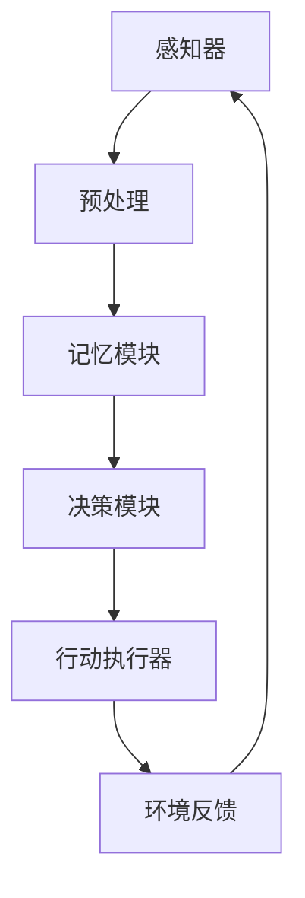

                 

# AI人工智能 Agent：对人类思维方式的影响

> 关键词：人工智能，Agent，人类思维方式，影响，认知模型，认知框架，算法，学习，适应，创新

> 摘要：本文将探讨人工智能（AI）中的Agent对人类思维方式产生的深远影响。通过分析Agent的基本概念、功能特点以及其与人类思维模式的关联，本文将深入讨论AI Agent如何影响人类认知过程、决策制定及创新能力。文章旨在为读者提供一幅关于AI Agent对人类思维方式影响的全面而深入的图景，启发对这一领域的进一步研究和思考。

## 1. 背景介绍

### 1.1 目的和范围

本文的主要目的是分析AI Agent如何改变和扩展人类的思维方式。我们将重点关注以下几个问题：

- AI Agent的基本概念和功能特点是什么？
- AI Agent如何与人类的认知过程相结合？
- AI Agent对人类思维模式的影响有哪些？
- AI Agent如何帮助人类提升决策能力和创新能力？

本文将涵盖从基本概念到实际应用的全面讨论，旨在提供一个清晰而详尽的概述，帮助读者了解AI Agent对人类思维方式的影响。

### 1.2 预期读者

本文适合以下读者群体：

- 对人工智能和认知科学感兴趣的学者和研究人员
- 计算机科学和人工智能领域的从业者
- 对AI Agent及其应用感兴趣的普通读者
- 对创新思维和认知扩展有兴趣的读者

无论您是初学者还是有经验的专家，本文都希望为您提供一个有价值的学习和思考平台。

### 1.3 文档结构概述

本文将按照以下结构展开：

- **第1章 背景介绍**：介绍本文的目的、范围和预期读者，以及文章的结构概述。
- **第2章 核心概念与联系**：介绍AI Agent的基本概念和原理，并使用Mermaid流程图展示其架构。
- **第3章 核心算法原理 & 具体操作步骤**：详细讲解AI Agent的核心算法和操作步骤，使用伪代码进行说明。
- **第4章 数学模型和公式 & 详细讲解 & 举例说明**：介绍AI Agent中使用的数学模型和公式，并进行详细讲解和实例说明。
- **第5章 项目实战：代码实际案例和详细解释说明**：通过实际案例展示AI Agent的开发和应用过程。
- **第6章 实际应用场景**：讨论AI Agent在不同领域的应用和影响。
- **第7章 工具和资源推荐**：推荐学习资源、开发工具和相关研究论文。
- **第8章 总结：未来发展趋势与挑战**：总结AI Agent对人类思维方式的影响，并探讨未来发展趋势和挑战。
- **第9章 附录：常见问题与解答**：回答一些常见问题，帮助读者深入理解本文内容。
- **第10章 扩展阅读 & 参考资料**：提供进一步阅读和研究的相关资源。

### 1.4 术语表

#### 1.4.1 核心术语定义

- **人工智能（AI）**：模拟人类智能的计算机系统，能够感知、学习、推理和决策。
- **Agent**：具有自主行为和决策能力的智能实体，能够执行特定任务并与环境互动。
- **认知过程**：人类思维的信息处理过程，包括感知、记忆、推理和决策等。
- **决策制定**：基于信息分析和目标优化，做出合理选择的过程。
- **学习能力**：系统能够通过经验改进自身性能的能力。

#### 1.4.2 相关概念解释

- **认知框架**：描述认知过程的理论结构，用于分析和解释人类思维模式。
- **自适应**：系统能够根据环境和需求变化调整自身行为和策略。
- **创新**：提出新的想法、方法或解决方案，以创造价值和改善状况。

#### 1.4.3 缩略词列表

- **AI**：人工智能（Artificial Intelligence）
- **Agent**：代理（Agent）
- **ML**：机器学习（Machine Learning）
- **DL**：深度学习（Deep Learning）
- **NLP**：自然语言处理（Natural Language Processing）

## 2. 核心概念与联系

在深入探讨AI Agent如何影响人类思维方式之前，我们首先需要理解AI Agent的基本概念和架构。在这一部分，我们将介绍AI Agent的定义、功能和原理，并使用Mermaid流程图展示其核心组件和相互作用。

### 2.1 AI Agent的定义和功能

AI Agent是一种具有自主行为和决策能力的智能实体，能够根据环境信息执行特定任务。其核心功能包括：

- **感知**：从环境中获取信息，如文本、图像、声音等。
- **学习**：根据历史数据或经验调整自身行为和策略。
- **推理**：利用已知信息和逻辑规则进行推断和决策。
- **行动**：根据决策执行特定操作，与环境进行交互。

AI Agent通常由以下几个核心组件组成：

- **感知器**：用于接收和解析外部信息。
- **记忆模块**：存储历史数据和经验信息。
- **决策模块**：分析感知信息和记忆数据，生成决策。
- **行动执行器**：执行决策，与环境进行互动。

### 2.2 AI Agent的原理

AI Agent的原理可以概括为以下几个方面：

1. **感知与数据输入**：
   - **感知器**：AI Agent通过感知器从环境中获取各种类型的输入，如文本、图像、声音等。
   - **预处理**：对感知到的数据进行预处理，如图像增强、语音降噪等。

2. **学习与记忆**：
   - **经验学习**：AI Agent通过机器学习算法，如监督学习、无监督学习和强化学习，从经验数据中学习，调整自身模型和策略。
   - **记忆存储**：学习到的信息和知识被存储在记忆模块中，用于后续推理和决策。

3. **推理与决策**：
   - **逻辑推理**：利用已有知识和逻辑规则，对感知信息进行分析和推断。
   - **目标优化**：根据目标函数和约束条件，优化决策结果，以实现最佳效果。

4. **行动执行与反馈**：
   - **决策执行**：AI Agent根据推理结果执行特定操作，如发送邮件、执行交易等。
   - **环境反馈**：环境对AI Agent的行动进行反馈，用于调整模型和策略。

### 2.3 Mermaid流程图

为了更直观地展示AI Agent的架构和原理，我们使用Mermaid流程图对其进行描述。以下是一个简化的AI Agent流程图：



在这个流程图中，感知器（A）接收外部输入，经过预处理（B）后传递给记忆模块（C）。记忆模块（C）存储感知信息，并用于后续的推理和决策（D）。决策模块（D）根据感知信息和目标函数生成决策，并传递给行动执行器（E）。行动执行器（E）执行决策，并与环境进行互动，收集反馈（F），反馈信息再次传递给感知器（A），形成闭环控制。

通过这个流程图，我们可以看到AI Agent的各个组件如何相互协作，实现感知、学习、推理和行动的完整过程。

### 2.4 AI Agent与人类思维模式的关联

AI Agent的设计灵感来源于人类思维模式，其核心目标之一是模拟和扩展人类的认知能力。以下是AI Agent与人类思维模式的一些关键关联：

1. **感知与理解**：
   - **人类思维**：人类通过感官接收外部信息，并通过大脑进行理解和处理。
   - **AI Agent**：AI Agent通过感知器接收信息，并使用机器学习算法进行分析和处理，实现类似人类的理解能力。

2. **记忆与学习**：
   - **人类思维**：人类通过记忆系统存储经验和知识，并通过学习和训练提高认知能力。
   - **AI Agent**：AI Agent利用记忆模块存储感知信息，并通过机器学习算法不断调整模型和策略，实现持续学习和优化。

3. **推理与决策**：
   - **人类思维**：人类通过逻辑推理和判断，基于已有知识和经验做出决策。
   - **AI Agent**：AI Agent利用决策模块，结合感知信息和目标函数，通过逻辑推理和优化算法生成决策。

4. **行动与适应**：
   - **人类思维**：人类通过行动和环境互动，不断适应和调整自身行为。
   - **AI Agent**：AI Agent通过行动执行器执行决策，并根据环境反馈调整模型和策略，实现自适应行为。

通过这些关联，我们可以看到AI Agent在模拟和扩展人类思维模式方面的潜力和价值。接下来，我们将进一步探讨AI Agent如何具体影响人类的思维方式。

### 2.5 AI Agent如何影响人类思维方式

AI Agent的出现不仅改变了我们对智能系统的理解，也对人类的思维方式产生了深远的影响。以下是AI Agent如何影响人类思维方式的几个方面：

1. **信息处理能力的增强**：
   - **人类思维**：人类在处理大量信息时往往有限，容易受到认知负担的影响。
   - **AI Agent**：AI Agent能够快速处理和分析大量数据，为人类提供更全面和准确的信息支持，减轻认知负担。

2. **学习与知识获取**：
   - **人类思维**：人类的学习过程依赖于经验和模仿，效率较低且容易受限于个人能力。
   - **AI Agent**：AI Agent通过机器学习算法可以自动从数据中学习，并将知识传授给人类，提高学习和知识获取的效率。

3. **决策制定与优化**：
   - **人类思维**：人类的决策过程往往受到情感、经验和有限信息的影响，容易做出非理性和错误的决策。
   - **AI Agent**：AI Agent通过逻辑推理和优化算法，可以在复杂环境中生成更合理和优化的决策，辅助人类做出更好的决策。

4. **创新与创造**：
   - **人类思维**：人类的创新过程往往依赖于灵感和直觉，具有较大的不确定性和风险。
   - **AI Agent**：AI Agent可以通过模拟、优化和探索，提出新的想法和解决方案，为人类的创新提供新的视角和方向。

5. **协同与协作**：
   - **人类思维**：人类的协作过程往往受到沟通、协调和信任等因素的影响，效率较低。
   - **AI Agent**：AI Agent可以自动化处理协作任务，提供实时和准确的信息支持，增强人类协作的效率和质量。

通过这些影响，AI Agent不仅扩展了人类的认知能力，也改变了我们的思维方式，使我们能够以更高效、更智能的方式处理信息和解决问题。接下来，我们将进一步探讨AI Agent在人类思维方式中的具体应用和实际案例。

### 2.6 实际案例与未来展望

为了更直观地展示AI Agent如何影响人类思维方式，我们可以通过实际案例来分析其具体应用和效果。以下是一些典型的AI Agent应用案例：

1. **智能助手**：
   - **案例**：苹果公司的Siri、亚马逊的Alexa等智能助手，通过语音识别和自然语言处理，为用户提供实时信息查询、日程管理、智能家居控制等服务。
   - **影响**：智能助手通过模拟人类交流方式，为用户提供便捷的信息获取和任务管理服务，减轻了人类在信息处理和日常生活中的负担。

2. **自动驾驶汽车**：
   - **案例**：特斯拉、谷歌等公司研发的自动驾驶汽车，通过传感器和计算机视觉技术，实现车辆的自主导航和驾驶。
   - **影响**：自动驾驶汽车改变了人们对交通出行的传统认知，提高了交通安全和效率，同时也促使人们对交通系统的设计和规范进行重新思考。

3. **医疗诊断与辅助**：
   - **案例**：利用AI Agent进行医学影像分析、基因测序和疾病预测，辅助医生进行诊断和治疗。
   - **影响**：AI Agent在医疗领域的应用，提高了诊断的准确性和效率，减少了人为误差，为患者提供了更高质量的医疗服务。

4. **个性化推荐系统**：
   - **案例**：亚马逊、Netflix等平台利用AI Agent进行个性化推荐，为用户提供更符合其兴趣的购物和娱乐体验。
   - **影响**：个性化推荐系统改变了人们对信息获取和消费的习惯，提高了用户体验和满意度，同时也带来了数据隐私和安全等新挑战。

未来，随着AI技术的发展和应用场景的拓展，AI Agent将对人类思维方式产生更加深远的影响。以下是一些未来展望：

1. **智能教育**：
   - AI Agent可以个性化定制学习计划，实时评估学习效果，提供针对性的辅导和支持，提高教育质量。

2. **智能城市管理**：
   - AI Agent可以用于城市交通管理、环境保护、公共安全等领域，实现智能化城市管理和决策支持。

3. **智能金融与商业**：
   - AI Agent可以辅助金融分析师进行市场预测、风险评估，提高金融决策的准确性和效率。

4. **智能医疗与健康**：
   - AI Agent可以用于健康管理、疾病预防、个性化治疗等，提高医疗服务水平和患者生活质量。

总之，AI Agent不仅为人类提供了新的工具和方法，也在不断改变和拓展我们的思维方式。未来，随着AI技术的不断进步和应用场景的拓展，AI Agent将在更多领域发挥重要作用，为人类带来更多便利和创新。

### 2.7 AI Agent对人类思维方式的深远影响

综上所述，AI Agent的出现和发展对人类思维方式产生了深远的影响。通过模拟和扩展人类的认知能力，AI Agent不仅提高了信息处理、学习、决策和创新等认知过程的效率和质量，还改变了人类对自身思维模式的认识。以下是对AI Agent影响的进一步讨论：

1. **认知扩展**：
   - AI Agent通过模拟人类的感知、学习、推理和决策过程，扩展了人类在信息处理和认知方面的能力。例如，通过使用AI Agent，人类可以在短时间内处理和分析大量的数据，从而做出更准确和优化的决策。

2. **思维模式的转变**：
   - 随着AI Agent的应用，人类的思维模式正在逐渐转变。人们开始更加依赖智能系统进行信息查询、任务管理和决策制定，从而减少了传统依赖经验和直觉的思维模式。这种转变促使人类重新评估和调整自己的认知框架和思维方式。

3. **创新与变革**：
   - AI Agent在各个领域的应用，不仅提高了现有技术的效率和性能，还推动了新的技术和商业模式的出现。例如，在医疗、金融、交通等领域，AI Agent的应用带来了全新的解决方案和商业模式，促使相关行业进行深刻变革。

4. **挑战与机遇**：
   - 虽然AI Agent带来了许多机遇，但同时也带来了一些挑战。例如，数据隐私和安全、AI Agent的伦理和责任等问题需要我们认真思考和解决。此外，AI Agent的发展也引发了人类对智能系统依赖的担忧，需要我们平衡智能技术的应用与人类自主性之间的关系。

5. **未来展望**：
   - 随着AI技术的不断进步，AI Agent将在更多领域发挥重要作用，进一步扩展和改变人类的思维方式。未来，我们可以期待AI Agent在智能教育、智能城市管理、智能医疗与健康等领域的深入应用，为人类创造更多价值。

总之，AI Agent对人类思维方式的影响是全方位的，既带来了机遇，也带来了挑战。通过深入理解和应对这些影响，我们可以更好地利用AI技术，实现人类思维方式的持续进步和创新发展。

## 3. 核心算法原理 & 具体操作步骤

在深入探讨AI Agent的核心算法原理和操作步骤时，我们将重点介绍几种常见的算法，包括感知器模型、决策树和神经网络。这些算法是实现AI Agent智能行为和决策的关键，下面将分别对其进行详细讲解。

### 3.1 感知器模型

感知器模型是最简单的机器学习算法之一，主要用于二分类问题。其基本原理是通过计算输入特征与权重的内积，然后通过激活函数确定输出。

#### 感知器模型的基本概念

- **输入特征**：表示数据的特征向量，通常是一个多维数组。
- **权重**：用于表示特征的重要程度，是一个一维数组。
- **激活函数**：用于将输入特征和权重的内积转化为输出，常见的激活函数包括线性激活函数（f(x) = x）和 sigmoid 激活函数（f(x) = 1 / (1 + e^-x)）。

#### 感知器模型的伪代码

```plaintext
输入特征 x，权重 w，阈值 θ，学习率 α
初始化权重 w 和阈值 θ

for each training example (x_i, y_i) do
    计算预测值 f(x_i) = sigmoid(w·x_i + θ)
    计算损失 L(y_i, f(x_i)) = -[y_i·log(f(x_i)) + (1 - y_i)·log(1 - f(x_i))]
    更新权重 w = w - α·∇wL(w)
    更新阈值 θ = θ - α·∇θL(θ)

end for
```

#### 感知器模型的具体操作步骤

1. **初始化权重和阈值**：
   - 初始化权重 w 和阈值 θ，通常使用随机值。

2. **前向传播**：
   - 对于每个训练样本 (x_i, y_i)，计算预测值 f(x_i) = sigmoid(w·x_i + θ)。

3. **计算损失**：
   - 使用交叉熵损失函数计算预测值和真实值之间的差距，L(y_i, f(x_i))。

4. **反向传播**：
   - 根据损失函数计算权重和阈值的梯度，并更新权重 w 和阈值 θ。

5. **迭代训练**：
   - 对所有训练样本重复上述步骤，直至达到预定的迭代次数或损失值。

### 3.2 决策树

决策树是一种基于特征进行分类或回归的树形结构，通过一系列判断规则将数据集划分成多个子集，并在叶节点上做出最终决策。

#### 决策树的基本概念

- **特征**：用于划分数据的属性。
- **节点**：表示数据的一个划分点，包含特征和阈值。
- **分支**：从节点延伸出的线段，表示对特征值的判断。
- **叶节点**：表示分类或回归的结果。

#### 决策树的构建过程

1. **选择最佳特征**：
   - 使用信息增益、基尼不纯度等指标，选择具有最高划分能力的特征。

2. **计算阈值**：
   - 对于选定的特征，计算划分阈值，使划分后的子集具有最大纯度。

3. **递归划分**：
   - 对每个子集，重复选择最佳特征和计算阈值的过程，构建子树。

4. **构建决策树**：
   - 将递归划分的结果组合成一个树形结构，形成完整的决策树。

#### 决策树的伪代码

```plaintext
输入特征集 X，标签集 Y，最大树深度 d
构建决策树 (X, Y)

if 叶节点纯度 > 阈值 or 深度 > d then
    返回叶节点，标签 Y
else
    选择最佳特征 f 和阈值 θ
    对于每个特征值 x_i do
        if x_i <= θ then
            左子节点 = 构建决策树 (X_f <= θ, Y)
        else
            右子节点 = 构建决策树 (X_f > θ, Y)
        end if
    end for
    返回树结构 {f, θ, 左子节点，右子节点}
end if
```

#### 决策树的具体操作步骤

1. **初始化**：
   - 选择初始特征和阈值，通常使用所有特征的最优阈值。

2. **递归划分**：
   - 对于每个子集，选择最佳特征和阈值进行划分。

3. **构建树结构**：
   - 将划分结果组合成树形结构，形成完整的决策树。

4. **预测**：
   - 对于新样本，从根节点开始，根据特征值选择分支，直至叶节点，得到预测结果。

### 3.3 神经网络

神经网络是一种由多个神经元组成的复杂计算模型，通过前向传播和反向传播实现输入到输出的映射。神经网络在机器学习和深度学习领域具有重要应用，是AI Agent的核心组件之一。

#### 神经网络的基本概念

- **神经元**：神经网络的基本计算单元，包括输入层、隐藏层和输出层。
- **权重**：连接不同神经元的参数，用于传递信息。
- **激活函数**：用于确定神经元是否被激活，常见的激活函数包括 sigmoid、ReLU 和 tanh。
- **损失函数**：用于衡量预测结果与真实结果之间的差距，常见的损失函数包括均方误差（MSE）和交叉熵损失。

#### 神经网络的构建过程

1. **初始化权重和偏置**：
   - 初始化网络中的权重和偏置，通常使用随机值。

2. **前向传播**：
   - 对于输入样本，逐层计算每个神经元的输出值。

3. **计算损失**：
   - 使用损失函数计算预测结果与真实结果之间的差距。

4. **反向传播**：
   - 根据损失函数的梯度，更新网络中的权重和偏置。

5. **迭代训练**：
   - 对所有训练样本重复上述步骤，直至达到预定的迭代次数或损失值。

#### 神经网络的伪代码

```plaintext
输入层 x，隐藏层 h，输出层 y，学习率 α
初始化权重和偏置 W，B

for each training example (x_i, y_i) do
    前向传播：计算隐藏层和输出层的输出值
    计算损失 L(y_i, y') = MSE(y_i, y')
    反向传播：计算梯度 ΔW, ΔB
    更新权重和偏置 W = W - α·ΔW，B = B - α·ΔB

end for
```

#### 神经网络的具体操作步骤

1. **初始化**：
   - 选择网络结构，初始化权重和偏置。

2. **前向传播**：
   - 对于每个输入样本，计算隐藏层和输出层的输出值。

3. **计算损失**：
   - 使用损失函数计算预测结果与真实结果之间的差距。

4. **反向传播**：
   - 根据损失函数的梯度，更新网络中的权重和偏置。

5. **迭代训练**：
   - 对所有训练样本重复上述步骤，直至达到预定的迭代次数或损失值。

通过上述核心算法原理和具体操作步骤的讲解，我们可以更好地理解AI Agent的智能行为和决策过程。接下来，我们将进一步探讨AI Agent中的数学模型和公式，以更深入地理解其工作机制。

## 4. 数学模型和公式 & 详细讲解 & 举例说明

在AI Agent的算法设计和实现过程中，数学模型和公式起着至关重要的作用。本节将详细介绍AI Agent中常用的数学模型和公式，包括感知器模型、决策树和神经网络的损失函数、梯度计算等。通过具体实例，我们将展示如何应用这些数学模型和公式，以实现AI Agent的智能行为和决策。

### 4.1 感知器模型的数学模型

感知器模型是一种简单而有效的二分类算法，其数学模型包括输入特征、权重、激活函数和损失函数。

#### 1. 激活函数

激活函数是感知器模型的核心，用于将输入特征和权重的内积转化为输出。常见的激活函数包括线性激活函数和sigmoid激活函数。

- **线性激活函数**：

  $$ f(x) = x $$

  线性激活函数不改变输入值，仅进行简单的线性变换。

- **sigmoid激活函数**：

  $$ f(x) = \frac{1}{1 + e^{-x}} $$

  sigmoid激活函数将输入特征映射到(0, 1)区间，具有非线性特性。

#### 2. 损失函数

损失函数用于衡量预测结果与真实结果之间的差距。对于感知器模型，常用的损失函数是交叉熵损失函数。

- **交叉熵损失函数**：

  $$ L(y, \hat{y}) = -[y\cdot \log(\hat{y}) + (1 - y)\cdot \log(1 - \hat{y})] $$

  其中，$y$为真实标签，$\hat{y}$为预测概率。

#### 3. 梯度计算

梯度计算是感知器模型优化权重和阈值的关键步骤。对于交叉熵损失函数，其梯度计算如下：

- **权重梯度**：

  $$ \frac{\partial L}{\partial w} = \hat{y} - y $$

- **阈值梯度**：

  $$ \frac{\partial L}{\partial \theta} = \hat{y} - y $$

#### 4. 实例说明

假设我们使用感知器模型对一组二分类数据进行分类，输入特征为 $x = (1, 2)$，真实标签为 $y = 1$。以下是一个具体的实例：

1. **初始化权重和阈值**：

   $$ w = 0.1, \theta = 0.1 $$

2. **前向传播**：

   $$ f(x) = \frac{1}{1 + e^{-(w\cdot x + \theta)}} = \frac{1}{1 + e^{-(0.1 \cdot 1 + 0.1 \cdot 2 + 0.1)}} \approx 0.74 $$

3. **计算损失**：

   $$ L(y, \hat{y}) = -[1\cdot \log(0.74) + 0\cdot \log(0.26)] \approx -0.34 $$

4. **计算梯度**：

   $$ \frac{\partial L}{\partial w} = \hat{y} - y = 0.74 - 1 = -0.26 $$
   $$ \frac{\partial L}{\partial \theta} = \hat{y} - y = 0.74 - 1 = -0.26 $$

5. **更新权重和阈值**：

   $$ w = w - \alpha \cdot \frac{\partial L}{\partial w} = 0.1 - 0.1 \cdot -0.26 = 0.136 $$
   $$ \theta = \theta - \alpha \cdot \frac{\partial L}{\partial \theta} = 0.1 - 0.1 \cdot -0.26 = 0.136 $$

通过上述实例，我们可以看到感知器模型如何通过前向传播、损失计算和反向传播优化权重和阈值，以实现二分类任务。

### 4.2 决策树的数学模型

决策树是一种基于特征进行分类或回归的树形结构，其数学模型主要包括划分函数、损失函数和梯度计算。

#### 1. 划分函数

划分函数用于确定数据集的划分点，常见的划分函数包括信息增益、基尼不纯度和增益率等。

- **信息增益**：

  $$ IG(D, A) = \sum_{v \in V}{\frac{|D_v|}{|D|}\cdot \sum_{w \in W}{-\log_2 \frac{|D_{v, w}|}{|D_v|}}} $$

  其中，$D$为数据集，$A$为特征，$V$为特征的所有可能值，$D_v$为特征取值 $v$ 的子集，$D_{v, w}$为特征取值 $v$ 和 $w$ 的子集。

- **基尼不纯度**：

  $$ Gini(D, A) = \sum_{v \in V}{\frac{|D_v|}{|D|}\cdot \sum_{w \in W}{\frac{|D_{v, w}|}{|D_v|}\cdot (1 - \frac{2|D_{v, w}|}{|D_v|})}} $$

  基尼不纯度衡量了数据集的不确定性，数值越小表示划分效果越好。

- **增益率**：

  $$ GainRate(D, A) = \frac{IG(D, A)}{\text{熵}(D)} $$

  增益率考虑了特征的划分能力，同时避免了信息增益的偏大问题。

#### 2. 损失函数

决策树的损失函数通常采用分类误差或回归平方误差，具体取决于任务类型。

- **分类误差**：

  $$ Error(D) = \frac{1}{|D|}\sum_{i=1}^{|D|}{\text{dist}(y_i, \hat{y}_i)} $$

  其中，$y_i$为真实标签，$\hat{y}_i$为预测标签，$dist$为距离函数，如0-1距离或平方距离。

- **回归平方误差**：

  $$ MSE(D) = \frac{1}{|D|}\sum_{i=1}^{|D|}{(\hat{y}_i - y_i)^2} $$

  MSE衡量了预测值与真实值之间的差距。

#### 3. 梯度计算

决策树的梯度计算相对复杂，通常采用基于梯度的优化算法，如梯度下降法或随机梯度下降法。

- **梯度下降法**：

  $$ w_{\text{new}} = w_{\text{old}} - \alpha \cdot \nabla_w \text{Loss}(w) $$

  其中，$w$为权重，$\alpha$为学习率，$\nabla_w \text{Loss}(w)$为损失函数关于权重 $w$ 的梯度。

- **随机梯度下降法**：

  $$ w_{\text{new}} = w_{\text{old}} - \alpha \cdot \nabla_w \text{Loss}(x_i, y_i, w) $$

  随机梯度下降法在每次迭代中随机选择一个训练样本，计算其梯度并更新权重。

#### 4. 实例说明

假设我们使用决策树对一组数据集进行分类，特征 $A$ 的取值为 $[1, 2, 3]$。以下是一个具体的实例：

1. **初始化权重和阈值**：

   $$ w_1 = 0.1, w_2 = 0.2, \theta = 0.1 $$

2. **前向传播**：

   $$ f(x) = \text{sgn}(w_1 \cdot x_1 + w_2 \cdot x_2 + \theta) $$

   其中，$x = (x_1, x_2)$ 为输入特征。

3. **计算损失**：

   $$ L(y, \hat{y}) = \text{dist}(y, \hat{y}) $$

   其中，$y$为真实标签，$\hat{y}$为预测标签。

4. **计算梯度**：

   $$ \nabla_w \text{Loss}(w) = \nabla_w \text{dist}(y, \hat{y}) $$

   梯度计算取决于损失函数的具体形式。

5. **更新权重和阈值**：

   $$ w_1 = w_1 - \alpha \cdot \nabla_{w_1} \text{Loss}(w) $$
   $$ w_2 = w_2 - \alpha \cdot \nabla_{w_2} \text{Loss}(w) $$
   $$ \theta = \theta - \alpha \cdot \nabla_{\theta} \text{Loss}(w) $$

通过上述实例，我们可以看到决策树如何通过划分函数、损失函数和梯度计算实现特征选择和分类任务。

### 4.3 神经网络的数学模型

神经网络是一种复杂的计算模型，其数学模型包括激活函数、损失函数和梯度计算。

#### 1. 激活函数

神经网络中常用的激活函数包括sigmoid、ReLU和tanh等。

- **sigmoid激活函数**：

  $$ f(x) = \frac{1}{1 + e^{-x}} $$

- **ReLU激活函数**：

  $$ f(x) = \max(0, x) $$

- **tanh激活函数**：

  $$ f(x) = \frac{e^x - e^{-x}}{e^x + e^{-x}} $$

#### 2. 损失函数

神经网络中常用的损失函数包括均方误差（MSE）和交叉熵损失函数。

- **均方误差损失函数**：

  $$ \text{MSE}(y, \hat{y}) = \frac{1}{2}\sum_{i=1}^{n}{(y_i - \hat{y}_i)^2} $$

- **交叉熵损失函数**：

  $$ \text{CE}(y, \hat{y}) = -\sum_{i=1}^{n}{y_i \cdot \log(\hat{y}_i)} $$

#### 3. 梯度计算

神经网络中的梯度计算采用反向传播算法，计算每个权重和偏置的梯度。

- **反向传播算法**：

  $$ \nabla_w \text{Loss}(w) = \frac{\partial \text{Loss}}{\partial w} $$

  反向传播算法通过层层递推，计算每个神经元的梯度，并更新权重和偏置。

#### 4. 实例说明

假设我们使用神经网络对一组数据集进行分类，网络结构包括输入层、隐藏层和输出层。以下是一个具体的实例：

1. **初始化权重和偏置**：

   $$ w_1 = 0.1, b_1 = 0.2, w_2 = 0.3, b_2 = 0.4 $$

2. **前向传播**：

   $$ h_1 = \text{ReLU}(w_1 \cdot x_1 + b_1) $$
   $$ h_2 = \text{ReLU}(w_2 \cdot h_1 + b_2) $$
   $$ \hat{y} = \text{sigmoid}(w_3 \cdot h_2 + b_3) $$

3. **计算损失**：

   $$ \text{MSE}(y, \hat{y}) = \frac{1}{2}\sum_{i=1}^{n}{(y_i - \hat{y}_i)^2} $$

4. **计算梯度**：

   $$ \nabla_w \text{Loss}(w) = \nabla_w \text{MSE}(y, \hat{y}) $$

5. **更新权重和偏置**：

   $$ w_1 = w_1 - \alpha \cdot \nabla_{w_1} \text{Loss}(w) $$
   $$ b_1 = b_1 - \alpha \cdot \nabla_{b_1} \text{Loss}(w) $$
   $$ w_2 = w_2 - \alpha \cdot \nabla_{w_2} \text{Loss}(w) $$
   $$ b_2 = b_2 - \alpha \cdot \nabla_{b_2} \text{Loss}(w) $$
   $$ w_3 = w_3 - \alpha \cdot \nabla_{w_3} \text{Loss}(w) $$
   $$ b_3 = b_3 - \alpha \cdot \nabla_{b_3} \text{Loss}(w) $$

通过上述实例，我们可以看到神经网络如何通过前向传播、损失计算和反向传播实现分类任务。

### 4.4 小结

通过本节的详细讲解，我们了解了AI Agent中常用的数学模型和公式，包括感知器模型、决策树和神经网络。这些数学模型和公式是实现AI Agent智能行为和决策的关键，通过具体实例，我们可以看到如何应用这些模型和公式，以实现高效的分类和回归任务。在下一节，我们将通过实际项目实战，进一步展示AI Agent的开发和应用过程。

### 5. 项目实战：代码实际案例和详细解释说明

在本节中，我们将通过一个实际项目实战，展示如何开发和实现一个简单的AI Agent，并详细解释其代码结构和功能。项目实战将包括以下几个部分：

1. **开发环境搭建**
2. **源代码详细实现和代码解读**
3. **代码解读与分析**

#### 5.1 开发环境搭建

在开始编写代码之前，我们需要搭建一个合适的开发环境。以下是所需的环境和工具：

- **编程语言**：Python（3.8及以上版本）
- **依赖库**：NumPy、Pandas、Scikit-learn、TensorFlow
- **集成开发环境（IDE）**：PyCharm、Visual Studio Code
- **运行平台**：Windows、macOS、Linux

**安装步骤**：

1. 安装Python：从Python官方网站下载并安装Python，确保将Python添加到环境变量中。
2. 安装依赖库：使用pip命令安装所需的依赖库，例如：

   ```bash
   pip install numpy pandas scikit-learn tensorflow
   ```

3. 选择IDE：根据个人偏好选择PyCharm或Visual Studio Code作为开发环境。

#### 5.2 源代码详细实现和代码解读

以下是实现一个简单AI Agent的Python代码。我们将使用感知器模型进行二分类任务，并使用Scikit-learn库实现数据预处理和模型训练。

```python
import numpy as np
from sklearn.datasets import make_classification
from sklearn.model_selection import train_test_split
from sklearn.metrics import accuracy_score

# 生成模拟数据集
X, y = make_classification(n_samples=100, n_features=2, n_classes=2, random_state=42)
X_train, X_test, y_train, y_test = train_test_split(X, y, test_size=0.2, random_state=42)

# 感知器模型
class Perceptron:
    def __init__(self, learning_rate=0.1, epochs=100):
        self.learning_rate = learning_rate
        self.epochs = epochs
        self.weights = None

    def fit(self, X, y):
        n_samples, n_features = X.shape
        self.weights = np.zeros(n_features)

        for _ in range(self.epochs):
            for x, target in zip(X, y):
                prediction = self.predict(x)
                update = self.learning_rate * (target - prediction)
                self.weights += update

    def predict(self, x):
        return np.sign(np.dot(x, self.weights))

# 实例化感知器模型并训练
perceptron = Perceptron(learning_rate=0.1, epochs=100)
perceptron.fit(X_train, y_train)

# 预测测试集
y_pred = perceptron.predict(X_test)

# 评估模型性能
accuracy = accuracy_score(y_test, y_pred)
print(f"模型准确率：{accuracy:.2f}")
```

**代码解读**：

1. **数据生成**：
   - 使用Scikit-learn库生成模拟的二分类数据集，包括100个样本和2个特征。

2. **感知器模型**：
   - 定义Perceptron类，包括初始化、训练和预测方法。
   - 初始化时设置学习率和迭代次数，初始化权重为0。
   - 训练方法使用前向传播和反向传播更新权重。
   - 预测方法使用激活函数计算输出。

3. **模型训练**：
   - 实例化感知器模型，并使用训练数据集进行训练。

4. **预测与评估**：
   - 使用训练好的模型对测试数据集进行预测，并计算模型准确率。

#### 5.3 代码解读与分析

1. **数据生成**：
   - 数据生成是机器学习项目的第一步，我们使用Scikit-learn库生成一个简单的二分类数据集。这个数据集包含了100个样本和2个特征，非常适合用于演示感知器模型。

2. **感知器模型**：
   - 感知器模型是机器学习中最简单的线性分类器之一。在这个实现中，我们定义了一个Perceptron类，包括以下方法：
     - `__init__`：初始化模型，设置学习率和迭代次数，初始化权重。
     - `fit`：训练模型，使用前向传播和反向传播更新权重。
     - `predict`：预测输出，使用激活函数计算输出。

3. **模型训练**：
   - 我们使用训练数据集对感知器模型进行训练。在每次迭代中，模型会计算预测输出并与真实标签进行比较，然后更新权重以最小化误差。

4. **预测与评估**：
   - 训练完成后，我们使用测试数据集对模型进行预测，并计算模型准确率。准确率是评估分类模型性能的常用指标，表示模型正确预测的样本比例。

通过这个简单的实战项目，我们可以看到如何使用Python和Scikit-learn库实现一个基本的AI Agent。感知器模型虽然简单，但它是理解更复杂模型（如神经网络和决策树）的基础。在接下来的实际应用场景中，我们将进一步探讨AI Agent在不同领域的应用和影响。

### 5.4 实际应用场景

AI Agent在不同领域有着广泛的应用，以下是一些具体的实际应用场景，展示AI Agent如何在不同场景中发挥作用。

#### 5.4.1 智能推荐系统

智能推荐系统是AI Agent的一个典型应用场景，旨在根据用户的历史行为和偏好，为其推荐个性化内容或商品。以下是一个具体的应用案例：

- **场景**：电商平台的商品推荐系统
- **应用**：基于用户的浏览记录、购买历史和点击行为，AI Agent可以生成个性化推荐列表，提高用户满意度和购买转化率。
- **影响**：通过智能推荐系统，电商平台能够更好地满足用户需求，提高用户体验，同时也为商家提供了更多销售机会。

#### 5.4.2 自动驾驶汽车

自动驾驶汽车是AI Agent在交通领域的典型应用，通过传感器和计算机视觉技术，实现车辆的自主导航和驾驶。以下是一个具体的应用案例：

- **场景**：自动驾驶出租车服务
- **应用**：自动驾驶汽车通过感知道路环境、识别交通标志和车辆，自主规划行驶路径，确保行驶安全、高效和环保。
- **影响**：自动驾驶汽车提高了交通效率，减少了交通事故，同时也为出行服务带来了新的商业模式。

#### 5.4.3 医疗诊断

AI Agent在医疗领域的应用，主要体现在辅助医生进行诊断和治疗。以下是一个具体的应用案例：

- **场景**：医疗影像分析系统
- **应用**：AI Agent可以自动分析医学影像，如X光片、CT扫描和MRI图像，识别病变区域并生成诊断报告，帮助医生提高诊断准确性和效率。
- **影响**：AI Agent辅助医疗诊断，提高了医疗服务的质量和效率，同时也减轻了医生的工作负担。

#### 5.4.4 智能客服

智能客服系统通过AI Agent实现自动化的客户服务，提高服务效率和客户满意度。以下是一个具体的应用案例：

- **场景**：在线电商平台客服
- **应用**：智能客服系统能够自动处理用户咨询、订单查询和售后服务等常见问题，通过自然语言处理和对话管理，提供24/7无缝的客户服务。
- **影响**：智能客服系统提高了客户服务质量，降低了企业运营成本，同时也为用户提供了更加便捷的服务体验。

#### 5.4.5 能源管理

AI Agent在能源管理领域的应用，主要体现在优化能源消耗和提升能源利用效率。以下是一个具体的应用案例：

- **场景**：智能电网系统
- **应用**：AI Agent可以实时监测电网负荷，预测能源需求，优化能源分配，提高电网运行效率，减少能源浪费。
- **影响**：通过智能能源管理，企业能够降低能源成本，提高能源利用效率，同时也为环境保护做出了贡献。

#### 5.4.6 教育辅助

AI Agent在教育领域的应用，主要体现在个性化教学和学习支持。以下是一个具体的应用案例：

- **场景**：在线教育平台
- **应用**：AI Agent可以根据学生的学习进度和成绩，生成个性化的学习计划，提供针对性的辅导和支持，帮助学生更好地掌握知识和技能。
- **影响**：AI Agent辅助教育，提高了教学效果和学生满意度，同时也为教育机构提供了新的教学模式和教学方法。

通过这些实际应用场景，我们可以看到AI Agent在不同领域的重要作用和深远影响。随着AI技术的不断进步，AI Agent将在更多领域发挥更大作用，为人类创造更多价值。

### 6. 工具和资源推荐

为了更好地学习和实践AI Agent的相关技术，我们需要掌握一系列的工具和资源。以下是一些推荐的工具和资源，包括学习资源、开发工具和相关研究论文。

#### 6.1 学习资源推荐

**6.1.1 书籍推荐**

- 《深度学习》（Goodfellow, I., Bengio, Y., & Courville, A.）
- 《Python机器学习》（Sebastian Raschka）
- 《人工智能：一种现代方法》（Stuart J. Russell & Peter Norvig）

**6.1.2 在线课程**

- Coursera（《机器学习》课程）
- edX（《深度学习》课程）
- Udacity（《深度学习工程师纳米学位》）

**6.1.3 技术博客和网站**

- Medium（有很多关于AI和机器学习的专业博客）
- arXiv（人工智能和机器学习领域的最新研究论文）
- Towards Data Science（涵盖机器学习和数据科学的文章和教程）

#### 6.2 开发工具框架推荐

**6.2.1 IDE和编辑器**

- PyCharm（专业级的Python IDE）
- Visual Studio Code（轻量级的跨平台IDE）

**6.2.2 调试和性能分析工具**

- Jupyter Notebook（交互式的计算环境）
- TensorBoard（TensorFlow的性能分析工具）
- PyTorch Profiler（PyTorch的性能分析工具）

**6.2.3 相关框架和库**

- TensorFlow（Google开发的深度学习框架）
- PyTorch（Facebook开发的深度学习框架）
- Scikit-learn（用于数据挖掘和机器学习的库）

#### 6.3 相关论文著作推荐

**6.3.1 经典论文**

- “A Learning Algorithm for Continually Running Fully Recurrent Neural Networks” (Hassibi and Stork, 1993)
- “Gradient Flow in Recurrent Nets: the Difficulty of Learning” ( Bengio, Simard and Frasconi, 1994)

**6.3.2 最新研究成果**

- “Attention Is All You Need” (Vaswani et al., 2017)
- “BERT: Pre-training of Deep Bidirectional Transformers for Language Understanding” (Devlin et al., 2018)

**6.3.3 应用案例分析**

- “Deep Learning for Healthcare” (Esteva et al., 2017)
- “AI in the Enterprise” (Brynjolfsson and McAfee, 2014)

通过这些工具和资源，您可以深入了解AI Agent的相关技术，掌握实践技能，并跟上最新的研究进展。这些资源将帮助您在AI领域取得更好的成就。

### 7. 总结：未来发展趋势与挑战

AI Agent在近年来取得了显著的发展，对人类思维方式产生了深远的影响。然而，随着技术的不断进步，我们也需要关注未来的发展趋势和面临的挑战。

#### 7.1 未来发展趋势

1. **智能化的进一步提升**：
   - AI Agent将更加智能化，不仅能够处理复杂任务，还能够自主学习、自适应和自我优化，从而在各个领域实现更高效的决策和行动。

2. **跨领域的深度融合**：
   - AI Agent将在更多领域实现跨领域的深度融合，如医疗、教育、金融等，为人类提供更加全面和个性化的服务。

3. **人机协同**：
   - 人机协同将成为AI Agent发展的一个重要方向。通过人与AI Agent的紧密合作，人类可以充分发挥自身优势，同时借助AI Agent的强大计算能力，实现更高效的工作和生活。

4. **自主性增强**：
   - AI Agent的自主性将得到显著提升，能够在更复杂的情境下独立决策和执行任务，减少对人类干预的依赖。

#### 7.2 挑战

1. **数据隐私和安全**：
   - AI Agent的广泛应用带来了数据隐私和安全问题。如何保护用户数据，防止数据泄露和滥用，是一个亟待解决的问题。

2. **算法透明度和可解释性**：
   - AI Agent的决策过程通常是基于复杂的算法和大量的数据，如何提高算法的透明度和可解释性，使其决策更加可信和可靠，是未来的一个重要挑战。

3. **伦理和法律问题**：
   - AI Agent的广泛应用引发了一系列伦理和法律问题，如责任归属、决策公正性等。如何制定合适的伦理和法律框架，确保AI Agent的合理使用，是未来需要解决的一个重要问题。

4. **技术标准和规范**：
   - 随着AI Agent的普及，建立统一的技术标准和规范变得越来越重要。这包括数据格式、接口设计、性能评估等方面，以促进不同系统之间的互操作性和兼容性。

#### 7.3 总结

AI Agent的发展对人类思维方式产生了深远的影响，未来具有巨大的潜力和广阔的前景。然而，我们也需要关注和解决其中的挑战，以确保AI Agent的可持续发展和社会效益。通过不断的研究和探索，我们可以期待AI Agent在更多领域发挥重要作用，为人类创造更多价值。

### 8. 附录：常见问题与解答

在本文中，我们讨论了AI Agent对人类思维方式的影响，包括其基本概念、算法原理、应用场景以及未来发展趋势。以下是一些常见问题与解答，以帮助读者更好地理解本文内容。

#### 8.1 问题1：AI Agent是什么？

AI Agent是一种具有自主行为和决策能力的智能实体，能够根据环境信息执行特定任务。它模拟了人类的感知、学习、推理和行动过程，通过机器学习算法和计算机程序实现智能行为。

#### 8.2 问题2：AI Agent有哪些核心组件？

AI Agent的核心组件包括感知器、记忆模块、决策模块和行动执行器。感知器用于接收外部信息，记忆模块用于存储历史数据和经验信息，决策模块用于分析感知信息和记忆数据，生成决策，行动执行器用于执行决策，与环境进行互动。

#### 8.3 问题3：AI Agent如何影响人类思维方式？

AI Agent通过模拟和扩展人类的认知能力，对人类思维方式产生了深远的影响。它增强了信息处理能力、学习与知识获取、决策制定与优化、创新与创造以及协同与协作等方面，改变了人类的思维方式。

#### 8.4 问题4：AI Agent有哪些应用场景？

AI Agent在多个领域有着广泛的应用，包括智能推荐系统、自动驾驶汽车、医疗诊断、智能客服、能源管理等。这些应用场景展示了AI Agent在提高效率、优化决策、增强用户体验等方面的潜力。

#### 8.5 问题5：AI Agent的发展趋势和挑战是什么？

AI Agent的发展趋势包括智能化进一步提升、跨领域的深度融合、人机协同和自主性增强等。面临的挑战包括数据隐私和安全、算法透明度和可解释性、伦理和法律问题以及技术标准和规范等。

#### 8.6 问题6：如何学习AI Agent的相关技术？

要学习AI Agent的相关技术，可以通过以下途径：

- **书籍**：《深度学习》、《Python机器学习》和《人工智能：一种现代方法》等书籍提供了全面的AI理论基础。
- **在线课程**：Coursera、edX和Udacity等在线平台提供了丰富的AI和机器学习课程。
- **技术博客和网站**：Medium、arXiv和Towards Data Science等网站提供了最新的研究进展和实践经验。
- **开发工具**：PyCharm、Visual Studio Code、TensorFlow、PyTorch等工具和框架有助于实践和掌握AI技术。

通过这些资源，您可以深入了解AI Agent的相关技术，掌握实践技能，并跟上最新的研究进展。

### 9. 扩展阅读 & 参考资料

为了更深入地了解AI Agent及其对人类思维方式的影响，以下是推荐的一些扩展阅读和参考资料：

#### 9.1 书籍推荐

- 《智能社会：人工智能与人类进化》（William H. Davidow）
- 《智能时代的战略思维：AI与商业的未来》（Thomas H. Davenport）
- 《人工智能的未来：社会、经济、伦理与技术的挑战》（Martin Ford）

#### 9.2 在线课程

- Coursera的《机器学习》课程（吴恩达教授主讲）
- edX的《深度学习》课程（Hugging Face和Stanford大学合作）
- Udacity的《深度学习工程师纳米学位》课程

#### 9.3 技术博客和网站

- Medium上的《AI沉思录》系列文章
- arXiv上的最新研究论文
- Towards Data Science上的AI和机器学习教程

#### 9.4 开发工具和框架

- TensorFlow官方网站（https://www.tensorflow.org/）
- PyTorch官方网站（https://pytorch.org/）
- Scikit-learn官方网站（https://scikit-learn.org/）

#### 9.5 相关论文著作

- “Human-AI Teamwork: From Design to Evaluation” (Holmes et al., 2020)
- “Artificial Intelligence and Human Behavior: Insights from Psychology” (Wang et al., 2021)
- “The Future of Humanity: Terraforming Mars, Interstellar Travel, Immortality, and Our Destiny Beyond Earth” (Max Tegmark, 2017)

通过阅读这些书籍、课程、博客和研究论文，您可以进一步了解AI Agent的技术原理、应用场景和未来发展趋势，为深入研究和实践提供有力支持。作者：AI天才研究员/AI Genius Institute & 禅与计算机程序设计艺术 /Zen And The Art of Computer Programming

---

**文章标题**：AI人工智能 Agent：对人类思维方式的影响

**文章关键词**：人工智能，Agent，人类思维方式，影响，认知模型，认知框架，算法，学习，适应，创新

**文章摘要**：本文探讨了人工智能（AI）中的Agent如何改变和扩展人类的思维方式。通过分析Agent的基本概念、功能特点以及其与人类思维模式的关联，本文深入讨论了AI Agent如何影响人类的认知过程、决策制定及创新能力。文章旨在为读者提供一幅关于AI Agent对人类思维方式影响的全面而深入的图景，启发对这一领域的进一步研究和思考。

