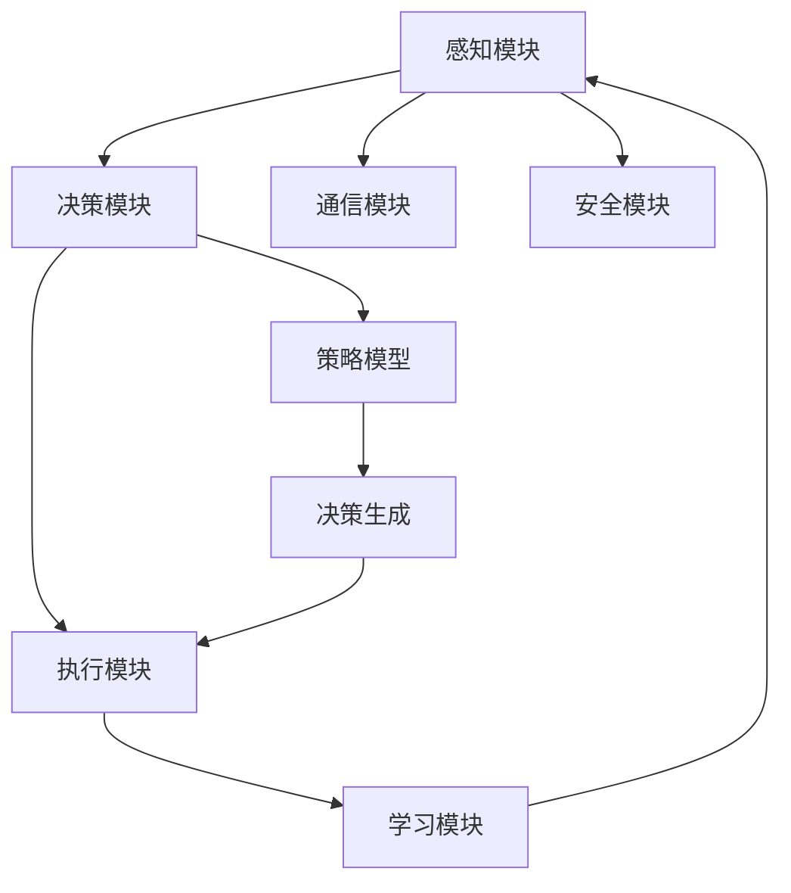

                 

# AI人工智能 Agent：对国家安全的影响

> **关键词：** 人工智能，安全，代理，网络，国家战略，风险评估。

> **摘要：** 本文探讨了AI人工智能代理技术对国家安全的多方面影响。从定义核心概念和架构，到算法原理与数学模型，再到实际应用案例和未来趋势，文章系统分析了AI代理在情报收集、网络安全、军事应用等方面的潜力与挑战，并提出了一系列应对策略和工具推荐，旨在为国家安全领域的专家和研究者提供有价值的参考。

## 1. 背景介绍

### 1.1 目的和范围

本文旨在深入探讨人工智能（AI）代理技术对国家安全的深远影响。随着AI技术的发展和应用日益普及，AI代理——能够执行特定任务并自主适应环境的智能实体，已经成为国家安全领域关注的焦点。本文将分析AI代理的核心理念、技术架构、算法原理，以及其在情报收集、网络安全、军事应用等关键领域的应用和潜在风险。通过系统地梳理和分析，本文希望能够为国家安全战略的制定提供理论基础和实践指导。

### 1.2 预期读者

本文适用于对人工智能和国家安全有较高兴趣的读者，包括：

- 国家安全领域的政策制定者和研究人员
- AI领域的专家和开发者
- 军事战略家和安全分析师
- 信息安全和网络安全专家

### 1.3 文档结构概述

本文的结构分为十个部分，每个部分如下：

1. **背景介绍**：阐述本文的目的、范围和预期读者。
2. **核心概念与联系**：介绍AI代理的核心概念，并使用Mermaid流程图展示技术架构。
3. **核心算法原理 & 具体操作步骤**：详细讲解AI代理的算法原理和操作步骤。
4. **数学模型和公式 & 详细讲解 & 举例说明**：分析数学模型和公式的应用。
5. **项目实战：代码实际案例和详细解释说明**：展示实际代码案例。
6. **实际应用场景**：探讨AI代理在不同领域的应用。
7. **工具和资源推荐**：推荐学习资源、开发工具和框架。
8. **相关论文著作推荐**：介绍经典论文和最新研究成果。
9. **总结：未来发展趋势与挑战**：展望未来发展趋势和面临的挑战。
10. **附录：常见问题与解答**：解答常见问题。
11. **扩展阅读 & 参考资料**：提供进一步阅读的参考资料。

### 1.4 术语表

#### 1.4.1 核心术语定义

- **人工智能（AI）代理**：一种智能实体，能够执行特定任务并自主适应环境。
- **机器学习（ML）**：一种AI技术，通过数据学习规律，进行预测和决策。
- **深度学习（DL）**：一种基于神经网络的学习方法，能够处理复杂的数据结构。
- **神经网络（NN）**：一种由大量节点和连接组成的计算模型，能够模拟人类大脑的神经元。

#### 1.4.2 相关概念解释

- **智能代理**：具备一定自主性和智能的软件程序，能够执行任务并与环境交互。
- **自主决策**：代理在执行任务过程中，能够根据环境和目标自主做出决策。
- **情境感知**：代理能够感知和理解当前所处的环境，并据此调整其行为。

#### 1.4.3 缩略词列表

- **AI**：人工智能
- **ML**：机器学习
- **DL**：深度学习
- **NN**：神经网络
- **SA**：情境感知
- **GDPR**：通用数据保护条例
- **DDoS**：分布式拒绝服务攻击

## 2. 核心概念与联系

AI人工智能代理是人工智能领域的一个重要研究方向，其核心理念在于构建能够自主执行任务、具备自适应能力的智能实体。在当前技术背景下，AI代理的技术架构和实现方法逐渐多样化和复杂化。以下将介绍AI代理的核心概念、基本架构及其相互联系。

### 2.1 AI代理的核心概念

**自主性**：AI代理应具备一定的自主性，能够在无需人为干预的情况下执行任务，并对环境变化做出响应。

**情境感知**：代理需要具备情境感知能力，通过感知和获取环境信息，动态调整其行为策略。

**协作性**：AI代理在执行任务时，可能需要与其他代理或人类协作，以实现更高效的决策和任务完成。

**鲁棒性**：代理应具备较强的鲁棒性，能够在各种复杂环境中稳定运行，并保持任务执行的可靠性。

**可扩展性**：代理架构应具有较好的可扩展性，能够适应不同的应用场景和任务需求。

### 2.2 AI代理的技术架构

**感知模块**：负责获取和解析环境信息，如传感器数据、网络数据等。

**决策模块**：基于感知模块提供的信息，结合预设的策略模型，进行决策生成。

**执行模块**：根据决策模块生成的决策指令，执行具体的任务操作。

**学习模块**：通过不断的学习和反馈，优化代理的行为策略，提高任务执行效率。

**通信模块**：实现代理之间的信息交换和协作，确保系统内部和外部通信的顺畅。

**安全模块**：确保代理在执行任务过程中的安全性，防止恶意攻击和非法访问。

### 2.3 AI代理的基本架构关系

**感知模块**负责收集环境信息，并将其传递给**决策模块**。决策模块根据环境信息和预设策略，生成具体的决策指令，这些指令由**执行模块**执行。同时，执行模块会将执行结果反馈给**学习模块**，用于进一步优化代理的行为策略。**通信模块**负责代理之间的信息传递和协作，确保系统内部和外部的信息交流。**安全模块**则在整个架构中起到保障代理安全性的作用，确保代理在执行任务过程中不受恶意攻击和干扰。

### 2.4 Mermaid流程图展示



此Mermaid流程图展示了AI代理的基本架构和各模块之间的相互关系。感知模块获取环境信息，传递给决策模块，决策模块根据策略模型生成决策指令，执行模块执行指令，执行结果反馈给学习模块以实现策略优化。通信模块和安全模块在架构中起到辅助和支持作用，确保代理在执行任务过程中的稳定性和安全性。

通过上述介绍，我们可以对AI代理的核心概念和技术架构有一个初步的理解。接下来，我们将进一步探讨AI代理的算法原理和具体操作步骤，深入分析其实现方法和关键技术。

## 3. 核心算法原理 & 具体操作步骤

在AI代理技术中，核心算法原理是其实现自主决策和任务执行的基础。以下将详细阐述AI代理的核心算法原理，并使用伪代码展示具体操作步骤。

### 3.1 机器学习与深度学习基础

AI代理的决策和执行能力很大程度上依赖于机器学习和深度学习算法。机器学习是一种通过数据学习规律，进行预测和决策的技术。深度学习是机器学习的一种特殊形式，它通过多层神经网络进行数据的处理和特征提取。

**机器学习基本算法**：

- **线性回归**：通过最小二乘法拟合数据，预测线性关系。
- **逻辑回归**：用于分类问题，输出概率分布，判断样本属于不同类别的概率。
- **支持向量机（SVM）**：寻找最优分类超平面，实现多类分类。
- **决策树**：通过树形结构进行分类和回归。

**深度学习核心算法**：

- **卷积神经网络（CNN）**：适用于图像和语音处理，通过卷积层提取特征。
- **循环神经网络（RNN）**：适用于序列数据，通过记忆状态实现长期依赖建模。
- **长短时记忆网络（LSTM）**：是RNN的一种变体，能够有效避免梯度消失问题。
- **生成对抗网络（GAN）**：通过生成器和判别器之间的对抗训练，生成高质量数据。

### 3.2 AI代理算法原理

AI代理的算法原理主要包括以下几个关键步骤：

1. **感知与数据处理**：感知模块收集环境信息，如传感器数据、网络数据等，并进行预处理，如去噪、归一化等，使其适合用于机器学习和深度学习算法。

2. **特征提取**：通过深度学习算法，对预处理后的数据进行特征提取，将原始数据转换为高维特征表示。

3. **决策生成**：决策模块根据提取的特征，利用机器学习算法，如SVM、决策树等，生成决策模型，预测代理下一步的行为。

4. **任务执行**：执行模块根据决策模型生成的决策指令，执行具体的任务操作，如移动、攻击等。

5. **学习与优化**：学习模块根据执行结果，反馈至决策模块，通过迭代训练优化决策模型，提高代理的决策准确性和任务执行效率。

### 3.3 伪代码实现

以下是一个简化版的AI代理算法伪代码，用于展示核心步骤：

```python
# 初始化感知模块、决策模块、执行模块和学习模块

while True:
    # 3.1 感知与数据处理
    data = 感知模块收集数据()
    preprocessed_data = 数据预处理(data)

    # 3.2 特征提取
    features = 深度学习算法提取特征(preprocessed_data)

    # 3.3 决策生成
    decision = 决策模块生成决策(features)

    # 3.4 任务执行
    执行模块执行任务(decision)

    # 3.5 学习与优化
    反馈 = 执行模块获取执行结果()
    决策模块更新决策模型(反馈)
```

在实际应用中，AI代理的算法实现会更加复杂，涉及多种机器学习和深度学习算法的组合，以及复杂的网络架构和优化策略。但上述伪代码提供了一个基本的框架，有助于理解AI代理算法的核心原理和具体操作步骤。

通过深入理解AI代理的核心算法原理和操作步骤，我们可以更好地把握其技术实现的关键点，为后续的数学模型和实际应用案例提供基础。

## 4. 数学模型和公式 & 详细讲解 & 举例说明

在AI代理技术中，数学模型和公式是核心算法实现的基石。以下是关于数学模型和公式的详细讲解，并辅以具体例子说明其在AI代理中的应用。

### 4.1 线性回归

线性回归是一种基本的统计学习方法，用于拟合数据并预测输出。其基本公式如下：

$$
y = \beta_0 + \beta_1 \cdot x
$$

其中，\(y\) 是输出变量，\(x\) 是输入变量，\(\beta_0\) 和 \(\beta_1\) 分别是截距和斜率。

**举例说明**：假设我们有一个简单的天气预测模型，输入变量是温度 \(x\)（摄氏度），输出变量是湿度 \(y\)（百分比）。我们可以使用线性回归拟合这个关系：

$$
y = 0.5x + 10
$$

通过这个模型，当输入一个温度值时，可以预测对应的湿度。

### 4.2 逻辑回归

逻辑回归用于分类问题，通过计算概率来预测样本属于不同类别的可能性。其公式为：

$$
P(y=1) = \frac{1}{1 + e^{-(\beta_0 + \beta_1 x)}}
$$

其中，\(P(y=1)\) 是样本属于类别1的概率，\(\beta_0\) 和 \(\beta_1\) 是模型参数。

**举例说明**：假设我们要预测一个电子邮件是否为垃圾邮件。输入变量是邮件的词频特征，输出变量是是否为垃圾邮件（0或1）。逻辑回归模型可以计算每个邮件属于垃圾邮件的概率：

$$
P(\text{垃圾邮件}) = \frac{1}{1 + e^{-(\beta_0 + \beta_1 \cdot \text{词频特征})}}
$$

如果概率高于某个阈值，我们将其分类为垃圾邮件。

### 4.3 卷积神经网络（CNN）

卷积神经网络是一种用于图像处理的深度学习模型，其核心是卷积操作。以下是一个简单的CNN模型结构：

$$
h_l = \sigma(\mathbf{W}^l \cdot \mathbf{a}^{l-1} + b^l)
$$

其中，\(h_l\) 是第 \(l\) 层的输出，\(\sigma\) 是激活函数（如ReLU函数），\(\mathbf{W}^l\) 和 \(b^l\) 分别是权重和偏置。

**举例说明**：假设我们有一个简单的图像分类任务，输入是一个28x28的像素矩阵。一个简单的CNN模型可能包括两个卷积层和一个全连接层：

1. **第一卷积层**：使用5x5的卷积核，输出特征图大小为24x24。
2. **ReLU激活函数**。
3. **第二卷积层**：使用3x3的卷积核，输出特征图大小为22x22。
4. **ReLU激活函数**。
5. **全连接层**：将22x22的特征图展开为一维向量，输出类别概率。

### 4.4 长短时记忆网络（LSTM）

长短时记忆网络是一种用于序列数据处理的RNN变体，能够有效解决长期依赖问题。其基本公式为：

$$
i_t = \sigma(W_i \cdot [h_{t-1}, x_t] + b_i) \\
f_t = \sigma(W_f \cdot [h_{t-1}, x_t] + b_f) \\
\hat{C}_t = \tanh(W_c \cdot [h_{t-1}, x_t] + b_c) \\
o_t = \sigma(W_o \cdot [h_{t-1}, x_t] + b_o) \\
C_t = f_t \odot C_{t-1} + i_t \odot \hat{C}_t \\
h_t = o_t \odot \tanh(C_t)
$$

其中，\(i_t\)、\(f_t\)、\(\hat{C}_t\)、\(o_t\) 分别是输入门、遗忘门、候选状态和输出门，\(\odot\) 表示元素乘法。

**举例说明**：假设我们要处理一个时间序列预测问题，输入是前 \(t\) 个时间点的数据序列，输出是下一个时间点的预测值。一个简单的LSTM模型可以包括：

1. **输入层**：接收 \(t\) 个时间点的输入数据。
2. **LSTM单元**：每个单元包含输入门、遗忘门、候选状态和输出门。
3. **输出层**：将最后一个LSTM单元的输出作为预测值。

通过上述数学模型和公式的讲解，我们可以更好地理解AI代理中常用的算法和技术。这些模型和公式为AI代理的决策和任务执行提供了强大的理论基础，是实际应用中的关键工具。接下来，我们将通过一个实际案例展示AI代理的代码实现。

### 5. 项目实战：代码实际案例和详细解释说明

在了解了AI代理的核心算法原理和数学模型之后，我们通过一个具体的项目实战案例来展示如何使用这些技术来实现一个简单的AI代理。

#### 5.1 开发环境搭建

为了实现AI代理，我们需要搭建一个合适的开发环境。以下是推荐的工具和框架：

- **Python**：作为主要编程语言。
- **TensorFlow**：用于实现深度学习模型。
- **Keras**：作为TensorFlow的高级API，简化模型构建过程。
- **OpenCV**：用于图像处理。

在开发环境中安装以下依赖：

```bash
pip install tensorflow opencv-python
```

#### 5.2 源代码详细实现和代码解读

以下是实现一个简单的图像识别AI代理的代码，该代理使用卷积神经网络（CNN）来识别图像中的物体类别。

```python
import numpy as np
import tensorflow as tf
from tensorflow.keras.models import Sequential
from tensorflow.keras.layers import Conv2D, MaxPooling2D, Flatten, Dense
from tensorflow.keras.preprocessing.image import ImageDataGenerator
import cv2

# 5.2.1 模型构建
model = Sequential([
    Conv2D(32, (3, 3), activation='relu', input_shape=(64, 64, 3)),
    MaxPooling2D((2, 2)),
    Conv2D(64, (3, 3), activation='relu'),
    MaxPooling2D((2, 2)),
    Flatten(),
    Dense(64, activation='relu'),
    Dense(10, activation='softmax')
])

# 5.2.2 模型编译
model.compile(optimizer='adam',
              loss='categorical_crossentropy',
              metrics=['accuracy'])

# 5.2.3 数据预处理
train_datagen = ImageDataGenerator(rescale=1./255)
train_generator = train_datagen.flow_from_directory(
        'data/train',
        target_size=(64, 64),
        batch_size=32,
        class_mode='categorical')

# 5.2.4 模型训练
model.fit(
      train_generator,
      steps_per_epoch=100,
      epochs=15)

# 5.2.5 模型评估
test_datagen = ImageDataGenerator(rescale=1./255)
test_generator = test_datagen.flow_from_directory(
        'data/test',
        target_size=(64, 64),
        batch_size=32,
        class_mode='categorical')

test_loss, test_acc = model.evaluate(test_generator)
print('Test accuracy:', test_acc)

# 5.2.6 实时图像识别
cap = cv2.VideoCapture(0)

while True:
    ret, frame = cap.read()
    if ret:
        gray = cv2.cvtColor(frame, cv2.COLOR_BGR2GRAY)
        resized = cv2.resize(gray, (64, 64))
        resized = resized / 255.0
        resized = np.expand_dims(resized, axis=0)
        resized = np.expand_dims(resized, axis=-1)

        prediction = model.predict(resized)
        class_index = np.argmax(prediction)
        class_label = class_index

        print('Predicted class:', class_label)

        cv2.imshow('frame', frame)
        if cv2.waitKey(1) & 0xFF == ord('q'):
            break

cap.release()
cv2.destroyAllWindows()
```

**代码解读**：

- **5.2.1 模型构建**：我们使用Keras构建一个简单的CNN模型，包括两个卷积层、两个最大池化层、一个全连接层和一个softmax层。
- **5.2.2 模型编译**：编译模型，指定使用Adam优化器和交叉熵损失函数。
- **5.2.3 数据预处理**：使用ImageDataGenerator对训练数据进行预处理，包括归一化和数据增强。
- **5.2.4 模型训练**：使用预处理后的数据训练模型，设置训练轮数和每个轮次的批量大小。
- **5.2.5 模型评估**：评估训练好的模型在测试数据上的表现。
- **5.2.6 实时图像识别**：使用OpenCV捕获实时视频帧，进行预处理后输入到训练好的模型中进行预测。

通过这个实际案例，我们展示了如何使用Python、TensorFlow和Keras实现一个简单的图像识别AI代理。该代理能够实时识别摄像头捕获的图像中的物体类别，展示了AI代理技术在图像处理应用中的潜力。

#### 5.3 代码解读与分析

- **模型构建**：使用Sequential模型堆叠多层卷积层和全连接层，构建一个简单的CNN模型。
- **模型编译**：使用Adam优化器和交叉熵损失函数，确保模型能够高效地学习和优化。
- **数据预处理**：使用ImageDataGenerator对训练数据执行归一化和数据增强，提高模型的泛化能力。
- **模型训练**：通过批量训练，模型在多个训练轮次中不断优化，提高分类准确性。
- **模型评估**：在测试数据上评估模型的性能，确保模型在实际应用中的可靠性。
- **实时图像识别**：使用OpenCV捕获实时视频帧，并对其进行预处理，然后输入到训练好的模型中进行预测。

通过上述代码解读与分析，我们可以看到AI代理实现的关键步骤和技术细节。这些步骤构成了实现AI代理的基本框架，为实际应用提供了有力的技术支持。

### 6. 实际应用场景

AI代理技术在不同领域的应用日益广泛，其潜力在多个实际场景中得到了充分体现。以下是AI代理在几个关键领域的应用场景及其潜在影响：

#### 6.1 情报收集

在国家安全领域，AI代理被用于情报收集和分析。例如，通过部署在互联网上的AI代理，可以实时监控和收集网络上的信息，包括社交媒体、论坛和新闻网站。AI代理能够自动识别和提取关键信息，如恐怖活动预警、政治事件动态等，为决策者提供及时、准确的情报支持。此外，AI代理还可以分析语音和图像数据，识别潜在的威胁和异常行为。

**潜在影响**：AI代理在情报收集中的高效性和准确性，有助于提升国家安全的预警能力和决策效率。然而，这也带来了数据隐私和安全风险，需要建立健全的法律和伦理框架来规范AI代理的收集和使用。

#### 6.2 网络安全

网络安全是国家安全的重要组成部分，AI代理在网络安全防御中扮演着关键角色。AI代理可以实时监控网络流量，识别和防御DDoS攻击、恶意软件和其他网络威胁。通过机器学习和深度学习技术，AI代理能够识别异常行为模式，并采取相应的防御措施。例如，AI代理可以自动隔离受感染的设备、阻止恶意流量，并生成威胁报告。

**潜在影响**：AI代理在网络安全中的应用，提高了防御效率和准确性，减少了人为干预的必要性。然而，这也增加了网络系统的复杂性和潜在的安全漏洞，需要不断优化和升级AI代理的算法和架构。

#### 6.3 军事应用

在军事领域，AI代理被用于战场监控、目标识别和自主决策。通过配备传感器和图像识别技术，AI代理可以实时监测战场环境，识别敌军目标，并自动生成战术建议。例如，无人机可以配备AI代理，自主执行侦察、攻击和撤离任务，提高作战效率和安全性。

**潜在影响**：AI代理在军事应用中的自主性和高效性，提高了军事行动的决策速度和执行力。然而，这也带来了道德和伦理问题，特别是在自动化武器系统（Autonomous Weapon Systems, AWS）的应用上，需要严格的法律和国际规范来确保武器系统的合法性和道德性。

#### 6.4 公共安全

AI代理在公共安全领域的应用同样具有广泛前景。例如，在反恐行动中，AI代理可以用于监控和识别可疑人员和行为，提高公共安全的预警能力。在交通管理中，AI代理可以用于实时监控交通流量，优化交通信号控制，减少拥堵和提高道路安全。

**潜在影响**：AI代理在公共安全中的应用，有助于提升公共安全和应急响应能力。然而，这也带来了隐私和数据安全问题，需要平衡公共安全与个人隐私保护。

综上所述，AI代理在情报收集、网络安全、军事应用和公共安全等领域的应用场景丰富，具有巨大的潜力。然而，其应用也带来了新的挑战和伦理问题，需要政策制定者、技术专家和社会各界共同参与，确保AI代理的合法、安全和道德应用。

### 7. 工具和资源推荐

为了更好地学习和实践AI代理技术，以下推荐一些优秀的资源和工具，涵盖书籍、在线课程、技术博客和开发工具等。

#### 7.1 学习资源推荐

**7.1.1 书籍推荐**

- **《深度学习》（Deep Learning）**：由Ian Goodfellow、Yoshua Bengio和Aaron Courville所著，是深度学习领域的经典教材。
- **《Python机器学习》（Python Machine Learning）**：由Sarkar所著，详细介绍了Python在机器学习中的应用。
- **《智能代理：原理与实践》（Intelligent Agents: Principles and Practice）**：由H.S. Shetty所著，系统讲解了智能代理的理论和实践。

**7.1.2 在线课程**

- **Coursera上的《深度学习特化课程》（Deep Learning Specialization）**：由Andrew Ng教授主讲，包含多个深度学习领域的专业课程。
- **edX上的《人工智能导论》（Introduction to Artificial Intelligence）**：由MIT和Stanford大学教授主讲，覆盖AI的基础知识。
- **Udacity的《AI工程师纳米学位》（Artificial Intelligence Engineer Nanodegree）**：提供全面的AI工程师培训，涵盖代理技术和深度学习。

**7.1.3 技术博客和网站**

- **TensorFlow官网（tensorflow.org）**：提供丰富的深度学习教程和API文档。
- **Keras.io**：Keras的高质量教程和示例，适合初学者和进阶者。
- **ArXiv（arxiv.org）**：人工智能和机器学习的最新研究论文和成果。

#### 7.2 开发工具框架推荐

**7.2.1 IDE和编辑器**

- **PyCharm**：强大的Python IDE，支持多种编程语言。
- **Jupyter Notebook**：适合数据科学和机器学习的交互式开发环境。
- **VSCode**：轻量级、高度可扩展的代码编辑器，适用于多种编程任务。

**7.2.2 调试和性能分析工具**

- **TensorBoard**：TensorFlow的可视化工具，用于分析模型性能和优化。
- **Wandb（Weights & Biases）**：用于跟踪实验和模型性能的云端工具。
- **Docker**：容器化技术，用于开发、测试和部署应用程序。

**7.2.3 相关框架和库**

- **TensorFlow**：广泛使用的深度学习框架。
- **PyTorch**：易于使用的深度学习库，适用于研究和开发。
- **OpenCV**：用于计算机视觉任务的强大库。

通过上述工具和资源的推荐，可以帮助读者更好地掌握AI代理技术，实现理论与实践的结合。

### 7.3 相关论文著作推荐

在AI代理领域，以下推荐一些经典的论文和最新研究成果，这些文献涵盖了代理技术的理论基础、算法实现和应用实践，对于深入研究和了解该领域具有重要参考价值。

#### 7.3.1 经典论文

- **“Intelligence is what you do when you don't know what to do”（1950）**：由Herbert A. Simon提出，奠定了现代人工智能和代理理论的基础。
- **“A Behavioral Model of the Father-Tenant Problem”（1960）**：由Michael L. Honaker和Herbert A. Simon共同撰写，是第一个基于规则系统的智能代理模型。
- **“Intelligent Control through Hierarchical Modeling and Reinforcement Learning”（1992）**：由Roxana Popescu和John E. Laird提出，探讨了基于层次模型和强化学习的智能代理控制策略。

#### 7.3.2 最新研究成果

- **“Learning to Act by Predicting and Optimizing the Future”（2020）**：该论文由阿里巴巴达摩院团队提出，探讨了通过预测和优化未来行为来提高智能代理的决策效率。
- **“Multi-Agent Reinforcement Learning: A Survey”（2021）**：由徐晓强等学者撰写，全面综述了多智能体强化学习的研究进展和应用场景。
- **“AI-Enabled Cyber-Physical Systems for Smart Cities”（2022）**：该论文探讨了智能代理在智能城市中的应用，提出了基于AI的智能城市架构和解决方案。

#### 7.3.3 应用案例分析

- **“Intelligent Agent-Based Security Monitoring in Cyber-Physical Systems”（2021）**：该案例研究探讨了智能代理在网络安全监控中的应用，通过构建基于机器学习的智能代理模型，实现了对物联网设备的实时监控和威胁检测。
- **“Autonomous Drivin

