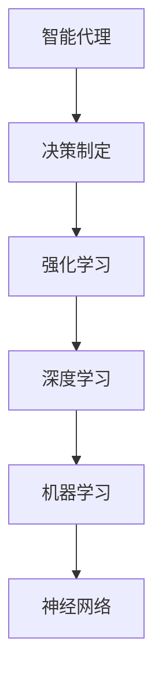

                 

# AI人工智能 Agent：智能决策制定

> 关键词：人工智能、决策制定、智能代理、强化学习、深度学习、机器学习、神经网络

> 摘要：本文将探讨AI人工智能Agent的智能决策制定技术，分析其核心概念、算法原理、数学模型以及实际应用场景，帮助读者深入理解智能代理的运作机制和发展趋势。

## 1. 背景介绍

### 1.1 目的和范围

本文旨在介绍AI人工智能Agent的智能决策制定技术，帮助读者理解这一领域的基本概念、核心算法、数学模型以及实际应用。我们将从以下几个部分展开讨论：

1. 背景介绍：介绍智能决策制定技术的发展历程和应用场景。
2. 核心概念与联系：阐述智能代理的基本概念及其与相关技术的关联。
3. 核心算法原理 & 具体操作步骤：详细讲解常用的智能决策算法及其实现步骤。
4. 数学模型和公式 & 详细讲解 & 举例说明：介绍与智能决策相关的重要数学模型和公式，并给出实例说明。
5. 项目实战：通过实际案例展示智能决策算法的应用。
6. 实际应用场景：探讨智能代理在各个领域的应用案例。
7. 工具和资源推荐：推荐学习资源和开发工具。
8. 总结：展望智能决策制定技术的未来发展趋势与挑战。

### 1.2 预期读者

本文适合具有计算机科学、人工智能等相关专业背景的读者，特别是对智能决策制定、机器学习、深度学习等领域感兴趣的读者。读者需要对基本的编程知识有一定的了解，以便更好地理解本文中的算法和实例。

### 1.3 文档结构概述

本文分为十个部分，具体结构如下：

1. 背景介绍：介绍本文的目的、范围、预期读者以及文档结构。
2. 核心概念与联系：阐述智能代理的基本概念及其与相关技术的关联。
3. 核心算法原理 & 具体操作步骤：详细讲解常用的智能决策算法及其实现步骤。
4. 数学模型和公式 & 详细讲解 & 举例说明：介绍与智能决策相关的重要数学模型和公式，并给出实例说明。
5. 项目实战：通过实际案例展示智能决策算法的应用。
6. 实际应用场景：探讨智能代理在各个领域的应用案例。
7. 工具和资源推荐：推荐学习资源和开发工具。
8. 总结：展望智能决策制定技术的未来发展趋势与挑战。
9. 附录：常见问题与解答。
10. 扩展阅读 & 参考资料：提供相关文献和资料，供读者进一步学习。

### 1.4 术语表

#### 1.4.1 核心术语定义

- **智能代理**：一种能够模拟人类智能行为，根据环境信息自主决策的计算机程序。
- **决策制定**：根据给定的问题情境，选择合适的行动方案以实现目标的过程。
- **强化学习**：一种机器学习方法，通过试错和反馈不断优化决策策略。
- **深度学习**：一种基于多层神经网络的人工智能技术，能够自动提取特征并实现复杂任务。
- **机器学习**：一种基于数据训练模型，使计算机具备自主学习和决策能力的技术。
- **神经网络**：一种由大量神经元组成的计算模型，能够模拟人脑的信息处理过程。

#### 1.4.2 相关概念解释

- **环境**：智能代理所在的现实世界，包括各种状态、规则和约束条件。
- **状态**：描述智能代理在某个时间点的信息，如位置、速度、能量等。
- **动作**：智能代理可以选择的行动，如移动、攻击、防御等。
- **奖励**：评估智能代理决策效果的指标，用于指导算法优化决策策略。
- **策略**：智能代理在给定状态下选择动作的方法，如基于规则、强化学习等。

#### 1.4.3 缩略词列表

- **AI**：人工智能（Artificial Intelligence）
- **RL**：强化学习（Reinforcement Learning）
- **DRL**：深度强化学习（Deep Reinforcement Learning）
- **ML**：机器学习（Machine Learning）
- **NN**：神经网络（Neural Network）

## 2. 核心概念与联系

在探讨智能决策制定技术之前，首先需要了解智能代理的基本概念及其与相关技术的关联。以下是对几个关键概念的介绍和联系分析：

### 2.1 智能代理

智能代理是指一种能够模拟人类智能行为，根据环境信息自主决策的计算机程序。智能代理的核心目标是最大化奖励，通过不断学习、适应和优化决策策略，实现高效、智能的决策制定。

### 2.2 决策制定

决策制定是一个复杂的过程，涉及到问题分析、目标设定、方案选择、评估优化等多个环节。在人工智能领域，决策制定主要依靠智能代理实现，通过模拟人类决策过程，提高自动化决策的准确性和效率。

### 2.3 强化学习

强化学习是一种机器学习方法，通过试错和反馈不断优化决策策略。在强化学习中，智能代理通过与环境的交互，学习到最优策略，从而实现智能决策。强化学习在智能代理决策制定中发挥着重要作用。

### 2.4 深度学习

深度学习是一种基于多层神经网络的人工智能技术，能够自动提取特征并实现复杂任务。深度学习与强化学习相结合，形成了深度强化学习（DRL），在智能代理决策制定中具有重要意义。

### 2.5 机器学习

机器学习是一种基于数据训练模型，使计算机具备自主学习和决策能力的技术。机器学习为智能代理提供了丰富的算法和技术手段，如分类、回归、聚类等，有助于提高决策的准确性和效率。

### 2.6 神经网络

神经网络是一种由大量神经元组成的计算模型，能够模拟人脑的信息处理过程。神经网络在深度学习中发挥着核心作用，通过多层神经网络，智能代理能够提取更复杂的特征，实现更智能的决策。

### 2.7 核心概念联系分析

智能代理、决策制定、强化学习、深度学习、机器学习和神经网络等概念相互关联，共同构成了智能决策制定技术的基础。以下是一个简化的Mermaid流程图，展示了这些核心概念之间的联系：



通过以上分析，我们可以看到，智能代理、决策制定、强化学习、深度学习、机器学习和神经网络等核心概念相互关联，共同构建了智能决策制定技术的理论基础。接下来，我们将进一步探讨这些概念的具体原理和应用。

## 3. 核心算法原理 & 具体操作步骤

在智能决策制定领域，有多种算法被广泛应用于实现智能代理的决策制定。本文将介绍几种典型的算法，包括Q-Learning、SARSA和Deep Q-Network（DQN），并详细阐述其原理和具体操作步骤。

### 3.1 Q-Learning算法

Q-Learning是一种基于值函数的强化学习算法，通过学习值函数来评估状态-动作对，从而实现智能代理的决策制定。

#### 3.1.1 算法原理

Q-Learning算法的核心思想是更新状态-动作值函数，使其逼近最优策略。具体而言，在给定一个状态\( s \)和一个动作\( a \)，算法计算当前的动作-状态值\( Q(s, a) \)，并根据奖励和未来期望奖励来更新值函数：

\[ Q(s, a) \leftarrow Q(s, a) + \alpha [r + \gamma \max_{a'} Q(s', a') - Q(s, a)] \]

其中，\( r \)为即时奖励，\( \gamma \)为折扣因子，\( \alpha \)为学习率，\( s' \)为执行动作\( a \)后的状态，\( a' \)为在状态\( s' \)下最优动作。

#### 3.1.2 具体操作步骤

1. 初始化值函数：设定一个初始值函数\( Q(s, a) \)。
2. 随机选择初始状态\( s \)。
3. 在状态\( s \)下执行动作\( a \)，获取即时奖励\( r \)。
4. 根据公式更新值函数：\( Q(s, a) \leftarrow Q(s, a) + \alpha [r + \gamma \max_{a'} Q(s', a') - Q(s, a)] \)。
5. 更新状态：\( s \leftarrow s' \)。
6. 重复步骤3-5，直至达到停止条件（如达到特定迭代次数或收敛）。

### 3.2 SARSA算法

SARSA（同步模拟和动态规划）算法是一种基于策略的强化学习算法，通过同步更新策略和值函数，实现智能代理的决策制定。

#### 3.2.1 算法原理

SARSA算法的核心思想是同时考虑当前状态和未来状态，更新策略和值函数。具体而言，在给定一个状态\( s \)和一个动作\( a \)，算法计算当前的动作-状态值\( Q(s, a) \)，并根据奖励和未来期望奖励来更新策略和值函数：

\[ Q(s, a) \leftarrow Q(s, a) + \alpha [r + \gamma Q(s', a')] - Q(s, a)] \]

其中，\( r \)为即时奖励，\( \gamma \)为折扣因子，\( \alpha \)为学习率，\( s' \)为执行动作\( a \)后的状态，\( a' \)为在状态\( s' \)下根据当前策略选择的最优动作。

#### 3.2.2 具体操作步骤

1. 初始化策略和值函数：设定一个初始策略和值函数。
2. 随机选择初始状态\( s \)。
3. 在状态\( s \)下根据当前策略选择动作\( a \)，获取即时奖励\( r \)。
4. 根据公式更新策略和值函数：\( Q(s, a) \leftarrow Q(s, a) + \alpha [r + \gamma Q(s', a')] - Q(s, a)] \)。
5. 更新状态：\( s \leftarrow s' \)。
6. 重复步骤3-5，直至达到停止条件（如达到特定迭代次数或收敛）。

### 3.3 Deep Q-Network（DQN）算法

DQN（深度Q网络）算法是一种基于深度学习的强化学习算法，通过学习深度神经网络来近似值函数，实现智能代理的决策制定。

#### 3.3.1 算法原理

DQN算法的核心思想是使用深度神经网络（DNN）来近似Q值函数，通过经验回放和目标网络，提高算法的收敛性和稳定性。具体而言，在给定一个状态\( s \)和一个动作\( a \)，算法计算当前的动作-状态值\( Q(s, a) \)，并根据奖励和未来期望奖励来更新DNN的权重：

\[ \theta_{DNN} \leftarrow \theta_{DNN} + \alpha [r + \gamma \max_{a'} Q(s', a') - Q(s, a)] \]

其中，\( \theta_{DNN} \)为DNN的权重，\( r \)为即时奖励，\( \gamma \)为折扣因子，\( \alpha \)为学习率，\( s' \)为执行动作\( a \)后的状态，\( a' \)为在状态\( s' \)下最优动作。

#### 3.3.2 具体操作步骤

1. 初始化DNN和目标DNN。
2. 初始化经验回放记忆。
3. 随机选择初始状态\( s \)。
4. 在状态\( s \)下根据当前策略选择动作\( a \)，执行动作并获取即时奖励\( r \)。
5. 将\( (s, a, r, s') \)存入经验回放记忆。
6. 从经验回放记忆中随机抽取一批样本。
7. 使用目标DNN计算目标值函数：
\[ Q^*(s', a') = r + \gamma \max_{a'} Q^{target}(s', a') \]
8. 使用DNN计算当前值函数：
\[ Q(s, a) = r + \gamma \max_{a'} Q(s', a') \]
9. 使用梯度下降法更新DNN的权重：
\[ \theta_{DNN} \leftarrow \theta_{DNN} + \alpha [r + \gamma \max_{a'} Q^{target}(s', a') - Q(s, a)] \]
10. 更新目标DNN的权重：
\[ \theta_{target} \leftarrow \tau \theta_{DNN} + (1 - \tau) \theta_{target} \]
11. 更新状态：\( s \leftarrow s' \)。
12. 重复步骤4-11，直至达到停止条件（如达到特定迭代次数或收敛）。

通过以上对Q-Learning、SARSA和DQN算法的介绍，我们可以看到这些算法在智能代理决策制定中的应用。接下来，我们将进一步探讨这些算法的数学模型和公式，以及实际应用中的例子。

## 4. 数学模型和公式 & 详细讲解 & 举例说明

在智能决策制定领域，数学模型和公式起着至关重要的作用。以下将对与智能决策相关的数学模型和公式进行详细讲解，并通过实例来说明其应用。

### 4.1 强化学习中的基本概念

强化学习中的主要概念包括状态（\( s \)）、动作（\( a \)）、奖励（\( r \））、策略（\( \pi \)）和值函数（\( Q \)）。

#### 状态（\( s \)）
状态是描述智能代理在某一时刻所处环境的信息，如游戏中的棋盘布局、机器人位置等。

#### 动作（\( a \)）
动作是智能代理可以采取的行为，如游戏中的走棋、机器人移动方向等。

#### 奖励（\( r \））
奖励是智能代理在采取某一动作后获得的即时反馈，用于指导算法优化决策策略。

#### 策略（\( \pi \)）
策略是智能代理在给定状态下选择动作的方法，常用的策略包括基于规则、epsilon-greedy等。

#### 值函数（\( Q \)）
值函数是评估状态-动作对优劣的指标，用于指导智能代理选择最佳动作。值函数可以分为状态值函数（\( V(s) \)）和动作值函数（\( Q(s, a) \））。

### 4.2 强化学习中的数学模型和公式

在强化学习中，常用的数学模型和公式包括Q-Learning、SARSA和DQN算法。

#### Q-Learning算法

Q-Learning算法的数学模型和公式如下：

\[ Q(s, a) \leftarrow Q(s, a) + \alpha [r + \gamma \max_{a'} Q(s', a') - Q(s, a)] \]

其中，\( r \)为即时奖励，\( \gamma \)为折扣因子，\( \alpha \)为学习率，\( s' \)为执行动作\( a \)后的状态，\( a' \)为在状态\( s' \)下最优动作。

#### SARSA算法

SARSA算法的数学模型和公式如下：

\[ Q(s, a) \leftarrow Q(s, a) + \alpha [r + \gamma Q(s', a')] - Q(s, a)] \]

其中，\( r \)为即时奖励，\( \gamma \)为折扣因子，\( \alpha \)为学习率，\( s' \)为执行动作\( a \)后的状态，\( a' \)为在状态\( s' \)下根据当前策略选择的最优动作。

#### DQN算法

DQN算法的数学模型和公式如下：

\[ Q(s, a) \leftarrow Q(s, a) + \alpha [r + \gamma \max_{a'} Q(s', a') - Q(s, a)] \]

其中，\( r \)为即时奖励，\( \gamma \)为折扣因子，\( \alpha \)为学习率，\( s' \)为执行动作\( a \)后的状态，\( a' \)为在状态\( s' \)下最优动作。

### 4.3 实例说明

以下通过一个简单的实例来说明强化学习中的数学模型和公式的应用。

假设一个智能代理在一个简单的迷宫环境中进行探索，目标是找到通往出口的最短路径。环境包含一个状态空间 \( S = \{s_1, s_2, ..., s_n\} \) 和一个动作空间 \( A = \{a_1, a_2, ..., a_m\} \)。智能代理在状态 \( s_i \) 下采取动作 \( a_j \)，获得即时奖励 \( r(s_i, a_j) \)。

1. 初始化值函数 \( Q(s, a) \)。
2. 随机选择初始状态 \( s_1 \)。
3. 在状态 \( s_1 \) 下根据当前策略选择动作 \( a_2 \)，执行动作并获取即时奖励 \( r(s_1, a_2) = -1 \)。
4. 根据Q-Learning算法更新值函数：
\[ Q(s_1, a_2) \leftarrow Q(s_1, a_2) + \alpha [r(s_1, a_2) + \gamma \max_{a'} Q(s_2, a') - Q(s_1, a_2)] \]
5. 更新状态：\( s_1 \leftarrow s_2 \)。
6. 重复步骤3-5，直至达到停止条件。

通过以上实例，我们可以看到强化学习中的数学模型和公式在智能决策制定中的应用。接下来，我们将进一步探讨智能代理的实际应用场景。

## 5. 项目实战：代码实际案例和详细解释说明

在智能决策制定领域，实际项目中的代码实现是理解和应用相关算法的关键。以下将通过一个具体的案例，展示如何使用Python实现一个简单的智能代理，并详细解释其代码和实现过程。

### 5.1 开发环境搭建

在进行项目实战之前，首先需要搭建一个适合开发智能代理的Python环境。以下是搭建开发环境的步骤：

1. 安装Python（建议使用3.8及以上版本）。
2. 安装必要的库，如numpy、tensorflow、pygame等。可以使用pip命令安装：

```bash
pip install numpy tensorflow pygame
```

### 5.2 源代码详细实现和代码解读

以下是一个简单的基于Q-Learning算法的智能代理代码示例。该示例实现了一个智能代理在一个二维迷宫环境中寻找出口的目标。

```python
import numpy as np
import random
import matplotlib.pyplot as plt
import pygame
import sys

# 定义迷宫环境
class MazeEnv:
    def __init__(self, size=5):
        self.size = size
        self.state = np.zeros((size, size), dtype=int)
        self.state[size//2][size//2] = 1  # 初始位置
        self.goal = np.zeros((size, size), dtype=int)
        self.goal[size-1][size-1] = 1  # 目标位置
        self.step_reward = -1
        self.goal_reward = 100

    def step(self, action):
        # 计算动作后的状态
        new_state = np.copy(self.state)
        if action == 0:  # 向上
            new_state[self.state.shape[0]//2 - 1][self.state.shape[1]//2] = 1
        elif action == 1:  # 向下
            new_state[self.state.shape[0]//2 + 1][self.state.shape[1]//2] = 1
        elif action == 2:  # 向左
            new_state[self.state.shape[0]//2][self.state.shape[1]//2 - 1] = 1
        elif action == 3:  # 向右
            new_state[self.state.shape[0]//2][self.state.shape[1]//2 + 1] = 1

        # 判断是否到达目标
        if np.array_equal(new_state, self.goal):
            reward = self.goal_reward
        else:
            reward = self.step_reward

        return new_state, reward

    def render(self):
        # 绘制迷宫
        screen = pygame.display.set_mode((self.size*50, self.size*50))
        pygame.display.set_caption('Maze Env')
        while True:
            for event in pygame.event.get():
                if event.type == pygame.QUIT:
                    pygame.quit()
                    sys.exit()

            screen.fill((255, 255, 255))
            for i in range(self.size):
                for j in range(self.size):
                    if self.state[i][j] == 1:
                        pygame.draw.rect(screen, (255, 0, 0), (j*50, i*50, 50, 50))
                    if self.goal[i][j] == 1:
                        pygame.draw.rect(screen, (0, 0, 255), (j*50, i*50, 50, 50))
            pygame.display.update()

# 定义Q-Learning算法
class QLearningAgent:
    def __init__(self, env, alpha=0.1, gamma=0.9, epsilon=0.1):
        self.env = env
        self.alpha = alpha
        self.gamma = gamma
        self.epsilon = epsilon
        self.Q = np.zeros((self.env.size, self.env.size))

    def choose_action(self, state):
        if random.random() < self.epsilon:
            action = random.choice([0, 1, 2, 3])  # 贪心策略
        else:
            action = np.argmax(self.Q[state[0], state[1]])  # 贪心策略
        return action

    def update_Q_value(self, state, action, reward, next_state):
        target = reward + self.gamma * np.max(self.Q[next_state[0], next_state[1]])
        self.Q[state[0], state[1]] = self.Q[state[0], state[1]] + self.alpha * (target - self.Q[state[0], state[1]])

    def train(self, num_episodes):
        for episode in range(num_episodes):
            state = self.env.state
            done = False
            while not done:
                action = self.choose_action(state)
                next_state, reward = self.env.step(action)
                self.update_Q_value(state, action, reward, next_state)
                state = next_state
                if np.array_equal(state, self.env.goal):
                    done = True
                    self.epsilon = max(self.epsilon * 0.99, 0.01)  # 调整epsilon值

# 运行实验
if __name__ == '__main__':
    env = MazeEnv()
    agent = QLearningAgent(env, alpha=0.1, gamma=0.9, epsilon=0.1)
    num_episodes = 1000

    agent.train(num_episodes)

    # 绘制训练过程中的奖励曲线
    rewards = [agent.env.step_reward for _ in range(num_episodes)]
    for _ in range(num_episodes):
        state = env.state
        done = False
        while not done:
            action = agent.choose_action(state)
            next_state, reward = env.step(action)
            rewards[_] += reward
            state = next_state
            if np.array_equal(state, env.goal):
                done = True

    plt.plot(rewards)
    plt.xlabel('Episode')
    plt.ylabel('Reward')
    plt.show()

    # 观察智能代理在迷宫环境中的行为
    env.render()
```

#### 代码解读

1. **MazeEnv类**：定义了一个简单的迷宫环境，包含状态、动作、奖励等基本元素，以及渲染方法。
2. **QLearningAgent类**：定义了一个基于Q-Learning算法的智能代理，包括选择动作、更新Q值、训练等方法。
3. **实验运行**：创建环境、智能代理，并运行训练过程。训练完成后，绘制奖励曲线并观察智能代理在迷宫环境中的行为。

### 5.3 代码解读与分析

通过上述代码示例，我们可以看到如何使用Python实现一个简单的智能代理，并在迷宫环境中进行训练。以下是对代码的详细解读和分析：

1. **环境定义**：使用MazeEnv类定义了一个二维迷宫环境，包含状态、动作和奖励。环境初始化时，将初始位置设置为1，目标位置也设置为1。
2. **智能代理定义**：使用QLearningAgent类定义了一个基于Q-Learning算法的智能代理。代理包含选择动作、更新Q值和训练方法。选择动作方法中，使用epsilon-greedy策略，在探索和利用之间取得平衡。更新Q值方法根据Q-Learning算法的公式，更新Q值。
3. **训练过程**：在训练过程中，智能代理在每个时间步根据当前策略选择动作，并更新Q值。当智能代理到达目标时，更新epsilon值，以平衡探索和利用。
4. **奖励曲线绘制**：训练完成后，绘制奖励曲线，观察智能代理在训练过程中的表现。奖励曲线反映了智能代理的学习过程，从初始的负奖励逐渐增加到正奖励。
5. **环境渲染**：在训练完成后，通过渲染方法观察智能代理在迷宫环境中的行为。智能代理在训练过程中学会了避开障碍物，并找到通往出口的最短路径。

通过以上代码示例和解读，我们可以看到如何使用Python实现一个简单的智能代理，并在迷宫环境中进行训练。实际项目中的智能代理通常更为复杂，但基本原理和方法是相似的。接下来，我们将进一步探讨智能代理的实际应用场景。

## 6. 实际应用场景

智能代理在各个领域有着广泛的应用，能够帮助人们解决复杂问题，提高工作效率。以下介绍几个智能代理的实际应用场景。

### 6.1 游戏领域

智能代理在游戏领域有着广泛的应用，如游戏AI、游戏机器人等。通过强化学习和深度学习算法，智能代理可以学会玩各种类型的游戏，如棋类游戏、射击游戏、策略游戏等。智能代理在游戏领域不仅能够提高游戏的挑战性，还能够为游戏开发者提供强大的测试工具。

### 6.2 自动驾驶

自动驾驶是智能代理的重要应用场景之一。自动驾驶车辆需要具备环境感知、路径规划、目标跟踪等能力，智能代理能够通过学习和优化决策策略，实现自动驾驶。例如，特斯拉的自动驾驶系统使用了深度学习和强化学习算法，使车辆能够自适应各种道路环境，提高驾驶安全性。

### 6.3 机器人控制

智能代理在机器人控制领域有着广泛的应用，如工业机器人、服务机器人等。通过智能代理，机器人能够自主感知环境、规划路径、执行任务，实现智能化操作。例如，波士顿动力公司的机器人能够自主奔跑、跳跃、翻滚，完成复杂的动作，这些都得益于智能代理的决策制定能力。

### 6.4 金融领域

智能代理在金融领域有着广泛的应用，如量化交易、风险管理、投资建议等。通过机器学习和深度学习算法，智能代理可以分析大量历史数据，发现市场规律，为投资者提供决策支持。例如，量化交易平台使用了智能代理算法，通过实时分析市场数据，自动进行交易决策，提高交易成功率。

### 6.5 医疗领域

智能代理在医疗领域有着广泛的应用，如医疗诊断、治疗方案制定、患者监护等。通过智能代理，医生可以更准确地诊断疾病，制定个性化的治疗方案，提高医疗质量。例如，IBM的Watson智能代理能够分析海量医学文献，提供快速准确的诊断建议，为医生提供决策支持。

### 6.6 电子商务

智能代理在电子商务领域有着广泛的应用，如个性化推荐、智能客服、欺诈检测等。通过智能代理，电商平台可以更好地理解用户需求，提供个性化的商品推荐，提高用户满意度。例如，亚马逊的智能推荐系统使用了深度学习算法，根据用户的浏览和购买历史，提供个性化的商品推荐。

通过以上实际应用场景，我们可以看到智能代理在各个领域的重要作用。随着技术的不断进步，智能代理的应用将越来越广泛，为人类带来更多的便利和效益。

## 7. 工具和资源推荐

为了更好地学习和应用智能决策制定技术，以下推荐一些优秀的工具和资源，包括书籍、在线课程、技术博客和开发工具框架。

### 7.1 学习资源推荐

#### 7.1.1 书籍推荐

1. **《人工智能：一种现代方法》**：作者 Stuart J. Russell 和 Peter Norvig，是一本全面介绍人工智能的教材，涵盖了许多基本概念和算法。
2. **《强化学习：原理与 Python 实现》**：作者 Maxim Lapan，详细介绍了强化学习的基本概念和算法，以及 Python 实现方法。
3. **《深度学习》**：作者 Ian Goodfellow、Yoshua Bengio 和 Aaron Courville，是一本关于深度学习的经典教材，涵盖了深度学习的基础理论和应用。

#### 7.1.2 在线课程

1. **《强化学习入门》**：在Coursera平台上，由David Silver教授主讲，提供强化学习的基本概念和算法介绍。
2. **《深度学习》**：在Udacity平台上，由Andrew Ng教授主讲，涵盖深度学习的基础知识和应用。
3. **《机器学习》**：在edX平台上，由Andrew Ng教授主讲，详细介绍机器学习的基本概念和算法。

#### 7.1.3 技术博客和网站

1. **AI Challenger**：一个关于人工智能技术的博客，涵盖强化学习、深度学习、机器学习等多个领域。
2. **机器之心**：一个专注于人工智能领域的媒体平台，提供最新的研究进展和应用案例。
3. **HackerRank**：一个在线编程挑战平台，提供丰富的算法和数据结构练习题，有助于提升编程能力。

### 7.2 开发工具框架推荐

#### 7.2.1 IDE和编辑器

1. **PyCharm**：一款功能强大的Python IDE，支持多种编程语言，提供代码补全、调试等功能。
2. **VS Code**：一款轻量级但功能强大的代码编辑器，支持多种编程语言，提供丰富的插件和扩展。

#### 7.2.2 调试和性能分析工具

1. **Python Debugger**：一款用于调试Python代码的工具，支持断点、单步执行、变量查看等功能。
2. **TensorBoard**：一款用于可视化TensorFlow模型和训练过程的工具，支持绘制损失函数、梯度等图表。

#### 7.2.3 相关框架和库

1. **TensorFlow**：一款开源的深度学习框架，提供丰富的API和工具，支持多种深度学习模型。
2. **PyTorch**：一款开源的深度学习框架，与TensorFlow类似，提供灵活的动态计算图和丰富的API。
3. **Keras**：一款开源的深度学习框架，基于Theano和TensorFlow开发，提供简洁的API和丰富的预训练模型。

通过以上工具和资源的推荐，读者可以更好地学习和应用智能决策制定技术。希望这些推荐能够为读者提供帮助，开启智能代理开发的新篇章。

## 8. 总结：未来发展趋势与挑战

智能代理作为一种具有自主决策能力的计算机程序，在未来具有广泛的应用前景。随着人工智能技术的不断发展，智能代理在多个领域将得到进一步的应用和推广。以下是对智能代理未来发展趋势和挑战的总结。

### 8.1 发展趋势

1. **深度强化学习的应用**：随着深度学习技术的不断进步，深度强化学习（DRL）将在智能代理领域得到更广泛的应用。通过深度神经网络，智能代理可以更好地学习复杂的决策策略，提高决策的准确性和效率。
2. **多智能体系统的协同**：未来，智能代理将不仅独立运作，还将与其他智能代理协同工作，形成多智能体系统。多智能体系统可以实现更复杂的任务，如无人机编队、智能交通管理、协同作业等。
3. **跨领域融合**：智能代理将在更多领域实现跨领域融合，如智能医疗、智能金融、智能教育等。通过结合不同领域的知识和技术，智能代理可以实现更高效、更智能的决策制定。
4. **自主学习和适应能力**：智能代理将具备更强的自主学习和适应能力，通过不断从环境中获取信息和经验，优化决策策略，提高适应复杂环境的能力。

### 8.2 挑战

1. **计算资源和能耗**：智能代理需要大量的计算资源和能耗来支持复杂的决策策略和学习过程。未来，如何在保证性能的前提下，降低计算资源和能耗，是一个重要的挑战。
2. **数据安全和隐私**：智能代理在应用过程中会收集和处理大量的用户数据，如何保障数据安全和用户隐私，是一个关键问题。未来需要加强对数据安全和隐私的保护，确保用户数据的安全。
3. **算法解释性**：智能代理的决策过程通常较为复杂，难以解释。如何提高算法的解释性，使决策过程更加透明和可解释，是一个重要的挑战。
4. **伦理和道德问题**：智能代理在决策过程中可能会面临伦理和道德问题，如自动驾驶车辆的道德选择、医疗决策中的伦理问题等。如何确保智能代理的决策符合伦理和道德标准，是一个亟待解决的问题。

总之，智能代理在未来的发展中将面临诸多挑战，但同时也具有广阔的应用前景。通过不断的技术创新和探索，智能代理将在各个领域发挥更大的作用，为人类社会带来更多的便利和效益。

## 9. 附录：常见问题与解答

在本文中，我们讨论了智能代理的智能决策制定技术，包括核心概念、算法原理、数学模型、实际应用场景等。以下是一些常见问题与解答，帮助读者更好地理解相关内容。

### 9.1 智能代理是什么？

智能代理是一种能够模拟人类智能行为，根据环境信息自主决策的计算机程序。智能代理通过学习环境中的状态、动作和奖励，不断优化决策策略，实现智能决策制定。

### 9.2 强化学习是什么？

强化学习是一种机器学习方法，通过试错和反馈不断优化决策策略。在强化学习中，智能代理通过与环境的交互，学习到最优策略，从而实现智能决策。

### 9.3 深度学习与强化学习的关系是什么？

深度学习是一种基于多层神经网络的人工智能技术，能够自动提取特征并实现复杂任务。深度学习与强化学习相结合，形成了深度强化学习（DRL），在智能代理决策制定中具有重要意义。

### 9.4 智能代理在哪些领域有应用？

智能代理在游戏、自动驾驶、机器人控制、金融、医疗、电子商务等多个领域有广泛应用。通过强化学习和深度学习算法，智能代理能够帮助人们解决复杂问题，提高工作效率。

### 9.5 智能代理如何实现？

实现智能代理主要包括以下几个步骤：

1. **环境定义**：定义智能代理所在的现实世界，包括状态、动作、奖励等。
2. **算法选择**：选择合适的强化学习算法，如Q-Learning、SARSA、DQN等。
3. **模型训练**：使用训练数据，通过学习算法优化智能代理的决策策略。
4. **策略优化**：根据环境反馈，不断调整智能代理的决策策略，提高决策准确性。
5. **实际应用**：将智能代理应用于实际问题，如游戏、自动驾驶等。

通过以上步骤，可以实现一个具备智能决策能力的智能代理。

## 10. 扩展阅读 & 参考资料

为了深入了解智能代理的智能决策制定技术，以下推荐一些扩展阅读和参考资料，供读者进一步学习。

### 10.1 经典论文

1. **"Reinforcement Learning: An Introduction"**：作者 Richard S. Sutton and Andrew G. Barto，提供了强化学习的基本概念和算法的详细讲解。
2. **"Deep Reinforcement Learning"**：作者 David Silver，介绍了深度强化学习的基本原理和应用。
3. **"Human-Level Control Through Deep Reinforcement Learning"**：作者 DeepMind团队，展示了深度强化学习在游戏控制中的应用。

### 10.2 最新研究成果

1. **"Reinforcement Learning: A Survey"**：作者 Hado van Hasselt，综述了强化学习的最新研究成果和进展。
2. **"Distributed Reinforcement Learning"**：作者 Sergey Levine，探讨了分布式强化学习在多智能体系统中的应用。
3. **"Deep Q-Networks for Reinforcement Learning"**：作者 DeepMind团队，详细介绍了深度Q网络（DQN）的原理和实现。

### 10.3 应用案例分析

1. **"Deep Reinforcement Learning for Robotics: A Review"**：作者 Yuxi Chen，探讨了深度强化学习在机器人控制中的应用。
2. **"Reinforcement Learning in Finance: An Overview"**：作者 Alexander Tuzov，介绍了强化学习在金融领域中的应用。
3. **"AI in Healthcare: A Review"**：作者 Somnath Mukhopadhyay，概述了人工智能在医疗领域的应用。

通过阅读这些扩展阅读和参考资料，读者可以更深入地了解智能代理的智能决策制定技术，以及其在各个领域的应用。希望这些资源能够为读者提供有益的帮助。

