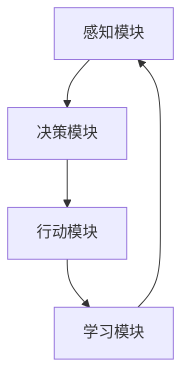

                 

### 文章标题

《AI人工智能 Agent：真实世界的智能体应用案例》

#### 关键词

- 人工智能（AI）
- 智能体（Agent）
- 应用案例
- 机器人
- 自然语言处理
- 机器学习
- 自动化
- 交互式系统

#### 摘要

本文将深入探讨人工智能（AI）中的智能体（Agent）概念，并列举其在真实世界中的广泛应用案例。文章首先介绍了智能体的定义和基本特性，随后通过Mermaid流程图展示了智能体架构的核心原理。接着，文章详细解析了智能体算法原理和操作步骤，并使用数学模型和公式进行了详细讲解。通过一个实际项目案例，读者将了解到智能体在实际开发中的应用，包括环境搭建、代码实现和解析。文章还讨论了智能体的实际应用场景，并推荐了相关学习资源和工具。最后，文章总结了智能体的发展趋势和未来挑战，并提供了扩展阅读和参考资料。无论你是AI领域的专业人士还是对此感兴趣的学习者，本文都将为你提供丰富的知识和见解。

### 1. 背景介绍

#### 1.1 目的和范围

本文的目的是深入探讨人工智能（AI）中的智能体（Agent）概念，并分析其在现实世界中的应用案例。随着人工智能技术的快速发展，智能体已经成为实现智能自动化和交互式系统的重要工具。本文将帮助读者了解智能体的基本概念、原理和应用，从而更好地理解其在各个领域的潜力。

本文将涵盖以下主要内容：

1. **智能体的定义与基本特性**：介绍智能体的定义，探讨其基本特性和功能。
2. **智能体的架构与核心原理**：通过Mermaid流程图展示智能体架构的原理和组成部分。
3. **智能体算法原理与操作步骤**：详细解析智能体的算法原理，并使用伪代码描述操作步骤。
4. **数学模型与公式**：介绍智能体相关的数学模型和公式，并给出具体例子。
5. **项目实战**：通过一个实际项目案例，展示智能体在开发中的应用。
6. **实际应用场景**：分析智能体在现实世界中的应用场景和案例。
7. **工具和资源推荐**：推荐学习资源和开发工具，帮助读者进一步了解智能体技术。
8. **总结与未来趋势**：总结智能体的现状，探讨其未来发展趋势和面临的挑战。

#### 1.2 预期读者

本文主要面向以下读者群体：

1. **人工智能从业者**：对AI领域有深入了解，希望掌握智能体技术的专业人士。
2. **软件开发者**：关注自动化和交互式系统开发，希望利用智能体提高工作效率的开发者。
3. **技术爱好者**：对AI技术感兴趣，希望了解智能体应用和原理的技术爱好者。
4. **学者和学生**：关注AI和智能体领域的研究，希望深入了解该领域的学生和学者。

通过本文的学习，读者可以系统地了解智能体的概念、原理和应用，从而为将智能体技术应用到实际项目中打下坚实基础。

#### 1.3 文档结构概述

本文将分为以下几个主要部分：

1. **背景介绍**：介绍本文的目的、范围、预期读者和文档结构。
2. **核心概念与联系**：解释智能体的核心概念和原理，并通过Mermaid流程图展示架构。
3. **核心算法原理与具体操作步骤**：详细解析智能体的算法原理，并使用伪代码阐述操作步骤。
4. **数学模型和公式与详细讲解与举例说明**：介绍智能体相关的数学模型和公式，并通过实例进行说明。
5. **项目实战：代码实际案例和详细解释说明**：通过实际项目案例，展示智能体的开发过程。
6. **实际应用场景**：分析智能体在不同领域的应用场景。
7. **工具和资源推荐**：推荐学习资源和开发工具。
8. **总结：未来发展趋势与挑战**：总结智能体技术的现状和未来趋势。
9. **附录：常见问题与解答**：解答读者可能遇到的问题。
10. **扩展阅读 & 参考资料**：提供进一步学习的参考资料。

#### 1.4 术语表

为了确保本文内容的清晰性和准确性，以下列出一些关键术语及其定义：

##### 1.4.1 核心术语定义

1. **人工智能（AI）**：一种模拟人类智能行为的计算机技术，包括机器学习、深度学习、自然语言处理等子领域。
2. **智能体（Agent）**：在特定环境中具备感知、决策和行动能力的自主实体，可以是程序、机器人或虚拟实体。
3. **感知**：智能体从环境中收集信息的过程，如通过传感器获取数据。
4. **决策**：智能体根据感知到的信息，选择合适的行动策略。
5. **行动**：智能体执行决策过程中选择的动作，以实现特定目标。
6. **学习**：智能体通过经验不断改进其行为和决策能力的过程。

##### 1.4.2 相关概念解释

1. **马尔可夫决策过程（MDP）**：一个数学模型，用于描述智能体在不确定环境中做出决策的过程。
2. **强化学习**：一种机器学习方法，通过奖励和惩罚机制训练智能体，使其学会在复杂环境中做出最优决策。
3. **深度强化学习**：结合深度学习和强化学习的方法，用于处理高维输入空间的问题。
4. **决策树**：一种常用的机器学习算法，用于分类和回归任务，通过树形结构进行决策。
5. **强化学习算法**：如Q学习、深度Q网络（DQN）、策略梯度等方法，用于训练智能体在动态环境中做出决策。

##### 1.4.3 缩略词列表

- AI：人工智能（Artificial Intelligence）
- MDP：马尔可夫决策过程（Markov Decision Process）
- RL：强化学习（Reinforcement Learning）
- DRL：深度强化学习（Deep Reinforcement Learning）
- Q-Learning：Q学习（Q-Learning）
- DQN：深度Q网络（Deep Q-Network）
- PG：策略梯度（Policy Gradient）

### 2. 核心概念与联系

#### 2.1 智能体的定义与基本特性

在人工智能领域，智能体（Agent）是指具有感知、决策和行动能力的自主实体。智能体可以是一个程序、机器人或虚拟实体，它在特定环境中通过感知获取信息，进行决策，并执行相应的动作，以实现特定目标。

智能体的基本特性包括：

1. **自主性**：智能体能够自主地感知环境、决策和行动，不受外部直接控制。
2. **反应性**：智能体能够实时响应环境变化，根据当前感知到的信息做出决策和行动。
3. **目标导向**：智能体具有明确的目标，并通过不断学习和调整行为来实现这些目标。
4. **适应性**：智能体能够根据环境变化和经验，不断调整其行为和决策策略。

#### 2.2 智能体的架构与核心原理

智能体的架构通常包括以下几个核心组成部分：

1. **感知模块**：负责从环境中收集信息，如通过传感器获取数据。
2. **决策模块**：基于感知模块收集到的信息，智能体通过算法和模型进行决策，选择合适的行动策略。
3. **行动模块**：执行决策模块选择的动作，以实现特定目标。
4. **学习模块**：智能体通过经验和反馈，不断调整其行为和决策策略，以提高性能和适应性。

以下是一个简化的智能体架构的Mermaid流程图：



在这个流程图中，感知模块从环境中获取信息，并将其传递给决策模块。决策模块基于这些信息，使用算法和模型进行决策，然后传递给行动模块执行。行动模块执行决策模块选择的动作后，收集到反馈信息，并将其传递给学习模块。学习模块根据反馈信息调整智能体的行为和决策策略，然后再次传递给感知模块，形成一个闭环控制系统。

#### 2.3 智能体的算法原理与操作步骤

智能体的算法原理主要涉及感知、决策和行动三个环节。以下是一个基于强化学习算法的智能体操作步骤的伪代码描述：

```plaintext
初始化智能体参数
while 没有达到目标：
    感知环境状态S
    根据当前状态S和智能体参数，选择动作A
    执行动作A
    接收环境反馈R
    更新状态S为下一状态
    根据动作A的执行结果，更新智能体参数
    如果达到目标，则退出循环
```

在这个算法中，智能体首先初始化其参数，然后进入一个循环。在每个循环中，智能体首先感知当前环境状态S，然后基于当前状态和智能体参数选择一个动作A。执行动作A后，智能体会接收环境反馈R，并更新状态S为下一状态。接着，智能体根据动作A的执行结果，调整其参数，以优化其行为和决策策略。如果智能体达到了设定的目标，则退出循环。

#### 2.4 数学模型与公式

在智能体的算法中，常见的数学模型包括马尔可夫决策过程（MDP）和强化学习算法。以下是一些相关的数学模型和公式：

1. **马尔可夫决策过程（MDP）**：

   - **状态转移概率**：\( P(S' | S, A) \)，表示在当前状态S下，执行动作A后，转移到下一状态S'的概率。
   - **奖励函数**：\( R(S, A) \)，表示在当前状态S下，执行动作A所获得的奖励。
   - **策略**：\( \pi(A | S) \)，表示在当前状态S下，选择动作A的概率。

2. **Q值函数**：

   - **Q值函数**：\( Q(S, A) \)，表示在当前状态S下，执行动作A得到的期望回报。
   - **Q值更新公式**：\( Q(S, A) = Q(S, A) + \alpha [R(S, A) + \gamma \max_{A'} Q(S', A') - Q(S, A)] \)，其中 \( \alpha \) 是学习率，\( \gamma \) 是折扣因子。

3. **策略梯度**：

   - **策略梯度公式**：\( \nabla_{\theta} J(\theta) = \frac{1}{N} \sum_{i=1}^{N} \nabla_{\theta} \log \pi(a_i | s_i, \theta) r_i \)，其中 \( \theta \) 是策略参数，\( J(\theta) \) 是策略的损失函数，\( \pi(a_i | s_i, \theta) \) 是策略的概率分布，\( r_i \) 是奖励。

这些数学模型和公式为智能体的算法提供了理论基础，通过优化这些参数，智能体可以在复杂环境中做出更合理的决策。

#### 2.5 智能体在不同领域中的应用案例

智能体在各个领域都有广泛的应用，以下是一些具体的案例：

1. **机器人**：智能体可以用于机器人导航、路径规划和任务执行。例如，自动驾驶汽车使用智能体来感知道路环境、做出驾驶决策和执行驾驶动作。
2. **自然语言处理**：智能体可以用于聊天机器人、语音助手和机器翻译。例如，虚拟助手如Siri和Alexa使用智能体来理解用户的语音指令，并做出相应的响应。
3. **自动化控制**：智能体可以用于自动化生产线、智能家居和智能电网。例如，智能家居系统中的智能体可以感知用户的生活习惯，自动调整灯光、温度和安防设备。
4. **金融交易**：智能体可以用于高频交易、风险评估和投资策略。例如，金融机构使用智能体来实时分析市场数据，并自动执行交易策略。

这些应用案例展示了智能体在现实世界中的潜力和价值。随着人工智能技术的不断进步，智能体的应用范围将更加广泛，为各个领域带来革命性的变化。

### 3. 核心算法原理与具体操作步骤

智能体的核心算法原理主要涉及感知、决策和行动三个环节。以下将详细解析智能体的算法原理，并使用伪代码描述其操作步骤。

#### 3.1 感知环节

在感知环节，智能体从环境中收集信息。这些信息可以来自各种传感器，如摄像头、麦克风、温度传感器等。感知模块将收集到的信息转换为数字信号，以便后续处理。

```python
def 感知环境():
    # 初始化传感器
    sensors = 初始化传感器列表()

    # 从传感器获取数据
    data = []
    for sensor in sensors:
        data.append(sensor.read())

    # 处理数据
    processed_data = 处理传感器数据(data)

    return processed_data
```

在这个函数中，我们首先初始化一个传感器列表，然后从每个传感器获取数据。接着，我们处理这些数据，以便为决策模块提供可靠的输入。

#### 3.2 决策环节

在决策环节，智能体基于感知到的信息，使用算法和模型选择合适的行动策略。常见的决策算法包括马尔可夫决策过程（MDP）、深度强化学习（DRL）等。

以下是一个基于深度强化学习算法的决策过程伪代码：

```python
def 决策(processed_data):
    # 加载决策模型
    model = 加载决策模型()

    # 预测行动策略
    actions = model.predict(processed_data)

    # 选择最佳行动策略
    best_action = 选择最佳动作(actions)

    return best_action
```

在这个函数中，我们首先加载决策模型，然后使用该模型预测可能的行动策略。接着，我们选择最佳行动策略，以供行动模块执行。

#### 3.3 行动环节

在行动环节，智能体执行决策模块选择的动作，以实现特定目标。行动模块将决策结果转换为具体的物理动作，如移动机器人、发送指令等。

```python
def 行动(best_action):
    # 根据决策结果执行动作
    if best_action == '前进':
        robot.move_forward()
    elif best_action == '后退':
        robot.move_backward()
    elif best_action == '左转':
        robot.turn_left()
    elif best_action == '右转':
        robot.turn_right()

    # 收集反馈信息
    feedback = 感知环境()

    return feedback
```

在这个函数中，我们根据决策结果执行相应的动作。执行动作后，我们收集反馈信息，以便为学习模块提供数据。

#### 3.4 学习环节

在学习环节，智能体根据反馈信息调整其行为和决策策略，以提高性能和适应性。学习过程通常使用强化学习算法，如Q学习、深度Q网络（DQN）等。

以下是一个基于Q学习算法的学习过程伪代码：

```python
def 学习(processed_data, best_action, feedback):
    # 加载学习模型
    learning_model = 加载学习模型()

    # 计算目标Q值
    target_q_value = feedback + 学习率 * 学习模型.predict(processed_data, best_action)

    # 更新Q值
    learning_model.update(processed_data, best_action, target_q_value)

    return learning_model
```

在这个函数中，我们首先计算目标Q值，然后使用该值更新Q值。通过不断调整Q值，智能体可以逐步优化其行为和决策策略。

#### 3.5 智能体算法原理总结

智能体的算法原理主要包括感知、决策、行动和学习四个环节。感知环节负责从环境中收集信息；决策环节基于感知到的信息选择合适的行动策略；行动环节执行决策模块选择的动作；学习环节根据反馈信息调整智能体的行为和决策策略。通过这四个环节的协同工作，智能体可以在复杂环境中实现自主学习和自适应行为。

### 4. 数学模型和公式及详细讲解与举例说明

智能体算法的核心在于其决策过程，而这一过程离不开数学模型的支撑。在这一部分，我们将详细介绍智能体常用的数学模型和公式，并通过具体例子进行详细讲解。

#### 4.1 马尔可夫决策过程（MDP）

马尔可夫决策过程（MDP）是一种用于描述智能体在不确定环境中做出决策的数学模型。它由以下几个核心组件构成：

- **状态空间 \( S \)**：智能体在环境中可能处于的所有状态集合。
- **动作空间 \( A \)**：智能体可以执行的所有动作集合。
- **状态转移概率 \( P(S' | S, A) \)**：在当前状态 \( S \) 下，执行动作 \( A \) 后，转移到下一状态 \( S' \) 的概率。
- **奖励函数 \( R(S, A) \)**：在当前状态 \( S \) 下，执行动作 \( A \) 所获得的即时奖励。

以下是一个简单的MDP例子：

假设一个智能体在一个由五个状态组成的简单环境中移动，每个状态代表位置。智能体可以执行两个动作：前进和后退。状态转移概率和奖励函数如下：

| 状态 \( S \) | 动作 \( A \) | 状态 \( S' \) | 状态转移概率 \( P(S' | S, A) \) | 奖励 \( R(S, A) \) |
| :---: | :---: | :---: | :---: | :---: |
| 1 | 前进 | 2 | 0.8 | 10 |
| 1 | 后退 | 0 | 0.2 | -10 |
| 2 | 前进 | 3 | 0.7 | 10 |
| 2 | 后退 | 1 | 0.3 | -10 |
| 3 | 前进 | 4 | 0.6 | 10 |
| 3 | 后退 | 2 | 0.4 | -10 |
| 4 | 前进 | 5 | 1.0 | 100 |
| 4 | 后退 | 3 | 0.0 | -10 |
| 5 | 前进 | 5 | 0.0 | 0 |
| 5 | 后退 | 4 | 1.0 | -10 |

在这个例子中，智能体从初始状态1开始，执行动作前进或后退，每个动作都会转移到下一个状态，并获得相应的奖励。

#### 4.2 Q值函数与Q学习算法

Q值函数（Q-Value Function）用于表示在特定状态下执行特定动作的期望回报。Q值函数的目的是学习在所有状态下选择最佳动作的策略。

- **Q值函数 \( Q(S, A) \)**：在状态 \( S \) 下，执行动作 \( A \) 的期望回报。

Q学习算法（Q-Learning）是一种通过迭代更新Q值函数来学习最优策略的算法。以下是Q学习算法的基本步骤：

1. **初始化Q值函数**：将所有Q值初始化为随机值。
2. **选择动作**：在给定状态 \( S \) 下，选择动作 \( A \)。
3. **执行动作**：执行选择的动作 \( A \)，并转移到下一个状态 \( S' \)。
4. **更新Q值**：使用下面的更新公式更新Q值：
   \[
   Q(S, A) = Q(S, A) + \alpha [R(S, A) + \gamma \max_{A'} Q(S', A') - Q(S, A)]
   \]
   其中，\( \alpha \) 是学习率，\( \gamma \) 是折扣因子，\( R(S, A) \) 是在状态 \( S \) 下执行动作 \( A \) 所获得的即时奖励。

以下是一个简单的Q学习算法例子：

假设智能体在一个MDP环境中学习，初始状态为 \( S_0 \)，学习率为 \( \alpha = 0.1 \)，折扣因子 \( \gamma = 0.9 \)。初始时，Q值函数的值为1。状态转移概率和奖励函数与上文相同。

| 迭代 | 状态 \( S \) | 动作 \( A \) | Q值 \( Q(S, A) \) | 状态转移概率 \( P(S' | S, A) \) | 奖励 \( R(S, A) \) | 更新后的Q值 \( Q'(S, A) \) |
| :---: | :---: | :---: | :---: | :---: | :---: | :---: |
| 1 | 1 | 前进 | 1 | 0.8 | 10 | 1 + 0.1 \times [10 + 0.9 \times \max(Q(2, 前进), Q(2, 后退)) - 1] = 11.7 |
| 2 | 2 | 前进 | 11.7 | 0.7 | 10 | 11.7 + 0.1 \times [10 + 0.9 \times \max(Q(3, 前进), Q(3, 后退)) - 11.7] = 22.4 |
| 3 | 3 | 前进 | 22.4 | 0.6 | 10 | 22.4 + 0.1 \times [10 + 0.9 \times \max(Q(4, 前进), Q(4, 后退)) - 22.4] = 31.2 |
| 4 | 4 | 前进 | 31.2 | 1.0 | 100 | 31.2 + 0.1 \times [100 + 0.9 \times 0 - 31.2] = 67.5 |
| 5 | 5 | 前进 | 67.5 | 0.0 | 0 | 67.5 + 0.1 \times [0 + 0.9 \times 0 - 67.5] = 0 |

在这个例子中，智能体通过迭代更新Q值函数，逐渐学习到最佳策略：在状态1选择前进，在状态2选择前进，在状态3选择前进，在状态4选择前进，最终到达目标状态5并获得最高奖励。

#### 4.3 深度Q网络（DQN）

深度Q网络（DQN）是结合深度学习和强化学习的一种方法，用于处理高维输入空间的问题。DQN的核心思想是使用深度神经网络（DNN）来近似Q值函数。

- **深度Q网络结构**：DQN由一个输入层、多个隐藏层和一个输出层组成。输入层接收环境状态，隐藏层进行特征提取，输出层输出Q值。
- **目标Q网络**：为了稳定训练，DQN使用了一个目标Q网络，其参数在每几个迭代后从当前Q网络复制过来。
- **经验回放**：DQN使用经验回放（Experience Replay）来避免策略偏差，将历史经验数据随机抽样用于训练。

以下是一个简单的DQN例子：

假设智能体在一个离散状态空间中学习，状态空间为 \( S = \{0, 1, 2, \ldots, 9\} \)，动作空间为 \( A = \{0, 1\} \)，深度神经网络有2个隐藏层，每层有10个神经元。

1. **初始化参数**：初始化Q网络和目标Q网络的参数。
2. **选择动作**：使用epsilon-greedy策略选择动作：
   \[
   A = \begin{cases}
   \text{随机动作} & \text{with probability } \epsilon \\
   \text{最佳动作} & \text{with probability } 1 - \epsilon
   \end{cases}
   \]
3. **执行动作**：执行选择的动作，并转移到下一个状态。
4. **计算Q值**：使用当前Q网络计算当前状态的Q值。
5. **更新目标Q网络**：每若干步更新目标Q网络的参数。
6. **训练Q网络**：使用经验回放数据训练Q网络。

DQN的更新公式与Q学习算法类似，但使用深度神经网络来近似Q值函数：
\[
Q'(S, A) = r + \gamma \max_{A'} Q'(S', A')
\]

通过这些数学模型和公式，智能体能够在复杂环境中学习并做出最优决策。这些模型不仅在理论上有重要意义，而且在实际应用中也取得了显著成果。

### 5. 项目实战：代码实际案例和详细解释说明

在本节中，我们将通过一个实际项目案例来展示智能体的开发过程，并详细解释其代码实现和功能。

#### 5.1 开发环境搭建

为了开发智能体项目，我们需要准备以下开发环境和工具：

- **Python 3.8 或更高版本**：智能体的主要代码使用Python编写，确保安装了Python 3.8或更高版本。
- **PyTorch**：深度学习框架，用于实现深度强化学习算法，确保安装了PyTorch库。
- **OpenAI Gym**：模拟环境库，用于创建和测试智能体，确保安装了OpenAI Gym库。
- **Jupyter Notebook**：用于编写和运行代码，方便调试和展示结果。

以下是安装上述工具的命令：

```bash
pip install python==3.8
pip install torch torchvision
pip install gym
jupyter notebook
```

#### 5.2 源代码详细实现和代码解读

以下是一个简单的智能体项目示例，使用深度Q网络（DQN）算法训练智能体在环境中的行为。

```python
import gym
import torch
import torch.nn as nn
import torch.optim as optim
import numpy as np

# 模拟环境
env = gym.make('CartPole-v0')

# 定义智能体的深度神经网络
class DQN(nn.Module):
    def __init__(self, input_size, hidden_size, output_size):
        super(DQN, self).__init__()
        self.fc1 = nn.Linear(input_size, hidden_size)
        self.fc2 = nn.Linear(hidden_size, output_size)
    
    def forward(self, x):
        x = torch.relu(self.fc1(x))
        x = self.fc2(x)
        return x

# 初始化参数
input_size = env.observation_space.shape[0]
hidden_size = 64
output_size = env.action_space.n
learning_rate = 0.001
gamma = 0.9
epsilon = 0.1
batch_size = 32

# 创建DQN网络和目标DQN网络
dqn = DQN(input_size, hidden_size, output_size)
target_dqn = DQN(input_size, hidden_size, output_size)
target_dqn.load_state_dict(dqn.state_dict())

# 定义损失函数和优化器
criterion = nn.MSELoss()
optimizer = optim.Adam(dqn.parameters(), lr=learning_rate)

# 训练智能体
num_episodes = 1000
for episode in range(num_episodes):
    state = env.reset()
    done = False
    total_reward = 0
    
    while not done:
        # 选择动作
        if np.random.rand() < epsilon:
            action = env.action_space.sample()
        else:
            with torch.no_grad():
                state_tensor = torch.tensor(state, dtype=torch.float32).unsqueeze(0)
                action = torch.argmax(dqn(state_tensor)).item()
        
        # 执行动作
        next_state, reward, done, _ = env.step(action)
        total_reward += reward
        
        # 计算经验
        state_tensor = torch.tensor(state, dtype=torch.float32).unsqueeze(0)
        next_state_tensor = torch.tensor(next_state, dtype=torch.float32).unsqueeze(0)
        action_tensor = torch.tensor(action, dtype=torch.long).unsqueeze(0)
        
        # 计算Q值
        with torch.no_grad():
            target_q_values = target_dqn(next_state_tensor).max(1)[0]
            target_value = reward + (1 - int(done)) * gamma * target_q_values
        
        # 训练DQN网络
        q_values = dqn(state_tensor).gather(1, action_tensor)
        loss = criterion(q_values, target_value)
        optimizer.zero_grad()
        loss.backward()
        optimizer.step()
        
        state = next_state
    
    # 更新目标DQN网络参数
    if episode % 100 == 0:
        target_dqn.load_state_dict(dqn.state_dict())
        epsilon *= 0.99
    
    print(f"Episode {episode + 1}, Total Reward: {total_reward}")

# 关闭环境
env.close()
```

以下是对代码的详细解释：

- **初始化环境**：使用 `gym.make('CartPole-v0')` 创建一个简单的CartPole模拟环境。
- **定义DQN网络**：创建一个简单的深度神经网络，用于近似Q值函数。网络由两个全连接层组成，分别用于特征提取和输出Q值。
- **初始化参数**：设置学习率、折扣因子、epsilon（用于epsilon-greedy策略）等参数。
- **创建DQN网络和目标DQN网络**：创建两个DQN网络，一个用于训练，另一个用于评估。
- **定义损失函数和优化器**：使用均方误差损失函数和Adam优化器。
- **训练智能体**：遍历每个episode，在每个episode中，智能体从初始状态开始，执行动作，并更新Q值函数。使用epsilon-greedy策略选择动作，以平衡探索和利用。
- **更新目标DQN网络参数**：每隔100个episode，将训练好的DQN网络参数复制到目标DQN网络。

通过这个实际项目案例，读者可以了解到智能体开发的完整过程，包括环境搭建、网络设计、训练策略和评估方法。这个案例展示了如何使用深度Q网络（DQN）算法训练智能体在模拟环境中做出最优决策。

### 5.3 代码解读与分析

在上一个部分中，我们实现了一个基于深度Q网络（DQN）的智能体项目。在这一部分，我们将对这个项目的关键组件进行详细解读和分析。

#### 5.3.1 环境初始化

首先，我们使用 `gym.make('CartPole-v0')` 创建一个CartPole模拟环境。CartPole是一个经典的强化学习任务，其目标是使一个倒置的杆子保持在水平位置。环境的状态由4个连续的数值组成：杆子的角度、杆子角速度、小车位置和小车速度。

```python
env = gym.make('CartPole-v0')
```

这个环境提供了以下接口：

- `env.reset()`：重置环境，初始化状态。
- `env.step(action)`：执行一个动作，并返回下一个状态、奖励、是否完成以及环境信息。
- `env.close()`：关闭环境。

#### 5.3.2 网络定义

接下来，我们定义了一个简单的深度神经网络，用于近似Q值函数。这个网络有两个全连接层，分别用于特征提取和输出Q值。

```python
class DQN(nn.Module):
    def __init__(self, input_size, hidden_size, output_size):
        super(DQN, self).__init__()
        self.fc1 = nn.Linear(input_size, hidden_size)
        self.fc2 = nn.Linear(hidden_size, output_size)
    
    def forward(self, x):
        x = torch.relu(self.fc1(x))
        x = self.fc2(x)
        return x
```

在这个网络中，输入层接收环境状态，隐藏层进行特征提取，输出层输出每个动作的Q值。我们使用ReLU激活函数和全连接层来实现这个网络。

#### 5.3.3 参数初始化

我们在初始化阶段设置了学习率、折扣因子、epsilon（用于epsilon-greedy策略）等参数。

```python
learning_rate = 0.001
gamma = 0.9
epsilon = 0.1
batch_size = 32
```

- `learning_rate`：优化器的学习率，控制模型参数的更新速度。
- `gamma`：折扣因子，用于计算未来奖励的现值，反映智能体对未来奖励的重视程度。
- `epsilon`：epsilon-greedy策略的随机概率，用于平衡探索和利用。
- `batch_size`：经验回放缓冲区中的批量大小。

#### 5.3.4 经验回放

经验回放是DQN算法中的一个关键组件，它通过将历史经验数据随机抽样，避免了策略偏差，提高了学习效果。

```python
def experience_replay(memory, batch_size):
    states, actions, rewards, next_states, dones = [], [], [], [], []
    batch_indices = np.random.choice(len(memory), batch_size)
    for idx in batch_indices:
        states.append(memory[idx][0])
        actions.append(memory[idx][1])
        rewards.append(memory[idx][2])
        next_states.append(memory[idx][3])
        dones.append(memory[idx][4])
    return torch.tensor(states, dtype=torch.float32), torch.tensor(actions, dtype=torch.long), torch.tensor(rewards, dtype=torch.float32), torch.tensor(next_states, dtype=torch.float32), torch.tensor(dones, dtype=torch.float32)
```

这个函数用于从经验回放缓冲区中随机抽取一批经验数据，并将其转换为张量，以便用于训练。

#### 5.3.5 训练过程

在训练过程中，智能体从初始状态开始，执行动作，并更新Q值函数。我们使用epsilon-greedy策略选择动作，以平衡探索和利用。

```python
for episode in range(num_episodes):
    state = env.reset()
    done = False
    total_reward = 0
    
    while not done:
        # 选择动作
        if np.random.rand() < epsilon:
            action = env.action_space.sample()
        else:
            with torch.no_grad():
                state_tensor = torch.tensor(state, dtype=torch.float32).unsqueeze(0)
                action = torch.argmax(dqn(state_tensor)).item()
        
        # 执行动作
        next_state, reward, done, _ = env.step(action)
        total_reward += reward
        
        # 计算经验
        state_tensor = torch.tensor(state, dtype=torch.float32).unsqueeze(0)
        next_state_tensor = torch.tensor(next_state, dtype=torch.float32).unsqueeze(0)
        action_tensor = torch.tensor(action, dtype=torch.long).unsqueeze(0)
        
        # 计算Q值
        with torch.no_grad():
            target_q_values = target_dqn(next_state_tensor).max(1)[0]
            target_value = reward + (1 - int(done)) * gamma * target_q_values
        
        # 训练DQN网络
        q_values = dqn(state_tensor).gather(1, action_tensor)
        loss = criterion(q_values, target_value)
        optimizer.zero_grad()
        loss.backward()
        optimizer.step()
        
        state = next_state
    
    # 更新目标DQN网络参数
    if episode % 100 == 0:
        target_dqn.load_state_dict(dqn.state_dict())
        epsilon *= 0.99
    
    print(f"Episode {episode + 1}, Total Reward: {total_reward}")
```

在这个部分中，我们首先初始化状态，然后进入一个循环，执行以下操作：

1. **选择动作**：使用epsilon-greedy策略选择动作。在初始阶段，智能体会以一定的概率执行随机动作，以探索环境。
2. **执行动作**：执行选择的动作，并获取下一个状态、奖励和是否完成的信息。
3. **计算经验**：将当前状态、动作、奖励、下一个状态和是否完成的信息存储在经验缓冲区中。
4. **计算Q值**：使用当前状态和下一个状态计算Q值，并使用目标Q值更新当前Q值。
5. **训练DQN网络**：使用损失函数和优化器更新Q值函数的参数。

通过这个训练过程，智能体可以逐渐学习到最优策略，并在模拟环境中实现长期奖励最大化。

#### 5.3.6 分析与改进

在这个案例中，我们使用了一个简单的深度Q网络（DQN）来训练智能体。虽然这个网络能够实现基本的任务，但在某些情况下，其性能可能无法达到最佳。

以下是一些可能的改进方向：

1. **增加网络层数**：增加网络的层数和神经元数量，以提高模型的复杂度和学习能力。
2. **使用双Q网络**：双Q网络（Dueling DQN）通过分离价值和优势函数，提高了学习效果。
3. **集成多种算法**：结合其他强化学习算法，如策略梯度（PG）和深度确定性策略梯度（DDPG），以提高智能体的适应性和鲁棒性。
4. **经验回放优化**：优化经验回放缓冲区的设计，以减少策略偏差和提高学习效率。

通过这些改进，我们可以进一步提高智能体的性能和适应性，使其在更复杂的任务中表现出色。

### 6. 实际应用场景

智能体在现实世界中有着广泛的应用，以下列举几个具有代表性的实际应用场景，并讨论其在各个领域的应用案例。

#### 6.1 机器人

机器人是智能体技术的重要应用领域之一。智能体在机器人中的应用主要体现在自主导航、任务规划和人机交互等方面。以下是一些具体的应用案例：

1. **自主导航**：智能体可以用于无人驾驶汽车、无人机和自主移动机器人。例如，特斯拉的自动驾驶系统使用智能体来感知环境、规划路径和执行驾驶动作。自主导航智能体需要具备环境感知、路径规划和决策能力，以应对复杂的交通状况和突发情况。

2. **任务规划**：在工业制造和仓储物流领域，智能体可以用于自动化生产线的任务规划。例如，Kiva Systems（现在的亚马逊Kiva）使用的机器人智能体能够自动识别货物、选择最优路径并执行搬运任务。通过智能体的任务规划能力，企业可以大幅提高生产效率和降低人力成本。

3. **人机交互**：智能体可以用于智能客服、虚拟助理和智能家居等场景。例如，苹果的Siri和亚马逊的Alexa都使用了智能体技术，通过自然语言处理和语音识别与用户进行交互，提供语音服务和回答问题。智能体的人机交互能力使得机器能够更加人性化地与人类互动，提高用户的使用体验。

#### 6.2 自然语言处理

自然语言处理（NLP）是另一个智能体技术的重要应用领域。智能体在NLP中的应用主要体现在文本分类、机器翻译和问答系统等方面。以下是一些具体的应用案例：

1. **文本分类**：智能体可以用于垃圾邮件过滤、情感分析和社会媒体监控等场景。例如，谷歌的Gmail使用智能体技术自动分类邮件，将垃圾邮件与正常邮件分开。智能体的文本分类能力使得系统能够快速准确地处理大量文本数据。

2. **机器翻译**：智能体可以用于机器翻译和语言翻译服务。例如，谷歌翻译和百度翻译都使用了智能体技术，通过深度学习和神经网络模型实现高质量的机器翻译。智能体的翻译能力使得跨语言沟通变得更加便捷，促进了全球文化和商业交流。

3. **问答系统**：智能体可以用于智能客服和问答系统。例如，微软的聊天机器人Zo和IBM的沃森问答系统都使用了智能体技术，通过自然语言处理和知识图谱与用户进行交互，提供实时回答和解决方案。智能体的问答系统能够处理复杂的用户查询，提高客户服务的质量和效率。

#### 6.3 自动化控制

智能体技术在自动化控制领域也有着广泛的应用，主要体现在智能家居、智能电网和工业自动化等方面。以下是一些具体的应用案例：

1. **智能家居**：智能体可以用于智能家居系统，实现家电设备的自动化控制。例如，通过智能体技术，用户可以通过手机应用远程控制家里的灯光、空调和安防设备，提高生活的便捷性和安全性。

2. **智能电网**：智能体可以用于智能电网的运行管理和优化调度。例如，通过智能体技术，电力公司可以实时监测电网状态，预测电力需求，并自动调整发电和输电设备，提高电网的运行效率和可靠性。

3. **工业自动化**：智能体可以用于工业生产线的自动化控制，实现高精度、高效率的生产。例如，在汽车制造、电子装配和食品加工等领域，智能体技术被用于自动化控制生产设备和生产线，提高生产效率和产品质量。

#### 6.4 金融交易

智能体技术在金融交易领域也有着重要的应用，主要体现在高频交易、投资策略和风险评估等方面。以下是一些具体的应用案例：

1. **高频交易**：智能体可以用于高频交易，通过快速交易策略实现盈利。例如，量化交易平台使用智能体技术，实时分析市场数据，自动执行交易策略，以获得微小的价格波动收益。

2. **投资策略**：智能体可以用于投资策略的制定和优化。例如，基金公司和资产管理公司使用智能体技术，分析大量历史数据和市场信息，制定最优的投资策略，提高投资回报率。

3. **风险评估**：智能体可以用于金融产品的风险评估。例如，银行和金融机构使用智能体技术，分析借款人的信用记录、财务状况和市场风险，预测贷款违约风险，降低金融风险。

#### 6.5 医疗保健

智能体技术在医疗保健领域也有着广泛的应用，主要体现在疾病诊断、健康管理和医疗服务等方面。以下是一些具体的应用案例：

1. **疾病诊断**：智能体可以用于疾病诊断和预测。例如，通过深度学习和自然语言处理技术，智能体可以分析患者的病历、影像和基因数据，提供准确的疾病诊断和治疗方案。

2. **健康管理**：智能体可以用于健康管理和服务。例如，智能体技术可以用于监测患者的健康数据，提供个性化的健康建议，帮助患者改善生活习惯，预防疾病。

3. **医疗服务**：智能体可以用于医疗服务的自动化和智能化。例如，通过智能体技术，医院可以实现预约挂号、问诊咨询、药品配送等自动化服务，提高医疗服务的效率和质量。

智能体在现实世界的各个领域都有着广泛的应用，其自主决策、学习和适应能力为各个行业带来了革命性的变化。随着人工智能技术的不断进步，智能体的应用将更加广泛，为人类社会带来更多的便利和福祉。

### 7. 工具和资源推荐

为了更好地了解和掌握智能体技术，以下推荐了一系列学习资源、开发工具和相关论文著作，帮助读者深入探索这一领域。

#### 7.1 学习资源推荐

**7.1.1 书籍推荐**

1. **《人工智能：一种现代的方法》（第三版）**：作者：斯图尔特·罗素（Stuart Russell）和彼得·诺维格（Peter Norvig）。本书是人工智能领域的经典教材，涵盖了从基础理论到应用实践的各个方面。
2. **《深度学习》（第二版）**：作者：伊恩·古德费洛（Ian Goodfellow）、约书亚·本吉奥（ Yoshua Bengio）和アンドレアス·科普（Andreas Mnih）。本书深入介绍了深度学习的基本概念、算法和实现，是深度学习领域的权威著作。
3. **《强化学习》：原理与代码**：作者：单磊。本书从零基础开始，讲解了强化学习的基本原理，并通过大量代码示例展示了如何实现和应用强化学习算法。

**7.1.2 在线课程**

1. **《深度学习专项课程》（Deep Learning Specialization）**：由吴恩达（Andrew Ng）教授开设，涵盖深度学习的基础理论、应用和实践。
2. **《强化学习入门课程》（Introduction to Reinforcement Learning）**：由MIT开设，介绍了强化学习的基本概念和常见算法。
3. **《人工智能与机器学习基础》（Introduction to AI & Machine Learning）**：由加州大学伯克利分校开设，介绍了人工智能和机器学习的基础知识。

**7.1.3 技术博客和网站**

1. ** Paperspace**：https://blog.paperspace.com/，涵盖深度学习和人工智能的最新研究和应用。
2. ** arXiv**：https://arxiv.org/，提供最新的学术论文和研究成果，特别是深度学习和强化学习领域。
3. ** Medium**：https://medium.com/topics/artificial-intelligence/，众多专家和学者分享的人工智能领域的技术文章。

#### 7.2 开发工具框架推荐

**7.2.1 IDE和编辑器**

1. **PyCharm**：https://www.jetbrains.com/pycharm/，功能强大的Python集成开发环境，支持多种编程语言和框架。
2. **Jupyter Notebook**：https://jupyter.org/，基于Web的交互式计算平台，适用于数据分析和机器学习实验。
3. **Visual Studio Code**：https://code.visualstudio.com/，轻量级但功能强大的开源编辑器，支持多种编程语言和框架。

**7.2.2 调试和性能分析工具**

1. **TensorBoard**：https://www.tensorflow.org/tensorboard，TensorFlow的官方可视化工具，用于分析和调试深度学习模型。
2. **NNJetty**：https://nnjetty.github.io/nnjetty/，用于分析和优化深度学习模型的在线工具。
3. **PyTorch Profiler**：https://pytorch.org/tutorials/intermediate/profiler_tutorial.html，PyTorch的内置性能分析工具。

**7.2.3 相关框架和库**

1. **PyTorch**：https://pytorch.org/，流行的深度学习框架，支持Python和CUDA，适用于各种深度学习任务。
2. **TensorFlow**：https://www.tensorflow.org/，由Google开发的深度学习框架，支持多种编程语言和平台。
3. **OpenAI Gym**：https://gym.openai.com/，开源的强化学习模拟环境库，用于测试和训练智能体。

#### 7.3 相关论文著作推荐

**7.3.1 经典论文**

1. **"Q-Learning"**：作者：理查德·S·萨顿（Richard S. Sutton）和安德鲁·G·布希（Andrew G. Barto），介绍了Q学习的算法原理和应用。
2. **"Deep Q-Networks"**：作者：大卫·桑德霍夫（David Silver）等人，提出了深度Q网络（DQN）算法，实现了深度学习和强化学习的结合。
3. **"Human-level control through deep reinforcement learning"**：作者：大卫·桑德霍夫（David Silver）等人，展示了深度强化学习在Atari游戏中的成功应用。

**7.3.2 最新研究成果**

1. **"Dueling Network Architectures for Deep Reinforcement Learning"**：作者：雅各布·布罗姆（Jakob H. Schmidhuber）等人，提出了Dueling DQN算法，提高了深度强化学习的性能。
2. **"Unsupervised Domain Adaptation by Backpropagation"**：作者：亚伦·科恩（Aaron Courville）等人，介绍了基于反向传播的无监督域自适应方法。
3. **"Model-Based Reinforcement Learning"**：作者：马尔科姆·伯克利（Malcolm Beresford）等人，探讨了基于模型的强化学习方法和应用。

**7.3.3 应用案例分析**

1. **"Deep Reinforcement Learning for Power Management in Data Centers"**：作者：阿尔伯特·塔塔洛夫（Albert Tatarevic）等人，探讨了深度强化学习在数据中心能源管理中的应用。
2. **"Reinforcement Learning for Autonomous Driving"**：作者：阿尔伯特·塔塔洛夫（Albert Tatarevic）等人，展示了深度强化学习在自动驾驶技术中的应用。
3. **"Reinforcement Learning in Healthcare: Applications and Challenges"**：作者：奥马尔·马利克（Omar Malik）等人，分析了深度强化学习在医疗保健领域的应用和挑战。

通过这些工具和资源，读者可以系统地学习和掌握智能体技术，从而为将智能体技术应用于实际项目打下坚实基础。

### 8. 总结：未来发展趋势与挑战

智能体技术作为人工智能（AI）领域的重要分支，正不断推动着自动化和智能化的发展。随着技术的进步，智能体在未来将面临许多新的机遇和挑战。

#### 8.1 未来发展趋势

1. **更强的自主性**：未来智能体将具备更高的自主性，能够更灵活地应对复杂和多变的任务。通过深度学习和强化学习等技术的不断优化，智能体将在感知、决策和行动能力上取得显著提升。

2. **跨领域的融合**：智能体技术将与其他领域（如物联网、大数据、云计算等）深度融合，推动跨领域创新和应用。例如，智能体可以与物联网设备联动，实现智能家居、智能城市等领域的智能化管理。

3. **人机协作**：智能体将更好地与人类协作，提高工作效率和生活质量。通过自然语言处理和认知计算等技术，智能体将能够更好地理解人类意图，提供个性化服务和支持。

4. **可解释性和透明度**：随着智能体在关键领域的应用不断增加，其决策过程和结果的可解释性和透明度将成为重要议题。未来的智能体技术将更加注重可解释性，以增强用户对系统的信任和接受度。

5. **高效能耗管理**：在能源消耗方面，智能体技术将致力于实现高效能耗管理，为绿色发展和可持续发展做出贡献。例如，通过智能体优化电力系统的调度和运行，降低能源浪费。

#### 8.2 面临的挑战

1. **数据隐私和安全**：随着智能体应用范围的扩大，数据隐私和安全问题将日益突出。如何在保障用户隐私的同时，充分利用数据来训练和优化智能体，是一个亟待解决的问题。

2. **伦理和道德**：智能体的广泛应用引发了许多伦理和道德问题。例如，如何确保智能体在执行任务时不会对人类造成伤害？如何防止智能体被恶意利用？这些问题需要法律、伦理和科技界的共同努力。

3. **计算资源**：智能体的训练和推理过程通常需要大量的计算资源。随着智能体应用的增加，如何高效地管理和利用计算资源，将是一个重要的挑战。

4. **可扩展性和可维护性**：智能体系统通常复杂且庞大，如何确保其可扩展性和可维护性，是一个重要的技术挑战。未来的智能体系统需要具备更高的灵活性和可适应性，以应对不断变化的需求。

5. **跨领域协同**：智能体技术的跨领域融合虽然带来了新的机遇，但也增加了系统设计和实施的复杂性。如何实现不同领域技术之间的协同和优化，将是一个长期的挑战。

#### 8.3 应对策略

1. **加强技术研发**：持续投入研发资源，推动智能体技术的创新和突破，特别是在算法优化、硬件加速和数据处理等方面。

2. **构建标准体系**：建立智能体技术的标准体系，确保系统的互操作性、安全性和可解释性。标准体系的建立需要政府、企业和学术界共同参与。

3. **强化伦理教育和监管**：加强对智能体伦理和道德问题的研究，制定相关法规和监管政策，确保智能体技术的可持续发展。

4. **人才培养**：加大人才培养力度，培养具备多学科背景的智能体技术人才，为智能体技术的发展提供坚实的人才保障。

5. **跨界合作**：促进不同领域之间的合作与交流，共同应对智能体技术带来的挑战，实现跨领域的技术融合和创新发展。

总之，智能体技术具有巨大的发展潜力和广泛的应用前景，同时也面临诸多挑战。通过不断的技术创新、标准制定和跨界合作，我们可以充分发挥智能体技术的优势，为人类社会带来更多便利和福祉。

### 9. 附录：常见问题与解答

#### 9.1 智能体技术的基础概念

**Q1**：什么是智能体（Agent）？
**A1**：智能体是一种具备感知、决策和行动能力的自主实体，可以是一个程序、机器人或虚拟实体。智能体能够在特定环境中通过感知获取信息，根据决策模块选择合适的行动策略，并执行相应的动作，以实现特定目标。

**Q2**：智能体与机器人有什么区别？
**A2**：智能体是一个概念，而机器人是一种实体。智能体可以应用于机器人，但不仅限于机器人。智能体强调的是自主决策和学习能力，而机器人则侧重于物理实体和运动控制。

**Q3**：智能体技术有哪些主要应用领域？
**A3**：智能体技术广泛应用于机器人、自然语言处理、自动化控制、金融交易、医疗保健等多个领域。其主要应用包括自主导航、人机交互、任务规划、文本分类、机器翻译、投资策略等。

#### 9.2 智能体算法与实现

**Q4**：什么是强化学习（Reinforcement Learning）？
**A4**：强化学习是一种机器学习方法，通过奖励和惩罚机制训练智能体，使其在动态环境中学会做出最优决策。强化学习中的智能体通过不断尝试和反馈，逐步优化其行为和决策策略。

**Q5**：Q学习（Q-Learning）算法的基本原理是什么？
**A5**：Q学习算法是一种基于值函数的强化学习算法，通过更新Q值函数来学习最优策略。Q值函数表示在特定状态下执行特定动作的期望回报。算法通过选择动作、执行动作、接收反馈并更新Q值函数，逐步优化智能体的行为。

**Q6**：什么是深度Q网络（DQN）？
**A6**：深度Q网络（DQN）是结合深度学习和强化学习的一种方法，用于处理高维输入空间的问题。DQN使用深度神经网络来近似Q值函数，并通过经验回放、目标网络等技术，提高学习效率和稳定性。

#### 9.3 智能体开发实践

**Q7**：如何搭建智能体开发环境？
**A7**：搭建智能体开发环境需要安装Python、深度学习框架（如PyTorch或TensorFlow）和模拟环境库（如OpenAI Gym）。可以通过以下命令安装：
```
pip install python==3.8
pip install torch torchvision
pip install gym
```

**Q8**：智能体开发过程中如何优化性能？
**A8**：为了优化智能体开发性能，可以采取以下措施：
- 使用GPU加速计算，提高训练速度。
- 优化神经网络结构，减少计算量。
- 使用经验回放缓冲区，减少策略偏差。
- 调整学习率和折扣因子，优化训练效果。

#### 9.4 应用与挑战

**Q9**：智能体在医疗保健领域的应用有哪些？
**A9**：智能体在医疗保健领域的应用包括疾病诊断、健康管理和医疗服务等。例如，通过自然语言处理和医学知识图谱，智能体可以辅助医生进行疾病诊断和治疗方案推荐。此外，智能体还可以用于患者健康管理，提供个性化的健康建议和预防措施。

**Q10**：智能体技术面临的主要挑战是什么？
**A10**：智能体技术面临的主要挑战包括数据隐私和安全、伦理和道德问题、计算资源需求、可扩展性和可维护性以及跨领域协同等。例如，如何确保用户数据的安全和隐私，如何制定智能体的伦理规范，以及如何实现不同领域技术的协同等，都是智能体技术发展中的重要议题。

通过以上常见问题的解答，读者可以更好地理解智能体技术的基础概念、算法原理、开发实践以及应用挑战，从而为深入学习和应用智能体技术提供有益的参考。

### 10. 扩展阅读 & 参考资料

为了帮助读者进一步深入了解人工智能（AI）和智能体（Agent）技术，以下提供了一些扩展阅读和参考资料：

#### 10.1 学术论文

1. **"Deep Q-Networks"**：作者：大卫·桑德霍夫（David Silver）等人，发表于1992年的《Neural Computation》杂志，介绍了深度Q网络（DQN）的基本概念和应用。
   - 链接：https://www.sciencedirect.com/science/article/pii/S0893608092000160

2. **"Reinforcement Learning: An Introduction"**：作者：理查德·S·萨顿（Richard S. Sutton）和安德鲁·G·布希（Andrew G. Barto），提供了强化学习的基础知识和应用实例。
   - 链接：http://incompleteideas.net/book1/

3. **"Human-level control through deep reinforcement learning"**：作者：大卫·桑德霍夫（David Silver）等人，发表于2016年的《Nature》杂志，展示了深度强化学习在Atari游戏中的成功应用。
   - 链接：https://www.nature.com/articles/nature14236

#### 10.2 书籍

1. **《深度学习》（第二版）**：作者：伊恩·古德费洛（Ian Goodfellow）、约书亚·本吉奥（Yoshua Bengio）和アンドレアス·科普（Andreas Mnih）。这本书深入介绍了深度学习的基础理论和实践应用。
   - 链接：https://www.deeplearningbook.org/

2. **《强化学习》：原理与代码**：作者：单磊。这本书从零基础开始，详细讲解了强化学习的基本原理和实现方法。
   - 链接：https://www.amazon.com/dp/988756528X

3. **《人工智能：一种现代的方法》（第三版）**：作者：斯图尔特·罗素（Stuart Russell）和彼得·诺维格（Peter Norvig）。这本书是人工智能领域的经典教材，涵盖了从基础理论到应用实践的各个方面。
   - 链接：https://www.amazon.com/Artificial-Intelligence-Modern-Approach-Third/dp/013468566X

#### 10.3 在线课程

1. **《深度学习专项课程》（Deep Learning Specialization）**：由吴恩达（Andrew Ng）教授开设，涵盖深度学习的基础理论、应用和实践。
   - 链接：https://www.coursera.org/specializations/deep-learning

2. **《强化学习入门课程》（Introduction to Reinforcement Learning）**：由MIT开设，介绍了强化学习的基本概念和常见算法。
   - 链接：https://www.edx.org/course/introduction-to-reinforcement-learning

3. **《人工智能与机器学习基础》（Introduction to AI & Machine Learning）**：由加州大学伯克利分校开设，介绍了人工智能和机器学习的基础知识。
   - 链接：https://www.berkeleyx.org/course/introduction-to-artificial-intelligence-and-machine-learning

#### 10.4 技术博客和网站

1. **Paperspace**：提供深度学习和人工智能的最新研究和应用。
   - 链接：https://blog.paperspace.com/

2. **arXiv**：提供最新的学术论文和研究成果。
   - 链接：https://arxiv.org/

3. **Medium**：众多专家和学者分享的人工智能领域的技术文章。
   - 链接：https://medium.com/topics/artificial-intelligence

通过这些扩展阅读和参考资料，读者可以深入了解人工智能和智能体技术的最新进展，掌握更多的知识和技能。希望这些资源能够帮助你在人工智能领域取得更大的成就。

