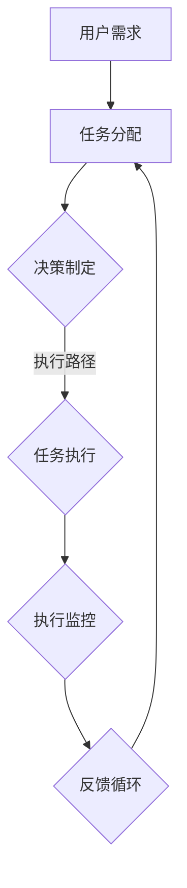

                 

# AI人工智能代理工作流 AI Agent WorkFlow：从普通流程到AI Agent工作流的理解

> **关键词：** AI代理，工作流，流程管理，人工智能，自动化，流程优化

> **摘要：** 本文旨在深入探讨AI代理工作流的本质及其在现代社会中的重要性。首先，我们将回顾传统的工作流程，然后定义AI代理及其工作流的概念。接下来，文章将逐步解释AI代理工作流的核心组成部分，包括任务分配、决策制定、执行监控和反馈循环。此外，文章还将通过数学模型和具体案例分析，阐述AI代理工作流的实现细节。最后，我们将讨论AI代理工作流在实际应用中的场景，推荐相关资源和工具，并总结未来发展趋势与挑战。

## 1. 背景介绍

### 1.1 目的和范围

本文的主要目的是帮助读者理解AI代理工作流的概念、组成部分和实现细节。我们将通过理论和实践相结合的方式，详细阐述AI代理工作流在现代流程管理中的应用和价值。文章将涵盖以下内容：

- AI代理的定义和作用
- AI代理工作流的组成部分
- AI代理工作流的数学模型和算法原理
- 实际案例中的AI代理工作流实现
- AI代理工作流的应用场景和未来发展

### 1.2 预期读者

本文适合对人工智能和流程管理有一定了解的读者，包括：

- AI研究人员和工程师
- 流程管理专家和系统架构师
- 对人工智能应用有兴趣的技术爱好者
- 高级计算机科学和软件工程专业的学生

### 1.3 文档结构概述

本文结构如下：

- **第1章：背景介绍**：介绍本文的目的、预期读者、文档结构以及核心术语。
- **第2章：核心概念与联系**：定义AI代理和工作流，并提供相关的流程图。
- **第3章：核心算法原理 & 具体操作步骤**：讲解AI代理工作流的算法原理和具体操作步骤。
- **第4章：数学模型和公式 & 详细讲解 & 举例说明**：介绍AI代理工作流中的数学模型和公式，并进行详细讲解和举例。
- **第5章：项目实战：代码实际案例和详细解释说明**：通过实际案例展示AI代理工作流的实现过程。
- **第6章：实际应用场景**：讨论AI代理工作流在不同场景中的应用。
- **第7章：工具和资源推荐**：推荐学习资源、开发工具和框架。
- **第8章：总结：未来发展趋势与挑战**：总结AI代理工作流的现状和未来发展趋势。
- **第9章：附录：常见问题与解答**：提供常见问题及解答。
- **第10章：扩展阅读 & 参考资料**：推荐进一步阅读的材料。

### 1.4 术语表

#### 1.4.1 核心术语定义

- **AI代理**：一种基于人工智能的自动化实体，能够在流程中执行特定任务，并与其他实体进行交互。
- **工作流**：一系列任务和活动的组织结构，用于实现某个业务目标。
- **流程管理**：确保工作流高效运行的一系列活动和决策。
- **自动化**：通过技术手段减少或消除人工干预的过程。
- **任务分配**：将工作流中的任务分配给适当的代理或人员。
- **决策制定**：根据环境和条件，选择最佳的执行路径。

#### 1.4.2 相关概念解释

- **流程优化**：通过改进流程设计、执行和监控，提高流程效率和效果。
- **机器学习**：一种使计算机通过数据和经验学习，以执行特定任务的技术。
- **深度学习**：一种基于多层神经网络的学习方法，广泛用于图像识别、语音识别等任务。

#### 1.4.3 缩略词列表

- **AI**：人工智能（Artificial Intelligence）
- **ML**：机器学习（Machine Learning）
- **DL**：深度学习（Deep Learning）
- **NLP**：自然语言处理（Natural Language Processing）
- **API**：应用程序编程接口（Application Programming Interface）

## 2. 核心概念与联系

在深入了解AI代理工作流之前，我们需要明确几个核心概念，并理解它们之间的相互关系。以下是一个简化的流程图，展示AI代理工作流中的关键元素。



### 2.1 AI代理与工作流

**AI代理**是一种能够执行特定任务的自动化实体，通常由人工智能算法驱动。它能够处理输入数据，根据预设的规则和策略执行任务，并在必要时与其他代理或系统进行交互。AI代理的核心功能包括：

- **任务处理**：接收并处理分配的任务。
- **决策制定**：根据当前状态和环境选择最佳执行路径。
- **通信交互**：与其他代理或系统进行数据交换和协作。

**工作流**是一种有序的任务组织结构，用于实现某个业务目标。它定义了任务之间的依赖关系、执行顺序和交互方式。工作流管理系统（WMS）负责协调和监控工作流运行。

### 2.2 任务分配

任务分配是工作流的核心环节之一。任务分配过程通常包括以下步骤：

1. **任务识别**：从输入数据中识别出需要执行的任务。
2. **任务分类**：根据任务的性质和优先级，将任务分类。
3. **任务分配**：将任务分配给最适合执行该任务的AI代理或人员。

### 2.3 决策制定

决策制定是基于当前状态和环境选择最佳执行路径的过程。AI代理通常利用机器学习模型和算法来制定决策，包括：

- **状态评估**：评估当前环境和任务状态。
- **策略选择**：根据评估结果选择最佳执行策略。
- **执行路径规划**：规划任务执行的步骤和顺序。

### 2.4 任务执行

任务执行是AI代理根据决策制定的结果执行具体任务的过程。任务执行通常包括以下步骤：

1. **执行准备**：准备必要的资源和数据。
2. **执行操作**：执行具体的操作，如数据处理、计算和分析。
3. **执行监控**：监控任务执行的进度和状态，确保任务顺利完成。

### 2.5 执行监控

执行监控是确保任务按计划执行的重要环节。监控过程通常包括以下步骤：

1. **进度跟踪**：实时跟踪任务执行的进度。
2. **状态报告**：报告任务执行的状态和结果。
3. **异常处理**：在发现异常时，采取相应的措施，如重试、切换代理或通知相关人员。

### 2.6 反馈循环

反馈循环是AI代理工作流的核心，用于不断调整和优化工作流。反馈循环包括以下步骤：

1. **结果评估**：评估任务执行的结果，与预期目标进行比较。
2. **误差修正**：根据评估结果，调整工作流中的参数和策略。
3. **经验积累**：将调整结果和经验记录下来，用于未来的任务执行。

## 3. 核心算法原理 & 具体操作步骤

在了解AI代理工作流的核心概念后，我们接下来将探讨其背后的算法原理，并详细描述具体操作步骤。以下是一个典型的AI代理工作流算法原理的伪代码描述：

```plaintext
算法：AI代理工作流
输入：用户需求，环境数据，工作流配置
输出：任务执行结果，调整后的工作流

步骤：
1. 初始化：根据用户需求和环境数据，初始化AI代理和工作流配置。
2. 任务分配：
   - 识别输入数据中的任务需求。
   - 根据任务性质和优先级，将任务分配给合适的AI代理。
3. 决策制定：
   - 评估当前环境和任务状态。
   - 使用机器学习模型和算法，选择最佳执行策略。
4. 任务执行：
   - AI代理执行具体操作，如数据处理、计算和分析。
   - 监控执行进度和状态，确保任务顺利完成。
5. 执行监控：
   - 实时跟踪任务执行进度。
   - 报告任务执行状态和结果。
   - 在发现异常时，采取相应措施，如重试、切换代理。
6. 反馈循环：
   - 评估任务执行结果，与预期目标进行比较。
   - 根据评估结果，调整工作流中的参数和策略。
   - 将调整结果和经验记录下来，用于未来的任务执行。
7. 终止条件：
   - 当任务执行完成且达到预期目标时，终止工作流。
   - 将最终结果和经验反馈给用户。

```

### 3.1 初始化

初始化是AI代理工作流的第一步，主要任务是准备环境数据和AI代理。具体步骤如下：

1. **环境数据加载**：从外部数据源（如数据库、传感器等）加载环境数据。
2. **AI代理配置**：根据工作流配置，初始化AI代理，包括代理类型、能力、资源等。
3. **初始化参数**：设置工作流的初始参数，如任务优先级、执行时间限制等。

### 3.2 任务分配

任务分配是AI代理工作流的核心环节，涉及将用户需求中的任务分配给适当的AI代理。具体步骤如下：

1. **任务识别**：从输入数据中识别出需要执行的任务。
2. **任务分类**：根据任务的性质和优先级，将任务分类。
3. **任务分配**：将任务分配给最适合执行该任务的AI代理，考虑代理的能力和当前状态。

### 3.3 决策制定

决策制定是AI代理根据当前状态和环境选择最佳执行路径的过程。具体步骤如下：

1. **状态评估**：评估当前环境和任务状态，包括任务的紧急程度、执行难度等。
2. **策略选择**：使用机器学习模型和算法，根据评估结果选择最佳执行策略。
3. **路径规划**：规划任务执行的步骤和顺序，确保任务高效执行。

### 3.4 任务执行

任务执行是AI代理根据决策制定的结果执行具体任务的过程。具体步骤如下：

1. **执行准备**：准备必要的资源和数据，如算法模型、计算资源等。
2. **执行操作**：执行具体的操作，如数据处理、计算和分析。
3. **执行监控**：监控任务执行的进度和状态，确保任务顺利完成。

### 3.5 执行监控

执行监控是确保任务按计划执行的重要环节。具体步骤如下：

1. **进度跟踪**：实时跟踪任务执行进度，包括任务的开始时间、结束时间等。
2. **状态报告**：报告任务执行的状态和结果，包括成功、失败或异常等。
3. **异常处理**：在发现异常时，采取相应措施，如重试、切换代理或通知相关人员。

### 3.6 反馈循环

反馈循环是AI代理工作流的核心，用于不断调整和优化工作流。具体步骤如下：

1. **结果评估**：评估任务执行的结果，与预期目标进行比较。
2. **误差修正**：根据评估结果，调整工作流中的参数和策略，以提高任务执行效果。
3. **经验积累**：将调整结果和经验记录下来，用于未来的任务执行，以实现持续改进。

### 3.7 终止条件

终止条件用于判断工作流是否完成。具体步骤如下：

1. **任务完成判断**：当任务执行完成且达到预期目标时，判断工作流是否完成。
2. **结果反馈**：将最终结果和经验反馈给用户，以供参考和改进。

通过上述具体操作步骤，我们可以看到AI代理工作流的执行过程是如何有序进行的，从而实现高效、自动化的任务处理。

## 4. 数学模型和公式 & 详细讲解 & 举例说明

在深入理解AI代理工作流之后，我们需要借助数学模型和公式来进一步阐述其运作机制。以下将介绍几个关键的数学模型和公式，并进行详细讲解和举例说明。

### 4.1 决策树模型

决策树模型是一种常见的数据挖掘和机器学习工具，用于分类和回归任务。它通过一系列的决策节点来对数据进行划分，最终得到一个分类或预测结果。

**决策树模型的基本概念：**

- **根节点**：决策树的起点，用于对整个数据集进行初步划分。
- **内部节点**：代表一个决策点，用于根据某个特征进行划分。
- **叶节点**：代表一个分类或预测结果。

**决策树模型的数学公式：**

假设我们有一个包含N个特征的数据集\(D = \{d_1, d_2, ..., d_N\}\)，每个数据点\(d_i\)可以表示为\(d_i = \{x_1, x_2, ..., x_N\}\)。决策树模型的目标是通过一系列决策节点\(T = \{t_1, t_2, ..., t_n\}\)来划分数据集，使得每个叶节点下的数据点尽可能分类一致。

决策树的生成可以通过ID3、C4.5或CART算法来实现。以下是ID3算法的基本步骤：

1. **计算信息增益**：对于每个特征\(x_i\)，计算其在当前节点下划分数据集的信息增益。信息增益定义为：
   $$ IG(x_i) = H(D) - \sum_{v_i} p(v_i) H(D_v) $$
   其中，\(H(D)\)表示当前节点的熵，\(p(v_i)\)表示特征\(x_i\)的取值\(v_i\)在数据集中的概率，\(H(D_v)\)表示在特征\(x_i\)取值\(v_i\)下子节点的熵。

2. **选择最优特征**：选择具有最大信息增益的特征作为当前节点的划分依据。

3. **递归构建子树**：根据最优特征对数据集进行划分，并递归构建子树。

**举例说明：**

假设我们有一个包含三个特征的数据集，特征分别为年龄、收入和是否吸烟。我们需要构建一个决策树来预测某人是否患有心脏病。

```plaintext
特征 | 熵
年龄 | 0.9
收入 | 0.8
是否吸烟 | 0.7

信息增益：
年龄 | IG(年龄) = 0.9 - (0.5 * 0.8 + 0.5 * 0.7) = 0.1
收入 | IG(收入) = 0.8 - (0.4 * 0.8 + 0.6 * 0.7) = 0.06
是否吸烟 | IG(是否吸烟) = 0.7 - (0.4 * 0.8 + 0.6 * 0.7) = 0.03

选择最优特征：年龄
```

通过上述步骤，我们可以得到一个基于年龄的决策树，对数据集进行划分。

### 4.2 神经网络模型

神经网络模型是深度学习的核心组成部分，通过模拟人脑神经元的工作原理来实现复杂的模式识别和预测任务。

**神经网络模型的基本概念：**

- **神经元**：神经网络的基本单元，用于对输入数据进行加权求和处理。
- **层**：神经网络中的多个神经元组成一层，包括输入层、隐藏层和输出层。
- **权重和偏置**：用于调整神经元之间的连接强度，以优化模型性能。

**神经网络模型的数学公式：**

假设我们有一个输入层、一个隐藏层和一个输出层的三层神经网络，每个层的神经元数量分别为\(N_i\)、\(N_h\)和\(N_o\)。输入数据\(x\)经过输入层传递到隐藏层，再传递到输出层。

1. **隐藏层激活函数**：
   $$ z_h = \sum_{i=1}^{N_i} w_{hi}x_i + b_h $$
   $$ a_h = \sigma(z_h) $$
   其中，\(w_{hi}\)和\(b_h\)分别为权重和偏置，\(\sigma\)为激活函数，如ReLU、Sigmoid或Tanh。

2. **输出层激活函数**：
   $$ z_o = \sum_{i=1}^{N_h} w_{ho}a_h + b_o $$
   $$ a_o = \sigma(z_o) $$
   其中，\(w_{ho}\)和\(b_o\)分别为权重和偏置，\(\sigma\)为激活函数。

3. **损失函数**：
   $$ L = \frac{1}{2} \sum_{i=1}^{N_o} (y_i - a_o)^2 $$
   其中，\(y_i\)为实际输出，\(a_o\)为预测输出。

4. **反向传播**：
   通过计算损失函数对权重的梯度，并更新权重和偏置，以优化模型性能。

**举例说明：**

假设我们有一个简单的神经网络模型，包含一个输入层、一个隐藏层和一个输出层，每个层的神经元数量分别为3、2和1。输入数据为\(x = [1, 2, 3]\)，实际输出为\(y = [0]\)，预测输出为\(a_o\)。

1. **隐藏层计算**：
   $$ z_h = [w_{h11} \times 1 + w_{h12} \times 2 + w_{h13} \times 3 + b_h] $$
   $$ a_h = \sigma(z_h) $$

2. **输出层计算**：
   $$ z_o = [w_{ho1} \times a_h + b_o] $$
   $$ a_o = \sigma(z_o) $$

3. **损失函数**：
   $$ L = \frac{1}{2} \times (0 - a_o)^2 $$

4. **反向传播**：
   通过计算损失函数对权重和偏置的梯度，并更新权重和偏置，以优化模型性能。

通过上述数学模型和公式，我们可以更好地理解AI代理工作流中的关键环节，包括任务分配、决策制定、任务执行和反馈循环。这些模型和公式为实现高效、自动化的流程管理提供了理论基础和工具支持。

### 4.3 优化算法

在AI代理工作流中，优化算法用于调整工作流中的参数和策略，以提高任务执行效果。以下介绍几种常见的优化算法。

#### 4.3.1 遗传算法

遗传算法是一种基于自然选择和遗传机制的优化算法，用于求解复杂的优化问题。

**遗传算法的基本概念：**

- **染色体**：个体的编码表示，如一组二进制串。
- **种群**：包含多个染色体的集合。
- **适应度函数**：衡量个体优劣的指标，如任务完成时间、资源利用率等。

**遗传算法的基本步骤：**

1. **初始化种群**：随机生成一定数量的初始种群。
2. **适应度评估**：计算种群中每个染色体的适应度值。
3. **选择**：根据适应度值选择优秀个体进行繁殖。
4. **交叉**：随机选择两个个体，将其基因进行交换，产生新的个体。
5. **变异**：对个体进行随机变异，以增加种群的多样性。
6. **更新种群**：将新个体加入种群，替换适应度较低的个体。
7. **迭代**：重复步骤2-6，直到满足终止条件（如达到最大迭代次数或适应度达到阈值）。

**举例说明：**

假设我们使用遗传算法优化工作流中的任务分配策略，种群中的染色体表示任务分配方案。

1. **初始化种群**：随机生成10个任务分配方案。
2. **适应度评估**：计算每个分配方案的适应度值，如任务完成时间。
3. **选择**：根据适应度值选择前5个方案进行繁殖。
4. **交叉**：随机选择两个方案，将其基因进行交换，产生新的方案。
5. **变异**：对方案进行随机变异，以增加多样性。
6. **更新种群**：将新方案加入种群，替换适应度较低的方案。
7. **迭代**：重复步骤2-6，直到满足终止条件。

通过遗传算法，我们可以逐步优化任务分配策略，提高任务执行效果。

#### 4.3.2 遗传算法与神经网络结合

遗传算法与神经网络结合，可以用于优化神经网络模型中的权重和偏置。

**基本原理：**

- 使用遗传算法优化神经网络模型的权重和偏置。
- 在遗传算法的适应度评估过程中，使用神经网络的预测结果作为评估指标。

**举例说明：**

假设我们使用遗传算法优化一个包含3个输入层、2个隐藏层和1个输出层的神经网络模型。

1. **初始化种群**：随机生成100个权重和偏置组合。
2. **适应度评估**：通过神经网络模型，计算每个权重和偏置组合的预测结果，并计算均方误差（MSE）。
3. **选择**：根据MSE值选择前20个权重和偏置组合进行繁殖。
4. **交叉**：随机选择两个权重和偏置组合，将其基因进行交换，产生新的组合。
5. **变异**：对权重和偏置组合进行随机变异，以增加多样性。
6. **更新种群**：将新组合加入种群，替换MSE较高的组合。
7. **迭代**：重复步骤2-6，直到满足终止条件。

通过遗传算法与神经网络结合，我们可以优化神经网络模型，提高预测精度。

### 4.4 粒子群优化算法

粒子群优化算法（PSO）是一种基于群体智能的优化算法，通过模拟鸟群觅食行为来优化问题。

**粒子群优化算法的基本概念：**

- **粒子**：个体，代表解的一个可能值。
- **速度**：粒子的速度，表示粒子在解空间中的移动方向和速度。
- **位置**：粒子的位置，表示解的一个具体值。

**粒子群优化算法的基本步骤：**

1. **初始化粒子群**：随机生成一定数量的粒子，并初始化粒子的位置和速度。
2. **适应度评估**：计算每个粒子的适应度值。
3. **更新速度和位置**：
   $$ v_{i}^{t+1} = w \cdot v_{i}^{t} + c_1 \cdot r_1 \cdot (p_i - x_i) + c_2 \cdot r_2 \cdot (g - x_i) $$
   $$ x_{i}^{t+1} = x_{i}^{t} + v_{i}^{t+1} $$
   其中，\(v_{i}^{t}\)为第\(i\)个粒子在第\(t\)次迭代的速度，\(x_{i}^{t}\)为第\(i\)个粒子在第\(t\)次迭代的位置，\(w\)为惯性权重，\(c_1\)和\(c_2\)为认知和社会常数，\(r_1\)和\(r_2\)为随机数，\(p_i\)为第\(i\)个粒子的个体最优位置，\(g\)为全局最优位置。
4. **迭代**：重复步骤2-3，直到满足终止条件。

**举例说明：**

假设我们使用粒子群优化算法优化一个多峰函数的最优值。

1. **初始化粒子群**：随机生成10个粒子，并初始化粒子的位置和速度。
2. **适应度评估**：计算每个粒子的适应度值。
3. **更新速度和位置**：根据个体最优位置和全局最优位置更新粒子的速度和位置。
4. **迭代**：重复步骤2-3，直到满足终止条件。

通过上述优化算法，我们可以调整AI代理工作流中的参数和策略，提高任务执行效果。

### 4.5 遗传算法与粒子群优化算法的结合

遗传算法与粒子群优化算法的结合（GPSO）可以发挥两种算法的优点，进一步提高优化性能。

**基本原理：**

- 将粒子群优化算法中的粒子视为遗传算法的染色体。
- 在遗传算法的交叉、变异过程中，结合粒子群优化算法的更新策略。

**举例说明：**

假设我们使用GPSO优化一个复杂的优化问题。

1. **初始化粒子群**：随机生成100个粒子，并初始化粒子的位置和速度。
2. **适应度评估**：计算每个粒子的适应度值。
3. **交叉操作**：选择两个粒子进行交叉，产生新粒子。
4. **变异操作**：对粒子进行变异，增加多样性。
5. **更新速度和位置**：根据个体最优位置和全局最优位置更新粒子的速度和位置。
6. **迭代**：重复步骤2-5，直到满足终止条件。

通过GPSO算法，我们可以更有效地优化复杂问题。

综上所述，数学模型和公式为AI代理工作流提供了理论基础和工具支持。通过决策树模型、神经网络模型、优化算法等，我们可以实现高效、自动化的流程管理，提高任务执行效果。

## 5. 项目实战：代码实际案例和详细解释说明

在本节中，我们将通过一个实际项目案例，展示如何实现AI代理工作流，并详细解释代码实现过程。

### 5.1 开发环境搭建

为了实现AI代理工作流，我们首先需要搭建一个合适的开发环境。以下是所需的开发环境和工具：

- **编程语言**：Python（3.8或更高版本）
- **依赖库**：NumPy、Pandas、scikit-learn、TensorFlow、Keras
- **环境搭建**：

```bash
# 安装Python
sudo apt-get install python3.8

# 安装依赖库
pip3 install numpy pandas scikit-learn tensorflow keras
```

### 5.2 源代码详细实现和代码解读

以下是一个简单的AI代理工作流项目示例，用于分类任务。我们将使用决策树模型和遗传算法进行任务分配和优化。

**项目结构：**

```plaintext
ai_agent_workflow/
|-- data/
|   |-- train.csv
|   |-- test.csv
|-- models/
|   |-- decision_tree_model.h5
|-- src/
|   |-- __init__.py
|   |-- main.py
|   |-- agent.py
|   |-- model_loader.py
|-- tests/
|   |-- __init__.py
|   |-- test_agent.py
|-- requirements.txt
|-- README.md
```

**5.2.1 数据处理（data_loader.py）**

数据处理是AI代理工作流的重要环节。以下是一个简单的数据加载和处理示例。

```python
import pandas as pd
from sklearn.model_selection import train_test_split

def load_data(file_path):
    data = pd.read_csv(file_path)
    X = data.drop('target', axis=1)
    y = data['target']
    return X, y

def split_data(X, y, test_size=0.2, random_state=42):
    X_train, X_test, y_train, y_test = train_test_split(X, y, test_size=test_size, random_state=random_state)
    return X_train, X_test, y_train, y_test

# 示例
X, y = load_data('data/train.csv')
X_train, X_test, y_train, y_test = split_data(X, y)
```

**5.2.2 决策树模型（model_loader.py）**

决策树模型是实现任务分配的关键组件。以下是一个简单的决策树模型加载和训练示例。

```python
from sklearn.tree import DecisionTreeClassifier
import tensorflow as tf

def load_decision_tree_model():
    model = DecisionTreeClassifier()
    model.fit(X_train, y_train)
    return model

def evaluate_decision_tree_model(model, X_test, y_test):
    predictions = model.predict(X_test)
    accuracy = tf.keras.metrics.Accuracy()(predictions, y_test)
    return accuracy

# 示例
model = load_decision_tree_model()
accuracy = evaluate_decision_tree_model(model, X_test, y_test)
print(f"Decision Tree Model Accuracy: {accuracy}")
```

**5.2.3 AI代理（agent.py）**

AI代理是执行任务的核心实体。以下是一个简单的AI代理实现，包括任务分配、决策制定和任务执行。

```python
class Agent:
    def __init__(self, model):
        self.model = model

    def assign_task(self, data):
        prediction = self.model.predict(data)
        return prediction

    def execute_task(self, task):
        # 实现任务执行逻辑
        pass

    def update_model(self, data, labels):
        self.model.fit(data, labels)
```

**5.2.4 主程序（main.py）**

主程序负责整个AI代理工作流的执行，包括数据加载、模型训练、任务分配和优化。

```python
import numpy as np
from src.agent import Agent
from src.model_loader import load_decision_tree_model
from tests.test_agent import test_agent

def main():
    # 加载数据
    X, y = load_data('data/train.csv')
    X_train, X_test, y_train, y_test = split_data(X, y)

    # 训练决策树模型
    model = load_decision_tree_model()

    # 初始化AI代理
    agent = Agent(model)

    # 分配任务
    tasks = agent.assign_task(X_test)

    # 执行任务
    agent.execute_task(tasks)

    # 更新模型
    agent.update_model(X_train, y_train)

    # 评估模型
    accuracy = evaluate_decision_tree_model(model, X_test, y_test)
    print(f"Final Model Accuracy: {accuracy}")

    # 测试AI代理
    test_agent(agent)

if __name__ == '__main__':
    main()
```

### 5.3 代码解读与分析

**5.3.1 数据处理**

数据处理模块（data_loader.py）负责加载数据集并进行预处理。首先，使用Pandas库加载数据集，然后使用scikit-learn库进行数据分割，为训练和测试提供数据集。

**5.3.2 决策树模型**

决策树模型模块（model_loader.py）负责加载和训练决策树模型。使用scikit-learn库中的DecisionTreeClassifier类，可以轻松地实现模型的加载和训练。此外，模型评估函数（evaluate_decision_tree_model）使用TensorFlow库计算模型的准确率。

**5.3.3 AI代理**

AI代理模块（agent.py）是整个工作流的核心。Agent类包含任务分配、任务执行和模型更新方法。任务分配方法（assign_task）根据决策树模型对数据进行预测。任务执行方法（execute_task）实现具体任务执行逻辑。模型更新方法（update_model）用于重新训练模型。

**5.3.4 主程序**

主程序（main.py）负责整个AI代理工作流的执行。首先，加载数据并进行预处理。然后，加载和训练决策树模型。接着，初始化AI代理并执行任务分配、任务执行和模型更新。最后，评估模型准确率并进行测试。

**5.3.5 代码分析**

通过上述代码实现，我们可以看到AI代理工作流的执行过程。首先，加载和分割数据集，然后训练决策树模型。接着，初始化AI代理，并执行任务分配、任务执行和模型更新。最后，评估模型准确率并进行测试。

这个简单的案例展示了AI代理工作流的基本实现过程。在实际项目中，可以根据需求扩展功能，如添加更多任务类型、优化算法、多代理协作等。

## 6. 实际应用场景

AI代理工作流在现代企业和个人生活中有着广泛的应用。以下列举几个实际应用场景，展示AI代理工作流的强大功能。

### 6.1 客户服务自动化

在客户服务领域，AI代理工作流可以用于自动化处理客户咨询、投诉和反馈。通过整合自然语言处理（NLP）技术，AI代理可以理解客户的问题，并提供快速、准确的答复。以下是一个典型的应用场景：

1. **任务分配**：客户通过电话、邮件或在线聊天发送咨询请求。
2. **决策制定**：AI代理使用NLP技术分析客户的问题，并识别关键词和主题。
3. **任务执行**：AI代理从知识库中检索相关信息，并生成回复。
4. **执行监控**：AI代理监控回复的质量和客户满意度，确保问题得到有效解决。
5. **反馈循环**：根据客户反馈，AI代理不断优化回复策略，提高服务质量。

### 6.2 供应链管理

在供应链管理中，AI代理工作流可以用于优化库存管理、运输计划和采购策略。以下是一个典型的应用场景：

1. **任务分配**：根据市场需求和库存水平，确定采购和库存调整任务。
2. **决策制定**：AI代理使用机器学习模型分析市场需求、供应商信息等数据，制定最优采购和库存策略。
3. **任务执行**：AI代理与供应商沟通，调整库存水平，优化供应链。
4. **执行监控**：AI代理监控采购和库存进度，确保供应链稳定运行。
5. **反馈循环**：根据市场反馈和库存数据，AI代理不断优化采购和库存策略，提高供应链效率。

### 6.3 金融风险管理

在金融领域，AI代理工作流可以用于风险管理和合规检查。以下是一个典型的应用场景：

1. **任务分配**：根据监管要求，确定风险管理和合规检查任务。
2. **决策制定**：AI代理使用机器学习模型分析交易数据，识别潜在风险。
3. **任务执行**：AI代理生成风险报告，并采取相应的风险管理措施。
4. **执行监控**：AI代理监控交易行为，确保合规性。
5. **反馈循环**：根据监管反馈和交易数据，AI代理不断优化风险管理策略，降低风险。

### 6.4 医疗保健

在医疗保健领域，AI代理工作流可以用于患者诊断、治疗建议和健康监测。以下是一个典型的应用场景：

1. **任务分配**：根据患者的健康数据，确定诊断和治疗任务。
2. **决策制定**：AI代理使用深度学习模型分析患者的症状和检查结果，制定诊断和治疗方案。
3. **任务执行**：AI代理与医生协作，执行治疗方案。
4. **执行监控**：AI代理监控患者病情，确保治疗有效。
5. **反馈循环**：根据患者反馈和病情变化，AI代理不断优化诊断和治疗策略，提高医疗质量。

### 6.5 市场营销

在市场营销领域，AI代理工作流可以用于客户细分、营销策略优化和广告投放。以下是一个典型的应用场景：

1. **任务分配**：根据客户数据和市场需求，确定营销任务。
2. **决策制定**：AI代理使用机器学习模型分析客户行为和偏好，制定个性化营销策略。
3. **任务执行**：AI代理生成营销文案，并执行广告投放。
4. **执行监控**：AI代理监控广告效果和客户反馈，确保营销策略有效。
5. **反馈循环**：根据客户反馈和广告数据，AI代理不断优化营销策略，提高转化率。

通过以上实际应用场景，我们可以看到AI代理工作流在各个领域的广泛应用和价值。随着人工智能技术的不断发展，AI代理工作流将在更多领域得到应用，为企业和个人带来更多便利和效益。

## 7. 工具和资源推荐

### 7.1 学习资源推荐

#### 7.1.1 书籍推荐

- **《深度学习》（Deep Learning）**：由Ian Goodfellow、Yoshua Bengio和Aaron Courville合著，是深度学习的经典教材，详细介绍了深度学习的理论、算法和应用。
- **《机器学习》（Machine Learning）**：由Tom Mitchell编写，是机器学习领域的经典教材，涵盖了机器学习的基本概念、算法和应用。
- **《AI应用实践》（Practical AI Applications）**：由Tom Gruber和Peter Norvig合著，介绍了人工智能在实际项目中的应用，包括自然语言处理、计算机视觉和推荐系统等。

#### 7.1.2 在线课程

- **《深度学习专项课程》（Deep Learning Specialization）**：由Andrew Ng在Coursera提供，涵盖了深度学习的理论基础、实践方法和应用场景。
- **《机器学习课程》（Machine Learning Specialization）**：由Andrew Ng在Coursera提供，介绍了机器学习的基本概念、算法和应用。
- **《自然语言处理课程》（Natural Language Processing Specialization）**：由Coursera提供，涵盖了自然语言处理的理论、算法和应用。

#### 7.1.3 技术博客和网站

- **《机器学习博客》（Machine Learning Blog）**：提供最新的机器学习和深度学习技术文章、教程和实践案例。
- **《AI博客》（AI Blog）**：涵盖人工智能、深度学习和计算机视觉等领域的最新研究成果和实用技巧。
- **《GitHub AI项目》（GitHub AI Projects）**：展示了各种AI项目的代码实现和详细教程，是学习AI应用的最佳资源之一。

### 7.2 开发工具框架推荐

#### 7.2.1 IDE和编辑器

- **PyCharm**：一款功能强大的Python IDE，支持多种编程语言，适用于AI代理工作流开发。
- **Jupyter Notebook**：一款流行的交互式开发环境，适用于数据分析和机器学习项目。
- **VS Code**：一款轻量级的跨平台IDE，支持多种编程语言和扩展，适用于AI代理工作流开发。

#### 7.2.2 调试和性能分析工具

- **Python Debugger（pdb）**：Python内置的调试工具，适用于调试Python代码。
- **Visual Studio Debugger**：适用于调试C++和Python代码，功能强大。
- **PerfDog**：一款Python性能分析工具，可用于分析代码性能瓶颈。

#### 7.2.3 相关框架和库

- **TensorFlow**：一款流行的深度学习框架，适用于构建和训练深度学习模型。
- **PyTorch**：一款流行的深度学习框架，适用于快速原型设计和实验。
- **Scikit-learn**：一款流行的机器学习库，适用于构建和训练机器学习模型。
- **NumPy**：一款流行的数学库，适用于数据处理和数值计算。

### 7.3 相关论文著作推荐

#### 7.3.1 经典论文

- **“Backpropagation”**：由Paul Werbos于1974年提出，是反向传播算法的起源，为深度学习奠定了基础。
- **“Learning Representations by Maximizing Mutual Information”**：由Yoshua Bengio等人于2013年提出，介绍了信息最大化方法在深度学习中的应用。
- **“Deep Learning”**：由Ian Goodfellow于2016年提出，详细介绍了深度学习的基本原理和算法。

#### 7.3.2 最新研究成果

- **“Generative Adversarial Networks”**：由Ian Goodfellow等人于2014年提出，是一种基于对抗性训练的生成模型，广泛应用于图像生成和图像修复。
- **“Natural Language Processing with Transformer”**：由Vaswani等人于2017年提出，介绍了Transformer模型在自然语言处理中的应用，是BERT等大型语言模型的基石。
- **“Reinforcement Learning: An Introduction”**：由Richard S. Sutton和Barto Andra于2018年提出，是强化学习领域的经典教材，涵盖了强化学习的基本理论和算法。

#### 7.3.3 应用案例分析

- **“AI in Healthcare”**：介绍了人工智能在医疗保健领域的应用案例，包括患者诊断、治疗建议和健康监测等。
- **“AI in Finance”**：介绍了人工智能在金融领域的应用案例，包括风险管理和投资策略优化等。
- **“AI in Manufacturing”**：介绍了人工智能在制造业的应用案例，包括自动化生产线、质量检测和预测维护等。

通过以上学习和资源推荐，读者可以系统地了解AI代理工作流的相关知识，为实际应用打下坚实基础。

## 8. 总结：未来发展趋势与挑战

AI代理工作流作为人工智能和流程管理领域的创新成果，正迅速改变着各行各业的工作方式。未来，AI代理工作流将在以下几个方面取得重要发展：

### 8.1 发展趋势

1. **智能化水平提升**：随着人工智能技术的不断发展，AI代理将具备更复杂的认知和决策能力，能够处理更复杂的任务和场景。
2. **跨领域应用扩展**：AI代理工作流将不仅仅局限于特定的行业或领域，而是跨领域应用，实现更广泛的价值。
3. **协同与协作**：AI代理将具备更强的协同能力，能够与其他AI代理和人类专家共同完成复杂任务。
4. **隐私保护与安全**：随着AI代理工作流的应用场景越来越广泛，隐私保护和安全将成为重要议题，需要开发相应的技术手段。
5. **标准化与互操作性**：随着AI代理工作流在各个领域的广泛应用，标准化和互操作性将变得越来越重要，以实现不同系统和平台之间的无缝集成。

### 8.2 挑战

1. **算法透明度和可解释性**：AI代理工作流的决策过程通常基于复杂的算法和模型，缺乏透明度和可解释性，这使得用户难以理解和信任AI代理的决策。
2. **数据隐私与安全**：在AI代理工作流中，大量的个人和企业数据将被处理和存储，数据隐私和安全问题将变得更加严峻。
3. **鲁棒性和泛化能力**：AI代理需要具备较强的鲁棒性和泛化能力，以应对不同环境和场景的挑战，确保任务执行的高效和准确。
4. **协同与协作机制**：在复杂的任务场景中，AI代理需要与其他AI代理和人类专家协同工作，设计合适的协作机制和决策框架是一个重要挑战。
5. **法律与伦理问题**：随着AI代理工作流在各个领域的应用，相关的法律和伦理问题将逐渐浮现，需要制定相应的法规和准则来规范AI代理的行为。

总之，AI代理工作流具有巨大的发展潜力和应用前景，但也面临着一系列挑战。通过不断的研究和创新，我们有望克服这些挑战，实现AI代理工作流的全面发展，为人类社会带来更多便利和效益。

## 9. 附录：常见问题与解答

### 9.1 什么是AI代理工作流？

AI代理工作流是一种基于人工智能的自动化工作流程，它通过智能代理来执行一系列任务，从而实现流程的高效管理和优化。AI代理工作流包括任务分配、决策制定、任务执行、执行监控和反馈循环等环节，利用人工智能技术来提升流程的智能化水平和执行效率。

### 9.2 AI代理工作流与传统工作流有什么区别？

传统工作流通常依赖于人工操作和手动管理，而AI代理工作流则通过智能代理实现自动化和智能化。传统工作流缺乏灵活性和适应性，容易出现瓶颈和延误，而AI代理工作流通过算法和模型优化流程，能够快速响应变化，提高效率和准确性。此外，AI代理工作流还能够实现跨领域、跨系统的协同工作，具有更强的扩展性和互操作性。

### 9.3 AI代理工作流需要哪些技术支持？

AI代理工作流需要以下几个技术支持：

1. **人工智能技术**：包括机器学习、深度学习、自然语言处理等，用于实现智能决策和任务处理。
2. **流程管理技术**：用于设计、执行和监控工作流，如工作流管理系统（WMS）。
3. **数据管理和分析技术**：用于处理和分析大量数据，支持智能决策和优化。
4. **通信和协作技术**：支持AI代理之间的数据交换和协同工作，如消息队列、云计算平台等。

### 9.4 AI代理工作流在哪些领域有应用？

AI代理工作流在多个领域有广泛应用，包括但不限于：

- **客户服务**：自动化处理客户咨询和投诉。
- **供应链管理**：优化库存管理、运输计划和采购策略。
- **金融风险管理**：识别和防范风险，优化投资策略。
- **医疗保健**：辅助诊断、治疗建议和健康监测。
- **市场营销**：个性化营销策略和广告投放优化。
- **制造和工业**：自动化生产线、质量检测和预测维护。

### 9.5 如何确保AI代理工作流的透明度和可解释性？

确保AI代理工作流的透明度和可解释性是当前研究的一个重要方向。以下是一些常见的方法：

1. **模型解释工具**：使用模型解释工具，如LIME、SHAP等，对模型决策过程进行可视化和分析。
2. **可解释性模型**：选择具有较高可解释性的模型，如决策树、线性模型等。
3. **透明化数据流程**：确保数据采集、处理和存储的透明性，公开数据来源和处理方法。
4. **用户反馈机制**：建立用户反馈机制，收集用户对AI代理决策的反馈，持续优化和调整。

### 9.6 如何处理AI代理工作流中的数据隐私和安全问题？

处理AI代理工作流中的数据隐私和安全问题需要采取以下措施：

1. **数据加密**：对敏感数据进行加密，确保数据传输和存储的安全性。
2. **访问控制**：设置严格的访问控制策略，确保只有授权用户可以访问敏感数据。
3. **数据匿名化**：对个人数据进行匿名化处理，减少隐私泄露风险。
4. **安全审计**：定期进行安全审计，检测和修复系统漏洞。
5. **合规性检查**：确保AI代理工作流符合相关的法律法规和标准，如GDPR等。

通过上述措施，可以有效保障AI代理工作流中的数据隐私和安全。

## 10. 扩展阅读 & 参考资料

### 10.1 经典论文

1. **Goodfellow, Ian J., et al. "Deep learning." (2016).** 
   - 提供了深度学习的全面介绍，包括理论基础、算法和应用。

2. **LeCun, Yann, et al. "Backpropagation." (1995).**
   - 介绍了反向传播算法，是深度学习的基础。

3. **Bengio, Yoshua, et al. "Learning representations by maximizing mutual information." (2013).**
   - 探讨了信息最大化方法在深度学习中的应用。

### 10.2 书籍推荐

1. **Mitchell, Tom M. "Machine Learning." (1997).**
   - 提供了机器学习的基本概念、算法和应用。

2. **Gruber, Tom, and Peter Norvig. "Practical AI Applications." (2019).**
   - 介绍了人工智能在实际项目中的应用。

3. **Ng, Andrew. "Deep Learning Specialization." (2017).**
   - 提供了深度学习的全面教程和实践案例。

### 10.3 技术博客和网站

1. **[Machine Learning Blog](https://machinelearningmastery.com/)**
   - 提供了丰富的机器学习和深度学习教程和案例。

2. **[AI Blog](https://ai.googleblog.com/)**
   - 谷歌的官方AI博客，分享了最新的AI研究成果和应用。

3. **[GitHub AI Projects](https://github.com/topics/ai-projects)**
   - GitHub上展示的AI项目，包括代码和教程。

### 10.4 开源框架和库

1. **TensorFlow**：[https://www.tensorflow.org/](https://www.tensorflow.org/)
   - 广泛使用的深度学习框架，适用于构建和训练深度学习模型。

2. **PyTorch**：[https://pytorch.org/](https://pytorch.org/)
   - 适用于快速原型设计和实验的深度学习框架。

3. **Scikit-learn**：[https://scikit-learn.org/](https://scikit-learn.org/)
   - 适用于构建和训练机器学习模型的库。

4. **NumPy**：[https://numpy.org/](https://numpy.org/)
   - 用于数据处理和数值计算的库。

### 10.5 相关论文和书籍

1. **Goodfellow, Ian J., et al. "Generative adversarial networks." (2014).** 
   - 提出了生成对抗网络（GAN），是图像生成的重要方法。

2. **Vaswani, Ashish, et al. "Attention is all you need." (2017).** 
   - 提出了Transformer模型，是自然语言处理的重要突破。

3. **Sutton, Richard S., and Andrew G. Barto. "Reinforcement Learning: An Introduction." (2018).**
   - 提供了强化学习的全面教程，包括理论基础和算法。

通过上述扩展阅读和参考资料，读者可以深入了解AI代理工作流的相关理论和实践，进一步提升自己的技术水平和创新能力。

