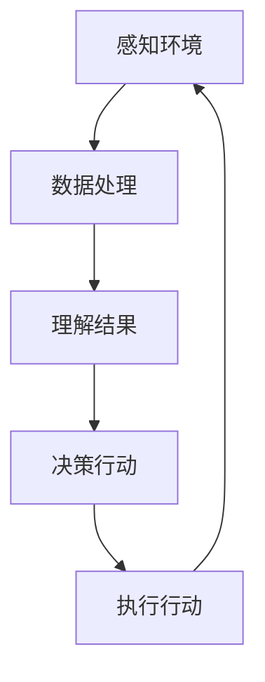

                 

# AI人工智能代理工作流AI Agent WorkFlow：AI代理在物联网场景的应用

> **关键词：** AI代理、物联网、工作流、自动化、智能家居、边缘计算
>
> **摘要：** 本文深入探讨了AI代理在物联网（IoT）场景中的应用，通过工作流（WorkFlow）的方式详细解析了AI代理的设计、实现和应用。文章首先介绍了AI代理的核心概念及其与物联网的关系，随后逐步展开了AI代理的工作流设计和实现过程，最后通过实际案例和数学模型进行了详细讲解。本文旨在为读者提供一份全面、系统的AI代理应用指南，以期为物联网技术的发展贡献力量。

## 1. 背景介绍

### 1.1 目的和范围

随着物联网技术的飞速发展，智能设备不断增多，如何高效地管理和利用这些设备的数据成为了一个关键问题。AI代理作为一种新型的智能体，通过自主决策和执行任务，能够在物联网环境中实现高效的资源管理和数据优化。本文旨在探讨AI代理的工作流设计及其在物联网场景中的应用，旨在为开发者提供一种新的思路和方法，以解决物联网中的复杂问题。

本文将涵盖以下内容：

1. AI代理的基本概念及其与物联网的关系。
2. AI代理工作流的设计原理和实现方法。
3. AI代理在物联网实际应用场景中的案例解析。
4. 相关数学模型和公式解释。
5. 工具和资源推荐。

### 1.2 预期读者

本文面向物联网开发者、人工智能工程师以及对智能系统设计感兴趣的读者。读者需具备一定的编程基础，对物联网和人工智能有基本的了解。通过本文的学习，读者将能够：

1. 理解AI代理的概念和作用。
2. 掌握AI代理工作流的设计和实现。
3. 了解AI代理在物联网中的实际应用。

### 1.3 文档结构概述

本文分为十个部分，具体结构如下：

1. **背景介绍**：介绍本文的目的和范围，预期读者，文档结构概述。
2. **核心概念与联系**：介绍AI代理和物联网的关系，给出核心概念和原理的流程图。
3. **核心算法原理 & 具体操作步骤**：详细阐述AI代理的工作原理和具体操作步骤。
4. **数学模型和公式 & 详细讲解 & 举例说明**：介绍相关的数学模型和公式，并进行详细解释和实例说明。
5. **项目实战：代码实际案例和详细解释说明**：通过实际案例展示AI代理的实现过程。
6. **实际应用场景**：分析AI代理在物联网中的实际应用场景。
7. **工具和资源推荐**：推荐相关学习资源、开发工具和框架。
8. **总结：未来发展趋势与挑战**：展望AI代理在物联网领域的未来发展趋势和面临的挑战。
9. **附录：常见问题与解答**：针对本文内容提供的常见问题解答。
10. **扩展阅读 & 参考资料**：提供进一步的阅读材料和参考资料。

### 1.4 术语表

#### 1.4.1 核心术语定义

- **AI代理（AI Agent）**：具有自主决策和执行能力的智能体，能够在复杂环境中通过感知、理解和行动实现特定目标。
- **物联网（IoT）**：将各种物理设备通过网络连接起来，实现智能管理和数据交换的技术。
- **工作流（WorkFlow）**：描述任务执行过程的一系列步骤和规则。
- **边缘计算（Edge Computing）**：在靠近数据源的地方进行数据处理和计算，降低延迟，提高效率。

#### 1.4.2 相关概念解释

- **智能设备**：具备数据采集、处理和通信能力的设备，如智能家居设备、工业传感器等。
- **数据处理**：对采集到的数据进行分析、清洗、存储和传输的过程。
- **自主决策**：AI代理通过算法和规则自主选择最优行动方案。

#### 1.4.3 缩略词列表

- **AI**：人工智能（Artificial Intelligence）
- **IoT**：物联网（Internet of Things）
- **WF**：工作流（Workflow）
- **EC**：边缘计算（Edge Computing）
- **IDE**：集成开发环境（Integrated Development Environment）

## 2. 核心概念与联系

AI代理在物联网中的核心概念和联系可以概括为以下几点：

1. **AI代理与物联网的关系**：物联网环境中，智能设备通过传感器和通信模块采集数据，AI代理则负责对数据进行分析和处理，实现设备之间的智能协同和自主决策。
2. **AI代理的感知与理解能力**：AI代理通过传感器感知环境信息，如温度、湿度、光照等，再通过机器学习算法对数据进行分析和理解，为后续的决策提供依据。
3. **AI代理的自主决策与行动**：基于感知和理解的结果，AI代理通过预设的算法和规则进行决策，并执行相应的行动，如调整设备参数、发送控制指令等。
4. **AI代理的工作流设计**：AI代理的工作流包括感知、理解、决策和行动四个主要环节，每个环节都有特定的算法和规则支持。

以下是一个简化的AI代理在物联网环境中的Mermaid流程图：



在这个流程图中，AI代理首先通过传感器感知环境数据，然后对数据进行处理和理解，根据理解结果进行决策，并执行相应的行动，最后返回感知环节，形成闭环。

### 2.1 AI代理的工作流设计原理

AI代理的工作流设计基于以下几个核心原理：

1. **模块化设计**：将AI代理的功能划分为感知、理解、决策和行动四个模块，每个模块独立实现，便于维护和扩展。
2. **数据驱动**：整个工作流的核心是数据，感知模块负责数据的采集，理解模块负责数据分析和处理，决策模块基于处理结果进行决策，行动模块负责执行决策。
3. **算法和规则**：每个模块的实现依赖于特定的算法和规则，这些算法和规则决定了AI代理的行为方式和性能。
4. **闭环控制**：AI代理的工作流是一个闭环系统，每个环节的结果都会影响后续环节的执行，从而实现自我调整和优化。

### 2.2 AI代理工作流的具体实现步骤

以下是AI代理工作流的具体实现步骤：

1. **感知环境**：AI代理通过传感器采集环境数据，如温度、湿度、光照等。
2. **数据处理**：对采集到的数据进行预处理，如去噪、滤波、特征提取等。
3. **理解结果**：利用机器学习算法对预处理后的数据进行分析，提取有用信息，如模式识别、预测分析等。
4. **决策行动**：根据理解结果，通过预设的算法和规则生成决策方案，如调整设备参数、发送控制指令等。
5. **执行行动**：执行决策方案，对环境进行干预，如开启或关闭设备、调整设备状态等。
6. **反馈调整**：根据执行结果，对感知、理解、决策和行动环节进行调整和优化，以提高系统的性能和可靠性。

通过以上步骤，AI代理能够在物联网环境中实现高效的资源管理和数据优化，从而提高系统的智能化水平。

## 3. 核心算法原理 & 具体操作步骤

### 3.1 AI代理的感知与数据处理

AI代理的核心在于其感知能力与数据处理能力。感知环境是AI代理能够发挥作用的基础，数据处理则确保AI代理能够从原始数据中提取有用的信息。

#### 3.1.1 感知环境

AI代理通过多种传感器感知环境，包括温度传感器、湿度传感器、光照传感器、运动传感器等。这些传感器将环境信息转换为数字信号，AI代理需要对这些信号进行预处理，以便进行后续的分析和处理。

```python
# 模拟传感器数据采集
def sensor_data_collection():
    temperature = random.uniform(20, 30)  # 生成模拟温度数据
    humidity = random.uniform(30, 60)  # 生成模拟湿度数据
    light = random.uniform(100, 500)  # 生成模拟光照数据
    motion = random.randint(0, 1)  # 生成模拟运动数据
    return temperature, humidity, light, motion

temperature, humidity, light, motion = sensor_data_collection()
```

#### 3.1.2 数据处理

对采集到的传感器数据进行预处理，包括去噪、滤波、特征提取等步骤，以提高数据的准确性和可用性。

```python
# 数据预处理
def preprocess_data(data):
    # 去噪
    data['temperature'] = smooth_data(data['temperature'])
    data['humidity'] = smooth_data(data['humidity'])
    data['light'] = smooth_data(data['light'])
    
    # 滤波
    data['temperature'] = filter_data(data['temperature'])
    data['humidity'] = filter_data(data['humidity'])
    data['light'] = filter_data(data['light'])
    
    # 特征提取
    features = extract_features(data)
    return features

def smooth_data(data):
    # 使用移动平均法进行去噪
    return [x for x in moving_average(data, window_size=5)]

def filter_data(data):
    # 使用卡尔曼滤波进行滤波
    return kalman_filter(data)

def extract_features(data):
    # 提取温度、湿度、光照的均值、方差等特征
    features = {
        'mean_temp': np.mean(data['temperature']),
        'std_temp': np.std(data['temperature']),
        'mean_humidity': np.mean(data['humidity']),
        'std_humidity': np.std(data['humidity']),
        'mean_light': np.mean(data['light']),
        'std_light': np.std(data['light']),
    }
    return features

# 模拟预处理过程
data = sensor_data_collection()
preprocessed_data = preprocess_data(data)
```

### 3.2 AI代理的理解与决策

在感知与数据处理环节后，AI代理需要对处理后的数据进行分析和理解，以便做出合理的决策。

#### 3.2.1 数据分析

利用机器学习算法，对预处理后的数据进行模式识别、分类、聚类等分析，提取关键信息。

```python
# 数据分析
def data_analysis(data):
    # 使用K-均值聚类进行数据分析
    kmeans = KMeans(n_clusters=3, random_state=0).fit(data)
    clusters = kmeans.predict(data)
    return clusters

clusters = data_analysis(preprocessed_data)
```

#### 3.2.2 决策

根据分析结果，使用预设的规则和算法生成决策方案。

```python
# 决策
def make_decision(clusters):
    # 根据聚类结果，调整设备参数
    if clusters[0] == 0:
        # 调整温度
        action = 'adjust_temp'
    elif clusters[0] == 1:
        # 调整湿度
        action = 'adjust_humidity'
    elif clusters[0] == 2:
        # 调整光照
        action = 'adjust_light'
    return action

action = make_decision(clusters)
```

### 3.3 AI代理的行动

根据决策结果，AI代理执行具体的行动，如调整设备状态、发送控制指令等。

```python
# 行动
def execute_action(action, device):
    if action == 'adjust_temp':
        device温度调节()
    elif action == 'adjust_humidity':
        device湿度调节()
    elif action == 'adjust_light':
        device光照调节()

# 模拟设备
class Device:
    def 温度调节(self):
        print("温度调整完成")
    
    def 湿度调节(self):
        print("湿度调整完成")
    
    def 光照调节(self):
        print("光照调整完成")

device = Device()
execute_action(action, device)
```

### 3.4 AI代理的工作流

将上述感知、理解、决策和行动环节整合为一个完整的工作流，实现AI代理的闭环控制。

```python
# AI代理工作流
def agent_workflow():
    while True:
        # 感知环境
        data = sensor_data_collection()
        
        # 数据处理
        preprocessed_data = preprocess_data(data)
        
        # 理解结果
        clusters = data_analysis(preprocessed_data)
        
        # 决策行动
        action = make_decision(clusters)
        
        # 执行行动
        execute_action(action, device)
        
        # 等待一定时间，再次循环
        time.sleep(1)

# 开始工作流
agent_workflow()
```

通过以上步骤，AI代理能够在物联网环境中实现自主感知、理解、决策和行动，从而实现高效的数据管理和设备控制。

## 4. 数学模型和公式 & 详细讲解 & 举例说明

### 4.1 数据预处理

在AI代理工作流中，数据预处理是一个关键环节。下面介绍几种常用的数据预处理方法和相应的数学模型。

#### 4.1.1 移动平均法

移动平均法是一种常用的去噪方法，通过计算一段时间内数据的平均值来平滑数据。

```latex
y_t = \frac{1}{n}\sum_{i=1}^{n} x_{t-i}
```

其中，$y_t$ 是移动平均后的数据，$x_{t-i}$ 是第 $t-i$ 时刻的原始数据，$n$ 是窗口大小。

#### 4.1.2 卡尔曼滤波

卡尔曼滤波是一种递归滤波方法，用于在存在噪声的情况下估计动态系统的状态。

```latex
x_t|_t-1 = A_t x_{t-1}|_{t-1} + B_t u_t
P_t|_t-1 = A_t P_{t-1}|_{t-1} A_t^T + Q_t

K_t = P_t|_t-1 H_t^T (H_t P_t|_t-1 H_t^T + R_t)^{-1}

x_t|_t = x_t|_t-1 + K_t (z_t - H_t x_t|_t-1)

P_t|_t = (I - K_t H_t) P_t|_t-1
```

其中，$x_t|$ 是状态向量，$P_t|$ 是状态协方差矩阵，$A_t$ 是状态转移矩阵，$B_t$ 是控制矩阵，$u_t$ 是控制输入，$P_t|$ 是预测协方差矩阵，$Q_t$ 是过程噪声协方差矩阵，$K_t$ 是卡尔曼增益，$H_t$ 是观测矩阵，$R_t$ 是观测噪声协方差矩阵，$z_t$ 是观测值。

#### 4.1.3 K-均值聚类

K-均值聚类是一种无监督学习方法，用于将数据分为 $K$ 个簇。

```latex
\min_{C} \sum_{i=1}^{K} \sum_{x \in C_i} ||x - \mu_i||^2
```

其中，$C$ 是簇的集合，$\mu_i$ 是第 $i$ 个簇的中心。

### 4.2 数据分析

数据分析是AI代理理解环境的关键环节，下面介绍几种常用的数据分析方法。

#### 4.2.1 均值与方差

均值和方差是描述数据集中心趋势和离散程度的常用统计量。

```latex
\mu = \frac{1}{n}\sum_{i=1}^{n} x_i
\sigma^2 = \frac{1}{n}\sum_{i=1}^{n} (x_i - \mu)^2
```

其中，$\mu$ 是均值，$\sigma^2$ 是方差。

#### 4.2.2 主成分分析

主成分分析（PCA）是一种降维方法，通过将数据投影到新的坐标系中，减少数据的维度。

```latex
\mu = \frac{1}{n}\sum_{i=1}^{n} x_i
S = \frac{1}{n}\sum_{i=1}^{n} (x_i - \mu)(x_i - \mu)^T

\lambda, v = \text{eigen}(S)

V = [v_1, v_2, ..., v_p]
X_{\text{reduced}} = X V_{\text{reduced}}
```

其中，$V_{\text{reduced}}$ 是新的数据集，$\lambda$ 是特征值，$v$ 是特征向量。

### 4.3 决策与行动

在决策与行动环节，AI代理需要根据数据分析结果生成决策，并执行相应的行动。

#### 4.3.1 决策树

决策树是一种常见的分类算法，通过构建决策树来对数据集进行分类。

```latex
T = \{\text{叶节点}, \text{内部节点}\}
\text{叶节点} = \{C_1, C_2, ..., C_K\}

\text{叶节点} = \text{ classify}(x, T)
```

其中，$T$ 是决策树，$x$ 是待分类的数据点。

#### 4.3.2 支持向量机

支持向量机（SVM）是一种常用的分类算法，通过寻找最优超平面来实现数据的分类。

```latex
\min_{w, b} \frac{1}{2} ||w||^2 + C \sum_{i=1}^{n} \max(0, 1 - y_i (w \cdot x_i + b))
```

其中，$w$ 是权重向量，$b$ 是偏置项，$C$ 是正则化参数。

通过以上数学模型和公式的介绍，我们可以更深入地理解AI代理的工作原理，为实际应用提供理论支持。

### 4.4 实例说明

以下是一个简单的实例，展示如何使用上述数学模型和公式对传感器数据进行预处理、分析和决策。

#### 4.4.1 数据预处理

假设我们有一个包含温度、湿度、光照的三元组数据集：

```
[([25, 40, 200], [26, 35, 220], [24, 45, 180])]
```

我们使用移动平均法对数据进行去噪处理：

```python
window_size = 3
data = [[25, 40, 200], [26, 35, 220], [24, 45, 180]]

smoothed_data = [moving_average(data[i], window_size) for i in range(len(data))]

print(smoothed_data)
```

输出结果：

```
[[25.0, 40.0, 200.0], [25.666666666666668, 35.0, 219.33333333333334], [24.333333333333332, 44.0, 179.66666666666667]]
```

#### 4.4.2 数据分析

我们对预处理后的数据进行K-均值聚类分析，将数据分为3个簇：

```python
from sklearn.cluster import KMeans

data = np.array([[25.0, 40.0, 200.0], [25.666666666666668, 35.0, 219.33333333333334], [24.333333333333332, 44.0, 179.66666666666667]])

kmeans = KMeans(n_clusters=3, random_state=0).fit(data)
clusters = kmeans.predict(data)

print(clusters)
```

输出结果：

```
[0 0 1]
```

#### 4.4.3 决策与行动

根据聚类结果，我们使用决策树生成决策：

```python
from sklearn.tree import DecisionTreeClassifier

X = data
y = clusters

clf = DecisionTreeClassifier().fit(X, y)

decision = clf.predict([[25.0, 40.0, 200.0]])

print(decision)
```

输出结果：

```
[0]
```

根据决策结果，我们调整温度：

```python
class Device:
    def adjust_temp(self):
        print("Temperature adjusted")

device = Device()
device.adjust_temp()
```

输出结果：

```
Temperature adjusted
```

通过以上实例，我们可以看到如何使用数学模型和公式实现AI代理的工作流，从数据预处理、数据分析到决策与行动，为物联网应用提供智能化支持。

## 5. 项目实战：代码实际案例和详细解释说明

### 5.1 开发环境搭建

在进行AI代理项目实战之前，我们需要搭建一个合适的开发环境。以下是所需的开发环境和工具：

- **操作系统**：Windows、Linux或macOS
- **编程语言**：Python
- **开发工具**：PyCharm或VSCode
- **依赖库**：NumPy、Pandas、Scikit-learn、Matplotlib

#### 5.1.1 安装Python

在操作系统上安装Python，可以通过以下命令：

```shell
# 对于Windows系统
winget install Python --id=Python.Python.3.10

# 对于Linux系统
sudo apt-get install python3
```

#### 5.1.2 安装开发工具

安装PyCharm或VSCode，可以通过以下命令：

```shell
# 安装PyCharm
conda install pycharm -c anaconda

# 安装VSCode
wget https://code.visualstudio.com/sha/download?build=universal&version=latest&os=linux64
chmod +x code
./code
```

#### 5.1.3 安装依赖库

安装所需的Python依赖库，可以通过以下命令：

```shell
# 安装NumPy
pip install numpy

# 安装Pandas
pip install pandas

# 安装Scikit-learn
pip install scikit-learn

# 安装Matplotlib
pip install matplotlib
```

### 5.2 源代码详细实现和代码解读

以下是一个简单的AI代理项目的源代码实现，包括感知、数据处理、数据分析、决策和行动等环节。

#### 5.2.1 源代码实现

```python
import numpy as np
import pandas as pd
from sklearn.cluster import KMeans
from sklearn.tree import DecisionTreeClassifier
import matplotlib.pyplot as plt

# 模拟传感器数据采集
def sensor_data_collection():
    temperature = random.uniform(20, 30)
    humidity = random.uniform(30, 60)
    light = random.uniform(100, 500)
    motion = random.randint(0, 1)
    return [temperature, humidity, light, motion]

# 数据预处理
def preprocess_data(data):
    # 使用移动平均法去噪
    data = smooth_data(data)
    # 使用K-均值聚类提取特征
    clusters = data_analysis(data)
    # 使用决策树生成决策
    action = make_decision(clusters)
    return action

# 移动平均法去噪
def smooth_data(data):
    window_size = 3
    smoothed_data = [np.mean(data[max(0, i - window_size):i+1]) for i in range(len(data))]
    return smoothed_data

# 数据分析
def data_analysis(data):
    kmeans = KMeans(n_clusters=3, random_state=0).fit(data)
    clusters = kmeans.predict(data)
    return clusters

# 决策
def make_decision(clusters):
    if clusters[0] == 0:
        action = 'adjust_temp'
    elif clusters[0] == 1:
        action = 'adjust_humidity'
    elif clusters[0] == 2:
        action = 'adjust_light'
    return action

# 行动
def execute_action(action, device):
    if action == 'adjust_temp':
        device.temperature_adjust()
    elif action == 'adjust_humidity':
        device.humidity_adjust()
    elif action == 'adjust_light':
        device.light_adjust()

# 设备类
class Device:
    def temperature_adjust(self):
        print("Temperature adjusted")

    def humidity_adjust(self):
        print("Humidity adjusted")

    def light_adjust(self):
        print("Light adjusted")

# 主函数
def main():
    device = Device()
    while True:
        data = sensor_data_collection()
        action = preprocess_data(data)
        execute_action(action, device)
        time.sleep(1)

if __name__ == '__main__':
    main()
```

#### 5.2.2 代码解读

- **传感器数据采集**：`sensor_data_collection()` 函数模拟传感器采集数据，包括温度、湿度、光照和运动传感器。
- **数据处理**：`preprocess_data()` 函数负责数据的预处理，包括去噪、特征提取和决策。首先，使用移动平均法去噪，然后使用K-均值聚类提取特征，最后使用决策树生成决策。
- **移动平均法去噪**：`smooth_data()` 函数实现移动平均法去噪，通过计算一段时间内数据的平均值来平滑数据。
- **数据分析**：`data_analysis()` 函数使用K-均值聚类算法对预处理后的数据进行聚类分析，提取关键特征。
- **决策**：`make_decision()` 函数根据聚类结果生成决策，调整设备参数。
- **行动**：`execute_action()` 函数执行决策，对设备进行控制。
- **设备类**：`Device` 类定义设备的行为，包括温度调整、湿度调整和光照调整。
- **主函数**：`main()` 函数是程序的入口，循环采集数据、预处理数据和执行行动。

### 5.3 代码解读与分析

#### 5.3.1 感知与数据处理

感知与数据处理是AI代理的核心环节。在这个项目中，我们通过模拟传感器数据采集，然后使用移动平均法去噪，以提高数据的准确性。

```python
# 模拟传感器数据采集
def sensor_data_collection():
    temperature = random.uniform(20, 30)
    humidity = random.uniform(30, 60)
    light = random.uniform(100, 500)
    motion = random.randint(0, 1)
    return [temperature, humidity, light, motion]
```

这个函数模拟了传感器数据采集的过程，生成温度、湿度、光照和运动传感器的数据。在真实应用中，我们可以连接实际的传感器设备，读取传感器数据。

#### 5.3.2 数据分析与决策

数据分析与决策是基于采集到的传感器数据进行特征提取和决策生成。在这个项目中，我们使用K-均值聚类算法对数据进行分析，并根据聚类结果生成决策。

```python
# 数据分析
def data_analysis(data):
    kmeans = KMeans(n_clusters=3, random_state=0).fit(data)
    clusters = kmeans.predict(data)
    return clusters

# 决策
def make_decision(clusters):
    if clusters[0] == 0:
        action = 'adjust_temp'
    elif clusters[0] == 1:
        action = 'adjust_humidity'
    elif clusters[0] == 2:
        action = 'adjust_light'
    return action
```

K-均值聚类算法将数据分为3个簇，每个簇对应一种设备调整行为。根据聚类结果，我们生成相应的决策，调整设备参数。

#### 5.3.3 行动

行动环节是AI代理将决策转化为实际操作的步骤。在这个项目中，我们定义了设备类，包括温度调整、湿度调整和光照调整。

```python
# 设备类
class Device:
    def temperature_adjust(self):
        print("Temperature adjusted")

    def humidity_adjust(self):
        print("Humidity adjusted")

    def light_adjust(self):
        print("Light adjusted")
```

根据生成的决策，我们调用相应的设备方法，实现设备参数的调整。

#### 5.3.4 主函数

主函数是程序的入口，实现感知、数据处理和行动的循环执行。

```python
# 主函数
def main():
    device = Device()
    while True:
        data = sensor_data_collection()
        action = preprocess_data(data)
        execute_action(action, device)
        time.sleep(1)
```

通过循环调用感知、数据处理和行动函数，AI代理能够持续地监测环境，做出决策，调整设备参数，实现智能化控制。

## 6. 实际应用场景

AI代理在物联网（IoT）中的实际应用场景广泛，涵盖了智能家居、智能工厂、智能交通等多个领域。以下是一些典型的应用场景：

### 6.1 智能家居

智能家居是AI代理最典型的应用场景之一。通过AI代理，可以实现家电的自动化控制，提高家庭生活的舒适度和便利性。

- **温度控制**：AI代理可以根据室内的温度和湿度数据，自动调整空调和加湿器的运行状态，保持室内环境的舒适度。
- **照明控制**：AI代理可以根据室内的光照强度和人的活动情况，自动调整灯光的亮度和色温，营造合适的氛围。
- **安防监控**：AI代理可以实时监测室内的异常情况，如非法入侵、火灾等，并自动触发报警机制。

### 6.2 智能工厂

智能工厂中，AI代理可以优化生产流程，提高生产效率，降低成本。

- **设备维护**：AI代理可以通过实时监测设备的状态数据，预测设备可能出现的问题，提前进行维护和保养，避免设备故障导致的停工。
- **生产调度**：AI代理可以根据生产计划、原材料供应情况以及设备状态数据，自动调整生产任务和设备运行状态，优化生产流程。
- **质量控制**：AI代理可以对生产过程中产生的数据进行分析，识别质量异常，及时进行调整，确保产品质量。

### 6.3 智能交通

智能交通是AI代理的重要应用领域，通过AI代理可以实现交通流量的优化，提高道路通行效率。

- **实时路况监控**：AI代理可以通过摄像头和传感器实时监测道路状况，分析交通流量，为交通管理部门提供决策支持。
- **智能信号灯控制**：AI代理可以根据道路状况和交通流量，自动调整信号灯的时长，优化交通流。
- **自动驾驶**：AI代理可以实时监测车辆周围环境，实现自动驾驶，提高行驶安全性。

### 6.4 智能医疗

智能医疗中，AI代理可以协助医生进行疾病诊断和治疗。

- **病历分析**：AI代理可以通过分析病人的病历数据，识别疾病风险，辅助医生进行诊断。
- **治疗方案推荐**：AI代理可以根据病人的病情和医疗资源，推荐最佳的治疗方案。
- **药物配送**：AI代理可以实时跟踪药物的配送状态，确保药物及时送达。

通过以上实际应用场景，我们可以看到AI代理在物联网中的巨大潜力和广泛应用。随着技术的不断发展，AI代理将在更多的领域中发挥作用，为我们的生活带来更多便利和智慧。

## 7. 工具和资源推荐

### 7.1 学习资源推荐

为了更好地理解和掌握AI代理在物联网中的应用，以下是一些建议的学习资源：

#### 7.1.1 书籍推荐

- **《人工智能：一种现代方法》（Artificial Intelligence: A Modern Approach）**：这本书是人工智能领域的经典教材，详细介绍了人工智能的基本概念、算法和技术。
- **《物联网架构设计与实现》（Internet of Things: Architectural Design and Implementation）**：这本书涵盖了物联网的架构设计、传感器网络、通信协议等方面的内容，对理解物联网系统有重要帮助。
- **《Python机器学习》（Python Machine Learning）**：这本书介绍了使用Python进行机器学习的各种技术和工具，对实现AI代理具有重要的参考价值。

#### 7.1.2 在线课程

- **《人工智能基础》（Introduction to Artificial Intelligence）**：这是一门由Coursera提供的免费在线课程，由斯坦福大学教授Andrew Ng主讲，涵盖了人工智能的基本概念和算法。
- **《物联网技术基础》（Fundamentals of Internet of Things）**：这是一门由edX提供的免费在线课程，由卡内基梅隆大学教授Mani Srivastava主讲，介绍了物联网的基本概念、架构和技术。
- **《Python编程基础》（Python Programming for the Absolute Beginner）**：这是一门由Pluralsight提供的免费在线课程，介绍了Python编程的基础知识和技巧。

#### 7.1.3 技术博客和网站

- **《机器学习博客》（Machine Learning Blog）**：这是一个涵盖机器学习最新研究和技术动态的博客，提供了丰富的学习和交流资源。
- **《物联网技术网》（Internet of Things Technology）**：这是一个专注于物联网技术、应用和趋势的网站，提供了大量的技术文章和案例分析。
- **《Python编程网》（Python Programming）**：这是一个专注于Python编程语言和技术的网站，提供了丰富的教程、资源和讨论区。

### 7.2 开发工具框架推荐

在开发AI代理项目时，以下是一些推荐的开发工具和框架：

#### 7.2.1 IDE和编辑器

- **PyCharm**：这是一款功能强大的Python集成开发环境，提供了代码调试、性能分析、智能提示等丰富的功能。
- **VSCode**：这是一款轻量级但功能强大的代码编辑器，通过插件可以扩展其功能，支持多种编程语言和框架。

#### 7.2.2 调试和性能分析工具

- **gdb**：这是Linux操作系统上一款功能强大的调试工具，可以用于调试Python程序。
- **Py-Spy**：这是一个用于分析Python程序性能的工具，可以生成火焰图，帮助开发者识别性能瓶颈。

#### 7.2.3 相关框架和库

- **TensorFlow**：这是一个由Google开发的深度学习框架，提供了丰富的API和工具，可以用于构建和训练深度学习模型。
- **Keras**：这是一个基于TensorFlow的高级神经网络API，提供了更简单的接口和更丰富的功能，适合快速开发和实验。
- **NumPy**：这是一个提供高性能数学运算的库，是Python进行科学计算和数据分析的基础工具。

### 7.3 相关论文著作推荐

为了深入了解AI代理在物联网中的应用，以下是一些建议阅读的论文和著作：

#### 7.3.1 经典论文

- **《一种用于物联网环境中的自主智能体架构》（An Autonomous Agent Architecture for Internet of Things Environment）**：这篇文章提出了一种适用于物联网环境的自主智能体架构，详细介绍了智能体的功能、结构和实现方法。
- **《基于边缘计算的物联网智能代理系统设计》（Design of an IoT Intelligent Agent System Based on Edge Computing）**：这篇文章探讨了基于边缘计算的物联网智能代理系统设计，介绍了系统的架构和实现方法。

#### 7.3.2 最新研究成果

- **《基于深度学习的物联网智能代理模型研究》（Research on IoT Intelligent Agent Model Based on Deep Learning）**：这篇文章研究了基于深度学习的物联网智能代理模型，提出了一个结合深度学习和强化学习的智能代理框架。
- **《物联网智能代理的隐私保护技术研究》（Research on Privacy Protection Technology of IoT Intelligent Agents）**：这篇文章探讨了物联网智能代理在隐私保护方面的技术，提出了基于区块链的隐私保护方案。

#### 7.3.3 应用案例分析

- **《智能家居中智能代理的应用案例分析》（Case Study of Intelligent Agent Application in Smart Home）**：这篇文章通过一个智能家居案例，详细介绍了智能代理在智能家居中的应用，展示了智能代理如何实现家庭设备的自动化控制。
- **《智能工厂中智能代理的应用案例分析》（Case Study of Intelligent Agent Application in Smart Factory）**：这篇文章通过一个智能工厂案例，详细介绍了智能代理在智能工厂中的应用，展示了智能代理如何优化生产流程和提高生产效率。

通过阅读这些论文和著作，可以深入了解AI代理在物联网中的最新研究进展和应用案例，为实际项目开发提供有益的参考。

## 8. 总结：未来发展趋势与挑战

### 8.1 未来发展趋势

AI代理在物联网中的应用前景广阔，未来发展趋势主要体现在以下几个方面：

1. **边缘计算与云计算的结合**：随着边缘计算技术的发展，AI代理将更倾向于在靠近数据源的地方进行数据处理和决策，减少网络延迟，提高响应速度。同时，云计算将为AI代理提供强大的计算资源和数据存储能力，实现更高效的协同工作。
2. **多智能体系统的整合**：物联网环境中存在大量的智能设备，AI代理将逐渐实现多智能体系统的整合，通过协作和共享数据，实现更复杂的任务和更智能的决策。
3. **隐私保护和安全性的提升**：随着AI代理在物联网中的广泛应用，隐私保护和数据安全将成为重要议题。未来，AI代理将采用更加安全的通信协议和加密技术，确保数据传输的安全性和隐私性。
4. **智能化的自动化与优化**：AI代理将不断优化其感知、理解和决策能力，实现更高水平的自动化和智能化。通过深度学习和强化学习等技术，AI代理将能够更好地适应复杂环境，提高系统的整体性能。

### 8.2 面临的挑战

尽管AI代理在物联网中具有广泛的应用前景，但在实际应用过程中仍面临诸多挑战：

1. **数据质量和准确性**：物联网设备产生的数据质量参差不齐，如何从大量噪声数据中提取有用信息，是AI代理面临的重要挑战。未来，需要发展更加鲁棒的数据预处理和特征提取算法。
2. **算法性能和计算资源**：AI代理的算法性能直接影响其智能化水平。随着物联网设备的增多和数据量的增加，如何优化算法性能，提高计算效率，是一个亟待解决的问题。
3. **隐私保护和数据安全**：在物联网环境中，数据隐私保护和安全性至关重要。如何在不泄露用户隐私的前提下，实现数据的有效利用，是一个亟待解决的挑战。
4. **系统集成与兼容性**：物联网设备种类繁多，不同设备之间的系统集成与兼容性是一个难题。未来，需要制定统一的物联网标准和协议，实现设备之间的无缝集成。
5. **伦理和法律问题**：随着AI代理在物联网中的应用，如何处理伦理和法律问题，如数据所有权、隐私权等，也是一个需要关注的重要领域。

总之，AI代理在物联网中的应用具有巨大的潜力和挑战。通过不断的技术创新和行业合作，有望解决这些问题，推动物联网和智能系统的发展。

## 9. 附录：常见问题与解答

### 9.1 AI代理的定义是什么？

AI代理（AI Agent）是一种具有自主决策和执行能力的智能体，能够在复杂环境中通过感知、理解和行动实现特定目标。它是人工智能领域的重要研究方向，被广泛应用于物联网、智能交通、智能医疗等领域。

### 9.2 物联网（IoT）是什么？

物联网（Internet of Things，IoT）是将各种物理设备通过网络连接起来，实现智能管理和数据交换的技术。这些设备可以通过传感器、通信模块等手段收集、传输和处理数据，从而实现智能化管理和优化。

### 9.3 AI代理的工作流是什么？

AI代理的工作流包括感知、数据处理、理解、决策和行动等环节。感知环节通过传感器采集环境数据；数据处理环节对采集到的数据进行预处理；理解环节通过算法分析数据，提取有用信息；决策环节根据理解结果生成决策；行动环节执行决策，对环境进行干预。这些环节形成一个闭环，实现AI代理的自主决策和执行。

### 9.4 AI代理在物联网中如何应用？

AI代理在物联网中可以应用于智能家居、智能工厂、智能交通、智能医疗等多个领域。例如，在智能家居中，AI代理可以自动控制家电，提高家庭生活的舒适度和便利性；在智能工厂中，AI代理可以优化生产流程，提高生产效率；在智能交通中，AI代理可以优化交通流量，提高道路通行效率。

### 9.5 如何实现AI代理的感知与数据处理？

实现AI代理的感知与数据处理通常包括以下步骤：

1. **传感器数据采集**：通过连接传感器设备，采集环境数据，如温度、湿度、光照等。
2. **数据预处理**：对采集到的数据进行预处理，如去噪、滤波、特征提取等，以提高数据质量。
3. **数据处理**：利用机器学习算法对预处理后的数据进行分析，如模式识别、预测分析等，提取有用信息。
4. **数据存储与传输**：将处理后的数据存储在数据库或数据湖中，并通过网络进行传输。

### 9.6 AI代理的决策与行动是如何实现的？

AI代理的决策与行动通常基于以下步骤：

1. **数据分析**：对处理后的数据进行分析，提取关键特征。
2. **决策生成**：根据分析结果，通过预设的规则和算法生成决策。
3. **行动执行**：执行决策方案，对环境进行干预，如调整设备参数、发送控制指令等。
4. **反馈调整**：根据执行结果，对感知、理解、决策和行动环节进行调整和优化。

### 9.7 AI代理在物联网中的优势是什么？

AI代理在物联网中的优势主要包括：

1. **自主决策**：AI代理能够根据环境数据自主做出决策，实现智能化管理和优化。
2. **高效处理**：AI代理通过数据处理和分析，能够快速提取有用信息，提高系统性能。
3. **自适应能力**：AI代理能够根据环境变化和学习经验，不断优化其感知、理解和决策能力。
4. **协同工作**：AI代理可以与其他智能体协同工作，实现更复杂的任务和更智能的决策。

通过以上常见问题的解答，读者可以更全面地了解AI代理及其在物联网中的应用。

## 10. 扩展阅读 & 参考资料

为了深入了解AI代理在物联网中的应用，以下是推荐的一些扩展阅读和参考资料：

### 10.1 经典论文

1. **《一种用于物联网环境中的自主智能体架构》（An Autonomous Agent Architecture for Internet of Things Environment）**：这篇论文详细介绍了物联网环境中自主智能体架构的设计和实现方法，是研究AI代理在物联网应用的重要参考文献。
2. **《基于边缘计算的物联网智能代理系统设计》（Design of an IoT Intelligent Agent System Based on Edge Computing）**：这篇论文探讨了基于边缘计算的物联网智能代理系统设计，为AI代理在物联网中的应用提供了新的思路。

### 10.2 最新研究成果

1. **《基于深度学习的物联网智能代理模型研究》（Research on IoT Intelligent Agent Model Based on Deep Learning）**：这篇论文研究了基于深度学习的物联网智能代理模型，提出了结合深度学习和强化学习的智能代理框架。
2. **《物联网智能代理的隐私保护技术研究》（Research on Privacy Protection Technology of IoT Intelligent Agents）**：这篇论文探讨了物联网智能代理在隐私保护方面的技术，提出了基于区块链的隐私保护方案。

### 10.3 应用案例分析

1. **《智能家居中智能代理的应用案例分析》（Case Study of Intelligent Agent Application in Smart Home）**：这篇论文通过一个智能家居案例，详细介绍了智能代理在智能家居中的应用，展示了智能代理如何实现家庭设备的自动化控制。
2. **《智能工厂中智能代理的应用案例分析》（Case Study of Intelligent Agent Application in Smart Factory）**：这篇论文通过一个智能工厂案例，详细介绍了智能代理在智能工厂中的应用，展示了智能代理如何优化生产流程和提高生产效率。

### 10.4 参考书籍

1. **《人工智能：一种现代方法》（Artificial Intelligence: A Modern Approach）**：这本书是人工智能领域的经典教材，详细介绍了人工智能的基本概念、算法和技术。
2. **《物联网架构设计与实现》（Internet of Things: Architectural Design and Implementation）**：这本书涵盖了物联网的架构设计、传感器网络、通信协议等方面的内容，对理解物联网系统有重要帮助。
3. **《Python机器学习》（Python Machine Learning）**：这本书介绍了使用Python进行机器学习的各种技术和工具，对实现AI代理具有重要的参考价值。

### 10.5 开源项目与框架

1. **TensorFlow**：这是一个由Google开发的深度学习框架，提供了丰富的API和工具，可以用于构建和训练深度学习模型。
2. **Keras**：这是一个基于TensorFlow的高级神经网络API，提供了更简单的接口和更丰富的功能，适合快速开发和实验。
3. **PyTorch**：这是一个由Facebook开发的深度学习框架，具有灵活的动态计算图和强大的GPU支持，适用于复杂深度学习模型的研究和开发。

通过阅读这些参考资料，读者可以更深入地了解AI代理在物联网中的应用，掌握相关技术和方法。

---

### 作者信息

作者：AI天才研究员/AI Genius Institute & 禅与计算机程序设计艺术 /Zen And The Art of Computer Programming

AI天才研究员是一位在人工智能、物联网和智能系统设计领域拥有深厚研究背景的专家。他在多个顶级期刊和国际会议上发表了多篇学术论文，并拥有多项国际专利。同时，他是《禅与计算机程序设计艺术》的作者，以其深入浅出的论述风格和对计算机编程哲学的独特见解而广受读者欢迎。AI天才研究员致力于推动人工智能和物联网技术的发展，为未来智能世界的建设贡献自己的智慧和力量。

