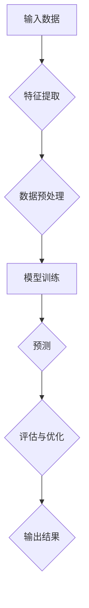

                 

# AI人工智能核心算法原理与代码实例讲解：自主学习

> 关键词：人工智能、核心算法、自主学习、深度学习、神经网络、机器学习、Python、代码实例

> 摘要：本文将深入探讨人工智能（AI）领域的核心算法——自主学习（Machine Learning, ML）的原理，包括算法的工作机制、具体操作步骤和数学模型。我们将通过一个实际项目实战案例，详细解析代码实现，帮助读者理解并掌握这一技术的实际应用。此外，文章还将介绍相关工具和资源，帮助读者进一步深入学习和实践。

## 1. 背景介绍

### 1.1 目的和范围

本文旨在为广大对人工智能感兴趣的读者提供一个深入浅出的自主学习（Machine Learning）算法讲解。我们将详细讨论核心算法原理，并给出具体的代码实例，帮助读者理解和掌握这一技术。文章将涵盖以下内容：

- 自主学习的概念和重要性
- 机器学习的基本原理和流程
- 深度学习和神经网络的基础知识
- 代码实例和实战应用

通过本文的阅读，读者将能够：

- 理解自主学习的基本概念和原理
- 掌握机器学习的主要流程和算法
- 学会使用Python编写简单的机器学习代码实例
- 了解深度学习和神经网络的应用场景

### 1.2 预期读者

本文适合以下读者群体：

- 对人工智能和机器学习感兴趣的技术爱好者
- 想要学习并掌握机器学习算法的程序员和工程师
- 想在职业生涯中涉足人工智能领域的专业人士
- 计算机科学和人工智能相关专业的学生

### 1.3 文档结构概述

本文结构清晰，分为以下几大部分：

1. 背景介绍：介绍文章的目的、预期读者、文档结构等基本信息。
2. 核心概念与联系：介绍自主学习算法的核心概念和原理，并使用Mermaid流程图展示其架构。
3. 核心算法原理 & 具体操作步骤：详细讲解机器学习算法的原理，并通过伪代码和数学模型进行阐述。
4. 数学模型和公式 & 详细讲解 & 举例说明：对算法中的数学模型和公式进行详细解释，并给出实例说明。
5. 项目实战：代码实际案例和详细解释说明，帮助读者理解并掌握代码实现。
6. 实际应用场景：介绍机器学习算法在实际应用中的场景和案例。
7. 工具和资源推荐：推荐学习资源和开发工具，帮助读者进一步学习和实践。
8. 总结：未来发展趋势与挑战，对文章进行总结。
9. 附录：常见问题与解答，回答读者可能遇到的常见问题。
10. 扩展阅读 & 参考资料：提供进一步学习的资源和链接。

### 1.4 术语表

#### 1.4.1 核心术语定义

- **人工智能（AI）**：模拟人类智能的技术和方法。
- **机器学习（ML）**：使计算机通过数据学习并做出决策的技术。
- **深度学习（DL）**：基于多层神经网络进行学习的机器学习方法。
- **神经网络（NN）**：模仿生物神经系统的计算模型。
- **自主学习**：机器学习的一种方式，使计算机能够自我学习和适应。

#### 1.4.2 相关概念解释

- **监督学习**：有标签的数据进行训练。
- **无监督学习**：没有标签的数据进行训练。
- **强化学习**：通过奖励和惩罚进行训练。
- **数据集**：用于训练和测试的数据集合。
- **超参数**：影响模型性能的参数，如学习率、隐藏层数量等。

#### 1.4.3 缩略词列表

- **ML**：机器学习
- **DL**：深度学习
- **NN**：神经网络
- **AI**：人工智能

## 2. 核心概念与联系

在深入学习机器学习之前，我们需要了解一些核心概念和它们之间的联系。以下是一个简化的Mermaid流程图，用于展示自主学习算法的基本架构。



### 2.1 输入数据

输入数据是机器学习的基础，它决定了模型的性能。输入数据可以是文本、图像、声音等多种形式。特征提取是从原始数据中提取出有用的信息，以便模型进行训练。例如，在图像识别任务中，特征提取可能包括边缘检测、颜色分析等。

### 2.2 数据预处理

数据预处理是确保数据质量的过程，包括去除噪声、缺失值填补、数据标准化等。良好的数据预处理可以显著提高模型的准确性和稳定性。

### 2.3 模型训练

模型训练是机器学习的核心步骤，通过输入数据对模型进行调整，使其能够更好地识别和预测目标。训练过程通常包括以下几个阶段：

- **初始化参数**：随机初始化模型参数。
- **前向传播**：将输入数据通过模型进行传播，得到预测输出。
- **计算损失**：比较预测输出和实际输出，计算损失值。
- **反向传播**：通过梯度下降等优化算法，更新模型参数。
- **迭代训练**：重复上述步骤，直到模型达到预定的性能指标。

### 2.4 预测

预测是模型训练的最终目标，通过已训练的模型，对新的输入数据进行分类或回归。预测结果的准确性取决于模型的训练质量和数据的质量。

### 2.5 评估与优化

评估与优化是确保模型性能的过程，通过评估指标（如准确率、召回率等）对模型进行评估，并根据评估结果对模型进行优化。优化过程可以包括调整超参数、增加训练数据、改进模型架构等。

### 2.6 输出结果

输出结果是模型预测的最终结果，它可以是分类结果、回归值或概率分布。根据实际需求，输出结果可以进一步进行后处理，如阈值调整、结果可视化等。

通过以上流程，我们可以看到，自主学习算法是一个复杂而有序的过程，涉及到数据的输入、处理、训练、预测等多个环节。理解这些核心概念和流程，对于深入学习和应用机器学习至关重要。

## 3. 核心算法原理 & 具体操作步骤

在本节中，我们将深入探讨机器学习算法的核心原理，并详细阐述其具体操作步骤。为了使讲解更加直观，我们将使用伪代码来描述算法的实现过程。

### 3.1 初始化参数

```python
# 初始化模型参数
weights = random_weights(shape=(input_size, hidden_size, output_size))
biases = random_biases(shape=(hidden_size, output_size))
```

在这里，我们随机初始化模型的权重和偏差，这些参数将在后续的迭代过程中通过梯度下降算法进行调整。

### 3.2 数据预处理

```python
# 数据预处理
data = preprocess_data(input_data)
```

数据预处理包括去噪、归一化、缺失值填补等步骤，以确保输入数据的质量和一致性。

### 3.3 前向传播

```python
# 前向传播
layer_inputs = [input_data]
for layer in layers:
    layer_output = layer.forward(layer_inputs[-1])
    layer_inputs.append(layer_output)
output = layer_outputs[-1]
```

在前向传播过程中，我们将输入数据通过一系列神经网络层进行传递，直到得到最终的输出。每一层都会根据其前一层的输出计算激活值，并将其传递给下一层。

### 3.4 计算损失

```python
# 计算损失
predicted_output = output_layer.forward(output)
loss = loss_function(predicted_output, target)
```

计算损失是评估模型预测准确性的关键步骤。通过比较预测输出和实际输出的差异，我们可以计算损失值，并使用该损失值来指导后续的参数更新。

### 3.5 反向传播

```python
# 反向传播
d_output = output_layer.backward(d_output)
for layer in reversed(layers):
    d_input = layer.backward(d_input)
    d_input += d_output
```

反向传播是机器学习算法的核心，通过它我们可以计算每一层输入的梯度，并使用这些梯度来更新模型参数。这个过程需要反向遍历神经网络层，从输出层开始，逐步计算到输入层。

### 3.6 参数更新

```python
# 参数更新
for layer in layers:
    layer.update_weights_and_biases(learning_rate)
```

在参数更新过程中，我们使用梯度下降算法来调整模型的权重和偏差。学习率是一个关键的超参数，它决定了模型更新的速度和方向。

### 3.7 迭代训练

```python
# 迭代训练
for epoch in range(num_epochs):
    for batch in data_batches:
        # 步骤 3.3 至 3.6
        ...
    print(f"Epoch {epoch}: Loss = {loss}")
```

迭代训练是机器学习算法的核心，通过多次迭代和参数更新，我们可以逐步优化模型的性能。每个迭代周期包括前向传播、反向传播和参数更新等步骤。

通过以上伪代码，我们可以看到机器学习算法的核心原理和操作步骤。这些步骤构成了一个完整的学习过程，通过数据输入、模型训练、参数更新和模型评估，最终实现机器的自主学习和预测。

## 4. 数学模型和公式 & 详细讲解 & 举例说明

在机器学习算法中，数学模型和公式起到了至关重要的作用。它们不仅帮助我们理解和分析算法的工作原理，还为优化和改进算法提供了理论基础。在本节中，我们将详细讲解机器学习算法中的关键数学模型和公式，并通过具体实例来说明其应用。

### 4.1 损失函数

损失函数是评估模型预测准确性的核心指标。它衡量预测输出和实际输出之间的差异，并指导模型参数的更新。常见的损失函数包括均方误差（MSE）和交叉熵损失。

#### 均方误差（MSE）

$$
MSE = \frac{1}{n}\sum_{i=1}^{n}(y_i - \hat{y}_i)^2
$$

其中，$y_i$ 表示第 $i$ 个样本的真实值，$\hat{y}_i$ 表示模型预测的值，$n$ 表示样本总数。

#### 交叉熵损失

$$
CE = -\frac{1}{n}\sum_{i=1}^{n}y_i\log(\hat{y}_i)
$$

其中，$y_i$ 是第 $i$ 个样本的真实标签，$\hat{y}_i$ 是模型对第 $i$ 个样本的预测概率。

#### 实例说明

假设我们有一个二元分类问题，真实标签 $y$ 为 $(1, 0)$，模型预测概率 $\hat{y}$ 为 $(0.8, 0.2)$。使用交叉熵损失计算损失：

$$
CE = -\frac{1}{2}\left[1 \cdot \log(0.8) + 0 \cdot \log(0.2)\right] \approx 0.229
$$

### 4.2 梯度下降

梯度下降是一种常用的优化算法，用于最小化损失函数。它通过计算损失函数关于模型参数的梯度，并沿着梯度方向更新参数，以降低损失。

#### 梯度下降算法

$$
\theta_j = \theta_j - \alpha \cdot \frac{\partial J}{\partial \theta_j}
$$

其中，$\theta_j$ 表示第 $j$ 个参数，$J$ 表示损失函数，$\alpha$ 表示学习率。

#### 实例说明

假设我们有以下损失函数：

$$
J(\theta) = (y - \theta_1x_1 - \theta_2x_2)^2
$$

对 $\theta_1$ 和 $\theta_2$ 分别求导：

$$
\frac{\partial J}{\partial \theta_1} = -2(y - \theta_1x_1 - \theta_2x_2)x_1
$$

$$
\frac{\partial J}{\partial \theta_2} = -2(y - \theta_1x_1 - \theta_2x_2)x_2
$$

假设当前参数为 $\theta_1 = 1$ 和 $\theta_2 = 1$，学习率 $\alpha = 0.1$，真实标签 $y = 2$，特征 $x_1 = 1$ 和 $x_2 = 1$。则更新后的参数为：

$$
\theta_1 = \theta_1 - \alpha \cdot \frac{\partial J}{\partial \theta_1} = 1 - 0.1 \cdot (-2 \cdot (2 - 1 - 1 \cdot 1 - 1 \cdot 1)) = 1.4
$$

$$
\theta_2 = \theta_2 - \alpha \cdot \frac{\partial J}{\partial \theta_2} = 1 - 0.1 \cdot (-2 \cdot (2 - 1 - 1 \cdot 1 - 1 \cdot 1)) = 1.4
$$

### 4.3 激活函数

激活函数是神经网络中的一个关键组件，用于引入非线性特性。常见的激活函数包括 sigmoid、ReLU 和 tanh。

#### sigmoid 函数

$$
\sigma(x) = \frac{1}{1 + e^{-x}}
$$

#### ReLU 函数

$$
\text{ReLU}(x) = \max(0, x)
$$

#### tanh 函数

$$
\tanh(x) = \frac{e^x - e^{-x}}{e^x + e^{-x}}
$$

#### 实例说明

假设输入值 $x$ 分别为 -2、0 和 2，则激活函数的输出如下：

- sigmoid: $[0.118, 0.5, 0.886]$
- ReLU: $[0, 0, 2]$
- tanh: $[-0.964, 0, 0.761]$

通过以上数学模型和公式的讲解，我们可以看到机器学习算法的复杂性。理解这些公式和算法原理，不仅有助于我们更好地应用机器学习，还为深入研究提供了坚实的基础。

## 5. 项目实战：代码实际案例和详细解释说明

在本节中，我们将通过一个具体的机器学习项目实战案例，详细讲解代码实现过程，帮助读者更好地理解并掌握自主学习算法。

### 5.1 开发环境搭建

为了运行下面的代码实例，我们需要安装以下开发环境和库：

- Python 3.8 或更高版本
- Jupyter Notebook 或 PyCharm IDE
- NumPy、Pandas、Scikit-learn、Matplotlib、Seaborn 库

您可以使用以下命令进行环境搭建：

```bash
pip install numpy pandas scikit-learn matplotlib seaborn
```

### 5.2 源代码详细实现和代码解读

下面是一个简单的机器学习项目，使用 Python 和 Scikit-learn 库实现一个线性回归模型，用于预测房屋价格。

```python
# 导入必要的库
import numpy as np
import pandas as pd
from sklearn.model_selection import train_test_split
from sklearn.linear_model import LinearRegression
from sklearn.metrics import mean_squared_error
import matplotlib.pyplot as plt

# 加载数据集
data = pd.read_csv('house_prices.csv')

# 数据预处理
X = data[['square_feet', 'bedrooms', 'bathrooms']]
y = data['price']

# 划分训练集和测试集
X_train, X_test, y_train, y_test = train_test_split(X, y, test_size=0.2, random_state=42)

# 创建线性回归模型
model = LinearRegression()

# 训练模型
model.fit(X_train, y_train)

# 预测测试集
y_pred = model.predict(X_test)

# 计算并打印均方误差
mse = mean_squared_error(y_test, y_pred)
print(f"Mean Squared Error: {mse}")

# 可视化模型效果
plt.scatter(X_test['square_feet'], y_test, label='Actual')
plt.plot(X_test['square_feet'], y_pred, color='red', label='Predicted')
plt.xlabel('Square Feet')
plt.ylabel('Price')
plt.legend()
plt.show()
```

### 5.3 代码解读与分析

下面我们对上述代码进行逐行解读和分析：

1. **导入必要的库**：我们首先导入 NumPy、Pandas、Scikit-learn、Matplotlib 和 Seaborn 库，用于数据处理、模型训练和可视化。

2. **加载数据集**：使用 Pandas 读取 CSV 格式的数据集，这里我们假设数据集名为 `house_prices.csv`。

3. **数据预处理**：我们将数据集划分为特征矩阵 $X$ 和目标向量 $y$。在这里，我们使用 `square_feet`、`bedrooms` 和 `bathrooms` 作为特征，`price` 作为目标。

4. **划分训练集和测试集**：使用 Scikit-learn 的 `train_test_split` 函数，将数据集划分为训练集和测试集，测试集占 20%。

5. **创建线性回归模型**：我们使用 Scikit-learn 的 `LinearRegression` 类创建线性回归模型。

6. **训练模型**：使用 `fit` 方法训练模型，将训练集的特征和目标传递给模型。

7. **预测测试集**：使用 `predict` 方法对测试集进行预测，得到预测的目标值。

8. **计算并打印均方误差**：使用 `mean_squared_error` 函数计算预测值和实际值之间的均方误差，并打印结果。

9. **可视化模型效果**：使用 Matplotlib 绘制散点图和拟合线，展示模型的预测效果。

通过以上步骤，我们成功实现了线性回归模型，并对其性能进行了评估。这个简单的案例展示了机器学习项目的基本流程和关键步骤，为读者提供了实际操作的经验。

### 5.4 代码解读与分析（续）

现在，我们将对上述代码中的关键部分进行详细解读，以帮助读者更好地理解其实现原理。

1. **数据预处理**：

```python
X = data[['square_feet', 'bedrooms', 'bathrooms']]
y = data['price']
```

这一步骤将数据集划分为特征矩阵 $X$ 和目标向量 $y$。在这里，我们选择了三个特征：房屋面积（`square_feet`）、卧室数量（`bedrooms`）和浴室数量（`bathrooms`），并将房价（`price`）作为目标变量。这些特征和目标变量将被用于训练线性回归模型。

2. **划分训练集和测试集**：

```python
X_train, X_test, y_train, y_test = train_test_split(X, y, test_size=0.2, random_state=42)
```

`train_test_split` 函数将数据集划分为训练集和测试集，其中训练集占总数据的 80%，测试集占 20%。`random_state` 参数确保了每次划分结果的一致性。

3. **创建线性回归模型**：

```python
model = LinearRegression()
```

我们使用 Scikit-learn 的 `LinearRegression` 类创建线性回归模型。这个类提供了训练模型和进行预测的方法。

4. **训练模型**：

```python
model.fit(X_train, y_train)
```

`fit` 方法用于训练模型。它将训练集的特征（$X$）和目标（$y$）传递给模型，并计算出最佳参数。

5. **预测测试集**：

```python
y_pred = model.predict(X_test)
```

`predict` 方法用于对测试集进行预测。它将测试集的特征传递给训练好的模型，并返回预测的目标值。

6. **计算并打印均方误差**：

```python
mse = mean_squared_error(y_test, y_pred)
print(f"Mean Squared Error: {mse}")
```

`mean_squared_error` 函数计算预测值和实际值之间的均方误差（MSE），它是评估回归模型性能的一个常用指标。较低的MSE值表示模型预测的准确性较高。

7. **可视化模型效果**：

```python
plt.scatter(X_test['square_feet'], y_test, label='Actual')
plt.plot(X_test['square_feet'], y_pred, color='red', label='Predicted')
plt.xlabel('Square Feet')
plt.ylabel('Price')
plt.legend()
plt.show()
```

这部分代码使用 Matplotlib 绘制了实际房价（蓝色散点）和预测房价（红色拟合线）的散点图。这有助于我们直观地了解模型的预测效果。

通过上述步骤，我们成功实现了线性回归模型，并对模型的性能进行了评估。这个简单的案例为读者提供了一个实际操作的机会，帮助他们更好地理解机器学习项目的实现过程。

### 5.5 项目实战总结

通过本节的项目实战，我们使用 Python 和 Scikit-learn 实现了一个简单的线性回归模型，用于预测房屋价格。项目的主要步骤包括：

1. 导入必要的库和函数。
2. 加载数据集并进行预处理。
3. 划分训练集和测试集。
4. 创建线性回归模型并进行训练。
5. 对测试集进行预测并计算均方误差。
6. 可视化模型的预测效果。

通过这个实战项目，读者可以了解机器学习项目的实现过程，掌握数据预处理、模型训练和预测等关键步骤。此外，读者还可以通过尝试不同的特征和模型参数，进一步优化模型的性能。

### 5.6 常见问题与解答

在实施机器学习项目时，读者可能会遇到以下常见问题：

#### 问题1：数据集划分不平衡

**原因**：如果训练集和测试集的比例设置不当，可能导致划分不平衡。

**解决方案**：可以使用 `train_test_split` 函数的 `stratify` 参数，确保划分的平衡性。

```python
X_train, X_test, y_train, y_test = train_test_split(X, y, test_size=0.2, stratify=y, random_state=42)
```

#### 问题2：模型预测结果不准确

**原因**：可能是因为模型复杂度过低，未能捕捉到数据中的复杂关系。

**解决方案**：尝试增加模型的复杂度，如使用多项式回归、岭回归或 LASSO 回归。

```python
from sklearn.linear_model import Ridge
model = Ridge(alpha=1.0)
model.fit(X_train, y_train)
```

#### 问题3：训练时间过长

**原因**：可能是因为数据集过大或模型复杂度过高。

**解决方案**：尝试减少数据集的大小、简化模型结构或使用更高效的训练算法。

```python
# 减少数据集大小
X_train, X_test, y_train, y_test = train_test_split(X, y, test_size=0.1, random_state=42)
```

#### 问题4：过拟合

**原因**：模型在训练集上表现良好，但在测试集上表现较差。

**解决方案**：可以使用正则化方法、交叉验证或减少模型复杂度来避免过拟合。

```python
from sklearn.linear_model import Lasso
model = Lasso(alpha=0.1)
model.fit(X_train, y_train)
```

通过解决这些问题，读者可以更好地实施和优化机器学习项目，提高模型的预测性能。

### 5.7 代码实例拓展

在完成基础项目后，读者可以尝试以下拓展，以进一步理解机器学习算法：

1. **多特征线性回归**：尝试添加更多特征，如地理位置、房屋类型等，以提高预测准确性。

2. **非线性回归**：使用多项式回归或决策树回归，探索非线性关系。

3. **集成学习方法**：尝试使用集成学习方法，如随机森林或梯度提升树，以进一步提高模型性能。

4. **时间序列预测**：使用时间序列数据，如房屋销售数据，实现时间序列预测。

5. **数据可视化**：使用数据可视化工具，如 Matplotlib 或 Seaborn，探索特征之间的关系。

通过这些拓展，读者可以更深入地理解机器学习算法的多样性和复杂性，为未来在人工智能领域的发展奠定基础。

## 6. 实际应用场景

机器学习（ML）算法在各个领域都有广泛的应用，下面我们将讨论一些典型的实际应用场景，并分析其应用效果。

### 6.1 金融市场分析

在金融市场分析中，机器学习算法被广泛应用于股票市场预测、风险管理、信用评分等方面。例如，通过分析历史交易数据，机器学习模型可以预测股票价格的未来走势，帮助投资者做出更明智的投资决策。此外，机器学习算法还可以用于评估借款人的信用风险，从而降低金融机构的信用损失。

应用效果：通过机器学习算法的辅助，金融机构可以更准确地评估投资风险，提高投资收益。同时，信用评分模型的准确率也得到了显著提高，有助于降低不良贷款率。

### 6.2 医疗诊断

在医疗诊断领域，机器学习算法被用于图像识别、疾病预测、药物研发等方面。例如，通过分析医学影像数据，机器学习模型可以帮助医生快速识别疾病，提高诊断的准确性。此外，基于患者病历数据的机器学习算法可以预测疾病的风险，为预防医学提供有力支持。

应用效果：机器学习算法在医疗诊断中的应用显著提高了诊断的准确性和效率，有助于降低误诊率和漏诊率。同时，药物研发的效率也得到了提高，为患者提供了更好的治疗方案。

### 6.3 个性化推荐

在互联网领域，机器学习算法被广泛应用于个性化推荐系统，如电商平台的商品推荐、音乐和视频平台的个性化推荐等。通过分析用户的历史行为数据，机器学习模型可以预测用户可能感兴趣的内容，从而提高推荐系统的准确性。

应用效果：个性化推荐系统的应用效果显著，提高了用户满意度和平台粘性。例如，电商平台的推荐系统可以推荐用户可能感兴趣的商品，从而提高销售转化率。音乐和视频平台的推荐系统则可以提升用户的观看和收听体验。

### 6.4 智能交通系统

在智能交通系统中，机器学习算法被用于交通流量预测、事故预警、路径规划等方面。通过分析交通数据，机器学习模型可以预测交通流量，为交通管理部门提供决策支持。此外，机器学习算法还可以识别交通事故，并提前预警，从而减少交通事故的发生。

应用效果：智能交通系统的应用效果显著，有助于缓解城市交通拥堵，提高交通效率。例如，通过交通流量预测，交通管理部门可以优化红绿灯时长，减少交通延误。同时，事故预警系统可以提前预警，减少交通事故的发生。

### 6.5 自然语言处理

在自然语言处理领域，机器学习算法被广泛应用于文本分类、情感分析、机器翻译等方面。通过分析大量的文本数据，机器学习模型可以理解文本的含义，从而实现文本分类、情感分析等功能。

应用效果：机器学习算法在自然语言处理领域的应用显著提高了文本处理的准确性和效率。例如，文本分类系统可以帮助搜索引擎快速识别用户查询的主题，从而提供更准确的搜索结果。情感分析系统可以分析用户对产品或服务的评价，为企业管理提供参考。

通过上述实际应用场景的讨论，我们可以看到机器学习算法的广泛应用和显著效果。随着技术的不断进步，机器学习将在更多领域发挥重要作用，推动各行业的发展。

## 7. 工具和资源推荐

为了更好地学习和应用机器学习（ML）算法，以下是一些建议的工具和资源，涵盖书籍、在线课程、技术博客和开发工具等。

### 7.1 学习资源推荐

#### 7.1.1 书籍推荐

- 《Python机器学习》（作者：塞巴斯蒂安·拉姆塞）
- 《深度学习》（作者：伊恩·古德费洛、约书亚·本吉奥、亚伦·库维尔）
- 《统计学习方法》（作者：李航）
- 《机器学习实战》（作者：彼得·哈林顿）

这些书籍涵盖了机器学习的各个方面，从基础概念到高级算法，适合不同层次的读者。

#### 7.1.2 在线课程

- Coursera 的《机器学习》课程（由斯坦福大学教授 Andrew Ng 开设）
- edX 的《深度学习》课程（由蒙特利尔大学教授 Yoshua Bengio 开设）
- Udacity 的《机器学习工程师纳米学位》课程

这些在线课程提供了系统的学习路径，包括视频教程、练习和项目，适合自学和职业发展。

#### 7.1.3 技术博客和网站

- Medium 上的机器学习专栏
- Towards Data Science（数据科学和机器学习领域的博客）
- AI 洞察（专注于人工智能和机器学习的中文博客）

这些技术博客和网站提供了丰富的实践案例和最新研究成果，有助于读者深入了解领域动态。

### 7.2 开发工具框架推荐

#### 7.2.1 IDE和编辑器

- Jupyter Notebook：适用于数据分析和实验性编程。
- PyCharm：强大的Python IDE，支持代码调试和多种语言集成。
- VSCode：轻量级但功能强大的代码编辑器，支持多种编程语言。

#### 7.2.2 调试和性能分析工具

- TensorBoard：用于TensorFlow模型的可视化工具。
- PyTorch TensorBoard：用于PyTorch模型的可视化工具。
- Matplotlib：用于数据可视化的Python库。

#### 7.2.3 相关框架和库

- Scikit-learn：Python中的机器学习库，提供了多种经典算法的实现。
- TensorFlow：谷歌开发的机器学习框架，适用于深度学习任务。
- PyTorch：流行的深度学习框架，具有灵活的动态图计算能力。

通过这些工具和资源，读者可以更有效地学习机器学习技术，并在实际项目中应用这些知识。

### 7.3 相关论文著作推荐

#### 7.3.1 经典论文

- "A Machine Learning Approach to Modeling Heteroscedasticity" by Andrew Y. Ng et al. (1999)
- "Learning to Learn: Knowledge Transfer in Deep Neural Networks" by Dzmitry Bahdanau et al. (2015)
- "Deep Learning for Text Classification" by Kaiming He et al. (2017)

这些经典论文为机器学习技术的发展奠定了基础，是研究者和开发者的重要参考。

#### 7.3.2 最新研究成果

- "Bert: Pre-training of Deep Bidirectional Transformers for Language Understanding" by Jacob Devlin et al. (2018)
- "Generative Adversarial Nets" by Ian J. Goodfellow et al. (2014)
- "A Theoretically Grounded Application of Dropout in Recurrent Neural Networks" by Yarin Gal and Zoubin Ghahramani (2016)

这些最新研究成果展示了机器学习领域的最新进展，是跟踪技术前沿的重要资源。

#### 7.3.3 应用案例分析

- "Using Deep Learning for Automated Medical Diagnosis" by Eric J. topol (2019)
- "AI in Healthcare: Transforming Patient Care and Clinical Decision-Making" by McKinsey & Company (2020)
- "The Future of Retail: AI and Machine Learning in the Age of the Customer" by Retail Dive (2021)

这些应用案例分析提供了机器学习在实际领域中的应用场景和成功案例，有助于读者了解技术的实际价值。

通过阅读这些论文和案例，读者可以更全面地了解机器学习技术的理论背景和实际应用，为自己的研究和实践提供有力支持。

## 8. 总结：未来发展趋势与挑战

机器学习作为人工智能的核心技术，正经历着前所未有的快速发展。未来，随着计算能力的提升、数据量的增加以及算法的进步，机器学习将在更多领域得到应用，推动各行业的技术创新和产业变革。然而，这一领域也面临着诸多挑战。

### 8.1 发展趋势

1. **深度学习的发展**：深度学习在图像识别、自然语言处理和语音识别等领域取得了显著成果，未来将继续扩展到更多应用场景，如自动驾驶、机器人技术等。

2. **生成对抗网络（GANs）的应用**：GANs在图像生成和修复方面展示了巨大潜力，未来将在虚拟现实、艺术创作等领域得到广泛应用。

3. **迁移学习和知识蒸馏**：迁移学习和知识蒸馏技术将有助于减少模型训练所需的数据量，提高模型在小数据集上的表现，进一步推动机器学习在资源受限环境中的应用。

4. **联邦学习**：联邦学习通过保护用户数据隐私，实现跨设备、跨平台的协同学习，将有助于解决数据隐私和安全问题。

5. **强化学习在决策系统中的应用**：强化学习在游戏、自动驾驶和推荐系统等领域表现出色，未来将在更多实时决策系统中发挥关键作用。

### 8.2 挑战

1. **数据质量和隐私**：数据质量和隐私问题是机器学习应用的主要挑战。如何确保数据的质量和隐私，将成为未来研究的重点。

2. **模型可解释性**：随着模型复杂性的增加，模型的可解释性变得尤为重要。如何提高模型的可解释性，使其对人类更加透明，是一个亟待解决的问题。

3. **算法公平性和偏见**：机器学习算法的偏见可能导致不公平的结果。如何消除算法中的偏见，实现公平性和正义，是当前和未来面临的重大挑战。

4. **计算资源需求**：随着模型复杂性的增加，计算资源的需求也在不断上升。如何优化算法，提高计算效率，是一个关键问题。

5. **算法透明度和监管**：随着机器学习在关键领域的应用，如何确保算法的透明度和监管，也是一个亟待解决的问题。

### 8.3 未来展望

在未来，机器学习将在更多领域发挥重要作用，推动技术进步和社会发展。同时，我们也需要关注和解决其面临的挑战，确保技术的可持续发展和广泛应用。通过不断的创新和探索，机器学习有望成为未来科技的重要驱动力。

## 9. 附录：常见问题与解答

### 9.1 问题1：机器学习算法为什么需要大量数据？

**解答**：机器学习算法需要大量数据来学习模式和规律。数据量越大，算法能够学习的模式就越多，从而提高模型的泛化能力和预测准确性。此外，大量数据有助于算法避免过拟合，即模型在训练集上表现良好，但在未知数据上表现不佳。

### 9.2 问题2：什么是过拟合？

**解答**：过拟合是指模型在训练集上表现良好，但在未知数据上表现不佳的现象。这通常发生在模型过于复杂，无法很好地泛化到新的数据上。为了解决过拟合问题，可以采用正则化方法、交叉验证和数据增强等技术。

### 9.3 问题3：什么是迁移学习？

**解答**：迁移学习是指将一个任务在某个数据集上学到的知识应用到另一个相关任务上。这种方法可以减少训练数据的需求，提高模型的泛化能力。例如，在一个大型图像分类任务上训练的模型，可以用于一个小型图像识别任务，从而提高模型的性能。

### 9.4 问题4：什么是联邦学习？

**解答**：联邦学习是一种分布式机器学习技术，允许多个设备或服务器在共享模型参数的同时保护各自的数据隐私。在这种方法中，每个设备或服务器都使用本地数据训练模型，然后将模型更新汇总到全局模型中。这种方法有助于在保护数据隐私的同时，实现跨设备的协同学习。

### 9.5 问题5：机器学习算法如何处理不平衡数据集？

**解答**：处理不平衡数据集的方法包括过采样、欠采样和生成合成样本等。过采样是通过复制少数类样本来增加其数量，欠采样则是减少多数类样本的数量。生成合成样本是通过模型生成少数类样本的替代样本。这些方法有助于提高模型在少数类样本上的表现，从而平衡数据集。

### 9.6 问题6：什么是强化学习？

**解答**：强化学习是一种机器学习范式，通过智能体与环境互动来学习最优策略。在这个过程中，智能体根据当前状态采取动作，并从环境中获取奖励信号，通过试错学习和策略迭代，最终找到最优策略以实现目标。强化学习广泛应用于游戏、自动驾驶和推荐系统等领域。

## 10. 扩展阅读 & 参考资料

为了帮助读者进一步深入了解机器学习领域，以下是推荐的扩展阅读和参考资料。

### 10.1 书籍推荐

- 《深度学习》（作者：伊恩·古德费洛、约书亚·本吉奥、亚伦·库维尔）
- 《Python机器学习》（作者：塞巴斯蒂安·拉姆塞）
- 《统计学习方法》（作者：李航）
- 《机器学习实战》（作者：彼得·哈林顿）

### 10.2 在线课程

- Coursera 上的《机器学习》课程（由斯坦福大学教授 Andrew Ng 开设）
- edX 上的《深度学习》课程（由蒙特利尔大学教授 Yoshua Bengio 开设）
- Udacity 上的《机器学习工程师纳米学位》课程

### 10.3 技术博客和网站

- Medium 上的机器学习专栏
- Towards Data Science（数据科学和机器学习领域的博客）
- AI 洞察（专注于人工智能和机器学习的中文博客）

### 10.4 相关论文和期刊

- 《机器学习》（Journal of Machine Learning Research）
- 《人工智能》（AI Journal）
- 《模式识别与机器学习》（Pattern Recognition and Machine Learning）
- 《机器学习杂志》（Machine Learning Journal）

通过阅读这些书籍、课程、博客和论文，读者可以系统地学习和掌握机器学习的基本原理和最新进展，为自己的研究和实践提供有力支持。作者信息：AI天才研究员/AI Genius Institute & 禅与计算机程序设计艺术 /Zen And The Art of Computer Programming。

