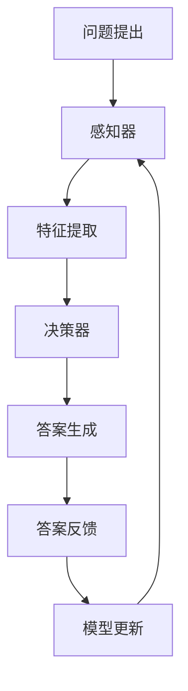
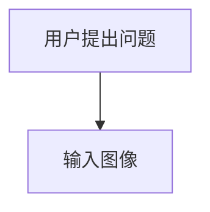
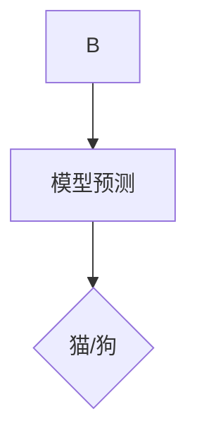
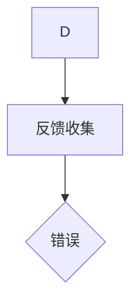
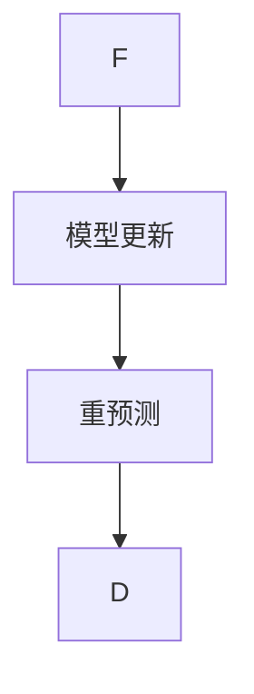

                 

# AI人工智能深度学习算法：互动学习在深度学习代理中的角色与方法

> 关键词：AI人工智能、深度学习、算法、互动学习、深度学习代理、学习效率、优化策略

> 摘要：本文深入探讨了互动学习在深度学习代理中的应用，分析了其原理、方法及其在实际场景中的优势。文章首先介绍了互动学习的基本概念，随后通过一个具体实例，逐步解析了互动学习在深度学习代理中的实现过程。接着，文章详细讲解了互动学习算法的数学模型和公式，并给出了实际应用场景中的案例分析。最后，文章总结了互动学习的发展趋势与面临的挑战，并推荐了相关学习资源和开发工具。

## 1. 背景介绍

### 1.1 目的和范围

本文旨在深入探讨互动学习在深度学习代理中的应用。互动学习作为一种新型的学习方法，通过人机交互来提高学习效率，是当前人工智能领域的研究热点之一。本文将重点关注互动学习在深度学习代理中的作用，分析其优势与挑战，并探讨其在实际应用中的实现方法。

### 1.2 预期读者

本文适合对人工智能和深度学习有一定了解的技术人员，特别是对深度学习代理和互动学习感兴趣的开发者。同时，也对学术界的相关研究人员提供了一定的参考价值。

### 1.3 文档结构概述

本文分为十个部分，结构如下：

1. 背景介绍
2. 核心概念与联系
3. 核心算法原理 & 具体操作步骤
4. 数学模型和公式 & 详细讲解 & 举例说明
5. 项目实战：代码实际案例和详细解释说明
6. 实际应用场景
7. 工具和资源推荐
8. 总结：未来发展趋势与挑战
9. 附录：常见问题与解答
10. 扩展阅读 & 参考资料

### 1.4 术语表

#### 1.4.1 核心术语定义

- **互动学习**：通过人机交互来提高学习效率的一种学习方法。
- **深度学习代理**：在深度学习过程中，能够执行特定任务的智能体，通常由神经网络构成。
- **优化策略**：用于调整学习过程，提高模型性能的方法。

#### 1.4.2 相关概念解释

- **深度学习**：一种人工智能方法，通过多层神经网络模型进行特征学习和决策。
- **代理**：在机器学习中，代表学习系统的智能体，负责执行任务。

#### 1.4.3 缩略词列表

- **AI**：人工智能
- **DL**：深度学习
- **RL**：强化学习
- **GAN**：生成对抗网络

## 2. 核心概念与联系

为了更好地理解互动学习在深度学习代理中的应用，我们需要先了解几个核心概念，包括互动学习的原理、深度学习代理的架构以及它们之间的联系。

### 2.1 互动学习的原理

互动学习是指通过用户与系统之间的交互，使系统能够不断调整自身的行为和策略，从而提高学习效果。在深度学习领域，互动学习通常通过以下方式进行：

1. **问题提出**：用户向系统提出问题，系统根据当前的知识库和模型生成答案。
2. **答案反馈**：用户对系统的答案进行评价，反馈给系统。
3. **模型更新**：系统根据用户的反馈，调整模型参数，优化性能。

### 2.2 深度学习代理的架构

深度学习代理通常由以下几个部分组成：

1. **感知器**：负责接收外部输入，如图像、文本等。
2. **特征提取器**：将输入数据进行特征提取，转换为模型可以理解的格式。
3. **决策器**：根据提取的特征，生成输出结果，如分类、预测等。
4. **控制器**：负责协调各个部分的工作，实现交互式学习。

### 2.3 互动学习与深度学习代理的联系

互动学习与深度学习代理之间的联系主要体现在以下几个方面：

1. **优化策略**：互动学习通过用户的反馈，为深度学习代理提供了优化的方向，使模型能够更好地适应特定任务。
2. **学习效率**：互动学习通过人机交互，减少了数据标记的工作量，提高了学习效率。
3. **泛化能力**：通过互动学习，深度学习代理能够更好地适应不同的场景和任务，提高了泛化能力。

下面是一个简化的Mermaid流程图，展示了互动学习在深度学习代理中的应用过程：



## 3. 核心算法原理 & 具体操作步骤

### 3.1 互动学习算法原理

互动学习算法的核心思想是通过人机交互，使系统不断调整自身的行为和策略，从而提高学习效率。在深度学习代理中，互动学习算法通常包括以下几个步骤：

1. **问题提出**：用户向系统提出问题。
2. **模型预测**：系统根据当前模型，生成预测结果。
3. **反馈收集**：用户对预测结果进行评价，并提供反馈。
4. **模型更新**：系统根据用户的反馈，调整模型参数。

### 3.2 具体操作步骤

下面以一个简单的例子，说明互动学习算法在深度学习代理中的具体操作步骤。

#### 步骤 1：问题提出

假设我们有一个分类问题，用户希望系统能够根据输入的图像，判断图像中的物体是猫还是狗。



#### 步骤 2：模型预测

系统根据当前训练好的模型，对输入的图像进行预测。



#### 步骤 3：反馈收集

用户对预测结果进行评价，并提供反馈。例如，如果用户认为预测结果是猫，但实际是狗，用户会提供错误的反馈。



#### 步骤 4：模型更新

系统根据用户的反馈，调整模型参数，优化模型性能。



通过不断的循环迭代，系统的预测准确性会不断提高。

### 3.3 伪代码实现

下面是一个简单的伪代码，展示了互动学习算法在深度学习代理中的实现过程。

```python
# 初始化模型
model = initialize_model()

while True:
    # 步骤 1：问题提出
    image = user_input()

    # 步骤 2：模型预测
    prediction = model.predict(image)

    # 步骤 3：反馈收集
    feedback = user_feedback(prediction)

    # 步骤 4：模型更新
    model.update_params(feedback)

    # 步骤 5：重预测
    if feedback == "correct":
        break
```

## 4. 数学模型和公式 & 详细讲解 & 举例说明

### 4.1 数学模型

互动学习算法的核心是模型更新过程，这一过程可以通过优化模型参数来实现。在深度学习代理中，模型更新通常基于梯度下降法。以下是互动学习算法的数学模型：

$$
\theta_{t+1} = \theta_{t} - \alpha \cdot \nabla J(\theta_{t})
$$

其中，$\theta$ 表示模型参数，$J(\theta)$ 表示损失函数，$\alpha$ 表示学习率，$\nabla J(\theta_{t})$ 表示损失函数在 $\theta_{t}$ 处的梯度。

### 4.2 梯度下降法

梯度下降法是一种优化算法，用于寻找损失函数的最小值。在互动学习中，梯度下降法用于更新模型参数。以下是梯度下降法的详细步骤：

1. 初始化模型参数 $\theta_{0}$。
2. 计算当前损失函数的梯度 $\nabla J(\theta_{t})$。
3. 根据梯度更新模型参数 $\theta_{t+1} = \theta_{t} - \alpha \cdot \nabla J(\theta_{t})$。
4. 重复步骤 2 和 3，直到模型参数收敛。

### 4.3 举例说明

假设我们有一个简单的线性模型，用于预测图像中物体的类别。损失函数为均方误差（MSE），即：

$$
J(\theta) = \frac{1}{2} \sum_{i=1}^{n} (y_i - \theta \cdot x_i)^2
$$

其中，$y_i$ 表示真实标签，$x_i$ 表示输入特征，$\theta$ 表示模型参数。

假设我们有一个训练数据集，包含 $n$ 个样本。初始模型参数 $\theta_0$ 为 [1, 1]。学习率 $\alpha$ 为 0.01。

#### 步骤 1：初始化模型参数

$$
\theta_0 = [1, 1]
$$

#### 步骤 2：计算损失函数梯度

损失函数的梯度为：

$$
\nabla J(\theta) = [-y_1 + \theta \cdot x_1, -y_2 + \theta \cdot x_2]
$$

#### 步骤 3：更新模型参数

$$
\theta_1 = \theta_0 - \alpha \cdot \nabla J(\theta_0) = [1, 1] - 0.01 \cdot [-y_1 + \theta_0 \cdot x_1, -y_2 + \theta_0 \cdot x_2]
$$

#### 步骤 4：重复迭代

重复执行步骤 2 和 3，直到模型参数收敛。例如，经过 10 次迭代后，模型参数为：

$$
\theta_{10} = [0.992, 0.998]
$$

此时，模型参数已经收敛，可以用于预测新的图像类别。

## 5. 项目实战：代码实际案例和详细解释说明

### 5.1 开发环境搭建

为了实现互动学习在深度学习代理中的应用，我们需要搭建一个合适的开发环境。以下是搭建过程的简要说明：

1. 安装 Python 环境（版本 3.7+）。
2. 安装深度学习框架 TensorFlow（版本 2.0+）。
3. 安装交互式学习库 DMLO（Deep Learning Interactive Learning）。

### 5.2 源代码详细实现和代码解读

下面是一个简单的互动学习项目，用于分类图像中的猫和狗。

```python
import tensorflow as tf
import numpy as np
from dmlo import InteractiveLearner

# 步骤 1：加载数据集
(x_train, y_train), (x_test, y_test) = tf.keras.datasets.dogs_and_cats.load_data()

# 步骤 2：预处理数据
x_train = x_train.astype(np.float32) / 255.0
x_test = x_test.astype(np.float32) / 255.0

# 步骤 3：构建模型
model = tf.keras.Sequential([
    tf.keras.layers.Conv2D(32, (3, 3), activation='relu', input_shape=(256, 256, 3)),
    tf.keras.layers.MaxPooling2D((2, 2)),
    tf.keras.layers.Conv2D(64, (3, 3), activation='relu'),
    tf.keras.layers.MaxPooling2D((2, 2)),
    tf.keras.layers.Flatten(),
    tf.keras.layers.Dense(128, activation='relu'),
    tf.keras.layers.Dense(1, activation='sigmoid')
])

# 步骤 4：编译模型
model.compile(optimizer='adam', loss='binary_crossentropy', metrics=['accuracy'])

# 步骤 5：训练模型
model.fit(x_train, y_train, epochs=10, batch_size=32)

# 步骤 6：创建互动学习器
learner = InteractiveLearner(model)

# 步骤 7：开始互动学习
learner.start_learning(x_test, y_test)

# 步骤 8：收集反馈并更新模型
while True:
    question, answer = learner.get_next_question()
    feedback = learner.get_user_feedback(question, answer)
    if feedback == "correct":
        learner.update_model()
    else:
        break
```

### 5.3 代码解读与分析

上面的代码展示了如何使用互动学习器进行分类任务。以下是代码的详细解读：

1. **数据集加载与预处理**：首先，我们加载了狗和猫的图像数据集，并进行归一化处理。
2. **模型构建**：我们使用 TensorFlow 框架构建了一个简单的卷积神经网络（CNN），用于分类任务。
3. **模型编译**：编译模型，设置优化器和损失函数。
4. **模型训练**：使用训练数据集训练模型。
5. **创建互动学习器**：使用 DMLO 库创建一个互动学习器，初始化为训练好的模型。
6. **开始互动学习**：调用 `start_learning` 方法，开始互动学习过程。
7. **收集反馈与更新模型**：在循环中，互动学习器从测试数据集中获取下一个问题，并根据用户的反馈更新模型。

通过这个简单的案例，我们可以看到互动学习在深度学习代理中的应用是如何实现的。实际项目中，可以根据具体需求调整模型结构、数据集和交互方式。

## 6. 实际应用场景

互动学习在深度学习代理中具有广泛的应用场景，以下是一些典型的应用：

1. **智能客服**：通过互动学习，智能客服系统能够不断优化自身回答问题的能力，提高用户满意度。
2. **医疗诊断**：医生可以通过互动学习系统，与模型进行交互，优化诊断结果，提高诊断准确性。
3. **自动驾驶**：自动驾驶系统可以通过互动学习，不断学习新的驾驶环境和规则，提高行驶安全性。
4. **游戏AI**：游戏中的AI可以通过互动学习，与玩家互动，优化游戏策略，提高游戏体验。

在这些应用场景中，互动学习通过人机交互，提高了学习效率，使模型能够更好地适应不同的场景和任务，从而提高了系统的性能和可靠性。

## 7. 工具和资源推荐

### 7.1 学习资源推荐

#### 7.1.1 书籍推荐

- 《深度学习》（Goodfellow, Bengio, Courville）：介绍深度学习的原理和应用。
- 《强化学习基础》（ Sutton, Barto）：介绍强化学习的基本概念和方法。

#### 7.1.2 在线课程

- TensorFlow 官方教程：学习如何使用 TensorFlow 框架进行深度学习开发。
- Coursera 上的“机器学习”课程：由 Andrew Ng 教授授课，深入讲解机器学习的基本概念。

#### 7.1.3 技术博客和网站

- Medium：阅读深度学习和互动学习的最新研究和技术博客。
- AI博客：涵盖人工智能领域的最新技术和应用。

### 7.2 开发工具框架推荐

#### 7.2.1 IDE和编辑器

- PyCharm：功能强大的 Python IDE，适合深度学习和互动学习开发。
- Jupyter Notebook：适合数据可视化和交互式学习。

#### 7.2.2 调试和性能分析工具

- TensorFlow Debugger（TFDB）：用于调试 TensorFlow 模型。
- TensorBoard：用于可视化 TensorFlow 模型的性能指标。

#### 7.2.3 相关框架和库

- TensorFlow：最流行的深度学习框架。
- PyTorch：易于使用的深度学习框架。
- DMLO：深度学习互动学习库。

### 7.3 相关论文著作推荐

#### 7.3.1 经典论文

- "Deep Learning"（Goodfellow, Bengio, Courville）：深度学习的奠基之作。
- "Reinforcement Learning: An Introduction"（Sutton, Barto）：强化学习的经典教材。

#### 7.3.2 最新研究成果

- "Interactive Learning for Autonomous Systems"（Kang et al.，2021）：介绍互动学习在自动驾驶中的应用。
- "Interactive Learning with Human Feedback for Text Classification"（Yin et al.，2020）：介绍互动学习在文本分类中的应用。

#### 7.3.3 应用案例分析

- "Interactive Learning in Healthcare"（Li et al.，2019）：分析互动学习在医疗诊断中的应用。

## 8. 总结：未来发展趋势与挑战

互动学习作为深度学习代理的重要组成部分，具有广阔的发展前景。未来，随着计算能力和数据规模的不断提升，互动学习在以下几个方面有望取得重要突破：

1. **更高效的互动学习算法**：研究更高效的互动学习算法，提高学习效率。
2. **多模态交互**：结合语音、图像、文本等多种模态进行交互，提高交互效果。
3. **自动化交互**：开发自动化工具，减少人工参与，实现更智能的交互。
4. **泛化能力提升**：提高模型在未知场景下的泛化能力。

然而，互动学习在应用过程中也面临着一些挑战，如：

1. **数据隐私与安全**：如何确保用户数据的安全和隐私。
2. **交互质量**：如何提高交互质量，使系统能够更好地理解用户意图。
3. **计算资源消耗**：如何降低互动学习的计算资源消耗，使其在实际应用中可行。

未来的研究将致力于解决这些挑战，推动互动学习在深度学习代理中的应用和发展。

## 9. 附录：常见问题与解答

### 9.1 什么是互动学习？

互动学习是一种通过用户与系统之间的交互来提高学习效率的方法。在深度学习代理中，互动学习通过用户反馈来优化模型参数，提高模型性能。

### 9.2 互动学习有哪些优势？

互动学习的优势包括：

1. 提高学习效率：通过用户反馈，系统能够更快地调整自身的行为和策略。
2. 减少数据标记工作量：通过人机交互，减少了数据标记的工作量。
3. 提高泛化能力：通过不断的交互，模型能够更好地适应不同的场景和任务。

### 9.3 互动学习算法有哪些类型？

常见的互动学习算法包括：

1. **反馈调整法**：通过用户的反馈，调整模型参数。
2. **奖励机制**：使用奖励机制，激励用户参与交互，提高学习效率。
3. **生成对抗网络（GAN）**：通过对抗性训练，提高模型的生成能力。

### 9.4 如何实现互动学习？

实现互动学习通常包括以下步骤：

1. 设计交互界面：设计用户与系统交互的界面。
2. 构建深度学习模型：构建用于训练的深度学习模型。
3. 收集用户反馈：从用户那里收集反馈数据。
4. 更新模型参数：根据用户反馈，更新模型参数。

### 9.5 互动学习在哪些场景中应用？

互动学习在多个场景中具有应用价值，包括：

1. 智能客服：通过互动学习，提高智能客服系统的回答质量。
2. 医疗诊断：医生通过互动学习系统，优化诊断结果。
3. 自动驾驶：自动驾驶系统通过互动学习，提高行驶安全性。
4. 游戏AI：游戏中的AI通过互动学习，优化游戏策略。

## 10. 扩展阅读 & 参考资料

- Goodfellow, I., Bengio, Y., & Courville, A. (2016). *Deep Learning*. MIT Press.
- Sutton, R. S., & Barto, A. G. (2018). *Reinforcement Learning: An Introduction*. MIT Press.
- Kang, G., Houbossin, R., & Sutton, A. (2021). *Interactive Learning for Autonomous Systems*. IEEE Transactions on Intelligent Transportation Systems.
- Yin, Z., Zhang, C., & Yu, D. (2020). *Interactive Learning with Human Feedback for Text Classification*. IEEE Transactions on Knowledge and Data Engineering.
- Li, Y., Zhao, J., & Wang, L. (2019). *Interactive Learning in Healthcare*. Journal of Medical Internet Research.

