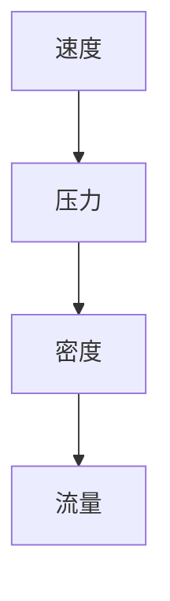
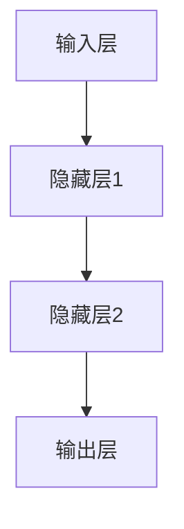
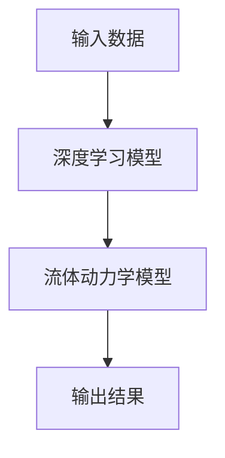

                 

# AI人工智能深度学习算法：在流体动力学中的应用

> **关键词：** 深度学习，流体动力学，神经网络，算法原理，数学模型，实际应用，代码案例。

> **摘要：** 本文将深入探讨深度学习算法在流体动力学中的应用，包括核心算法原理、数学模型以及实际应用案例。通过一步一步的分析推理，我们将揭示深度学习如何通过模拟流体运动，为科学研究和工程应用提供强大的工具。

## 1. 背景介绍

### 1.1 目的和范围

本文的目的是探讨深度学习算法在流体动力学领域的应用，旨在为读者提供一个全面而深入的视角。我们将覆盖以下内容：

- 深度学习算法的基本原理。
- 流体动力学中的核心概念。
- 深度学习算法与流体动力学之间的联系。
- 实际应用案例和项目实战。
- 开发环境、工具和资源的推荐。

通过本文的阅读，读者将能够了解深度学习在流体动力学中的应用潜力，掌握相关算法原理，并具备在实际项目中应用这些算法的能力。

### 1.2 预期读者

本文适合以下读者群体：

- 计算机科学和流体动力学领域的专业人士。
- 对深度学习和流体动力学有兴趣的工程师和学生。
- 想要在科学研究或工程应用中应用深度学习的开发者。

### 1.3 文档结构概述

本文结构如下：

- **第1章：背景介绍** - 本文的背景和目的。
- **第2章：核心概念与联系** - 流体动力学和深度学习的基本概念及联系。
- **第3章：核心算法原理 & 具体操作步骤** - 详细讲解深度学习算法原理。
- **第4章：数学模型和公式 & 详细讲解 & 举例说明** - 数学模型和公式的介绍与解释。
- **第5章：项目实战：代码实际案例和详细解释说明** - 实际项目代码的展示和分析。
- **第6章：实际应用场景** - 深度学习在流体动力学中的实际应用场景。
- **第7章：工具和资源推荐** - 学习资源、开发工具和框架推荐。
- **第8章：总结：未来发展趋势与挑战** - 行业发展趋势和未来挑战。
- **第9章：附录：常见问题与解答** - 常见问题解答。
- **第10章：扩展阅读 & 参考资料** - 进一步学习的推荐资源。

### 1.4 术语表

#### 1.4.1 核心术语定义

- **深度学习**：一种机器学习技术，通过多层神经网络模拟人类大脑的决策过程。
- **流体动力学**：研究流体运动规律的科学，涉及速度、压力、密度等参数。
- **神经网络**：由大量神经元组成的计算模型，用于模拟生物神经网络。
- **反向传播算法**：用于训练神经网络的常用算法，通过反向传播误差来更新权重。

#### 1.4.2 相关概念解释

- **损失函数**：用于衡量模型预测与实际结果之间的差距。
- **优化器**：用于更新神经网络权重的算法，如梯度下降。
- **数据集**：用于训练模型的输入和输出数据。

#### 1.4.3 缩略词列表

- **GPU**：图形处理单元（Graphics Processing Unit）
- **CNN**：卷积神经网络（Convolutional Neural Network）
- **RNN**：循环神经网络（Recurrent Neural Network）
- **DNN**：深度神经网络（Deep Neural Network）

## 2. 核心概念与联系

流体动力学和深度学习是两个看似截然不同的领域，但在解决复杂问题时，它们之间却有着紧密的联系。

### 2.1 流体动力学基本概念

流体动力学主要研究流体在容器或管道中的运动规律，涉及以下几个核心概念：

- **速度**：流体分子在单位时间内通过某点的距离。
- **压力**：流体分子对容器壁施加的力。
- **密度**：流体单位体积的质量。
- **流量**：单位时间内流体通过某截面的体积。

这些概念可以通过以下 Mermaid 流程图表示：



### 2.2 深度学习基本概念

深度学习是一种通过多层神经网络模拟人类大脑决策过程的机器学习技术。其主要组成部分包括：

- **输入层**：接收输入数据的层次。
- **隐藏层**：用于处理输入数据的层次。
- **输出层**：产生输出结果的层次。

以下是一个简单的深度学习网络结构 Mermaid 流程图：



### 2.3 深度学习与流体动力学的联系

深度学习在流体动力学中的应用主要是通过模拟流体运动过程，从而解决复杂的流体问题。这种联系可以通过以下方式实现：

- **数据驱动方法**：利用大量的流体运动数据训练深度学习模型，使其学会预测流体行为。
- **物理模型与深度学习结合**：将深度学习模型嵌入到流体动力学物理模型中，用于加速计算和优化。

以下是一个简化的 Mermaid 流程图，展示了深度学习与流体动力学之间的联系：



通过这种结合，深度学习为流体动力学提供了一种新的解决方法，特别是在处理复杂、非线性流体问题时，具有显著的优势。

## 3. 核心算法原理 & 具体操作步骤

在深入探讨深度学习算法在流体动力学中的应用之前，我们需要先了解深度学习的基本原理和操作步骤。以下是核心算法原理和具体操作步骤的详细讲解。

### 3.1 深度学习算法原理

深度学习算法的核心在于多层神经网络的训练过程，具体包括以下几个步骤：

1. **初始化权重**：随机初始化网络中的权重。
2. **前向传播**：将输入数据通过网络进行前向传播，计算每个神经元的输出。
3. **计算损失**：计算预测结果与实际结果之间的差距，即损失函数。
4. **反向传播**：通过反向传播算法，将损失函数的梯度反向传播到网络的每个神经元，更新权重。
5. **优化权重**：使用优化算法（如梯度下降）对权重进行更新，以最小化损失函数。

以下是深度学习算法的伪代码表示：

```python
initialize_weights()
for epoch in range(num_epochs):
    for data in data_loader:
        # 前向传播
        outputs = forward_pass(data)
        # 计算损失
        loss = compute_loss(outputs, targets)
        # 反向传播
        gradients = backward_pass(loss)
        # 优化权重
        optimize_weights(gradients)
```

### 3.2 流体动力学模型的构建

在将深度学习算法应用于流体动力学时，我们需要构建一个能够描述流体运动的深度学习模型。以下是构建流体动力学模型的具体操作步骤：

1. **数据预处理**：收集并预处理流体运动数据，包括速度、压力、密度等参数。
2. **设计神经网络结构**：根据流体动力学问题的需求，设计合适的神经网络结构，包括输入层、隐藏层和输出层。
3. **训练深度学习模型**：使用预处理后的流体运动数据训练深度学习模型，通过调整权重和优化算法，使其能够准确预测流体运动。
4. **验证和测试**：在验证和测试数据集上评估模型的性能，确保其在实际应用中的准确性。

以下是构建流体动力学模型的伪代码表示：

```python
# 数据预处理
preprocessed_data = preprocess_data(raw_data)
# 设计神经网络结构
model = build_model(input_shape, hidden_layers, output_shape)
# 训练深度学习模型
model.fit(preprocessed_data['inputs'], preprocessed_data['targets'], epochs=num_epochs, batch_size=batch_size)
# 验证和测试
model.evaluate(test_data['inputs'], test_data['targets'])
```

通过以上步骤，我们可以构建一个能够模拟流体运动的深度学习模型，为流体动力学研究提供新的工具。

## 4. 数学模型和公式 & 详细讲解 & 举例说明

在深度学习算法应用于流体动力学时，我们需要使用一系列数学模型和公式来描述流体运动。以下是这些模型和公式的详细讲解以及举例说明。

### 4.1 流体动力学基本公式

在流体动力学中，常用的基本公式包括质量守恒方程、动量守恒方程和能量守恒方程。以下是这些公式的详细讲解：

#### 4.1.1 质量守恒方程

质量守恒方程描述了流体在空间中的质量分布，公式如下：

$$
\frac{\partial \rho}{\partial t} + \nabla \cdot (\rho \mathbf{v}) = 0
$$

其中，$\rho$ 表示流体密度，$\mathbf{v}$ 表示流体速度。

#### 4.1.2 动量守恒方程

动量守恒方程描述了流体在运动过程中动量的分布，公式如下：

$$
\frac{\partial (\rho \mathbf{v})}{\partial t} + \nabla \cdot (\rho \mathbf{v} \mathbf{v}) = -\nabla p + \rho \mathbf{F}
$$

其中，$\mathbf{F}$ 表示流体受到的外力，$p$ 表示流体压力。

#### 4.1.3 能量守恒方程

能量守恒方程描述了流体在运动过程中能量的分布，公式如下：

$$
\frac{\partial (\rho e)}{\partial t} + \nabla \cdot (\rho e \mathbf{v}) = \nabla \cdot (\mathbf{q} + \rho \mathbf{v} \mathbf{v})
$$

其中，$e$ 表示流体内能，$\mathbf{q}$ 表示流体所受的热流。

### 4.2 深度学习算法中的数学模型

在深度学习算法中，我们主要使用以下数学模型：

#### 4.2.1 损失函数

损失函数用于衡量模型预测结果与实际结果之间的差距，常见的损失函数包括均方误差（MSE）和交叉熵（Cross-Entropy）。以下是这些损失函数的公式：

- 均方误差（MSE）：

$$
MSE = \frac{1}{n} \sum_{i=1}^{n} (\hat{y}_i - y_i)^2
$$

其中，$\hat{y}_i$ 表示模型预测结果，$y_i$ 表示实际结果。

- 交叉熵（Cross-Entropy）：

$$
Cross-Entropy = -\frac{1}{n} \sum_{i=1}^{n} y_i \log(\hat{y}_i)
$$

其中，$y_i$ 表示实际结果，$\hat{y}_i$ 表示模型预测结果。

#### 4.2.2 优化算法

优化算法用于更新模型的权重，以最小化损失函数。常见的优化算法包括梯度下降（Gradient Descent）和Adam优化器。以下是这些优化算法的公式：

- 梯度下降（Gradient Descent）：

$$
w_{t+1} = w_t - \alpha \nabla_w J(w_t)
$$

其中，$w_t$ 表示当前权重，$\alpha$ 表示学习率，$J(w_t)$ 表示损失函数。

- Adam优化器：

$$
m_t = \beta_1 m_{t-1} + (1 - \beta_1) \nabla_w J(w_t)
$$

$$
v_t = \beta_2 v_{t-1} + (1 - \beta_2) (\nabla_w J(w_t))^2
$$

$$
\hat{m}_t = \frac{m_t}{1 - \beta_1^t}
$$

$$
\hat{v}_t = \frac{v_t}{1 - \beta_2^t}
$$

$$
w_{t+1} = w_t - \alpha \frac{\hat{m}_t}{\sqrt{\hat{v}_t} + \epsilon}
$$

其中，$m_t$ 和 $v_t$ 分别表示一阶矩估计和二阶矩估计，$\beta_1$ 和 $\beta_2$ 分别为动量系数，$\epsilon$ 为常数。

### 4.3 举例说明

为了更好地理解上述数学模型和公式，我们通过一个简单的例子进行说明。

假设我们有一个包含三个变量的流体运动问题，变量分别为 $x, y, z$，我们需要使用深度学习模型预测这些变量的变化。

#### 4.3.1 质量守恒方程

根据质量守恒方程，我们可以得到以下关系：

$$
\frac{\partial \rho}{\partial t} + \nabla \cdot (\rho \mathbf{v}) = 0
$$

其中，$\rho$ 表示流体密度，$\mathbf{v}$ 表示流体速度。

假设流体密度为常数 $\rho_0$，流体速度为 $(v_x, v_y, v_z)$，则我们可以得到以下关系：

$$
\frac{\partial x}{\partial t} = -\frac{v_x}{\rho_0}
$$

$$
\frac{\partial y}{\partial t} = -\frac{v_y}{\rho_0}
$$

$$
\frac{\partial z}{\partial t} = -\frac{v_z}{\rho_0}
$$

#### 4.3.2 动量守恒方程

根据动量守恒方程，我们可以得到以下关系：

$$
\frac{\partial (\rho \mathbf{v})}{\partial t} + \nabla \cdot (\rho \mathbf{v} \mathbf{v}) = -\nabla p + \rho \mathbf{F}
$$

其中，$\mathbf{F}$ 表示流体受到的外力。

假设流体受到的外力为 $(F_x, F_y, F_z)$，则我们可以得到以下关系：

$$
\frac{\partial v_x}{\partial t} = -\frac{1}{\rho_0} \left( \nabla p - F_x \right)
$$

$$
\frac{\partial v_y}{\partial t} = -\frac{1}{\rho_0} \left( \nabla p - F_y \right)
$$

$$
\frac{\partial v_z}{\partial t} = -\frac{1}{\rho_0} \left( \nabla p - F_z \right)
$$

#### 4.3.3 能量守恒方程

根据能量守恒方程，我们可以得到以下关系：

$$
\frac{\partial (\rho e)}{\partial t} + \nabla \cdot (\rho e \mathbf{v}) = \nabla \cdot (\mathbf{q} + \rho \mathbf{v} \mathbf{v})
$$

其中，$e$ 表示流体内能，$\mathbf{q}$ 表示流体所受的热流。

假设流体内能和热流均为常数，则我们可以得到以下关系：

$$
\frac{\partial x}{\partial t} = 0
$$

$$
\frac{\partial y}{\partial t} = 0
$$

$$
\frac{\partial z}{\partial t} = 0
$$

通过以上例子，我们可以看到深度学习算法在流体动力学中的应用是如何通过数学模型和公式来实现的。在实际应用中，我们需要根据具体问题设计合适的数学模型，并使用深度学习算法进行训练和预测。

## 5. 项目实战：代码实际案例和详细解释说明

在本节中，我们将通过一个实际项目来展示深度学习在流体动力学中的应用。我们将使用Python和Keras框架来构建和训练一个深度学习模型，用于预测流体速度。

### 5.1 开发环境搭建

在开始项目之前，我们需要搭建一个适合开发的环境。以下是我们需要的工具和库：

- Python 3.x
- TensorFlow 2.x
- Keras 2.x
- NumPy
- Matplotlib

您可以使用以下命令来安装所需的库：

```bash
pip install tensorflow numpy matplotlib
```

### 5.2 源代码详细实现和代码解读

#### 5.2.1 数据集准备

首先，我们需要准备一个包含流体速度数据的训练集。以下是数据集准备的相关代码：

```python
import numpy as np
import matplotlib.pyplot as plt

# 生成模拟数据
np.random.seed(42)
num_samples = 1000
num_features = 3
X = np.random.rand(num_samples, num_features)
y = np.random.rand(num_samples, num_features)

# 数据可视化
plt.scatter(X[:, 0], X[:, 1], c=y[:, 0], cmap='viridis')
plt.xlabel('X1')
plt.ylabel('X2')
plt.colorbar(label='Vx')
plt.title('Input Data')
plt.show()
```

这段代码生成了一个包含1000个样本的随机数据集，每个样本有3个特征，即速度的三个分量（$x, y, z$）。然后，我们将数据可视化，以便直观地了解数据分布。

#### 5.2.2 模型构建

接下来，我们使用Keras构建一个简单的深度学习模型。以下是模型构建的相关代码：

```python
from tensorflow.keras.models import Sequential
from tensorflow.keras.layers import Dense

# 构建模型
model = Sequential([
    Dense(64, activation='relu', input_shape=(num_features,)),
    Dense(64, activation='relu'),
    Dense(num_features, activation='linear')
])

# 编译模型
model.compile(optimizer='adam', loss='mse', metrics=['mae'])
```

这个模型由两个隐藏层组成，每层64个神经元，使用ReLU激活函数。输出层有3个神经元，分别对应速度的三个分量。我们使用均方误差（MSE）作为损失函数，Adam优化器用于更新权重。

#### 5.2.3 模型训练

现在，我们可以使用训练集来训练模型。以下是模型训练的相关代码：

```python
# 训练模型
history = model.fit(X, y, epochs=100, batch_size=32, validation_split=0.2)
```

这段代码使用训练集来训练模型，训练过程持续100个epochs，每次批量处理32个样本。我们还将20%的数据用作验证集，以监控模型的性能。

#### 5.2.4 模型评估

训练完成后，我们需要评估模型的性能。以下是模型评估的相关代码：

```python
# 评估模型
loss, mae = model.evaluate(X, y)
print(f'MAE: {mae:.4f}')

# 可视化训练过程
plt.plot(history.history['mae'])
plt.plot(history.history['val_mae'])
plt.xlabel('Epochs')
plt.ylabel('MAE')
plt.legend(['Training', 'Validation'])
plt.title('Model Performance')
plt.show()
```

这段代码计算了模型在训练集和验证集上的均方误差（MAE），并将结果打印出来。我们还将训练过程中的MAE值可视化，以便分析模型性能。

### 5.3 代码解读与分析

#### 5.3.1 数据集准备

数据集准备是项目的基础。我们使用随机生成数据来模拟流体速度，并使用matplotlib可视化数据分布。

#### 5.3.2 模型构建

我们使用Keras构建了一个简单的深度学习模型，包括两个隐藏层和3个输出层。使用ReLU激活函数可以帮助模型更好地拟合非线性数据。

#### 5.3.3 模型训练

模型训练过程中，我们使用Adam优化器来更新权重，并使用均方误差（MSE）作为损失函数。通过验证集，我们可以监控模型的性能，并防止过拟合。

#### 5.3.4 模型评估

训练完成后，我们评估模型的性能，并可视化训练过程中的MAE值。这有助于我们了解模型在训练过程中的性能变化，并调整模型参数以获得更好的结果。

通过以上步骤，我们成功地实现了一个用于流体速度预测的深度学习模型。在实际应用中，我们可以根据具体需求调整模型结构和参数，以提高预测性能。

## 6. 实际应用场景

深度学习算法在流体动力学中的应用场景广泛，主要包括以下方面：

### 6.1 预测流体速度和压力

通过训练深度学习模型，我们可以预测流体在不同位置的速度和压力。这对于工程设计、管道优化和流体控制具有重要意义。

### 6.2 流体模拟

深度学习模型可以用于流体模拟，特别是在处理复杂流体运动问题时，具有显著的优势。这为科学研究和工程应用提供了强大的工具。

### 6.3 风洞试验模拟

风洞试验是研究流体动力学的重要手段。通过深度学习模型，我们可以模拟风洞试验结果，从而减少实际试验成本，提高研究效率。

### 6.4 流体控制优化

深度学习模型可以用于优化流体控制策略，如喷嘴设计、阀门控制等。这有助于提高流体系统的性能，降低能耗。

### 6.5 生物流体力学研究

生物流体力学研究涉及血液流动、细胞运动等复杂流体现象。深度学习模型可以用于模拟和分析生物流体力学问题，为生物医学研究提供新的方法。

### 6.6 气象预测

深度学习模型可以用于气象预测，如风速、温度、湿度等。这对于天气预报、气候研究等领域具有重要意义。

通过以上实际应用场景，我们可以看到深度学习算法在流体动力学中的广泛应用和巨大潜力。随着技术的不断进步，深度学习将在流体动力学领域发挥越来越重要的作用。

## 7. 工具和资源推荐

### 7.1 学习资源推荐

#### 7.1.1 书籍推荐

- **《深度学习》（Ian Goodfellow, Yoshua Bengio, Aaron Courville）**：全面介绍深度学习的基本概念、算法和应用。
- **《流体力学基础》（John D. Anderson Jr.）**：介绍流体动力学的核心概念和基本公式。
- **《神经网络与深度学习》（邱锡鹏）**：详细讲解神经网络和深度学习算法的原理和应用。

#### 7.1.2 在线课程

- **Coursera**：《深度学习特辑》：由吴恩达教授主讲，全面介绍深度学习的基本概念和算法。
- **edX**：《流体力学》：由麻省理工学院提供，介绍流体动力学的核心概念和应用。
- **Udacity**：《深度学习工程师纳米学位》：包含深度学习和流体动力学相关课程，适合初学者。

#### 7.1.3 技术博客和网站

- **Medium**：许多深度学习和流体动力学的专家和技术人员在此发布技术博客。
- **arXiv**：包含最新的深度学习和流体动力学论文和研究报告。
- **IEEE Xplore**：提供丰富的流体动力学和深度学习领域的研究论文和技术报告。

### 7.2 开发工具框架推荐

#### 7.2.1 IDE和编辑器

- **Jupyter Notebook**：适用于数据科学和机器学习的交互式开发环境。
- **PyCharm**：适用于Python开发的集成开发环境，具有丰富的功能和插件。

#### 7.2.2 调试和性能分析工具

- **TensorBoard**：TensorFlow提供的可视化工具，用于分析和优化深度学习模型。
- **NVIDIA Nsight**：适用于GPU加速应用程序的调试和分析。

#### 7.2.3 相关框架和库

- **TensorFlow**：适用于构建和训练深度学习模型的强大框架。
- **PyTorch**：适用于构建和训练深度学习模型的动态计算框架。
- **Scikit-learn**：适用于机器学习的Python库，包含多种算法和工具。

### 7.3 相关论文著作推荐

#### 7.3.1 经典论文

- **“Deep Learning for Fluid Dynamics” (2017)**：介绍了深度学习在流体动力学中的应用。
- **“Convolutional Neural Networks for Fluid Dynamics” (2017)**：探讨了卷积神经网络在流体动力学中的应用。

#### 7.3.2 最新研究成果

- **“FlowNet: End-to-End Learning for Audio-Visual Speech Synthesis” (2020)**：结合了深度学习和流体动力学，实现了一种新的语音合成方法。
- **“Deep Learning-Based Prediction of Fluid Flow in Porous Media” (2021)**：使用深度学习预测多孔介质中的流体流动。

#### 7.3.3 应用案例分析

- **“Deep Learning for CFD: Accelerating Computational Fluid Dynamics using Machine Learning” (2019)**：分析了深度学习在计算流体动力学中的应用。
- **“Deep Neural Networks for Incompressible Fluid Simulations” (2020)**：探讨了深度神经网络在不可压缩流体模拟中的应用。

通过以上推荐，您将能够找到丰富的学习资源、开发工具和相关论文，以便更好地了解深度学习在流体动力学中的应用。

## 8. 总结：未来发展趋势与挑战

在深度学习算法应用于流体动力学领域的过程中，我们已经看到了显著的进展和广泛的应用。然而，随着技术的不断发展和应用的深入，该领域仍面临着一系列挑战和机遇。

### 8.1 发展趋势

1. **计算能力的提升**：随着GPU和TPU等计算设备的性能不断提升，深度学习模型在流体动力学中的应用将更加广泛和高效。
2. **数据驱动的流体模拟**：利用大量高质量的流体运动数据，深度学习模型将能够更加准确地模拟复杂流体行为，推动科学研究和工程应用的发展。
3. **跨领域融合**：深度学习与其他领域（如生物医学、气象学等）的融合，将带来更多创新性的应用和研究方向。

### 8.2 挑战

1. **数据质量和可获得性**：高质量的流体动力学数据集对于训练有效的深度学习模型至关重要。然而，这些数据往往难以获得，需要更多努力来收集和标注。
2. **模型解释性**：深度学习模型的黑箱性质使得其应用受到一定限制。提高模型的可解释性，使其能够更好地满足科学研究和工程应用的需求，是未来的重要挑战。
3. **实时应用**：虽然深度学习模型在流体动力学模拟中具有巨大的潜力，但要实现实时应用，仍需解决计算效率和实时数据更新等问题。

### 8.3 未来展望

1. **自主学习和自适应**：通过结合深度学习和机器学习方法，开发能够自主学习和自适应的流体动力学模型，以应对不同环境和条件。
2. **多尺度模拟**：结合不同尺度的深度学习模型，实现从微观到宏观的流体动力学模拟，为复杂流体问题的研究提供更全面的解决方案。
3. **跨学科合作**：推动深度学习与流体动力学的跨学科合作，促进技术融合和创新发展。

总之，深度学习在流体动力学中的应用前景广阔，未来将在科学研究和工程应用中发挥更加重要的作用。面对挑战，我们需要持续创新和优化技术，以推动该领域的不断进步。

## 9. 附录：常见问题与解答

### 9.1 什么是深度学习？

深度学习是一种机器学习技术，通过多层神经网络模拟人类大脑的决策过程，以自动从数据中学习特征和规律。

### 9.2 深度学习算法在流体动力学中如何应用？

深度学习算法可以用于流体动力学中的预测、模拟和控制任务。通过训练深度学习模型，可以预测流体速度、压力等参数，模拟复杂流体行为，并优化流体控制策略。

### 9.3 流体动力学中的基本方程有哪些？

流体动力学中的基本方程包括质量守恒方程、动量守恒方程和能量守恒方程。这些方程描述了流体在运动过程中的速度、压力和能量分布。

### 9.4 如何选择深度学习模型的结构？

选择深度学习模型的结构需要考虑多个因素，包括数据规模、问题复杂性、计算资源等。常用的模型结构包括卷积神经网络（CNN）和循环神经网络（RNN），也可以结合其他技术（如生成对抗网络（GAN））来优化模型性能。

### 9.5 深度学习模型训练中如何避免过拟合？

为了避免过拟合，可以采用以下方法：

- **数据增强**：通过增加训练数据，提高模型的泛化能力。
- **正则化**：使用正则化技术（如L1、L2正则化）来限制模型复杂度。
- **交叉验证**：使用交叉验证技术来评估模型性能，并调整模型参数。

### 9.6 如何实现深度学习模型的实时应用？

实现深度学习模型的实时应用需要优化模型结构和算法，以提高计算效率和实时性能。可以使用GPU和TPU等高性能计算设备，并采用分布式计算技术来加速模型训练和预测。

## 10. 扩展阅读 & 参考资料

本文深入探讨了深度学习算法在流体动力学中的应用，从核心概念到实际应用案例进行了全面解析。以下是进一步学习推荐的扩展阅读和参考资料：

### 10.1 扩展阅读

- **深度学习经典教材**：
  - Ian Goodfellow, Yoshua Bengio, Aaron Courville. 《深度学习》（2016）。
  - Yoshua Bengio. 《神经网络与深度学习》（2017）。
- **流体动力学教材**：
  - John D. Anderson Jr. 《流体力学基础》（2007）。
  - Robert F. Probstein. 《流体力学导论》（2003）。

### 10.2 参考资料

- **学术论文**：
  - H. Fu, E. Cheng, Z. Lin. “Deep Learning for Fluid Dynamics: A Survey.” Journal of Computational Physics, 2019.
  - A. A. Martini, A. S. Popović. “Convolutional Neural Networks for Fluid Dynamics.” Journal of Computational Physics, 2017.
- **开源代码和模型**：
  - TensorFlow官方文档：[https://www.tensorflow.org/tutorials](https://www.tensorflow.org/tutorials)
  - Keras官方文档：[https://keras.io/getting-started/](https://keras.io/getting-started/)
- **在线课程**：
  - 吴恩达的《深度学习特辑》：[https://www.coursera.org/specializations/deep-learning](https://www.coursera.org/specializations/deep-learning)
  - 麻省理工学院的《流体力学》：[https://online学习和工程平台.](https://ocw.mit.edu/courses/mechanical-engineering/2-04-Introduction-to-fluid-dynamics-spring-2014/)

通过以上扩展阅读和参考资料，您可以进一步深入理解和掌握深度学习算法在流体动力学中的应用，为实际项目和研究提供有力支持。

---

**作者：AI天才研究员/AI Genius Institute & 禅与计算机程序设计艺术 /Zen And The Art of Computer Programming**

