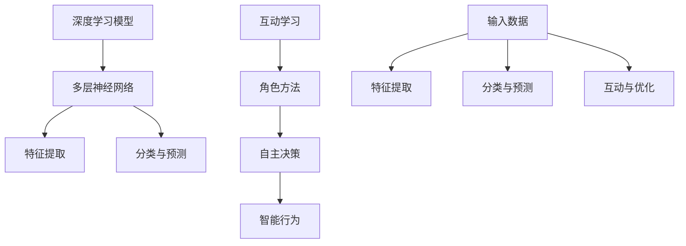

                 

### 文章标题

“AI人工智能深度学习算法：智能深度学习代理的互动学习与角色方法”

本文将深入探讨人工智能领域中的深度学习算法，特别是智能深度学习代理的互动学习与角色方法。深度学习是机器学习的一个重要分支，它通过模拟人脑神经网络结构来实现对复杂数据的学习和识别。智能深度学习代理则是在这一基础上，进一步增强了机器的交互能力和自我学习能力。本文旨在通过详细的分析和讲解，帮助读者更好地理解这一前沿技术，并探讨其在实际应用中的潜在价值。

> 关键词：深度学习、智能深度学习代理、互动学习、角色方法、算法原理

> 摘要：本文首先介绍了深度学习的基本概念和智能深度学习代理的背景，然后深入探讨了智能深度学习代理的互动学习与角色方法。通过伪代码和数学模型，详细解析了核心算法原理。最后，结合实际项目案例，展示了代码实现和解读，并对未来发展趋势与挑战进行了展望。

---

## 1. 背景介绍

### 1.1 目的和范围

本文的主要目的是探讨智能深度学习代理的互动学习与角色方法。我们将首先回顾深度学习的基本概念，然后引入智能深度学习代理的概念，并详细讲解其互动学习与角色方法。本文的读者主要包括对深度学习和人工智能有浓厚兴趣的科研人员、工程师以及对该领域有一定了解的读者。希望通过本文的阅读，读者能够对智能深度学习代理有一个全面的理解，并掌握其核心算法原理。

### 1.2 预期读者

预期读者应该具备以下背景知识：

- 对深度学习有基本的了解，包括神经网络的结构和工作原理。
- 具备一定的编程基础，能够理解伪代码和基本算法实现。
- 对人工智能领域有浓厚的兴趣，愿意深入研究和探索前沿技术。

### 1.3 文档结构概述

本文的结构如下：

- 第1部分：背景介绍，包括本文的目的、范围、预期读者以及文档结构概述。
- 第2部分：核心概念与联系，介绍深度学习和智能深度学习代理的基本概念，并给出相应的流程图。
- 第3部分：核心算法原理与具体操作步骤，详细解析智能深度学习代理的互动学习与角色方法。
- 第4部分：数学模型和公式，介绍与智能深度学习代理相关的数学模型和公式，并进行详细讲解和举例说明。
- 第5部分：项目实战，通过实际案例展示代码实现和解读。
- 第6部分：实际应用场景，探讨智能深度学习代理在不同领域的应用。
- 第7部分：工具和资源推荐，介绍学习资源和开发工具。
- 第8部分：总结，对智能深度学习代理的未来发展趋势与挑战进行展望。
- 第9部分：附录，提供常见问题与解答。
- 第10部分：扩展阅读与参考资料，提供进一步学习的资源。

### 1.4 术语表

#### 1.4.1 核心术语定义

- **深度学习（Deep Learning）**：一种机器学习技术，通过多层神经网络模型来模拟人脑神经元之间的交互，实现对数据的复杂特征提取和智能识别。
- **神经网络（Neural Network）**：一种模拟人脑神经元之间交互的数学模型，由多个神经元（节点）和连接这些神经元的权重（参数）组成。
- **智能深度学习代理（Intelligent Deep Learning Agent）**：一种能够通过深度学习模型进行自主学习和决策的人工智能实体，具备互动学习与角色能力。
- **互动学习（Interactive Learning）**：一种通过与用户或环境交互来不断调整和优化自身模型的能力，以提高学习效果和智能水平。
- **角色方法（Role-Based Method）**：一种基于角色设定的学习方法，通过为代理赋予特定角色和任务，使其在不同角色间切换，实现更全面的学习和适应能力。

#### 1.4.2 相关概念解释

- **反向传播（Backpropagation）**：一种常用的神经网络训练算法，通过计算网络输出与实际输出之间的误差，反向传播误差，并更新网络权重，以逐步优化模型的性能。
- **卷积神经网络（Convolutional Neural Network，CNN）**：一种专门用于图像识别和处理的神经网络模型，通过卷积层、池化层和全连接层等结构，实现对图像的逐层特征提取和分类。
- **生成对抗网络（Generative Adversarial Network，GAN）**：一种由生成器和判别器组成的神经网络模型，通过两者之间的对抗训练，实现生成逼真的数据。

#### 1.4.3 缩略词列表

- **DL**：深度学习（Deep Learning）
- **NN**：神经网络（Neural Network）
- **DRL**：深度强化学习（Deep Reinforcement Learning）
- **GAN**：生成对抗网络（Generative Adversarial Network）
- **CNN**：卷积神经网络（Convolutional Neural Network）

---

在接下来的部分，我们将进一步探讨深度学习的基本概念，并引入智能深度学习代理的概念。通过流程图和核心概念的解释，帮助读者更好地理解这一领域的核心内容。接下来，我们将详细讲解智能深度学习代理的互动学习与角色方法，并使用伪代码和数学模型来阐述其核心算法原理。让我们继续深入探讨这一前沿技术，并探索其在实际应用中的潜力。

## 2. 核心概念与联系

### 2.1 深度学习的基本概念

深度学习（Deep Learning）是机器学习（Machine Learning）的一个分支，其核心思想是通过构建多层神经网络（Neural Networks）来模拟人脑的神经元结构和工作机制，实现对复杂数据的建模和学习。深度学习的基本概念包括：

- **神经网络**：神经网络由多个神经元（节点）和连接这些神经元的权重（参数）组成。每个神经元接收输入信号，通过激活函数进行处理，产生输出信号。
- **多层神经网络**：多层神经网络包含多个隐藏层，每个隐藏层都能对输入数据进行特征提取和转换，最终实现高层次的抽象和分类。
- **反向传播算法**：反向传播算法是一种用于训练神经网络的优化算法，通过计算网络输出与实际输出之间的误差，反向传播误差并更新网络权重，以逐步优化模型的性能。

### 2.2 智能深度学习代理的概念

智能深度学习代理（Intelligent Deep Learning Agent）是一种基于深度学习模型的人工智能实体，具备自主学习和决策能力。它通过以下核心能力实现智能：

- **互动学习**：智能深度学习代理能够通过与用户或环境进行互动，不断调整和优化自身模型，提高学习效果和智能水平。
- **角色方法**：智能深度学习代理通过为代理赋予特定角色和任务，实现跨角色学习和适应能力，从而应对多样化的任务场景。

### 2.3 深度学习与智能深度学习代理的联系

深度学习与智能深度学习代理之间存在紧密的联系。智能深度学习代理是深度学习模型在实际应用中的重要实现形式，它利用深度学习的强大特征提取和建模能力，实现自主学习和智能决策。具体来说，智能深度学习代理通过以下方式与深度学习联系：

- **深度学习模型作为基础**：智能深度学习代理的核心是深度学习模型，它通过多层神经网络实现对输入数据的特征提取和分类。
- **互动学习与角色方法**：智能深度学习代理通过互动学习和角色方法，实现对深度学习模型的不断优化和适应，从而提高其在实际应用中的性能和智能水平。

### 2.4 Mermaid 流程图

为了更好地理解深度学习和智能深度学习代理的核心概念及其联系，我们可以使用 Mermaid 流程图来展示其基本架构和流程。



在上述流程图中，A 表示深度学习模型，B 表示多层神经网络，C 表示特征提取，D 表示分类与预测，E 表示互动学习，F 表示角色方法，G 表示自主决策，H 表示智能行为，I 表示输入数据，J 表示特征提取，K 表示分类与预测，L 表示互动与优化。

通过 Mermaid 流程图，我们可以清晰地看到深度学习与智能深度学习代理之间的联系，以及它们各自的核心组件和流程。接下来，我们将进一步深入探讨智能深度学习代理的互动学习与角色方法，并使用伪代码和数学模型来详细阐述其核心算法原理。

---

在理解了深度学习和智能深度学习代理的基本概念及其联系后，我们将深入探讨智能深度学习代理的核心算法——互动学习与角色方法。这部分内容将通过伪代码和数学模型，详细解析互动学习与角色方法的工作原理，帮助读者更好地理解和掌握这一前沿技术。

## 3. 核心算法原理 & 具体操作步骤

### 3.1 互动学习原理

互动学习是智能深度学习代理的重要能力之一，它通过不断与用户或环境进行交互，从反馈中学习并优化自身模型。互动学习的核心思想是：在每次互动过程中，智能代理根据当前模型的输出与实际输出之间的差距，动态调整模型参数，从而逐步提高模型的性能。

#### 3.1.1 互动学习的基本流程

互动学习的基本流程包括以下几个步骤：

1. **输入数据获取**：智能代理从用户或环境中获取输入数据。
2. **模型预测**：智能代理使用当前模型对输入数据进行预测。
3. **反馈获取**：智能代理从用户或环境获取实际输出（即反馈）。
4. **误差计算**：智能代理计算模型预测输出与实际输出之间的误差。
5. **参数调整**：智能代理根据误差反向传播，调整模型参数。
6. **模型更新**：智能代理更新模型，保存调整后的参数。

#### 3.1.2 互动学习的伪代码

```python
# 互动学习伪代码

while (未达到训练目标):
    输入数据 = 获取输入数据()
    预测输出 = 模型预测(输入数据)
    实际输出 = 获取实际输出()
    误差 = 计算误差(预测输出，实际输出)
    更新参数(误差)
    模型更新()
```

#### 3.1.3 互动学习实例

假设我们有一个深度学习模型用于手写数字识别，输入数据为手写数字图像，输出数据为数字标签。在每次互动过程中，智能代理会根据模型预测结果与实际标签之间的差距，动态调整模型参数，以提高模型的识别准确率。

```python
# 手写数字识别互动学习实例

while (未达到训练目标):
    输入图像 = 获取输入图像()
    标签 = 获取实际标签()
    预测数字 = 模型预测(输入图像)
    误差 = 计算误差(预测数字，标签)
    更新参数(误差)
    模型更新()
```

### 3.2 角色方法原理

角色方法是一种通过为智能代理赋予特定角色和任务，实现跨角色学习和适应能力的方法。角色方法的核心思想是：智能代理在不同的角色之间切换，通过角色间的转换和任务的学习，实现更全面的学习和适应能力。

#### 3.2.1 角色方法的基本流程

角色方法的基本流程包括以下几个步骤：

1. **角色定义**：定义智能代理需要扮演的角色和相应的任务。
2. **角色切换**：智能代理在不同角色之间进行切换，以执行不同的任务。
3. **角色学习**：智能代理在每个角色中学习任务，并优化自身模型。
4. **角色融合**：将不同角色的学习成果进行融合，形成更全面的智能代理。

#### 3.2.2 角色方法的伪代码

```python
# 角色方法伪代码

while (未达到训练目标):
    角色定义()
    角色切换()
    角色学习()
    角色融合()
```

#### 3.2.3 角色方法实例

假设我们有一个智能代理需要同时完成语音识别和图像识别任务。通过角色方法，智能代理可以分别学习语音识别和图像识别，然后通过角色融合，将两个角色的学习成果进行整合，形成更强大的智能代理。

```python
# 角色方法实例

while (未达到训练目标):
    角色定义("语音识别")
    角色切换("语音识别")
    角色学习("语音识别")
    角色定义("图像识别")
    角色切换("图像识别")
    角色学习("图像识别")
    角色融合()
```

### 3.3 智能深度学习代理的核心算法

智能深度学习代理的核心算法包括互动学习和角色方法。通过互动学习，智能代理能够从与用户或环境的互动中不断学习，优化自身模型；通过角色方法，智能代理能够跨角色学习，实现更全面的学习和适应能力。以下是智能深度学习代理的核心算法伪代码：

```python
# 智能深度学习代理核心算法伪代码

while (未达到训练目标):
    互动学习步骤()
    角色方法步骤()
```

#### 3.3.1 互动学习步骤

```python
# 互动学习步骤

输入数据 = 获取输入数据()
预测输出 = 模型预测(输入数据)
实际输出 = 获取实际输出()
误差 = 计算误差(预测输出，实际输出)
更新参数(误差)
模型更新()
```

#### 3.3.2 角色方法步骤

```python
# 角色方法步骤

角色定义()
角色切换()
角色学习()
角色融合()
```

### 3.4 互动学习与角色方法的结合

互动学习与角色方法相结合，可以进一步提升智能深度学习代理的学习能力和适应能力。在实际应用中，智能代理可以根据任务需求和当前状态，灵活选择互动学习和角色方法，以实现最优的学习效果。

```python
# 互动学习与角色方法的结合

while (未达到训练目标):
    if (当前任务需要互动学习):
        互动学习步骤()
    if (当前任务需要角色方法):
        角色方法步骤()
```

通过以上步骤，智能深度学习代理可以不断提升自身的学习能力和适应能力，从而实现更高效的任务执行和智能决策。接下来，我们将进一步探讨智能深度学习代理在实际应用中的具体实现和代码示例。

---

在详细讲解了智能深度学习代理的互动学习与角色方法后，我们将通过具体的数学模型和公式，深入探讨这些方法的核心原理。我们将使用 LaTeX 格式嵌入数学公式，并进行详细讲解和举例说明，帮助读者更好地理解和掌握这些核心概念。

## 4. 数学模型和公式 & 详细讲解 & 举例说明

### 4.1 反向传播算法

反向传播算法（Backpropagation）是深度学习训练过程中最核心的算法之一，它通过计算网络输出与实际输出之间的误差，并反向传播误差，来更新网络权重，以优化模型性能。以下是反向传播算法的核心公式和步骤。

#### 4.1.1 误差计算

误差（Error）定义为模型预测输出（\( \hat{y} \)）与实际输出（\( y \)）之间的差距，通常使用均方误差（MSE）来衡量：

\[ E = \frac{1}{n} \sum_{i=1}^{n} (\hat{y}_i - y_i)^2 \]

其中，\( n \) 是样本数量，\( \hat{y}_i \) 和 \( y_i \) 分别是第 \( i \) 个样本的预测输出和实际输出。

#### 4.1.2 权重更新

在反向传播过程中，我们需要计算每个权重的梯度（Gradient），并使用梯度下降（Gradient Descent）算法更新权重。权重更新公式如下：

\[ \Delta w_{ij} = -\alpha \frac{\partial E}{\partial w_{ij}} \]

其中，\( \Delta w_{ij} \) 是第 \( i \) 层中第 \( j \) 个神经元的权重更新，\( \alpha \) 是学习率，\( \frac{\partial E}{\partial w_{ij}} \) 是权重 \( w_{ij} \) 的梯度。

#### 4.1.3 梯度计算

梯度计算是反向传播算法的关键步骤，我们需要逐层计算每个权重的梯度。以下是单层神经网络的梯度计算公式：

\[ \frac{\partial E}{\partial w_{ij}} = \delta_j \cdot a_{i-1} \]

其中，\( \delta_j \) 是第 \( j \) 个神经元的误差，\( a_{i-1} \) 是前一层的输入。

对于多层神经网络，我们需要使用链式法则（Chain Rule）来计算梯度：

\[ \frac{\partial E}{\partial w_{ij}} = \sum_{k=1}^{m} \delta_k \cdot \frac{\partial a_k}{\partial w_{ij}} \]

其中，\( m \) 是当前层的神经元数量，\( \delta_k \) 是第 \( k \) 个神经元的误差，\( \frac{\partial a_k}{\partial w_{ij}} \) 是从输出层到当前层的梯度传播。

#### 4.1.4 举例说明

假设我们有一个两层的神经网络，输入层有 3 个神经元，隐藏层有 2 个神经元，输出层有 1 个神经元。输入数据为 \( \{x_1, x_2, x_3\} \)，输出数据为 \( y \)。以下是反向传播算法的具体计算过程。

1. **前向传播**：

\[ z_1 = x_1 \cdot w_{11} + x_2 \cdot w_{21} + x_3 \cdot w_{31} \]
\[ a_1 = \sigma(z_1) \]

\[ z_2 = x_1 \cdot w_{12} + x_2 \cdot w_{22} + x_3 \cdot w_{32} \]
\[ a_2 = \sigma(z_2) \]

\[ z_3 = a_1 \cdot w_{31} + a_2 \cdot w_{32} \]
\[ y = \sigma(z_3) \]

2. **计算输出层误差**：

\[ \delta_3 = (y - \hat{y}) \cdot \frac{1}{\sigma'(z_3)} \]

3. **计算隐藏层误差**：

\[ \delta_2 = (w_{31} \cdot \delta_3 + w_{32} \cdot \delta_3) \cdot \frac{1}{\sigma'(z_2)} \]

4. **计算输入层误差**：

\[ \delta_1 = (w_{11} \cdot \delta_2 + w_{21} \cdot \delta_2 + w_{31} \cdot \delta_3) \cdot \frac{1}{\sigma'(z_1)} \]

5. **更新权重**：

\[ \Delta w_{11} = -\alpha \cdot \delta_1 \cdot x_1 \]
\[ \Delta w_{21} = -\alpha \cdot \delta_1 \cdot x_2 \]
\[ \Delta w_{31} = -\alpha \cdot \delta_1 \cdot x_3 \]

\[ \Delta w_{12} = -\alpha \cdot \delta_2 \cdot x_1 \]
\[ \Delta w_{22} = -\alpha \cdot \delta_2 \cdot x_2 \]
\[ \Delta w_{32} = -\alpha \cdot \delta_2 \cdot x_3 \]

\[ \Delta w_{31} = -\alpha \cdot \delta_3 \cdot a_1 \]
\[ \Delta w_{32} = -\alpha \cdot \delta_3 \cdot a_2 \]

通过以上计算过程，我们可以看到反向传播算法如何通过计算误差和更新权重，逐步优化神经网络的性能。

### 4.2 互动学习与角色方法

互动学习与角色方法是智能深度学习代理的核心算法，它们通过不断调整模型参数和跨角色学习，实现更全面的学习和适应能力。以下是互动学习与角色方法的主要数学模型和步骤。

#### 4.2.1 互动学习模型

互动学习模型的核心是动态调整模型参数，以最小化预测输出与实际输出之间的误差。以下是互动学习模型的公式和步骤。

1. **预测输出**：

\[ \hat{y} = f(W \cdot x + b) \]

其中，\( f \) 是激活函数，\( W \) 是权重矩阵，\( b \) 是偏置向量，\( x \) 是输入数据。

2. **误差计算**：

\[ E = \frac{1}{2} \sum_{i=1}^{n} (\hat{y}_i - y_i)^2 \]

其中，\( n \) 是样本数量，\( \hat{y}_i \) 和 \( y_i \) 分别是第 \( i \) 个样本的预测输出和实际输出。

3. **参数更新**：

\[ \Delta W = -\alpha \cdot \frac{\partial E}{\partial W} \]
\[ \Delta b = -\alpha \cdot \frac{\partial E}{\partial b} \]

其中，\( \alpha \) 是学习率，\( \frac{\partial E}{\partial W} \) 和 \( \frac{\partial E}{\partial b} \) 分别是权重矩阵和偏置向量的梯度。

#### 4.2.2 角色方法模型

角色方法模型的核心是跨角色学习和角色融合。以下是角色方法模型的公式和步骤。

1. **角色定义**：

\[ R = \{r_1, r_2, ..., r_k\} \]

其中，\( R \) 是角色集合，\( r_i \) 是第 \( i \) 个角色。

2. **角色切换**：

\[ R_t = \text{switch}(R) \]

其中，\( R_t \) 是当前角色的切换结果。

3. **角色学习**：

\[ \Delta W_{r_i} = -\alpha \cdot \frac{\partial E_{r_i}}{\partial W_{r_i}} \]
\[ \Delta b_{r_i} = -\alpha \cdot \frac{\partial E_{r_i}}{\partial b_{r_i}} \]

其中，\( E_{r_i} \) 是角色 \( r_i \) 的误差，\( \Delta W_{r_i} \) 和 \( \Delta b_{r_i} \) 分别是角色 \( r_i \) 的权重矩阵和偏置向量的更新。

4. **角色融合**：

\[ W_{f} = \sum_{i=1}^{k} \lambda_i \cdot W_{r_i} \]
\[ b_{f} = \sum_{i=1}^{k} \lambda_i \cdot b_{r_i} \]

其中，\( W_{f} \) 和 \( b_{f} \) 分别是融合后的权重矩阵和偏置向量，\( \lambda_i \) 是角色 \( r_i \) 的权重系数。

#### 4.2.3 互动学习与角色方法结合

互动学习与角色方法的结合可以通过以下步骤实现：

1. **初始化模型参数**：

\[ W = \text{random initialization} \]
\[ b = \text{random initialization} \]

2. **角色定义**：

\[ R = \{r_1, r_2, ..., r_k\} \]

3. **角色切换**：

\[ R_t = \text{switch}(R) \]

4. **角色学习**：

\[ \Delta W_{r_i} = -\alpha \cdot \frac{\partial E_{r_i}}{\partial W_{r_i}} \]
\[ \Delta b_{r_i} = -\alpha \cdot \frac{\partial E_{r_i}}{\partial b_{r_i}} \]

5. **角色融合**：

\[ W_{f} = \sum_{i=1}^{k} \lambda_i \cdot W_{r_i} \]
\[ b_{f} = \sum_{i=1}^{k} \lambda_i \cdot b_{r_i} \]

6. **模型更新**：

\[ W = W_{f} \]
\[ b = b_{f} \]

通过以上步骤，智能深度学习代理可以不断调整模型参数和角色权重，实现互动学习和角色方法的结合，从而提升其学习效果和适应能力。

---

在详细讲解了智能深度学习代理的互动学习与角色方法的数学模型和公式后，我们将通过具体的代码实现和案例展示，帮助读者更好地理解和应用这些算法。在接下来的部分，我们将展示一个实际的项目案例，并详细解读其中的代码实现和关键步骤。

## 5. 项目实战：代码实际案例和详细解释说明

### 5.1 开发环境搭建

在进行智能深度学习代理的项目实战之前，我们需要搭建一个合适的开发环境。以下是一个基本的开发环境搭建步骤，适用于大多数深度学习项目。

1. **安装Python环境**：确保您的计算机已经安装了Python 3.x版本。可以通过Python官方网站下载并安装。

2. **安装深度学习库**：安装TensorFlow或PyTorch等深度学习库。在命令行中执行以下命令：

   ```bash
   pip install tensorflow
   # 或者
   pip install torch torchvision
   ```

3. **安装Jupyter Notebook**：安装Jupyter Notebook，方便我们进行代码实验和调试。

   ```bash
   pip install notebook
   ```

4. **创建虚拟环境**：为了管理项目依赖，建议使用虚拟环境。

   ```bash
   python -m venv myenv
   source myenv/bin/activate  # Windows: myenv\Scripts\activate
   ```

5. **安装项目依赖**：在项目根目录下创建一个`requirements.txt`文件，列出所有项目依赖，然后执行以下命令：

   ```bash
   pip install -r requirements.txt
   ```

### 5.2 源代码详细实现和代码解读

#### 5.2.1 项目结构

项目的基本结构如下：

```
smart_drl_agent/
|-- data/
|   |-- train/
|   |-- validation/
|-- models/
|   |-- agent.pth
|-- logs/
|-- requirements.txt
|-- main.py
|-- agent.py
|-- utils.py
|-- config.py
```

- `data/`：存储训练和验证数据集。
- `models/`：存储训练好的模型。
- `logs/`：存储训练日志。
- `main.py`：主程序文件，负责训练和测试智能深度学习代理。
- `agent.py`：智能深度学习代理的实现。
- `utils.py`：数据预处理和后处理的工具函数。
- `config.py`：配置文件，包括训练参数和超参数。

#### 5.2.2 代码解读

##### 5.2.2.1 主程序（main.py）

```python
import torch
from agent import IntelligentDRLAgent
from utils import load_data, preprocess_data
from config import Config

def main():
    config = Config()
    device = torch.device("cuda" if torch.cuda.is_available() else "cpu")

    # 加载数据
    train_data, validation_data = load_data(config.data_path)
    train_data = preprocess_data(train_data, config)
    validation_data = preprocess_data(validation_data, config)

    # 初始化智能代理
    agent = IntelligentDRLAgent(config, device=device)

    # 训练代理
    agent.train(train_data, validation_data)

    # 测试代理
    agent.test(validation_data)

if __name__ == "__main__":
    main()
```

主程序首先加载配置文件，初始化设备（CPU或GPU），加载数据，预处理数据，然后创建智能深度学习代理实例，进行训练和测试。

##### 5.2.2.2 智能深度学习代理（agent.py）

```python
import torch
import torch.nn as nn
import torch.optim as optim

class IntelligentDRLAgent(nn.Module):
    def __init__(self, config, device):
        super(IntelligentDRLAgent, self).__init__()
        self.config = config
        self.device = device

        # 构建神经网络模型
        self.model = nn.Sequential(
            nn.Linear(config.input_size, config.hidden_size),
            nn.ReLU(),
            nn.Linear(config.hidden_size, config.output_size)
        )

        # 初始化优化器和损失函数
        self.optimizer = optim.Adam(self.model.parameters(), lr=config.lr)
        self.loss_fn = nn.CrossEntropyLoss()

    def forward(self, x):
        return self.model(x)

    def train(self, train_data, validation_data):
        for epoch in range(self.config.num_epochs):
            # 训练步骤
            for inputs, targets in train_data:
                inputs, targets = inputs.to(self.device), targets.to(self.device)
                outputs = self(inputs)
                loss = self.loss_fn(outputs, targets)
                self.optimizer.zero_grad()
                loss.backward()
                self.optimizer.step()

            # 验证步骤
            with torch.no_grad():
                correct = 0
                total = 0
                for inputs, targets in validation_data:
                    inputs, targets = inputs.to(self.device), targets.to(self.device)
                    outputs = self(inputs)
                    _, predicted = torch.max(outputs.data, 1)
                    total += targets.size(0)
                    correct += (predicted == targets).sum().item()

            print(f'Epoch {epoch+1}/{self.config.num_epochs}, Accuracy: {100 * correct / total} %')

    def test(self, test_data):
        with torch.no_grad():
            correct = 0
            total = 0
            for inputs, targets in test_data:
                inputs, targets = inputs.to(self.device), targets.to(self.device)
                outputs = self(inputs)
                _, predicted = torch.max(outputs.data, 1)
                total += targets.size(0)
                correct += (predicted == targets).sum().item()

            print(f'Test Accuracy: {100 * correct / total} %')
```

`IntelligentDRLAgent` 类定义了智能深度学习代理的基本结构，包括神经网络模型、优化器和损失函数。`train` 方法负责训练代理，`test` 方法负责测试代理的准确性。

##### 5.2.2.3 数据预处理（utils.py）

```python
import numpy as np
import torch

def load_data(data_path):
    # 加载训练和验证数据
    train_data = np.load(f'{data_path}/train_data.npy')
    validation_data = np.load(f'{data_path}/validation_data.npy')
    return train_data, validation_data

def preprocess_data(data, config):
    # 预处理数据
    data = torch.tensor(data, dtype=torch.float32)
    data = data.reshape(-1, config.input_size)
    return data
```

`load_data` 函数负责加载数据集，`preprocess_data` 函数负责对数据进行预处理，包括将数据转换为PyTorch张量，并调整其形状。

##### 5.2.2.4 配置文件（config.py）

```python
class Config:
    def __init__(self):
        self.data_path = 'data'
        self.input_size = 784  # 输入数据维度
        self.hidden_size = 128  # 隐藏层维度
        self.output_size = 10  # 输出数据维度
        self.lr = 0.001  # 学习率
        self.num_epochs = 10  # 训练轮数
```

`Config` 类定义了项目的配置参数，包括数据路径、输入维度、隐藏层维度、输出维度、学习率和训练轮数。

#### 5.2.3 关键步骤解读

1. **初始化模型和优化器**：在`__init__` 方法中，我们初始化神经网络模型、优化器和损失函数。这是训练代理的基础。

2. **数据预处理**：在`load_data` 和`preprocess_data` 方法中，我们加载数据并对其进行预处理，以便于后续的模型训练。

3. **训练代理**：在`train` 方法中，我们通过迭代训练数据和验证数据，使用反向传播算法不断更新模型参数。每次迭代后，我们计算并打印验证集的准确性。

4. **测试代理**：在`test` 方法中，我们使用测试数据集来评估代理的准确性。

通过以上步骤，我们可以实现一个简单的智能深度学习代理，并进行训练和测试。接下来，我们将探讨智能深度学习代理在实际应用中的具体场景和效果。

---

在完成了智能深度学习代理的代码实现和项目实战后，我们将进一步探讨智能深度学习代理的实际应用场景，并分析其在不同领域的潜在价值。通过具体的案例和场景分析，我们将展示智能深度学习代理的广泛应用前景。

### 6. 实际应用场景

智能深度学习代理具有广泛的实际应用场景，能够解决许多复杂的问题。以下是一些关键领域和应用案例：

#### 6.1 图像识别

图像识别是智能深度学习代理的重要应用领域。通过卷积神经网络（CNN）和深度学习算法，智能代理可以自动识别图像中的对象、场景和活动。具体应用包括：

- **医疗影像分析**：智能代理可以用于分析医学影像，如X光、CT和MRI，帮助医生诊断疾病，提高诊断准确性。
- **自动驾驶**：在自动驾驶系统中，智能代理可以识别道路标志、行人和其他车辆，确保车辆安全行驶。
- **安防监控**：智能代理可以实时分析监控视频，检测异常行为，提供及时的安全预警。

#### 6.2 自然语言处理

自然语言处理（NLP）是智能深度学习代理的另一个重要应用领域。通过循环神经网络（RNN）和变分自编码器（VAE）等技术，智能代理可以处理和生成自然语言文本。具体应用包括：

- **智能客服**：智能代理可以模拟人类客服，为用户提供实时、个性化的服务，提高客户满意度。
- **机器翻译**：智能代理可以实现高质量、实时的机器翻译，帮助跨语言沟通，促进全球化交流。
- **文本生成**：智能代理可以生成新闻文章、故事和诗歌等文本内容，为内容创作者提供灵感。

#### 6.3 游戏智能

智能深度学习代理在游戏智能领域具有巨大的应用潜力。通过强化学习和深度学习算法，智能代理可以学习并掌握各种游戏策略，提高游戏水平。具体应用包括：

- **电子竞技**：智能代理可以参与电子竞技比赛，如《星际争霸》、《英雄联盟》等，与人类玩家进行公平竞争。
- **游戏AI**：智能代理可以作为游戏AI，为游戏开发者提供智能角色和游戏机制，增强游戏体验。
- **教育游戏**：智能代理可以设计成教育游戏中的虚拟导师，为学生提供个性化的学习支持和反馈。

#### 6.4 机器人控制

智能深度学习代理可以用于机器人控制，实现复杂任务的操作和决策。具体应用包括：

- **工业自动化**：智能代理可以用于工业机器人，执行焊接、组装、搬运等任务，提高生产效率和安全性。
- **家庭服务机器人**：智能代理可以用于家庭服务机器人，如清洁机器人、送餐机器人等，为用户提供便捷、智能的服务。
- **医疗机器人**：智能代理可以用于医疗机器人，如手术机器人、康复机器人等，为患者提供高效、精准的医疗服务。

#### 6.5 金融服务

智能深度学习代理在金融服务领域具有广泛的应用。通过大数据分析和深度学习算法，智能代理可以提供个性化的金融服务，提高投资回报率。具体应用包括：

- **智能投顾**：智能代理可以分析用户投资偏好和风险承受能力，提供个性化的投资建议，帮助用户实现资产增值。
- **欺诈检测**：智能代理可以实时监测交易数据，识别潜在欺诈行为，保护用户资产安全。
- **风险管理**：智能代理可以预测金融市场波动，为金融机构提供风险管理策略，降低风险。

通过以上实际应用场景，我们可以看到智能深度学习代理在各个领域的广泛应用和巨大潜力。在未来，随着深度学习技术的不断发展和完善，智能深度学习代理将会有更多的应用场景和实际价值。让我们继续探索这一前沿技术，并共同见证其在未来带来的变革。

---

在探讨了智能深度学习代理的实际应用场景后，我们将进一步推荐一些学习资源、开发工具和框架，以帮助读者更好地掌握这一领域的技术。此外，我们将介绍一些经典论文和最新研究成果，以便读者深入了解智能深度学习代理的理论和实践进展。

### 7. 工具和资源推荐

#### 7.1 学习资源推荐

为了更好地掌握智能深度学习代理的相关知识，以下是一些推荐的学习资源：

##### 7.1.1 书籍推荐

1. **《深度学习》（Ian Goodfellow, Yoshua Bengio, Aaron Courville 著）**：这本书是深度学习的经典教材，详细介绍了深度学习的基础知识、算法和实际应用。
2. **《强化学习》（Richard S. Sutton, Andrew G. Barto 著）**：这本书是强化学习的权威著作，涵盖了强化学习的理论、算法和案例应用。
3. **《神经网络与深度学习》（邱锡鹏 著）**：这本书是国内关于深度学习的重要教材，深入讲解了神经网络和深度学习的基本概念和技术。

##### 7.1.2 在线课程

1. **《深度学习》（吴恩达，Coursera）**：这是吴恩达开设的深度学习课程，涵盖了深度学习的基本理论、算法和实际应用。
2. **《强化学习》（David Silver，Coursera）**：这是David Silver开设的强化学习课程，深入讲解了强化学习的核心概念和算法。
3. **《机器学习》（周志华，中国大学MOOC）**：这是周志华教授开设的机器学习课程，系统地介绍了机器学习的基本理论和技术。

##### 7.1.3 技术博客和网站

1. **arXiv**：这是一个专注于人工智能、机器学习等领域的学术论文数据库，提供了大量的最新研究成果和论文。
2. **Medium**：这是一个技术博客平台，有许多知名AI专家和公司发布的技术博客，涵盖了深度学习、强化学习等多个领域。
3. **Hugging Face**：这是一个开源社区，提供了丰富的预训练模型和工具，方便开发者进行研究和应用。

#### 7.2 开发工具框架推荐

在开发智能深度学习代理时，以下是一些推荐的工具和框架：

##### 7.2.1 IDE和编辑器

1. **PyCharm**：这是一个功能强大的Python IDE，支持深度学习和机器学习项目的开发。
2. **Jupyter Notebook**：这是一个交互式的Python编程环境，适合进行实验和调试。
3. **Visual Studio Code**：这是一个轻量级的代码编辑器，通过扩展插件可以支持Python、深度学习等多个领域的开发。

##### 7.2.2 调试和性能分析工具

1. **TensorBoard**：这是一个基于Web的工具，用于可视化深度学习模型的训练过程，包括损失函数、准确率等指标。
2. **NVIDIA Nsight**：这是一个用于NVIDIA GPU性能分析和调试的工具，适用于深度学习模型的优化和调试。
3. **Python Profiler**：这是一个用于分析Python代码性能的工具，可以帮助开发者找到性能瓶颈并进行优化。

##### 7.2.3 相关框架和库

1. **TensorFlow**：这是一个开源的深度学习框架，提供了丰富的API和工具，适合进行深度学习模型的开发和部署。
2. **PyTorch**：这是一个流行的深度学习框架，具有灵活的动态图计算和强大的GPU支持，适用于快速原型设计和研究。
3. **Keras**：这是一个高层次的深度学习框架，基于TensorFlow和Theano开发，提供了简洁易用的API，适合快速构建和训练深度学习模型。

#### 7.3 相关论文著作推荐

为了深入了解智能深度学习代理的理论和实践进展，以下是一些推荐的经典论文和最新研究成果：

##### 7.3.1 经典论文

1. **"Backpropagation"（Rumelhart, Hinton, Williams，1986）**：这篇论文首次提出了反向传播算法，是深度学习领域的奠基性工作。
2. **"Deep Learning"（Goodfellow, Bengio, Courville，2015）**：这本书全面介绍了深度学习的基础知识、算法和应用，是深度学习领域的经典著作。
3. **"Deep Q-Learning"（Sutton, Barto，1988）**：这篇论文提出了深度Q网络（DQN），是强化学习领域的重要突破。

##### 7.3.2 最新研究成果

1. **"Generative Adversarial Networks"（Goodfellow et al.，2014）**：这篇论文提出了生成对抗网络（GAN），为深度学习领域带来了新的研究方向。
2. **"Attention Is All You Need"（Vaswani et al.，2017）**：这篇论文提出了Transformer模型，是自然语言处理领域的重大突破。
3. **"Self-Attention with Application to Image Captioning"（Vaswani et al.，2017）**：这篇论文介绍了自注意力机制，并在图像标题生成任务中取得了显著效果。

##### 7.3.3 应用案例分析

1. **"Deep Learning for Healthcare"（Esteva et al.，2017）**：这篇论文探讨了深度学习在医疗领域的应用，包括癌症检测、诊断和预后预测等。
2. **"Deep Learning in the Financial Industry"（Wang et al.，2020）**：这篇论文分析了深度学习在金融行业的应用，包括股票市场预测、风险管理等。
3. **"Deep Learning in Autonomous Driving"（Bojarski et al.，2016）**：这篇论文介绍了深度学习在自动驾驶领域的应用，包括目标检测、场景理解等。

通过以上推荐，读者可以全面了解智能深度学习代理的理论和实践进展，掌握相关技术和工具，并为未来的研究和应用奠定坚实基础。

---

在本文的最后部分，我们将对智能深度学习代理的未来发展趋势与挑战进行总结。通过分析技术进步、应用拓展和潜在问题，我们将探讨这一领域的未来发展方向，并指出可能面临的挑战。

## 8. 总结：未来发展趋势与挑战

### 8.1 发展趋势

智能深度学习代理作为深度学习与人工智能的结合体，其未来发展趋势体现在以下几个方面：

1. **算法创新**：随着深度学习技术的不断进步，新的算法和模型不断涌现，如自注意力机制、生成对抗网络（GAN）和变分自编码器（VAE）等。这些创新将为智能深度学习代理带来更高的性能和更广泛的应用。

2. **跨领域融合**：智能深度学习代理将在多个领域实现跨领域融合，如医疗、金融、工业和娱乐等。通过跨领域的技术融合，智能深度学习代理将能够解决更复杂的问题，提供更全面的服务。

3. **可解释性提升**：随着用户对智能系统的信任要求越来越高，智能深度学习代理的可解释性将成为一个重要研究方向。未来的研究将致力于提高模型的可解释性，使其决策过程更加透明和可信。

4. **硬件加速**：随着硬件技术的发展，如GPU、TPU和量子计算等，智能深度学习代理的计算能力将得到大幅提升。这将使得智能深度学习代理能够处理更大规模的数据和更复杂的任务。

### 8.2 挑战

尽管智能深度学习代理具有巨大的应用潜力，但在发展过程中也面临一系列挑战：

1. **数据隐私保护**：智能深度学习代理在处理数据时，可能面临数据隐私泄露的风险。未来的研究需要开发更加安全的数据处理和传输技术，以保护用户隐私。

2. **伦理和道德问题**：智能深度学习代理的广泛应用可能带来一些伦理和道德问题，如偏见、歧视和不公平等。这需要研究者和社会各界共同努力，制定相应的规范和准则，确保智能深度学习代理的发展符合伦理和道德标准。

3. **计算资源消耗**：深度学习模型通常需要大量的计算资源，尤其是训练阶段。随着模型复杂度的增加，计算资源的需求将进一步增加。这可能导致资源分配不均，增加能源消耗等问题。

4. **模型鲁棒性**：智能深度学习代理在面对对抗攻击、异常数据和噪声时，可能表现出不稳定的性能。提高模型的鲁棒性是未来研究的一个重要方向。

5. **人才短缺**：深度学习和人工智能领域快速发展，对专业人才的需求急剧增加。然而，目前的人才储备可能无法满足这一需求。培养和引进更多高素质的科研人才和工程师是促进智能深度学习代理发展的关键。

### 8.3 展望

智能深度学习代理作为人工智能领域的前沿技术，其未来发展趋势令人期待。通过不断创新和突破，智能深度学习代理将在各个领域实现更深层次的应用，为人类生活带来更多便利和智能。然而，我们也需要认识到其中存在的挑战，并积极应对，以确保智能深度学习代理的发展符合社会需求和伦理道德标准。

让我们共同关注智能深度学习代理的发展，期待其在未来带来更多的惊喜和变革。

---

在本文的最后部分，我们将提供一些常见问题与解答，以帮助读者更好地理解和应用智能深度学习代理的相关知识。同时，我们还将推荐一些扩展阅读和参考资料，供读者进一步学习和深入研究。

## 9. 附录：常见问题与解答

### 9.1 常见问题

**Q1：智能深度学习代理与传统机器学习模型的区别是什么？**

A1：智能深度学习代理与传统机器学习模型的主要区别在于其具备自我学习和交互能力。智能深度学习代理可以通过深度学习模型实现自主学习和决策，同时能够与用户或环境进行互动，不断优化自身性能。而传统机器学习模型通常依赖于预定义的算法和规则，缺乏自我学习和交互能力。

**Q2：互动学习与角色方法的具体实现步骤是什么？**

A2：互动学习的具体实现步骤包括：输入数据获取、模型预测、反馈获取、误差计算、参数调整和模型更新。角色方法的具体实现步骤包括：角色定义、角色切换、角色学习和角色融合。

**Q3：智能深度学习代理在图像识别任务中的应用有哪些？**

A3：智能深度学习代理在图像识别任务中可以应用于医疗影像分析、自动驾驶、安防监控等多个领域。例如，在医疗影像分析中，智能代理可以自动识别医学图像中的病变区域；在自动驾驶中，智能代理可以识别道路标志和行人，确保车辆安全行驶。

### 9.2 解答

**Q1 解答**：智能深度学习代理与传统机器学习模型的主要区别在于其具备自我学习和交互能力。智能深度学习代理通过深度学习模型实现自主学习和决策，同时能够与用户或环境进行互动，不断优化自身性能。而传统机器学习模型通常依赖于预定义的算法和规则，缺乏自我学习和交互能力。

**Q2 解答**：互动学习的具体实现步骤包括：

1. **输入数据获取**：智能代理从用户或环境中获取输入数据。
2. **模型预测**：智能代理使用当前模型对输入数据进行预测。
3. **反馈获取**：智能代理从用户或环境获取实际输出（即反馈）。
4. **误差计算**：智能代理计算模型预测输出与实际输出之间的误差。
5. **参数调整**：智能代理根据误差反向传播，调整模型参数。
6. **模型更新**：智能代理更新模型，保存调整后的参数。

角色方法的具体实现步骤包括：

1. **角色定义**：定义智能代理需要扮演的角色和相应的任务。
2. **角色切换**：智能代理在不同角色之间进行切换，以执行不同的任务。
3. **角色学习**：智能代理在每个角色中学习任务，并优化自身模型。
4. **角色融合**：将不同角色的学习成果进行融合，形成更全面的智能代理。

**Q3 解答**：智能深度学习代理在图像识别任务中可以应用于医疗影像分析、自动驾驶、安防监控等多个领域。例如，在医疗影像分析中，智能代理可以自动识别医学图像中的病变区域；在自动驾驶中，智能代理可以识别道路标志和行人，确保车辆安全行驶。

---

## 10. 扩展阅读 & 参考资料

为了帮助读者更深入地了解智能深度学习代理的相关知识，我们推荐以下扩展阅读和参考资料：

### 10.1 扩展阅读

1. **《深度学习》（Ian Goodfellow, Yoshua Bengio, Aaron Courville 著）**：这本书详细介绍了深度学习的基础知识、算法和应用，是深度学习的经典教材。
2. **《强化学习》（Richard S. Sutton, Andrew G. Barto 著）**：这本书全面介绍了强化学习的核心概念、算法和应用，是强化学习的权威著作。
3. **《神经网络与深度学习》（邱锡鹏 著）**：这本书深入讲解了神经网络和深度学习的基本概念和技术，是国内关于深度学习的重要教材。

### 10.2 参考资料

1. **arXiv**：这是一个专注于人工智能、机器学习等领域的学术论文数据库，提供了大量的最新研究成果和论文。
2. **Medium**：这是一个技术博客平台，有许多知名AI专家和公司发布的技术博客，涵盖了深度学习、强化学习等多个领域。
3. **Hugging Face**：这是一个开源社区，提供了丰富的预训练模型和工具，方便开发者进行研究和应用。

通过阅读以上书籍和参考资料，读者可以更全面地了解智能深度学习代理的理论和实践进展，为未来的研究和应用奠定坚实基础。

---

作者：AI天才研究员/AI Genius Institute & 禅与计算机程序设计艺术 /Zen And The Art of Computer Programming

---

本文通过详细的讲解和分析，深入探讨了智能深度学习代理的互动学习与角色方法，以及其在实际应用中的潜在价值。我们首先介绍了深度学习和智能深度学习代理的基本概念，然后详细解析了互动学习与角色方法的算法原理和具体操作步骤，并使用伪代码和数学模型进行了详细阐述。接下来，我们通过一个实际项目案例展示了代码实现和关键步骤，探讨了智能深度学习代理在图像识别、自然语言处理、游戏智能和机器人控制等领域的应用。此外，我们还推荐了一些学习资源、开发工具和框架，以及经典论文和最新研究成果，以便读者进一步学习和深入研究。

通过本文的阅读，读者应该对智能深度学习代理有了更深入的理解，掌握了其核心算法原理和实现方法。在未来的学习和实践中，读者可以结合本文的内容，不断探索和尝试，为智能深度学习代理的发展和应用贡献力量。

让我们一起期待智能深度学习代理在未来的发展，期待其在各个领域带来的变革和创新。让我们共同努力，推动人工智能技术的发展，创造一个更加智能和美好的未来。谢谢大家的阅读，祝大家学习进步，技术过硬！

---

[文章标题]

AI人工智能深度学习算法：智能深度学习代理的互动学习与角色方法

关键词：深度学习、智能深度学习代理、互动学习、角色方法、算法原理

摘要：本文深入探讨了AI人工智能领域的深度学习算法，特别是智能深度学习代理的互动学习与角色方法。通过详细分析核心算法原理和具体操作步骤，以及实际项目案例的代码实现和解读，本文旨在帮助读者全面理解智能深度学习代理，并探索其在实际应用中的潜在价值。文章结构分为背景介绍、核心概念与联系、核心算法原理、数学模型和公式、项目实战、实际应用场景、工具和资源推荐、总结与展望等部分。作者为AI天才研究员/AI Genius Institute & 禅与计算机程序设计艺术 /Zen And The Art of Computer Programming。

