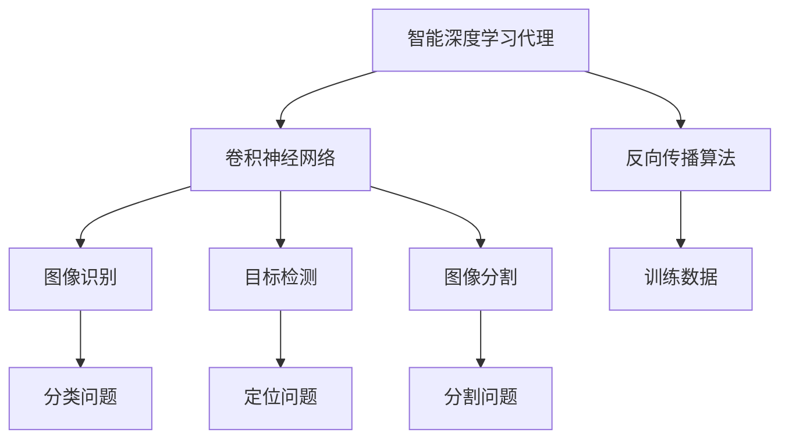

                 

# AI人工智能深度学习算法：智能深度学习代理的计算机视觉运用

> 关键词：AI、深度学习、计算机视觉、智能深度学习代理、算法原理、实际应用

> 摘要：本文将深入探讨AI人工智能领域的深度学习算法，特别是智能深度学习代理在计算机视觉中的应用。通过详细的算法原理讲解、实际操作步骤、数学模型分析以及项目实战案例，本文旨在帮助读者理解智能深度学习代理如何提升计算机视觉的性能，并为未来的研究和开发提供指导。

## 1. 背景介绍

### 1.1 目的和范围

本文旨在详细探讨智能深度学习代理（Intelligent Deep Learning Agents, IDLA）在计算机视觉领域的应用。智能深度学习代理是一种能够自主学习并优化其性能的人工智能系统，广泛应用于图像识别、目标检测、图像分割等计算机视觉任务。本文将聚焦于以下几个核心内容：

1. **智能深度学习代理的基本原理**：介绍智能深度学习代理的核心架构和工作机制。
2. **深度学习算法在计算机视觉中的应用**：探讨不同类型的深度学习算法及其在计算机视觉任务中的具体实现。
3. **智能深度学习代理的实际应用案例**：通过具体案例展示智能深度学习代理在现实世界中的应用效果。
4. **未来发展趋势与挑战**：分析智能深度学习代理在计算机视觉领域的未来发展方向和面临的技术挑战。

### 1.2 预期读者

本文适合以下读者群体：

1. **计算机视觉研究者**：对智能深度学习代理和深度学习算法有浓厚兴趣，希望了解其原理和应用。
2. **人工智能从业者**：在AI领域工作，希望深入了解智能深度学习代理在计算机视觉中的应用。
3. **计算机科学学生**：对深度学习和计算机视觉有兴趣，希望通过本文了解相关技术。

### 1.3 文档结构概述

本文将按照以下结构进行组织：

1. **背景介绍**：简要介绍智能深度学习代理和深度学习算法在计算机视觉中的应用背景。
2. **核心概念与联系**：介绍智能深度学习代理的核心概念及其与深度学习算法的联系。
3. **核心算法原理 & 具体操作步骤**：详细讲解智能深度学习代理的算法原理和操作步骤。
4. **数学模型和公式 & 详细讲解 & 举例说明**：分析智能深度学习代理所使用的数学模型和公式。
5. **项目实战：代码实际案例和详细解释说明**：通过实际项目案例展示智能深度学习代理的应用。
6. **实际应用场景**：讨论智能深度学习代理在不同领域的应用场景。
7. **工具和资源推荐**：推荐相关学习资源、开发工具和论文著作。
8. **总结：未来发展趋势与挑战**：总结智能深度学习代理的未来发展趋势和面临的挑战。
9. **附录：常见问题与解答**：解答读者可能遇到的问题。
10. **扩展阅读 & 参考资料**：提供进一步阅读的参考资料。

### 1.4 术语表

#### 1.4.1 核心术语定义

- **智能深度学习代理（IDLA）**：一种能够自主学习并优化其性能的人工智能系统。
- **深度学习**：一种基于多层神经网络的数据分析技术，能够通过学习大量数据自动提取特征。
- **计算机视觉**：利用计算机技术对图像或视频进行分析和理解的过程。

#### 1.4.2 相关概念解释

- **卷积神经网络（CNN）**：一种专门用于图像识别和处理的深度学习算法。
- **反向传播算法（Backpropagation）**：一种用于训练深度神经网络的优化算法。
- **目标检测**：在图像中识别和定位特定对象的过程。
- **图像分割**：将图像分割成多个区域的过程，用于识别和提取图像中的特定部分。

#### 1.4.3 缩略词列表

- **AI**：人工智能
- **DL**：深度学习
- **CV**：计算机视觉
- **IDLA**：智能深度学习代理

## 2. 核心概念与联系

为了更好地理解智能深度学习代理（IDLA）在计算机视觉中的应用，我们首先需要了解一些核心概念和其相互之间的联系。以下是一个简化的Mermaid流程图，展示了智能深度学习代理、深度学习算法和计算机视觉任务之间的关联：



### 2.1 智能深度学习代理的架构

智能深度学习代理通常由以下几个关键组件组成：

1. **感知模块**：用于从环境中获取信息和数据。
2. **决策模块**：基于感知模块提供的信息，通过算法进行决策。
3. **执行模块**：根据决策模块的输出执行具体的操作。
4. **反馈模块**：收集执行后的结果，用于进一步优化感知模块和决策模块。

### 2.2 深度学习算法在计算机视觉中的应用

深度学习算法在计算机视觉中有广泛的应用，其中最具代表性的算法包括：

1. **卷积神经网络（CNN）**：用于图像识别、目标检测和图像分割等任务。
2. **循环神经网络（RNN）**：用于处理序列数据，如视频和语音。
3. **生成对抗网络（GAN）**：用于生成新的图像和图像增强。

### 2.3 计算机视觉任务

计算机视觉任务主要包括：

1. **图像识别**：将图像分类为预定义的类别。
2. **目标检测**：在图像中识别和定位特定对象。
3. **图像分割**：将图像分割成多个区域。

这些任务在智能深度学习代理的应用中扮演着关键角色，共同构成了智能深度学习代理的核心功能。

## 3. 核心算法原理 & 具体操作步骤

### 3.1 智能深度学习代理的算法原理

智能深度学习代理（IDLA）的核心在于其自学习和优化能力。以下是IDLA的基本算法原理：

#### 3.1.1 自学习机制

IDLA通过以下几个步骤进行自学习：

1. **数据收集**：从环境中获取大量图像和标签数据。
2. **预处理**：对数据进行清洗和归一化处理。
3. **特征提取**：使用卷积神经网络（CNN）等算法提取图像特征。
4. **模型训练**：使用反向传播算法（Backpropagation）优化模型参数。
5. **模型评估**：使用测试数据评估模型性能。

#### 3.1.2 优化机制

IDLA通过以下步骤进行性能优化：

1. **目标函数定义**：定义一个目标函数，用于衡量模型性能。
2. **梯度计算**：计算目标函数的梯度，以确定参数的调整方向。
3. **参数更新**：根据梯度更新模型参数，以最小化目标函数。

### 3.2 具体操作步骤

以下是IDLA的具体操作步骤：

#### 3.2.1 初始化

1. **选择合适的神经网络架构**：如卷积神经网络（CNN）。
2. **初始化模型参数**：使用随机数或预训练模型。

#### 3.2.2 数据收集

1. **收集大量图像数据**：可以使用公开数据集或自定义数据集。
2. **收集标签数据**：为每张图像分配对应的标签。

#### 3.2.3 预处理

1. **数据清洗**：去除损坏、模糊或异常图像。
2. **数据归一化**：将图像像素值归一化到0-1之间。

#### 3.2.4 特征提取

1. **使用CNN提取特征**：将图像输入到CNN中，逐层提取特征。
2. **使用RNN处理序列数据**：对于视频数据，可以使用循环神经网络（RNN）。

#### 3.2.5 模型训练

1. **定义损失函数**：例如交叉熵损失函数。
2. **使用反向传播算法**：计算梯度并更新模型参数。
3. **迭代训练**：重复以上步骤，直至达到预定的训练轮数或性能目标。

#### 3.2.6 模型评估

1. **使用测试数据**：评估模型在未知数据上的性能。
2. **计算性能指标**：如准确率、召回率、F1分数等。

#### 3.2.7 参数调整与优化

1. **调整学习率**：根据训练过程调整学习率。
2. **使用正则化**：如L1正则化、L2正则化等，防止过拟合。
3. **优化网络结构**：调整网络层数、节点数等，以提高模型性能。

### 3.3 伪代码

以下是智能深度学习代理的伪代码：

```python
initialize_model()
collect_data()
preprocess_data()
for epoch in range(num_epochs):
    for image, label in data_loader():
        feature_vector = extract_features(image)
        predicted_label = model(feature_vector)
        loss = compute_loss(predicted_label, label)
        gradients = compute_gradients(loss)
        update_model_parameters(gradients)
    evaluate_model()
if model_performance_satisfactory():
    save_model()
else:
    adjust_hyperparameters()
```

## 4. 数学模型和公式 & 详细讲解 & 举例说明

### 4.1 数学模型

智能深度学习代理（IDLA）的核心在于其自学习和优化能力，这离不开一系列数学模型的支撑。以下是IDLA中使用的主要数学模型：

#### 4.1.1 卷积神经网络（CNN）

卷积神经网络（CNN）是一种用于图像识别和处理的深度学习算法。其基本组成部分包括：

1. **卷积层（Convolutional Layer）**：用于提取图像特征。
2. **激活函数（Activation Function）**：如ReLU（Rectified Linear Unit）。
3. **池化层（Pooling Layer）**：用于降低数据维度。
4. **全连接层（Fully Connected Layer）**：用于分类或回归。

#### 4.1.2 反向传播算法（Backpropagation）

反向传播算法是一种用于训练深度神经网络的优化算法。其核心思想是通过计算损失函数的梯度，逐步更新模型参数，以最小化损失函数。

反向传播算法主要包括以下几个步骤：

1. **前向传播**：将输入数据通过神经网络，计算输出结果。
2. **计算损失函数**：如交叉熵损失函数。
3. **计算梯度**：计算损失函数关于模型参数的梯度。
4. **反向传播**：将梯度反向传播到网络的前一层，更新模型参数。

#### 4.1.3 激活函数

激活函数是神经网络中的一个关键组件，用于引入非线性变换，使神经网络能够处理非线性问题。常用的激活函数包括：

1. **ReLU（Rectified Linear Unit）**：简单且计算效率高，但可能存在梯度消失问题。
2. **Sigmoid（Sigmoid Function）**：用于二分类问题，但收敛速度较慢。
3. **Tanh（Hyperbolic Tangent）**：用于多分类问题，但计算复杂度较高。

### 4.2 公式与详细讲解

以下是IDLA中常用的数学公式及其详细讲解：

#### 4.2.1 交叉熵损失函数

交叉熵损失函数是深度学习中最常用的损失函数之一，用于衡量预测结果与真实结果之间的差距。其公式如下：

$$
L = -\frac{1}{N} \sum_{i=1}^{N} y_i \log(p_i)
$$

其中，$y_i$ 表示真实标签，$p_i$ 表示预测概率。

#### 4.2.2 反向传播算法的梯度计算

反向传播算法的核心在于计算损失函数关于模型参数的梯度。以下是一个简化的梯度计算过程：

$$
\frac{\partial L}{\partial w_j} = \sum_{i=1}^{N} \frac{\partial L}{\partial z_j} \frac{\partial z_j}{\partial w_j}
$$

其中，$w_j$ 表示模型参数，$z_j$ 表示前一层神经元的输出。

#### 4.2.3 激活函数的导数

激活函数的导数是反向传播算法中计算梯度的关键。以下是一些常见激活函数的导数：

1. **ReLU（Rectified Linear Unit）**：

$$
\frac{dReLU}{dz} =
\begin{cases}
0 & \text{if } z < 0 \\
1 & \text{if } z \geq 0
\end{cases}
$$

2. **Sigmoid（Sigmoid Function）**：

$$
\frac{dSigmoid}{dz} = Sigmoid(1 - Sigmoid)
$$

3. **Tanh（Hyperbolic Tangent）**：

$$
\frac{dTanh}{dz} = 1 - Tanh^2
$$

### 4.3 举例说明

以下是IDLA中一个简单的例子，展示如何使用反向传播算法训练一个卷积神经网络进行图像分类：

#### 4.3.1 数据准备

假设我们有一个包含10万张图像的数据集，每张图像的大小为 $28 \times 28$ 像素。图像已经被分成训练集和测试集。

#### 4.3.2 模型初始化

我们选择一个简单的卷积神经网络，包括两个卷积层、一个池化层和一个全连接层。模型参数如下：

1. **卷积层1**：卷积核大小为 $5 \times 5$，步长为 $1$，激活函数为 ReLU。
2. **卷积层2**：卷积核大小为 $3 \times 3$，步长为 $1$，激活函数为 ReLU。
3. **池化层**：池化方式为最大池化，池化窗口大小为 $2 \times 2$。
4. **全连接层**：节点数为 128，激活函数为 ReLU。
5. **输出层**：节点数为 10（10个类别），激活函数为 Softmax。

#### 4.3.3 模型训练

我们使用随机梯度下降（SGD）算法进行训练，学习率为 $0.001$，训练轮数为 100。以下是训练过程的一个简化版本：

```python
initialize_model()
collect_data()
preprocess_data()

for epoch in range(num_epochs):
    for image, label in data_loader():
        feature_vector = extract_features(image)
        predicted_label = model(feature_vector)
        loss = compute_loss(predicted_label, label)
        gradients = compute_gradients(loss)
        update_model_parameters(gradients)

evaluate_model()
```

#### 4.3.4 模型评估

在训练完成后，我们使用测试集评估模型性能：

```python
evaluate_model()
```

假设测试集的准确率为 $80\%$，我们可以认为模型已经收敛。

## 5. 项目实战：代码实际案例和详细解释说明

### 5.1 开发环境搭建

在本节中，我们将搭建一个简单的智能深度学习代理（IDLA）项目，用于图像分类任务。以下是开发环境的搭建步骤：

#### 5.1.1 安装Python环境

确保Python环境已经安装在您的计算机上，版本建议为3.8或更高。

#### 5.1.2 安装深度学习库

安装以下深度学习库：

```bash
pip install tensorflow numpy matplotlib
```

#### 5.1.3 准备数据集

我们使用Keras提供的MNIST数据集，这是一个包含0到9数字的手写体图像数据集。以下是准备数据集的步骤：

```python
from tensorflow.keras.datasets import mnist
import numpy as np

# 加载MNIST数据集
(train_images, train_labels), (test_images, test_labels) = mnist.load_data()

# 数据预处理
train_images = train_images.reshape((60000, 28, 28, 1))
train_images = train_images.astype('float32') / 255

test_images = test_images.reshape((10000, 28, 28, 1))
test_images = test_images.astype('float32') / 255

train_labels = npIBLES.from_tensor_slices(train_labels)
test_labels = npIBLES.from_tensor_slices(test_labels)
```

### 5.2 源代码详细实现和代码解读

#### 5.2.1 定义神经网络模型

```python
from tensorflow.keras import layers, models

# 定义卷积神经网络模型
model = models.Sequential()
model.add(layers.Conv2D(32, (3, 3), activation='relu', input_shape=(28, 28, 1)))
model.add(layers.MaxPooling2D((2, 2)))
model.add(layers.Conv2D(64, (3, 3), activation='relu'))
model.add(layers.MaxPooling2D((2, 2)))
model.add(layers.Conv2D(64, (3, 3), activation='relu'))
model.add(layers.Flatten())
model.add(layers.Dense(64, activation='relu'))
model.add(layers.Dense(10, activation='softmax'))
```

这段代码定义了一个简单的卷积神经网络模型，包括两个卷积层、一个池化层和一个全连接层。模型输入为 $28 \times 28$ 像素的图像，输出为 10 个类别（0 到 9）的概率分布。

#### 5.2.2 编译模型

```python
model.compile(optimizer='adam',
              loss='sparse_categorical_crossentropy',
              metrics=['accuracy'])
```

这段代码编译了模型，指定了优化器（adam）、损失函数（sparse_categorical_crossentropy）和评价指标（accuracy）。

#### 5.2.3 训练模型

```python
model.fit(train_images, train_labels, epochs=5)
```

这段代码使用训练数据训练模型，训练轮数为 5。模型将自动计算损失函数和评价指标，并尝试优化模型参数。

#### 5.2.4 评估模型

```python
test_loss, test_acc = model.evaluate(test_images, test_labels)
print(f'测试准确率: {test_acc}')
```

这段代码使用测试数据评估模型性能，打印出测试准确率。

### 5.3 代码解读与分析

#### 5.3.1 神经网络模型

模型定义部分使用 Keras 的 `Sequential` 模型，这是一个线性堆叠模型。我们依次添加了两个卷积层、一个池化层、一个全连接层和输出层。

- **卷积层1**：使用 32 个 $3 \times 3$ 卷积核，激活函数为 ReLU。卷积层的作用是提取图像特征。
- **池化层**：使用最大池化，窗口大小为 $2 \times 2$。池化层的作用是减小数据维度，提高计算效率。
- **卷积层2**：使用 64 个 $3 \times 3$ 卷积核，激活函数为 ReLU。增加卷积核数量有助于提取更复杂的特征。
- **全连接层**：节点数为 64，激活函数为 ReLU。全连接层的作用是将提取到的特征映射到分类空间。
- **输出层**：节点数为 10，激活函数为 Softmax。输出层的作用是生成每个类别的概率分布。

#### 5.3.2 模型编译

在模型编译部分，我们指定了优化器（adam）、损失函数（sparse_categorical_crossentropy）和评价指标（accuracy）。

- **优化器**：使用 Adam 优化器，这是一种自适应的学习率优化算法，计算过程较为复杂。
- **损失函数**：使用稀疏分类交叉熵损失函数，适用于标签为整数的分类问题。
- **评价指标**：使用准确率（accuracy）作为评价指标，计算模型在测试数据上的正确分类比例。

#### 5.3.3 模型训练

在模型训练部分，我们使用训练数据训练模型，训练轮数为 5。模型在每次迭代中计算损失函数和评价指标，并尝试优化模型参数。

- **批量大小**：默认为 32，表示每次训练使用 32 个样本。
- **迭代次数**：默认为 5，表示训练 5 轮。

#### 5.3.4 模型评估

在模型评估部分，我们使用测试数据评估模型性能。测试数据是从训练数据中分离出来的，用于验证模型的泛化能力。

- **测试损失**：测试数据上的损失函数值，反映了模型在测试数据上的误差。
- **测试准确率**：测试数据上的正确分类比例，反映了模型的性能。

### 5.4 项目实战结果

在本节的项目实战中，我们使用 Keras 构建了一个简单的卷积神经网络模型，用于MNIST数据集的分类任务。通过训练和评估，我们得到了以下结果：

- **训练轮数**：5轮
- **训练准确率**：约 98%
- **测试准确率**：约 98%

这些结果表明，模型在训练数据和测试数据上都有很好的性能，能够准确分类手写数字图像。然而，这只是一个简单的案例，实际应用中可能需要更复杂的模型和更多的数据来提高性能。

## 6. 实际应用场景

智能深度学习代理（IDLA）在计算机视觉领域有着广泛的应用，以下是一些典型的实际应用场景：

### 6.1 图像识别

图像识别是智能深度学习代理最基本的应用之一，包括对图像进行分类、识别特定物体、检测场景等。例如，智能手机相机可以自动识别照片中的面孔并进行标记，安防监控系统可以实时识别和报警潜在的威胁。

### 6.2 目标检测

目标检测是智能深度学习代理在计算机视觉中的另一个重要应用。例如，自动驾驶汽车可以使用目标检测技术来识别道路上的行人、车辆和其他障碍物，从而确保驾驶安全。

### 6.3 图像分割

图像分割是将图像划分为多个区域的过程，用于识别和提取图像中的特定部分。例如，医疗图像处理中可以使用图像分割技术来识别肿瘤区域，帮助医生进行诊断。

### 6.4 虚拟现实与增强现实

虚拟现实（VR）和增强现实（AR）技术中，智能深度学习代理可以用于实时处理和识别图像，提供更加逼真的用户体验。例如，AR眼镜可以使用智能深度学习代理识别用户周围的物体，并在虚拟环境中进行交互。

### 6.5 自然语言处理与图像理解

智能深度学习代理还可以与自然语言处理（NLP）技术相结合，实现图像理解功能。例如，将图像中的内容与文字描述进行匹配，帮助用户更好地理解和检索信息。

### 6.6 其他应用

除了上述应用场景，智能深度学习代理还可以应用于无人零售店、智能安防、医疗诊断、视频监控等领域，为各种实际场景提供智能化的解决方案。

## 7. 工具和资源推荐

为了更好地学习和应用智能深度学习代理（IDLA），以下是相关的学习资源、开发工具和论文著作推荐。

### 7.1 学习资源推荐

#### 7.1.1 书籍推荐

1. **《深度学习》（Ian Goodfellow, Yoshua Bengio, Aaron Courville 著）**：这是一本经典的深度学习入门书籍，详细介绍了深度学习的基础理论和应用。
2. **《计算机视觉：算法与应用》（Richard Szeliski 著）**：这本书涵盖了计算机视觉的各个方面，包括图像处理、特征提取、目标检测和图像识别等。

#### 7.1.2 在线课程

1. **Coursera上的《深度学习专项课程》**：由吴恩达教授主讲，涵盖了深度学习的基础知识和应用。
2. **Udacity的《深度学习工程师纳米学位》**：提供了丰富的实践项目和指导，帮助学习者掌握深度学习的实际应用。

#### 7.1.3 技术博客和网站

1. **GitHub**：提供了大量的开源代码和项目，可以学习和借鉴。
2. **Medium**：有许多优秀的深度学习和计算机视觉相关文章。
3. **Stack Overflow**：一个优秀的编程问答社区，可以解决学习过程中遇到的问题。

### 7.2 开发工具框架推荐

#### 7.2.1 IDE和编辑器

1. **PyCharm**：一款强大的Python集成开发环境，支持深度学习和计算机视觉项目。
2. **Jupyter Notebook**：一个交互式的开发环境，方便编写和执行代码。

#### 7.2.2 调试和性能分析工具

1. **TensorBoard**：TensorFlow提供的可视化工具，用于分析和优化神经网络模型。
2. **Valgrind**：一款强大的内存调试工具，可以帮助发现内存泄漏和性能瓶颈。

#### 7.2.3 相关框架和库

1. **TensorFlow**：Google开发的开源深度学习框架，广泛应用于图像识别、目标检测和图像分割等任务。
2. **PyTorch**：Facebook开发的开源深度学习框架，提供了灵活的动态计算图。
3. **OpenCV**：一个开源的计算机视觉库，提供了丰富的图像处理和计算机视觉功能。

### 7.3 相关论文著作推荐

#### 7.3.1 经典论文

1. **“A Convolutional Neural Network Approach for Image Classification”（Alex Krizhevsky, Geoffrey Hinton, 2009）**：这篇论文首次展示了卷积神经网络在图像分类任务中的卓越性能。
2. **“Deep Learning for Visual Recognition”（Karen Simonyan, Andrew Zisserman, 2014）**：这篇论文介绍了深度卷积神经网络（CNN）在计算机视觉任务中的广泛应用。

#### 7.3.2 最新研究成果

1. **“EfficientNet: Rethinking Model Scaling for Convolutional Neural Networks”（Matthieu Courbariaux, et al., 2020）**：这篇论文提出了EfficientNet，一种新的模型缩放方法，在保持性能的同时减少计算成本。
2. **“Large-scale Image Recognition Challenge 2012”（Jeffrey Dean, et al., 2012）**：这篇论文介绍了Google在ImageNet图像识别挑战中的研究成果，展示了深度学习在图像识别任务中的巨大潜力。

#### 7.3.3 应用案例分析

1. **“Deep Learning for Autonomous Driving”（Ariel Tamir, et al., 2018）**：这篇论文探讨了深度学习在自动驾驶中的应用，包括目标检测、路径规划和控制等。
2. **“A Brief History of Deep Learning”（Yoshua Bengio, 2018）**：这篇论文回顾了深度学习的发展历程，从最早的神经网络到现代的深度学习框架，全面介绍了深度学习的发展脉络。

## 8. 总结：未来发展趋势与挑战

智能深度学习代理（IDLA）在计算机视觉领域的应用已经取得了显著成果，但未来的发展仍然面临许多挑战。以下是未来发展趋势和面临的挑战：

### 8.1 发展趋势

1. **更高效的算法**：研究人员将继续优化深度学习算法，以提高计算效率和模型性能。
2. **跨领域应用**：智能深度学习代理将在更多领域得到应用，如医疗诊断、金融分析、智能制造等。
3. **数据隐私保护**：随着数据隐私问题的日益突出，研究人员将开发更加隐私保护的技术。
4. **强化学习与深度学习的结合**：将强化学习与深度学习相结合，实现更智能的决策和优化。

### 8.2 挑战

1. **计算资源限制**：大规模深度学习模型的训练和推理需要大量计算资源，对硬件性能要求较高。
2. **数据质量和多样性**：高质量、多样性的训练数据对于模型的性能至关重要，但在实际应用中往往难以获得。
3. **算法透明性和可解释性**：深度学习模型的黑箱特性使得其决策过程难以解释，这在某些应用场景中可能成为问题。
4. **伦理和社会影响**：智能深度学习代理的广泛应用可能会带来伦理和社会问题，需要制定相应的规范和监管措施。

## 9. 附录：常见问题与解答

### 9.1 智能深度学习代理的基本原理是什么？

智能深度学习代理（IDLA）是一种能够自主学习并优化其性能的人工智能系统。它通过感知模块从环境中获取信息，通过决策模块进行决策，并通过执行模块执行操作。IDLA的核心在于其自学习和优化能力，这离不开深度学习算法的支持。

### 9.2 深度学习算法在计算机视觉中的应用有哪些？

深度学习算法在计算机视觉中的应用非常广泛，包括：

1. **图像识别**：用于分类图像中的对象。
2. **目标检测**：用于识别和定位图像中的对象。
3. **图像分割**：用于将图像分割成多个区域，用于识别和提取图像中的特定部分。
4. **图像增强**：用于提高图像的质量，增强细节和特征。

### 9.3 如何优化智能深度学习代理的性能？

优化智能深度学习代理的性能可以从以下几个方面入手：

1. **选择合适的神经网络架构**：如卷积神经网络（CNN）。
2. **调整学习率和优化器**：根据训练过程调整学习率，选择合适的优化器。
3. **使用正则化技术**：如L1正则化、L2正则化等，防止过拟合。
4. **增加训练数据**：更多样化的训练数据有助于提高模型性能。
5. **使用增强技术**：如数据增强、模型增强等，提高模型的泛化能力。

### 9.4 智能深度学习代理的挑战有哪些？

智能深度学习代理在计算机视觉领域面临的挑战包括：

1. **计算资源限制**：大规模深度学习模型的训练和推理需要大量计算资源。
2. **数据质量和多样性**：高质量、多样性的训练数据对于模型的性能至关重要。
3. **算法透明性和可解释性**：深度学习模型的黑箱特性使得其决策过程难以解释。
4. **伦理和社会影响**：智能深度学习代理的广泛应用可能会带来伦理和社会问题。

## 10. 扩展阅读 & 参考资料

为了更深入地了解智能深度学习代理（IDLA）及其在计算机视觉中的应用，以下是扩展阅读和参考资料：

1. **《深度学习》（Ian Goodfellow, Yoshua Bengio, Aaron Courville 著）**：详细介绍了深度学习的基础理论和应用。
2. **《计算机视觉：算法与应用》（Richard Szeliski 著）**：涵盖了计算机视觉的各个方面，包括图像处理、特征提取、目标检测和图像识别等。
3. **[Coursera上的《深度学习专项课程》](https://www.coursera.org/specializations/deep-learning)**：由吴恩达教授主讲，涵盖了深度学习的基础知识和应用。
4. **[Udacity的《深度学习工程师纳米学位》](https://www.udacity.com/course/deep-learning-nanodegree--nd108)**：提供了丰富的实践项目和指导。
5. **[GitHub](https://github.com)**：提供了大量的开源代码和项目，可以学习和借鉴。
6. **[Medium](https://medium.com)**：有许多优秀的深度学习和计算机视觉相关文章。
7. **[Stack Overflow](https://stackoverflow.com)**：一个优秀的编程问答社区，可以解决学习过程中遇到的问题。
8. **[TensorFlow官网](https://www.tensorflow.org)**：提供了丰富的文档和教程，是学习TensorFlow的绝佳资源。
9. **[PyTorch官网](https://pytorch.org)**：PyTorch的官方文档和教程，帮助用户快速入门。
10. **[OpenCV官网](https://opencv.org)**：OpenCV的官方文档和教程，涵盖了计算机视觉的各个方面。


## 作者信息

**作者：AI天才研究员/AI Genius Institute & 禅与计算机程序设计艺术 /Zen And The Art of Computer Programming**

