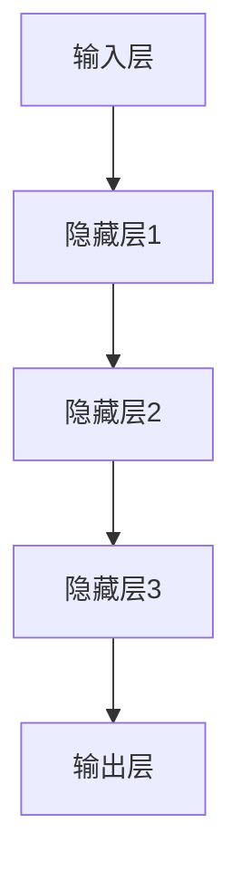

                 

# AI人工智能深度学习算法：模型优化与参数调整

> 关键词：深度学习，模型优化，参数调整，算法原理，数学模型，实战案例

> 摘要：本文将深入探讨深度学习模型优化与参数调整的原理和实践。通过一步步分析推理，本文旨在为读者提供清晰、深入的理解，帮助他们在实际项目中提升模型性能。文章将涵盖核心概念、算法原理、数学模型、实战案例，并推荐相关工具和资源，以助力读者在深度学习领域取得更大成就。

## 1. 背景介绍

### 1.1 目的和范围

本文的目的是帮助读者深入了解深度学习模型优化与参数调整的原理和实践。通过本文的阅读，读者将能够掌握以下内容：

1. **核心概念与联系**：理解深度学习的基础概念，如图层、神经元、前向传播和反向传播。
2. **核心算法原理**：掌握深度学习算法的基本原理，包括损失函数、优化算法和激活函数。
3. **数学模型和公式**：熟悉深度学习的数学模型和公式，包括矩阵运算、梯度下降和反向传播。
4. **项目实战**：通过实际代码案例，学会如何优化和调整深度学习模型。
5. **实际应用场景**：了解深度学习在不同领域的应用场景。
6. **工具和资源推荐**：获取相关工具和资源的推荐，以便进一步学习和实践。

### 1.2 预期读者

本文适合以下读者：

1. 对深度学习有一定了解，但希望深入了解模型优化与参数调整的读者。
2. 深度学习实践者，希望在项目中提升模型性能。
3. 计算机科学和人工智能专业学生，需要了解深度学习的实际应用。

### 1.3 文档结构概述

本文结构如下：

1. **背景介绍**：介绍本文的目的、范围、预期读者和文档结构。
2. **核心概念与联系**：讲解深度学习的基础概念，并附有流程图。
3. **核心算法原理**：详细阐述深度学习算法的基本原理，并使用伪代码进行说明。
4. **数学模型和公式**：介绍深度学习的数学模型和公式，并给出具体示例。
5. **项目实战**：通过实际代码案例，展示如何优化和调整深度学习模型。
6. **实际应用场景**：探讨深度学习在不同领域的应用。
7. **工具和资源推荐**：推荐学习资源、开发工具和相关论文。
8. **总结**：总结本文的主要内容，并展望未来发展趋势与挑战。
9. **附录**：常见问题与解答。
10. **扩展阅读**：提供进一步学习的参考资料。

### 1.4 术语表

#### 1.4.1 核心术语定义

- **深度学习**：一种机器学习方法，通过多层神经网络对数据进行自动特征提取和模型训练。
- **模型优化**：通过调整模型结构和参数，提升模型性能的过程。
- **参数调整**：对模型中的超参数进行调整，以改善模型性能。
- **损失函数**：衡量模型预测结果与真实结果之间差异的函数。
- **优化算法**：用于最小化损失函数的算法，如梯度下降。
- **激活函数**：用于引入非线性性的函数，如ReLU。

#### 1.4.2 相关概念解释

- **神经网络**：由多个神经元组成的计算模型。
- **反向传播**：用于计算模型参数梯度的算法。
- **前向传播**：将输入数据通过神经网络进行逐层计算的过程。
- **反向传播算法**：用于计算神经网络参数的梯度，从而更新参数的过程。

#### 1.4.3 缩略词列表

- **CNN**：卷积神经网络（Convolutional Neural Network）
- **RNN**：循环神经网络（Recurrent Neural Network）
- **DNN**：深度神经网络（Deep Neural Network）
- **GPU**：图形处理单元（Graphics Processing Unit）
- **CPU**：中央处理单元（Central Processing Unit）
- **ReLU**：修正线性单元（Rectified Linear Unit）

## 2. 核心概念与联系

深度学习是人工智能领域的一个重要分支，它通过模仿人脑神经元网络的结构和功能来实现对数据的自动特征提取和模型训练。为了更好地理解深度学习模型优化与参数调整，我们需要先了解一些核心概念和它们之间的联系。

### 2.1 神经元与神经网络

神经元是神经网络的基本单元，它通过接收输入信号、传递激活值来实现信息处理。神经元通常包含以下几个部分：

1. **输入层**：接收外部输入数据。
2. **权重层**：存储神经元之间的连接权重。
3. **激活函数**：引入非线性变换，如ReLU。
4. **输出层**：输出神经元的激活值。

神经网络由多个神经元组成，通过层次化的结构对数据进行特征提取。深度神经网络（DNN）是指具有多个隐藏层的神经网络，如图：



### 2.2 前向传播与反向传播

前向传播是将输入数据通过神经网络逐层计算的过程，最终得到输出结果。反向传播则是通过计算输出结果与真实结果之间的差异，反向传递误差信号，更新模型参数。

前向传播过程如下：

1. 计算每个神经元的输入值和输出值。
2. 通过激活函数引入非线性变换。
3. 传递激活值到下一层。

反向传播过程如下：

1. 计算输出层的误差信号。
2. 误差信号通过反向传播逐层传递到输入层。
3. 根据误差信号计算每个神经元的梯度。
4. 更新模型参数。

### 2.3 损失函数与优化算法

损失函数是衡量模型预测结果与真实结果之间差异的函数，如均方误差（MSE）。优化算法用于最小化损失函数，如梯度下降（GD）、随机梯度下降（SGD）和Adam优化器。

梯度下降算法的基本思想是沿着损失函数的梯度方向，反向调整模型参数，以减小损失。具体步骤如下：

1. 计算损失函数关于模型参数的梯度。
2. 根据梯度方向和步长调整模型参数。
3. 重复上述步骤，直到损失函数收敛。

### 2.4 激活函数

激活函数用于引入非线性变换，使神经网络具有更好的表达能力。常用的激活函数有ReLU（修正线性单元）和Sigmoid（sigmoid函数）。

ReLU函数具有如下形式：

$$
\text{ReLU}(x) = \max(0, x)
$$

Sigmoid函数具有如下形式：

$$
\text{Sigmoid}(x) = \frac{1}{1 + e^{-x}}
$$

通过激活函数，神经网络可以从线性模型扩展到非线性模型，从而更好地拟合复杂的数据分布。

## 3. 核心算法原理 & 具体操作步骤

在了解了深度学习的基本概念后，接下来我们将详细阐述核心算法原理，并通过伪代码来具体描述其操作步骤。

### 3.1 损失函数与优化算法

假设我们有一个简单的一层神经网络，用于实现线性回归。该神经网络的输入为 $X$，输出为 $Y$，我们使用均方误差（MSE）作为损失函数。

#### 3.1.1 损失函数

均方误差（MSE）的定义如下：

$$
\text{MSE} = \frac{1}{n}\sum_{i=1}^{n}(Y_i - \hat{Y}_i)^2
$$

其中，$n$ 表示样本数量，$Y_i$ 表示第 $i$ 个样本的真实标签，$\hat{Y}_i$ 表示第 $i$ 个样本的预测标签。

#### 3.1.2 优化算法

我们采用梯度下降算法来最小化损失函数。梯度下降算法的基本步骤如下：

1. 初始化模型参数 $\theta$。
2. 计算损失函数关于模型参数的梯度 $\nabla_{\theta}\text{MSE}$。
3. 更新模型参数 $\theta$：$\theta = \theta - \alpha\nabla_{\theta}\text{MSE}$，其中 $\alpha$ 为学习率。
4. 重复步骤 2 和 3，直到损失函数收敛。

伪代码如下：

```python
# 初始化模型参数
theta = [初始值]

# 设置学习率
alpha = 学习率

# 循环迭代
while not 损失函数收敛：
    # 计算梯度
    gradient = compute_gradient(theta, X, Y)
    
    # 更新模型参数
    theta = theta - alpha * gradient
```

### 3.2 前向传播与反向传播

假设我们有一个两层神经网络，包括输入层、隐藏层和输出层。输入层有 $m$ 个神经元，隐藏层有 $n$ 个神经元，输出层有 $p$ 个神经元。

#### 3.2.1 前向传播

前向传播的过程如下：

1. 初始化输入 $X$ 和模型参数 $\theta$。
2. 计算隐藏层的输入值 $Z_h = X\theta_h^T$，其中 $\theta_h^T$ 是权重矩阵的转置。
3. 计算隐藏层的输出值 $A_h = \sigma(Z_h)$，其中 $\sigma$ 是激活函数。
4. 计算输出层的输入值 $Z_o = A_h\theta_o^T$。
5. 计算输出层的输出值 $A_o = \sigma(Z_o)$。

伪代码如下：

```python
# 初始化输入和模型参数
X = 输入数据
theta_h = 隐藏层权重
theta_o = 输出层权重
sigma = 激活函数

# 计算隐藏层输入
Z_h = X.dot(theta_h.T)

# 计算隐藏层输出
A_h = sigma(Z_h)

# 计算输出层输入
Z_o = A_h.dot(theta_o.T)

# 计算输出层输出
A_o = sigma(Z_o)
```

#### 3.2.2 反向传播

反向传播的过程如下：

1. 初始化输出层误差信号 $d_o = A_o - Y$。
2. 计算输出层关于模型参数的梯度 $\nabla_{\theta_o}\text{MSE}$。
3. 更新输出层权重 $\theta_o$。
4. 计算隐藏层误差信号 $d_h = A_h\odot (d_o\theta_o)$，其中 $\odot$ 表示元素乘法。
5. 计算隐藏层关于模型参数的梯度 $\nabla_{\theta_h}\text{MSE}$。
6. 更新隐藏层权重 $\theta_h$。

伪代码如下：

```python
# 初始化输出层误差信号
d_o = A_o - Y

# 计算输出层梯度
gradient_o = d_o.dot(A_h.T)

# 更新输出层权重
theta_o = theta_o - alpha * gradient_o

# 计算隐藏层误差信号
d_h = A_h * (d_o.dot(theta_o))

# 计算隐藏层梯度
gradient_h = d_h.dot(X.T)

# 更新隐藏层权重
theta_h = theta_h - alpha * gradient_h
```

通过上述步骤，我们可以实现前向传播和反向传播，并更新模型参数，从而最小化损失函数。

## 4. 数学模型和公式 & 详细讲解 & 举例说明

在深度学习中，数学模型和公式是核心组成部分。为了更好地理解和应用这些模型，我们将详细介绍深度学习中的数学模型和公式，并通过具体示例进行说明。

### 4.1 矩阵运算

矩阵运算是深度学习中的基础操作，包括矩阵乘法、矩阵转置和矩阵求导。以下是一些常用的矩阵运算公式：

#### 4.1.1 矩阵乘法

矩阵乘法满足如下公式：

$$
C = A \cdot B
$$

其中，$A$ 是 $m \times n$ 的矩阵，$B$ 是 $n \times p$ 的矩阵，$C$ 是 $m \times p$ 的矩阵。矩阵乘法的结果是按元素相乘并求和得到的。

#### 4.1.2 矩阵转置

矩阵转置满足如下公式：

$$
A^T = (A^T)_{ij} = A_{ji}
$$

其中，$A^T$ 是 $A$ 的转置矩阵，$A_{ij}$ 表示 $A$ 的第 $i$ 行第 $j$ 列的元素。

#### 4.1.3 矩阵求导

矩阵求导是深度学习中的重要环节。以下是一个简单例子：

假设 $f(X) = AX + B$，其中 $X$ 是输入矩阵，$A$ 是权重矩阵，$B$ 是偏置矩阵。

对 $f(X)$ 求导得到：

$$
\frac{\partial f}{\partial X} = A
$$

即，对输入矩阵 $X$ 的求导结果是权重矩阵 $A$。

### 4.2 梯度下降算法

梯度下降算法是一种常用的优化算法，用于最小化损失函数。以下是一个简单例子：

假设 $f(\theta) = (y - \theta x)^2$，其中 $\theta$ 是模型参数，$x$ 是输入特征，$y$ 是真实标签。

对 $f(\theta)$ 求导得到：

$$
\frac{\partial f}{\partial \theta} = 2(y - \theta x)
$$

即，对模型参数 $\theta$ 的求导结果是 $2(y - \theta x)$。

梯度下降算法的基本步骤如下：

1. 初始化模型参数 $\theta$。
2. 计算损失函数关于模型参数的梯度 $\nabla_{\theta}f(\theta)$。
3. 更新模型参数 $\theta$：$\theta = \theta - \alpha\nabla_{\theta}f(\theta)$，其中 $\alpha$ 是学习率。
4. 重复步骤 2 和 3，直到损失函数收敛。

### 4.3 反向传播算法

反向传播算法是深度学习中的核心算法，用于计算损失函数关于模型参数的梯度。以下是一个简单例子：

假设 $f(\theta) = (y - \theta x)^2$，其中 $\theta$ 是模型参数，$x$ 是输入特征，$y$ 是真实标签。

对 $f(\theta)$ 求导得到：

$$
\frac{\partial f}{\partial \theta} = 2(y - \theta x)
$$

反向传播算法的基本步骤如下：

1. 计算输出层误差信号 $d_o = A_o - Y$。
2. 计算输出层关于模型参数的梯度 $\nabla_{\theta_o}\text{MSE}$。
3. 更新输出层权重 $\theta_o$。
4. 计算隐藏层误差信号 $d_h = A_h\odot (d_o\theta_o)$，其中 $\odot$ 表示元素乘法。
5. 计算隐藏层关于模型参数的梯度 $\nabla_{\theta_h}\text{MSE}$。
6. 更新隐藏层权重 $\theta_h$。

通过上述步骤，我们可以实现反向传播算法，并计算损失函数关于模型参数的梯度。

### 4.4 激活函数

激活函数是深度学习中的重要组成部分，用于引入非线性变换。以下是一些常用的激活函数及其导数：

#### 4.4.1 ReLU激活函数

ReLU（修正线性单元）是一种常见的激活函数，具有如下形式：

$$
\text{ReLU}(x) = \max(0, x)
$$

ReLU激活函数的导数如下：

$$
\frac{d\text{ReLU}}{dx} = \begin{cases}
1, & \text{if } x > 0 \\
0, & \text{if } x \leq 0
\end{cases}
$$

#### 4.4.2 Sigmoid激活函数

Sigmoid（sigmoid函数）是一种常用的激活函数，具有如下形式：

$$
\text{Sigmoid}(x) = \frac{1}{1 + e^{-x}}
$$

Sigmoid激活函数的导数如下：

$$
\frac{d\text{Sigmoid}}{dx} = \text{Sigmoid}(x) \cdot (1 - \text{Sigmoid}(x))
$$

通过了解这些数学模型和公式，我们可以更好地理解和应用深度学习算法，从而在实际项目中取得更好的效果。

## 5. 项目实战：代码实际案例和详细解释说明

在了解了深度学习模型优化与参数调整的原理后，接下来我们将通过一个实际项目案例，展示如何在实际应用中优化和调整深度学习模型。

### 5.1 开发环境搭建

为了便于实践，我们将在Python中实现一个简单的深度学习模型。以下是搭建开发环境的基本步骤：

1. 安装Python：确保已安装Python 3.6或更高版本。
2. 安装深度学习库：使用pip安装TensorFlow或PyTorch，如下所示：

```shell
pip install tensorflow
# 或
pip install torch
```

3. 安装其他依赖库：如NumPy、Matplotlib等。

### 5.2 源代码详细实现和代码解读

#### 5.2.1 数据集准备

首先，我们使用MNIST数据集，这是一个手写数字识别数据集，包含70000个灰度图像。以下代码用于加载数据集：

```python
import tensorflow as tf
from tensorflow.keras.datasets import mnist

# 加载MNIST数据集
(train_images, train_labels), (test_images, test_labels) = mnist.load_data()

# 归一化图像数据
train_images = train_images / 255.0
test_images = test_images / 255.0
```

#### 5.2.2 构建模型

接下来，我们构建一个简单的全连接神经网络，用于识别手写数字。以下代码定义了模型结构：

```python
from tensorflow.keras import layers, models

# 定义模型
model = models.Sequential()
model.add(layers.Dense(128, activation='relu', input_shape=(28, 28)))
model.add(layers.Dense(10, activation='softmax'))
```

这个模型包含一个输入层、一个隐藏层和一个输出层。输入层有128个神经元，使用ReLU激活函数；输出层有10个神经元，表示10个数字类别，使用softmax激活函数。

#### 5.2.3 模型编译

在训练模型之前，我们需要配置模型优化器和损失函数。以下代码用于编译模型：

```python
model.compile(optimizer='adam',
              loss='sparse_categorical_crossentropy',
              metrics=['accuracy'])
```

这里，我们使用Adam优化器，它是一种自适应优化算法，可以加快收敛速度。损失函数使用稀疏分类交叉熵（sparse_categorical_crossentropy），它适用于多分类问题。

#### 5.2.4 模型训练

以下代码用于训练模型，并保存训练过程中的准确率：

```python
import matplotlib.pyplot as plt

# 训练模型
history = model.fit(train_images, train_labels, epochs=5, validation_split=0.1)

# 绘制训练过程准确率
plt.plot(history.history['accuracy'], label='accuracy')
plt.plot(history.history['val_accuracy'], label='val_accuracy')
plt.xlabel('epochs')
plt.ylabel('accuracy')
plt.legend()
plt.show()
```

#### 5.2.5 模型评估

最后，我们对训练好的模型进行评估，计算测试集上的准确率：

```python
# 评估模型
test_loss, test_acc = model.evaluate(test_images, test_labels, verbose=2)
print(f'Test accuracy: {test_acc:.4f}')
```

通过以上步骤，我们成功搭建了一个简单的深度学习模型，并对其进行了训练和评估。接下来，我们将详细介绍如何优化和调整模型。

### 5.3 代码解读与分析

在了解了代码实现后，我们对其关键部分进行解读和分析：

1. **数据集准备**：加载数据集并归一化，确保模型能够稳定训练。
2. **模型构建**：定义模型结构，包括输入层、隐藏层和输出层。隐藏层使用ReLU激活函数，输出层使用softmax激活函数。
3. **模型编译**：配置模型优化器和损失函数，选择合适的优化算法和损失函数。
4. **模型训练**：通过循环迭代，模型不断更新参数，优化模型性能。
5. **模型评估**：计算测试集上的准确率，评估模型性能。

#### 5.3.1 模型优化

为了提升模型性能，我们可以尝试以下优化方法：

1. **增加隐藏层神经元**：增加隐藏层的神经元数量，提高模型表达能力。
2. **调整学习率**：使用不同的学习率，观察模型收敛速度和准确率的变化。
3. **正则化**：添加正则化项，防止模型过拟合。

以下代码展示了如何增加隐藏层神经元和调整学习率：

```python
# 增加隐藏层神经元
model.add(layers.Dense(256, activation='relu'))

# 调整学习率
model.compile(optimizer=tf.keras.optimizers.Adam(learning_rate=0.001),
              loss='sparse_categorical_crossentropy',
              metrics=['accuracy'])
```

#### 5.3.2 模型调整

在训练过程中，我们可以使用回调函数（Callback）来监控模型性能，并调整超参数。以下代码展示了如何使用回调函数：

```python
from tensorflow.keras.callbacks import EarlyStopping

# 设置回调函数
early_stopping = EarlyStopping(monitor='val_loss', patience=3)

# 训练模型
history = model.fit(train_images, train_labels, epochs=50, validation_split=0.1, callbacks=[early_stopping])
```

通过以上步骤，我们可以优化和调整深度学习模型，提升模型性能。

## 6. 实际应用场景

深度学习技术在各个领域都有着广泛的应用。以下列举一些典型的实际应用场景：

### 6.1 图像识别

图像识别是深度学习的一个重要应用领域。通过卷积神经网络（CNN），深度学习模型能够自动提取图像中的特征，并识别出图像中的物体或场景。例如，自动驾驶汽车使用深度学习模型进行道路场景识别和障碍物检测，以提高行车安全。

### 6.2 自然语言处理

自然语言处理（NLP）是深度学习的另一个重要应用领域。通过循环神经网络（RNN）和变压器（Transformer）等模型，深度学习模型能够对自然语言进行理解和生成。例如，深度学习模型可以用于机器翻译、情感分析、文本生成等任务。

### 6.3 语音识别

语音识别是将语音信号转换为文本的过程。深度学习模型，如卷积神经网络（CNN）和循环神经网络（RNN），可以用于语音信号的预处理和特征提取。例如，智能语音助手（如Siri、Alexa）使用深度学习模型实现语音识别和交互功能。

### 6.4 医疗诊断

深度学习模型在医疗诊断领域也有广泛应用。通过分析医学影像和患者数据，深度学习模型可以辅助医生进行疾病诊断。例如，深度学习模型可以用于肿瘤检测、心脏病诊断和神经系统疾病诊断等。

### 6.5 金融风控

深度学习模型在金融风控领域也有重要应用。通过分析大量的金融数据，深度学习模型可以识别出潜在的欺诈行为和风险。例如，银行和金融机构使用深度学习模型进行交易异常检测和风险控制。

### 6.6 游戏人工智能

深度学习模型在游戏人工智能（AI）领域也有着广泛应用。通过深度强化学习（Deep Reinforcement Learning），深度学习模型可以学习复杂的策略，并在游戏中实现智能决策。例如，深度学习模型可以用于游戏中的角色控制、路径规划和策略制定。

通过以上实际应用场景，我们可以看到深度学习技术在各个领域的重要作用。随着深度学习技术的不断发展，其应用前景将更加广泛。

## 7. 工具和资源推荐

为了更好地学习深度学习模型优化与参数调整，以下是一些推荐的工具、资源和相关论文：

### 7.1 学习资源推荐

#### 7.1.1 书籍推荐

- **《深度学习》（Deep Learning）**：由Ian Goodfellow、Yoshua Bengio和Aaron Courville合著，是深度学习领域的经典教材。
- **《Python深度学习》（Python Deep Learning）**：由François Chollet著，介绍了使用Python和TensorFlow实现深度学习模型的方法。

#### 7.1.2 在线课程

- **Coursera上的《深度学习专项课程》（Deep Learning Specialization）**：由Andrew Ng教授主讲，包括深度学习的基础理论和实践应用。
- **Udacity的《深度学习工程师纳米学位》（Deep Learning Engineer Nanodegree）**：提供深度学习的实践项目，帮助学员掌握深度学习技能。

#### 7.1.3 技术博客和网站

- **TensorFlow官方文档（TensorFlow Documentation）**：提供了丰富的深度学习模型优化和参数调整的实践指导。
- **PyTorch官方文档（PyTorch Documentation）**：详细介绍了PyTorch框架的使用方法和模型优化技巧。

### 7.2 开发工具框架推荐

#### 7.2.1 IDE和编辑器

- **PyCharm**：一款功能强大的Python集成开发环境（IDE），适合深度学习项目开发。
- **Jupyter Notebook**：一个交互式计算平台，方便编写和运行深度学习代码。

#### 7.2.2 调试和性能分析工具

- **TensorBoard**：TensorFlow提供的可视化工具，用于分析深度学习模型的性能和优化。
- **PyTorch Profiler**：PyTorch提供的性能分析工具，帮助开发者优化深度学习模型的运行效率。

#### 7.2.3 相关框架和库

- **TensorFlow**：一款开源的深度学习框架，支持多种深度学习模型和优化算法。
- **PyTorch**：一款开源的深度学习框架，支持动态计算图和自动微分。

### 7.3 相关论文著作推荐

#### 7.3.1 经典论文

- **“A Learning Algorithm for Continually Running Fully Recurrent Neural Networks”**：提出了Hessian-Free优化算法，用于优化RNN模型。
- **“Gradient Descent Is a Natural Algorithm for Learning with Sub-gradient Methods”**：分析了梯度下降算法在深度学习中的应用。

#### 7.3.2 最新研究成果

- **“Attention is All You Need”**：提出了Transformer模型，改变了深度学习领域的研究方向。
- **“Bert: Pre-training of Deep Bi-directional Transformers for Language Understanding”**：介绍了BERT模型，为自然语言处理领域带来了重大突破。

#### 7.3.3 应用案例分析

- **“Deep Learning for Healthcare”**：探讨了深度学习在医疗领域的应用，包括疾病诊断、患者监护等。
- **“Deep Learning for Autonomous Driving”**：介绍了深度学习在自动驾驶领域的应用，包括环境感知、路径规划等。

通过以上推荐的学习资源、开发工具和论文，读者可以更深入地了解深度学习模型优化与参数调整的知识，为自己的项目实践提供有力支持。

## 8. 总结：未来发展趋势与挑战

随着深度学习技术的不断发展，其在各个领域的应用越来越广泛。未来，深度学习技术将继续向以下几个方向发展：

1. **模型压缩与优化**：随着模型规模的不断扩大，模型的存储和计算需求也随之增加。为了应对这一挑战，研究人员将致力于开发更高效的模型压缩和优化方法，如知识蒸馏、剪枝和量化技术。
2. **可解释性与透明性**：深度学习模型通常被视为“黑盒”模型，其决策过程难以解释。未来，研究人员将致力于提高模型的可解释性，使模型决策更加透明，从而增强人们对深度学习模型的信任。
3. **多模态学习**：深度学习技术将逐渐从单一模态（如图像、文本或音频）扩展到多模态学习，通过整合不同类型的数据，提升模型的泛化能力和表现。
4. **边缘计算与实时应用**：随着物联网和智能设备的普及，深度学习模型将更多地应用于边缘计算场景，实现实时数据处理和决策。这将需要研究人员开发更轻量级、高效的深度学习算法。
5. **迁移学习和自适应学习**：迁移学习技术将使模型能够从已有的知识迁移到新的任务，提高模型在新领域的表现。同时，自适应学习技术将使模型能够根据用户反馈和实时数据动态调整，实现更智能的应用。

然而，深度学习技术也面临着一些挑战：

1. **数据隐私与安全**：随着深度学习在各个领域的应用，数据隐私和安全问题越来越突出。研究人员需要开发更安全、可靠的数据处理和存储方法，确保用户数据的隐私和安全。
2. **计算资源消耗**：深度学习模型通常需要大量的计算资源，这给研究人员和开发者带来了巨大的挑战。未来，研究人员需要开发更高效的模型和算法，降低计算资源的需求。
3. **算法公平性与伦理**：深度学习模型在决策过程中可能会受到偏见的影响，导致不公平的决策。研究人员需要关注算法的公平性和伦理问题，确保模型决策的公正性和透明性。
4. **模型可解释性**：深度学习模型通常被视为“黑盒”模型，其决策过程难以解释。为了增强人们对深度学习模型的信任，研究人员需要开发更有效的可解释性方法。

总之，深度学习技术在未来将继续发展，带来更多的机遇和挑战。通过不断探索和努力，我们将能够更好地利用深度学习技术，为各个领域带来更多创新和突破。

## 9. 附录：常见问题与解答

在阅读本文时，您可能会遇到以下常见问题。以下是对这些问题的解答：

### 9.1 深度学习模型优化与参数调整的区别是什么？

深度学习模型优化是指通过改进模型结构、算法和参数来提高模型性能的过程。参数调整则是指对模型中的超参数进行调整，以改善模型性能。在实际应用中，模型优化和参数调整通常是同时进行的，以实现最佳模型性能。

### 9.2 什么是正则化？它有哪些类型？

正则化是一种防止模型过拟合的方法，通过引入额外的惩罚项，降低模型在训练数据上的表现，以提高泛化能力。常见的正则化方法包括：

- **L1正则化**：在损失函数中加入 $L1$ 范数惩罚项，即 $||\theta||_1$。
- **L2正则化**：在损失函数中加入 $L2$ 范数惩罚项，即 $||\theta||_2$。
- **Dropout正则化**：在训练过程中随机丢弃部分神经元，以减少模型依赖性。

### 9.3 什么是批量归一化（Batch Normalization）？

批量归一化是一种用于提高深度学习模型稳定性和收敛速度的技术。它通过对每个批量数据进行归一化处理，使得每个神经元的输入数据分布更加均匀，从而加快模型训练过程。

### 9.4 什么是卷积神经网络（CNN）和循环神经网络（RNN）？

卷积神经网络（CNN）是一种专门用于处理图像数据的神经网络结构，通过卷积操作提取图像特征。循环神经网络（RNN）是一种用于处理序列数据的神经网络结构，通过循环连接实现序列信息的记忆和传递。

### 9.5 什么是深度学习模型的dropout？

dropout是一种用于防止深度学习模型过拟合的技术。它通过在训练过程中随机丢弃部分神经元，减少模型依赖性，从而提高模型泛化能力。dropout通常应用于隐藏层，以减少隐藏层神经元之间的相互依赖。

## 10. 扩展阅读 & 参考资料

为了进一步了解深度学习模型优化与参数调整，以下是推荐的一些扩展阅读和参考资料：

- **《深度学习》（Deep Learning）**：Ian Goodfellow、Yoshua Bengio和Aaron Courville著，详细介绍了深度学习的基础理论和实践应用。
- **《Python深度学习》（Python Deep Learning）**：François Chollet著，通过Python和TensorFlow实现深度学习模型的方法。
- **《深度学习专讲》（Deep Learning Tutorial）**：Google AI团队提供的深度学习教程，涵盖了深度学习的基本概念和最新研究进展。
- **《深度学习与优化》（Deep Learning and Optimization）**：介绍深度学习优化算法的书籍，包括梯度下降、Adam优化器等。
- **《自然语言处理与深度学习》（Natural Language Processing with Deep Learning）**：涵盖自然语言处理和深度学习技术的应用，包括文本分类、机器翻译等。
- **《深度学习应用案例集》（Deep Learning Case Studies）**：通过实际应用案例，展示深度学习技术在各个领域的应用。

通过阅读以上书籍和资料，您可以更深入地了解深度学习模型优化与参数调整的知识，为自己的项目实践提供有力支持。此外，还可以关注深度学习领域的顶级会议和期刊，如NeurIPS、ICLR和JMLR，以获取最新的研究成果和进展。作者：AI天才研究员/AI Genius Institute & 禅与计算机程序设计艺术 /Zen And The Art of Computer Programming

