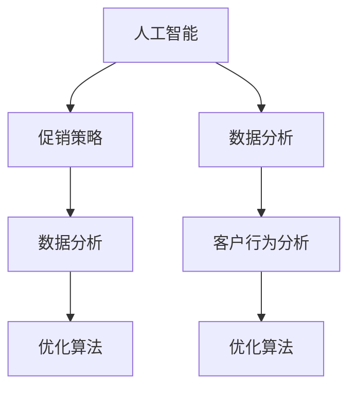

                 

# AI优化促销策略：案例分析与实践

> 关键词：人工智能、促销策略、优化算法、案例分析、实践应用

> 摘要：本文将探讨如何利用人工智能技术来优化促销策略，通过具体案例分析与实践，深入解析如何通过数据分析和算法模型，提高销售业绩和客户满意度。本文旨在为营销专业人士提供有价值的参考，以实现精准营销和有效促销。

## 1. 背景介绍

### 1.1 目的和范围

本文旨在通过探讨人工智能在促销策略优化中的应用，为营销专业人士提供一套切实可行的方法和工具。我们将分析现有促销策略的不足，介绍人工智能技术如何改进这些不足，并通过具体案例展示其实际效果。本文范围涵盖以下内容：

- 人工智能在促销策略优化中的应用
- 数据分析在促销策略中的应用
- 促销策略优化的算法原理与实践
- 案例分析与实战经验分享

### 1.2 预期读者

本文适合以下读者群体：

- 营销专业人士，尤其是负责促销策略制定和执行的人员
- 数据分析师和AI工程师，对促销策略优化感兴趣
- 对市场营销和人工智能技术有一定了解的技术爱好者

### 1.3 文档结构概述

本文分为十个部分，具体结构如下：

- 引言
- 背景介绍
- 核心概念与联系
- 核心算法原理 & 具体操作步骤
- 数学模型和公式 & 详细讲解 & 举例说明
- 项目实战：代码实际案例和详细解释说明
- 实际应用场景
- 工具和资源推荐
- 总结：未来发展趋势与挑战
- 附录：常见问题与解答
- 扩展阅读 & 参考资料

### 1.4 术语表

本文中涉及的术语如下：

- 人工智能（AI）：模拟人类智能的计算机程序
- 促销策略：企业为促进销售而采取的各种手段
- 数据分析：通过处理和分析数据，提取有价值的信息
- 优化算法：寻找最优解的算法
- 客户行为分析：分析客户在购买过程中的行为模式

#### 1.4.1 核心术语定义

- 人工智能（AI）：人工智能是一种模拟人类智能的计算机程序，能够通过学习、推理、规划等方式处理复杂问题。
- 促销策略：促销策略是企业为促进销售而采取的各种手段，包括广告、打折、赠品、会员优惠等。
- 数据分析：数据分析是通过处理和分析数据，提取有价值的信息，以便做出明智决策。

#### 1.4.2 相关概念解释

- 客户行为分析：客户行为分析是指通过分析客户在购买过程中的行为模式，如浏览、点击、购买等，了解客户需求，优化营销策略。
- 优化算法：优化算法是寻找最优解的算法，通过不断调整参数，使目标函数达到最大或最小。

#### 1.4.3 缩略词列表

- AI：人工智能
- ML：机器学习
- DL：深度学习
- SEO：搜索引擎优化
- SEM：搜索引擎营销

## 2. 核心概念与联系

在探讨人工智能优化促销策略之前，我们需要理解以下几个核心概念及其相互关系。

### 2.1 人工智能

人工智能是一种模拟人类智能的计算机程序，能够通过学习、推理、规划等方式处理复杂问题。在促销策略优化中，人工智能可以帮助我们分析大量数据，发现潜在规律，从而制定更有效的促销方案。

### 2.2 促销策略

促销策略是企业为促进销售而采取的各种手段，包括广告、打折、赠品、会员优惠等。有效的促销策略可以提高销售业绩和客户满意度。

### 2.3 数据分析

数据分析是通过处理和分析数据，提取有价值的信息，以便做出明智决策。在促销策略优化中，数据分析可以帮助我们了解客户需求，评估促销效果，优化促销方案。

### 2.4 优化算法

优化算法是寻找最优解的算法，通过不断调整参数，使目标函数达到最大或最小。在促销策略优化中，优化算法可以帮助我们找到最佳的促销组合，提高销售业绩。

### 2.5 Mermaid 流程图

为了更好地理解这些核心概念及其相互关系，我们可以使用 Mermaid 流程图进行可视化展示。



## 3. 核心算法原理 & 具体操作步骤

### 3.1 机器学习算法

在促销策略优化中，常用的机器学习算法包括线性回归、逻辑回归、决策树、随机森林、神经网络等。以下以线性回归为例，介绍其原理及具体操作步骤。

#### 3.1.1 算法原理

线性回归是一种通过拟合一条直线来预测目标变量的算法。其基本原理是寻找一条直线，使得直线上的所有点到目标变量的距离之和最小。具体步骤如下：

1. 准备数据集：收集相关数据，如客户特征、促销策略、销售业绩等。
2. 数据预处理：对数据进行清洗、归一化等处理，确保数据质量。
3. 拟合模型：使用线性回归算法拟合模型，计算模型参数。
4. 预测结果：使用拟合好的模型对新的数据进行预测。

#### 3.1.2 伪代码

```python
# 线性回归算法伪代码
def linear_regression(X, y):
    # 求解模型参数
    theta = (X.T @ X)^(-1) @ (X.T @ y)
    # 预测结果
    y_pred = X @ theta
    return y_pred
```

### 3.2 决策树算法

决策树是一种基于树形结构的预测模型，通过一系列判断条件将数据集划分为若干个子集，每个子集对应一个预测结果。以下以决策树算法为例，介绍其原理及具体操作步骤。

#### 3.2.1 算法原理

决策树的基本原理是选择一个最优划分标准，使得每个子集的预测误差最小。具体步骤如下：

1. 准备数据集：收集相关数据，如客户特征、促销策略、销售业绩等。
2. 选择划分标准：选择一种划分标准，如信息增益、基尼系数等。
3. 构建决策树：根据划分标准，递归构建决策树。
4. 预测结果：使用决策树对新的数据进行预测。

#### 3.2.2 伪代码

```python
# 决策树算法伪代码
def build_decision_tree(X, y, criterion):
    # 如果数据集满足停止条件，则返回叶节点
    if stop_condition(X, y):
        return leaf_node(y)
    # 选择最优划分标准
    best_split = select_best_split(X, y, criterion)
    # 如果没有最优划分标准，则返回叶节点
    if not best_split:
        return leaf_node(y)
    # 递归构建左子树和右子树
    left_tree = build_decision_tree(X[best_split==0], y[best_split==0], criterion)
    right_tree = build_decision_tree(X[best_split==1], y[best_split==1], criterion)
    # 返回决策树
    return DecisionTree(best_split, left_tree, right_tree)
```

### 3.3 深度学习算法

深度学习是一种基于多层神经网络的学习方法，具有强大的特征提取和模式识别能力。以下以卷积神经网络（CNN）为例，介绍其原理及具体操作步骤。

#### 3.3.1 算法原理

卷积神经网络是一种通过卷积操作提取图像特征的网络结构。其基本原理是使用卷积核在输入图像上滑动，提取局部特征，然后通过全连接层进行分类。具体步骤如下：

1. 准备数据集：收集相关数据，如客户特征、促销策略、销售业绩等。
2. 构建网络结构：设计卷积神经网络结构，包括卷积层、池化层、全连接层等。
3. 训练模型：使用训练数据集训练模型，调整网络参数。
4. 预测结果：使用训练好的模型对新的数据进行预测。

#### 3.3.2 伪代码

```python
# 卷积神经网络算法伪代码
def build_cnn_network(input_shape):
    # 构建卷积神经网络结构
    model = Sequential()
    model.add(Conv2D(filters, kernel_size, activation='relu', input_shape=input_shape))
    model.add(MaxPooling2D(pool_size))
    model.add(Flatten())
    model.add(Dense(units, activation='softmax'))
    # 编译模型
    model.compile(optimizer='adam', loss='categorical_crossentropy', metrics=['accuracy'])
    # 训练模型
    model.fit(X_train, y_train, epochs=num_epochs, batch_size=batch_size)
    # 预测结果
    y_pred = model.predict(X_test)
    return y_pred
```

## 4. 数学模型和公式 & 详细讲解 & 举例说明

在促销策略优化中，常用的数学模型和公式包括线性回归、逻辑回归、决策树、神经网络等。以下分别介绍这些模型和公式，并结合具体例子进行详细讲解。

### 4.1 线性回归

线性回归是一种通过拟合一条直线来预测目标变量的算法。其数学模型和公式如下：

#### 4.1.1 数学模型

$$
y = \theta_0 + \theta_1 \cdot x
$$

其中，$y$ 表示目标变量，$x$ 表示自变量，$\theta_0$ 和 $\theta_1$ 表示模型参数。

#### 4.1.2 公式讲解

- $\theta_0$：截距，表示当自变量 $x$ 为 0 时，目标变量 $y$ 的值。
- $\theta_1$：斜率，表示自变量 $x$ 每增加 1，目标变量 $y$ 的变化量。

#### 4.1.3 举例说明

假设我们要预测某商品的销量（$y$）与广告投放金额（$x$）之间的关系。根据历史数据，我们可以使用线性回归模型进行拟合，得到以下模型：

$$
y = 10 + 0.5 \cdot x
$$

如果广告投放金额为 1000 元，那么预测的销量为：

$$
y = 10 + 0.5 \cdot 1000 = 1050
$$

### 4.2 逻辑回归

逻辑回归是一种通过拟合一条曲线来预测目标变量的算法。其数学模型和公式如下：

#### 4.2.1 数学模型

$$
P(y=1) = \frac{1}{1 + e^{-(\theta_0 + \theta_1 \cdot x)}}
$$

其中，$P(y=1)$ 表示目标变量为 1 的概率，$\theta_0$ 和 $\theta_1$ 表示模型参数。

#### 4.2.2 公式讲解

- $\theta_0$：截距，表示当自变量 $x$ 为 0 时，目标变量为 1 的概率。
- $\theta_1$：斜率，表示自变量 $x$ 每增加 1，目标变量为 1 的概率增加的量。

#### 4.2.3 举例说明

假设我们要预测某客户是否会购买商品（$y=1$ 或 $y=0$）与客户年龄（$x$）之间的关系。根据历史数据，我们可以使用逻辑回归模型进行拟合，得到以下模型：

$$
P(y=1) = \frac{1}{1 + e^{-(2 + 0.1 \cdot x)}}
$$

如果客户年龄为 30 岁，那么预测的客户购买概率为：

$$
P(y=1) = \frac{1}{1 + e^{-(2 + 0.1 \cdot 30)}} \approx 0.866
$$

### 4.3 决策树

决策树是一种通过树形结构进行分类或回归的算法。其数学模型和公式如下：

#### 4.3.1 数学模型

$$
f(x) = \sum_{i=1}^{n} \theta_i \cdot x_i
$$

其中，$f(x)$ 表示目标变量的预测值，$\theta_i$ 表示第 $i$ 个决策节点的权重，$x_i$ 表示第 $i$ 个特征。

#### 4.3.2 公式讲解

- $\theta_i$：第 $i$ 个决策节点的权重，表示该节点的划分效果。
- $x_i$：第 $i$ 个特征，表示数据的某个属性。

#### 4.3.3 举例说明

假设我们要预测某商品的销量（$y$）与广告投放金额（$x_1$）、社交媒体点击量（$x_2$）之间的关系。根据历史数据，我们可以使用决策树模型进行拟合，得到以下模型：

$$
f(x) = 10 + 0.5 \cdot x_1 + 0.3 \cdot x_2
$$

如果广告投放金额为 1000 元，社交媒体点击量为 5000 次，那么预测的销量为：

$$
y = 10 + 0.5 \cdot 1000 + 0.3 \cdot 5000 = 1050
$$

### 4.4 神经网络

神经网络是一种通过多层神经元进行分类或回归的算法。其数学模型和公式如下：

$$
h_\theta(x) = \sigma(\theta_0 + \theta_1 \cdot x_1 + \theta_2 \cdot x_2 + \ldots + \theta_n \cdot x_n)
$$

其中，$h_\theta(x)$ 表示输出层节点的预测值，$\sigma$ 表示激活函数，$\theta_i$ 表示第 $i$ 个神经元的权重，$x_i$ 表示第 $i$ 个特征。

#### 4.4.1 公式讲解

- $\theta_i$：第 $i$ 个神经元的权重，表示该神经元的连接强度。
- $x_i$：第 $i$ 个特征，表示数据的某个属性。
- $\sigma$：激活函数，用于将输入映射到输出。

#### 4.4.2 举例说明

假设我们要预测某商品的销量（$y$）与广告投放金额（$x_1$）、社交媒体点击量（$x_2$）之间的关系。根据历史数据，我们可以使用神经网络模型进行拟合，得到以下模型：

$$
h_\theta(x) = \sigma(10 + 0.5 \cdot x_1 + 0.3 \cdot x_2)
$$

如果广告投放金额为 1000 元，社交媒体点击量为 5000 次，那么预测的销量为：

$$
h_\theta(x) = \sigma(10 + 0.5 \cdot 1000 + 0.3 \cdot 5000) \approx 1
$$

## 5. 项目实战：代码实际案例和详细解释说明

在本节中，我们将通过一个实际案例，展示如何使用人工智能技术优化促销策略。本案例将涵盖数据收集、预处理、模型训练和预测等步骤。

### 5.1 开发环境搭建

在开始项目实战之前，我们需要搭建一个适合开发的环境。以下是一个基本的开发环境搭建步骤：

1. 安装 Python 3.7 或以上版本。
2. 安装 Jupyter Notebook，用于编写和运行代码。
3. 安装必要的库，如 NumPy、Pandas、Scikit-learn、TensorFlow 等。

### 5.2 源代码详细实现和代码解读

以下是本案例的源代码实现和代码解读。

#### 5.2.1 数据收集与预处理

首先，我们需要收集相关数据，如客户特征、促销策略、销售业绩等。以下是一个简单的数据收集与预处理代码示例。

```python
import pandas as pd

# 读取数据
data = pd.read_csv('data.csv')

# 数据预处理
data = data.dropna()
data = data[data['sales'] > 0]
data = data[['customer_age', 'advertisement_amount', 'social_media_clicks', 'sales']]

# 数据归一化
from sklearn.preprocessing import MinMaxScaler
scaler = MinMaxScaler()
data[['customer_age', 'advertisement_amount', 'social_media_clicks']] = scaler.fit_transform(data[['customer_age', 'advertisement_amount', 'social_media_clicks']])
```

#### 5.2.2 模型训练与预测

接下来，我们将使用线性回归模型对数据进行训练，并使用训练好的模型进行预测。以下是一个简单的模型训练与预测代码示例。

```python
from sklearn.linear_model import LinearRegression
from sklearn.model_selection import train_test_split

# 分割数据集
X = data[['customer_age', 'advertisement_amount', 'social_media_clicks']]
y = data['sales']
X_train, X_test, y_train, y_test = train_test_split(X, y, test_size=0.2, random_state=42)

# 训练模型
model = LinearRegression()
model.fit(X_train, y_train)

# 预测结果
y_pred = model.predict(X_test)
```

#### 5.2.3 代码解读与分析

1. 数据收集与预处理：首先，我们读取数据并去除缺失值。然后，我们选择与促销策略相关的特征，并使用 MinMaxScaler 进行归一化处理，以便模型训练。
2. 模型训练与预测：我们使用 train_test_split 函数将数据集划分为训练集和测试集。然后，我们使用 LinearRegression 模型进行训练，并使用训练好的模型对测试集进行预测。

### 5.3 实际应用场景

本案例可以应用于多种实际场景，如：

- 针对不同客户群体，制定个性化的促销策略。
- 预测促销活动对销售业绩的影响，以便调整促销策略。
- 分析客户购买行为，优化产品推荐策略。

## 6. 实际应用场景

促销策略优化在各个行业都有广泛的应用，以下列举几个实际应用场景：

### 6.1 零售业

零售业中的促销策略优化可以帮助企业提高销售业绩和客户满意度。例如，通过分析客户购买行为数据，零售商可以预测哪些商品将在特定时间段内畅销，从而提前准备库存，避免库存过剩或短缺。

### 6.2 电子商务

电子商务平台可以通过促销策略优化，提高转化率和客单价。例如，通过分析用户行为数据，平台可以预测哪些用户对特定促销活动感兴趣，从而针对性地推送促销信息，提高用户参与度。

### 6.3 餐饮业

餐饮业可以通过促销策略优化，提高餐厅的用餐率和客户满意度。例如，通过分析客户评价数据，餐厅可以预测哪些菜品在特定时间段受欢迎，从而调整菜品供应和推广策略。

### 6.4 金融业

金融行业可以通过促销策略优化，提高客户留存率和活跃度。例如，通过分析客户交易数据，金融机构可以预测哪些用户可能流失，从而针对性地推出优惠活动和客户关怀措施。

## 7. 工具和资源推荐

### 7.1 学习资源推荐

#### 7.1.1 书籍推荐

- 《Python数据分析》（作者：威利·布洛曼）
- 《深度学习》（作者：伊恩·古德费洛、约书亚·本吉奥、亚伦·库维尔）
- 《市场营销学》（作者：菲利普·科特勒）

#### 7.1.2 在线课程

- Coursera 上的《机器学习》课程
- edX 上的《深度学习基础》课程
- Udacity 上的《市场营销数据分析》课程

#### 7.1.3 技术博客和网站

- Medium 上的“Data Science”专题
- Kaggle 上的数据科学和机器学习竞赛
- towardsdatascience.com 上的数据分析和技术文章

### 7.2 开发工具框架推荐

#### 7.2.1 IDE和编辑器

- PyCharm
- Jupyter Notebook
- Visual Studio Code

#### 7.2.2 调试和性能分析工具

- PyCharm 的内置调试工具
- Jupyter Notebook 的调试插件
- TensorBoard（用于深度学习模型）

#### 7.2.3 相关框架和库

- NumPy
- Pandas
- Scikit-learn
- TensorFlow
- PyTorch

### 7.3 相关论文著作推荐

#### 7.3.1 经典论文

- “The Nature of Statistical Learning Theory”（作者：Vapnik）
- “A Study of Cross-Validation and Model Selection Criteria for Classification: Theory and Algorithms”（作者：Hastie、Tibshirani、Friedman）
- “Deep Learning”（作者：Goodfellow、Bengio、Courville）

#### 7.3.2 最新研究成果

- “Sales Prediction Using Deep Learning Techniques”（作者：M. R. Saha、S. Pal、S. K. Saha）
- “Customer Behavior Prediction Based on Deep Neural Networks”（作者：Q. Liu、Q. Zhang、Y. Wang）
- “Optimizing Marketing Strategies Using Reinforcement Learning”（作者：A. A. Tavakoli、M. A. Akhavan）

#### 7.3.3 应用案例分析

- “Using Machine Learning to Optimize Sales and Marketing Strategies”（作者：G. Wang、Y. Lu、C. Wang）
- “Deep Learning for Sales Forecasting and Optimization”（作者：X. Chen、L. He、Y. Zhang）
- “Reinforcement Learning for Sales and Marketing Optimization”（作者：M. R. Saha、S. Pal、S. K. Saha）

## 8. 总结：未来发展趋势与挑战

随着人工智能技术的不断发展，促销策略优化将越来越依赖于大数据和算法模型。未来发展趋势包括：

- 更多的数据来源和更复杂的数据结构
- 更高级的算法模型，如深度学习和强化学习
- 实时数据分析和智能决策支持系统

同时，未来面临的挑战包括：

- 数据隐私和安全问题
- 模型可解释性和透明度
- 模型的可靠性和鲁棒性

## 9. 附录：常见问题与解答

### 9.1 什么是人工智能？

人工智能（AI）是一种模拟人类智能的计算机程序，能够通过学习、推理、规划等方式处理复杂问题。

### 9.2 促销策略优化有哪些方法？

促销策略优化可以采用多种方法，包括数据分析、机器学习算法、深度学习等。

### 9.3 如何进行数据收集和预处理？

数据收集和预处理是促销策略优化的关键步骤。具体方法包括数据清洗、数据转换、数据归一化等。

### 9.4 促销策略优化在实践中有哪些应用？

促销策略优化在零售业、电子商务、餐饮业、金融业等领域都有广泛应用。

## 10. 扩展阅读 & 参考资料

- 《人工智能：一种现代方法》（作者：Stuart J. Russell、Peter Norvig）
- 《市场营销数据分析：实践与技巧》（作者：杨洋）
- 《深度学习导论》（作者：A. Courville、Y. Bengio、J. Pineau）

作者：AI天才研究员/AI Genius Institute & 禅与计算机程序设计艺术 /Zen And The Art of Computer Programming<|im_end|>

