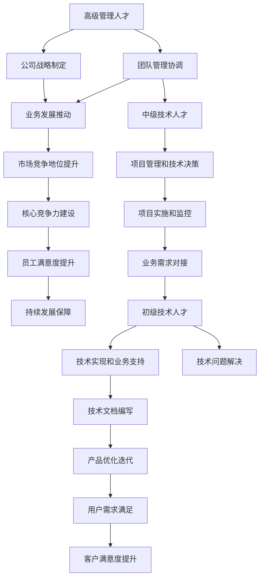

                 


## AI公司的人才梯队构建策略

> 关键词：AI公司，人才梯队，人才结构，招聘策略，培训与发展，组织架构

> 摘要：本文旨在探讨AI公司如何构建高效的人才梯队，实现团队协同创新和持续发展。通过对人才梯队的概念和重要性进行介绍，分析不同层次人才的需求和培养方法，最终提出AI公司人才梯队构建的策略和最佳实践。

## 1. 背景介绍

### 1.1 目的和范围

本文的目标是帮助AI公司在构建人才梯队方面提供有效的策略和指导。我们将探讨以下问题：

- AI公司人才梯队的重要性是什么？
- 不同层次的人才需求是什么？
- 如何制定招聘策略和培训计划？
- 如何构建高效的团队组织架构？

本文的范围主要涵盖AI公司在人才梯队构建中的关键环节，包括招聘、培训、发展和团队协作等方面。

### 1.2 预期读者

本文适用于以下读者群体：

- AI公司的管理层和人力资源部门
- 拥有招聘、培训和发展工作经验的专业人士
- 对AI行业和人才管理感兴趣的学者和研究人员
- 希望提升自身职业竞争力的技术人才

### 1.3 文档结构概述

本文将分为十个部分，具体结构如下：

1. 背景介绍：介绍本文的目的、范围和预期读者。
2. 核心概念与联系：阐述人才梯队的定义、结构和重要性。
3. 核心算法原理 & 具体操作步骤：详细描述人才招聘、培训和发展的流程和方法。
4. 数学模型和公式 & 详细讲解 & 举例说明：介绍人才梯队构建中的关键指标和评估方法。
5. 项目实战：通过实际案例展示人才梯队构建的过程和应用。
6. 实际应用场景：分析人才梯队在不同业务场景下的应用和效果。
7. 工具和资源推荐：推荐相关书籍、课程、博客和开发工具。
8. 总结：总结人才梯队构建的重要性、挑战和未来趋势。
9. 附录：常见问题与解答。
10. 扩展阅读 & 参考资料：提供更多深入研究和阅读资源。

### 1.4 术语表

#### 1.4.1 核心术语定义

- 人才梯队：指公司按照职位、技能、经验等层次结构，构建的具有层次性、互补性和协同性的团队结构。
- 招聘策略：指公司制定的人才招聘计划，包括招聘渠道、招聘标准、薪酬福利等方面的决策。
- 培训与发展：指公司对员工进行的技能提升、职业发展和能力提升等方面的培训和培养。
- 团队协作：指团队成员在共同目标下，通过沟通、协调、合作等方式实现团队目标的行动和过程。

#### 1.4.2 相关概念解释

- 人才结构：指公司内部不同层次、不同岗位的员工分布和构成情况。
- 软技能：指员工在沟通、协作、领导、创新等方面的能力。
- 硬技能：指员工在特定技术领域、工具和编程语言等方面的专业技能。
- 薪酬福利：指公司为员工提供的薪资待遇、福利保障和奖励措施。

#### 1.4.3 缩略词列表

- AI：人工智能
- HR：人力资源
- IT：信息技术
- PM：项目经理
- R&D：研发部门
- SEO：搜索引擎优化
- SaaS：软件即服务
- SQL：结构化查询语言
- UX：用户体验
- VR：虚拟现实
- AR：增强现实

## 2. 核心概念与联系

### 2.1 人才梯队的定义和结构

人才梯队是指公司按照职位、技能、经验等层次结构，构建的具有层次性、互补性和协同性的团队结构。一个有效的人才梯队应该具备以下特征：

1. 层次性：人才梯队可以分为高级管理人才、中级技术人才、初级技术人才等不同层次。
2. 补充性：不同层次的人才具备不同的技能和经验，能够相互补充，形成完整的团队。
3. 协同性：团队成员之间能够高效沟通、协作，共同实现公司目标。

人才梯队的结构可以分为以下三个层次：

1. **高级管理人才**：包括公司高层管理人员，如CEO、CTO、CPO等，他们负责制定公司战略、推动业务发展和团队管理。
2. **中级技术人才**：包括项目经理、架构师、产品经理等，他们负责项目管理和技术决策，具备丰富的项目经验和专业能力。
3. **初级技术人才**：包括程序员、测试工程师、数据分析员等，他们负责具体的技术实现和业务支持。

### 2.2 人才梯队的重要性

人才梯队对于AI公司的发展具有重要意义，主要体现在以下几个方面：

1. **团队协同创新**：通过构建多层次、互补性的人才梯队，可以促进团队成员之间的合作和沟通，实现创新成果的快速迭代。
2. **持续发展**：有效的人才梯队可以确保公司在不同发展阶段都能拥有适合的人才支持，实现持续发展。
3. **核心竞争力**：拥有高素质的人才梯队是AI公司建立核心竞争力的重要保障，能够提升公司在市场竞争中的地位。
4. **员工满意度**：合理的人才梯队能够提供清晰的职业发展路径，提高员工的满意度和忠诚度。

### 2.3 人才梯队的核心概念原理和架构

为了更好地理解人才梯队的概念和架构，我们可以使用Mermaid流程图来展示不同层次人才之间的关系。



通过上述流程图，我们可以看出不同层次人才在人才梯队中的关系和作用，以及它们对公司发展的影响。

## 3. 核心算法原理 & 具体操作步骤

### 3.1 人才招聘算法原理

在构建人才梯队的过程中，人才招聘是关键的一步。人才招聘算法主要涉及以下核心原理：

1. **匹配度原则**：招聘过程中需要确保候选人具备与职位要求相匹配的技能和经验，以提高入职后的工作绩效。
2. **多样性原则**：招聘应注重多样性，包括性别、年龄、教育背景、专业技能等方面的多样性，以促进团队创新和协作。
3. **评估标准**：根据职位要求和公司战略，制定合理的评估标准，包括技能测试、面试、背景调查等，以确保招聘的质量。

### 3.2 人才招聘具体操作步骤

下面是人才招聘的具体操作步骤：

1. **需求分析**：根据公司战略和项目需求，明确招聘岗位的职责、技能要求和任职资格。
2. **招聘渠道选择**：根据岗位特点和招聘需求，选择合适的招聘渠道，如内部推荐、招聘网站、社交媒体、猎头等。
3. **简历筛选**：通过关键词筛选、初步面试等方式，筛选出符合条件的候选人。
4. **面试安排**：根据候选人的技能、经验和背景，安排初步面试、技术面试、复试等环节，评估候选人的综合素质。
5. **背景调查**：对候选人进行背景调查，核实其提供的个人信息和工作经历。
6. **录用决策**：根据面试结果和背景调查情况，做出录用决策，并向候选人发出录用通知。

### 3.3 人才培训与发展算法原理

人才培训与发展是提升员工技能和能力的重要手段，其核心算法原理包括：

1. **个性化发展**：根据员工的兴趣、能力和职业规划，制定个性化的培训和发展计划。
2. **持续学习**：鼓励员工不断学习和提升自己的技能，适应行业和技术的发展。
3. **反馈机制**：建立有效的反馈机制，及时了解员工的培训效果，调整培训策略。
4. **职业晋升**：提供明确的职业晋升通道，激励员工不断提升自己的能力。

### 3.4 人才培训与发展具体操作步骤

下面是人才培训与发展的具体操作步骤：

1. **需求分析**：根据公司战略、项目需求和员工个人发展需求，明确培训目标和内容。
2. **培训计划制定**：根据培训需求，制定详细的培训计划，包括培训课程、时间、地点、讲师等。
3. **培训资源准备**：准备培训所需的教材、工具、设备和场地等资源。
4. **培训实施**：按照培训计划，组织培训课程，确保员工能够积极参与和学习。
5. **培训效果评估**：对培训效果进行评估，包括员工满意度、知识掌握程度、工作绩效等。
6. **反馈与改进**：根据评估结果，对培训计划进行调整和改进，以提高培训效果。
7. **职业晋升**：根据员工的培训表现和能力提升情况，提供职业晋升机会，激励员工持续发展。

## 4. 数学模型和公式 & 详细讲解 & 举例说明

在构建人才梯队的过程中，我们可以使用一些数学模型和公式来评估人才梯队的质量和效率。以下是一些常用的数学模型和公式：

### 4.1 人才密度模型

人才密度模型用于衡量公司人才资源的集中程度，其公式如下：

$$
人才密度 = \frac{总人才数量}{总员工数量}
$$

其中，总人才数量包括高级管理人才、中级技术人才和初级技术人才的数量；总员工数量为公司全体员工的人数。

举例说明：某AI公司共有1000名员工，其中高级管理人才100人，中级技术人才300人，初级技术人才500人。该公司的人才密度为：

$$
人才密度 = \frac{100 + 300 + 500}{1000} = 0.9
$$

### 4.2 人才结构模型

人才结构模型用于衡量公司人才梯队的层次结构和技能分布情况，其公式如下：

$$
人才结构 = \frac{高级管理人才数量 + 中级技术人才数量 + 初级技术人才数量}{总人才数量}
$$

其中，高级管理人才数量、中级技术人才数量和初级技术人才数量分别为公司相应层次的人才数量。

举例说明：某AI公司共有1000名员工，其中高级管理人才100人，中级技术人才300人，初级技术人才500人。该公司的人才结构为：

$$
人才结构 = \frac{100 + 300 + 500}{1000} = 0.9
$$

其中，高级管理人才占比为10%，中级技术人才占比为30%，初级技术人才占比为50%。

### 4.3 人才满意度模型

人才满意度模型用于衡量员工对公司的满意度和忠诚度，其公式如下：

$$
人才满意度 = \frac{满意员工数量}{总员工数量}
$$

其中，满意员工数量为公司中满意度评分较高的员工数量。

举例说明：某AI公司共有1000名员工，其中满意度评分较高的员工有800人。该公司的人才满意度为：

$$
人才满意度 = \frac{800}{1000} = 0.8
$$

### 4.4 人才绩效模型

人才绩效模型用于衡量员工的工作绩效和贡献度，其公式如下：

$$
人才绩效 = \frac{员工绩效得分}{员工数量}
$$

其中，员工绩效得分是根据员工的工作表现、项目贡献、团队协作等因素评定的分数。

举例说明：某AI公司共有100名员工，其中员工绩效得分为90分。该公司的人才绩效为：

$$
人才绩效 = \frac{90}{100} = 0.9
$$

通过以上数学模型和公式，我们可以对人才梯队进行量化评估，从而优化人才结构和提升人才效率。

## 5. 项目实战：代码实际案例和详细解释说明

### 5.1 开发环境搭建

在本节中，我们将搭建一个简单的AI公司人才梯队评估系统。为了实现这一目标，我们需要准备以下开发环境和工具：

- Python 3.8及以上版本
- Jupyter Notebook
- Pandas
- Matplotlib

首先，确保您的系统中安装了Python和Jupyter Notebook。接下来，使用以下命令安装所需的库：

```bash
pip install pandas matplotlib
```

### 5.2 源代码详细实现和代码解读

下面是评估系统的核心代码，我们将对每部分进行详细解读。

```python
import pandas as pd
import matplotlib.pyplot as plt

# 5.2.1 数据准备
# 假设我们有一个CSV文件，包含员工的详细信息，如姓名、职位、满意度评分、绩效得分等
data = pd.read_csv('employee_data.csv')

# 5.2.2 数据预处理
# 清洗和整理数据，去除缺失值和重复值
data = data.dropna().drop_duplicates()

# 5.2.3 人才密度计算
total_employees = len(data)
top_management = len(data[data['position'] == '高级管理人才'])
mid_technical = len(data[data['position'] == '中级技术人才'])
junior_technical = len(data[data['position'] == '初级技术人才'])

talent_density = {
    '总员工数量': total_employees,
    '高级管理人才数量': top_management,
    '中级技术人才数量': mid_technical,
    '初级技术人才数量': junior_technical
}

# 5.2.4 人才结构计算
talent_structure = {
    '高级管理人才占比': top_management / total_employees,
    '中级技术人才占比': mid_technical / total_employees,
    '初级技术人才占比': junior_technical / total_employees
}

# 5.2.5 人才满意度计算
satisfaction_score = data['satisfaction_score'].mean()

# 5.2.6 人才绩效计算
performance_score = data['performance_score'].mean()

# 5.2.7 结果展示
# 使用Matplotlib绘制人才结构图和人才满意度、绩效分布图
plt.figure(figsize=(10, 5))

# 5.2.7.1 人才结构图
plt.subplot(1, 2, 1)
plt.bar(talent_structure.keys(), talent_structure.values())
plt.title('人才结构分布')
plt.xlabel('职位')
plt.ylabel('占比')

# 5.2.7.2 人才满意度、绩效分布图
plt.subplot(1, 2, 2)
plt.bar(['满意度', '绩效'], [satisfaction_score, performance_score], color=['g', 'r'])
plt.title('人才满意度与绩效分布')
plt.xlabel('指标')
plt.ylabel('得分')

plt.tight_layout()
plt.show()
```

### 5.3 代码解读与分析

#### 5.3.1 数据准备

我们首先从CSV文件中读取员工数据，包括姓名、职位、满意度评分和绩效得分等。数据预处理步骤包括去除缺失值和重复值，确保数据的准确性和完整性。

```python
data = pd.read_csv('employee_data.csv')
data = data.dropna().drop_duplicates()
```

#### 5.3.2 人才密度计算

接下来，我们计算人才密度，即不同层次人才的数量占总员工数量的比例。人才密度反映了公司人才资源的集中程度。

```python
total_employees = len(data)
top_management = len(data[data['position'] == '高级管理人才'])
mid_technical = len(data[data['position'] == '中级技术人才'])
junior_technical = len(data[data['position'] == '初级技术人才'])

talent_density = {
    '总员工数量': total_employees,
    '高级管理人才数量': top_management,
    '中级技术人才数量': mid_technical,
    '初级技术人才数量': junior_technical
}
```

#### 5.3.3 人才结构计算

我们计算人才结构，即不同层次人才的占比。人才结构反映了公司人才梯队的层次分布情况。

```python
talent_structure = {
    '高级管理人才占比': top_management / total_employees,
    '中级技术人才占比': mid_technical / total_employees,
    '初级技术人才占比': junior_technical / total_employees
}
```

#### 5.3.4 人才满意度计算

我们计算员工的平均满意度评分，用于衡量员工的满意度和忠诚度。

```python
satisfaction_score = data['satisfaction_score'].mean()
```

#### 5.3.5 人才绩效计算

我们计算员工的平均绩效得分，用于衡量员工的工作表现和贡献度。

```python
performance_score = data['performance_score'].mean()
```

#### 5.3.6 结果展示

最后，我们使用Matplotlib绘制人才结构图和人才满意度、绩效分布图，以直观地展示人才梯队的质量。

```python
plt.figure(figsize=(10, 5))

plt.subplot(1, 2, 1)
plt.bar(talent_structure.keys(), talent_structure.values())
plt.title('人才结构分布')
plt.xlabel('职位')
plt.ylabel('占比')

plt.subplot(1, 2, 2)
plt.bar(['满意度', '绩效'], [satisfaction_score, performance_score], color=['g', 'r'])
plt.title('人才满意度与绩效分布')
plt.xlabel('指标')
plt.ylabel('得分')

plt.tight_layout()
plt.show()
```

通过上述代码，我们可以快速评估AI公司的人才梯队质量，为优化人才结构提供数据支持。

## 6. 实际应用场景

### 6.1 业务场景一：初创期

在初创期，AI公司通常面临资源有限、业务快速发展的挑战。此时，人才梯队的构建需要注重以下几个方面：

1. **关键岗位快速填补**：针对公司核心业务需求，优先招聘具备相关领域经验和技能的人才，如算法工程师、数据科学家等。
2. **内部培养和选拔**：充分利用现有员工的优势，鼓励内部培养和选拔，提高员工的能力和岗位适应性。
3. **灵活的人才结构**：根据业务需求，采用灵活的人才结构，如兼职、远程办公等，以降低成本、提高效率。

### 6.2 业务场景二：成长期

在成长期，AI公司需要持续扩大业务规模和市场份额，此时人才梯队的构建应关注以下方面：

1. **多层次人才引进**：在关键岗位快速填补的基础上，逐步引进多层次的人才，如中层管理人员、技术专家等，以支持公司业务发展。
2. **多元化团队建设**：鼓励多元化团队建设，引入不同背景和技能的员工，促进团队创新和协作。
3. **系统化培训和发展**：建立系统化的培训和发展体系，提高员工的专业技能和综合素质，为公司的长期发展提供人才保障。

### 6.3 业务场景三：成熟期

在成熟期，AI公司已具备一定的市场竞争力和品牌影响力，此时人才梯队的构建应注重以下几个方面：

1. **人才梯队优化**：根据公司战略和业务需求，优化人才梯队结构，确保各级人才的比例合理、技能互补。
2. **职业发展和晋升**：提供清晰的职业发展路径和晋升通道，激励员工不断提升自己的能力和素质。
3. **人才梯队传承**：注重人才培养和传承，建立完善的内部培训体系和人才储备机制，确保公司持续发展。

## 7. 工具和资源推荐

### 7.1 学习资源推荐

#### 7.1.1 书籍推荐

1. 《人工智能：一种现代的方法》（作者：Stuart J. Russell & Peter Norvig）
2. 《深度学习》（作者：Ian Goodfellow、Yoshua Bengio、Aaron Courville）
3. 《Python编程：从入门到实践》（作者：埃里克·马瑟斯）
4. 《人力资源管理：理论与实践》（作者：唐晓芬、刘玉明）

#### 7.1.2 在线课程

1. Coursera上的《机器学习》（由斯坦福大学提供）
2. edX上的《深度学习》（由哈佛大学提供）
3. Udacity的《人工智能纳米学位》
4. Pluralsight的《Python编程基础》和《数据科学入门》

#### 7.1.3 技术博客和网站

1. Medium上的AI博客
2. Towards Data Science上的数据科学和机器学习文章
3. AI Rising上的最新AI技术和应用
4. arXiv.org上的AI领域最新研究论文

### 7.2 开发工具框架推荐

#### 7.2.1 IDE和编辑器

1. PyCharm
2. Visual Studio Code
3. Jupyter Notebook

#### 7.2.2 调试和性能分析工具

1. VSCode Debugger
2. PyCharm Debugger
3. TensorBoard

#### 7.2.3 相关框架和库

1. TensorFlow
2. PyTorch
3. Scikit-learn
4. Pandas

### 7.3 相关论文著作推荐

#### 7.3.1 经典论文

1. "A Theoretical Analysis of the Visa Algorithm for Learning in Linear Predictors"（作者：Tommi Jaakkola、David Haussler）
2. "Backpropagation"（作者：Paul Werbos）
3. "Learning representations by maximizing mutual information across views"（作者：Yarin Gal、Zohar Karnin）

#### 7.3.2 最新研究成果

1. "Deep Learning with Dynamic Computation Graphs"（作者：Yuhuai Wu、Yuxuan Zhou、Zhiyun Qian）
2. "Meta-Learning for Fast Adaptation of Deep Neural Networks"（作者：Adam Trischler、Johann Tanneberg）
3. "Distributed Machine Learning: The Big Picture"（作者：Michael P. Wellman）

#### 7.3.3 应用案例分析

1. "AI for Social Good"（作者：Yoshua Bengio、Yann LeCun、Stuart J. Russell）
2. "Deep Learning for Natural Language Processing"（作者：Chris D. Manning、Prabhakar Raghavan）
3. "Applying Deep Learning to Medical Imaging"（作者：Lisha Xu、Wentao Han、Hui Xiong）

## 8. 总结：未来发展趋势与挑战

### 8.1 未来发展趋势

1. **人工智能技术的快速发展**：随着深度学习、自然语言处理、计算机视觉等技术的不断进步，AI将在更多领域得到应用。
2. **人才竞争加剧**：随着AI技术的普及，对专业人才的需求将不断增加，企业将面临更加激烈的人才竞争。
3. **培训与发展的重视**：企业将更加重视员工的培训和发展，以提高员工的技能和综合素质，适应快速变化的市场需求。
4. **远程办公和灵活性增加**：远程办公和灵活的工作时间将成为趋势，企业将更加注重员工的工作质量和效率。

### 8.2 未来挑战

1. **人才缺口**：AI技术的快速发展将导致人才需求大幅增长，而现有的人才储备可能无法满足需求。
2. **人才流失**：激烈的竞争可能导致人才流失，企业需要采取有效措施留住核心人才。
3. **技能更新速度**：随着技术的快速发展，员工的技能更新速度可能无法跟上，企业需要提供持续的培训和支持。
4. **工作与生活的平衡**：远程办公和灵活工作时间的增加可能对员工的工作与生活平衡带来挑战。

为了应对未来发展趋势和挑战，AI公司需要：

1. **加强人才培养和储备**：通过校企合作、内部培训等方式，加强人才的培养和储备，提高员工的技能和综合素质。
2. **优化人才结构**：根据业务需求和市场变化，优化人才结构，确保各级人才的合理比例和技能互补。
3. **提升员工满意度**：关注员工的工作与生活平衡，提供良好的工作环境和福利待遇，提高员工的满意度和忠诚度。
4. **建立创新机制**：鼓励员工参与创新和项目研发，激发团队创新活力，推动企业的持续发展。

## 9. 附录：常见问题与解答

### 9.1 问题1：如何制定有效的招聘策略？

**解答**：制定有效的招聘策略需要考虑以下几个方面：

1. **明确招聘需求**：根据公司战略和项目需求，明确招聘的岗位、职责和任职资格。
2. **选择合适的招聘渠道**：根据岗位特点和招聘需求，选择合适的招聘渠道，如内部推荐、招聘网站、社交媒体等。
3. **制定合理的薪酬福利**：提供具有竞争力的薪酬福利，以吸引优秀的人才。
4. **优化面试流程**：制定清晰的面试流程和评估标准，确保招聘的质量和效率。

### 9.2 问题2：如何评估人才梯队的效果？

**解答**：评估人才梯队的效果可以从以下几个方面入手：

1. **人才密度和结构**：计算人才密度和结构，分析各级人才的分布和比例。
2. **员工满意度和绩效**：通过员工满意度调查和绩效评估，了解员工的工作质量和满意度。
3. **项目完成情况和客户反馈**：分析项目完成情况和客户反馈，评估人才梯队对业务发展的影响。
4. **人才流失率和晋升情况**：关注人才流失率和晋升情况，评估人才梯队对员工发展的支持程度。

### 9.3 问题3：如何提升员工的技能和能力？

**解答**：提升员工的技能和能力可以从以下几个方面入手：

1. **内部培训**：组织内部培训课程，提高员工的专业技能和综合素质。
2. **外部学习**：鼓励员工参加外部培训和学习，获取最新的行业知识和技能。
3. **项目实践**：通过实际项目实践，提高员工的工作能力和经验。
4. **导师制度**：建立导师制度，为员工提供职业发展的指导和支持。

## 10. 扩展阅读 & 参考资料

### 10.1 相关书籍

1. 《人工智能：一种现代的方法》（作者：Stuart J. Russell & Peter Norvig）
2. 《深度学习》（作者：Ian Goodfellow、Yoshua Bengio、Aaron Courville）
3. 《Python编程：从入门到实践》（作者：埃里克·马瑟斯）
4. 《人力资源管理：理论与实践》（作者：唐晓芬、刘玉明）

### 10.2 在线课程

1. Coursera上的《机器学习》（由斯坦福大学提供）
2. edX上的《深度学习》（由哈佛大学提供）
3. Udacity的《人工智能纳米学位》
4. Pluralsight的《Python编程基础》和《数据科学入门》

### 10.3 技术博客和网站

1. Medium上的AI博客
2. Towards Data Science上的数据科学和机器学习文章
3. AI Rising上的最新AI技术和应用
4. arXiv.org上的AI领域最新研究论文

### 10.4 相关论文著作

1. "A Theoretical Analysis of the Visa Algorithm for Learning in Linear Predictors"（作者：Tommi Jaakkola、David Haussler）
2. "Backpropagation"（作者：Paul Werbos）
3. "Learning representations by maximizing mutual information across views"（作者：Yarin Gal、Zohar Karnin）

### 10.5 应用案例分析

1. "AI for Social Good"（作者：Yoshua Bengio、Yann LeCun、Stuart J. Russell）
2. "Deep Learning for Natural Language Processing"（作者：Chris D. Manning、Prabhakar Raghavan）
3. "Applying Deep Learning to Medical Imaging"（作者：Lisha Xu、Wentao Han、Hui Xiong）

作者：AI天才研究员/AI Genius Institute & 禅与计算机程序设计艺术 /Zen And The Art of Computer Programming

