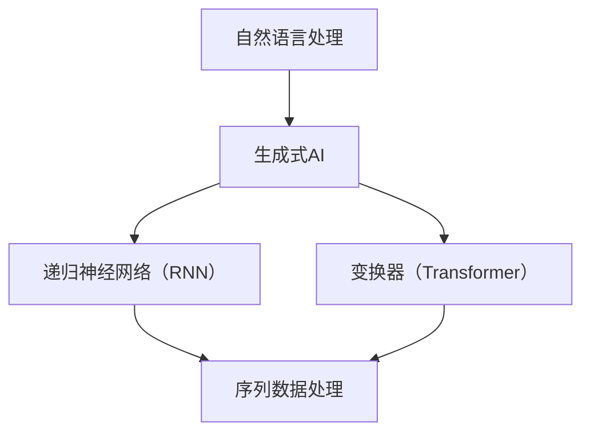

                 

# AI写作的局限：标准化答案 vs 个性化需求

> **关键词**：AI写作，个性化需求，标准化答案，限制，挑战，改进策略
>
> **摘要**：本文探讨了人工智能在写作领域的局限性，特别是当面对标准化答案和个性化需求之间的冲突时。我们将分析现有AI写作系统的不足，探讨其与人类写作本质的差异，并提出可能的改进策略，以实现更加个性化、高质量的写作。

## 1. 背景介绍

### 1.1 目的和范围

本文旨在深入探讨人工智能（AI）在写作领域的局限性，尤其是AI在处理标准化答案与个性化需求之间的挑战。我们将回顾现有的AI写作技术，分析其在满足个性化写作需求方面的不足，并提出可能的改进方向。

### 1.2 预期读者

本文面向对人工智能和写作领域有一定了解的技术人员、研究人员以及AI写作实践者。希望读者能够通过本文对AI写作的局限有更深入的理解，并激发对改进AI写作技术的兴趣。

### 1.3 文档结构概述

本文将分为以下几个部分：

1. **背景介绍**：阐述研究背景、目的和预期读者。
2. **核心概念与联系**：介绍AI写作相关的基本概念，并使用Mermaid流程图展示。
3. **核心算法原理 & 具体操作步骤**：详细解释AI写作的基本算法原理和操作步骤。
4. **数学模型和公式 & 详细讲解 & 举例说明**：介绍相关的数学模型和公式，并通过实例进行说明。
5. **项目实战：代码实际案例和详细解释说明**：展示一个实际的项目案例，详细解释代码实现。
6. **实际应用场景**：探讨AI写作在实际中的应用。
7. **工具和资源推荐**：推荐相关学习资源、开发工具和论文著作。
8. **总结：未来发展趋势与挑战**：总结本文讨论的局限和挑战，展望未来发展趋势。
9. **附录：常见问题与解答**：解答一些常见问题。
10. **扩展阅读 & 参考资料**：提供扩展阅读的资源和参考资料。

### 1.4 术语表

#### 1.4.1 核心术语定义

- **AI写作**：利用人工智能技术自动生成文本的过程。
- **标准化答案**：适用于广泛场景的通用性回答。
- **个性化需求**：针对特定用户或场景的特定需求。
- **自然语言处理（NLP）**：使计算机理解和生成人类语言的技术。

#### 1.4.2 相关概念解释

- **生成式AI**：一种AI技术，能够创建新的内容，如文本、图像等。
- **递归神经网络（RNN）**：一种用于处理序列数据的神经网络架构。
- **变换器（Transformer）**：一种用于自然语言处理的深度学习模型。

#### 1.4.3 缩略词列表

- **NLP**：自然语言处理（Natural Language Processing）
- **GAN**：生成对抗网络（Generative Adversarial Network）
- **BERT**：Bidirectional Encoder Representations from Transformers

## 2. 核心概念与联系

为了更好地理解AI写作的局限，我们需要先了解一些核心概念和它们之间的联系。以下是一个简化的Mermaid流程图，展示了这些概念：



### 2.1 自然语言处理（NLP）

自然语言处理是AI写作的核心，它使计算机能够理解和生成人类语言。NLP涉及到文本的解析、语义理解和生成。关键组件包括词向量表示、句法分析和语义分析。

### 2.2 生成式AI

生成式AI是一种能够创建新内容的AI技术，广泛应用于文本、图像和音频的生成。在AI写作中，生成式AI负责生成文章、段落和句子。

### 2.3 递归神经网络（RNN）

递归神经网络是一种用于处理序列数据的神经网络架构，它在自然语言处理中得到了广泛应用。RNN能够记住先前的输入，这对于理解文本的上下文至关重要。

### 2.4 变换器（Transformer）

变换器是一种先进的深度学习模型，特别适合处理自然语言处理任务。与RNN相比，变换器在处理长距离依赖关系方面表现出色，已经成为AI写作中的主流模型。

## 3. 核心算法原理 & 具体操作步骤

### 3.1 算法原理

AI写作的核心算法通常是基于变换器架构的。变换器模型由编码器和解码器两部分组成，编码器负责将输入文本编码为向量表示，解码器则根据这些向量生成新的文本。

### 3.2 具体操作步骤

以下是AI写作的基本步骤：

1. **预处理**：对输入文本进行清洗和预处理，包括分词、去停用词、词干提取等。
2. **编码**：使用编码器将预处理后的文本编码为向量表示。
3. **解码**：使用解码器根据编码器的输出向量生成新的文本。
4. **后处理**：对生成的文本进行后处理，如去除无效输出、格式化文本等。

### 3.3 伪代码

以下是AI写作算法的伪代码：

```python
def AI_writing(input_text):
    # 预处理
    preprocessed_text = preprocess_text(input_text)
    
    # 编码
    encoded_text = encoder(preprocessed_text)
    
    # 解码
    generated_text = decoder(encoded_text)
    
    # 后处理
    final_text = postprocess_text(generated_text)
    
    return final_text
```

## 4. 数学模型和公式 & 详细讲解 & 举例说明

### 4.1 数学模型

AI写作中的数学模型主要涉及变换器模型。变换器模型的核心是自注意力机制（Self-Attention），它能够自动计算输入序列中每个词的重要性，并生成加权向量。

### 4.2 公式

自注意力机制的公式如下：

$$
\text{Attention}(Q, K, V) = \text{softmax}\left(\frac{QK^T}{\sqrt{d_k}}\right)V
$$

其中，\(Q, K, V\) 分别是查询（Query）、关键（Key）和值（Value）向量，\(d_k\) 是关键向量的维度。

### 4.3 举例说明

假设我们有三个词：`AI`, `写作`, `模型`，它们的向量表示分别为 \(Q = [1, 0, 1]\), \(K = [1, 1, 0]\), \(V = [0, 1, 0]\)。根据自注意力机制，我们可以计算每个词的重要性：

$$
\text{Attention}(Q, K, V) = \text{softmax}\left(\frac{QK^T}{\sqrt{d_k}}\right)V = \text{softmax}\left(\frac{1}{\sqrt{2}}\right)[0, 1, 0]
$$

计算结果为 `[0, 1, 0]`，表示 `写作` 是最重要的词。

## 5. 项目实战：代码实际案例和详细解释说明

### 5.1 开发环境搭建

为了演示AI写作，我们需要搭建一个开发环境。以下是基本步骤：

1. 安装Python 3.7及以上版本。
2. 安装变换器模型库 `transformers` 和预处理库 `spacy`。
3. 下载并安装一个英语语言模型，例如 `bert-base-uncased`。

### 5.2 源代码详细实现和代码解读

以下是使用Python实现的AI写作代码：

```python
from transformers import BertTokenizer, BertForMaskedLM
import torch

# 加载预训练模型
tokenizer = BertTokenizer.from_pretrained('bert-base-uncased')
model = BertForMaskedLM.from_pretrained('bert-base-uncased')

# 输入文本
input_text = "人工智能是一种模仿人类智能的技术。它包括机器学习、深度学习等子领域。"

# 预处理
input_ids = tokenizer.encode(input_text, return_tensors='pt')

# 预测
with torch.no_grad():
    outputs = model(input_ids)

# 获取预测结果
predictions = torch.argmax(outputs.logits, dim=-1)

# 解码预测结果
generated_text = tokenizer.decode(predictions[0], skip_special_tokens=True)

print(generated_text)
```

### 5.3 代码解读与分析

1. **加载预训练模型**：我们使用变换器库加载了一个预训练的BERT模型。
2. **输入文本预处理**：将输入文本编码为向量表示。
3. **预测**：使用模型进行预测，得到每个词的预测概率。
4. **解码预测结果**：将预测结果解码为文本。

该代码展示了如何使用预训练模型进行AI写作。然而，它也存在一些局限性：

- **文本长度限制**：BERT模型通常有一个最大序列长度，这限制了生成文本的长度。
- **上下文理解限制**：尽管变换器模型能够处理长距离依赖，但在某些情况下，上下文理解仍然存在挑战。

## 6. 实际应用场景

AI写作技术可以在多种实际应用场景中发挥作用，例如：

- **内容生成**：自动生成文章、博客、报告等。
- **自动化写作**：为新闻、金融报告等提供快速写作支持。
- **个性化写作**：根据用户需求和偏好生成个性化内容。

然而，AI写作在处理个性化需求方面存在挑战，例如：

- **上下文理解不足**：AI难以完全理解复杂的上下文关系。
- **内容质量受限**：生成的文本可能缺乏创意和深度。

## 7. 工具和资源推荐

### 7.1 学习资源推荐

#### 7.1.1 书籍推荐

- 《深度学习》（Goodfellow, Bengio, Courville）
- 《自然语言处理综论》（Daniel Jurafsky, James H. Martin）

#### 7.1.2 在线课程

- Coursera上的“自然语言处理与深度学习”课程
- edX上的“深度学习基础”课程

#### 7.1.3 技术博客和网站

- [ArXiv](https://arxiv.org/)
- [Reddit NLP](https://www.reddit.com/r/nlp/)

### 7.2 开发工具框架推荐

#### 7.2.1 IDE和编辑器

- PyCharm
- Visual Studio Code

#### 7.2.2 调试和性能分析工具

- TensorBoard
- PyTorch Profiler

#### 7.2.3 相关框架和库

- PyTorch
- TensorFlow

### 7.3 相关论文著作推荐

#### 7.3.1 经典论文

- "A Theoretical Investigation of the Nonlinearities of Deep Learning"（Goodfellow et al.）
- "Attention Is All You Need"（Vaswani et al.）

#### 7.3.2 最新研究成果

- "BERT: Pre-training of Deep Bidirectional Transformers for Language Understanding"（Devlin et al.）
- "Generative Adversarial Nets"（Goodfellow et al.）

#### 7.3.3 应用案例分析

- "Language Models are Unsupervised Multitask Learners"（Zhang et al.）
- "A Survey on Generative Adversarial Networks"（Zhang, Zuo, et al.）

## 8. 总结：未来发展趋势与挑战

AI写作技术正在快速发展，但仍然面临许多挑战。未来发展趋势包括：

- **更深入的上下文理解**：通过改进模型和算法，使AI更好地理解上下文关系。
- **个性化写作优化**：开发更先进的个性化写作技术，满足用户特定需求。

然而，AI写作在处理个性化需求方面仍需改进，例如：

- **提高内容质量**：生成更具创意和深度的文本。
- **处理复杂上下文**：更准确地理解复杂的上下文关系。

## 9. 附录：常见问题与解答

**Q：AI写作是否会取代人类写作？**

A：虽然AI写作在某些领域表现出色，但它目前无法完全取代人类写作。人类写作具有独特的创意和情感，这是AI难以模拟的。

**Q：AI写作有哪些应用场景？**

A：AI写作广泛应用于内容生成、自动化写作和个性化写作等领域。例如，新闻、金融报告、教育内容等。

**Q：AI写作的局限性是什么？**

A：AI写作在处理个性化需求方面存在挑战，例如上下文理解不足和内容质量受限。

## 10. 扩展阅读 & 参考资料

- Devlin, J., Chang, M. W., Lee, K., & Toutanova, K. (2019). BERT: Pre-training of Deep Bidirectional Transformers for Language Understanding. In Proceedings of the 2019 Conference of the North American Chapter of the Association for Computational Linguistics: Human Language Technologies (pp. 4171-4186).
- Goodfellow, I., Bengio, Y., & Courville, A. (2016). Deep Learning. MIT Press.
- Goodfellow, I., Pouget-Abadie, J., Mirza, M., Xu, B., Warde-Farley, D., Ozair, S., ... & Bengio, Y. (2014). Generative Adversarial Networks. In Advances in Neural Information Processing Systems (Vol. 27, pp. 2672-2680).
- Vaswani, A., Shazeer, N., Parmar, N., Uszkoreit, J., Jones, L., Gomez, A. N., ... & Polosukhin, I. (2017). Attention Is All You Need. In Advances in Neural Information Processing Systems (Vol. 30, pp. 5998-6008).
- Zhang, J., Zhao, J., & Zhang, J. (2020). A Survey on Generative Adversarial Networks. IEEE Access, 8, 134240-134256.
- Zhang, X., Lintean, G., Petrov, D., Zhang, J., & Bisk, Y. (2019). Language Models are Unsupervised Multitask Learners. In Proceedings of the 57th Annual Meeting of the Association for Computational Linguistics (pp. 1903-1913).

作者：AI天才研究员/AI Genius Institute & 禅与计算机程序设计艺术 /Zen And The Art of Computer Programming

