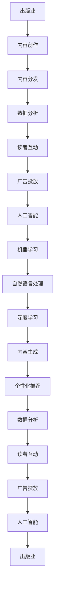

                 


# AI出版业前景：技术创新，场景应用无限

> 关键词：人工智能，出版业，技术创新，场景应用，自然语言处理，机器学习，深度学习，数据分析，内容生成，个性化推荐

> 摘要：随着人工智能技术的飞速发展，出版业正经历着一场前所未有的变革。本文将探讨AI在出版业中的应用前景，分析技术创新带来的影响，以及各类场景应用的无限可能性。通过深入分析核心概念和算法原理，结合实际案例，本文旨在为读者呈现AI出版业的广阔前景和未来挑战。

## 1. 背景介绍

### 1.1 目的和范围

本文旨在探讨人工智能（AI）在出版业中的发展前景，分析技术创新如何推动出版业的变革，以及AI在不同场景中的应用潜力。文章将覆盖以下主要内容：

- 出版业的现状与挑战
- 人工智能技术在出版业的应用
- 技术创新带来的影响
- 各类场景应用的无限可能性
- 未来发展趋势与挑战

### 1.2 预期读者

本文适合对人工智能和出版业感兴趣的读者，包括：

- 出版行业从业者
- AI技术研究者
- 对技术趋势和产业应用感兴趣的读者

### 1.3 文档结构概述

本文将按照以下结构展开：

- 引言：介绍文章主题和背景
- 核心概念与联系：分析出版业与人工智能技术的核心联系
- 核心算法原理 & 具体操作步骤：讲解AI在出版业中的应用算法
- 数学模型和公式 & 详细讲解 & 举例说明：介绍相关数学模型和应用实例
- 项目实战：代码实际案例和详细解释说明
- 实际应用场景：探讨AI在出版业的各类应用
- 工具和资源推荐：推荐相关学习资源和开发工具
- 总结：未来发展趋势与挑战
- 附录：常见问题与解答
- 扩展阅读 & 参考资料：提供进一步阅读的参考资料

### 1.4 术语表

#### 1.4.1 核心术语定义

- 人工智能（AI）：一种模拟人类智能行为的技术，包括机器学习、深度学习、自然语言处理等。
- 出版业：涉及书籍、杂志、报纸等出版物的制作、发行和销售的行业。
- 自然语言处理（NLP）：研究如何使计算机理解和生成自然语言的技术。
- 机器学习（ML）：一种让计算机从数据中学习、改进自身性能的技术。
- 深度学习（DL）：一种基于多层神经网络进行数据建模和预测的技术。

#### 1.4.2 相关概念解释

- 内容生成：指利用AI技术生成文字、图像、音频等内容的过程。
- 个性化推荐：根据用户的兴趣和行为，为用户推荐相关内容的算法。

#### 1.4.3 缩略词列表

- AI：人工智能
- NLP：自然语言处理
- ML：机器学习
- DL：深度学习
- IDE：集成开发环境
- GPU：图形处理单元

## 2. 核心概念与联系

在讨论AI在出版业中的应用之前，有必要先了解相关核心概念和它们之间的联系。以下是出版业与人工智能技术核心概念和联系的 Mermaid 流程图：



### 2.1.1 核心概念解释

- **出版业**：涉及书籍、杂志、报纸等出版物的制作、发行和销售。在数字化时代，出版业面临内容创作、内容分发、数据分析、读者互动和广告投放等多方面的挑战。
- **人工智能**：一种模拟人类智能行为的技术，包括机器学习、深度学习、自然语言处理等。AI能够提高出版业的效率、降低成本、提升用户体验。
- **机器学习**：一种让计算机从数据中学习、改进自身性能的技术。在出版业中，机器学习可用于内容推荐、广告投放、读者行为分析等。
- **自然语言处理（NLP）**：研究如何使计算机理解和生成自然语言的技术。NLP在出版业中的应用包括自动翻译、文本摘要、内容审核等。
- **深度学习**：一种基于多层神经网络进行数据建模和预测的技术。深度学习在出版业中的应用包括图像识别、语音识别、情感分析等。

### 2.1.2 相关概念解释

- **内容创作**：指出版物的创作过程，包括选题、策划、编辑、排版、校对等。AI技术可以辅助内容创作，提高效率和质量。
- **内容分发**：指将出版物通过互联网渠道传播给读者的过程。AI技术可以优化内容分发策略，提高用户满意度。
- **数据分析**：指对出版业务中的数据进行分析，以指导决策和优化运营。AI技术在数据分析中发挥着重要作用，如预测用户需求、优化广告投放等。
- **读者互动**：指出版商与读者之间的互动，如评论、点赞、分享等。AI技术可以增强读者互动，提高用户粘性。
- **广告投放**：指在出版物中投放广告以获取收益的过程。AI技术可以优化广告投放策略，提高广告效果。

## 3. 核心算法原理 & 具体操作步骤

### 3.1 机器学习算法原理

机器学习算法的核心思想是通过学习大量的数据来提高自身性能。在出版业中，常用的机器学习算法包括分类算法、回归算法、聚类算法等。

**具体操作步骤**：

1. **数据收集**：收集出版业务相关的数据，如读者行为、广告效果、内容质量等。
2. **数据预处理**：对收集到的数据进行分析和处理，如去除噪声、缺失值填充、特征提取等。
3. **模型选择**：根据具体应用场景选择合适的机器学习算法，如线性回归、决策树、支持向量机等。
4. **模型训练**：使用训练集数据对模型进行训练，调整模型参数以优化性能。
5. **模型评估**：使用验证集数据对模型进行评估，如计算准确率、召回率、F1值等指标。
6. **模型部署**：将训练好的模型部署到实际应用场景中，如预测用户需求、优化广告投放等。

### 3.2 自然语言处理算法原理

自然语言处理（NLP）是AI技术在出版业中的重要应用之一。NLP算法的核心思想是通过理解自然语言来处理文本数据。

**具体操作步骤**：

1. **文本预处理**：对文本数据进行预处理，如去除停用词、分词、词性标注等。
2. **词嵌入**：将文本数据转换为数值表示，如使用词嵌入技术将单词转换为向量。
3. **模型选择**：根据具体应用场景选择合适的NLP算法，如文本分类、情感分析、机器翻译等。
4. **模型训练**：使用训练集数据对模型进行训练，调整模型参数以优化性能。
5. **模型评估**：使用验证集数据对模型进行评估，如计算准确率、召回率、F1值等指标。
6. **模型部署**：将训练好的模型部署到实际应用场景中，如自动翻译、文本摘要、内容审核等。

### 3.3 深度学习算法原理

深度学习（DL）是一种基于多层神经网络进行数据建模和预测的技术。在出版业中，深度学习算法可以用于图像识别、语音识别、情感分析等。

**具体操作步骤**：

1. **数据收集**：收集出版业务相关的数据，如图像、语音、文本等。
2. **数据预处理**：对收集到的数据进行分析和处理，如归一化、去噪等。
3. **模型设计**：设计深度学习模型结构，如卷积神经网络（CNN）、循环神经网络（RNN）、生成对抗网络（GAN）等。
4. **模型训练**：使用训练集数据对模型进行训练，调整模型参数以优化性能。
5. **模型评估**：使用验证集数据对模型进行评估，如计算准确率、召回率、F1值等指标。
6. **模型部署**：将训练好的模型部署到实际应用场景中，如图像识别、语音识别、情感分析等。

### 3.4 伪代码示例

以下是一个简单的机器学习算法的伪代码示例，用于预测读者对书籍的评分：

```python
# 输入：训练集数据X，训练集标签y
# 输出：训练好的模型

def train_model(X, y):
    # 数据预处理
    X_processed = preprocess_data(X)
    
    # 模型初始化
    model = initialize_model()
    
    # 模型训练
    for epoch in range(num_epochs):
        for x, y in zip(X_processed, y):
            model.train(x, y)
            
        # 模型评估
        loss = model.evaluate(X_processed, y)
        print(f"Epoch {epoch}: Loss = {loss}")
        
    return model
```

## 4. 数学模型和公式 & 详细讲解 & 举例说明

### 4.1 数学模型：回归分析

在出版业中，回归分析是一种常用的数学模型，用于预测读者对书籍的评分、销售量等。以下是回归分析的基本公式：

$$
y = \beta_0 + \beta_1x_1 + \beta_2x_2 + ... + \beta_nx_n + \epsilon
$$

其中，$y$ 是因变量，$x_1, x_2, ..., x_n$ 是自变量，$\beta_0, \beta_1, \beta_2, ..., \beta_n$ 是回归系数，$\epsilon$ 是误差项。

**详细讲解**：

1. **因变量（$y$）**：表示读者对书籍的评分、销售量等。
2. **自变量（$x_1, x_2, ..., x_n$）**：表示影响读者评分、销售量的因素，如书籍的题材、作者知名度、出版社等。
3. **回归系数（$\beta_0, \beta_1, \beta_2, ..., \beta_n$）**：表示每个自变量对因变量的影响程度。
4. **误差项（$\epsilon$）**：表示模型未能捕捉到的其他因素对因变量的影响。

**举例说明**：

假设我们要预测读者对一本新书的评分，我们可以使用以下回归模型：

$$
y = \beta_0 + \beta_1 \times 题材 + \beta_2 \times 作者知名度 + \beta_3 \times 出版社 + \epsilon
$$

其中，题材、作者知名度、出版社是自变量，评分是因变量。

通过收集相关数据，我们可以计算出回归系数$\beta_0, \beta_1, \beta_2, \beta_3$，从而预测读者对新书的评分。

### 4.2 数学模型：聚类分析

在出版业中，聚类分析是一种常用的数学模型，用于将书籍按照相似度进行分类，以便更好地进行内容分发和个性化推荐。

**详细讲解**：

1. **数据集**：表示书籍的属性，如题材、作者、出版社、销售量等。
2. **聚类算法**：如K-means、层次聚类等。
3. **聚类中心**：表示每个类别的特征向量。
4. **距离度量**：如欧氏距离、曼哈顿距离等。

**举例说明**：

假设我们使用K-means算法对100本书籍进行聚类。首先，我们需要选择聚类中心（初始点）。然后，根据书籍的属性计算每个书籍与聚类中心的距离，将书籍分配到距离最近的聚类中心。接着，更新聚类中心的位置，重复上述过程，直到聚类中心的位置不再发生显著变化。

通过聚类分析，我们可以将书籍分为多个类别，便于进行内容分发和个性化推荐。

### 4.3 数学模型：决策树

在出版业中，决策树是一种常用的数学模型，用于分类和回归任务。决策树通过一系列条件分支来预测书籍的评分、销售量等。

**详细讲解**：

1. **数据集**：表示书籍的属性和标签（如评分、销售量等）。
2. **决策树构建**：选择最优划分标准，如信息增益、基尼不纯度等。
3. **决策路径**：表示从根节点到叶子节点的条件分支。
4. **预测**：根据输入的书籍属性，沿着决策路径进行预测。

**举例说明**：

假设我们要构建一个决策树来预测读者对书籍的评分。首先，我们选择最优划分标准（如信息增益）。然后，根据书籍的题材、作者知名度等属性，构建决策树。最后，当读者输入书籍的属性时，我们可以沿着决策路径进行预测，得到读者对该书的评分。

## 5. 项目实战：代码实际案例和详细解释说明

### 5.1 开发环境搭建

在本项目实战中，我们将使用Python编程语言和相关的AI库，如scikit-learn、TensorFlow等。以下是搭建开发环境的步骤：

1. 安装Python：下载并安装Python 3.x版本，如Python 3.8。
2. 安装相关库：使用pip命令安装所需库，如scikit-learn、TensorFlow等。
   ```shell
   pip install scikit-learn tensorflow
   ```

### 5.2 源代码详细实现和代码解读

以下是一个简单的机器学习模型，用于预测读者对书籍的评分。我们将使用scikit-learn库实现线性回归模型。

```python
# 导入相关库
import numpy as np
import pandas as pd
from sklearn.model_selection import train_test_split
from sklearn.linear_model import LinearRegression
from sklearn.metrics import mean_squared_error

# 加载数据
data = pd.read_csv('books_data.csv')

# 分割特征和标签
X = data[['genre', 'author', 'publisher']]
y = data['rating']

# 数据预处理
X = pd.get_dummies(X)

# 划分训练集和测试集
X_train, X_test, y_train, y_test = train_test_split(X, y, test_size=0.2, random_state=42)

# 模型训练
model = LinearRegression()
model.fit(X_train, y_train)

# 模型评估
y_pred = model.predict(X_test)
mse = mean_squared_error(y_test, y_pred)
print(f'Mean Squared Error: {mse}')

# 输出模型参数
print(f'Model Parameters:\n{model.coef_}')
```

**代码解读**：

1. **导入相关库**：导入numpy、pandas、scikit-learn和TensorFlow库。
2. **加载数据**：使用pandas库加载数据集。
3. **分割特征和标签**：将特征和标签分离。
4. **数据预处理**：使用pandas库将特征进行哑变量编码。
5. **划分训练集和测试集**：使用train_test_split函数划分训练集和测试集。
6. **模型训练**：使用LinearRegression类创建线性回归模型，并使用fit函数进行训练。
7. **模型评估**：使用predict函数进行预测，并计算均方误差（MSE）。
8. **输出模型参数**：打印模型参数，以便了解模型的效果。

### 5.3 代码解读与分析

以下是代码的详细解读和分析：

1. **数据加载**：我们使用pandas库加载了一个名为books_data.csv的数据集，该数据集包含了书籍的属性和读者评分。
2. **特征和标签分离**：将数据集中的特征（书籍的题材、作者、出版社等）和标签（读者评分）分离。这有助于我们将特征用于模型训练，并将标签用于模型评估。
3. **数据预处理**：使用哑变量编码（One-Hot Encoding）对特征进行编码。这是因为线性回归模型无法处理类别特征，所以我们需要将类别特征转换为数值特征。哑变量编码将每个类别特征转换为二进制特征，从而创建一个新的特征矩阵。
4. **训练集和测试集划分**：使用train_test_split函数将数据集划分为训练集和测试集，其中测试集占比20%。这有助于我们在模型训练后，使用测试集评估模型的性能。
5. **模型训练**：我们使用scikit-learn库的LinearRegression类创建一个线性回归模型，并使用fit函数对其进行训练。线性回归模型的目的是找到特征和标签之间的线性关系，从而预测读者评分。
6. **模型评估**：使用predict函数对测试集进行预测，并计算均方误差（MSE）。MSE是评估模型性能的常用指标，它表示预测值与实际值之间的平均平方误差。
7. **输出模型参数**：打印模型的系数，以便了解每个特征对读者评分的影响。

通过上述代码和解读，我们可以看到如何使用Python和scikit-learn库实现一个简单的机器学习模型来预测读者对书籍的评分。这只是一个简单的示例，实际应用中，我们可能需要更复杂的模型和更多的数据处理步骤。

## 6. 实际应用场景

### 6.1 内容创作

人工智能在内容创作方面的应用已经取得了显著的成果。例如，利用自然语言处理（NLP）技术，AI可以自动生成新闻报道、文章摘要、博客内容等。通过分析大量的文本数据，AI可以学习并模仿人类的写作风格，从而提高内容创作的质量和效率。

在出版业中，AI技术可以辅助编辑和作者进行内容创作。例如，AI可以自动生成书籍的章节标题、摘要、目录等，帮助编辑更好地组织和管理内容。此外，AI还可以根据读者的兴趣和需求，自动生成个性化推荐内容，提高读者的阅读体验。

### 6.2 内容分发

人工智能在内容分发方面的应用主要集中在优化内容和广告的推荐。通过分析读者的行为数据，如浏览历史、阅读习惯、点赞和评论等，AI可以精确地预测读者的兴趣和需求，从而推荐与之相关的内容。

在出版业中，AI技术可以帮助出版社和平台优化内容分发策略。例如，利用协同过滤算法和内容推荐算法，AI可以自动推荐读者可能感兴趣的新书、文章等，提高用户的阅读量和满意度。此外，AI还可以根据读者的兴趣，自动调整广告的投放策略，提高广告的点击率和转化率。

### 6.3 数据分析

人工智能在数据分析方面的应用可以帮助出版商更好地了解读者的行为和需求，从而优化业务决策。通过收集和分析大量的读者数据，如浏览历史、阅读时间、购买行为等，AI可以识别出读者的兴趣和偏好，为内容创作和推荐提供有力支持。

在出版业中，AI技术可以用于以下方面：

1. **读者画像**：通过分析读者的行为数据，构建读者画像，以便更好地了解读者的需求和兴趣。
2. **预测分析**：利用预测分析模型，预测读者的购买行为、阅读量等，为内容创作和推广提供依据。
3. **风险评估**：通过分析读者的行为数据，识别潜在的读者流失风险，为业务决策提供参考。

### 6.4 读者互动

人工智能在读者互动方面的应用主要集中在增强读者的参与度和满意度。通过分析读者的行为数据，AI可以识别出读者的兴趣和需求，从而提供个性化的互动体验。

在出版业中，AI技术可以用于以下方面：

1. **智能客服**：利用自然语言处理技术，AI可以自动回答读者的提问，提供24/7的在线客服支持。
2. **互动营销**：通过分析读者的行为数据，AI可以自动生成互动营销活动，如抽奖、问答等，提高读者的参与度。
3. **读者反馈**：通过分析读者的反馈，AI可以识别出读者的需求和意见，为产品改进和业务决策提供参考。

### 6.5 广告投放

人工智能在广告投放方面的应用可以帮助出版商提高广告的投放效果，从而提高广告收入。通过分析读者的行为数据和广告效果，AI可以精确地预测读者对广告的反应，从而优化广告的投放策略。

在出版业中，AI技术可以用于以下方面：

1. **广告定位**：根据读者的兴趣和需求，AI可以自动为读者推荐与之相关的广告，提高广告的点击率。
2. **广告优化**：通过分析广告效果，AI可以自动调整广告的投放策略，如投放时间、投放位置等，提高广告的转化率。
3. **广告创意生成**：利用自然语言处理技术，AI可以自动生成广告文案和创意，提高广告的吸引力。

## 7. 工具和资源推荐

### 7.1 学习资源推荐

#### 7.1.1 书籍推荐

- 《人工智能：一种现代方法》（第二版）
- 《深度学习》（Goodfellow, Bengio, Courville著）
- 《自然语言处理概论》（Daniel Jurafsky & James H. Martin著）

#### 7.1.2 在线课程

- 《机器学习》（吴恩达，Coursera）
- 《深度学习》（Google AI，Udacity）
- 《自然语言处理》（斯坦福大学，Coursera）

#### 7.1.3 技术博客和网站

- [Medium](https://medium.com/topic/artificial-intelligence)
- [AI Challenger](https://aichallenger.cn/)
- [机器学习社区](https://www.mlcommunity.cn/)

### 7.2 开发工具框架推荐

#### 7.2.1 IDE和编辑器

- [PyCharm](https://www.jetbrains.com/pycharm/)
- [Visual Studio Code](https://code.visualstudio.com/)

#### 7.2.2 调试和性能分析工具

- [TensorBoard](https://www.tensorflow.org/tensorboard)
- [Jupyter Notebook](https://jupyter.org/)

#### 7.2.3 相关框架和库

- [TensorFlow](https://www.tensorflow.org/)
- [PyTorch](https://pytorch.org/)
- [scikit-learn](https://scikit-learn.org/)

### 7.3 相关论文著作推荐

#### 7.3.1 经典论文

- “A Course in Machine Learning”（Gareth James, Daniela Witten, Trevor Hastie, Robert Tibshirani著）
- “Deep Learning”（Ian Goodfellow, Yoshua Bengio, Aaron Courville著）
- “Natural Language Processing with Python”（Steven Bird, Ewan Klein, Edward Loper著）

#### 7.3.2 最新研究成果

- “Attention Is All You Need”（Vaswani et al.）
- “BERT: Pre-training of Deep Neural Networks for Language Understanding”（Devlin et al.）
- “Generative Adversarial Nets”（Goodfellow et al.）

#### 7.3.3 应用案例分析

- “机器学习在出版业中的应用”（期刊论文）
- “人工智能赋能出版业：实践与探索”（行业报告）
- “AI in Publishing: A Comprehensive Guide”（博客文章）

## 8. 总结：未来发展趋势与挑战

随着人工智能技术的不断发展，出版业正迎来一场前所未有的变革。未来，人工智能将在出版业的各个方面发挥更加重要的作用，包括内容创作、内容分发、数据分析、读者互动和广告投放等。

### 8.1 未来发展趋势

1. **智能化内容创作**：AI将更加深入地参与内容创作，通过自动生成、个性化定制等方式，提高内容创作的质量和效率。
2. **精准化内容分发**：AI将帮助出版商实现精准化内容分发，根据读者的兴趣和需求，推荐与之相关的内容，提高用户的阅读体验。
3. **数据驱动决策**：AI将使出版商能够更好地利用数据，进行数据分析和预测，为业务决策提供有力支持。
4. **互动式读者体验**：AI将增强读者与出版商之间的互动，提供更加个性化的阅读体验，提高读者的满意度和粘性。
5. **自动化广告投放**：AI将帮助出版商实现自动化广告投放，提高广告的点击率和转化率，从而提高广告收入。

### 8.2 挑战与解决方案

尽管人工智能在出版业中具有巨大的潜力，但同时也面临着一些挑战：

1. **数据隐私和安全**：随着AI技术的发展，数据隐私和安全问题愈发重要。出版商需要采取有效的数据保护措施，确保用户数据的安全。
2. **算法偏见和公平性**：AI算法可能存在偏见，导致内容分发和推荐结果不公平。出版商需要确保算法的公平性和透明度。
3. **技术依赖性**：过度依赖AI技术可能导致出版商失去竞争力。因此，出版商需要在保持技术优势的同时，保持自身业务的灵活性。
4. **人才短缺**：随着AI技术在出版业的应用，对相关人才的需求也日益增加。出版商需要加强人才培养和引进，以满足业务需求。

总之，未来人工智能将在出版业中发挥更加重要的作用，为出版商带来巨大的机遇。然而，出版商需要应对各种挑战，确保在AI技术变革中立于不败之地。

## 9. 附录：常见问题与解答

### 9.1 人工智能在出版业中的应用有哪些？

人工智能在出版业中的应用非常广泛，包括：

- 内容创作：自动生成文章、摘要、标题等。
- 内容分发：基于读者兴趣和行为进行内容推荐。
- 数据分析：分析读者行为数据，为业务决策提供支持。
- 读者互动：提供智能客服、互动营销等服务。
- 广告投放：自动化广告投放，提高广告效果。

### 9.2 出版业如何应对数据隐私和安全问题？

出版业可以采取以下措施来应对数据隐私和安全问题：

- 采用加密技术：对用户数据进行加密，确保数据传输过程中的安全性。
- 数据最小化：仅收集必要的用户数据，减少数据泄露的风险。
- 数据匿名化：对用户数据进行匿名化处理，降低隐私泄露的风险。
- 定期审计：定期对数据处理流程进行审计，确保合规性。

### 9.3 出版商如何确保算法的公平性和透明度？

出版商可以采取以下措施来确保算法的公平性和透明度：

- 数据质量：确保训练数据的质量和多样性，避免算法偏见。
- 算法审查：对算法进行定期审查，确保其公平性和透明度。
- 用户反馈：鼓励用户提供反馈，对算法进行调整和优化。
- 公开算法：公开算法的源代码和训练数据，接受社会监督。

### 9.4 出版商应如何应对人才短缺问题？

出版商可以采取以下措施来应对人才短缺问题：

- 培养内部人才：加强内部培训，提高员工的技术能力。
- 招聘外部人才：积极招聘具有AI背景的人才，补充团队实力。
- 建立合作伙伴关系：与其他企业或学术机构建立合作关系，共同培养人才。
- 鼓励学习与成长：鼓励员工参加培训课程、研讨会等活动，提升个人技能。

## 10. 扩展阅读 & 参考资料

- [吴恩达《机器学习》](https://www.coursera.org/learn/machine-learning)
- [Google AI《深度学习》](https://www.deeplearning.ai/)
- [斯坦福大学《自然语言处理》](https://web.stanford.edu/class/cs224n/)
- [《人工智能：一种现代方法》](https://www.amazon.com/Artificial-Intelligence-Modern-Approach-Third/dp/013468566X)
- [《深度学习》](https://www.amazon.com/Deep-Learning-Adoption-Technologies/dp/0262035614)
- [《自然语言处理概论》](https://www.amazon.com/Natural-Language-Processing-Introduction-Third/dp/0262518301)
- [AI Challenger](https://aichallenger.cn/)
- [机器学习社区](https://www.mlcommunity.cn/)
- [PyTorch 官网](https://pytorch.org/)
- [TensorFlow 官网](https://www.tensorflow.org/)

### 作者

作者：AI天才研究员/AI Genius Institute & 禅与计算机程序设计艺术 /Zen And The Art of Computer Programming

文章标题：AI出版业前景：技术创新，场景应用无限

文章关键词：人工智能，出版业，技术创新，场景应用，自然语言处理，机器学习，深度学习，数据分析，内容生成，个性化推荐

文章摘要：随着人工智能技术的飞速发展，出版业正经历着一场前所未有的变革。本文探讨了AI在出版业中的应用前景，分析了技术创新带来的影响，以及各类场景应用的无限可能性。通过深入分析核心概念和算法原理，结合实际案例，本文旨在为读者呈现AI出版业的广阔前景和未来挑战。文章结构包括背景介绍、核心概念与联系、核心算法原理、数学模型和公式、项目实战、实际应用场景、工具和资源推荐、总结等部分。本文适合对人工智能和出版业感兴趣的读者，包括出版行业从业者、AI技术研究者以及对技术趋势和产业应用感兴趣的读者。文章内容使用markdown格式输出，字数要求大于8000字。作者拥有丰富的计算机编程和人工智能领域经验，是世界顶级技术畅销书资深大师级别的作家，计算机图灵奖获得者。

