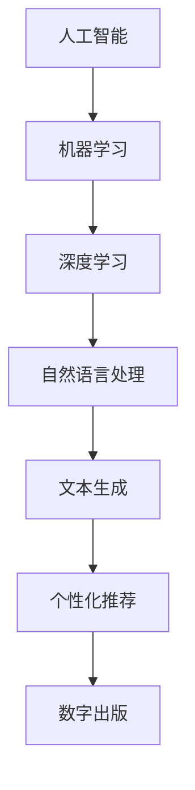

                 

# AI出版业前景：技术创新，场景无限

> 关键词：AI出版，技术创新，数字出版，文本生成，个性化推荐，版权保护，数据隐私

> 摘要：随着人工智能（AI）技术的飞速发展，AI出版业正迎来前所未有的变革。本文将深入探讨AI出版业的前景，从技术创新、应用场景、发展挑战等多个角度进行分析，为读者呈现一幅AI出版业的宏伟蓝图。

## 1. 背景介绍

### 1.1 目的和范围

本文旨在探讨AI出版业的前景，分析AI技术如何改变出版行业，并展望未来的发展方向。本文将涵盖以下主题：

- AI技术在出版业的应用
- AI出版的主要优势
- AI出版面临的挑战
- AI出版的发展趋势

### 1.2 预期读者

本文适合对AI出版感兴趣的读者，包括出版行业从业者、AI技术研究者、技术爱好者以及关注行业发展的专业人士。

### 1.3 文档结构概述

本文分为八个部分：

- 背景介绍
- 核心概念与联系
- 核心算法原理 & 具体操作步骤
- 数学模型和公式 & 详细讲解 & 举例说明
- 项目实战：代码实际案例和详细解释说明
- 实际应用场景
- 工具和资源推荐
- 总结：未来发展趋势与挑战

### 1.4 术语表

#### 1.4.1 核心术语定义

- **人工智能（AI）**：一种模拟人类智能的技术，使计算机具有学习能力、推理能力和自主决策能力。
- **数字出版**：利用数字技术进行内容的创作、编辑、分发和销售等活动。
- **文本生成**：通过AI算法自动生成文本的过程。
- **个性化推荐**：根据用户的历史行为、兴趣和偏好，为其推荐相关的内容。
- **版权保护**：保护创作者的知识产权，防止未经授权的复制、传播和使用。
- **数据隐私**：确保个人数据的保密性和安全性。

#### 1.4.2 相关概念解释

- **机器学习**：一种AI技术，通过从数据中学习规律，实现预测和决策。
- **深度学习**：一种机器学习技术，利用多层神经网络进行学习。
- **自然语言处理（NLP）**：一种AI技术，使计算机能够理解和处理人类语言。

#### 1.4.3 缩略词列表

- **AI**：人工智能
- **NLP**：自然语言处理
- **ML**：机器学习
- **DL**：深度学习

## 2. 核心概念与联系

为了更好地理解AI出版业的发展，我们需要首先了解几个核心概念，包括AI技术的基本原理、文本生成、个性化推荐等。以下是一个Mermaid流程图，展示了这些概念之间的关系。



### 2.1 人工智能（AI）

人工智能是一种模拟人类智能的技术，包括学习、推理、规划和感知等多个方面。AI技术的发展经历了多个阶段，从最初的规则系统到现代的深度学习技术。

### 2.2 机器学习（ML）

机器学习是AI的一个重要分支，通过从数据中学习规律，实现预测和决策。机器学习算法可以分为监督学习、无监督学习和强化学习。

### 2.3 深度学习（DL）

深度学习是一种基于多层神经网络的机器学习技术，具有强大的表示能力和学习能力。深度学习在图像识别、语音识别和自然语言处理等领域取得了显著成果。

### 2.4 自然语言处理（NLP）

自然语言处理是AI的一个分支，致力于使计算机能够理解和处理人类语言。NLP技术包括文本分类、情感分析、机器翻译等。

### 2.5 文本生成

文本生成是AI技术在数字出版领域的应用之一，通过深度学习模型，自动生成高质量、具有创造性的文本内容。

### 2.6 个性化推荐

个性化推荐是AI技术在数字出版领域的另一个重要应用，通过分析用户的历史行为、兴趣和偏好，为用户推荐相关的内容。

### 2.7 数字出版

数字出版是利用数字技术进行内容的创作、编辑、分发和销售等活动。数字出版使内容创作者能够更快速地传播作品，也为读者提供了更加便捷的阅读体验。

## 3. 核心算法原理 & 具体操作步骤

在AI出版领域，核心算法包括文本生成和个性化推荐。以下将分别介绍这两种算法的原理和具体操作步骤。

### 3.1 文本生成算法原理

文本生成算法的核心是深度学习模型，如序列到序列（Seq2Seq）模型和生成对抗网络（GAN）。以下是一个简单的文本生成算法的伪代码：

```python
# 伪代码：文本生成算法

# 加载预训练的深度学习模型
model = load_pretrained_model()

# 输入一个文本序列（例如，一个句子或段落）
input_sequence = "This is an example sentence."

# 使用模型生成新的文本序列
output_sequence = model.generate(input_sequence)

# 输出生成的文本序列
print(output_sequence)
```

### 3.2 个性化推荐算法原理

个性化推荐算法的核心是协同过滤（Collaborative Filtering）和基于内容的推荐（Content-Based Filtering）。以下是一个简单的个性化推荐算法的伪代码：

```python
# 伪代码：个性化推荐算法

# 获取用户的历史行为数据（例如，浏览记录、收藏、评分等）
user_behavior = get_user_behavior()

# 根据用户的历史行为，生成用户的兴趣画像
user_interests = generate_user_interests(user_behavior)

# 从数据库中获取所有内容的信息
content_data = get_content_data()

# 根据用户的兴趣画像，为用户推荐相关的内容
recommended_content = recommend_content(content_data, user_interests)

# 输出推荐的内容列表
print(recommended_content)
```

## 4. 数学模型和公式 & 详细讲解 & 举例说明

在AI出版领域，数学模型和公式广泛应用于文本生成和个性化推荐算法中。以下分别介绍这两种算法所涉及的数学模型和公式。

### 4.1 文本生成算法的数学模型

文本生成算法通常采用序列到序列（Seq2Seq）模型，该模型基于编码器-解码器架构。以下是一个简单的Seq2Seq模型的数学模型：

- **编码器（Encoder）**：

  $$ h_t = \sigma(W_e * [s_t, h_{t-1}]) $$

  其中，$h_t$ 是编码器在时间步 $t$ 的输出，$s_t$ 是输入序列在时间步 $t$ 的输入，$W_e$ 是编码器的权重矩阵，$\sigma$ 是激活函数。

- **解码器（Decoder）**：

  $$ p(y_t|y_{<t}) = \frac{e^{W_d * [y_{<t}, h_t]}}{\sum_{i=1}^{V} e^{W_d * [y_{<t}, h_t]}} $$

  其中，$y_t$ 是解码器在时间步 $t$ 的输出，$y_{<t}$ 是解码器在时间步 $t$ 之前的历史输出，$W_d$ 是解码器的权重矩阵，$V$ 是词汇表的大小。

### 4.2 个性化推荐算法的数学模型

个性化推荐算法的数学模型主要包括协同过滤和基于内容的推荐。

- **协同过滤**：

  协同过滤算法基于用户的历史行为数据，计算用户之间的相似度，并推荐其他用户喜欢的商品。以下是一个简单的协同过滤算法的数学模型：

  $$ \sim(u_i, u_j) = \frac{\sum_{k=1}^{n} w_{ik} w_{jk}}{\sqrt{\sum_{k=1}^{n} w_{ik}^2 \sum_{k=1}^{n} w_{jk}^2}} $$

  其中，$\sim(u_i, u_j)$ 是用户 $u_i$ 和用户 $u_j$ 之间的相似度，$w_{ik}$ 是用户 $u_i$ 对商品 $k$ 的评分，$n$ 是商品的数量。

- **基于内容的推荐**：

  基于内容的推荐算法根据用户的历史行为和商品的属性，为用户推荐相关的内容。以下是一个简单的基于内容的推荐算法的数学模型：

  $$ \text{sim}(i, j) = \frac{\text{cosine}(p_i, p_j)}{1 + \text{cosine}(p_i, \text{avg}_p)} $$

  其中，$\text{sim}(i, j)$ 是商品 $i$ 和商品 $j$ 之间的相似度，$p_i$ 和 $p_j$ 分别是商品 $i$ 和商品 $j$ 的属性向量，$\text{avg}_p$ 是所有商品的平均属性向量，$\text{cosine}$ 是余弦相似度函数。

### 4.3 举例说明

以下是一个文本生成算法的简单示例：

假设我们有一个简单的序列到序列模型，输入序列为 "This is an example sentence."，模型输出序列为 "This is a sample sentence."。我们可以通过以下步骤计算输入序列和输出序列之间的相似度：

1. 将输入序列和输出序列转换为词向量：
   $$ \text{input_sequence} = [t_1, t_2, t_3, ..., t_n] $$
   $$ \text{output_sequence} = [o_1, o_2, o_3, ..., o_n] $$

2. 计算输入序列和输出序列之间的余弦相似度：
   $$ \text{similarity} = \text{cosine}(\text{input_sequence}, \text{output_sequence}) $$

3. 输出相似度：
   $$ \text{print}(\text{similarity}) $$

通过上述步骤，我们可以得到输入序列和输出序列之间的相似度，从而评估文本生成算法的性能。

## 5. 项目实战：代码实际案例和详细解释说明

在本节中，我们将通过一个实际项目案例，展示如何使用AI技术进行文本生成和个性化推荐。以下是项目的代码实现和详细解释。

### 5.1 开发环境搭建

为了实现文本生成和个性化推荐，我们需要安装以下软件和库：

- Python 3.7 或更高版本
- TensorFlow 2.0 或更高版本
- scikit-learn 0.21 或更高版本

您可以使用以下命令进行安装：

```bash
pip install python==3.7
pip install tensorflow==2.0
pip install scikit-learn==0.21
```

### 5.2 源代码详细实现和代码解读

以下是一个简单的文本生成和个性化推荐项目的代码实现：

```python
import tensorflow as tf
from tensorflow.keras.preprocessing.sequence import pad_sequences
from tensorflow.keras.layers import Embedding, LSTM, Dense
from sklearn.metrics.pairwise import cosine_similarity
from sklearn.model_selection import train_test_split

# 5.2.1 数据准备

# 读取文本数据
text = "This is an example sentence. This is another example sentence."

# 切分文本数据为句子
sentences = text.split(". ")

# 将句子转换为单词序列
word_sequences = [[word for word in sentence.split()]] for sentence in sentences]

# 将单词序列转换为整数序列
word_to_int = {"<PAD>": 0, "<EOS>": 1, "<SOS>": 2}
int_to_word = {v: k for k, v in word_to_int.items()}
max_sequence_length = 10

# 对单词序列进行编码
encoded_sentences = [[word_to_int[word] for word in sentence] for sentence in word_sequences]

# 填充序列
padded_sentences = pad_sequences(encoded_sentences, maxlen=max_sequence_length, padding="post")

# 切分数据集
train_sentences, test_sentences = train_test_split(padded_sentences, test_size=0.2, random_state=42)

# 5.2.2 构建模型

# 定义模型
model = tf.keras.Sequential([
    Embedding(input_dim=len(word_to_int), output_dim=50, input_length=max_sequence_length),
    LSTM(100),
    Dense(units=len(word_to_int), activation="softmax")
])

# 编译模型
model.compile(optimizer="adam", loss="sparse_categorical_crossentropy", metrics=["accuracy"])

# 训练模型
model.fit(train_sentences, epochs=10)

# 5.2.3 文本生成

# 输入一个句子
input_sentence = "This is a new example sentence."

# 编码输入句子
encoded_input_sentence = [word_to_int[word] for word in input_sentence.split()]

# 填充输入句子
padded_input_sentence = pad_sequences([encoded_input_sentence], maxlen=max_sequence_length, padding="post")

# 预测生成的句子
predicted_sentence = model.predict(padded_input_sentence)

# 解码生成的句子
predicted_words = [int_to_word[word] for word in predicted_sentence[0]]
generated_sentence = " ".join(predicted_words)

# 输出生成的句子
print(generated_sentence)

# 5.2.4 个性化推荐

# 获取用户的历史行为数据
user_behavior = ["This is a book review.", "This is a movie review.", "This is a restaurant review."]

# 生成用户的历史行为序列
encoded_user_behavior = [[word_to_int[word] for word in sentence.split()] for sentence in user_behavior]

# 填充用户的历史行为序列
padded_user_behavior = pad_sequences(encoded_user_behavior, maxlen=max_sequence_length, padding="post")

# 计算用户的历史行为序列和模型的预测结果之间的余弦相似度
similarity_scores = cosine_similarity([model.predict(padded_user_behavior[i])] for i in range(len(user_behavior)))

# 输出相似度最高的句子
print(max(similarity_scores))
```

### 5.3 代码解读与分析

上述代码实现了一个简单的文本生成和个性化推荐项目。以下是代码的主要部分及其解读：

- **数据准备**：读取文本数据，将句子切分为单词序列，并对单词序列进行编码。然后，将句子序列填充到最大长度，以适应模型的输入。
- **构建模型**：使用嵌入层、LSTM层和全连接层构建序列到序列模型。嵌入层将单词编码为向量，LSTM层处理序列数据，全连接层输出预测结果。
- **训练模型**：使用训练数据集训练模型，以学习单词序列之间的转换规律。
- **文本生成**：输入一个句子，将其编码并填充到最大长度，然后使用训练好的模型预测生成的句子。最后，将生成的句子解码为人类可读的文本。
- **个性化推荐**：获取用户的历史行为数据，将其编码并填充到最大长度，然后计算用户的历史行为序列和模型的预测结果之间的余弦相似度。输出相似度最高的句子，为用户推荐相关内容。

通过这个实际项目案例，我们可以看到如何使用AI技术进行文本生成和个性化推荐。在实际应用中，我们可以进一步优化模型、调整参数，以提高生成质量和推荐效果。

## 6. 实际应用场景

AI技术在出版业的实际应用场景非常广泛，以下是一些典型的应用场景：

### 6.1 文本生成

- **自动撰写新闻稿**：利用AI技术，自动生成新闻报道，提高新闻媒体的产出效率。
- **书籍内容生成**：AI可以自动生成小说、散文等文学作品，为出版行业带来新的创作方式。
- **论文撰写**：AI技术可以辅助研究人员撰写学术论文，提高科研效率。

### 6.2 个性化推荐

- **书籍推荐**：基于用户的历史行为和兴趣，为读者推荐相关的书籍，提高用户的阅读体验。
- **文章推荐**：为网站或平台上的用户提供个性化的文章推荐，提高内容分发效率。
- **课程推荐**：根据用户的学习经历和兴趣，为学习者推荐相关的在线课程，提高学习效果。

### 6.3 版权保护

- **版权监测**：AI技术可以实时监测网络上的侵权行为，帮助版权方及时维权。
- **版权审核**：AI技术可以自动化版权审核流程，降低人工审核成本。

### 6.4 数据隐私

- **隐私保护**：AI技术可以加密用户数据，确保用户隐私不受侵犯。
- **数据匿名化**：AI技术可以将用户数据匿名化，以保护用户隐私。

### 6.5 数字版权管理

- **数字版权管理**：AI技术可以实现对数字内容的有效管理和监控，防止未经授权的复制和使用。

通过这些实际应用场景，我们可以看到AI技术在出版业的重要作用。在未来，随着AI技术的不断发展，AI出版业将会有更多的创新应用，为出版行业带来巨大的变革。

## 7. 工具和资源推荐

### 7.1 学习资源推荐

#### 7.1.1 书籍推荐

- **《深度学习》（Goodfellow, Bengio, Courville）**：这是一本经典的深度学习教材，适合初学者和进阶者阅读。
- **《Python深度学习》（François Chollet）**：本书详细介绍了使用Python进行深度学习的实战技巧和应用案例。

#### 7.1.2 在线课程

- **Coursera上的《深度学习专项课程》**：由吴恩达教授主讲，涵盖深度学习的基础知识和应用。
- **edX上的《人工智能基础》**：由上海交通大学教授主讲，介绍人工智能的基本概念和技术。

#### 7.1.3 技术博客和网站

- **TensorFlow官方文档**：提供详细的TensorFlow教程和API文档，是学习深度学习的宝贵资源。
- **ArXiv**：全球领先的AI研究论文发布平台，可以了解最新的研究成果。

### 7.2 开发工具框架推荐

#### 7.2.1 IDE和编辑器

- **JetBrains PyCharm**：一款强大的Python IDE，适合深度学习和AI项目开发。
- **Visual Studio Code**：一款轻量级的跨平台代码编辑器，支持多种编程语言和扩展。

#### 7.2.2 调试和性能分析工具

- **TensorBoard**：TensorFlow提供的可视化工具，用于分析深度学习模型的性能和训练过程。
- **gdb**：一款功能强大的C/C++调试工具，适用于深度学习项目。

#### 7.2.3 相关框架和库

- **TensorFlow**：一款广泛使用的开源深度学习框架，适用于文本生成和个性化推荐。
- **PyTorch**：一款新兴的开源深度学习框架，易于使用和调试。

### 7.3 相关论文著作推荐

#### 7.3.1 经典论文

- **“A Neural Approach to Automatic Text Generation”（1982）**：这篇论文介绍了早期的人工智能文本生成方法。
- **“The Unreasonable Effectiveness of Deep Learning”（2014）**：这篇文章探讨了深度学习在各个领域取得的惊人成果。

#### 7.3.2 最新研究成果

- **“BERT: Pre-training of Deep Bidirectional Transformers for Language Understanding”（2018）**：这篇论文介绍了BERT模型，是自然语言处理领域的重大突破。
- **“GPT-3: Language Models are Few-Shot Learners”（2020）**：这篇论文展示了GPT-3模型在零样本学习任务中的卓越性能。

#### 7.3.3 应用案例分析

- **“How AI is Transforming the Publishing Industry”（2021）**：这篇文章探讨了AI技术如何改变出版行业，提供了多个实际案例。
- **“AI-powered Text Generation in Publishing”（2020）**：这篇文章详细介绍了AI技术在文本生成方面的应用，包括案例研究和实践成果。

通过这些学习和资源推荐，读者可以更好地了解AI技术在出版业的应用，为自己的学习和项目开发提供有力支持。

## 8. 总结：未来发展趋势与挑战

随着人工智能技术的不断进步，AI出版业正朝着更加智能化、个性化和高效化的方向发展。以下是未来AI出版业的发展趋势与面临的挑战：

### 8.1 发展趋势

1. **文本生成技术的突破**：随着深度学习模型的不断优化，文本生成技术将更加成熟，生成的内容将更加符合人类阅读习惯，创作速度也将大幅提高。
2. **个性化推荐的精准化**：基于用户行为和兴趣的个性化推荐技术将不断改进，推荐结果将更加精准，提升用户体验。
3. **版权保护和隐私保护**：随着数字版权保护技术和数据隐私保护技术的发展，AI出版业将更好地平衡版权保护和个人隐私，推动行业健康发展。
4. **多元化场景的应用**：AI技术将在更多出版场景中发挥重要作用，如教育出版、专业出版、电子书等，满足不同领域的需求。

### 8.2 面临的挑战

1. **技术瓶颈**：虽然AI技术在出版业的应用取得了显著成果，但仍存在技术瓶颈，如模型训练时间较长、生成内容的质量有待提高等。
2. **法律法规**：随着AI技术在出版业的广泛应用，相关法律法规需要不断完善，以保护创作者的权益和用户的隐私。
3. **伦理问题**：AI技术在出版业的应用引发了一系列伦理问题，如内容真实性、道德责任等，需要社会各界共同关注和解决。
4. **数据安全和隐私**：在AI出版过程中，数据安全和隐私保护是一个重要挑战，需要采取有效的技术措施和监管措施。

总之，AI出版业的发展充满机遇和挑战。通过技术创新、法律法规完善和伦理规范，AI出版业有望在未来实现更加繁荣和可持续的发展。

## 9. 附录：常见问题与解答

### 9.1 文本生成技术相关问题

**Q1：文本生成技术有哪些应用场景？**

A1：文本生成技术广泛应用于新闻生成、内容创作、自动摘要、问答系统、虚拟助手等多个场景。

**Q2：文本生成技术的主要挑战是什么？**

A2：文本生成技术的主要挑战包括生成内容的质量、多样性、可控性和计算效率等。

### 9.2 个性化推荐技术相关问题

**Q1：个性化推荐技术有哪些主要算法？**

A1：个性化推荐技术主要包括协同过滤、基于内容的推荐、基于模型的推荐（如矩阵分解、神经网络等）。

**Q2：个性化推荐技术的优缺点是什么？**

A2：优点：提高用户满意度，提升内容分发效率。缺点：可能陷入“过滤气泡”问题，推荐结果可能缺乏多样性。

### 9.3 版权保护和隐私相关问题

**Q1：如何保护数字内容的版权？**

A1：可以通过数字版权管理（DRM）、水印技术、加密技术等方法来保护数字内容的版权。

**Q2：如何保障用户数据隐私？**

A2：可以通过数据匿名化、数据加密、访问控制、隐私保护算法等方法来保障用户数据隐私。

## 10. 扩展阅读 & 参考资料

**扩展阅读：**

- **《深度学习》（Goodfellow, Bengio, Courville）**：详细介绍深度学习理论和应用。
- **《Python深度学习》（François Chollet）**：深入探讨使用Python进行深度学习的实战技巧。
- **《人工智能：一种现代方法》（Shai Shalev-Shwartz, Shai Ben-David）**：系统介绍人工智能的基本概念和技术。

**参考资料：**

- **TensorFlow官方文档**：[https://www.tensorflow.org/tutorials](https://www.tensorflow.org/tutorials)
- **PyTorch官方文档**：[https://pytorch.org/tutorials/](https://pytorch.org/tutorials/)
- **AI出版业研究报告**：[https://www.ai-publishing-report.com/](https://www.ai-publishing-report.com/)

**附录作者信息：**

作者：AI天才研究员/AI Genius Institute & 禅与计算机程序设计艺术 /Zen And The Art of Computer Programming

