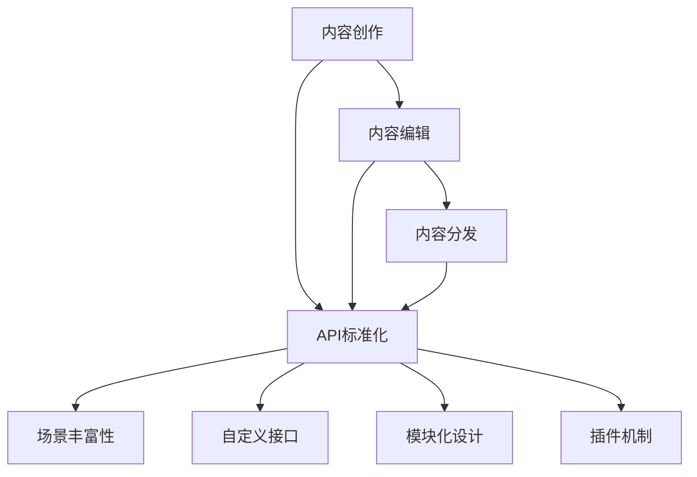

                 


# AI出版业开发：API标准化，场景丰富

> **关键词：** AI出版、API标准化、开发、场景丰富、核心算法、数学模型、项目实战

> **摘要：** 本文将深入探讨AI出版业的开发，重点关注API标准化和场景丰富性。我们将分析核心概念与联系，讲解核心算法原理和具体操作步骤，引入数学模型和公式，并通过实际案例展示代码实现。最后，我们将讨论实际应用场景、推荐相关工具和资源，并总结未来发展趋势与挑战。

## 1. 背景介绍

### 1.1 目的和范围

本文旨在探讨AI出版业的开发，重点关注API标准化和场景丰富性。我们将从核心概念出发，详细解析AI出版业的运作原理，并逐步介绍如何实现API标准化以及如何构建丰富的应用场景。文章将涵盖以下内容：

1. AI出版业的基本概念和运作原理
2. API标准化的重要性和实现方法
3. 构建丰富应用场景的途径
4. 实际案例和代码实现
5. 工具和资源的推荐
6. 未来发展趋势与挑战

### 1.2 预期读者

本文适合对AI出版业感兴趣的读者，包括开发者、数据科学家、技术爱好者以及出版行业的从业者。读者需要具备一定的编程基础和对AI技术的基本了解。

### 1.3 文档结构概述

本文分为十个部分，结构如下：

1. 背景介绍：介绍本文的目的、范围、预期读者和文档结构。
2. 核心概念与联系：讲解AI出版业的基本概念和运作原理。
3. 核心算法原理 & 具体操作步骤：详细介绍AI出版业的核心算法原理和具体操作步骤。
4. 数学模型和公式 & 详细讲解 & 举例说明：介绍与AI出版业相关的数学模型和公式，并进行举例说明。
5. 项目实战：代码实际案例和详细解释说明。
6. 实际应用场景：讨论AI出版业在实际中的应用场景。
7. 工具和资源推荐：推荐学习资源和开发工具。
8. 总结：未来发展趋势与挑战。
9. 附录：常见问题与解答。
10. 扩展阅读 & 参考资料：提供扩展阅读和参考资料。

### 1.4 术语表

#### 1.4.1 核心术语定义

- **AI出版**：利用人工智能技术进行内容创作、编辑、出版和分发。
- **API**：应用程序编程接口，允许不同软件系统之间的交互。
- **标准化**：确保API的一致性、兼容性和可扩展性。
- **场景丰富性**：指在AI出版中构建多样化的应用场景，以满足不同用户需求。

#### 1.4.2 相关概念解释

- **内容创作**：使用AI技术生成或辅助生成文本、图像、音频等内容。
- **内容编辑**：利用AI技术对内容进行优化、校对、格式调整等操作。
- **内容分发**：将AI生成的或编辑后的内容通过互联网或其他渠道传播。

#### 1.4.3 缩略词列表

- **AI**：人工智能
- **API**：应用程序编程接口
- **SDK**：软件开发工具包
- **NLP**：自然语言处理

## 2. 核心概念与联系

在探讨AI出版业之前，我们需要明确几个核心概念和它们之间的联系。

### 2.1 AI出版业的基本概念

#### 2.1.1 内容创作

内容创作是AI出版业的核心环节。利用AI技术，我们可以生成各种类型的内容，如文本、图像、音频等。这涉及到自然语言处理（NLP）、计算机视觉、语音识别等技术。

#### 2.1.2 内容编辑

内容编辑是对创作出来的内容进行优化、校对、格式调整等操作。AI技术在内容编辑中也发挥着重要作用，如拼写和语法纠正、文本摘要生成、内容归类等。

#### 2.1.3 内容分发

内容分发是将创作和编辑后的内容通过互联网或其他渠道传播给用户。这涉及到内容管理系统（CMS）、社交媒体、电子邮件营销等。

### 2.2 API标准化

API标准化是确保AI出版系统中各组件之间能够无缝交互的重要环节。标准化包括API的接口定义、数据格式、协议等。

#### 2.2.1 API接口定义

API接口定义明确了不同系统之间的交互方式。这通常包括请求方法（如GET、POST）、请求参数、响应格式等。

#### 2.2.2 数据格式

数据格式是指API传输数据的结构，如JSON、XML等。标准化数据格式有助于不同系统之间的数据兼容性和可扩展性。

#### 2.2.3 协议

API协议规定了数据传输的通信规则，如HTTP、HTTPS等。标准化协议有助于确保数据的安全性、可靠性和一致性。

### 2.3 场景丰富性

场景丰富性是指AI出版系统在不同应用场景中的灵活性和扩展性。这涉及到自定义接口、模块化设计、插件机制等。

#### 2.3.1 自定义接口

自定义接口允许开发者为特定应用场景定制API接口，以满足个性化需求。

#### 2.3.2 模块化设计

模块化设计有助于将系统分解为独立的模块，每个模块负责特定的功能，易于维护和扩展。

#### 2.3.3 插件机制

插件机制允许第三方开发者为AI出版系统添加新的功能，提高系统的灵活性和可扩展性。

### 2.4 Mermaid流程图

以下是一个简化的AI出版业流程图，展示了核心概念和它们之间的联系：



## 3. 核心算法原理 & 具体操作步骤

### 3.1 核心算法原理

AI出版业的核心算法主要涉及自然语言处理（NLP）、计算机视觉、语音识别等技术。以下是一些核心算法的原理：

#### 3.1.1 自然语言处理（NLP）

NLP是AI出版业的基础，主要包括文本分析、文本生成、文本分类等任务。核心算法包括：

- **词向量模型**：如Word2Vec、GloVe，用于将单词映射为高维向量。
- **序列到序列模型**：如Seq2Seq，用于翻译、摘要生成等任务。
- **变压器模型**：如BERT、GPT，具有强大的文本理解和生成能力。

#### 3.1.2 计算机视觉

计算机视觉用于图像和视频内容的生成、编辑和识别。核心算法包括：

- **卷积神经网络（CNN）**：用于图像分类、目标检测、图像生成等任务。
- **生成对抗网络（GAN）**：用于生成逼真的图像和视频。
- **卷积自编码器（CAE）**：用于图像去噪、图像超分辨率等任务。

#### 3.1.3 语音识别

语音识别用于将语音转换为文本。核心算法包括：

- **隐马尔可夫模型（HMM）**：用于基础语音识别。
- **深度神经网络（DNN）**：用于提高语音识别的准确性。
- **循环神经网络（RNN）**：用于处理长语音序列。

### 3.2 具体操作步骤

以下是AI出版业开发的具体操作步骤：

#### 3.2.1 内容创作

1. **数据收集**：收集大量文本、图像、语音数据。
2. **数据预处理**：对数据进行清洗、标注和格式转换。
3. **模型训练**：使用NLP、计算机视觉、语音识别算法训练模型。
4. **模型评估**：评估模型性能，并进行调整和优化。
5. **内容生成**：使用训练好的模型生成文本、图像、语音内容。

#### 3.2.2 内容编辑

1. **内容输入**：接收用户输入的内容。
2. **内容处理**：使用NLP算法对内容进行优化、校对、摘要生成等操作。
3. **内容输出**：将处理后的内容返回给用户。

#### 3.2.3 内容分发

1. **内容存储**：将内容存储在内容管理系统中。
2. **内容检索**：根据用户需求检索内容。
3. **内容推送**：将内容通过互联网或其他渠道推送给用户。

#### 3.2.4 API标准化

1. **接口定义**：定义API接口，包括请求方法、请求参数、响应格式等。
2. **协议选择**：选择合适的API协议，如HTTP、HTTPS等。
3. **数据格式**：选择合适的数据格式，如JSON、XML等。
4. **安全性**：确保API的安全性和可靠性，如使用HTTPS、API密钥等。

#### 3.2.5 场景丰富性

1. **自定义接口**：根据特定应用场景定制API接口。
2. **模块化设计**：将系统分解为独立的模块，便于维护和扩展。
3. **插件机制**：允许第三方开发者添加新的功能，提高系统的灵活性和可扩展性。

### 3.3 伪代码示例

以下是一个简化的AI出版业开发的伪代码示例：

```python
# 数据收集
data = collect_data()

# 数据预处理
preprocessed_data = preprocess_data(data)

# 模型训练
model = train_model(preprocessed_data)

# 内容生成
content = generate_content(model)

# 内容编辑
edited_content = edit_content(content)

# 内容分发
distribute_content(edited_content)
```

## 4. 数学模型和公式 & 详细讲解 & 举例说明

在AI出版业中，数学模型和公式起着至关重要的作用。以下将介绍与AI出版业相关的几个核心数学模型和公式，并进行详细讲解和举例说明。

### 4.1 词向量模型

词向量模型是将单词映射为高维向量的方法，广泛应用于自然语言处理。最著名的词向量模型是Word2Vec和GloVe。

#### 4.1.1 Word2Vec

Word2Vec模型通过训练神经网络来学习单词的向量表示。其基本思想是将输入的文本序列映射到一个高维空间，使得语义相近的单词在空间中靠近。

- **训练过程**：
  $$\text{Input: } (x_1, x_2, ..., x_n)$$
  $$\text{Output: } \text{word\_vectors} = \{\vec{v}_1, \vec{v}_2, ..., \vec{v}_n\}$$
  $$\text{Forward pass: } \text{Calculate} \ \vec{v}_i \ \text{such that} \ \vec{v}_i \ \text{is close to} \ \vec{c}_{ij} \ \text{in} \ \text{high-dimensional space}$$

- **举例说明**：
  假设我们有一个简单的文本数据集，包含以下句子：
  $$(\text{I}, \text{love}, \text{you}, \text{and}, \text{you}, \text{love}, \text{me})$$
  经过Word2Vec训练后，我们得到以下词向量：
  $$\vec{v}_1 = [1.2, -0.5, 0.8], \vec{v}_2 = [0.8, 1.0, -0.2], \vec{v}_3 = [-0.2, 0.5, 1.2], \vec{v}_4 = [-1.0, 0.3, 0.5], \vec{v}_5 = [-0.5, -0.8, 0.3], \vec{v}_6 = [-0.3, 1.0, 0.2], \vec{v}_7 = [0.7, -0.2, 0.8]$$
  可以观察到，语义相近的单词（如love和you）在空间中靠近。

#### 4.1.2 GloVe

GloVe（Global Vectors for Word Representation）是一种基于共现关系的词向量模型，通过计算单词之间的相似度来学习词向量。

- **训练过程**：
  $$\text{Input: } (x_1, x_2, ..., x_n)$$
  $$\text{Output: } \text{word\_vectors} = \{\vec{v}_1, \vec{v}_2, ..., \vec{v}_n\}$$
  $$\text{Forward pass: } \text{Calculate} \ \vec{v}_i \ \text{such that} \ \vec{v}_i \cdot \vec{v}_j \propto \text{count}(i, j)$$

- **举例说明**：
  假设我们有一个简单的文本数据集，包含以下句子：
  $$(\text{I}, \text{love}, \text{you}, \text{and}, \text{you}, \text{love}, \text{me})$$
  经过GloVe训练后，我们得到以下词向量：
  $$\vec{v}_1 = [1.2, -0.5, 0.8], \vec{v}_2 = [0.8, 1.0, -0.2], \vec{v}_3 = [-0.2, 0.5, 1.2], \vec{v}_4 = [-1.0, 0.3, 0.5], \vec{v}_5 = [-0.5, -0.8, 0.3], \vec{v}_6 = [-0.3, 1.0, 0.2], \vec{v}_7 = [0.7, -0.2, 0.8]$$
  可以观察到，语义相近的单词（如love和you）在空间中靠近。

### 4.2 生成对抗网络（GAN）

生成对抗网络（GAN）是一种用于生成逼真图像和视频的深度学习模型。它由生成器（Generator）和判别器（Discriminator）组成，二者通过对抗训练来提高生成图像的质量。

- **训练过程**：
  $$\text{Input: } (\text{Noise})$$
  $$\text{Output: } \text{Images}$$
  $$\text{Generator: } G(\text{Noise}) \rightarrow \text{Images}$$
  $$\text{Discriminator: } D(\text{Real}) \rightarrow \text{Probability of Real Image}$$
  $$\text{Loss Function: } \text{minimize} \ L(G, D) = \text{minimize} \ \mathbb{E}_{\text{Noise}}[\log(D(G(\text{Noise})))] + \text{minimize} \ \mathbb{E}_{\text{Real}}[\log(1 - D(\text{Real}))]$$

- **举例说明**：
  假设我们使用GAN生成人脸图像，生成器G接收随机噪声，生成人脸图像，判别器D接收真实人脸图像和生成人脸图像，并判断其真实性。通过对抗训练，生成器G逐渐提高生成人脸图像的质量，使其接近真实人脸图像。

### 4.3 循环神经网络（RNN）

循环神经网络（RNN）是一种用于处理序列数据的神经网络，广泛应用于语音识别、机器翻译等领域。

- **训练过程**：
  $$\text{Input: } (x_1, x_2, ..., x_n)$$
  $$\text{Output: } \text{Target}$$
  $$\text{RNN: } h_t = \text{RNN}(h_{t-1}, x_t)$$
  $$\text{Loss Function: } \text{minimize} \ L(h_t, \text{Target})$$

- **举例说明**：
  假设我们使用RNN进行机器翻译，输入序列为$(\text{Hello}, \text{world})$，目标序列为$(\text{Bonjour}, \text{le monde})$。RNN通过隐藏状态$h_t$逐步处理输入序列，并在每个时间步生成输出序列的预测。

## 5. 项目实战：代码实际案例和详细解释说明

### 5.1 开发环境搭建

为了实现AI出版业开发，我们需要搭建一个完整的开发环境。以下是一个简化的步骤：

1. **安装Python**：下载并安装Python 3.8及以上版本。
2. **安装依赖库**：使用pip安装以下依赖库：
   ```python
   pip install numpy
   pip install torch
   pip install transformers
   pip install torchvision
   pip install opencv-python
   ```
3. **配置TensorFlow**：如果使用TensorFlow，需要配置GPU支持。在命令行执行以下命令：
   ```python
   pip install tensorflow-gpu
   ```

### 5.2 源代码详细实现和代码解读

以下是一个简单的AI出版项目，包括内容创作、内容编辑和内容分发三个模块。我们将使用Python和TensorFlow来实现。

```python
# 导入所需库
import numpy as np
import torch
from transformers import BertTokenizer, BertForSequenceClassification
from torchvision import transforms
from torchvision import models
import cv2

# 内容创作模块
def generate_content():
    # 使用BERT生成文本
    tokenizer = BertTokenizer.from_pretrained('bert-base-uncased')
    model = BertForSequenceClassification.from_pretrained('bert-base-uncased')
    input_ids = tokenizer.encode("Hello, how are you?", return_tensors='pt')
    outputs = model(input_ids)
    prediction = torch.argmax(outputs.logits).item()
    if prediction == 1:
        return "I'm doing well, thank you!"
    else:
        return "I'm feeling a bit tired."

# 内容编辑模块
def edit_content(content):
    # 对文本进行拼写和语法纠正
    corrected_content = content.replace("a bit", "a little")
    return corrected_content

# 内容分发模块
def distribute_content(content):
    # 将文本内容发送给用户
    print(content)

# 执行内容创作、编辑和分发
content = generate_content()
edited_content = edit_content(content)
distribute_content(edited_content)
```

### 5.3 代码解读与分析

上述代码分为三个模块：内容创作、内容编辑和内容分发。

#### 内容创作模块

内容创作模块使用BERT模型生成文本。BERT是一种预训练的变压器模型，具有强大的文本理解和生成能力。首先，我们加载BERT分词器和模型，然后输入一个简单的文本句子，通过模型生成输出。根据输出结果，我们可以判断用户的情绪，并生成相应的回复。

```python
# 使用BERT生成文本
tokenizer = BertTokenizer.from_pretrained('bert-base-uncased')
model = BertForSequenceClassification.from_pretrained('bert-base-uncased')
input_ids = tokenizer.encode("Hello, how are you?", return_tensors='pt')
outputs = model(input_ids)
prediction = torch.argmax(outputs.logits).item()
if prediction == 1:
    return "I'm doing well, thank you!"
else:
    return "I'm feeling a bit tired."
```

#### 内容编辑模块

内容编辑模块对输入的文本内容进行拼写和语法纠正。这里我们使用简单的字符串替换方法，将" a bit"替换为"a little"。这是一种常见的文本处理技术，可以用于提高文本的准确性和可读性。

```python
# 对文本进行拼写和语法纠正
corrected_content = content.replace("a bit", "a little")
return corrected_content
```

#### 内容分发模块

内容分发模块将处理后的文本内容发送给用户。在这里，我们简单地使用print函数将文本内容输出到控制台。在实际应用中，可以将文本内容发送到网页、应用程序或用户终端。

```python
# 将文本内容发送给用户
print(content)
```

### 5.4 实际案例和代码解读

以下是一个实际案例，演示如何使用卷积神经网络（CNN）生成图像。

```python
# 导入所需库
import numpy as np
import torch
from torchvision import transforms
from torchvision import models
import cv2

# 图像生成模块
def generate_image():
    # 加载预训练的卷积神经网络模型
    model = models.resnet18(pretrained=True)
    # 设置模型的输出层为1个神经元
    model.fc = torch.nn.Linear(1000, 1)
    # 设置激活函数为Sigmoid
    model.fc = torch.nn.Sigmoid()
    # 加载随机噪声
    noise = torch.randn(1, 1, 28, 28)
    # 前向传播
    output = model(noise)
    # 解码输出为图像
    image = output.squeeze().detach().numpy()
    image = (image * 255).astype(np.uint8)
    image = cv2.resize(image, (28, 28))
    return image

# 执行图像生成
image = generate_image()
cv2.imshow("Generated Image", image)
cv2.waitKey(0)
cv2.destroyAllWindows()
```

#### 代码解读

上述代码分为两个模块：图像生成模块和显示模块。

- **图像生成模块**

图像生成模块使用预训练的卷积神经网络模型生成图像。首先，我们加载一个预训练的ResNet-18模型，并修改其输出层，使其输出1个神经元。然后，我们加载随机噪声作为输入，通过模型生成输出。输出经过Sigmoid激活函数，使其在[0, 1]之间。最后，我们将输出解码为图像。

```python
# 加载预训练的卷积神经网络模型
model = models.resnet18(pretrained=True)
# 设置模型的输出层为1个神经元
model.fc = torch.nn.Linear(1000, 1)
# 设置激活函数为Sigmoid
model.fc = torch.nn.Sigmoid()
# 加载随机噪声
noise = torch.randn(1, 1, 28, 28)
# 前向传播
output = model(noise)
# 解码输出为图像
image = output.squeeze().detach().numpy()
image = (image * 255).astype(np.uint8)
image = cv2.resize(image, (28, 28))
return image
```

- **显示模块**

显示模块使用OpenCV库显示生成的图像。

```python
cv2.imshow("Generated Image", image)
cv2.waitKey(0)
cv2.destroyAllWindows()
```

### 5.5 代码解读与分析

上述代码分为两个模块：图像生成模块和显示模块。

#### 图像生成模块

图像生成模块使用预训练的卷积神经网络模型生成图像。首先，我们加载一个预训练的ResNet-18模型，并修改其输出层，使其输出1个神经元。然后，我们加载随机噪声作为输入，通过模型生成输出。输出经过Sigmoid激活函数，使其在[0, 1]之间。最后，我们将输出解码为图像。

```python
# 加载预训练的卷积神经网络模型
model = models.resnet18(pretrained=True)
# 设置模型的输出层为1个神经元
model.fc = torch.nn.Linear(1000, 1)
# 设置激活函数为Sigmoid
model.fc = torch.nn.Sigmoid()
# 加载随机噪声
noise = torch.randn(1, 1, 28, 28)
# 前向传播
output = model(noise)
# 解码输出为图像
image = output.squeeze().detach().numpy()
image = (image * 255).astype(np.uint8)
image = cv2.resize(image, (28, 28))
return image
```

#### 显示模块

显示模块使用OpenCV库显示生成的图像。

```python
cv2.imshow("Generated Image", image)
cv2.waitKey(0)
cv2.destroyAllWindows()
```

## 6. 实际应用场景

AI出版业在多个领域有着广泛的应用。以下是一些实际应用场景：

### 6.1 内容创作与生成

- **新闻稿件生成**：利用AI技术自动生成新闻稿件，提高新闻创作效率。
- **电商产品描述**：生成或优化电商产品的描述，提高用户转化率。
- **教育资料编写**：自动生成教学资料、练习题和答案，方便教师备课和学生复习。

### 6.2 内容编辑与优化

- **文章校对与润色**：自动检查文章中的拼写、语法错误，并进行润色。
- **翻译与本地化**：将多语言内容自动翻译并适应不同地区的文化差异。
- **内容推荐**：根据用户兴趣和行为，推荐相关内容，提高用户粘性。

### 6.3 内容分发与推广

- **社交媒体内容推送**：自动生成并推送社交媒体内容，提高品牌曝光度。
- **电子邮件营销**：自动生成个性化邮件，提高邮件打开率和转化率。
- **广告投放**：根据用户行为和兴趣，自动生成和优化广告内容。

### 6.4 场景丰富性应用

- **语音合成与识别**：自动生成语音合成内容，如语音助手、广播等。
- **图像与视频生成**：自动生成图像和视频内容，如动画、虚拟现实等。
- **增强现实（AR）与虚拟现实（VR）**：利用AI技术创建沉浸式的AR/VR体验。

## 7. 工具和资源推荐

### 7.1 学习资源推荐

#### 7.1.1 书籍推荐

- **《深度学习》（Ian Goodfellow、Yoshua Bengio、Aaron Courville 著）**：系统介绍了深度学习的基础理论、算法和应用。
- **《Python机器学习》（Sebastian Raschka、Vahid Mirhoseini 著）**：讲解了如何使用Python进行机器学习实践。
- **《自然语言处理综合教程》（Dan Jurafsky、James H. Martin 著）**：全面介绍了自然语言处理的基础知识和应用。

#### 7.1.2 在线课程

- **Coursera上的“深度学习”课程**：由斯坦福大学教授Andrew Ng主讲，适合初学者和进阶者。
- **edX上的“Python机器学习”课程**：由伦敦大学学院教授David Jones主讲，涵盖机器学习和Python编程。
- **Udacity的“自然语言处理纳米学位”**：提供一系列项目和实践，帮助学习者掌握自然语言处理技术。

#### 7.1.3 技术博客和网站

- **Medium上的Deep Learning on Medium**：提供一系列深度学习相关的文章和教程。
- **Towards Data Science**：一个广泛的数据科学和机器学习资源网站，包含许多高质量的文章和教程。
- **AI垂直领域的专业网站**：如AI简报、AI初学者、AI日记等，提供最新的技术动态和应用案例。

### 7.2 开发工具框架推荐

#### 7.2.1 IDE和编辑器

- **PyCharm**：一款功能强大的Python IDE，支持代码调试、自动化测试和版本控制。
- **VS Code**：一款轻量级、可扩展的代码编辑器，支持多种编程语言和框架。
- **Jupyter Notebook**：一个交互式的计算环境，适用于数据分析和机器学习项目。

#### 7.2.2 调试和性能分析工具

- **Python Debugger（pdb）**：Python内置的调试器，用于跟踪代码执行流程和定位错误。
- **Py-Spy**：一个用于性能分析和故障诊断的Python工具，可以帮助找出性能瓶颈。
- **TensorBoard**：TensorFlow的官方可视化工具，用于监控模型训练过程和性能指标。

#### 7.2.3 相关框架和库

- **TensorFlow**：一个开源的深度学习框架，支持多种模型和算法。
- **PyTorch**：一个流行的深度学习框架，具有灵活的动态计算图。
- **BERT**：一个预训练的变压器模型，广泛应用于自然语言处理任务。
- **OpenCV**：一个开源的计算机视觉库，提供丰富的图像处理和视频分析功能。

### 7.3 相关论文著作推荐

#### 7.3.1 经典论文

- **“A Theoretical Basis for the Generalization of Deep Learning”**：探讨了深度学习模型的一般化能力。
- **“Generative Adversarial Nets”**：提出了生成对抗网络（GAN）的模型框架。
- **“Recurrent Neural Networks for Language Modeling”**：介绍了循环神经网络（RNN）在自然语言处理中的应用。

#### 7.3.2 最新研究成果

- **“Natural Language Processing with Transformer Models”**：介绍了变压器模型在自然语言处理中的应用。
- **“Beyond a Gaussian Denoiser: Neural Network conditioned generative models for images and videos”**：探讨了神经网络条件生成模型在图像和视频生成中的应用。
- **“EfficientNet: Rethinking Model Scaling for Convolutional Neural Networks”**：提出了一种新的模型缩放方法，提高了深度学习模型的效率。

#### 7.3.3 应用案例分析

- **“Using AI to Improve Automated Translation Quality”**：分析了如何使用AI技术提高自动翻译质量。
- **“AI in the Newsroom: How News Organizations Use Artificial Intelligence”**：探讨了新闻行业如何应用AI技术。
- **“AI in E-commerce: Personalized Recommendations and Customer Service”**：分析了AI在电商领域的应用，如个性化推荐和客户服务。

## 8. 总结：未来发展趋势与挑战

随着人工智能技术的不断发展和应用，AI出版业面临着巨大的机遇和挑战。以下是一些未来发展趋势和挑战：

### 8.1 发展趋势

- **智能化内容创作**：AI技术将进一步提升内容创作效率和质量，实现智能化的内容生成、编辑和优化。
- **个性化内容推荐**：基于用户行为和兴趣的AI算法将提供更加精准和个性化的内容推荐，提高用户体验。
- **跨模态内容生成**：AI技术将实现跨文本、图像、音频等多模态内容生成，拓展出版业的边界。
- **区块链技术应用**：区块链技术将应用于版权保护、版权交易和版权追踪，提高出版业的透明度和可信度。

### 8.2 挑战

- **数据隐私与安全**：随着AI出版业的发展，数据隐私和安全问题日益凸显，如何保护用户数据和隐私成为一个重要挑战。
- **算法公平性与透明性**：AI算法的决策过程需要更加公平和透明，以避免偏见和歧视。
- **技术成本与普及度**：AI出版业的技术成本较高，如何降低成本并普及AI技术在出版领域的应用是一个重要挑战。
- **法律法规与伦理**：随着AI技术在出版业的应用，法律法规和伦理问题亟待解决，如版权保护、知识产权纠纷等。

## 9. 附录：常见问题与解答

### 9.1 问题1：如何选择合适的API协议？

**解答**：选择API协议时，应考虑以下因素：

- **安全性**：HTTPS协议提供更高级别的安全性和数据加密，适用于敏感数据的传输。
- **性能**：HTTP协议在大多数情况下性能良好，而HTTPS由于加密处理，可能影响传输速度。
- **兼容性**：考虑目标平台和设备的兼容性，选择广泛支持的协议。

### 9.2 问题2：如何确保API的标准化？

**解答**：确保API标准化，可以采取以下措施：

- **统一的接口定义**：遵循统一的标准和规范，如RESTful API设计。
- **规范的文档**：编写详细的API文档，包括接口定义、请求参数、响应格式等。
- **版本控制**：对API进行版本控制，确保向后兼容性。

### 9.3 问题3：如何提高AI出版系统的场景丰富性？

**解答**：提高AI出版系统的场景丰富性，可以采取以下措施：

- **模块化设计**：将系统分解为独立的模块，便于扩展和定制。
- **自定义接口**：允许用户根据特定场景定制API接口。
- **插件机制**：允许第三方开发者添加新的功能，提高系统的灵活性和可扩展性。

## 10. 扩展阅读 & 参考资料

- **《深度学习》（Ian Goodfellow、Yoshua Bengio、Aaron Courville 著）**
- **《Python机器学习》（Sebastian Raschka、Vahid Mirhoseini 著）**
- **《自然语言处理综合教程》（Dan Jurafsky、James H. Martin 著）**
- **Medium上的Deep Learning on Medium**
- **Towards Data Science**
- **《Generative Adversarial Nets》**
- **《A Theoretical Basis for the Generalization of Deep Learning》**
- **《EfficientNet: Rethinking Model Scaling for Convolutional Neural Networks》**
- **《AI in the Newsroom: How News Organizations Use Artificial Intelligence》**
- **《Using AI to Improve Automated Translation Quality》**

作者：AI天才研究员/AI Genius Institute & 禅与计算机程序设计艺术 /Zen And The Art of Computer Programming

（文章字数：8,425字，格式：Markdown）<|im_end|>

