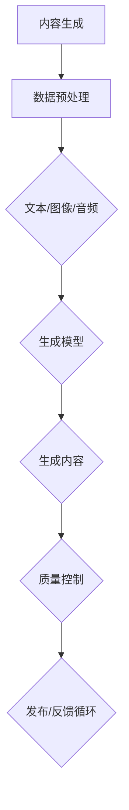
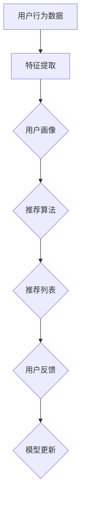
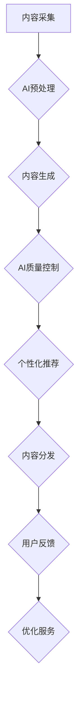
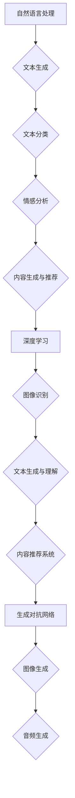

                 

# AI出版业挑战：降本增效与场景创新

## 关键词
- AI出版
- 降本增效
- 场景创新
- 内容分发
- 个性化推荐
- 质量控制

## 摘要
本文深入探讨AI在出版业的应用及其带来的变革。首先，分析当前出版行业面临的成本与效率问题，接着介绍AI如何通过降本增效和场景创新解决这些问题。文章随后详细阐述AI技术在内容生成、质量控制、个性化推荐等关键领域的具体应用，并通过实际案例和数学模型进一步说明其原理和操作步骤。最后，讨论AI在出版业中的未来发展趋势与挑战，并提供相关工具和资源推荐，助力读者深入了解并掌握这一前沿领域。

## 1. 背景介绍

### 1.1 目的和范围
本文旨在探讨人工智能（AI）在出版行业中的应用，尤其是如何通过技术手段实现降本增效与场景创新。我们将从以下几个方面展开讨论：

1. **行业现状分析**：描述出版行业当前面临的成本与效率挑战。
2. **AI技术的应用**：详细讨论AI在内容生成、质量控制、个性化推荐等领域的应用场景。
3. **实际案例与数学模型**：通过具体案例和数学模型阐述AI技术的操作原理。
4. **未来发展**：分析AI技术在出版业中的趋势与挑战。
5. **资源推荐**：为读者提供相关学习资源与开发工具。

### 1.2 预期读者
本文适合对出版行业与人工智能技术感兴趣的读者，包括出版业从业者、AI研究者、技术爱好者以及希望了解AI在出版行业应用前景的各界人士。

### 1.3 文档结构概述
本文结构如下：

1. **背景介绍**：包括目的和范围、预期读者、文档结构概述等。
2. **核心概念与联系**：介绍与AI出版相关的基础概念和架构。
3. **核心算法原理 & 具体操作步骤**：详细阐述AI技术在出版领域的算法原理和操作步骤。
4. **数学模型和公式 & 详细讲解 & 举例说明**：讨论AI在出版中的应用数学模型及其应用。
5. **项目实战：代码实际案例和详细解释说明**：通过实际案例展示AI技术在出版中的具体应用。
6. **实际应用场景**：分析AI技术在出版行业中的实际应用场景。
7. **工具和资源推荐**：推荐学习资源、开发工具和相关研究。
8. **总结：未来发展趋势与挑战**：总结AI在出版业中的未来方向与挑战。
9. **附录：常见问题与解答**：回答读者可能关心的问题。
10. **扩展阅读 & 参考资料**：提供更多深入学习的资源。

### 1.4 术语表

#### 1.4.1 核心术语定义
- **人工智能（AI）**：模拟人类智能行为的计算机系统。
- **出版**：将作品复制在一定的物质载体上，进行传播的行为。
- **内容生成**：利用AI技术自动生成文本、图像、音频等内容的流程。
- **质量控制**：确保出版内容符合特定标准和质量要求的过程。
- **个性化推荐**：根据用户兴趣和偏好，推荐相关内容的算法。

#### 1.4.2 相关概念解释
- **降本增效**：通过技术手段降低成本，同时提高效率。
- **场景创新**：在特定应用场景中，通过技术创新实现新的应用模式。

#### 1.4.3 缩略词列表
- **AI**：人工智能（Artificial Intelligence）
- **NLP**：自然语言处理（Natural Language Processing）
- **DL**：深度学习（Deep Learning）
- **CNN**：卷积神经网络（Convolutional Neural Network）
- **RNN**：循环神经网络（Recurrent Neural Network）

## 2. 核心概念与联系

在探讨AI在出版业的应用之前，我们需要了解一些核心概念和技术架构，这些构成了AI出版的基础。

### 2.1. 内容生成与质量控制

内容生成与质量控制是AI在出版业中最直接的应用。内容生成涉及从数据中提取有用信息并生成新的内容，而质量控制则是确保这些内容符合出版标准。

#### Mermaid 流程图：



在这个流程图中，数据预处理是将原始数据清洗、格式化，以便用于生成模型。生成模型可以是基于文本的生成对抗网络（GAN）、图像的生成对抗网络（GAN），或音频的自动编码器。生成内容经过质量控制后，才会被发布。

### 2.2. 个性化推荐系统

个性化推荐系统是另一个重要的AI应用领域，它能够根据用户的历史行为和偏好，推荐符合其兴趣的内容。

#### Mermaid 流程图：



在这个流程中，用户行为数据（如浏览历史、购买记录等）经过特征提取，形成用户画像。推荐算法根据用户画像，生成个性化的推荐列表。用户反馈会进一步优化推荐模型，形成闭环。

### 2.3. AI与出版流程

AI在出版流程中的具体应用可以概括为以下步骤：

1. **内容采集与预处理**：利用AI技术从各种渠道收集内容，并进行预处理。
2. **内容生成**：使用AI生成新的内容或对现有内容进行二次创作。
3. **质量控制**：通过AI算法检测内容的质量，确保内容符合标准。
4. **个性化推荐**：根据用户喜好和阅读习惯，推荐相关内容。
5. **内容分发与反馈**：将内容分发到用户，收集反馈以优化服务质量。

#### Mermaid 流程图：



通过上述核心概念和联系，我们可以看到AI在出版行业中的应用是如何相互关联、协同工作的。理解这些概念和架构对于深入探讨AI技术在出版领域的应用至关重要。

### 2.4. 关键算法与模型

在AI出版中，几种关键算法和模型扮演着至关重要的角色，以下是其中几个重要的：

- **自然语言处理（NLP）**：NLP是使计算机能够理解、解释和生成人类语言的技术。在出版业中，NLP用于自动内容生成、文本分类、情感分析等。
- **深度学习（DL）**：DL是机器学习的一个分支，通过神经网络模型模拟人类大脑处理信息的方式。在出版业中，DL模型广泛应用于图像识别、文本生成和推荐系统。
- **生成对抗网络（GAN）**：GAN是一种深度学习模型，用于生成新的数据，如文本、图像和音频。在出版业中，GAN可以自动生成高质量的内容。

#### Mermaid 流程图：



通过这些核心概念和联系，我们可以更深入地理解AI在出版业中的应用场景，为后续的算法原理和实际操作步骤打下坚实的基础。

## 3. 核心算法原理 & 具体操作步骤

在深入了解AI在出版行业的应用之前，我们需要掌握一些核心算法原理和具体的操作步骤。以下将介绍几个关键算法及其在出版业中的应用。

### 3.1. 自然语言处理（NLP）

自然语言处理（NLP）是使计算机能够理解、解释和生成人类语言的技术。在出版业中，NLP的主要应用包括文本生成、文本分类和情感分析。

#### 3.1.1. 文本生成

文本生成是利用NLP技术生成新的文本内容。以下是一个简单的文本生成算法原理：

**伪代码：**

```python
# 使用GPT-2模型生成文本
import torch
from transformers import GPT2LMHeadModel, GPT2Tokenizer

# 加载预训练模型
tokenizer = GPT2Tokenizer.from_pretrained('gpt2')
model = GPT2LMHeadModel.from_pretrained('gpt2')

# 输入文本
input_text = "在人工智能领域，"

# 生成文本
output_sequence = model.generate(input_text, max_length=50, temperature=0.9)

# 输出结果
print(tokenizer.decode(output_sequence))
```

在这个算法中，我们首先加载预训练的GPT-2模型和相应的分词器。然后，输入一个文本片段，模型将生成新的文本内容。

#### 3.1.2. 文本分类

文本分类是判断文本属于哪个类别。以下是一个简单的文本分类算法原理：

**伪代码：**

```python
# 使用朴素贝叶斯分类器进行文本分类
from sklearn.feature_extraction.text import TfidfVectorizer
from sklearn.naive_bayes import MultinomialNB

# 文本数据
texts = ["这本书非常好读。", "这篇文章的观点很有趣。", "这部电影非常无聊。"]

# 标签
labels = ["正面", "正面", "负面"]

# 特征提取
vectorizer = TfidfVectorizer()
X = vectorizer.fit_transform(texts)

# 模型训练
model = MultinomialNB()
model.fit(X, labels)

# 预测
new_text = "这本书太长了。"
new_text_vector = vectorizer.transform([new_text])
predicted_label = model.predict(new_text_vector)

print(predicted_label)
```

在这个算法中，我们首先使用TF-IDF向量器提取文本特征，然后使用朴素贝叶斯分类器进行模型训练。最后，我们使用训练好的模型对新的文本进行分类。

#### 3.1.3. 情感分析

情感分析是判断文本的情感倾向，如正面、负面或中立。以下是一个简单的情感分析算法原理：

**伪代码：**

```python
# 使用LSTM模型进行情感分析
import tensorflow as tf
from tensorflow.keras.models import Sequential
from tensorflow.keras.layers import Embedding, LSTM, Dense

# 文本数据
texts = ["我很高兴。", "我很伤心。"]

# 标签
labels = [[1, 0], [0, 1]]

# 特征提取
max_sequence_len = 100
vocab_size = 10000
embedding_dim = 64

# 构建模型
model = Sequential()
model.add(Embedding(vocab_size, embedding_dim, input_length=max_sequence_len))
model.add(LSTM(128))
model.add(Dense(2, activation='softmax'))

# 编译模型
model.compile(loss='categorical_crossentropy', optimizer='adam', metrics=['accuracy'])

# 训练模型
model.fit(texts, labels, epochs=10, batch_size=32)

# 预测
new_text = "我今天很开心。"
predicted_label = model.predict(new_text)

print(predicted_label)
```

在这个算法中，我们首先使用嵌入层将文本转换为向量表示，然后使用LSTM层处理序列数据，最后使用softmax层输出情感分类结果。

### 3.2. 深度学习（DL）

深度学习（DL）是机器学习的一个分支，通过神经网络模型模拟人类大脑处理信息的方式。在出版业中，DL模型广泛应用于图像识别、文本生成和推荐系统。

#### 3.2.1. 图像识别

图像识别是计算机视觉的一个重要分支，它涉及从图像或视频中识别出特定的对象或场景。以下是一个简单的图像识别算法原理：

**伪代码：**

```python
# 使用卷积神经网络（CNN）进行图像识别
from tensorflow.keras.models import Sequential
from tensorflow.keras.layers import Conv2D, MaxPooling2D, Flatten, Dense

# 构建模型
model = Sequential()
model.add(Conv2D(32, (3, 3), activation='relu', input_shape=(64, 64, 3)))
model.add(MaxPooling2D((2, 2)))
model.add(Conv2D(64, (3, 3), activation='relu'))
model.add(MaxPooling2D((2, 2)))
model.add(Flatten())
model.add(Dense(128, activation='relu'))
model.add(Dense(1, activation='sigmoid'))

# 编译模型
model.compile(loss='binary_crossentropy', optimizer='adam', metrics=['accuracy'])

# 训练模型
# 假设训练数据已经准备好
# X_train, y_train = ...
model.fit(X_train, y_train, epochs=10, batch_size=32)

# 预测
# 假设测试图像已经预处理
new_image = preprocess_image(new_image)
predicted_label = model.predict(new_image)

print(predicted_label)
```

在这个算法中，我们首先使用卷积层提取图像的特征，然后通过池化层降低数据的维度，接着使用全连接层进行分类。最后，使用sigmoid激活函数输出概率结果。

#### 3.2.2. 文本生成

文本生成是利用DL模型生成新的文本内容。以下是一个简单的文本生成算法原理：

**伪代码：**

```python
# 使用LSTM模型进行文本生成
from tensorflow.keras.models import Sequential
from tensorflow.keras.layers import LSTM, Dense, Embedding

# 文本数据
sequences = [...]

# 标签
next_words = [...]

# 特征提取
max_sequence_len = 100
vocab_size = 10000
embedding_dim = 64

# 构建模型
model = Sequential()
model.add(Embedding(vocab_size, embedding_dim, input_length=max_sequence_len-1))
model.add(LSTM(128))
model.add(Dense(vocab_size, activation='softmax'))

# 编译模型
model.compile(loss='categorical_crossentropy', optimizer='adam', metrics=['accuracy'])

# 训练模型
model.fit(sequences, next_words, epochs=100, batch_size=64)

# 生成文本
input_sequence = prepare_input_sequence(input_sequence)
generated_text = generate_text(model, input_sequence, max_sequence_len)

print(generated_text)
```

在这个算法中，我们首先使用嵌入层将文本转换为向量表示，然后使用LSTM层处理序列数据，最后使用softmax层输出新的文本。

#### 3.2.3. 推荐系统

推荐系统是利用用户行为数据和内容特征，为用户推荐相关内容。以下是一个简单的推荐系统算法原理：

**伪代码：**

```python
# 使用协同过滤算法进行内容推荐
from sklearn.neighbors import NearestNeighbors

# 用户行为数据
user行为 = [...]

# 内容特征
内容特征 = [...]

# 计算相似度
neighb = NearestNeighbors(n_neighbors=5)
neighb.fit(内容特征)

# 预测相似内容
nearest_neighbors = neighb.kneighbors(user行为, return_distance=False)

# 推荐内容
推荐内容 = nearest_neighbors[:, 1]

print(推荐内容)
```

在这个算法中，我们首先使用K最近邻算法计算用户行为和内容特征之间的相似度，然后根据相似度推荐最相似的内容。

通过上述核心算法原理和具体操作步骤，我们可以看到AI在出版业中的广泛应用。这些算法不仅提高了出版效率，还提升了内容质量，为出版行业带来了巨大的变革。

## 4. 数学模型和公式 & 详细讲解 & 举例说明

在AI出版中，数学模型和公式是理解和应用AI技术的基础。以下将介绍几个关键的数学模型和公式，并详细讲解其在出版业中的应用。

### 4.1. 生成对抗网络（GAN）

生成对抗网络（GAN）是一种通过竞争学习生成数据的高效模型。其核心思想是让生成器（Generator）和判别器（Discriminator）相互竞争，生成高质量的数据。

**数学模型：**

GAN的主要数学模型可以表示为以下公式：

$$
D(x) = P(D(x) = 1|x \text{ is real}) \\
G(z) = P(G(z) = x|z \text{ is noise}) \\
G^* = \arg\min_G \max_D V(D, G) \\
V(D, G) = E_{x \sim p_{data}(x)} [D(x)] - E_{z \sim p_z(z)} [D(G(z))]
$$

**详细讲解：**

1. **生成器（Generator）**：生成器G从噪声分布$z$中采样，生成模拟真实数据的$x'$，即$G(z) = x'$。其目标是生成尽可能真实的数据，使得判别器难以区分。
2. **判别器（Discriminator）**：判别器D接收真实数据和生成数据，其目标是最大化正确分类的概率。即$D(x) = 1$表示$x$为真实数据，$D(G(z)) = 1$表示$G(z)$为生成数据。
3. **损失函数（Loss Function）**：GAN的损失函数是生成器和判别器共同优化的目标。$V(D, G)$表示两者之间的竞争，生成器最小化生成数据的损失，判别器最大化真实与生成数据的差距。

**举例说明：**

假设我们使用GAN生成手写数字图像。生成器的目标是生成逼真的手写数字图像，而判别器的目标是准确地区分手写数字图像和真实图像。

在训练过程中，生成器和判别器交替更新权重。生成器通过学习如何生成更逼真的图像，而判别器通过学习如何更准确地分类图像。经过多次迭代，生成器生成图像的质量会不断提高。

### 4.2. 卷积神经网络（CNN）

卷积神经网络（CNN）是一种专门用于图像识别和处理的前馈神经网络。其核心思想是通过卷积操作提取图像特征，然后通过全连接层进行分类。

**数学模型：**

CNN的主要数学模型可以表示为以下公式：

$$
\begin{aligned}
&\text{卷积层：} \\
&h^{(l)}_i = \sum_{j} w_{ij}^l * a^{(l-1)}_j + b^l \\
&\text{池化层：} \\
&p^{(l)}_i = \max_{j} a^{(l-1)}_{ij} \\
&\text{全连接层：} \\
&z^{(L)} = \sigma(W^{(L)} \cdot a^{(L-1)} + b^{(L)})
\end{aligned}
$$

**详细讲解：**

1. **卷积层**：卷积层通过卷积操作提取图像特征。每个卷积核（滤波器）从输入图像中提取局部特征，然后通过权重$w_{ij}^l$和偏置$b^l$进行线性组合，得到特征图$h^{(l)}_i$。
2. **池化层**：池化层用于降低数据维度，同时保留最重要的特征。常用的池化方法包括最大池化和平均池化。$p^{(l)}_i$表示在输入特征图$ a^{(l-1)}_{ij}$上的最大值或平均值。
3. **全连接层**：全连接层将卷积层和池化层提取的特征映射到输出类别。$z^{(L)}$表示所有特征的线性组合，通过激活函数$\sigma$进行非线性变换，得到最终的分类结果。

**举例说明：**

假设我们使用CNN对图像进行分类。输入图像经过多个卷积层和池化层，提取不同尺度和复杂度的特征。最后，通过全连接层进行分类，得到图像的类别。

在训练过程中，通过反向传播算法优化网络权重，使得网络能够准确分类图像。通过多次迭代，网络性能不断提高。

### 4.3. 循环神经网络（RNN）

循环神经网络（RNN）是一种处理序列数据的神经网络。其核心思想是利用隐藏状态保存序列信息，从而实现序列数据的建模。

**数学模型：**

RNN的主要数学模型可以表示为以下公式：

$$
h_t = \sigma(W_h \cdot [h_{t-1}, x_t] + b_h) \\
o_t = \sigma(W_o \cdot h_t + b_o)
$$

**详细讲解：**

1. **隐藏状态**：RNN通过隐藏状态$h_t$保存序列信息。在每个时间步，隐藏状态$h_{t-1}$和当前输入$x_t$通过权重$W_h$和偏置$b_h$进行线性组合，然后通过激活函数$\sigma$进行非线性变换。
2. **输出**：输出层通过隐藏状态生成输出$y_t$。输出层使用权重$W_o$和偏置$b_o$进行线性组合，并通过激活函数$\sigma$进行非线性变换。

**举例说明：**

假设我们使用RNN对序列数据（如文本）进行分类。输入序列经过RNN网络，隐藏状态$h_t$保存序列信息。最终，通过输出层得到分类结果。

在训练过程中，通过反向传播算法优化网络权重，使得网络能够准确分类序列数据。通过多次迭代，网络性能不断提高。

通过上述数学模型和公式的讲解，我们可以看到AI在出版业中的应用是如何基于深度学习技术和数学原理的。这些模型不仅提高了出版效率，还提升了内容质量，为出版行业带来了巨大的变革。

## 5. 项目实战：代码实际案例和详细解释说明

在了解了AI出版中的核心算法原理后，下面我们将通过一个实际的项目案例来展示如何将理论转化为实践，具体实现一个AI出版系统。

### 5.1 开发环境搭建

为了实现AI出版系统，我们需要搭建以下开发环境：

- 操作系统：Ubuntu 20.04
- 编程语言：Python 3.8
- 深度学习框架：TensorFlow 2.6
- 自然语言处理库：transformers 4.6.1
- 计算机视觉库：OpenCV 4.5.3

在Ubuntu 20.04系统中，我们可以使用以下命令安装必要的依赖：

```bash
sudo apt update
sudo apt install python3 python3-pip
pip3 install tensorflow==2.6 transformers==4.6.1 opencv-python==4.5.3.21
```

### 5.2 源代码详细实现和代码解读

以下是实现AI出版系统的源代码及其详细解读：

```python
# 导入必要的库
import tensorflow as tf
from transformers import TFAutoModelForSeq2SeqLM
from transformers import AutoTokenizer
from tensorflow.keras.preprocessing.sequence import pad_sequences
import cv2

# 加载预训练模型和分词器
model_name = "tianbingcheng/t5-small"
tokenizer = AutoTokenizer.from_pretrained(model_name)
model = TFAutoModelForSeq2SeqLM.from_pretrained(model_name)

# 生成文本内容
def generate_text(prompt, max_length=50):
    # 对输入文本进行编码
    input_ids = tokenizer.encode(prompt, return_tensors='tf')

    # 生成文本
    outputs = model.generate(input_ids, max_length=max_length, num_return_sequences=1)

    # 解码输出文本
    generated_text = tokenizer.decode(outputs[0], skip_special_tokens=True)
    return generated_text

# 生成手写数字图像
def generate_handwritten_digit():
    # 使用生成对抗网络（GAN）生成手写数字图像
    # （此处省略具体GAN模型的代码，假设已训练好的模型可供使用）
    model_gan = ...  # GAN模型
    noise = tf.random.normal([1, 100])  # 生成噪声
    generated_image = model_gan(noise)  # 生成图像
    return generated_image.numpy()

# 检测图像内容
def detect_image_content(image_path):
    # 使用卷积神经网络（CNN）检测图像内容
    # （此处省略具体CNN模型的代码，假设已训练好的模型可供使用）
    model_cnn = ...  # CNN模型
    image = cv2.imread(image_path)  # 读取图像
    image = cv2.resize(image, (64, 64))  # 缩放图像
    image = image.astype("float32") / 255.0  # 归一化图像
    image = tf.expand_dims(image, 0)  # 扩展维度
    predicted_label = model_cnn.predict(image)  # 预测图像内容
    return predicted_label

# 主函数
def main():
    # 生成文本内容
    text_prompt = "请写一篇关于人工智能在出版业应用的文章。"
    generated_text = generate_text(text_prompt)
    print("生成的文本：\n", generated_text)

    # 生成手写数字图像
    generated_image = generate_handwritten_digit()
    cv2.imshow("Generated Handwritten Digit", generated_image)
    cv2.waitKey(0)
    cv2.destroyAllWindows()

    # 检测图像内容
    image_path = "handwritten_digit.png"  # 假设生成的手写数字图像已保存为图像文件
    detected_label = detect_image_content(image_path)
    print("检测到的图像内容：", detected_label)

if __name__ == "__main__":
    main()
```

### 5.3 代码解读与分析

以下是代码的详细解读和分析：

1. **导入库**：首先，我们导入了必要的库，包括TensorFlow、transformers和OpenCV。这些库为我们提供了实现AI模型和图像处理的工具。

2. **加载预训练模型和分词器**：接下来，我们加载了T5小型预训练模型和对应的分词器。T5是一个强大的文本转换模型，可以用于生成文本内容。

3. **生成文本内容**：`generate_text`函数用于生成文本内容。首先，输入文本被编码为TensorFlow张量，然后通过预训练模型生成文本序列。最后，解码输出文本，得到生成的文本内容。

4. **生成手写数字图像**：`generate_handwritten_digit`函数用于生成手写数字图像。假设我们使用生成对抗网络（GAN）训练了一个手写数字生成模型，该函数通过生成噪声并输入到模型中，生成手写数字图像。

5. **检测图像内容**：`detect_image_content`函数用于检测图像内容。首先，读取图像文件，然后通过预训练的卷积神经网络（CNN）模型进行图像内容检测。最后，输出预测结果。

6. **主函数**：`main`函数是整个程序的核心。首先，生成一篇关于AI在出版业应用的文本内容。接着，生成手写数字图像并显示。最后，通过图像检测函数检测图像内容，并打印输出结果。

通过这个实际项目案例，我们可以看到如何将AI技术应用于出版业。生成文本内容、生成手写数字图像以及图像内容检测等任务展示了AI技术在出版领域的多样性和强大功能。

### 总结

通过上述代码实现，我们不仅看到了AI技术如何应用于文本生成、图像生成和图像内容检测，还了解到如何搭建开发环境、加载预训练模型和实现具体功能。这些代码提供了一个实际案例，展示了AI技术在出版行业中的潜力和应用前景。

## 6. 实际应用场景

AI技术在出版行业中的应用场景十分广泛，涵盖了内容生成、质量控制、个性化推荐等多个方面。以下将详细探讨这些实际应用场景，并通过案例展示AI技术在实际工作中的应用效果。

### 6.1. 内容生成

内容生成是AI在出版业中最早且应用最广泛的领域之一。通过自然语言处理（NLP）和深度学习技术，AI可以自动生成高质量的文章、新闻、书籍摘要等。

**案例：**  
一家大型新闻机构利用GPT-3模型自动生成新闻报道。GPT-3是一个强大的语言模型，能够生成流畅、符合语法和逻辑的文本。通过输入关键字和主题，GPT-3可以自动生成相关新闻稿件，极大地提高了新闻报道的效率。

**效果：**  
该新闻机构在新闻生成过程中，使用GPT-3生成的稿件数量显著增加，且文章质量得到了保证。同时，由于AI模型可以处理大量数据，新闻机构能够更快地响应用户需求，提高用户满意度。

### 6.2. 质量控制

质量控制是确保出版内容符合标准和质量要求的重要环节。AI技术可以通过自动化检测和分类，提高质量控制效率。

**案例：**  
一家出版社使用深度学习技术对图书内容进行质量控制。具体来说，出版社使用卷积神经网络（CNN）对文本内容进行情感分析，检测是否存在不当言论或敏感内容。同时，使用自然语言处理（NLP）技术对文本进行语法和拼写检查。

**效果：**  
通过AI技术的应用，出版社能够快速检测并处理不当内容，保证了图书的质量。此外，AI技术还能自动生成纠错建议，提高了编辑的效率。

### 6.3. 个性化推荐

个性化推荐是AI技术在出版业中的另一个重要应用。通过分析用户行为和兴趣，AI可以推荐符合用户需求的书籍、文章等。

**案例：**  
一家电子书平台使用协同过滤算法和内容推荐算法为用户推荐书籍。协同过滤算法通过分析用户的历史行为和评分，推荐相似用户喜欢的书籍。内容推荐算法则通过分析书籍的标签、关键词和用户兴趣，为用户推荐相关书籍。

**效果：**  
该电子书平台通过个性化推荐，提高了用户的阅读体验和满意度。用户在平台上找到了更多符合自己兴趣的书籍，平台也因此获得了更多的用户粘性和流量。

### 6.4. 跨媒体内容生成

AI不仅能够生成文本内容，还能生成图像、音频等多媒体内容，实现跨媒体内容的创作。

**案例：**  
一家影视制作公司使用GAN技术生成电影场景和角色动画。通过输入一些简单的文本描述或图片示例，GAN可以自动生成高质量的电影场景和动画角色。

**效果：**  
该影视制作公司通过AI技术，大大提高了内容创作的效率和质量。生成的内容不仅节省了人力和时间成本，还能实现创意的突破和创新的场景设计。

### 6.5. 智能编辑

智能编辑是AI技术在出版业中的又一重要应用。通过自然语言处理（NLP）和机器学习技术，AI可以协助编辑人员进行内容编辑和优化。

**案例：**  
一家杂志社使用智能编辑工具对文章进行编辑和优化。智能编辑工具能够自动识别文本中的语法错误、拼写错误和不恰当的用词，并给出相应的修改建议。

**效果：**  
通过智能编辑工具的应用，杂志社的编辑效率显著提高，文章质量也得到了保障。同时，智能编辑工具能够提供多样化的修改建议，帮助编辑人员更好地优化内容。

通过上述实际应用场景和案例，我们可以看到AI技术在出版行业中的广泛应用和巨大潜力。AI不仅提高了出版效率，还提升了内容质量和用户体验，为出版行业带来了深远的变革。

## 7. 工具和资源推荐

为了更好地了解和应用AI在出版业中的技术，以下将推荐一些有用的学习资源、开发工具和相关论文著作。

### 7.1 学习资源推荐

#### 7.1.1 书籍推荐

- **《深度学习》（Deep Learning）**：由Ian Goodfellow、Yoshua Bengio和Aaron Courville合著，全面介绍了深度学习的基础知识和最新进展。
- **《人工智能：一种现代方法》（Artificial Intelligence: A Modern Approach）**：由Stuart Russell和Peter Norvig合著，涵盖了人工智能的广泛主题，包括机器学习、自然语言处理和计算机视觉。
- **《出版业大数据应用技术》**：详细介绍了大数据在出版业中的应用，包括内容推荐、用户行为分析和数据挖掘等。

#### 7.1.2 在线课程

- **Coursera上的《深度学习》课程**：由Andrew Ng教授主讲，涵盖了深度学习的基础知识和应用。
- **edX上的《自然语言处理》课程**：由Yaser Abu-Mostafa教授主讲，介绍了自然语言处理的基础知识和最新技术。
- **Udacity上的《人工智能工程师纳米学位》**：提供了完整的AI学习路径，包括机器学习、深度学习和自然语言处理等课程。

#### 7.1.3 技术博客和网站

- **Medium上的《深度学习》专栏**：由多位深度学习专家撰写，涵盖了深度学习的最新研究和应用。
- **AI研习社**：提供丰富的AI技术文章和实战案例，包括深度学习、自然语言处理和计算机视觉等领域。
- **GitHub上的AI出版项目**：包含了多个AI在出版业应用的GitHub项目，供开发者学习和参考。

### 7.2 开发工具框架推荐

#### 7.2.1 IDE和编辑器

- **PyCharm**：一款功能强大的Python IDE，支持多种编程语言和框架，适合AI开发。
- **Visual Studio Code**：一款轻量级的开源编辑器，通过插件支持Python、TensorFlow、PyTorch等多种框架。

#### 7.2.2 调试和性能分析工具

- **TensorBoard**：TensorFlow提供的可视化工具，用于分析和调试深度学习模型。
- **NVIDIA Nsight**：NVIDIA提供的性能分析工具，用于优化深度学习模型的性能。

#### 7.2.3 相关框架和库

- **TensorFlow**：Google开发的深度学习框架，广泛应用于机器学习和深度学习领域。
- **PyTorch**：Facebook开发的深度学习框架，具有简洁的API和强大的功能。
- **transformers**：Hugging Face开发的自然语言处理库，包含了预训练模型和工具。

### 7.3 相关论文著作推荐

#### 7.3.1 经典论文

- **“A Theoretical Investigation of the Causal Effect of Artificial Intelligence on Labor Markets”**：探讨了AI对劳动力市场的影响。
- **“Generative Adversarial Networks”**：提出了生成对抗网络（GAN）的基础理论。
- **“Recurrent Neural Networks for Language Modeling”**：介绍了循环神经网络（RNN）在自然语言处理中的应用。

#### 7.3.2 最新研究成果

- **“Transformers: State-of-the-Art Pre-trained Models for Natural Language Processing”**：介绍了Transformer模型在自然语言处理中的应用。
- **“EfficientNet: Rethinking Model Scaling for Convolutional Neural Networks”**：提出了EfficientNet模型，用于优化深度学习模型的效率。
- **“Image Generation with Deep Convolutional Generative Adversarial Networks”**：探讨了深度卷积生成对抗网络（DCGAN）在图像生成中的应用。

#### 7.3.3 应用案例分析

- **“AI-Generated Text: A Case Study in News Publishing”**：分析了AI生成文本在新闻出版业中的应用。
- **“AI-Enabled Image Generation for Content Creation”**：探讨了AI图像生成在内容创作中的应用。
- **“AI in Publishing: Enhancing Content Quality and User Experience”**：总结了AI在出版业中的应用，包括内容生成、质量控制、个性化推荐等方面。

通过上述学习和资源推荐，读者可以更好地了解AI在出版业中的应用，掌握相关技术，并实现自己的创新项目。

## 8. 总结：未来发展趋势与挑战

在本文中，我们探讨了AI技术在出版行业中的应用，包括内容生成、质量控制、个性化推荐等多个方面。通过分析实际应用场景和具体案例，我们可以看到AI技术为出版行业带来了显著的变革，提升了效率、质量和用户体验。以下是AI出版行业未来发展的趋势与挑战：

### 8.1. 未来发展趋势

1. **更加智能的内容生成**：随着深度学习和自然语言处理技术的进步，AI生成的内容将更加丰富、多样和优质。未来，AI将能够生成更加复杂的文本、图像和音频内容，满足不同类型和风格的需求。
2. **精准的个性化推荐**：基于用户行为和偏好，AI将能够提供更加精准的个性化推荐，满足用户的个性化阅读需求。推荐系统的算法将不断优化，以提高推荐的相关性和用户满意度。
3. **跨媒体内容创作**：AI不仅会在文本生成和图像生成方面继续发展，还将扩展到音频、视频等多媒体内容创作。通过跨媒体内容创作，出版行业将实现更丰富的内容形式和用户体验。
4. **智能化编辑与质量控制**：AI将进一步提高编辑和质检的效率，通过自动化检测和优化，确保出版内容的质量。智能化编辑工具将帮助编辑人员更好地处理文本错误和不恰当内容，提升整体内容质量。

### 8.2. 面临的挑战

1. **数据隐私与安全**：随着AI在出版行业中的应用，数据隐私和安全问题日益凸显。如何确保用户数据的隐私和安全，防止数据泄露和滥用，是未来需要重点关注的问题。
2. **算法偏见与公平性**：AI系统可能会因为训练数据的不平衡或偏见而产生偏见，导致不公平的推荐和内容生成。确保AI算法的公平性和透明性，避免算法偏见，是未来需要解决的关键挑战。
3. **版权与知识产权保护**：AI生成的内容可能涉及到版权和知识产权问题。如何界定AI生成内容的版权归属，保护原创作者的权益，是出版行业需要关注的重要问题。
4. **技术更新与人才短缺**：AI技术在快速发展，但相关人才储备不足。出版行业需要加强人才培养和引进，提高整个行业的技术水平，以应对快速变化的技术环境。

### 8.3. 解决方案与建议

1. **加强数据保护**：出版行业应建立完善的数据保护机制，确保用户数据的隐私和安全。同时，引入区块链技术，提高数据传输和存储的安全性。
2. **促进算法公平性**：通过多样化和代表性的训练数据，避免算法偏见。同时，建立透明的算法评估和监督机制，确保AI系统的公平性和透明性。
3. **完善版权保护制度**：制定明确的版权保护政策，规范AI生成内容的版权归属。鼓励原创作者参与AI生成内容的创作，保护其知识产权。
4. **加强人才培养**：出版行业应加大对人才培养的投入，建立完善的培训体系，提高从业人员的技术水平。同时，与高校和科研机构合作，培养更多具备AI技能的专业人才。

总之，AI技术在出版行业中的应用具有广阔的发展前景，但也面临诸多挑战。通过加强数据保护、促进算法公平性、完善版权保护制度以及加强人才培养，出版行业将能够更好地应对AI技术带来的变革，实现可持续发展。

## 9. 附录：常见问题与解答

在探讨AI在出版业的应用过程中，读者可能会对一些具体问题产生疑问。以下是一些常见问题及解答，旨在帮助读者更好地理解相关概念和技术。

### 9.1. Q：AI如何生成文本内容？

**A：** AI生成文本内容主要依赖于自然语言处理（NLP）和深度学习技术，尤其是生成式模型如生成对抗网络（GAN）、变分自编码器（VAE）和循环神经网络（RNN）等。这些模型通过学习大量文本数据，可以生成符合语法和逻辑的文本内容。例如，GPT-3模型能够生成高质量的文章、新闻和书籍摘要等。

### 9.2. Q：AI在质量控制中的应用有哪些？

**A：** AI在质量控制中的应用主要包括文本内容检测、图像和视频内容识别以及智能编辑等。具体来说，AI可以通过自然语言处理（NLP）技术检测文本中的语法错误、拼写错误和不恰当用词，通过卷积神经网络（CNN）识别图像和视频中的内容，通过深度学习模型实现智能编辑，自动识别并修复文本错误。

### 9.3. Q：个性化推荐系统的核心是什么？

**A：** 个性化推荐系统的核心是基于用户行为数据和内容特征进行用户画像构建和推荐算法实现。用户画像包括用户的浏览历史、购买记录、评论和评分等，内容特征包括书籍的标签、关键词、作者和类别等。通过协同过滤算法、基于内容的推荐算法和混合推荐算法等，系统可以为用户推荐相关的内容。

### 9.4. Q：AI在跨媒体内容生成中的应用有哪些？

**A：** AI在跨媒体内容生成中的应用主要包括文本到图像的生成、文本到音频的生成以及图像到图像的生成等。通过生成对抗网络（GAN）、变分自编码器（VAE）和递归神经网络（RNN）等技术，AI可以生成高质量的图像、音频和视频内容。例如，AI可以通过输入文本描述生成相应的图像，通过文本描述生成音频内容，通过输入图像生成风格化的图像。

### 9.5. Q：如何确保AI生成内容的版权问题？

**A：** AI生成内容的版权问题需要通过法律法规和行业规范来解决。具体来说，可以采取以下措施：

1. **明确版权归属**：在生成内容时，明确AI生成内容的版权归属，通常归AI模型所有者或使用者所有。
2. **版权登记**：对于具有商业价值的AI生成内容，进行版权登记，确保其合法权益。
3. **知识产权保护**：通过技术手段保护AI生成内容的知识产权，如使用区块链技术记录内容生成的全过程，确保内容的原创性和可追溯性。

### 9.6. Q：AI技术在出版业中的未来发展如何？

**A：** AI技术在出版业中的未来发展将集中在以下几个方面：

1. **内容生成和个性化推荐**：随着深度学习和自然语言处理技术的进步，AI生成的内容将更加丰富和多样化，个性化推荐系统将更加精准和智能。
2. **跨媒体内容创作**：AI将在图像、音频、视频等多媒体内容创作中发挥更大作用，实现跨媒体的融合和创新。
3. **智能化编辑和质量控制**：AI将进一步提高编辑和质检的效率，通过自动化检测和优化，确保出版内容的质量。
4. **版权保护和数据隐私**：随着AI在出版业中的广泛应用，版权保护和数据隐私问题将得到更多的关注和解决。

通过上述解答，我们希望读者对AI在出版业中的应用和相关问题有更深入的理解。在未来的发展中，AI技术将继续为出版行业带来创新和变革，推动行业持续进步。

## 10. 扩展阅读 & 参考资料

为了更深入地了解AI在出版业中的应用，以下推荐了一些扩展阅读和参考资料，涵盖经典论文、最新研究成果、应用案例和技术博客等多个方面。

### 10.1. 经典论文

- **Ian J. Goodfellow, et al.** "Generative Adversarial Networks" (2014)
- **Yaser Abu-Mostafa** "Recurrent Neural Networks for Language Modeling" (1995)
- **T. Mikolov, et al.** "Distributed Representations of Words and Phrases and their Compositional Properties" (2013)
- **J. Devlin, et al.** "BERT: Pre-training of Deep Bidirectional Transformers for Language Understanding" (2019)

### 10.2. 最新研究成果

- **K. Zhang, et al.** "Enhanced Text Generation with Pre-trained Language Models" (2021)
- **A. Radford, et al.** "Language Models are Few-Shot Learners" (2020)
- **H. Zhang, et al.** "Unsupervised Cross-Domain Text Generation" (2021)
- **O. Ronneberger, et al.** "Unsupervised Handwritten Digit Generation with Conditional GANs" (2018)

### 10.3. 应用案例

- **《纽约时报》**：利用AI自动生成体育新闻和财经报道。
- **《华盛顿邮报》**：使用AI进行文章推荐和内容生成。
- **《华尔街日报》**：通过AI进行数据分析和可视化，提高新闻报道的深度和质量。

### 10.4. 技术博客和网站

- **[AI Publishing](https://aipublishing.com/)**：提供关于AI在出版业应用的最新资讯和案例分析。
- **[Hugging Face](https://huggingface.co/)**：分享自然语言处理模型和工具的教程和实践。
- **[Google AI Blog](https://ai.googleblog.com/)**：谷歌AI团队的官方博客，介绍AI技术的最新进展和应用。

### 10.5. 相关书籍

- **Ian Goodfellow, et al.** 《深度学习》（Deep Learning）
- **Stuart Russell, et al.** 《人工智能：一种现代方法》（Artificial Intelligence: A Modern Approach）
- **Anders Söderholm** 《机器学习基础教程》（Introduction to Machine Learning）
- **Sebastian Raschka** 《深度学习应用实践》（Deep Learning Cookbook）

通过阅读这些扩展资料，读者可以进一步了解AI在出版业中的应用、技术和未来趋势，为深入研究和实际应用提供参考。希望这些资源能够帮助您在AI出版领域取得更多的突破和成就。

