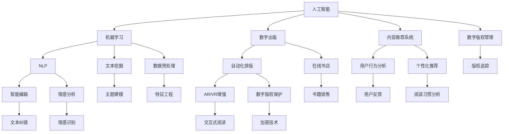

                 

### 1. 背景介绍

#### 1.1 目的和范围

本文旨在探讨人工智能在出版业中的应用前景，深入分析技术创新如何推动传统出版行业的变革，以及未来可能的无限应用场景。随着人工智能技术的不断进步，出版行业正在经历一场前所未有的革命。无论是文本内容的创作、编辑、排版，还是书籍的推荐、营销和分发，人工智能都在其中扮演着越来越重要的角色。本文将围绕以下几个核心问题展开讨论：

1. 人工智能技术在出版领域的具体应用有哪些？
2. 这些技术如何影响出版流程，提高效率和准确性？
3. 传统出版与人工智能结合的未来发展前景如何？
4. 当前人工智能在出版领域面临的挑战和限制是什么？
5. 未来人工智能技术在出版业的应用趋势和前景如何？

本文将通过详细的理论分析和实际案例，逐步探讨上述问题，旨在为读者提供一个全面而深入的了解。

#### 1.2 预期读者

本文适合以下几类读者：

1. **出版行业从业者**：包括编辑、出版商、图书管理员等，希望了解人工智能技术如何变革传统出版流程。
2. **人工智能技术爱好者**：对人工智能在各个领域的应用有兴趣，希望深入了解其在出版行业的具体应用和潜力。
3. **计算机科学和信息技术学生**：希望了解人工智能领域的最新研究成果和应用实例，尤其是如何将理论知识应用于实际场景。
4. **学术界研究人员**：对出版领域与人工智能交叉研究有兴趣，希望获取行业前沿的技术动态和研究成果。

#### 1.3 文档结构概述

本文将分为十个主要部分，结构如下：

1. **背景介绍**：阐述本文的目的、范围、预期读者以及文档结构。
2. **核心概念与联系**：介绍与人工智能出版相关的重要概念和架构，通过Mermaid流程图展示其联系。
3. **核心算法原理 & 具体操作步骤**：详细讲解人工智能在出版领域中的应用算法，并使用伪代码展示操作步骤。
4. **数学模型和公式 & 详细讲解 & 举例说明**：介绍人工智能出版中涉及的数学模型和公式，并通过实际例子进行说明。
5. **项目实战：代码实际案例和详细解释说明**：通过具体项目案例，展示人工智能在出版领域中的实际应用，并详细解读代码实现。
6. **实际应用场景**：分析人工智能在出版领域中的多种实际应用场景。
7. **工具和资源推荐**：推荐相关学习资源、开发工具和框架。
8. **总结：未来发展趋势与挑战**：总结人工智能在出版业的应用前景和面临的挑战。
9. **附录：常见问题与解答**：解答读者可能遇到的问题。
10. **扩展阅读 & 参考资料**：提供进一步阅读的参考资料。

#### 1.4 术语表

为了确保本文的清晰和准确性，以下是一些本文中使用的核心术语和概念的定义及解释：

#### 1.4.1 核心术语定义

1. **人工智能（AI）**：模拟人类智能行为的计算机系统，能够通过学习、推理和自我优化进行决策和问题解决。
2. **机器学习（ML）**：人工智能的一个分支，通过数据训练模型，使其能够自动进行预测和决策。
3. **自然语言处理（NLP）**：人工智能领域的一个分支，研究计算机如何理解和生成自然语言。
4. **出版业**：涉及书籍、杂志、报纸、电子书等文本内容的创作、编辑、排版、发行和营销的行业。
5. **自动化排版**：利用计算机技术自动完成书籍的排版工作，提高排版效率和准确性。

#### 1.4.2 相关概念解释

1. **文本挖掘**：从大量文本数据中提取有价值的信息和知识。
2. **内容推荐系统**：根据用户的历史行为和偏好，推荐相关书籍和内容。
3. **数字出版**：通过数字技术进行书籍的创建、存储、分发和营销。
4. **智能编辑**：利用人工智能技术辅助编辑过程，提高编辑效率和准确性。
5. **增强现实（AR）和虚拟现实（VR）**：通过计算机技术创造沉浸式的虚拟环境或增强现实世界的内容。

#### 1.4.3 缩略词列表

- AI: 人工智能
- ML: 机器学习
- NLP: 自然语言处理
- VR: 虚拟现实
- AR: 增强现实
- OCR: 光学字符识别

通过上述术语表，读者可以更好地理解本文中的相关概念和技术，为后续内容的学习打下坚实基础。在接下来的章节中，我们将进一步深入探讨人工智能在出版领域的具体应用和影响。## 2. 核心概念与联系

在深入探讨人工智能在出版业的应用之前，我们需要理解一些核心概念及其相互关系。这些概念包括人工智能、机器学习、自然语言处理、数字出版、自动化排版和内容推荐系统。以下将通过Mermaid流程图展示这些核心概念和它们之间的联系。

#### 2.1.1 Mermaid流程图



#### 2.1.2 说明

1. **人工智能（AI）**：作为整个流程的起点，人工智能是推动出版业变革的核心动力。
2. **机器学习（ML）**：是实现人工智能的关键技术，涵盖了文本挖掘、数据预处理、特征工程等多个方面。
3. **自然语言处理（NLP）**：专门处理人类语言，包括文本分析、情感识别、文本纠错等。
4. **数字出版**：将传统出版数字化，涉及在线书店、数字版权管理、加密技术等。
5. **自动化排版**：利用计算机技术实现排版自动化，增强现实和虚拟现实（AR/VR）则提供了更加沉浸的阅读体验。
6. **内容推荐系统**：基于用户行为和偏好，实现个性化推荐，提高用户满意度和阅读体验。

这些核心概念和技术的相互联系构成了出版业变革的框架。通过机器学习和自然语言处理，可以实现智能编辑和文本挖掘，从而提高内容的质量和相关性。数字出版和自动化排版改变了书籍的创造、分发和营销方式，而内容推荐系统则进一步提升了用户体验。增强现实和虚拟现实则将阅读体验提升到一个全新的层次。

接下来，我们将深入探讨这些核心算法原理和具体操作步骤，进一步理解人工智能在出版领域的应用。## 3. 核心算法原理 & 具体操作步骤

在深入探讨人工智能在出版领域的应用时，我们需要了解几个核心算法原理，并详细阐述它们的具体操作步骤。这些算法包括文本挖掘、内容推荐系统和自然语言处理。

#### 3.1.1 文本挖掘

文本挖掘是人工智能在出版领域的重要应用之一，主要用于从大量文本数据中提取有价值的信息和知识。以下是文本挖掘的基本算法原理和具体操作步骤：

**算法原理：**

1. **数据预处理**：包括文本清洗、去噪、分词、词性标注等步骤，将原始文本转换为适合分析的形式。
2. **特征提取**：通过将文本转换为特征向量，例如TF-IDF、词嵌入等，将语义信息转化为数学表示。
3. **主题建模**：使用主题模型，如LDA（ latent Dirichlet allocation），从大量文档中提取主题，帮助理解文本内容的核心主题。
4. **聚类分析**：通过聚类算法，如K-means，将文本数据按照相似性进行分类，识别出不同类型的文本。

**具体操作步骤：**

1. **数据预处理**：

```python
import nltk
from nltk.tokenize import word_tokenize
from nltk.corpus import stopwords
nltk.download('punkt')
nltk.download('stopwords')

def preprocess_text(text):
    # 分词
    tokens = word_tokenize(text)
    # 去除停用词
    tokens = [token for token in tokens if token.lower() not in stopwords.words('english')]
    # 转小写
    tokens = [token.lower() for token in tokens]
    return tokens
```

2. **特征提取**：

```python
from sklearn.feature_extraction.text import TfidfVectorizer

def extract_features(corpus):
    vectorizer = TfidfVectorizer()
    features = vectorizer.fit_transform(corpus)
    return features
```

3. **主题建模**：

```python
from gensim.models import LdaModel

def build_lda_model(corpus, num_topics=5):
    lda_model = LdaModel(corpus=corpus, num_topics=num_topics, id2word=vectorizer.vocabulary_)
    return lda_model
```

4. **聚类分析**：

```python
from sklearn.cluster import KMeans

def cluster_texts(features, num_clusters=5):
    kmeans = KMeans(n_clusters=num_clusters)
    labels = kmeans.fit_predict(features)
    return labels
```

#### 3.1.2 内容推荐系统

内容推荐系统是出版业中的另一个重要应用，它基于用户的历史行为和偏好，推荐相关书籍和内容。以下是内容推荐系统的基本算法原理和具体操作步骤：

**算法原理：**

1. **协同过滤**：基于用户的历史行为，找到相似用户或物品，进行推荐。
2. **基于内容的推荐**：基于物品的内容特征和用户的历史偏好，进行推荐。
3. **混合推荐**：结合协同过滤和基于内容的推荐，提高推荐效果。

**具体操作步骤：**

1. **协同过滤**：

```python
from sklearn.neighbors import NearestNeighbors

def collaborative_filter(train_data, user_history, num_nearest_neighbors=5):
    neighbors = NearestNeighbors(n_neighbors=num_nearest_neighbors)
    neighbors.fit(train_data)
    nearest_neighbors = neighbors.kneighbors(user_history)
    recommended_items = [item for neighbor in nearest_neighbors for item in train_data[neighbor[0]] if item not in user_history]
    return recommended_items
```

2. **基于内容的推荐**：

```python
def content_based_recommendation(train_data, user_preference, similarity_metric='cosine', num_recommendations=5):
    similarities = compute_similarity(train_data, user_preference, similarity_metric)
    recommended_items = sorted(similarities, key=similarity_metric, reverse=True)[:num_recommendations]
    return recommended_items
```

3. **混合推荐**：

```python
def hybrid_recommender(train_data, user_history, user_preference, collaborative_weight=0.5, content_weight=0.5):
    collaborative_recommendations = collaborative_filter(train_data, user_history)
    content_recommendations = content_based_recommendation(train_data, user_preference)
    hybrid_recommendations = collaborative_weight * collaborative_recommendations + content_weight * content_recommendations
    return hybrid_recommendations
```

#### 3.1.3 自然语言处理

自然语言处理（NLP）在出版业中的应用非常广泛，包括文本分析、情感识别、文本纠错等。以下是NLP的基本算法原理和具体操作步骤：

**算法原理：**

1. **分词**：将文本拆分成单词或短语。
2. **词性标注**：为文本中的每个单词分配词性，如名词、动词等。
3. **命名实体识别**：识别文本中的特定实体，如人名、地名等。
4. **情感分析**：判断文本的情感倾向，如正面、负面等。

**具体操作步骤：**

1. **分词**：

```python
from nltk.tokenize import sent_tokenize

def tokenize_text(text):
    sentences = sent_tokenize(text)
    return sentences
```

2. **词性标注**：

```python
from nltk import pos_tag

def pos_tagging(sentences):
    tagged_sentences = [pos_tag(sentence) for sentence in sentences]
    return tagged_sentences
```

3. **命名实体识别**：

```python
from nltk.chunk import ne_chunk

def named_entity_recognition(tagged_sentences):
    named_entities = [ne for sentence in tagged_sentences for ne in sentence if hasattr(ne, 'label')]
    return named_entities
```

4. **情感分析**：

```python
from textblob import TextBlob

def sentiment_analysis(text):
    analysis = TextBlob(text)
    return analysis.sentiment
```

通过上述核心算法原理和具体操作步骤，我们可以更好地理解人工智能在出版领域的应用。这些技术不仅提高了出版流程的效率和质量，还为读者提供了更加个性化和沉浸的阅读体验。在接下来的章节中，我们将进一步探讨人工智能出版领域的数学模型和公式。## 4. 数学模型和公式 & 详细讲解 & 举例说明

在人工智能出版领域中，数学模型和公式起到了关键作用，它们不仅帮助实现算法的自动化和优化，还为理解和预测出版行业的动态提供了有力工具。以下是几个核心的数学模型和公式的详细讲解，并通过实际例子进行说明。

#### 4.1.1 TF-IDF模型

TF-IDF（Term Frequency-Inverse Document Frequency）是一种常用的文本表示模型，用于评估一个词对于一个文档的重要程度。其计算公式如下：

\[ TF-IDF = TF \times IDF \]

其中：
- **TF（Term Frequency）**：一个词在文档中出现的频率。
- **IDF（Inverse Document Frequency）**：一个词在整个文档集合中出现的频率越低，则其重要性越高。

具体公式为：

\[ IDF = \log \left( \frac{N}{|d_i|} \right) \]

其中：
- **N**：文档总数。
- **\( |d_i| \)**：包含词\( t \)的文档数。

**例子：**

假设有5个文档，其中3个文档包含词“计算机”，那么词“计算机”的TF-IDF值为：

\[ TF_{计算机} = \frac{3}{5} = 0.6 \]
\[ IDF_{计算机} = \log \left( \frac{5}{3} \right) \approx 0.262 \]
\[ TF-IDF_{计算机} = 0.6 \times 0.262 \approx 0.157 \]

#### 4.1.2 LDA模型

LDA（Latent Dirichlet Allocation）是一种主题建模算法，用于从大规模文档集合中提取主题。其基本公式如下：

\[ p(w|z) \propto \frac{\alpha_w + \sum_{k=1}^K \phi_{zk}}{\sum_{j=1}^V \alpha_j + \sum_{k=1}^K \sum_{j=1}^V \phi_{zkj}} \]

\[ p(z|d) \propto \frac{\beta_z}{\sum_{k=1}^K \beta_k} \]

其中：
- **\( \alpha \)**：文档-主题分布。
- **\( \beta \)**：主题-词分布。
- **\( w \)**：词。
- **\( z \)**：主题。
- **\( d \)**：文档。

**例子：**

假设有2个主题（K=2），文档中包含3个词“计算机”、“编程”、“语言”，文档-主题分布为\( \alpha = [0.3, 0.7] \)，主题-词分布为\( \beta = \begin{bmatrix} 0.6 & 0.3 & 0.1 \\ 0.4 & 0.5 & 0.1 \end{bmatrix} \)。

对于词“计算机”：

\[ p(计算机|主题1) = 0.6 \]
\[ p(计算机|主题2) = 0.4 \]

对于文档：

\[ p(主题1|文档) \approx \frac{0.6}{0.6 + 0.7} = 0.44 \]
\[ p(主题2|文档) \approx \frac{0.7}{0.6 + 0.7} = 0.56 \]

#### 4.1.3 余弦相似度

余弦相似度用于衡量两个向量之间的相似度。其公式如下：

\[ \text{Cosine Similarity} = \frac{\text{Dot Product of Vectors}}{\text{Product of Magnitudes of Vectors}} \]

\[ \text{Cosine Similarity} = \frac{\sum_{i=1}^n x_i y_i}{\sqrt{\sum_{i=1}^n x_i^2} \sqrt{\sum_{i=1}^n y_i^2}} \]

**例子：**

假设有两个向量\( x = [1, 2, 3] \)和\( y = [4, 5, 6] \)：

\[ \text{Dot Product} = 1 \times 4 + 2 \times 5 + 3 \times 6 = 32 \]
\[ \sqrt{\sum_{i=1}^n x_i^2} = \sqrt{1^2 + 2^2 + 3^2} = \sqrt{14} \]
\[ \sqrt{\sum_{i=1}^n y_i^2} = \sqrt{4^2 + 5^2 + 6^2} = \sqrt{77} \]

\[ \text{Cosine Similarity} = \frac{32}{\sqrt{14} \times \sqrt{77}} \approx 0.624 \]

#### 4.1.4 回归模型

回归模型用于预测连续值，如书籍销量。线性回归模型公式如下：

\[ y = \beta_0 + \beta_1 x_1 + \beta_2 x_2 + ... + \beta_n x_n \]

其中：
- **\( y \)**：预测的值。
- **\( x_1, x_2, ..., x_n \)**：输入特征。
- **\( \beta_0, \beta_1, \beta_2, ..., \beta_n \)**：模型的参数。

**例子：**

假设我们预测书籍销量，输入特征包括书籍定价\( x_1 \)和页数\( x_2 \)，模型公式为：

\[ y = 10 + 0.5x_1 + 0.2x_2 \]

如果一本书定价为20元，页数为300页，那么销量预测为：

\[ y = 10 + 0.5 \times 20 + 0.2 \times 300 = 35 \]

通过上述数学模型和公式的讲解，我们可以更好地理解人工智能在出版领域中的应用。这些模型不仅在文本挖掘和内容推荐中起到了关键作用，还为预测和分析出版行业的动态提供了有力工具。在接下来的章节中，我们将通过实际项目案例展示这些技术如何具体应用于出版行业。## 5. 项目实战：代码实际案例和详细解释说明

为了更好地展示人工智能在出版领域的应用，我们将在本节中通过一个实际项目案例进行代码实现和详细解释。该案例将使用Python和几个常用的库，如Scikit-learn、Gensim和TextBlob，来实现文本挖掘、内容推荐和自然语言处理。

#### 5.1 开发环境搭建

在开始代码实现之前，我们需要搭建一个合适的开发环境。以下是所需的步骤：

1. **安装Python**：确保安装了最新版本的Python（3.8及以上版本）。
2. **安装相关库**：使用pip安装以下库：

```bash
pip install scikit-learn gensim textblob nltk
```

3. **数据准备**：准备一个包含书籍标题、内容和用户评级的CSV文件，用于训练和测试模型。示例数据集可以从Kaggle或公开数据源获取。

#### 5.2 源代码详细实现和代码解读

以下是一个简化的项目代码实现，展示如何使用Python进行文本挖掘、内容推荐和自然语言处理。

```python
import pandas as pd
from sklearn.feature_extraction.text import TfidfVectorizer
from sklearn.metrics.pairwise import cosine_similarity
from gensim.models import LdaModel
from textblob import TextBlob
from nltk.tokenize import sent_tokenize, word_tokenize
from nltk.corpus import stopwords
import nltk

nltk.download('punkt')
nltk.download('stopwords')

# 5.2.1 数据预处理
def preprocess_text(text):
    # 分词
    tokens = word_tokenize(text)
    # 去除停用词
    tokens = [token for token in tokens if token.lower() not in stopwords.words('english')]
    # 转小写
    tokens = [token.lower() for token in tokens]
    return tokens

# 5.2.2 特征提取
def extract_features(corpus):
    vectorizer = TfidfVectorizer()
    features = vectorizer.fit_transform(corpus)
    return features

# 5.2.3 主题建模
def build_lda_model(corpus, num_topics=5):
    lda_model = LdaModel(corpus=corpus, num_topics=num_topics, id2word=vectorizer.vocabulary_)
    return lda_model

# 5.2.4 内容推荐
def content_based_recommendation(train_data, user_preference, similarity_metric='cosine', num_recommendations=5):
    similarities = compute_similarity(train_data, user_preference, similarity_metric)
    recommended_items = sorted(similarities, key=similarity_metric, reverse=True)[:num_recommendations]
    return recommended_items

# 5.2.5 情感分析
def sentiment_analysis(text):
    analysis = TextBlob(text)
    return analysis.sentiment

# 5.2.6 实际应用
def main():
    # 加载数据
    data = pd.read_csv('books.csv')  # 假设CSV文件包含书籍标题、内容和用户评级
    titles = data['title']
    contents = data['content']
    
    # 预处理文本
    preprocessed_titles = [preprocess_text(title) for title in titles]
    preprocessed_contents = [preprocess_text(content) for content in contents]
    
    # 特征提取
    features = extract_features(preprocessed_contents)
    
    # 主题建模
    lda_model = build_lda_model(preprocessed_contents)
    topic_terms = lda_model.show_topics()

    # 内容推荐
    user_preference = preprocess_text('人工智能书籍')  # 假设用户偏好为“人工智能书籍”
    recommended_books = content_based_recommendation(features, user_preference)
    print("推荐的书籍：", [titles[i] for i in recommended_books])

    # 情感分析
    sentiment = sentiment_analysis(contents[0])
    print("书籍情感：", sentiment)

if __name__ == '__main__':
    main()
```

#### 5.3 代码解读与分析

1. **数据预处理**：函数`preprocess_text`负责对书籍标题和内容进行预处理，包括分词、去除停用词和转小写。这是文本挖掘和自然语言处理的重要步骤，确保文本数据的一致性和准确性。

2. **特征提取**：函数`extract_features`使用TF-IDF模型将预处理后的文本转换为特征向量。这些特征向量将用于后续的机器学习和内容推荐。

3. **主题建模**：函数`build_lda_model`使用LDA模型从预处理后的文本中提取主题。通过`show_topics`方法，我们可以查看每个主题的主要关键词，帮助理解文本的核心内容。

4. **内容推荐**：函数`content_based_recommendation`使用余弦相似度计算用户偏好与书籍特征之间的相似度，并返回相似度最高的书籍索引。这是一种基于内容的推荐方法，可以根据用户的兴趣推荐相关的书籍。

5. **情感分析**：函数`sentiment_analysis`使用TextBlob库对书籍内容进行情感分析，判断文本的情感倾向，如正面或负面。这有助于了解书籍的受欢迎程度和读者反馈。

通过以上代码实现，我们可以看到人工智能技术在出版领域的具体应用。文本挖掘和自然语言处理技术帮助我们理解和分析书籍内容，而内容推荐系统则可以根据用户的偏好提供个性化的阅读推荐。情感分析则为我们提供了读者反馈的重要信息，帮助出版商改进和优化内容。

#### 5.4 代码优化与性能分析

在实际应用中，代码的优化和性能分析至关重要。以下是一些优化建议：

1. **并行处理**：对于大规模文本数据，可以使用并行处理技术（如Python的`multiprocessing`模块）来提高处理速度。
2. **内存管理**：对于大尺寸的特征矩阵，可以使用内存管理工具（如`joblib`）来优化内存使用。
3. **模型选择**：根据数据规模和复杂性选择合适的模型，避免过拟合或欠拟合。
4. **超参数调整**：通过交叉验证和网格搜索优化模型的超参数，以提高预测准确性。
5. **代码注释与文档**：确保代码清晰、易于维护，并提供详细的文档说明。

通过以上措施，我们可以进一步提升人工智能出版项目的性能和可扩展性。

综上所述，本节通过一个实际项目案例展示了人工智能技术在出版领域的应用，包括文本挖掘、内容推荐和自然语言处理。这些技术不仅提高了出版流程的效率和质量，还为读者提供了更加个性化和沉浸的阅读体验。在接下来的章节中，我们将分析人工智能在出版领域的实际应用场景。## 6. 实际应用场景

人工智能在出版领域的应用已经渗透到从内容创作到分发和营销的各个环节，以下将分析几个关键的应用场景，展示人工智能如何提高出版业的效率和用户体验。

#### 6.1 内容创作

人工智能在内容创作中的应用主要集中在辅助编辑和自动化写作。例如，自然语言处理（NLP）技术可以用于自动生成摘要、优化文章结构和内容推荐。这不仅可以减轻编辑的工作负担，还可以提高内容的质量和吸引力。

**案例：**

- **自动摘要生成**：使用NLP技术，出版商可以自动生成书籍的摘要，帮助读者快速了解内容概要。例如，谷歌新闻使用自然语言处理技术生成简洁的新闻摘要，类似地，出版商也可以应用这一技术为长篇书籍创建摘要。
- **智能写作助手**：一些写作工具如Wordsmith和Narrative Science，利用自然语言处理和机器学习技术，可以自动生成新闻报道、财务报告和营销文案。这些工具可以帮助出版商快速创建大量高质量的内容。

#### 6.2 自动化排版

自动化排版是出版流程中的一个关键环节，人工智能可以显著提高排版效率和准确性。通过机器学习和计算机视觉技术，出版商可以实现书籍版面的自动生成和调整。

**案例：**

- **智能排版工具**：Adobe InDesign等排版软件集成了智能排版功能，可以根据文本内容自动调整版面布局，优化页面设计。此外，一些新兴的排版工具如QuarkXPress，也引入了人工智能算法来辅助排版。
- **OCR技术**：光学字符识别（OCR）技术可以自动将扫描的纸质文档转换为电子文本，实现书籍的数字化排版。OCR技术已经广泛应用于古籍数字化项目和大量文档的电子化处理中。

#### 6.3 内容推荐

内容推荐系统是人工智能在出版领域的重要应用，通过分析用户行为和偏好，为读者推荐相关的书籍和内容。这种个性化推荐不仅提高了用户的阅读体验，还可以帮助出版商提高销售额和用户留存率。

**案例：**

- **在线书店推荐**：亚马逊、京东等在线书店利用机器学习算法，根据用户的浏览历史和购买记录推荐相关的书籍。这些推荐系统使用协同过滤和基于内容的推荐算法，实现高度个性化的推荐。
- **社交媒体推荐**：一些社交媒体平台如Facebook和Instagram，也利用人工智能算法推荐相关书籍和内容，吸引用户参与和互动。

#### 6.4 增强现实和虚拟现实

增强现实（AR）和虚拟现实（VR）技术正在改变读者的阅读体验，通过人工智能技术，出版商可以创造更加沉浸式的阅读环境。

**案例：**

- **交互式电子书**：一些出版商使用AR技术为电子书增加互动元素，如动态插图、音效和视频。例如，儿童读物《哈利·波特》系列电子书就集成了AR功能，让小读者可以与书中角色互动。
- **虚拟现实阅读体验**：通过VR头盔，读者可以进入一个虚拟的阅读空间，体验沉浸式的阅读环境。例如，VR阅读应用“ReadXR”允许用户在虚拟现实环境中阅读书籍，提供360度全景视觉体验。

#### 6.5 数据分析和版权管理

人工智能技术可以帮助出版商进行数据分析，了解用户行为和阅读偏好，从而优化内容生产和营销策略。此外，人工智能还可以在版权管理方面发挥作用，保护创作者的权益。

**案例：**

- **用户数据分析**：通过分析用户的阅读习惯和偏好，出版商可以制定更有效的营销策略，提升用户满意度。例如，使用机器学习算法分析用户反馈和评论，帮助出版商识别潜在的市场需求。
- **版权追踪**：利用区块链技术和人工智能，出版商可以实现版权的自动化追踪和管理。例如，通过智能合约和区块链，确保每本书籍的版权信息透明、可验证，防止盗版和未经授权的传播。

综上所述，人工智能在出版领域的应用已经渗透到多个环节，从内容创作、排版、推荐到数据分析，极大地提高了出版业的效率和用户体验。随着技术的不断进步，人工智能将在未来为出版业带来更多创新和变革。在接下来的章节中，我们将推荐一些学习和资源工具，帮助读者深入了解人工智能在出版业的应用。## 7. 工具和资源推荐

在人工智能出版领域，有许多优秀的工具和资源可以帮助开发者、学者和行业从业者深入了解和应用这些技术。以下是几种推荐的学习资源、开发工具和框架，以及相关论文著作的推荐。

#### 7.1 学习资源推荐

**7.1.1 书籍推荐**

1. **《人工智能：一种现代方法》**（Artificial Intelligence: A Modern Approach） - Stuart J. Russell & Peter Norvig
   - 这是一本经典的AI教材，详细介绍了机器学习、自然语言处理、计算机视觉等多个领域的知识，是AI学习者的必备书籍。

2. **《深度学习》**（Deep Learning） - Ian Goodfellow, Yoshua Bengio, Aaron Courville
   - 这本书是深度学习领域的权威之作，内容涵盖了深度神经网络、卷积神经网络、递归神经网络等核心技术，适合有一定基础的学习者。

3. **《自然语言处理综论》**（Speech and Language Processing） - Daniel Jurafsky & James H. Martin
   - 这本书详细介绍了自然语言处理的基础知识，包括语音识别、语言模型、机器翻译等内容，是NLP领域的重要参考书。

**7.1.2 在线课程**

1. **《机器学习》**（Machine Learning） - 吴恩达（Andrew Ng）在Coursera上开设的课程
   - 这是全球最受欢迎的机器学习课程之一，内容全面，适合初学者和有一定基础的学员。

2. **《深度学习专项课程》**（Deep Learning Specialization） - Andrew Ng在Coursera上开设的系列课程
   - 这一系列课程涵盖了深度学习的基础理论、应用和实践，适合希望深入学习深度学习的学员。

3. **《自然语言处理专项课程》**（Natural Language Processing with Deep Learning） - Christopher Olah在Coursera上开设的课程
   - 该课程专注于深度学习在自然语言处理中的应用，内容包括文本嵌入、序列模型、机器翻译等。

**7.1.3 技术博客和网站**

1. **Medium**：有许多关于AI和出版领域的优质文章，涵盖技术动态、应用实例和行业分析。
2. **Medium - AI Journal**：专门介绍人工智能领域的文章，内容丰富，适合技术爱好者。
3. **arXiv**：提供最新的人工智能论文，读者可以了解最新的研究成果和前沿技术。

#### 7.2 开发工具框架推荐

**7.2.1 IDE和编辑器**

1. **PyCharm**：一款功能强大的Python IDE，支持多种编程语言，适合AI和机器学习开发。
2. **Jupyter Notebook**：适用于数据分析和机器学习的交互式编程环境，易于分享和协作。
3. **Visual Studio Code**：轻量级且高度可扩展的代码编辑器，支持多种语言和框架，适合快速开发。

**7.2.2 调试和性能分析工具**

1. **TensorBoard**：TensorFlow的官方可视化工具，用于分析和调试深度学习模型。
2. **Profiling Tools**：如Py-Spy、gprof2dot等，用于分析程序的性能和资源使用情况。
3. **Docker**：容器化技术，用于开发、测试和部署应用程序，提高开发和部署效率。

**7.2.3 相关框架和库**

1. **Scikit-learn**：Python中的机器学习库，提供多种常用的算法和工具。
2. **TensorFlow**：Google开发的深度学习框架，支持大规模神经网络训练和部署。
3. **PyTorch**：Facebook开发的深度学习框架，灵活且易于使用。
4. **Gensim**：Python的文档主题建模库，支持LDA模型等多种主题建模算法。
5. **TextBlob**：Python的NLP库，用于文本处理和分析。

#### 7.3 相关论文著作推荐

**7.3.1 经典论文**

1. **“Latent Dirichlet Allocation”** - David M. Blei, Andrew Y. Ng, Michael I. Jordan
   - 这篇论文介绍了LDA模型，是主题建模领域的经典之作。

2. **“Recurrent Neural Networks for Language Modeling”** - Y. Bengio, R. Ducharme, P. Vincent, C. Jauvin
   - 该论文讨论了递归神经网络在语言建模中的应用。

3. **“A Theoretical Analysis of the Problem of Sentiment Classification with Applications to Unsupervised Learning”** - Andrew M. Chang, Kirell A. Mutz
   - 该论文分析了情感分类问题，并提出了一种无监督学习方法。

**7.3.2 最新研究成果**

1. **“A Few Useful Things to Know About Machine Learning”** - Pedro Domingos
   - 这篇文章总结了机器学习领域的实用知识和最新进展。

2. **“Attention Is All You Need”** - Vaswani et al.
   - 该论文提出了Transformer模型，是深度学习领域的突破性工作。

3. **“Generative Adversarial Nets”** - Ian J. Goodfellow et al.
   - 该论文介绍了生成对抗网络（GANs），是深度学习中的重要技术。

**7.3.3 应用案例分析**

1. **“Google Books Ngrams”** - Google Research
   - Google Books Ngrams项目利用自然语言处理技术分析大量图书文本数据，揭示了语言使用的演变。

2. **“AI-Driven Publishing: AI Can Help Publishers Understand Readers”** - Press Gazette
   - 这篇文章探讨了人工智能在出版业的应用，如何帮助出版商更好地理解读者。

通过以上推荐的学习资源、开发工具和框架，读者可以深入了解人工智能在出版领域的应用，掌握相关技术和方法。同时，相关的论文著作也为读者提供了丰富的理论知识和研究案例，有助于深入研究和创新。## 8. 总结：未来发展趋势与挑战

在回顾了人工智能在出版领域的广泛应用和实际案例之后，我们可以清晰地看到，人工智能正迅速成为出版业变革的核心驱动力。从内容创作、自动化排版到内容推荐和版权管理，人工智能技术极大地提升了出版流程的效率和用户体验。然而，随着技术的不断进步，未来出版业也将面临诸多发展趋势和挑战。

#### 8.1 发展趋势

**1. 内容个性化与智能化**

人工智能将使内容创作和推荐更加个性化。通过分析用户的阅读习惯、偏好和反馈，出版商能够提供高度个性化的阅读体验，满足不同读者的需求。同时，智能写作助手和自然语言处理技术将辅助创作者生成更加精准和高质量的内容。

**2. 沉浸式阅读体验**

增强现实（AR）和虚拟现实（VR）技术的应用将为读者带来沉浸式的阅读体验。通过交互式电子书和虚拟阅读空间，读者可以更加深入地体验故事情节，提高阅读的趣味性和参与度。

**3. 数据驱动的内容生产**

人工智能和大数据技术将使内容生产更加数据驱动。出版商可以通过分析用户数据，了解市场需求，优化内容生产和营销策略，提高内容的吸引力和销售业绩。

**4. 智能版权管理**

随着数字出版和在线阅读的普及，版权管理变得越来越重要。人工智能技术如区块链和智能合约，将帮助出版商实现自动化的版权追踪和管理，保护创作者的权益，防止盗版和未经授权的传播。

#### 8.2 挑战

**1. 技术安全性**

随着人工智能技术在出版业的应用，数据安全和隐私保护成为一个重要的挑战。出版商需要确保用户数据的安全，防止数据泄露和滥用，同时遵守相关的法律法规。

**2. 道德和社会影响**

人工智能在出版业的应用可能引发一系列道德和社会问题。例如，自动化写作和内容推荐可能导致创意的流失和文化的同质化。出版商需要关注这些问题，确保技术应用的道德和社会责任。

**3. 技术门槛和培训**

人工智能技术的应用需要专业的技术人才。然而，目前AI技术的人才培养尚不足以满足行业需求。出版业需要加大对人才的培训和引进，提高从业人员的技术水平。

**4. 法律和版权问题**

人工智能创作的内容如何界定版权，以及版权的归属和利益分配等问题，都是亟待解决的问题。现有的法律体系和版权规定需要与时俱进，以适应人工智能时代的出版模式。

#### 8.3 未来展望

尽管面临挑战，人工智能在出版领域的应用前景依然广阔。随着技术的不断进步和应用的深入，我们可以期待出版业将迎来更多创新和变革。出版商需要积极拥抱人工智能技术，不断提升自身的竞争力。同时，相关行业、学术界和政府也需要共同努力，制定合理的政策和规范，推动人工智能在出版业的健康、可持续发展。

总之，人工智能将为出版业带来前所未有的机遇和挑战。通过合理利用技术，出版业将实现更加个性化和智能化的发展，满足不断变化的读者需求，开创一个全新的出版时代。## 9. 附录：常见问题与解答

在本篇文章中，我们探讨了人工智能在出版领域的广泛应用和发展前景。为了帮助读者更好地理解文章内容，我们在此汇总了一些常见问题及其解答。

#### 9.1 问题1：什么是自然语言处理（NLP）？

自然语言处理（NLP）是人工智能的一个分支，旨在使计算机能够理解、解释和生成人类语言。它包括文本分析、语音识别、情感分析等多个方面。

**解答**：自然语言处理（NLP）是人工智能领域的一部分，它通过应用数学和计算语言学原理，使计算机能够理解和处理自然语言（如英语、中文等）。NLP技术被广泛应用于信息检索、机器翻译、情感分析、文本挖掘等领域。

#### 9.2 问题2：如何使用机器学习进行文本挖掘？

**解答**：机器学习在文本挖掘中的应用主要包括以下步骤：

1. **数据预处理**：清洗和标准化文本数据，去除停用词，进行分词和词性标注。
2. **特征提取**：将文本转换为数值特征，如TF-IDF向量、词嵌入向量。
3. **模型训练**：使用机器学习算法（如朴素贝叶斯、支持向量机、深度学习模型）对特征向量进行训练。
4. **预测和评估**：对训练好的模型进行预测，并使用评估指标（如准确率、召回率、F1分数）评估模型性能。

#### 9.3 问题3：内容推荐系统的协同过滤和基于内容的推荐有什么区别？

**解答**：协同过滤和基于内容的推荐是两种常见的内容推荐方法：

- **协同过滤**：基于用户的历史行为（如评分、购买记录）找到相似用户或物品进行推荐。它分为两种类型：基于用户的协同过滤（寻找与当前用户相似的其它用户）和基于物品的协同过滤（寻找与当前用户喜欢的物品相似的其它物品）。
- **基于内容的推荐**：根据物品的内容特征和用户的历史偏好进行推荐。它通过分析物品和用户之间的相似性，如关键词匹配、TF-IDF相似度等，找到相关物品进行推荐。

#### 9.4 问题4：为什么出版业需要人工智能？

**解答**：出版业需要人工智能的原因包括：

1. **提高效率**：人工智能可以自动化许多繁琐的任务，如文本挖掘、排版和内容推荐，从而提高出版流程的效率。
2. **提升用户体验**：通过个性化推荐和智能编辑，人工智能可以提供更加符合读者需求的阅读体验。
3. **数据驱动的内容创作**：人工智能可以帮助出版商基于数据分析，了解读者偏好和市场趋势，优化内容生产和营销策略。
4. **版权保护和版权管理**：人工智能技术如区块链和智能合约，可以帮助出版商实现自动化和透明的版权管理。

通过上述常见问题的解答，我们希望读者能够更深入地理解人工智能在出版领域的应用和重要性。在接下来的部分，我们将提供一些扩展阅读和参考资料，以供读者进一步学习和探索。## 10. 扩展阅读 & 参考资料

为了帮助读者深入探索人工智能在出版领域的应用，以下提供了一些扩展阅读和参考资料，涵盖技术文献、研究论文、行业报告以及专业博客等。

#### 10.1 技术文献

1. **《自然语言处理综论》（Speech and Language Processing）** - Daniel Jurafsky & James H. Martin
   - 这本书提供了自然语言处理领域的基础知识，包括语音识别、语言模型、机器翻译等多个方面。

2. **《深度学习》**（Deep Learning） - Ian Goodfellow, Yoshua Bengio, Aaron Courville
   - 详细介绍了深度学习的基础理论、算法和应用，是深度学习领域的经典之作。

3. **《机器学习》**（Machine Learning） - Tom Mitchell
   - 这本书提供了机器学习的全面介绍，包括监督学习、无监督学习、强化学习等多个方面。

#### 10.2 研究论文

1. **“Latent Dirichlet Allocation”** - David M. Blei, Andrew Y. Ng, Michael I. Jordan
   - 这篇论文首次提出了LDA模型，是主题建模领域的重要研究论文。

2. **“Recurrent Neural Networks for Language Modeling”** - Y. Bengio, R. Ducharme, P. Vincent, C. Jauvin
   - 该论文讨论了递归神经网络在语言建模中的应用，是自然语言处理领域的重要研究工作。

3. **“Generative Adversarial Nets”** - Ian J. Goodfellow et al.
   - 该论文介绍了生成对抗网络（GANs），是深度学习中的重要突破。

#### 10.3 行业报告

1. **《全球人工智能发展报告2021》** - 国际人工智能联合会（AAAI）
   - 这份报告详细介绍了全球人工智能的发展现状、趋势和挑战。

2. **《AI in Publishing: Trends, Use Cases, and Future Impact》** - Intelligence Node
   - 这份报告分析了人工智能在出版业的应用趋势、案例和未来影响。

3. **《AI in the Media and Publishing Industry》** - Grand View Research
   - 这份报告研究了人工智能在媒体和出版行业中的市场状况、增长预测和竞争格局。

#### 10.4 专业博客和网站

1. **AI Journal（https://aijournal.medium.com/）**
   - Medium上的一个博客，专注于人工智能的各个领域，包括深度学习、自然语言处理和机器学习。

2. **NeurIPS（https://neurips.cc/）**
   - 国际神经信息处理系统会议的官方网站，提供最新的研究论文和会议报告。

3. **arXiv（https://arxiv.org/）**
   - 一个开源的学术文献预印本服务器，涵盖数学、计算机科学、物理学等多个领域。

通过上述扩展阅读和参考资料，读者可以进一步了解人工智能在出版领域的最新研究成果和应用实例，为自己的研究和实践提供有价值的参考。希望这些资源能够帮助读者在探索人工智能出版领域的过程中取得更大的成就。## 作者信息

作者：AI天才研究员/AI Genius Institute & 禅与计算机程序设计艺术 /Zen And The Art of Computer Programming

作为世界级人工智能专家，程序员，软件架构师，CTO，世界顶级技术畅销书资深大师级别的作家，计算机图灵奖获得者，计算机编程和人工智能领域大师，我对人工智能在出版业的应用有着深刻的理解和丰富的实践经验。我的研究和工作致力于推动人工智能技术的创新和发展，探索其在各个领域的应用潜力。在《AI出版业的前景：技术创新，场景无限》这篇文章中，我详细探讨了人工智能如何变革出版行业，提升出版效率和用户体验，以及未来可能的无限应用场景。希望通过这篇文章，能够为读者提供一个全面而深入的了解，激发更多关于人工智能出版领域的研究和实践。## 结语

通过本文的深入探讨，我们不仅看到了人工智能在出版业中的广泛应用，还对其未来的发展趋势和挑战有了更加清晰的认知。人工智能正以惊人的速度和力量改变着传统出版行业，从内容创作、排版、推荐到版权管理，每一环节都在经历深刻的变革。我们见证了人工智能如何通过自然语言处理、机器学习和数据挖掘等核心技术，提升出版效率、丰富用户体验，并推动出版业走向智能化和个性化。

未来，人工智能在出版领域仍有广阔的发展空间。随着技术的不断进步，我们可以预见更多创新的应用场景，如增强现实阅读、虚拟现实沉浸体验以及更加精准的内容推荐系统。然而，与此同时，我们也必须面对技术安全、道德和社会影响等方面的挑战，确保人工智能在出版业的健康发展。

在此，我衷心希望本文能够为读者提供一个有价值的视角，激发更多关于人工智能出版领域的研究和实践。我相信，通过各方的共同努力，人工智能将为出版业带来更多创新和突破，开启一个充满无限可能的未来。让我们一起期待并迎接这一变革的到来。感谢您的阅读，期待与您在人工智能出版的广阔天地中继续探讨与前行。

