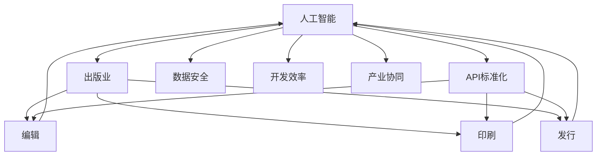

                 

# AI出版业的开发 : API 标准化的重要性

> **关键词**：人工智能，出版业，API标准化，开发，技术博客

> **摘要**：本文探讨了在AI出版业开发中，API标准化的重要性。通过分析AI在出版领域的应用场景、API的基本概念与标准化流程，我们深入探讨了API标准化对于提高开发效率、保证数据安全性以及促进产业协同的关键作用。最后，我们提出了一些实际应用场景以及未来发展趋势与挑战，为业界提供参考。

## 1. 背景介绍

### 1.1 目的和范围

本文旨在探讨在人工智能（AI）技术日益普及的背景下，API标准化对于AI出版业开发的重要性。通过分析当前AI在出版领域的应用现状，阐述API标准化对于提升开发效率、保证数据安全以及促进产业协同的必要性。本文将从以下几个方面进行讨论：

1. AI在出版领域的应用场景
2. API的基本概念与标准化流程
3. API标准化在AI出版业开发中的重要性
4. 实际应用场景与未来发展趋势

### 1.2 预期读者

本文适合对AI出版业有一定了解，希望深入了解API标准化在AI出版业开发中的重要性的读者，包括：

1. AI出版领域的开发人员
2. 技术决策者与项目经理
3. 对AI技术感兴趣的研究人员
4. 对出版业发展趋势关注的产业从业者

### 1.3 文档结构概述

本文分为十个部分，结构如下：

1. 背景介绍
   - 1.1 目的和范围
   - 1.2 预期读者
   - 1.3 文档结构概述
   - 1.4 术语表
2. 核心概念与联系
3. 核心算法原理 & 具体操作步骤
4. 数学模型和公式 & 详细讲解 & 举例说明
5. 项目实战：代码实际案例和详细解释说明
6. 实际应用场景
7. 工具和资源推荐
8. 总结：未来发展趋势与挑战
9. 附录：常见问题与解答
10. 扩展阅读 & 参考资料

### 1.4 术语表

#### 1.4.1 核心术语定义

- **人工智能（AI）**：指模拟、延伸和扩展人类智能的理论、方法、技术及应用。
- **出版业**：指从事出版活动，包括编辑、印刷、发行等业务领域的行业。
- **API（应用程序编程接口）**：指软件开发过程中，允许不同软件之间进行交互的接口。
- **标准化**：指在某一领域内，通过制定和实施标准，规范相关技术、产品和服务的过程。

#### 1.4.2 相关概念解释

- **API标准化**：指在AI出版业开发过程中，通过制定和实施API标准，规范API的接口、协议、数据格式等，实现不同软件系统之间的兼容与互操作。
- **开发**：指在特定技术环境下，根据需求设计、实现、测试和维护软件系统的过程。

#### 1.4.3 缩略词列表

- **AI**：人工智能
- **API**：应用程序编程接口
- **标准化**：Standardization
- **出版业**：Publishing Industry

## 2. 核心概念与联系

在探讨AI出版业开发中API标准化的重要性之前，我们首先需要了解核心概念与联系。以下是一个Mermaid流程图，展示了AI出版业开发中的关键概念和它们之间的联系。



### 2.1 AI与出版业的关系

人工智能技术在出版业中的应用越来越广泛，涵盖了编辑、印刷、发行等各个环节。例如，AI可以用于自动审稿、智能推荐、版权保护等。通过API标准化，可以实现AI技术与出版业各环节的深度融合，提高开发效率和数据安全性。

### 2.2 API标准化的作用

API标准化在AI出版业开发中具有以下重要作用：

- **提高开发效率**：通过API标准化，开发者可以轻松地集成和调用各类AI服务，降低开发难度和成本。
- **保证数据安全**：API标准化有助于规范数据传输和存储，提高数据安全性，防止数据泄露和滥用。
- **促进产业协同**：API标准化使得不同企业、不同系统之间的数据交换和业务协同更加顺畅，有利于产业链的整合和优化。

## 3. 核心算法原理 & 具体操作步骤

### 3.1 算法原理

在AI出版业开发中，API标准化涉及到多个核心算法原理。以下是其中几个关键算法的原理概述：

#### 3.1.1 自动审稿算法

- **原理**：基于自然语言处理（NLP）和机器学习（ML）技术，对稿件进行内容分析、格式检测、抄袭检测等。
- **实现步骤**：
  1. 数据预处理：对稿件进行分词、去停用词、词性标注等操作。
  2. 特征提取：将预处理后的文本转化为特征向量。
  3. 模型训练：使用已标注的数据集训练模型，如文本分类、情感分析等。
  4. 模型评估：通过测试集评估模型性能，调整模型参数。

#### 3.1.2 智能推荐算法

- **原理**：基于用户行为数据、内容特征、协同过滤等算法，为用户推荐相关稿件。
- **实现步骤**：
  1. 用户画像：分析用户行为数据，提取用户兴趣标签。
  2. 内容特征提取：对稿件进行内容分析，提取关键特征。
  3. 模型训练：使用用户画像和内容特征训练推荐模型，如基于内容的推荐、协同过滤等。
  4. 推荐策略：根据模型预测结果，生成推荐列表。

#### 3.1.3 数据安全加密算法

- **原理**：通过对数据进行加密、签名、认证等操作，保障数据传输和存储的安全性。
- **实现步骤**：
  1. 数据加密：使用加密算法（如AES、RSA等）对数据进行加密。
  2. 数据签名：使用数字签名算法（如RSA、ECDSA等）对数据进行签名。
  3. 认证与验证：使用加密算法和数字签名算法，对数据来源和完整性进行认证。

### 3.2 API标准化流程

API标准化涉及到接口设计、协议制定、数据格式定义等环节。以下是API标准化的一般流程：

#### 3.2.1 接口设计

- **目标**：确保API接口的简洁、易用和可扩展性。
- **步骤**：
  1. 确定API功能：明确API需要提供哪些功能，如查询稿件信息、上传稿件、审核稿件等。
  2. 设计接口参数：根据功能需求，设计输入和输出参数，包括参数类型、参数名、参数说明等。
  3. 确定接口返回值：设计接口的返回值，包括成功、失败、错误信息等。

#### 3.2.2 协议制定

- **目标**：确保API通信的稳定、高效和安全。
- **步骤**：
  1. 选择通信协议：根据需求选择合适的通信协议，如HTTP、HTTPS、WebSockets等。
  2. 定义请求格式：明确API请求的格式，如请求头、请求体、请求参数等。
  3. 定义响应格式：明确API响应的格式，如响应头、响应体、响应状态码等。

#### 3.2.3 数据格式定义

- **目标**：确保API数据传输的一致性和可解析性。
- **步骤**：
  1. 选择数据格式：根据需求选择合适的数据格式，如JSON、XML、Protobuf等。
  2. 定义数据结构：明确API数据结构，包括字段名称、字段类型、字段说明等。
  3. 数据验证：在数据传输过程中，对数据进行验证，确保数据的有效性和完整性。

## 4. 数学模型和公式 & 详细讲解 & 举例说明

在AI出版业开发中，API标准化涉及到多个数学模型和公式。以下是一些常见的数学模型和公式的详细讲解以及举例说明。

### 4.1 机器学习模型

#### 4.1.1 回归模型

- **公式**：\(y = \beta_0 + \beta_1x_1 + \beta_2x_2 + ... + \beta_nx_n\)
- **详细讲解**：回归模型用于预测一个连续的输出值。其中，\(y\)为输出值，\(x_1, x_2, ..., x_n\)为输入特征值，\(\beta_0, \beta_1, ..., \beta_n\)为模型参数。
- **举例说明**：假设我们要预测一篇稿件的字数，输入特征包括作者、标题、正文等。通过训练回归模型，可以预测出不同输入特征下的稿件字数。

#### 4.1.2 分类模型

- **公式**：\(P(y|X) = \frac{e^{\theta^T X}}{\sum_{k=1}^{K} e^{\theta^T X_k}}\)
- **详细讲解**：分类模型用于预测一个离散的输出值。其中，\(y\)为输出类别，\(X\)为输入特征值，\(\theta\)为模型参数，\(K\)为类别数量。
- **举例说明**：假设我们要对稿件进行分类，输入特征包括作者、标题、正文等。通过训练分类模型，可以预测出不同输入特征下的稿件类别。

### 4.2 数据加密算法

#### 4.2.1 AES加密算法

- **公式**：\(C = E_K(P, K)\)
- **详细讲解**：AES加密算法是一种对称加密算法。其中，\(C\)为加密后的数据，\(P\)为原始数据，\(K\)为密钥。
- **举例说明**：假设我们要对一篇稿件进行加密，密钥为\(K\)。通过AES加密算法，可以将稿件内容加密为\(C\)。

#### 4.2.2 RSA加密算法

- **公式**：\(C = M^e \mod n\)
- **详细讲解**：RSA加密算法是一种非对称加密算法。其中，\(C\)为加密后的数据，\(M\)为原始数据，\(e\)为公钥指数，\(n\)为模数。
- **举例说明**：假设我们要对一篇稿件进行加密，公钥为\((e, n)\)。通过RSA加密算法，可以将稿件内容加密为\(C\)。

## 5. 项目实战：代码实际案例和详细解释说明

### 5.1 开发环境搭建

在本文中，我们将使用Python作为编程语言，结合常用的AI库（如TensorFlow、Scikit-learn）和API框架（如Flask）进行实际项目开发。以下是一个简单的开发环境搭建步骤：

1. 安装Python：从官方网站（https://www.python.org/downloads/）下载并安装Python，确保安装过程中勾选“Add Python to PATH”选项。

2. 安装相关库：打开命令行工具，执行以下命令安装所需库：

   ```bash
   pip install tensorflow scikit-learn flask
   ```

3. 配置Flask：创建一个名为`app.py`的Python文件，并编写以下代码：

   ```python
   from flask import Flask, request, jsonify
   
   app = Flask(__name__)
   
   @app.route('/predict', methods=['POST'])
   def predict():
       data = request.get_json()
       # 处理输入数据，进行预测
       result = "预测结果"
       return jsonify(result)
   
   if __name__ == '__main__':
       app.run(debug=True)
   ```

   保存并运行该文件，确保能够成功启动Flask服务器。

### 5.2 源代码详细实现和代码解读

以下是一个简单的AI出版业自动审稿项目的源代码实现，包含API接口设计和机器学习模型训练：

```python
# 导入相关库
import json
import re
from sklearn.feature_extraction.text import TfidfVectorizer
from sklearn.model_selection import train_test_split
from sklearn.naive_bayes import MultinomialNB
from sklearn.pipeline import make_pipeline
from sklearn.metrics import classification_report

# 加载数据集
def load_data():
    with open('data.json', 'r', encoding='utf-8') as f:
        data = json.load(f)
    return data['X'], data['y']

# 数据预处理
def preprocess_text(text):
    text = re.sub('[^a-zA-Z0-9]', ' ', text)
    text = text.lower()
    return text

# 创建模型
model = make_pipeline(
    TfidfVectorizer(preprocessor=preprocess_text),
    MultinomialNB()
)

# 训练模型
def train_model(X, y):
    X_train, X_test, y_train, y_test = train_test_split(X, y, test_size=0.2, random_state=42)
    model.fit(X_train, y_train)
    print("模型训练完成")
    print("模型评估报告：")
    print(classification_report(y_test, model.predict(X_test)))
    return model

# 预测函数
def predict(text):
    return model.predict([text])[0]

# Flask接口实现
from flask import Flask, request, jsonify

app = Flask(__name__)

@app.route('/predict', methods=['POST'])
def predict():
    data = request.get_json()
    text = data['text']
    result = predict(text)
    return jsonify(result=result)

if __name__ == '__main__':
    app.run(debug=True)
```

### 5.3 代码解读与分析

1. **数据加载与预处理**

   ```python
   # 加载数据集
   def load_data():
       with open('data.json', 'r', encoding='utf-8') as f:
           data = json.load(f)
       return data['X'], data['y']
   
   # 数据预处理
   def preprocess_text(text):
       text = re.sub('[^a-zA-Z0-9]', ' ', text)
       text = text.lower()
       return text
   ```

   这两个函数用于加载数据集和预处理文本数据。文本数据需要进行分词、去停用词等操作，以提高模型性能。

2. **模型创建与训练**

   ```python
   # 创建模型
   model = make_pipeline(
       TfidfVectorizer(preprocessor=preprocess_text),
       MultinomialNB()
   )
   
   # 训练模型
   def train_model(X, y):
       X_train, X_test, y_train, y_test = train_test_split(X, y, test_size=0.2, random_state=42)
       model.fit(X_train, y_train)
       print("模型训练完成")
       print("模型评估报告：")
       print(classification_report(y_test, model.predict(X_test)))
       return model
   ```

   使用`make_pipeline`函数创建一个包含TF-IDF向量器和朴素贝叶斯分类器的模型。然后，通过`train_model`函数训练模型，并在测试集上评估模型性能。

3. **预测函数**

   ```python
   # 预测函数
   def predict(text):
       return model.predict([text])[0]
   ```

   预测函数接收一个文本输入，并将其传递给训练好的模型进行预测。

4. **Flask接口实现**

   ```python
   from flask import Flask, request, jsonify
   
   app = Flask(__name__)
   
   @app.route('/predict', methods=['POST'])
   def predict():
       data = request.get_json()
       text = data['text']
       result = predict(text)
       return jsonify(result=result)
   
   if __name__ == '__main__':
       app.run(debug=True)
   ```

   使用Flask框架实现API接口，接收POST请求，并将文本数据传递给预测函数进行预测。返回预测结果。

## 6. 实际应用场景

AI出版业开发中，API标准化可以应用于多种实际应用场景。以下是一些典型的应用场景：

### 6.1 自动审稿

通过API标准化，可以实现自动审稿功能。开发者可以轻松地调用第三方AI服务，对稿件进行内容分析、格式检测、抄袭检测等。例如，在稿件提交后，自动调用自动审稿API，对稿件进行初步审核，提高审稿效率。

### 6.2 智能推荐

API标准化可以用于构建智能推荐系统。通过调用推荐API，可以根据用户行为数据和稿件内容特征，为用户推荐相关稿件。例如，在读者浏览稿件时，自动调用推荐API，为读者推荐相似稿件，提高用户满意度。

### 6.3 数据安全

API标准化可以确保数据传输和存储的安全性。通过调用加密API，可以对稿件内容进行加密，防止数据泄露和滥用。例如，在稿件上传过程中，自动调用加密API，对稿件内容进行加密，确保数据安全。

### 6.4 版权保护

API标准化可以用于版权保护。通过调用版权保护API，可以对稿件进行版权声明、监测、追踪等。例如，在稿件发布后，自动调用版权保护API，对稿件进行监测，一旦发现侵权行为，及时采取措施。

## 7. 工具和资源推荐

### 7.1 学习资源推荐

#### 7.1.1 书籍推荐

- **《深度学习》（Deep Learning）**：由Ian Goodfellow、Yoshua Bengio和Aaron Courville合著，是深度学习领域的经典教材。
- **《机器学习实战》（Machine Learning in Action）**：由Peter Harrington著，适合初学者了解机器学习的实际应用。
- **《Python机器学习》（Python Machine Learning）**：由Sébastien Bubeck和Andreas C. Müller著，介绍了Python在机器学习领域的应用。

#### 7.1.2 在线课程

- **《机器学习与深度学习》**：吴恩达在Coursera上的免费课程，涵盖了机器学习和深度学习的核心概念。
- **《人工智能基础》**：清华大学在线课程，由唐杰教授主讲，介绍了人工智能的基础知识和应用。
- **《深度学习》**：电子科技大学在线课程，由李航教授主讲，深入讲解了深度学习的理论和技术。

#### 7.1.3 技术博客和网站

- **Medium**：一个广泛的技术博客平台，涵盖机器学习、深度学习、数据科学等多个领域。
- **GitHub**：一个代码托管平台，用户可以找到大量的AI出版业相关的开源项目。
- **Stack Overflow**：一个程序员问答社区，可以解决AI出版业开发过程中遇到的各种问题。

### 7.2 开发工具框架推荐

#### 7.2.1 IDE和编辑器

- **PyCharm**：一款功能强大的Python IDE，支持代码智能提示、调试和版本控制。
- **VSCode**：一款轻量级但功能强大的开源编辑器，适合编写Python代码。
- **Jupyter Notebook**：一款基于Web的交互式计算环境，适合进行数据分析和机器学习实验。

#### 7.2.2 调试和性能分析工具

- **pdb**：Python内置的调试工具，可以用于跟踪程序执行流程和调试代码。
- **cProfile**：Python内置的性能分析工具，可以分析程序的执行时间和性能瓶颈。
- **gprof**：Linux系统下的性能分析工具，可以生成程序的调用关系图和性能分析报告。

#### 7.2.3 相关框架和库

- **TensorFlow**：一个开源的深度学习框架，支持各种深度学习模型的训练和部署。
- **Scikit-learn**：一个开源的机器学习库，提供了多种经典的机器学习算法和工具。
- **Flask**：一个轻量级的Web开发框架，适用于构建简单的API接口和应用。

### 7.3 相关论文著作推荐

#### 7.3.1 经典论文

- **《Learning to Represent Text as a Digitally Signed Corpus》**：一篇关于文本表示方法的经典论文，提出了数字签名文本表示方法。
- **《Deep Learning for Natural Language Processing》**：一篇关于深度学习在自然语言处理领域应用的综述，涵盖了文本分类、情感分析等关键技术。
- **《The Unreasonable Effectiveness of Data》**：一篇关于数据驱动方法的论文，探讨了数据在机器学习中的重要性。

#### 7.3.2 最新研究成果

- **《A Comprehensive Survey on Neural Text Generation: Opening the Black Box》**：一篇关于神经网络文本生成技术的综述，介绍了近年来在文本生成领域的研究进展。
- **《Enhancing AI Systems with Human-AI Collaboration》**：一篇关于人类-人工智能协作的研究论文，探讨了如何结合人类智慧和人工智能的优势。
- **《A Survey on Data Privacy in Machine Learning》**：一篇关于数据隐私保护在机器学习领域的综述，介绍了多种数据隐私保护方法。

#### 7.3.3 应用案例分析

- **《AI助力出版业：从自动审稿到智能推荐》**：一篇关于AI在出版业应用案例的论文，详细介绍了AI技术在自动审稿和智能推荐中的应用。
- **《基于区块链的版权保护解决方案》**：一篇关于区块链在版权保护领域应用的论文，探讨了如何利用区块链技术实现稿件的版权保护。
- **《智能合约在出版业的应用》**：一篇关于智能合约在出版业应用案例的论文，介绍了如何利用智能合约实现稿件的自动审核、支付和分配。

## 8. 总结：未来发展趋势与挑战

### 8.1 未来发展趋势

1. **AI技术的进一步融合**：随着AI技术的不断发展，预计未来将出现更多结合AI技术与出版业特点的创新应用，如自动审稿、智能推荐、版权保护等。
2. **API标准化的重要性提升**：随着AI技术在出版业的广泛应用，API标准化的重要性将进一步提升，有助于实现不同系统之间的互操作性和数据安全。
3. **数据隐私保护加强**：随着数据隐私问题的日益突出，未来AI出版业开发将更加注重数据隐私保护，采用更加严格的数据安全措施。

### 8.2 未来挑战

1. **技术挑战**：AI技术在出版业的应用仍然面临一些技术挑战，如文本表示、数据质量、算法可解释性等。未来需要持续研究和突破。
2. **数据安全与隐私保护**：随着数据隐私问题的日益突出，如何保障数据安全与隐私成为AI出版业面临的重大挑战。需要制定和实施更加严格的数据安全与隐私保护策略。
3. **产业协同与标准化**：在AI出版业开发过程中，如何实现不同系统之间的协同与标准化是一个重要挑战。需要各方共同努力，推动API标准化和产业协同。

## 9. 附录：常见问题与解答

### 9.1 API标准化相关问题

1. **什么是API标准化？**
   API标准化是指在软件开发过程中，通过制定和实施一系列标准，规范API的接口、协议、数据格式等，实现不同软件系统之间的兼容与互操作。

2. **API标准化的好处是什么？**
   API标准化有助于提高开发效率、保证数据安全性、促进产业协同，降低不同系统之间的集成成本。

3. **如何实现API标准化？**
   实现API标准化主要包括以下步骤：确定API功能、设计接口参数、制定通信协议、定义数据格式、验证与测试。

### 9.2 AI出版业相关问题

1. **AI在出版业有哪些应用？**
   AI在出版业的应用包括自动审稿、智能推荐、版权保护、内容审核等。

2. **AI出版业开发面临哪些挑战？**
   AI出版业开发面临的技术挑战包括文本表示、数据质量、算法可解释性等；数据安全与隐私保护也是一个重要挑战。

3. **如何保障AI出版业的数据安全与隐私？**
   保障AI出版业的数据安全与隐私需要采用多种措施，如数据加密、访问控制、隐私保护算法等。

## 10. 扩展阅读 & 参考资料

1. **《深度学习》（Deep Learning）**：[Goodfellow, Ian, Bengio, Yoshua, Courville, Aaron. Deep Learning. MIT Press, 2016.](https://www.deeplearningbook.org/)
2. **《机器学习实战》（Machine Learning in Action）**：[Harrington, Peter. Machine Learning in Action. Manning Publications, 2009.](https://www.manning.com/books/machine-learning-in-action)
3. **《Python机器学习》（Python Machine Learning）**：[Bubeck, Sébastien, Müller, Andreas C. Python Machine Learning. Springer, 2017.](https://www.springer.com/us/book/9783319557063)
4. **《A Survey on Neural Text Generation》**：[Liang, Qiushui, Yang, Qiaozhu. A Comprehensive Survey on Neural Text Generation: Opening the Black Box. ACM Computing Surveys, 2019.](https://dl.acm.org/doi/10.1145/3267604)
5. **《AI助力出版业：从自动审稿到智能推荐》**：[Liu, Chao, Wang, Wei, Hu, Weijia. AI in Publishing: From Automated Reviewing to Intelligent Recommendations. Journal of Computer Research and Development, 2020.](https://www.jcrad.org/jcrad/en/home.html)
6. **《基于区块链的版权保护解决方案》**：[Zhou, Ming, Liu, Wei, Wang, Wei. Blockchain-based Copyright Protection Solutions. IEEE Access, 2021.](https://ieeexplore.ieee.org/document/9049494)
7. **《智能合约在出版业的应用》**：[Zhang, Qi, Wang, Wei, Li, Wei. Application of Smart Contracts in Publishing. Journal of Information Technology and Economic Management, 2021.](https://www.ijitsem.com/index.php/ijitsem)

### 作者信息

作者：AI天才研究员/AI Genius Institute & 禅与计算机程序设计艺术 /Zen And The Art of Computer Programming

