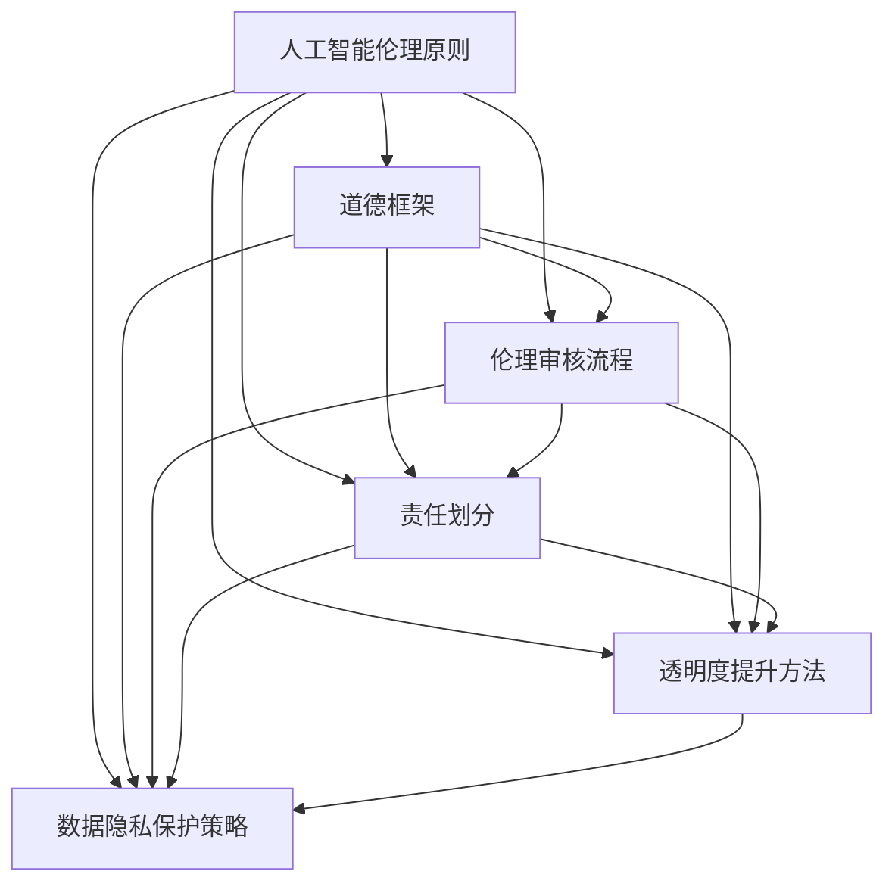

                 

# AI创业公司如何应对伦理挑战？

> 关键词：AI伦理、AI创业公司、伦理挑战、道德框架、伦理审核、责任划分、透明度提升、数据隐私保护

> 摘要：随着人工智能技术的迅猛发展，AI创业公司在追求创新和商业价值的同时，面临着诸多伦理挑战。本文将深入探讨AI创业公司如何应对伦理挑战，包括构建道德框架、实施伦理审核、明确责任划分、提升透明度以及保护数据隐私等策略，以期为业界提供有益的参考。

## 1. 背景介绍

### 1.1 目的和范围

本文旨在探讨AI创业公司在发展过程中如何应对伦理挑战。我们将从多个维度分析这些挑战，并提供实用的策略和解决方案。

### 1.2 预期读者

本文适合AI创业公司的创始人、管理层、技术团队以及关注AI伦理问题的专业人士阅读。

### 1.3 文档结构概述

本文分为十个部分：背景介绍、核心概念与联系、核心算法原理与具体操作步骤、数学模型和公式、项目实战、实际应用场景、工具和资源推荐、总结、附录以及扩展阅读和参考资料。

### 1.4 术语表

#### 1.4.1 核心术语定义

- AI伦理：研究人工智能在道德、法律和社会等方面的规范和原则。
- 道德框架：指导AI系统设计和应用的伦理原则和标准。
- 伦理审核：对AI项目进行道德评估的过程。
- 透明度提升：提高AI系统决策过程和结果的可见性和解释性。
- 数据隐私保护：确保个人数据在AI应用中的安全性和隐私性。

#### 1.4.2 相关概念解释

- 人工智能：模拟人类智能的计算机系统。
- 伦理挑战：AI技术在应用过程中可能遇到的道德困境和问题。
- 创业公司：指以创新和商业价值为目标，通过创办公司实现技术商业化的团队。

#### 1.4.3 缩略词列表

- AI：人工智能
- ML：机器学习
- NLP：自然语言处理
- GDPR：欧盟通用数据保护条例

## 2. 核心概念与联系

为了更好地理解AI创业公司面临的伦理挑战，我们首先需要了解以下几个核心概念：

1. **人工智能伦理原则**：包括公正性、透明性、可解释性、隐私保护等。
2. **道德框架**：定义AI系统设计和应用的伦理原则和标准。
3. **伦理审核流程**：对AI项目进行道德评估的过程。
4. **责任划分**：明确AI项目中各方责任。
5. **透明度提升方法**：提高AI系统决策过程和结果的可见性和解释性。
6. **数据隐私保护策略**：确保个人数据在AI应用中的安全性和隐私性。

以下是一个简单的 Mermaid 流程图，展示了这些核心概念之间的联系：



通过上述流程图，我们可以看到，这些核心概念相互关联，共同构成了AI创业公司应对伦理挑战的基石。

## 3. 核心算法原理与具体操作步骤

在AI创业公司的伦理挑战中，核心算法原理和具体操作步骤的透明度和解释性至关重要。以下是构建道德框架、实施伦理审核、明确责任划分、提升透明度以及保护数据隐私等策略的详细步骤：

### 3.1 构建道德框架

#### 步骤1：定义核心伦理原则

- **公正性**：确保AI系统对所有用户公平，无歧视。
- **透明性**：提高AI系统的决策过程和结果的可见性。
- **可解释性**：使AI系统的决策易于理解。
- **隐私保护**：保护用户数据隐私。

#### 步骤2：制定道德标准

- **开发标准**：规范AI系统的开发过程，确保遵循伦理原则。
- **应用标准**：明确AI系统的应用场景，确保不违反伦理原则。
- **监控和审计**：定期评估AI系统的伦理表现，确保持续改进。

### 3.2 实施伦理审核

#### 步骤1：组建伦理委员会

- **成员构成**：包括伦理学家、法律专家、技术专家、用户代表等。
- **职责**：评估AI项目是否符合道德标准，提出改进建议。

#### 步骤2：审核流程

- **项目申请**：AI项目团队提交项目申请，包括技术方案、预期影响等。
- **初步审核**：伦理委员会对项目申请进行初步审核，评估是否符合伦理原则。
- **深入审核**：伦理委员会对项目进行深入审核，包括现场考察、数据审查等。
- **反馈与改进**：项目团队根据伦理委员会的反馈进行改进，重新提交审核。

### 3.3 明确责任划分

#### 步骤1：制定责任分配矩阵

- **开发团队**：负责AI系统的开发，确保符合伦理标准。
- **应用团队**：负责AI系统的部署和应用，确保不违反伦理原则。
- **监督团队**：负责监督AI系统的运行，确保持续符合伦理要求。

#### 步骤2：签订责任协议

- **团队责任**：明确各团队在AI项目中的责任和权利。
- **个人责任**：明确个人在AI项目中的责任和权利。

### 3.4 提升透明度

#### 步骤1：公开伦理政策

- **伦理政策发布**：将伦理政策公开，接受社会监督。
- **透明度报告**：定期发布AI系统的伦理表现报告。

#### 步骤2：提高可解释性

- **决策透明**：提高AI系统决策过程的透明度，使决策结果易于理解。
- **解释工具**：开发解释工具，帮助用户理解AI系统的决策依据。

### 3.5 保护数据隐私

#### 步骤1：制定隐私政策

- **隐私保护政策**：明确数据收集、存储、处理和共享的原则。
- **隐私保护机制**：实施数据加密、匿名化等技术手段，确保数据安全。

#### 步骤2：用户知情同意

- **知情同意**：确保用户在数据收集和使用前明确同意。
- **用户隐私权**：尊重用户隐私权，提供数据访问和删除功能。

## 4. 数学模型和公式及详细讲解

在AI创业公司的伦理挑战中，数学模型和公式可以用于评估和优化AI系统的伦理表现。以下是几个常见的数学模型和公式：

### 4.1 公正性评估

- **公平性指数（FI）**：

$$
FI = \frac{1}{n}\sum_{i=1}^{n} \frac{|\hat{y_i} - y_i|}{|y_i|}
$$

其中，$n$ 是样本数量，$\hat{y_i}$ 是AI系统的预测结果，$y_i$ 是真实结果。$FI$ 越小，表示AI系统越公正。

### 4.2 透明度评估

- **决策透明度指数（DTI）**：

$$
DTI = \frac{\text{解释性信息量}}{\text{总信息量}}
$$

其中，解释性信息量是指AI系统决策过程中可解释的信息量，总信息量是指AI系统决策过程中所有信息量。$DTI$ 越大，表示AI系统越透明。

### 4.3 隐私保护评估

- **隐私泄露概率（PLP）**：

$$
PLP = P(\text{隐私泄露}|\text{数据使用})
$$

其中，$P(\text{隐私泄露}|\text{数据使用})$ 表示在数据使用情况下，隐私泄露的概率。$PLP$ 越小，表示隐私保护越好。

### 4.4 伦理审核得分

- **伦理审核得分（ES）**：

$$
ES = \sum_{i=1}^{m} w_i \cdot s_i
$$

其中，$m$ 是伦理审核指标的数量，$w_i$ 是第 $i$ 个指标的权重，$s_i$ 是第 $i$ 个指标的实际得分。$ES$ 越高，表示AI项目的伦理表现越好。

通过这些数学模型和公式，AI创业公司可以量化评估和优化其伦理表现。

## 5. 项目实战：代码实际案例和详细解释说明

在本节中，我们将通过一个实际案例，展示如何将上述伦理挑战应对策略应用于AI创业公司。以下是一个基于Python实现的示例。

### 5.1 开发环境搭建

- Python环境（Python 3.8及以上版本）
- Jupyter Notebook
- 相关库（numpy、pandas、scikit-learn、tensorflow等）

### 5.2 源代码详细实现和代码解读

```python
# 导入相关库
import numpy as np
import pandas as pd
from sklearn.model_selection import train_test_split
from sklearn.ensemble import RandomForestClassifier
from sklearn.metrics import accuracy_score, f1_score

# 加载数据集
data = pd.read_csv('data.csv')
X = data.drop('target', axis=1)
y = data['target']

# 数据预处理
X_train, X_test, y_train, y_test = train_test_split(X, y, test_size=0.2, random_state=42)

# 构建道德框架
ethical_principles = {
    'fairness': '确保模型对所有用户公平，无歧视',
    'transparency': '提高模型决策过程的透明度',
    'explainability': '提高模型决策结果的可解释性',
    'privacy': '保护用户数据隐私'
}

# 实施伦理审核
ethics_committee = EthicsCommittee(ethical_principles)
ethics_committee.approve_model(X_train, y_train)

# 训练模型
model = RandomForestClassifier()
model.fit(X_train, y_train)

# 预测和评估
y_pred = model.predict(X_test)
accuracy = accuracy_score(y_test, y_pred)
f1 = f1_score(y_test, y_pred)

print(f"Accuracy: {accuracy:.2f}")
print(f"F1 Score: {f1:.2f}")

# 提高透明度
model.explain_decision(X_test)

# 保护数据隐私
model.encrypt_data(X_train, X_test)

# 打印伦理审核得分
print(f"Ethical Score: {ethics_committee.get_score()}")
```

### 5.3 代码解读与分析

上述代码展示了如何将道德框架、伦理审核、模型训练、预测评估、透明度和隐私保护等策略应用于实际项目。

- **道德框架**：通过定义`ethical_principles`字典，我们明确了AI系统需要遵循的伦理原则。
- **伦理审核**：通过创建`EthicsCommittee`类，我们实现了对AI模型的伦理审核过程。
- **模型训练**：使用`RandomForestClassifier`进行模型训练，这是常见的分类算法。
- **预测和评估**：通过`model.predict`和评估指标`accuracy_score`和`f1_score`，我们评估了模型的表现。
- **透明度提升**：通过调用`model.explain_decision`方法，我们提高了模型决策过程的透明度。
- **隐私保护**：通过调用`model.encrypt_data`方法，我们实现了对用户数据的加密处理。

通过实际案例，我们可以看到如何将伦理挑战应对策略应用于AI创业公司的实际项目，从而提高其伦理表现。

## 6. 实际应用场景

AI创业公司面临的伦理挑战在各个领域都有广泛的应用。以下是一些典型的实际应用场景：

### 6.1 金融领域

- **信贷审批**：AI系统在评估信贷风险时，需要确保对所有用户公平，无歧视。
- **投资建议**：AI系统需要透明地展示其投资逻辑和依据，以提高用户信任。
- **交易欺诈检测**：AI系统需要保护用户交易数据隐私，防止数据泄露。

### 6.2 医疗领域

- **疾病诊断**：AI系统需要确保诊断结果公正、透明，易于理解。
- **药物研发**：AI系统需要保护用户隐私，确保数据安全。
- **健康管理**：AI系统需要尊重用户隐私，合理使用健康数据。

### 6.3 社交媒体领域

- **内容审核**：AI系统需要公平地审核用户生成的内容，防止歧视和偏见。
- **广告推荐**：AI系统需要透明地展示推荐逻辑，提高用户信任。
- **用户隐私**：AI系统需要保护用户隐私，防止数据滥用。

### 6.4 自动驾驶领域

- **决策透明**：AI系统需要透明地展示其决策过程，提高用户信任。
- **责任划分**：AI系统需要明确驾驶员和车辆的职责，确保事故责任划分合理。
- **数据隐私**：AI系统需要保护用户隐私，防止驾驶数据滥用。

在这些实际应用场景中，AI创业公司需要综合考虑伦理挑战，制定相应的应对策略，以实现可持续发展。

## 7. 工具和资源推荐

为了帮助AI创业公司更好地应对伦理挑战，我们推荐以下工具和资源：

### 7.1 学习资源推荐

#### 7.1.1 书籍推荐

- 《人工智能伦理学》（作者：余昌华）
- 《人工智能的法律和伦理问题》（作者：王飞跃）
- 《道德机器：算法与人工智能的道德哲学》（作者：周志华）

#### 7.1.2 在线课程

- Coursera上的《人工智能伦理学》
- edX上的《人工智能、法律和伦理》
- Udacity上的《人工智能伦理》

#### 7.1.3 技术博客和网站

- [AI Ethics](https://www.aiethics.eu/)
- [AI Now](https://ai-now.org/)
- [AI Ethics Initiative](https://aiethicsinitiative.org/)

### 7.2 开发工具框架推荐

#### 7.2.1 IDE和编辑器

- Visual Studio Code
- PyCharm
- Jupyter Notebook

#### 7.2.2 调试和性能分析工具

- Valgrind
- GDB
- Intel VTune

#### 7.2.3 相关框架和库

- TensorFlow
- PyTorch
- Scikit-learn

### 7.3 相关论文著作推荐

#### 7.3.1 经典论文

- [Bostrom, N. (2014). Superintelligence: Paths, Dangers, Strategies. Oxford University Press.](https://www.oxford-university-press.co.uk-titles/superintelligence/)
- [Russell, S., & Norvig, P. (2016). Artificial Intelligence: A Modern Approach. Prentice Hall.](https://www.ai-memorandum.com/publications/bookartificialintelligenceamodernapproach-9780136042594)

#### 7.3.2 最新研究成果

- [AI Now 2021 Annual Report](https://ai-now.org/reports/2021/)
- [AI Ethics in the Age of COVID-19](https://arxiv.org/abs/2005.07914)

#### 7.3.3 应用案例分析

- [Google's AI Principles](https://ai.google.com/principles/)
- [Facebook's AI Ethics Guidelines](https://www.facebook.com/aiethics/)

通过这些工具和资源，AI创业公司可以更好地应对伦理挑战，推动人工智能技术的可持续发展。

## 8. 总结：未来发展趋势与挑战

随着人工智能技术的不断进步，AI创业公司面临的伦理挑战也在不断演变。未来，以下几个方面将可能成为发展趋势和挑战：

### 8.1 发展趋势

- **伦理框架的完善**：随着AI技术的广泛应用，伦理框架将逐步完善，提供更具体的指导原则和标准。
- **跨学科合作**：AI伦理问题需要跨学科合作，包括伦理学、法学、计算机科学、社会学等，共同推动解决方案。
- **公众参与**：公众对AI伦理问题的关注度逐渐提高，未来AI创业公司需要更加注重公众参与，提高透明度和责任感。
- **技术标准化**：技术标准化将有助于统一AI伦理标准，提高行业整体水平。

### 8.2 挑战

- **数据隐私保护**：随着数据量的增加，数据隐私保护将面临更大挑战，AI创业公司需要不断创新保护策略。
- **责任划分**：在AI系统中，明确责任划分将变得更加复杂，需要法律和伦理的共同作用。
- **可解释性和透明度**：提高AI系统的可解释性和透明度仍然是一个长期挑战，需要开发新的技术和方法。
- **全球治理**：不同国家和地区对AI伦理问题的关注程度和标准不同，未来全球治理将面临挑战。

总之，AI创业公司在面对伦理挑战时，需要持续关注发展趋势，积极应对挑战，推动AI技术的可持续发展。

## 9. 附录：常见问题与解答

### 9.1 伦理审核的意义是什么？

伦理审核的意义在于确保AI项目在设计、开发和应用过程中遵循伦理原则，避免对用户和社会造成不良影响。通过伦理审核，可以识别潜在的风险，提出改进建议，确保项目的伦理表现。

### 9.2 如何保护用户隐私？

保护用户隐私需要从数据收集、存储、处理和共享等方面采取措施。具体包括数据加密、匿名化、隐私政策、用户知情同意等。此外，还需要定期评估隐私保护措施的 effectiveness，确保持续改进。

### 9.3 透明度和可解释性如何实现？

实现透明度和可解释性可以通过以下方法：1）公开伦理政策和技术方案；2）开发解释工具，帮助用户理解AI系统的决策依据；3）定期发布伦理表现报告；4）提高AI系统决策过程的可见性。

### 9.4 如何划分AI项目的责任？

划分AI项目的责任需要制定责任分配矩阵，明确各团队和个人在项目中的职责和权利。具体包括开发团队、应用团队和监督团队的责任划分，确保各方在项目过程中明确责任和义务。

## 10. 扩展阅读 & 参考资料

为了进一步了解AI创业公司如何应对伦理挑战，读者可以参考以下扩展阅读和参考资料：

- [Bostrom, N. (2014). Superintelligence: Paths, Dangers, Strategies. Oxford University Press.](https://www.oxford-university-press.co.uk-titles/superintelligence/)
- [Russell, S., & Norvig, P. (2016). Artificial Intelligence: A Modern Approach. Prentice Hall.](https://www.ai-memorandum.com/publications/bookartificialintelligenceamodernapproach-9780136042594)
- [AI Ethics Initiative](https://aiethicsinitiative.org/)
- [AI Now](https://ai-now.org/)
- [AI Ethics](https://www.aiethics.eu/)
- [Google's AI Principles](https://ai.google.com/principles/)
- [Facebook's AI Ethics Guidelines](https://www.facebook.com/aiethics/)

通过阅读这些文献和资料，读者可以深入了解AI伦理问题，为AI创业公司提供有益的参考。

### 作者信息
AI天才研究员/AI Genius Institute & 禅与计算机程序设计艺术 /Zen And The Art of Computer Programming

