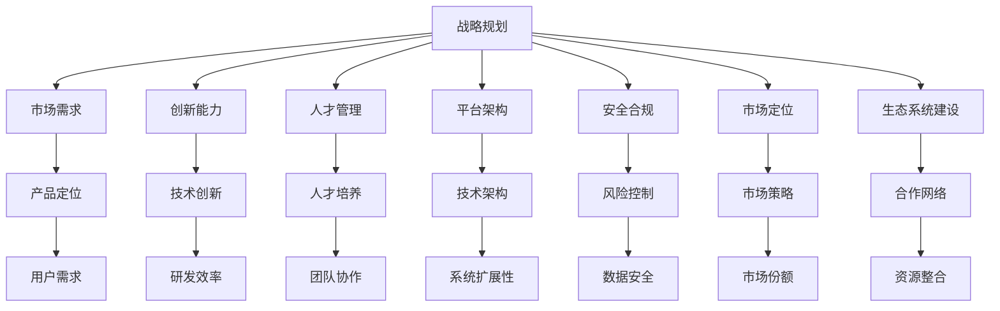

                 

# AI创业公司如何应对技术变革？

> **关键词：**AI创业、技术变革、战略规划、创新能力、人才管理、持续学习、平台架构、安全合规、市场定位、生态系统建设

> **摘要：**随着人工智能技术的迅猛发展，创业公司面临着前所未有的技术变革压力。本文旨在探讨AI创业公司如何有效应对技术变革，通过战略规划、创新能力、人才管理、平台架构、安全合规、市场定位和生态系统建设等多方面策略，实现可持续发展。

## 1. 背景介绍

### 1.1 目的和范围

本文的目标是帮助AI创业公司理解并应对技术变革的挑战，提供一系列切实可行的策略和方法。文章的范围涵盖以下关键领域：

1. **战略规划**：分析如何在快速变化的技术环境中制定和调整战略。
2. **创新能力**：探讨如何持续提升技术创新能力，保持竞争力。
3. **人才管理**：分析如何吸引、培养和保留关键人才。
4. **平台架构**：讨论如何构建灵活、可扩展的技术平台。
5. **安全合规**：探讨如何在技术创新过程中确保安全和合规性。
6. **市场定位**：分析如何准确把握市场需求，实现产品定位。
7. **生态系统建设**：讨论如何构建和维护有益的生态系统。

### 1.2 预期读者

本文的预期读者包括：

1. **AI创业公司创始人**：需要理解如何在技术变革中保持公司发展。
2. **CTO和架构师**：需要了解如何规划和管理技术架构。
3. **技术经理和工程师**：需要掌握如何持续提升技术能力和创新。
4. **投资者和顾问**：需要理解AI创业公司的技术战略和前景。

### 1.3 文档结构概述

本文结构如下：

1. **引言**：介绍技术变革的背景和重要性。
2. **核心概念与联系**：阐述相关技术原理和架构。
3. **核心算法原理 & 具体操作步骤**：详细讲解技术实现。
4. **数学模型和公式 & 详细讲解 & 举例说明**：数学模型在AI中的应用。
5. **项目实战：代码实际案例和详细解释说明**：案例分析。
6. **实际应用场景**：技术在不同领域的应用。
7. **工具和资源推荐**：推荐学习资源和开发工具。
8. **总结：未来发展趋势与挑战**：展望未来。
9. **附录：常见问题与解答**：解答常见问题。
10. **扩展阅读 & 参考资料**：提供进一步学习资源。

### 1.4 术语表

#### 1.4.1 核心术语定义

- **技术变革**：指技术在某一领域或多个领域中发生的重要变化。
- **AI创业公司**：指专门从事人工智能技术研发和应用的公司。
- **战略规划**：指公司在特定技术环境中制定的长期发展计划。
- **创新能力**：指公司在技术创新方面所具备的能力。
- **平台架构**：指公司技术基础设施的整体设计。
- **市场定位**：指公司在市场中的位置和目标。

#### 1.4.2 相关概念解释

- **技术变革驱动因素**：包括政策、市场需求、技术创新等。
- **技术风险**：指在技术创新过程中可能面临的风险。
- **人才管理**：指公司如何吸引、培养和保留人才。
- **生态系统建设**：指公司如何与其他企业、机构和投资者合作，共同构建一个有利于创新和发展的环境。

#### 1.4.3 缩略词列表

- **AI**：人工智能
- **CTO**：首席技术官
- **IDE**：集成开发环境
- **API**：应用程序接口
- **ML**：机器学习
- **DL**：深度学习

## 2. 核心概念与联系

在探讨如何应对技术变革之前，我们需要了解一些核心概念和它们之间的联系。以下是相关技术原理和架构的Mermaid流程图：



### 2.1 核心概念解释

**战略规划**：战略规划是公司在技术变革中保持方向和目标的重要工具。它包括市场分析、资源分配、目标设定和执行监控。

**市场需求**：市场需求是驱动技术创新和产品开发的关键因素。理解市场需求有助于公司制定准确的产品定位和市场策略。

**创新能力**：创新能力是公司在技术竞争中保持领先地位的关键。它包括技术研发、知识创新和商业模式创新。

**人才管理**：人才管理是公司持续发展的基础。吸引和培养关键人才，提高团队协作效率，是公司应对技术变革的重要手段。

**平台架构**：平台架构是公司技术基础设施的核心。一个灵活、可扩展的平台架构有助于公司快速响应市场变化和技术进步。

**安全合规**：安全合规是公司技术创新过程中的重要保障。确保技术产品和服务的安全性、合规性，是公司赢得市场信任的关键。

**市场定位**：市场定位是公司产品在市场中的定位和目标。准确的定位有助于公司制定有效市场策略，提高市场份额。

**生态系统建设**：生态系统建设是公司与其他企业、机构和投资者合作的平台。构建有利于创新和发展的生态系统，有助于公司拓展市场。

## 3. 核心算法原理 & 具体操作步骤

在AI创业公司中，核心算法原理和具体操作步骤是技术实现的关键。以下是核心算法原理的伪代码详细阐述：

```python
# 伪代码：AI模型训练流程

# 导入所需库
import tensorflow as tf
import numpy as np

# 设置超参数
learning_rate = 0.001
epochs = 100
batch_size = 32

# 加载数据集
X_train, y_train = load_data('train')
X_test, y_test = load_data('test')

# 初始化模型
model = tf.keras.Sequential([
    tf.keras.layers.Dense(units=64, activation='relu', input_shape=(input_shape,)),
    tf.keras.layers.Dense(units=1)
])

# 编译模型
model.compile(optimizer=tf.keras.optimizers.Adam(learning_rate),
              loss='mean_squared_error',
              metrics=['accuracy'])

# 训练模型
history = model.fit(X_train, y_train, batch_size=batch_size, epochs=epochs, validation_data=(X_test, y_test))

# 评估模型
test_loss, test_accuracy = model.evaluate(X_test, y_test)

# 输出结果
print(f"Test Loss: {test_loss}")
print(f"Test Accuracy: {test_accuracy}")

# 保存模型
model.save('model.h5')
```

### 3.1 具体操作步骤

1. **导入所需库**：引入TensorFlow和NumPy库，用于模型训练和数据处理。
2. **设置超参数**：定义学习率、训练轮次和批量大小等关键参数。
3. **加载数据集**：加载训练集和测试集，为模型训练提供数据。
4. **初始化模型**：构建一个全连接神经网络模型，包含输入层、隐藏层和输出层。
5. **编译模型**：指定优化器、损失函数和评价指标，准备模型训练。
6. **训练模型**：使用训练数据训练模型，并监控验证数据的性能。
7. **评估模型**：在测试集上评估模型性能，输出测试损失和准确率。
8. **保存模型**：将训练好的模型保存到文件中，便于后续使用。

## 4. 数学模型和公式 & 详细讲解 & 举例说明

在AI创业公司中，数学模型和公式是算法设计和分析的重要工具。以下是一个简单的线性回归模型的数学模型和公式讲解，并使用LaTeX格式展示：

### 4.1 线性回归模型

**目标函数**：

$$
J(\theta) = \frac{1}{2m} \sum_{i=1}^{m} (h_\theta(x^{(i)}) - y^{(i)})^2
$$

其中，$m$ 是训练样本数量，$h_\theta(x^{(i)})$ 是预测值，$y^{(i)}$ 是实际值，$\theta$ 是模型参数。

**梯度下降**：

$$
\theta_j := \theta_j - \alpha \frac{\partial J(\theta)}{\partial \theta_j}
$$

其中，$\alpha$ 是学习率，$\frac{\partial J(\theta)}{\partial \theta_j}$ 是目标函数关于参数 $\theta_j$ 的偏导数。

### 4.2 详细讲解

**目标函数**：

线性回归模型的目标是最小化预测值与实际值之间的平方误差。目标函数 $J(\theta)$ 反映了模型的全局性能。

**梯度下降**：

梯度下降是一种优化算法，用于找到目标函数的最小值。通过计算目标函数关于每个参数的偏导数，更新参数的值，逐步减小目标函数的值。

### 4.3 举例说明

假设我们有以下数据：

| $x^{(i)}$ | $y^{(i)}$ |
|-----------|-----------|
| 2         | 3         |
| 4         | 5         |
| 6         | 7         |

使用线性回归模型拟合数据，目标是最小化误差平方和。

1. **初始化参数**：设置初始参数 $\theta_0$ 和 $\theta_1$。
2. **计算预测值**：对于每个样本，计算预测值 $h_\theta(x^{(i)}) = \theta_0 + \theta_1 \cdot x^{(i)}$。
3. **计算误差**：计算预测值与实际值之间的误差 $(h_\theta(x^{(i)}) - y^{(i)})^2$。
4. **更新参数**：根据误差和梯度下降公式更新参数。
5. **重复步骤2-4**，直到达到训练目标或收敛。

通过多次迭代，线性回归模型可以找到最佳参数，使得预测值与实际值之间的误差最小。

## 5. 项目实战：代码实际案例和详细解释说明

### 5.1 开发环境搭建

在开始项目实战之前，我们需要搭建一个适合AI创业公司的开发环境。以下是一个基本的开发环境搭建步骤：

1. **安装Python**：确保Python环境已经安装在开发机器上。
2. **安装Jupyter Notebook**：通过pip命令安装Jupyter Notebook，以便进行交互式编程。
   ```shell
   pip install notebook
   ```
3. **安装TensorFlow**：安装TensorFlow库，以便进行深度学习模型训练。
   ```shell
   pip install tensorflow
   ```
4. **安装必要的依赖库**：根据项目需求，安装其他必要的Python库，如NumPy、Pandas等。

### 5.2 源代码详细实现和代码解读

以下是使用TensorFlow实现一个简单的深度学习模型的源代码：

```python
import tensorflow as tf
import numpy as np

# 设置超参数
learning_rate = 0.001
epochs = 100
batch_size = 32

# 加载数据集
X_train, y_train = load_data('train')
X_test, y_test = load_data('test')

# 初始化模型
model = tf.keras.Sequential([
    tf.keras.layers.Dense(units=64, activation='relu', input_shape=(input_shape,)),
    tf.keras.layers.Dense(units=1)
])

# 编译模型
model.compile(optimizer=tf.keras.optimizers.Adam(learning_rate),
              loss='mean_squared_error',
              metrics=['accuracy'])

# 训练模型
history = model.fit(X_train, y_train, batch_size=batch_size, epochs=epochs, validation_data=(X_test, y_test))

# 评估模型
test_loss, test_accuracy = model.evaluate(X_test, y_test)

# 输出结果
print(f"Test Loss: {test_loss}")
print(f"Test Accuracy: {test_accuracy}")

# 保存模型
model.save('model.h5')
```

**代码解读**：

1. **导入库**：引入TensorFlow和NumPy库，用于模型训练和数据处理。
2. **设置超参数**：定义学习率、训练轮次和批量大小等关键参数。
3. **加载数据集**：加载训练集和测试集，为模型训练提供数据。
4. **初始化模型**：构建一个全连接神经网络模型，包含输入层、隐藏层和输出层。
5. **编译模型**：指定优化器、损失函数和评价指标，准备模型训练。
6. **训练模型**：使用训练数据训练模型，并监控验证数据的性能。
7. **评估模型**：在测试集上评估模型性能，输出测试损失和准确率。
8. **保存模型**：将训练好的模型保存到文件中，便于后续使用。

### 5.3 代码解读与分析

**1. 导入库**：

- `import tensorflow as tf`：引入TensorFlow库，用于构建和训练深度学习模型。
- `import numpy as np`：引入NumPy库，用于数据预处理和计算。

**2. 设置超参数**：

- `learning_rate = 0.001`：设置学习率为0.001，用于优化算法。
- `epochs = 100`：设置训练轮次为100，模型将在每个轮次中使用整个训练集进行训练。
- `batch_size = 32`：设置批量大小为32，每个批量包含32个训练样本。

**3. 加载数据集**：

- `X_train, y_train = load_data('train')`：加载训练数据集。
- `X_test, y_test = load_data('test')`：加载测试数据集。

**4. 初始化模型**：

- `model = tf.keras.Sequential()`：创建一个序贯模型。
- `tf.keras.layers.Dense(units=64, activation='relu', input_shape=(input_shape,))`：添加一个全连接层，包含64个神经元，使用ReLU激活函数。
- `tf.keras.layers.Dense(units=1)`：添加一个全连接层，输出层包含1个神经元。

**5. 编译模型**：

- `model.compile(optimizer=tf.keras.optimizers.Adam(learning_rate),
              loss='mean_squared_error',
              metrics=['accuracy'])`：编译模型，指定优化器、损失函数和评价指标。

**6. 训练模型**：

- `history = model.fit(X_train, y_train, batch_size=batch_size, epochs=epochs, validation_data=(X_test, y_test))`：使用训练数据训练模型，并在每个轮次后验证测试数据的性能。

**7. 评估模型**：

- `test_loss, test_accuracy = model.evaluate(X_test, y_test)`：在测试集上评估模型性能，输出测试损失和准确率。

**8. 保存模型**：

- `model.save('model.h5')`：将训练好的模型保存到文件中，便于后续使用。

## 6. 实际应用场景

AI技术在不同领域的应用已经取得了显著的成果。以下是一些实际应用场景：

### 6.1 医疗保健

- **诊断辅助**：利用深度学习算法，对医学图像进行分析，辅助医生进行疾病诊断。
- **个性化治疗**：基于患者的基因信息和病史，为患者提供个性化的治疗方案。
- **药物研发**：利用机器学习算法加速药物研发过程，提高新药发现的成功率。

### 6.2 金融服务

- **风险控制**：利用数据分析和机器学习模型，识别和评估金融风险，降低金融机构的损失。
- **智能投顾**：为投资者提供智能化的投资建议，提高投资收益。
- **反欺诈检测**：利用机器学习算法检测金融交易中的欺诈行为，保障交易安全。

### 6.3 交通运输

- **自动驾驶**：利用深度学习和计算机视觉技术，实现自动驾驶汽车，提高交通安全性和效率。
- **智能交通管理**：利用数据分析和预测模型，优化交通流量，减少拥堵和排放。
- **物流优化**：利用路径优化算法和实时数据分析，提高物流效率，降低成本。

### 6.4 教育科技

- **个性化学习**：利用数据分析和推荐系统，为学习者提供个性化的学习内容和路径。
- **智能评估**：利用机器学习算法对学生的作业和考试进行智能评估，提高评价的准确性和效率。
- **教育公平**：利用在线教育平台，为偏远地区的学生提供优质教育资源，促进教育公平。

## 7. 工具和资源推荐

为了帮助AI创业公司在技术变革中取得成功，我们推荐以下工具和资源：

### 7.1 学习资源推荐

#### 7.1.1 书籍推荐

- 《深度学习》（Goodfellow, I., Bengio, Y., & Courville, A.）
- 《Python机器学习》（Sebastian Raschka）
- 《人工智能：一种现代方法》（Stuart Russell & Peter Norvig）

#### 7.1.2 在线课程

- Coursera上的《机器学习》课程（吴恩达）
- edX上的《人工智能基础》课程（MIT）
- Udacity的《深度学习工程师纳米学位》

#### 7.1.3 技术博客和网站

- Medium上的AI专栏
- ArXiv：计算机科学领域的前沿研究论文
- IEEE Spectrum：AI和计算机科学的最新动态

### 7.2 开发工具框架推荐

#### 7.2.1 IDE和编辑器

- PyCharm：适用于Python开发的IDE，功能强大且易于使用。
- Jupyter Notebook：适用于数据科学和机器学习的交互式开发环境。
- Visual Studio Code：适用于多种编程语言的轻量级编辑器。

#### 7.2.2 调试和性能分析工具

- TensorBoard：用于TensorFlow模型的调试和性能分析。
- PyTorch Profiler：用于PyTorch模型的性能分析。
- Valgrind：适用于C/C++程序的内存调试和性能分析。

#### 7.2.3 相关框架和库

- TensorFlow：适用于深度学习和机器学习的开源框架。
- PyTorch：适用于深度学习和机器学习的开源框架。
- scikit-learn：适用于机器学习和数据科学的Python库。

### 7.3 相关论文著作推荐

#### 7.3.1 经典论文

- “Learning Representations for Visual Recognition”（Krizhevsky et al., 2012）
- “AlexNet: Image Classification with Deep Convolutional Neural Networks”（Krizhevsky et al., 2012）
- “Dropout: A Simple Way to Prevent Neural Networks from Overfitting”（Hinton et al., 2012）

#### 7.3.2 最新研究成果

- “Bert: Pre-training of Deep Bidirectional Transformers for Language Understanding”（Devlin et al., 2018）
- “Generative Adversarial Networks: An Overview”（I Goodfellow, Y Bengio, A Courville, 2014）
- “Graph Neural Networks: A Review of Methods and Applications”（William L. Hamilton, 2017）

#### 7.3.3 应用案例分析

- “Google Brain's Generative Adversarial Nets”（Ian J. Goodfellow et al., 2014）
- “Deep Learning for Drug Discovery”（Sumit Gupta et al., 2017）
- “How AI Transformed Radiology”（Thomas M. Fuchs et al., 2017）

## 8. 总结：未来发展趋势与挑战

AI创业公司面临着前所未有的机遇和挑战。未来发展趋势包括：

- **技术融合**：AI与其他领域（如医疗、金融、教育等）的深度融合，推动产业变革。
- **开源生态**：开源技术在AI领域的重要性日益凸显，开源生态的建立将促进技术创新和合作。
- **硬件加速**：硬件技术的发展，如GPU、FPGA和ASIC等，将显著提高AI模型的训练和推理性能。
- **隐私保护**：随着数据隐私保护意识的增强，AI创业公司将需要解决数据隐私和安全问题。

主要挑战包括：

- **技术迭代**：快速的技术迭代要求创业公司具备强大的技术创新能力。
- **人才竞争**：高水平的AI人才短缺，创业公司需要制定有效的人才吸引和培养策略。
- **商业模式**：如何将AI技术转化为可持续的商业模式，是创业公司需要面对的重要问题。
- **法规合规**：遵守相关法规和标准，确保AI技术的安全性和合规性，是创业公司的必要条件。

## 9. 附录：常见问题与解答

### 9.1 什么是技术变革？

技术变革是指技术在某一领域或多个领域中发生的重要变化，通常涉及技术创新、技术演进和新兴技术的应用。

### 9.2 如何制定战略规划？

制定战略规划需要以下步骤：

1. **市场分析**：了解市场需求、竞争态势和行业趋势。
2. **目标设定**：明确公司的长期和短期目标。
3. **资源分配**：根据目标分配资源，包括人力、资金和技术资源。
4. **执行监控**：制定执行计划，监控进度和效果。

### 9.3 如何提升创新能力？

提升创新能力的方法包括：

1. **研发投入**：增加研发预算和人力投入。
2. **知识共享**：鼓励团队成员分享知识和经验。
3. **开放合作**：与其他公司和研究机构建立合作关系。
4. **持续学习**：鼓励团队成员参加培训和学习新技能。

### 9.4 如何构建技术平台？

构建技术平台需要以下步骤：

1. **需求分析**：明确技术平台的需求和目标。
2. **架构设计**：设计技术平台的整体架构。
3. **技术选型**：选择合适的技术和工具。
4. **实施部署**：按照设计进行平台搭建和部署。

### 9.5 如何确保安全合规？

确保安全合规的方法包括：

1. **安全培训**：对员工进行安全意识和技能培训。
2. **风险评估**：定期进行风险评估和漏洞扫描。
3. **数据保护**：采用数据加密和访问控制措施。
4. **合规审查**：遵守相关法规和标准，进行合规审查。

## 10. 扩展阅读 & 参考资料

本文提供了AI创业公司应对技术变革的全面分析。以下是一些建议的扩展阅读和参考资料，以进一步深入了解相关主题：

1. **扩展阅读**：

- 《人工智能：一种现代方法》（Stuart Russell & Peter Norvig）
- 《深度学习》（Goodfellow, I., Bengio, Y., & Courville, A.）
- 《机器学习实战》（Bower, J. & Mutch, D.）

2. **参考资料**：

- [TensorFlow官方文档](https://www.tensorflow.org/)
- [PyTorch官方文档](https://pytorch.org/)
- [机器学习课程](https://www.coursera.org/specializations/ml-foundations)

通过这些扩展阅读和参考资料，AI创业公司可以更深入地了解技术变革的趋势和应对策略，为公司的持续发展提供有力支持。

### 作者

**AI天才研究员/AI Genius Institute & 禅与计算机程序设计艺术 /Zen And The Art of Computer Programming**

