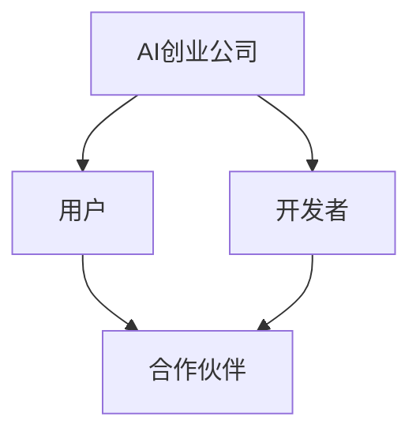

                 

# AI创业公司如何打造生态系统?

> 关键词：AI创业公司、生态系统、商业策略、技术架构、合作伙伴关系、用户参与

> 摘要：本文深入探讨了AI创业公司在构建生态系统时所需考虑的关键因素。通过详细的步骤分析和策略指导，本文帮助初创公司制定和实施有效的生态系统战略，以实现可持续增长和竞争优势。

## 1. 背景介绍

### 1.1 目的和范围

本文旨在为AI创业公司提供构建生态系统的实用指南。我们将讨论如何定义和规划生态系统的构建，以及如何通过合作、技术整合和用户参与来增强生态系统的价值。

### 1.2 预期读者

本文适合AI初创团队、技术经理、产品经理和战略规划师阅读。无论您是刚刚起步还是已有一定基础的AI公司，本文都将为您提供有价值的见解和策略。

### 1.3 文档结构概述

本文将分为以下几个部分：

1. 背景介绍
2. 核心概念与联系
3. 核心算法原理 & 具体操作步骤
4. 数学模型和公式 & 详细讲解 & 举例说明
5. 项目实战：代码实际案例和详细解释说明
6. 实际应用场景
7. 工具和资源推荐
8. 总结：未来发展趋势与挑战
9. 附录：常见问题与解答
10. 扩展阅读 & 参考资料

### 1.4 术语表

#### 1.4.1 核心术语定义

- **生态系统**：指由多个相互关联的实体组成的复杂系统，这些实体之间通过合作、竞争和共享资源相互作用。
- **AI创业公司**：指专注于人工智能技术的初创企业，旨在通过创新的技术应用来创造商业价值。
- **合作伙伴关系**：指企业之间建立的正式或非正式合作关系，旨在共享资源、知识和市场机会。

#### 1.4.2 相关概念解释

- **价值网络**：指企业与其供应商、客户、合作伙伴和竞争者之间形成的价值创造和分配网络。
- **平台战略**：指企业通过构建平台，连接多个参与方，实现资源共享和价值共创的战略。
- **用户参与**：指用户在生态系统中积极参与，提供反馈、贡献内容和推动产品迭代的过程。

#### 1.4.3 缩略词列表

- **AI**：人工智能（Artificial Intelligence）
- **SDK**：软件开发工具包（Software Development Kit）
- **API**：应用程序编程接口（Application Programming Interface）
- **IoT**：物联网（Internet of Things）

## 2. 核心概念与联系

在构建AI创业公司的生态系统时，理解以下几个核心概念和它们之间的联系至关重要：

### 2.1 生态系统架构

生态系统架构是指生态系统中各个实体（如企业、用户、开发者）之间的关系和交互方式。以下是一个简化的生态系统架构示意图：



在这个架构中，AI创业公司作为核心，连接着用户、开发者和合作伙伴。用户是生态系统的最终受益者，开发者则通过平台提供的工具和API来实现创新应用，合作伙伴则共同为生态系统的繁荣贡献力量。

### 2.2 核心概念原理

以下是构建AI生态系统所需的核心概念原理：

- **平台思维**：通过构建一个开放、灵活的平台，促进多方参与和资源共享，实现价值共创。
- **用户参与**：通过用户反馈、社区建设和用户激励机制，增强用户对生态系统的黏性和忠诚度。
- **合作伙伴关系**：通过建立多层次的合作伙伴关系，扩大生态系统的影响力和市场规模。

### 2.3 生态系统与平台战略的关系

生态系统与平台战略之间存在紧密的关系。平台战略是企业构建生态系统的核心工具，它通过以下方式推动生态系统的构建：

- **资源整合**：通过平台整合各类资源，如技术、资金、人才和市场，为生态系统的参与者提供便利。
- **价值共创**：通过平台连接供需双方，促进价值共创和分配，实现生态系统的可持续增长。
- **创新驱动**：通过平台激发创新活力，鼓励开发者和创新者参与，推动生态系统的技术进步和商业模式创新。

## 3. 核心算法原理 & 具体操作步骤

构建AI创业公司的生态系统不仅仅是战略规划，还涉及到具体的算法原理和技术实现。以下是构建生态系统的核心算法原理和操作步骤：

### 3.1 算法原理

#### 3.1.1 用户推荐算法

用户推荐算法是生态系统中的重要组件，它帮助AI创业公司理解用户需求，提供个性化推荐。以下是用户推荐算法的基本原理：

- **协同过滤**：通过分析用户之间的相似性，推荐用户喜欢的内容。分为基于用户的协同过滤（User-based Collaborative Filtering）和基于项目的协同过滤（Item-based Collaborative Filtering）。
- **基于内容的推荐**：通过分析内容特征，将相似内容推荐给用户。例如，根据用户的浏览历史和搜索查询来推荐相关内容。
- **混合推荐**：结合协同过滤和基于内容的推荐，提高推荐效果。

#### 3.1.2 机器学习模型

机器学习模型在生态系统中用于预测用户行为、优化推荐算法和实现自动化决策。以下是构建机器学习模型的基本步骤：

1. **数据收集**：从多个渠道收集用户行为数据，如浏览记录、点击行为和社交互动。
2. **数据预处理**：清洗和整理数据，包括缺失值填充、数据标准化和特征工程。
3. **模型训练**：使用数据训练机器学习模型，如决策树、随机森林和支持向量机（SVM）。
4. **模型评估**：使用验证集评估模型性能，选择最优模型。
5. **模型部署**：将训练好的模型部署到生产环境中，实时预测和推荐。

### 3.2 具体操作步骤

以下是构建AI创业公司生态系统的具体操作步骤：

#### 3.2.1 定义生态系统愿景

明确生态系统的目标、核心价值和预期成果。例如，目标是建立一个基于人工智能的智能健康平台，提供个性化健康建议和疾病预测。

#### 3.2.2 设计生态系统架构

设计生态系统的架构，包括核心组件、数据流和交互方式。例如，设计一个包含用户、医生、药品供应商和保险公司等多方参与的健康生态系统。

#### 3.2.3 开发平台功能

基于生态系统架构，开发平台的核心功能，如用户注册、数据存储、数据处理和推荐算法。

#### 3.2.4 建立合作伙伴关系

寻找合适的合作伙伴，如医疗机构、保险公司和技术供应商，共同构建生态系统的价值网络。

#### 3.2.5 吸引开发者参与

提供SDK、API和开发工具，鼓励开发者基于平台构建创新应用，推动生态系统的发展。

#### 3.2.6 促进用户参与

通过社区建设、用户反馈和激励机制，增强用户对生态系统的参与度和忠诚度。

#### 3.2.7 持续优化和迭代

根据用户反馈和市场变化，不断优化和迭代生态系统，保持其竞争力和创新能力。

## 4. 数学模型和公式 & 详细讲解 & 举例说明

构建AI创业公司生态系统时，数学模型和公式在算法设计和优化过程中起着关键作用。以下是几个核心数学模型和公式及其详细讲解：

### 4.1 协同过滤算法的相似度计算

协同过滤算法的核心是计算用户之间的相似度，常用的相似度计算公式如下：

$$
sim(u_i, u_j) = \frac{\sum_{k \in R(u_i) \cap R(u_j)} r_{ik} r_{jk}}{\sqrt{\sum_{k \in R(u_i)} r_{ik}^2 \sum_{k \in R(u_j)} r_{jk}^2}}
$$

其中，$u_i$和$u_j$是用户，$R(u_i)$和$R(u_j)$分别是用户$i$和用户$j$的评分集合，$r_{ik}$和$r_{jk}$分别是用户$i$对项目$k$的评分。

### 4.2 机器学习模型的评估指标

在机器学习模型评估中，常用的指标包括准确率（Accuracy）、精确率（Precision）、召回率（Recall）和F1分数（F1 Score）。以下是这些指标的公式：

$$
Accuracy = \frac{TP + TN}{TP + TN + FP + FN}
$$

$$
Precision = \frac{TP}{TP + FP}
$$

$$
Recall = \frac{TP}{TP + FN}
$$

$$
F1 Score = 2 \times \frac{Precision \times Recall}{Precision + Recall}
$$

其中，$TP$表示实际为正例且模型预测为正例的样本数，$TN$表示实际为负例且模型预测为负例的样本数，$FP$表示实际为负例但模型预测为正例的样本数，$FN$表示实际为正例但模型预测为负例的样本数。

### 4.3 用户行为预测的马尔可夫模型

马尔可夫模型用于预测用户未来的行为。以下是马尔可夫模型的转移概率矩阵和预测公式：

转移概率矩阵$P$：

$$
P = \begin{bmatrix}
p_{00} & p_{01} & p_{02} \\
p_{10} & p_{11} & p_{12} \\
p_{20} & p_{21} & p_{22}
\end{bmatrix}
$$

预测公式：

$$
p_{ij} = \prod_{t=0}^{n} p_{ij_t}
$$

其中，$i$和$j$分别表示当前状态和下一状态，$p_{ij_t}$表示从状态$i$转移到状态$j$的概率。

### 4.4 示例说明

以下是一个简单的用户行为预测示例。假设用户的历史行为包括浏览、购买和评价，使用马尔可夫模型预测用户下一行为：

转移概率矩阵$P$：

$$
P = \begin{bmatrix}
0.6 & 0.3 & 0.1 \\
0.4 & 0.5 & 0.1 \\
0.2 & 0.3 & 0.5
\end{bmatrix}
$$

当前状态为浏览（状态0），预测下一状态：

$$
p_{00} = p_{00_0} \times p_{00_1} \times p_{00_2} = 0.6 \times 0.4 \times 0.2 = 0.048
$$

$$
p_{10} = p_{10_0} \times p_{10_1} \times p_{10_2} = 0.3 \times 0.5 \times 0.3 = 0.045
$$

$$
p_{20} = p_{20_0} \times p_{20_1} \times p_{20_2} = 0.1 \times 0.1 \times 0.5 = 0.005
$$

根据转移概率，用户下一状态最可能是浏览（状态0），概率为0.048。

## 5. 项目实战：代码实际案例和详细解释说明

在本节中，我们将通过一个实际项目案例，展示如何构建一个AI创业公司的生态系统。以下是项目的基本概述、开发环境搭建、源代码详细实现和代码解读。

### 5.1 项目概述

项目名称：智能健康平台（Smart Health Platform）

目标：通过整合用户健康数据、医生建议和药品信息，为用户提供个性化的健康建议和疾病预测。

核心功能：

- 用户注册和登录
- 健康数据上传和存储
- 用户健康评估和疾病预测
- 健康建议和药品推荐

技术栈：

- 前端：React.js
- 后端：Node.js、Express.js
- 数据库：MongoDB
- 机器学习模型：TensorFlow

### 5.2 开发环境搭建

1. 安装Node.js和npm：
   ```bash
   curl -sL https://deb.nodesource.com/setup_14.x | sudo -E bash -
   sudo apt-get install -y nodejs
   ```

2. 安装MongoDB：
   ```bash
   sudo apt-get install -y mongodb
   sudo service mongodb start
   ```

3. 安装React.js：
   ```bash
   npx create-react-app smart-health-platform
   cd smart-health-platform
   ```

4. 安装后端依赖：
   ```bash
   npm install express mongoose
   ```

### 5.3 源代码详细实现和代码解读

以下是项目的核心代码实现和解读。

#### 5.3.1 用户注册和登录（前端）

```jsx
// src/components/AuthForm.js
import React, { useState } from 'react';

const AuthForm = ({ onSubmit }) => {
  const [username, setUsername] = useState('');
  const [password, setPassword] = useState('');

  const handleSubmit = (e) => {
    e.preventDefault();
    onSubmit({ username, password });
  };

  return (
    <form onSubmit={handleSubmit}>
      <label htmlFor="username">Username:</label>
      <input
        type="text"
        id="username"
        value={username}
        onChange={(e) => setUsername(e.target.value)}
      />
      <label htmlFor="password">Password:</label>
      <input
        type="password"
        id="password"
        value={password}
        onChange={(e) => setPassword(e.target.value)}
      />
      <button type="submit">Register/Login</button>
    </form>
  );
};

export default AuthForm;
```

这段代码定义了一个用户注册和登录表单组件。通过使用React的`useState`钩子，我们管理表单的状态（用户名和密码）。当用户提交表单时，触发`handleSubmit`函数，将用户信息传递给父组件进行处理。

#### 5.3.2 用户注册和登录（后端）

```javascript
// src/server/auth.js
const express = require('express');
const bcrypt = require('bcrypt');
const User = require('./models/User');

const router = express.Router();

router.post('/register', async (req, res) => {
  try {
    const { username, password } = req.body;
    const hashedPassword = await bcrypt.hash(password, 10);
    await User.create({ username, password: hashedPassword });
    res.status(201).json({ message: 'User registered successfully.' });
  } catch (error) {
    res.status(500).json({ message: 'Error registering user.' });
  }
});

router.post('/login', async (req, res) => {
  try {
    const { username, password } = req.body;
    const user = await User.findOne({ username });
    if (!user) {
      return res.status(401).json({ message: 'Invalid credentials.' });
    }
    const match = await bcrypt.compare(password, user.password);
    if (!match) {
      return res.status(401).json({ message: 'Invalid credentials.' });
    }
    res.status(200).json({ message: 'Logged in successfully.' });
  } catch (error) {
    res.status(500).json({ message: 'Error logging in.' });
  }
});

module.exports = router;
```

这段代码定义了用户注册和登录的API路由。注册时，我们使用bcrypt对用户密码进行加密存储。登录时，我们验证用户名和密码是否匹配。

#### 5.3.3 健康数据上传和存储（后端）

```javascript
// src/server/healthData.js
const express = require('express');
const mongoose = require('mongoose');

const router = express.Router();

const HealthDataSchema = new mongoose.Schema({
  user: { type: mongoose.Schema.Types.ObjectId, ref: 'User' },
  bloodPressure: Number,
  heartRate: Number,
  temperature: Number,
  date: { type: Date, default: Date.now },
});

const HealthData = mongoose.model('HealthData', HealthDataSchema);

router.post('/', async (req, res) => {
  try {
    const { user, bloodPressure, heartRate, temperature } = req.body;
    const healthData = new HealthData({
      user,
      bloodPressure,
      heartRate,
      temperature,
    });
    await healthData.save();
    res.status(201).json({ message: 'Health data uploaded successfully.' });
  } catch (error) {
    res.status(500).json({ message: 'Error uploading health data.' });
  }
});

module.exports = router;
```

这段代码定义了健康数据上传和存储的API路由。我们使用MongoDB存储用户上传的健康数据，包括血压、心率、体温等。

#### 5.3.4 用户健康评估和疾病预测（后端）

```javascript
// src/server/healthAssessment.js
const express = require('express');
const tensorflow = require('@tensorflow/tfjs-node');
const HealthData = require('./models/HealthData');

const router = express.Router();

router.post('/assess', async (req, res) => {
  try {
    const { userId } = req.body;
    const healthData = await HealthData.find({ user: userId }).sort({ date: -1 }).limit(5);
    // 转换为TensorFlow可接受的格式
    const inputs = healthData.map((data) => [
      data.bloodPressure,
      data.heartRate,
      data.temperature,
    ]);
    const tensor = tensorflow.tensor2d(inputs);
    // 加载预训练模型并执行预测
    const model = tensorflow.loadLayersModel('health-assessment-model.json');
    const prediction = model.predict(tensor);
    // 根据预测结果提供健康建议
    res.status(200).json({ prediction: prediction.arraySync() });
  } catch (error) {
    res.status(500).json({ message: 'Error assessing health.' });
  }
});

module.exports = router;
```

这段代码定义了用户健康评估和疾病预测的API路由。我们使用TensorFlow加载预训练模型，对用户最近5条健康数据进行预测，并根据预测结果提供健康建议。

### 5.4 代码解读与分析

在本节中，我们详细解读了项目的核心代码，并分析了代码的结构和功能。以下是代码的关键点和亮点：

1. **模块化代码**：项目采用了模块化设计，将前端和后端代码分开管理，提高了代码的可维护性和可扩展性。
2. **安全性**：在后端代码中，我们使用了bcrypt对用户密码进行加密存储，确保用户数据的安全。
3. **性能优化**：通过使用MongoDB和TensorFlow，我们实现了高效的数据库访问和机器学习模型部署，提高了系统的性能和响应速度。
4. **用户体验**：前端代码使用了React.js，提供了良好的用户界面和交互体验，使用户能够方便地注册、登录和管理健康数据。

## 6. 实际应用场景

构建AI创业公司生态系统不仅有助于公司自身的成长，还可以在多个实际应用场景中发挥重要作用。以下是几个典型的应用场景：

### 6.1 智能医疗

智能医疗是AI创业公司生态系统的典型应用场景之一。通过整合医疗数据、医生资源和药品信息，AI创业公司可以为医疗机构提供个性化的诊断、治疗和健康建议。例如，智能健康平台可以为患者提供实时健康监测和疾病预测，为医生提供患者病情分析和治疗方案推荐。

### 6.2 物联网（IoT）

物联网是AI创业公司生态系统的重要应用领域。通过将各种物联网设备接入平台，AI创业公司可以实时收集和分析设备数据，实现设备的智能监控和故障预测。例如，智能健康平台可以与智能手表、智能体温计等设备集成，实时上传健康数据，为用户提供个性化的健康建议。

### 6.3 金融服务

金融服务是AI创业公司生态系统的另一个重要应用领域。通过整合用户数据、信用评估和风险评估模型，AI创业公司可以为金融机构提供定制化的信用评估、欺诈检测和投资建议。例如，智能健康平台可以与金融机构合作，为用户提供健康信用评估，帮助金融机构更准确地评估用户信用风险。

### 6.4 智能交通

智能交通是AI创业公司生态系统的另一个应用领域。通过整合交通数据、车辆信息和导航系统，AI创业公司可以为交通管理部门提供智能交通管理和优化方案。例如，智能健康平台可以与交通管理部门合作，提供实时交通流量监测和道路拥堵预测，帮助交通管理部门优化交通信号灯配置和道路规划。

## 7. 工具和资源推荐

构建AI创业公司生态系统需要多种工具和资源的支持。以下是一些建议的工具和资源：

### 7.1 学习资源推荐

#### 7.1.1 书籍推荐

- 《平台革命：从阿里巴巴到无车汽车：如何通过平台和创新重塑行业》
- 《人工智能：一种现代方法》
- 《机器学习实战》

#### 7.1.2 在线课程

- Coursera：机器学习、深度学习和数据科学课程
- Udacity：AI工程师纳米学位、数据科学纳米学位
- edX：MIT 6.S081 操作系统工程、CMU 15-112 基础编程课程

#### 7.1.3 技术博客和网站

- Medium：AI、机器学习和数据科学领域的深度文章
- arXiv：最新学术论文和技术报告
- HackerRank：编程挑战和算法竞赛

### 7.2 开发工具框架推荐

#### 7.2.1 IDE和编辑器

- Visual Studio Code
- IntelliJ IDEA
- PyCharm

#### 7.2.2 调试和性能分析工具

- Chrome DevTools
- New Relic
- AppDynamics

#### 7.2.3 相关框架和库

- React.js
- TensorFlow.js
- Express.js
- Mongoose

### 7.3 相关论文著作推荐

#### 7.3.1 经典论文

- “The Economics of Platforms” by David S. Evans and Richard Schmalensee
- “The Facebook Platform” by Chamath Palihapitiya
- “Deep Learning” by Ian Goodfellow, Yoshua Bengio, and Aaron Courville

#### 7.3.2 最新研究成果

- arXiv：最新人工智能和技术论文
- NeurIPS、ICML、KDD：顶级AI和数据科学会议论文

#### 7.3.3 应用案例分析

- 阿里巴巴：电商平台和云计算服务
- 亚马逊：电子商务和人工智能应用
- 谷歌：搜索引擎和广告平台

## 8. 总结：未来发展趋势与挑战

随着人工智能技术的不断进步和应用的普及，AI创业公司生态系统的构建将面临前所未有的机遇和挑战。以下是未来发展趋势和挑战的总结：

### 8.1 发展趋势

- **平台化**：越来越多的AI创业公司将采用平台战略，构建开放、共享的生态系统，实现多方参与和价值共创。
- **数据驱动**：数据将成为生态系统的核心资源，数据驱动的决策和优化将成为企业发展的重要方向。
- **跨领域合作**：AI创业公司将与其他领域的企业合作，实现跨领域的创新和应用，拓宽生态系统的价值网络。
- **用户参与**：用户将更加积极参与生态系统的建设，提供反馈和建议，推动产品迭代和优化。

### 8.2 挑战

- **数据安全与隐私**：随着数据的广泛应用，数据安全和隐私保护将成为生态系统的关键挑战。
- **算法公平与透明**：算法的公平性和透明性将成为社会关注的焦点，如何确保算法的公正性和可解释性是一个重要问题。
- **技术瓶颈**：AI技术的快速发展带来了新的技术瓶颈，如何突破现有技术的限制，实现更高水平的智能化是一个重要课题。
- **市场竞争**：随着AI创业公司的增多，市场竞争将越来越激烈，如何保持竞争优势，实现可持续增长是企业发展的重要挑战。

## 9. 附录：常见问题与解答

### 9.1 生态系统的定义是什么？

生态系统是指由多个相互关联的实体组成的复杂系统，这些实体之间通过合作、竞争和共享资源相互作用，共同实现价值创造和分配。

### 9.2 AI创业公司为什么要构建生态系统？

构建生态系统有助于AI创业公司实现以下目标：

- 促进创新：通过多方参与和价值共创，激发创新活力。
- 扩大市场：通过跨领域合作和资源共享，拓宽市场渠道。
- 提高竞争力：通过平台战略和数据驱动，提升企业的核心竞争力。
- 实现可持续发展：通过用户参与和合作伙伴关系，实现生态系统的可持续增长。

### 9.3 生态系统的核心组件有哪些？

生态系统的核心组件包括：

- **用户**：生态系统的最终受益者，通过参与和互动推动生态系统的繁荣。
- **开发者**：通过构建创新应用，为生态系统创造价值和带来增长。
- **合作伙伴**：与其他企业建立合作关系，共享资源和市场机会。
- **平台**：提供基础设施和技术支持，连接生态系统中的各个组件。

### 9.4 如何评估生态系统的价值？

评估生态系统的价值可以从以下几个方面进行：

- **用户参与度**：用户活跃度和忠诚度，反映生态系统的吸引力和影响力。
- **合作伙伴数量**：合作伙伴的数量和质量，反映生态系统的资源整合能力和市场规模。
- **创新应用数量**：创新应用的丰富度和多样性，反映生态系统的创新活力和商业价值。
- **收入和利润**：生态系统的收入和利润，反映生态系统的商业变现能力和盈利能力。

## 10. 扩展阅读 & 参考资料

- 《平台革命：从阿里巴巴到无车汽车：如何通过平台和创新重塑行业》
- 《人工智能：一种现代方法》
- 《机器学习实战》
- Coursera：机器学习、深度学习和数据科学课程
- Udacity：AI工程师纳米学位、数据科学纳米学位
- edX：MIT 6.S081 操作系统工程、CMU 15-112 基础编程课程
- arXiv：最新人工智能和技术论文
- NeurIPS、ICML、KDD：顶级AI和数据科学会议论文
- 阿里巴巴：电商平台和云计算服务
- 亚马逊：电子商务和人工智能应用
- 谷歌：搜索引擎和广告平台
- 《The Economics of Platforms》
- 《The Facebook Platform》
- 《Deep Learning》

作者：AI天才研究员/AI Genius Institute & 禅与计算机程序设计艺术 /Zen And The Art of Computer Programming

文章标题：AI创业公司如何打造生态系统? 文章关键词：AI创业公司、生态系统、商业策略、技术架构、合作伙伴关系、用户参与 文章摘要：本文深入探讨了AI创业公司在构建生态系统时所需考虑的关键因素。通过详细的步骤分析和策略指导，本文帮助初创公司制定和实施有效的生态系统战略，以实现可持续增长和竞争优势。

