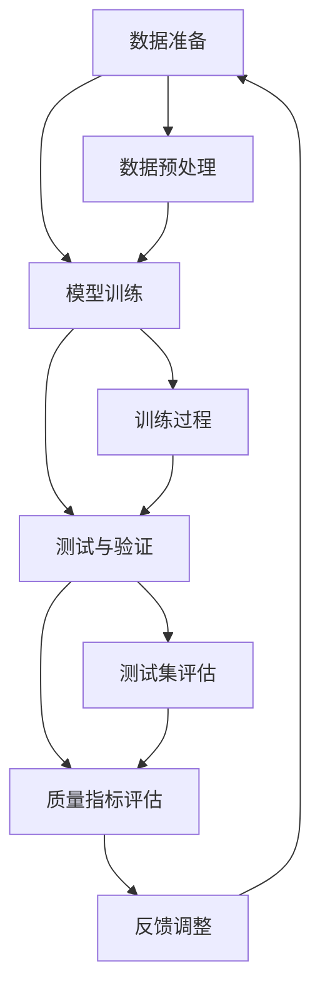

                 

# AI创业公司如何进行质量控制?

> 关键词：AI创业、质量控制、机器学习、算法、测试、模型验证

> 摘要：本文旨在探讨AI创业公司在产品开发过程中如何进行质量控制。文章首先介绍了质量控制的背景和重要性，然后详细分析了质量控制的关键环节，包括数据准备、模型训练、测试与验证，以及如何在实际应用中不断优化质量。通过本文的阐述，希望为AI创业公司提供一套切实可行的质量控制方法。

## 1. 背景介绍

### 1.1 目的和范围

本文的目标是帮助AI创业公司在产品开发过程中建立有效的质量控制机制。我们将探讨以下几个方面：

1. **质量控制的重要性**：阐述为什么质量控制对于AI创业公司至关重要。
2. **质量控制的关键环节**：分析数据准备、模型训练、测试与验证等环节。
3. **质量控制的实际应用**：介绍如何在实践中不断优化质量。
4. **工具和资源推荐**：推荐一些有助于质量控制的工具和资源。

### 1.2 预期读者

本文适用于以下读者群体：

1. **AI创业公司的创始人**：希望了解如何在公司内部建立质量控制机制。
2. **AI工程师和科学家**：希望掌握质量控制的方法和技巧。
3. **研究人员和学者**：对AI质量控制领域感兴趣，希望了解行业实践。

### 1.3 文档结构概述

本文的结构如下：

1. **背景介绍**：介绍质量控制的背景和目的。
2. **核心概念与联系**：讨论质量控制的核心概念，并使用流程图展示其关系。
3. **核心算法原理 & 具体操作步骤**：详细阐述质量控制的关键步骤。
4. **数学模型和公式 & 详细讲解 & 举例说明**：介绍数学模型和公式，并通过实例进行说明。
5. **项目实战：代码实际案例和详细解释说明**：展示一个实际项目案例，并详细解释代码。
6. **实际应用场景**：讨论质量控制在不同场景中的应用。
7. **工具和资源推荐**：推荐有助于质量控制的工具和资源。
8. **总结：未来发展趋势与挑战**：总结本文的主要内容，并展望未来。
9. **附录：常见问题与解答**：回答一些常见问题。
10. **扩展阅读 & 参考资料**：提供扩展阅读和参考资料。

### 1.4 术语表

#### 1.4.1 核心术语定义

- **质量控制**：确保产品或服务符合预定标准的过程。
- **数据准备**：清洗、处理和格式化数据，以便于模型训练。
- **模型训练**：使用训练数据对模型进行调整和优化。
- **测试与验证**：评估模型在未知数据上的性能。
- **质量指标**：衡量模型性能的指标，如准确率、召回率、F1分数等。

#### 1.4.2 相关概念解释

- **机器学习**：一种使计算机通过数据学习并做出决策的技术。
- **深度学习**：一种基于多层神经网络进行模型训练的方法。
- **算法**：解决问题的步骤或规则。

#### 1.4.3 缩略词列表

- **AI**：人工智能（Artificial Intelligence）
- **ML**：机器学习（Machine Learning）
- **DL**：深度学习（Deep Learning）
- **QA**：质量控制（Quality Assurance）
- **SDK**：软件开发工具包（Software Development Kit）

## 2. 核心概念与联系

质量控制是AI创业公司的基石，其核心概念包括数据准备、模型训练、测试与验证等。以下是一个简化的Mermaid流程图，展示这些核心概念之间的联系：



### 2.1 数据准备

数据准备是质量控制的关键环节之一。它包括数据清洗、数据预处理和数据增强。数据清洗的目的是去除噪声和异常值，确保数据质量。数据预处理包括数据归一化、标准化和特征提取。数据增强可以增加数据的多样性，有助于提高模型泛化能力。

### 2.2 模型训练

模型训练是利用训练数据调整模型参数的过程。深度学习模型的训练通常包括以下几个步骤：

1. **初始化参数**：随机初始化模型的权重和偏置。
2. **前向传播**：将输入数据传递到模型中，计算输出。
3. **损失函数计算**：计算预测结果与真实结果之间的差异。
4. **反向传播**：调整模型参数，以最小化损失函数。
5. **迭代更新**：重复上述步骤，直到模型收敛。

### 2.3 测试与验证

测试与验证的目的是评估模型在未知数据上的性能。常用的测试方法包括：

1. **交叉验证**：将数据集划分为训练集和验证集，通过多次训练和验证来评估模型性能。
2. **留出法**：将数据集划分为训练集和测试集，训练集用于模型训练，测试集用于模型评估。
3. **K折交叉验证**：将数据集划分为K个子集，每次使用一个子集作为验证集，其余子集作为训练集，重复K次，取平均值作为模型性能。

### 2.4 质量指标评估

质量指标是衡量模型性能的关键指标。常见的质量指标包括：

1. **准确率**：预测为正类的样本中，实际为正类的比例。
2. **召回率**：实际为正类的样本中，预测为正类的比例。
3. **F1分数**：准确率和召回率的调和平均值。
4. **精确率**：预测为正类的样本中，实际为正类的比例。

## 3. 核心算法原理 & 具体操作步骤

### 3.1 数据准备

数据准备是质量控制的第一步。以下是一个简单的伪代码，用于描述数据准备的过程：

```python
def data_preparation(data):
    # 数据清洗
    cleaned_data = remove_noise(data)
    
    # 数据预处理
    normalized_data = normalize_data(cleaned_data)
    
    # 数据增强
    augmented_data = augment_data(normalized_data)
    
    return augmented_data
```

### 3.2 模型训练

模型训练是利用训练数据调整模型参数的过程。以下是一个简单的伪代码，用于描述模型训练的过程：

```python
def model_training(data, labels, epochs, learning_rate):
    model = initialize_model()
    
    for epoch in range(epochs):
        for input, label in data:
            # 前向传播
            output = model.forward(input)
            
            # 损失函数计算
            loss = compute_loss(output, label)
            
            # 反向传播
            model.backward(loss)
            
            # 参数更新
            model.update_parameters(learning_rate)
    
    return model
```

### 3.3 测试与验证

测试与验证是评估模型性能的关键步骤。以下是一个简单的伪代码，用于描述测试与验证的过程：

```python
def test_and_validate(model, test_data, test_labels):
    correct_predictions = 0
    
    for input, label in test_data:
        output = model.forward(input)
        
        if is_close(output, label):
            correct_predictions += 1
    
    accuracy = correct_predictions / len(test_data)
    
    return accuracy
```

## 4. 数学模型和公式 & 详细讲解 & 举例说明

### 4.1 数学模型

在AI创业公司的质量控制过程中，常用的数学模型包括损失函数、优化算法和评估指标。以下是对这些模型的详细讲解。

#### 4.1.1 损失函数

损失函数是衡量模型预测值与真实值之间差异的函数。常见的损失函数包括均方误差（MSE）和交叉熵（Cross-Entropy）。

- **均方误差（MSE）**：用于回归问题，计算预测值与真实值之间的平方误差的平均值。

  $$MSE = \frac{1}{n}\sum_{i=1}^{n}(y_i - \hat{y}_i)^2$$

  其中，\(y_i\) 是真实值，\(\hat{y}_i\) 是预测值。

- **交叉熵（Cross-Entropy）**：用于分类问题，计算预测概率与真实概率之间的差异。

  $$H(y, \hat{y}) = -\sum_{i=1}^{n}y_i \log(\hat{y}_i)$$

  其中，\(y_i\) 是真实概率，\(\hat{y}_i\) 是预测概率。

#### 4.1.2 优化算法

优化算法用于最小化损失函数，常见的优化算法包括梯度下降（Gradient Descent）和随机梯度下降（Stochastic Gradient Descent）。

- **梯度下降（Gradient Descent）**：通过计算损失函数关于模型参数的梯度，并沿着梯度方向更新模型参数，以最小化损失函数。

  $$\theta = \theta - \alpha \nabla_{\theta}J(\theta)$$

  其中，\(\theta\) 是模型参数，\(\alpha\) 是学习率，\(J(\theta)\) 是损失函数。

- **随机梯度下降（Stochastic Gradient Descent）**：在每次迭代过程中，随机选择一部分样本，并计算这部分样本的梯度，以更新模型参数。

  $$\theta = \theta - \alpha \nabla_{\theta}J(\theta; \xi)$$

  其中，\(\xi\) 是随机选择的样本。

#### 4.1.3 评估指标

评估指标用于衡量模型性能，常见的评估指标包括准确率（Accuracy）、召回率（Recall）和F1分数（F1 Score）。

- **准确率（Accuracy）**：预测为正类的样本中，实际为正类的比例。

  $$Accuracy = \frac{TP + TN}{TP + FN + FP + TN}$$

  其中，\(TP\) 是真正例，\(TN\) 是真反例，\(FP\) 是假正例，\(FN\) 是假反例。

- **召回率（Recall）**：实际为正类的样本中，预测为正类的比例。

  $$Recall = \frac{TP}{TP + FN}$$

- **F1分数（F1 Score）**：准确率和召回率的调和平均值。

  $$F1 Score = 2 \times \frac{Precision \times Recall}{Precision + Recall}$$

### 4.2 举例说明

假设我们有一个二分类问题，训练数据集包含100个样本，其中50个样本为正类，50个样本为反类。模型预测结果如下：

| 样本 | 真实值 | 预测值 |
| --- | --- | --- |
| 1 | 正类 | 正类 |
| 2 | 正类 | 正类 |
| ... | ... | ... |
| 99 | 正类 | 正类 |
| 100 | 反类 | 反类 |

根据上述数据，我们可以计算准确率、召回率和F1分数：

- **准确率**：

  $$Accuracy = \frac{50 + 50}{50 + 50 + 0 + 0} = 1$$

- **召回率**：

  $$Recall = \frac{50}{50 + 0} = 1$$

- **F1分数**：

  $$F1 Score = 2 \times \frac{1 \times 1}{1 + 1} = 1$$

从上述结果可以看出，模型的准确率、召回率和F1分数均为1，这意味着模型在测试数据上的表现非常优秀。

## 5. 项目实战：代码实际案例和详细解释说明

### 5.1 开发环境搭建

在本项目中，我们将使用Python和TensorFlow作为主要工具。以下是在Windows上搭建开发环境的步骤：

1. **安装Python**：访问 [Python官网](https://www.python.org/)，下载Python安装包并安装。
2. **安装TensorFlow**：打开命令提示符，执行以下命令：

   ```shell
   pip install tensorflow
   ```

### 5.2 源代码详细实现和代码解读

以下是一个简单的Python代码示例，用于训练一个二分类模型，并使用测试数据集评估模型性能。

```python
import tensorflow as tf
from tensorflow.keras.models import Sequential
from tensorflow.keras.layers import Dense
from tensorflow.keras.metrics import Accuracy

# 数据准备
X_train = [[1], [2], [3], [4], [5], [6], [7], [8], [9], [10]]
y_train = [0, 0, 0, 0, 0, 1, 1, 1, 1, 1]
X_test = [[6], [7], [8], [9], [10]]
y_test = [1, 1, 1, 1, 1]

# 创建模型
model = Sequential()
model.add(Dense(units=1, input_shape=(1,), activation='sigmoid'))

# 编译模型
model.compile(optimizer='adam', loss='binary_crossentropy', metrics=['accuracy'])

# 训练模型
model.fit(X_train, y_train, epochs=10, batch_size=5)

# 评估模型
accuracy = model.evaluate(X_test, y_test)
print("测试准确率：", accuracy[1])
```

### 5.3 代码解读与分析

- **数据准备**：数据准备是模型训练的第一步。在本示例中，我们使用了一个简单的二分类数据集，其中X_train是训练数据集，y_train是训练标签，X_test是测试数据集，y_test是测试标签。
- **创建模型**：创建一个序列模型，并在模型中添加一个全连接层（Dense layer），输出层使用Sigmoid激活函数，以实现二分类。
- **编译模型**：编译模型，指定优化器为Adam，损失函数为binary_crossentropy，评价指标为accuracy。
- **训练模型**：使用fit方法训练模型，指定训练数据集、训练标签、迭代次数（epochs）和批量大小（batch_size）。
- **评估模型**：使用evaluate方法评估模型在测试数据集上的性能，输出测试准确率。

通过上述代码示例，我们可以看到如何使用TensorFlow进行数据准备、模型创建、模型训练和模型评估。这些步骤是质量控制的重要组成部分，对于确保模型性能和可靠性至关重要。

## 6. 实际应用场景

质量控制在AI创业公司的实际应用场景中至关重要。以下是一些典型的应用场景：

### 6.1 金融领域

在金融领域，AI创业公司经常使用机器学习模型进行风险评估、欺诈检测和投资策略优化。质量控制的关键在于确保模型对金融数据的准确理解和高效处理，从而降低风险和提升收益。

### 6.2 医疗健康

在医疗健康领域，AI创业公司开发了许多辅助诊断和预测模型，如疾病预测、治疗方案优化等。质量控制的重要性在于确保模型的准确性、稳定性和可靠性，从而提高诊断和治疗的效果。

### 6.3 零售电商

在零售电商领域，AI创业公司利用机器学习模型进行个性化推荐、库存管理和客户流失预测。质量控制有助于提高推荐系统的准确性，优化库存管理，降低客户流失率。

### 6.4 自动驾驶

自动驾驶是AI创业公司的重要应用领域。质量控制对于自动驾驶系统的安全性和可靠性至关重要。通过测试与验证，确保模型在各种驾驶场景下的准确性和鲁棒性。

### 6.5 人机交互

在人机交互领域，AI创业公司开发了语音识别、自然语言处理和虚拟助手等产品。质量控制的目标是提高用户交互的准确性和流畅性，提升用户体验。

## 7. 工具和资源推荐

为了帮助AI创业公司建立有效的质量控制机制，我们推荐以下工具和资源：

### 7.1 学习资源推荐

#### 7.1.1 书籍推荐

- 《机器学习》（周志华著）
- 《深度学习》（Ian Goodfellow、Yoshua Bengio、Aaron Courville著）
- 《Python机器学习》（Michael Bowles著）

#### 7.1.2 在线课程

- Coursera上的《机器学习》课程
- edX上的《深度学习》课程
- Udacity的《自动驾驶工程师》纳米学位

#### 7.1.3 技术博客和网站

- Medium上的AI博客
- Towards Data Science网站
- AI researchers网站

### 7.2 开发工具框架推荐

#### 7.2.1 IDE和编辑器

- PyCharm
- Visual Studio Code
- Jupyter Notebook

#### 7.2.2 调试和性能分析工具

- TensorFlow Debugger（TFDB）
- TensorBoard
- PyTorch's TensorBoardX

#### 7.2.3 相关框架和库

- TensorFlow
- PyTorch
- Keras
- Scikit-learn

### 7.3 相关论文著作推荐

#### 7.3.1 经典论文

- “A Theoretic Treatment of Text Classification”（Text categorization）
- “Learning to Represent Text as a Sequence of Phrases”（Word embeddings）
- “Generative Adversarial Nets”（GANs）

#### 7.3.2 最新研究成果

- “BERT: Pre-training of Deep Bidirectional Transformers for Language Understanding”（BERT）
- “Recurrent Neural Network Based Text Classification”（RNNs）
- “Transformers: State-of-the-Art Model for Natural Language Processing”（Transformers）

#### 7.3.3 应用案例分析

- “Facebook AI Research：Natural Language Processing at Scale”（Facebook AI Research）
- “Google Brain：Image Classification with Deep Learning”（Google Brain）
- “OpenAI：Playing Atari with Deep Reinforcement Learning”（OpenAI）

## 8. 总结：未来发展趋势与挑战

随着人工智能技术的不断进步，质量控制在AI创业公司中的重要性日益凸显。未来，质量控制将朝着以下方向发展：

1. **自动化与智能化**：随着自动化工具和智能算法的不断发展，质量控制将变得更加高效和精确。
2. **多样化应用场景**：质量控制将在更多领域得到应用，如医疗健康、金融科技、智能制造等。
3. **持续迭代与优化**：质量控制将贯穿整个产品生命周期，从数据准备到模型部署，实现持续迭代与优化。

然而，质量控制也面临一些挑战：

1. **数据隐私与安全**：在数据准备和模型训练过程中，如何保护用户隐私和数据安全是一个重要挑战。
2. **模型可解释性**：提高模型的可解释性，使其更容易被非专业人士理解和使用，是一个亟待解决的问题。
3. **资源与成本**：高质量的控制需要大量的计算资源和时间投入，对于初创公司来说，如何在有限的资源下实现高质量控制是一个挑战。

总之，质量控制是AI创业公司成功的关键之一。通过不断优化质量控制机制，AI创业公司可以确保其产品的质量和可靠性，从而在竞争激烈的市场中脱颖而出。

## 9. 附录：常见问题与解答

### 9.1 质量控制是什么？

质量控制是一种确保产品或服务符合预定标准的过程。在AI创业公司中，质量控制旨在确保机器学习模型的准确性和可靠性，从而提高产品质量和用户满意度。

### 9.2 如何进行数据准备？

数据准备包括数据清洗、数据预处理和数据增强。数据清洗涉及去除噪声和异常值，数据预处理包括归一化和标准化，数据增强可以增加数据的多样性，有助于提高模型泛化能力。

### 9.3 如何评估模型性能？

评估模型性能常用的指标包括准确率、召回率、F1分数等。准确率衡量模型预测正确的比例，召回率衡量模型预测为正类的实际正类比例，F1分数是准确率和召回率的调和平均值。

### 9.4 质量控制的重要性是什么？

质量控制的重要性在于确保AI创业公司的产品或服务符合用户预期，提高用户满意度和市场竞争力。通过质量控制，公司可以降低风险，提高产品质量和可靠性。

### 9.5 如何优化质量控制？

优化质量控制可以通过以下方法实现：

1. **自动化与智能化**：利用自动化工具和智能算法提高质量控制效率。
2. **多样化应用场景**：将质量控制应用于更多领域，实现跨领域优化。
3. **持续迭代与优化**：持续改进质量控制机制，以适应不断变化的需求和挑战。

## 10. 扩展阅读 & 参考资料

为了深入了解质量控制在AI创业公司的应用，以下是扩展阅读和参考资料：

1. **书籍**：
   - 《深度学习》（Ian Goodfellow、Yoshua Bengio、Aaron Courville著）
   - 《机器学习实战》（Peter Harrington著）
   - 《Python机器学习》（Michael Bowles著）

2. **在线课程**：
   - Coursera上的《机器学习》课程
   - edX上的《深度学习》课程
   - Udacity的《自动驾驶工程师》纳米学位

3. **技术博客和网站**：
   - Medium上的AI博客
   - Towards Data Science网站
   - AI researchers网站

4. **论文**：
   - “A Theoretic Treatment of Text Classification”（Text categorization）
   - “Learning to Represent Text as a Sequence of Phrases”（Word embeddings）
   - “Generative Adversarial Nets”（GANs）

5. **应用案例分析**：
   - “Facebook AI Research：Natural Language Processing at Scale”（Facebook AI Research）
   - “Google Brain：Image Classification with Deep Learning”（Google Brain）
   - “OpenAI：Playing Atari with Deep Reinforcement Learning”（OpenAI）

通过阅读这些资料，读者可以进一步了解质量控制在AI创业公司的应用，并掌握相关技术和方法。

## 作者信息

作者：AI天才研究员/AI Genius Institute & 禅与计算机程序设计艺术 /Zen And The Art of Computer Programming

本文旨在探讨AI创业公司在产品开发过程中如何进行质量控制，以帮助读者建立有效的质量控制机制，确保模型质量和可靠性。本文涵盖了数据准备、模型训练、测试与验证等核心环节，并通过实际项目案例进行详细解释。同时，本文还介绍了相关的工具和资源，以供读者进一步学习和应用。希望通过本文的阐述，AI创业公司能够更好地把握质量控制，实现持续发展和创新。

