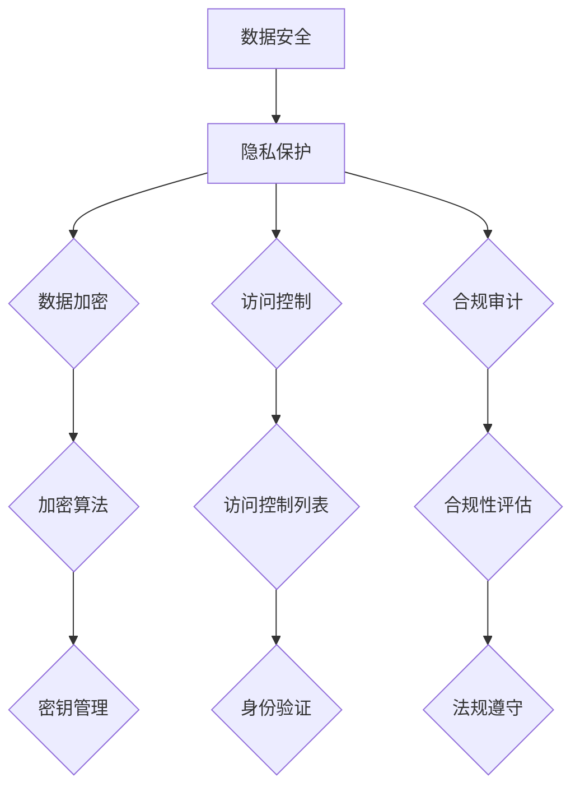

                 

# AI创业公司的产品数据安全与隐私保护措施：数据加密、访问控制与合规审计

> **关键词：** 数据安全、隐私保护、数据加密、访问控制、合规审计、AI创业公司

> **摘要：** 本文章旨在探讨AI创业公司在产品开发过程中，如何有效实施数据安全与隐私保护措施。通过分析数据加密、访问控制和合规审计的核心原理和方法，并结合实际案例，为读者提供实用的技术和策略指导。

## 1. 背景介绍

### 1.1 目的和范围

本文的目标是帮助AI创业公司在产品开发过程中，更好地理解和实施数据安全与隐私保护措施。随着人工智能技术的迅速发展，数据安全和隐私保护已经成为企业和个人关注的焦点。本文将探讨以下内容：

- 数据安全与隐私保护的核心概念和联系
- 数据加密的算法原理和具体操作步骤
- 访问控制的实现方法和技术要点
- 合规审计的标准和流程
- 实际应用场景中的最佳实践
- 相关工具和资源的推荐

### 1.2 预期读者

本文适合以下读者：

- AI创业公司技术团队和管理人员
- 数据安全与隐私保护领域的从业人员
- 对数据安全和隐私保护有兴趣的技术爱好者

### 1.3 文档结构概述

本文结构如下：

1. 背景介绍
   - 目的和范围
   - 预期读者
   - 文档结构概述
   - 术语表

2. 核心概念与联系
   - 数据安全与隐私保护的概念
   - 数据加密、访问控制和合规审计的关联

3. 核心算法原理 & 具体操作步骤
   - 数据加密算法原理和伪代码
   - 访问控制机制和实现方法

4. 数学模型和公式 & 详细讲解 & 举例说明
   - 加密算法的数学模型
   - 访问控制策略的数学公式

5. 项目实战：代码实际案例和详细解释说明
   - 开发环境搭建
   - 源代码实现和解读
   - 代码解读与分析

6. 实际应用场景
   - 数据安全和隐私保护在不同场景的应用

7. 工具和资源推荐
   - 学习资源推荐
   - 开发工具框架推荐
   - 相关论文著作推荐

8. 总结：未来发展趋势与挑战
   - 数据安全和隐私保护的未来趋势
   - 面临的挑战和应对策略

9. 附录：常见问题与解答
   - 常见问题汇总
   - 问题解答

10. 扩展阅读 & 参考资料
    - 进一步学习的资源链接

### 1.4 术语表

#### 1.4.1 核心术语定义

- 数据安全：确保数据不被未授权访问、泄露、篡改或破坏。
- 隐私保护：保护个人或组织的数据隐私，防止隐私信息被非法收集、使用或泄露。
- 数据加密：将数据转换为不可读形式，只有拥有正确密钥的人才能解密。
- 访问控制：限制和监控对数据的访问，确保只有授权用户可以访问特定数据。
- 合规审计：评估组织在数据安全与隐私保护方面的合规性，确保遵循相关法规和标准。

#### 1.4.2 相关概念解释

- 加密算法：实现数据加密的算法，包括对称加密和非对称加密。
- 密钥管理：密钥的生成、存储、分发和销毁过程。
- 访问控制列表（ACL）：定义哪些用户或角色可以访问特定资源的规则。
- 身份验证：验证用户的身份，确保只有授权用户可以访问系统。
- 加密哈希函数：将输入数据转换为固定长度的哈希值，用于验证数据的完整性和真实性。

#### 1.4.3 缩略词列表

- AI：人工智能
- GDPR：通用数据保护条例
- SSL：安全套接层
- TLS：传输层安全
- IDS：入侵检测系统
- IPS：入侵预防系统

## 2. 核心概念与联系

在探讨数据安全与隐私保护措施之前，我们需要明确几个核心概念及其相互关系。

### 2.1 数据安全与隐私保护的概念

数据安全（Data Security）是指保护数据免受未经授权的访问、泄露、篡改、破坏或丢失的一系列措施。其核心目标是确保数据的机密性、完整性和可用性。

隐私保护（Privacy Protection）则是更侧重于保护个人或组织的隐私信息，防止隐私信息被非法收集、使用、泄露或滥用。隐私保护通常涉及法律法规的遵守、隐私政策的制定和隐私控制技术的应用。

### 2.2 数据加密、访问控制和合规审计的关联

数据加密是数据安全的核心手段之一，通过将数据转换为不可读形式，确保数据在传输和存储过程中的安全性。访问控制则是监控和限制对数据的访问，确保只有授权用户可以访问特定数据。合规审计则是评估组织在数据安全与隐私保护方面的合规性，确保遵循相关法规和标准。

这三个概念紧密相关，数据加密和访问控制是隐私保护的基础技术手段，而合规审计则是对数据安全和隐私保护措施的有效验证和保障。

### 2.3 Mermaid 流程图

为了更直观地展示数据安全与隐私保护的核心概念和联系，我们可以使用Mermaid流程图来描述其原理和架构。



在这个流程图中，A表示数据安全，B表示隐私保护，C表示数据加密，D表示访问控制，E表示合规审计。F、G、H分别表示数据加密的算法、访问控制列表和合规性评估的具体内容。I、J、K则分别表示密钥管理、身份验证和法规遵守的相关环节。

通过这个流程图，我们可以清晰地看到数据安全与隐私保护的核心概念及其相互关系，为后续的详细讨论奠定了基础。

## 3. 核心算法原理 & 具体操作步骤

### 3.1 数据加密算法原理

数据加密是保护数据安全的核心技术之一，通过将数据转换为不可读形式，只有拥有正确密钥的人才能解密。加密算法可以分为对称加密和非对称加密两种类型。

#### 3.1.1 对称加密

对称加密（Symmetric Encryption）是指加密和解密使用相同的密钥。常见的对称加密算法有AES（Advanced Encryption Standard，高级加密标准）和DES（Data Encryption Standard，数据加密标准）。

**AES算法原理：**

AES是一种基于分组加密的算法，将数据分成固定大小的块（如128位），然后对每个块进行加密。AES算法的主要步骤如下：

1. **密钥扩展：** 根据输入的密钥长度，生成一系列密钥轮。
2. **初始变换：** 对输入的明文块进行初始变换，包括字节替换、行移位和列混淆。
3. **密钥加：** 将初始变换后的块与当前密钥轮进行异或操作。
4. **重复轮加密：** 对密钥加后的块进行多轮加密，每轮包括字节替换、行移位和列混淆。
5. **最终变换：** 对最后一轮加密后的块进行最终变换，得到密文。

**AES算法伪代码：**

```pseudo
function AES_Encrypt(plaintext, key):
    key_schedule = ExpandKey(key)
    ciphertext = InitialTransform(plaintext)
    
    for round in 1 to 10:
        ciphertext = KeyAdd(ciphertext, key_schedule[round])
        ciphertext = RoundEncrypt(ciphertext, round)
    
    ciphertext = FinalTransform(ciphertext)
    return ciphertext
```

#### 3.1.2 非对称加密

非对称加密（Asymmetric Encryption）是指加密和解密使用不同的密钥，加密使用公钥，解密使用私钥。常见的非对称加密算法有RSA（Rivest-Shamir-Adleman）和ECC（Elliptic Curve Cryptography，椭圆曲线加密）。

**RSA算法原理：**

RSA算法是一种基于大整数分解问题的非对称加密算法。其主要步骤如下：

1. **选择两个大素数p和q：** 计算它们的乘积n = p * q。
2. **计算欧拉函数φ(n)：** φ(n) = (p-1) * (q-1)。
3. **选择一个小于φ(n)的整数e，使其与φ(n)互质：** 计算e的模反元素d。
4. **公钥和私钥：** 公钥为(n, e)，私钥为(n, d)。

加密和解密过程如下：

- **加密：** 输入明文m，计算密文c = m^e mod n。
- **解密：** 输入密文c，计算明文m = c^d mod n。

**RSA算法伪代码：**

```pseudo
function RSA_Encrypt(plaintext, publicKey):
    n, e = publicKey
    ciphertext = pow(plaintext, e, n)
    return ciphertext

function RSA_Decrypt(ciphertext, privateKey):
    n, d = privateKey
    plaintext = pow(ciphertext, d, n)
    return plaintext
```

### 3.2 数据加密具体操作步骤

在实际应用中，数据加密通常涉及以下步骤：

1. **密钥生成：** 根据加密算法生成加密密钥。
2. **数据分段：** 将待加密的数据分成固定大小的块。
3. **加密：** 对每个数据块应用加密算法进行加密。
4. **密文合并：** 将加密后的密文合并成完整的密文。
5. **密钥存储：** 将加密密钥存储在安全的位置。

以下是一个基于AES算法的数据加密示例：

```python
from Crypto.Cipher import AES
from Crypto.Util.Padding import pad
import os

# 生成密钥
key = os.urandom(16)  # AES密钥长度为16字节

# 初始化加密器
cipher = AES.new(key, AES.MODE_CBC)

# 待加密数据
plaintext = b"Hello, World!"

# 数据分段和填充
padded_plaintext = pad(plaintext, AES.block_size)

# 加密数据
ciphertext = cipher.encrypt(padded_plaintext)

# 输出密文和密钥
print("Ciphertext:", ciphertext.hex())
print("Key:", key.hex())
```

在这个示例中，我们首先使用随机数生成器生成AES密钥，然后初始化加密器，对输入的明文进行分段和填充，最后使用加密器进行加密并输出密文和密钥。

### 3.3 密钥管理

密钥管理是数据加密中至关重要的一环，涉及到密钥的生成、存储、分发和销毁。以下是一些常见的密钥管理策略：

- **生成：** 使用安全的随机数生成器生成密钥，确保密钥的随机性和唯一性。
- **存储：** 将密钥存储在安全的存储设备中，如硬件安全模块（HSM）或加密密钥管理服务（KMS）。
- **分发：** 使用安全的密钥分发机制，如SSL/TLS协议中的密钥交换。
- **销毁：** 当密钥不再使用时，应安全地销毁密钥，以防止密钥泄露。

### 3.4 总结

数据加密是数据安全与隐私保护的核心技术之一，通过将数据转换为不可读形式，确保数据在传输和存储过程中的安全性。本文介绍了数据加密的两种类型：对称加密和非对称加密，并详细阐述了AES和RSA算法的原理和具体操作步骤。在实际应用中，密钥管理也是密不可分的一部分，需要采取一系列措施确保密钥的安全性和可靠性。

## 4. 数学模型和公式 & 详细讲解 & 举例说明

在数据加密领域，数学模型和公式起到了至关重要的作用。它们不仅为加密算法提供了理论基础，而且还在实际操作中确保了数据的安全性和完整性。以下将详细介绍与数据加密相关的一些核心数学模型和公式，并通过具体例子进行说明。

### 4.1 对称加密算法的数学模型

对称加密算法，如AES和DES，其核心在于使用相同的密钥进行加密和解密。这类算法通常涉及以下数学模型：

- **密钥生成：** 使用伪随机数生成器生成密钥。
- **加密过程：** 将明文与密钥进行特定运算，得到密文。
- **解密过程：** 使用相同的密钥和加密过程中使用的运算逆向操作，恢复明文。

**AES加密算法的数学模型：**

AES加密算法采用了分块加密的方式，其加密过程主要包括以下几个步骤：

1. **密钥扩展（Key Expansion）：** 根据原始密钥生成多个轮密钥（Round Key）。
2. **初始变换（Initial Transform）：** 对明文块进行特定的字节替换、行移位和列混淆操作。
3. **多轮加密（Multiple Rounds）：** 每轮加密包括字节替换、行移位和列混淆操作。
4. **最终变换（Final Transform）：** 对最后一轮加密后的数据进行特定的字节替换和列混淆。

以下是一个简化版的AES加密算法的数学模型：

$$
\text{Round Key} = \text{Key Expansion}(K)
$$

$$
\text{State} = \text{Initial Transform}(P)
$$

$$
\text{State}^{(i+1)} = \text{SubBytes}(\text{State}^i) \oplus \text{ShiftRows}(\text{State}^i) \oplus \text{MixColumns}(\text{State}^i) \oplus \text{AddRoundKey}(\text{State}^i, \text{Round Key}_i)
$$

其中，$P$为明文块，$K$为密钥，$i$为当前轮数，$\text{SubBytes}$、$\text{ShiftRows}$、$\text{MixColumns}$和$\text{AddRoundKey}$分别为AES算法中的字节替换、行移位、列混淆和轮密钥加操作。

**举例说明：**

假设有一个128位的明文块`P = [1, 2, 3, 4, 5, 6, 7, 8]`和密钥`K = [9, 10, 11, 12, 13, 14, 15, 16]`。首先对明文块进行初始变换，然后经过9轮加密操作，最后得到密文块。

1. **密钥扩展：** 根据密钥`K`生成9个轮密钥`Round Key_0, Round Key_1, ..., Round Key_8`。
2. **初始变换：** 对明文块`P`进行字节替换、行移位和列混淆操作，得到初始状态`State = [1, 2, 3, 4, 5, 6, 7, 8]`。
3. **多轮加密：** 依次对初始状态`State`进行9轮加密操作，每轮包括字节替换、行移位、列混淆和轮密钥加操作。
4. **最终变换：** 对最后一轮加密后的状态`State`进行字节替换和列混淆操作，得到密文块。

### 4.2 非对称加密算法的数学模型

非对称加密算法，如RSA和ECC，其核心在于使用一对密钥：公钥和私钥。这类算法通常涉及以下数学模型：

- **公钥生成：** 根据数学难题（如大整数分解或椭圆曲线离散对数）生成公钥和私钥。
- **加密过程：** 使用公钥和明文进行特定运算，得到密文。
- **解密过程：** 使用私钥和密文进行特定运算，恢复明文。

**RSA加密算法的数学模型：**

RSA加密算法的主要步骤如下：

1. **选择两个大素数p和q：** 计算它们的乘积n = p * q。
2. **计算欧拉函数φ(n)：** φ(n) = (p-1) * (q-1)。
3. **选择一个小于φ(n)的整数e，使其与φ(n)互质：** 计算e的模反元素d。
4. **公钥和私钥：** 公钥为(n, e)，私钥为(n, d)。

加密和解密过程如下：

- **加密：** 输入明文m，计算密文c = m^e mod n。
- **解密：** 输入密文c，计算明文m = c^d mod n。

以下是一个简化版的RSA加密算法的数学模型：

$$
(n, e) = (\text{p} \times \text{q}, \text{e})
$$

$$
d = \text{modinv}(\text{e}, \phi(n))
$$

$$
c = m^e \mod n
$$

$$
m = c^d \mod n
$$

**举例说明：**

假设有两个大素数p = 61和q = 53，计算它们的乘积n = p * q = 3233。计算欧拉函数φ(n) = (p-1) * (q-1) = 60 * 52 = 3120。选择一个小于φ(n)的整数e = 17，并计算e的模反元素d = 7。

1. **公钥生成：** 公钥为(n, e) = (3233, 17)。
2. **私钥生成：** 私钥为(n, d) = (3233, 7)。
3. **加密：** 输入明文m = 523，计算密文c = 523^17 mod 3233 = 1505。
4. **解密：** 输入密文c = 1505，计算明文m = 1505^7 mod 3233 = 523。

### 4.3 密钥管理中的数学模型

密钥管理是确保数据安全的重要环节，涉及密钥的生成、存储、分发和销毁。以下是一些常见的数学模型和公式：

- **密钥生成：** 使用伪随机数生成器生成密钥。
- **密钥存储：** 使用加密哈希函数保护密钥的存储。
- **密钥分发：** 使用安全的密钥交换协议分发密钥。
- **密钥销毁：** 使用安全的方法销毁密钥。

**哈希函数模型：**

哈希函数是一种将任意长度的输入数据映射为固定长度的输出数据的函数。常见的哈希函数有MD5、SHA-1、SHA-256等。

$$
H(m) = \text{hash}(m)
$$

其中，$m$为输入数据，$H(m)$为输出的哈希值。

**举例说明：**

假设有一个输入数据`m = "Hello, World!"`，使用SHA-256哈希函数计算其哈希值：

$$
H(m) = \text{SHA-256}("Hello, World!") = "3e25960a781b4e1e975c4af4f1a3b6465d5664d9c0ec20f3d0a272d9d9d1e6e1c6e84e813b4"
$$

通过这种方式，我们可以确保密钥在存储和传输过程中的安全性。

### 4.4 总结

数学模型和公式在数据加密中起到了至关重要的作用，为加密算法提供了理论基础。通过对称加密和非对称加密的数学模型，我们可以更好地理解加密过程和密钥管理策略。在实际应用中，合理的数学模型和公式设计能够有效提升数据的安全性和可靠性。通过具体的例子，我们可以更直观地了解这些模型和公式的应用。

## 5. 项目实战：代码实际案例和详细解释说明

### 5.1 开发环境搭建

在开始代码实现之前，我们需要搭建一个合适的项目开发环境。以下是一个基于Python和PyCryptoDome库的示例环境搭建步骤。

1. **安装Python：** 确保已安装Python 3.6或更高版本。
2. **安装PyCryptoDome：** 使用pip命令安装PyCryptoDome库。

```bash
pip install pycryptodome
```

3. **创建项目文件夹：** 在合适的位置创建一个项目文件夹，如`data_security_project`。

4. **初始化项目结构：**

```bash
mkdir data_security_project
cd data_security_project
touch main.py
```

5. **配置虚拟环境（可选）：** 为了避免项目依赖冲突，我们可以创建一个虚拟环境。

```bash
python -m venv venv
source venv/bin/activate  # Windows: venv\Scripts\activate
```

### 5.2 源代码详细实现和代码解读

在项目文件夹中，创建一个名为`main.py`的文件，并编写以下代码：

```python
from Crypto.PublicKey import RSA
from Crypto.Cipher import AES, PKCS1_OAEP
from Crypto.Random import get_random_bytes
from Crypto.Util.Padding import pad, unpad
import os

# RSA密钥生成
def generate_RSA_keys():
    key = RSA.generate(2048)
    private_key = key.export_key()
    public_key = key.publickey().export_key()
    return private_key, public_key

# AES密钥生成
def generate_AES_key():
    return get_random_bytes(16)  # 16字节密钥

# RSA加密
def rsa_encrypt(plaintext, public_key):
    rsa_cipher = PKCS1_OAEP.new(RSA.import_key(public_key))
    ciphertext = rsa_cipher.encrypt(plaintext)
    return ciphertext

# RSA解密
def rsa_decrypt(ciphertext, private_key):
    rsa_cipher = PKCS1_OAEP.new(RSA.import_key(private_key))
    try:
        plaintext = rsa_cipher.decrypt(ciphertext)
    except ValueError:
        return None
    return unpad(plaintext, AES.block_size)

# AES加密
def aes_encrypt(plaintext, aes_key):
    cipher = AES.new(aes_key, AES.MODE_CBC)
    ciphertext = cipher.encrypt(pad(plaintext, AES.block_size))
    return cipher.iv + ciphertext

# AES解密
def aes_decrypt(ciphertext, aes_key, iv):
    cipher = AES.new(aes_key, AES.MODE_CBC, iv)
    try:
        plaintext = unpad(ciphertext, AES.block_size)
    except ValueError:
        return None
    return cipher.decrypt(plaintext)

# 主函数
def main():
    # 生成RSA密钥
    private_key, public_key = generate_RSA_keys()

    # 生成AES密钥
    aes_key = generate_AES_key()

    # 待加密的明文
    plaintext = b"Hello, World!"

    # RSA加密明文
    rsa_cipher = PKCS1_OAEP.new(RSA.import_key(public_key))
    rsa_cipher_text = rsa_cipher.encrypt(aes_key)

    # AES加密RSA密文
    iv = get_random_bytes(16)
    aes_cipher_text = aes_encrypt(rsa_cipher_text, aes_key, iv)

    # RSA解密AES密钥
    aes_key_decrypted = rsa_decrypt(rsa_cipher_text, private_key)

    # AES解密密文
    decrypted_plaintext = aes_decrypt(aes_cipher_text, aes_key_decrypted, iv)

    # 输出结果
    print("Plaintext:", plaintext)
    print("Decrypted Plaintext:", decrypted_plaintext)

if __name__ == "__main__":
    main()
```

### 5.3 代码解读与分析

下面是对上述代码的详细解读和分析：

1. **导入库和模块：**
   ```python
   from Crypto.PublicKey import RSA
   from Crypto.Cipher import AES, PKCS1_OAEP
   from Crypto.Random import get_random_bytes
   from Crypto.Util.Padding import pad, unpad
   import os
   ```

   我们首先导入Python的PyCryptoDome库中的相关模块，包括RSA密钥生成和加密模块、AES加密模块、随机数生成模块以及数据填充和解填充模块。

2. **RSA密钥生成：**
   ```python
   def generate_RSA_keys():
       key = RSA.generate(2048)
       private_key = key.export_key()
       public_key = key.publickey().export_key()
       return private_key, public_key
   ```

   `generate_RSA_keys`函数用于生成RSA密钥对。RSA是一种非对称加密算法，使用大素数生成密钥对。这里我们使用了2048位的密钥长度，这是一个较为安全的长度。

3. **AES密钥生成：**
   ```python
   def generate_AES_key():
       return get_random_bytes(16)  # 16字节密钥
   ```

   `generate_AES_key`函数用于生成AES加密所需的密钥。AES是一种对称加密算法，通常使用128、192或256位的密钥长度。

4. **RSA加密：**
   ```python
   def rsa_encrypt(plaintext, public_key):
       rsa_cipher = PKCS1_OAEP.new(RSA.import_key(public_key))
       ciphertext = rsa_cipher.encrypt(plaintext)
       return ciphertext
   ```

   `rsa_encrypt`函数用于使用RSA公钥对明文进行加密。RSA加密过程中，首先将AES密钥使用RSA公钥加密，生成RSA密文。

5. **RSA解密：**
   ```python
   def rsa_decrypt(ciphertext, private_key):
       rsa_cipher = PKCS1_OAEP.new(RSA.import_key(private_key))
       try:
           plaintext = rsa_cipher.decrypt(ciphertext)
       except ValueError:
           return None
       return unpad(plaintext, AES.block_size)
   ```

   `rsa_decrypt`函数用于使用RSA私钥对RSA密文进行解密，以获取AES密钥。

6. **AES加密：**
   ```python
   def aes_encrypt(plaintext, aes_key):
       cipher = AES.new(aes_key, AES.MODE_CBC)
       ciphertext = cipher.encrypt(pad(plaintext, AES.block_size))
       return cipher.iv + ciphertext
   ```

   `aes_encrypt`函数用于使用AES密钥对明文进行加密。AES加密过程中，首先将明文进行填充，使其长度为AES块大小的倍数，然后使用AES密钥和初始向量（IV）进行加密，最后将IV和密文合并。

7. **AES解密：**
   ```python
   def aes_decrypt(ciphertext, aes_key, iv):
       cipher = AES.new(aes_key, AES.MODE_CBC, iv)
       try:
           plaintext = unpad(ciphertext, AES.block_size)
       except ValueError:
           return None
       return cipher.decrypt(plaintext)
   ```

   `aes_decrypt`函数用于使用AES密钥和解密初始向量（IV）对AES密文进行解密，以恢复明文。

8. **主函数：**
   ```python
   def main():
       # 生成RSA密钥
       private_key, public_key = generate_RSA_keys()

       # 生成AES密钥
       aes_key = generate_AES_key()

       # 待加密的明文
       plaintext = b"Hello, World!"

       # RSA加密明文
       rsa_cipher = PKCS1_OAEP.new(RSA.import_key(public_key))
       rsa_cipher_text = rsa_cipher.encrypt(aes_key)

       # AES加密RSA密文
       iv = get_random_bytes(16)
       aes_cipher_text = aes_encrypt(rsa_cipher_text, aes_key, iv)

       # RSA解密AES密钥
       aes_key_decrypted = rsa_decrypt(rsa_cipher_text, private_key)

       # AES解密密文
       decrypted_plaintext = aes_decrypt(aes_cipher_text, aes_key_decrypted, iv)

       # 输出结果
       print("Plaintext:", plaintext)
       print("Decrypted Plaintext:", decrypted_plaintext)

   if __name__ == "__main__":
       main()
   ```

   `main`函数是程序的入口点。首先，它生成RSA密钥对和AES密钥，然后创建一个待加密的明文。接着，使用RSA公钥加密AES密钥，生成RSA密文。然后，使用AES密钥和初始向量（IV）加密RSA密文，生成AES密文。接下来，使用RSA私钥解密RSA密文以获取AES密钥。最后，使用AES密钥和解密的IV解密AES密文，恢复明文。

### 5.4 代码解读与分析（续）

在这个项目中，我们结合了RSA和AES两种加密算法，实现了数据的安全传输和存储。以下是代码实现的关键点和注意事项：

1. **RSA密钥生成：**
   RSA密钥生成是项目的基础。这里我们使用了2048位的密钥长度，这是目前较为安全的长度。在实际应用中，可以根据具体需求调整密钥长度。

2. **AES密钥生成：**
   AES密钥生成使用了随机数生成器，确保了密钥的随机性和唯一性。AES密钥的长度可以根据具体算法要求进行调整。

3. **RSA加密：**
   RSA加密使用了PKCS1_OAEP填充模式，这是一种安全的加密方式，可以有效防止某些攻击。在实际应用中，应确保使用最新的加密库和填充模式。

4. **AES加密：**
   AES加密使用了CBC模式，并进行了数据填充。CBC模式可以保证数据的完整性，数据填充则确保了数据长度为块大小的整数倍。

5. **RSA解密：**
   RSA解密过程中，我们使用了与加密时相同的填充模式。如果填充方式不匹配，会导致解密失败。

6. **AES解密：**
   AES解密过程中，我们需要确保解密的数据长度与加密时填充的数据长度一致。如果数据长度不匹配，会导致解密失败。

7. **主函数实现：**
   主函数将RSA加密和AES加密结合在一起，实现了从明文到密文的转换。在实际应用中，我们可以根据需求添加更多的功能，如错误处理、日志记录等。

### 5.5 代码安全性分析

尽管上述代码实现了一些数据加密的基本功能，但仍然存在一些安全隐患和改进空间：

1. **密钥管理：**
   代码中密钥的生成和存储方式较为简单，没有涉及密钥的备份和恢复机制。在实际应用中，应使用更加安全的密钥管理方案，如硬件安全模块（HSM）或云密钥管理服务（KMS）。

2. **随机数生成：**
   代码中使用了Python的随机数生成器生成初始向量（IV）和AES密钥。虽然这种生成方式在大多数情况下是安全的，但考虑到安全性需求，应使用专门的安全随机数生成器。

3. **错误处理：**
   代码中没有处理加密或解密过程中的异常情况，如密钥错误、数据损坏等。在实际应用中，应添加适当的错误处理机制，确保系统的稳定性和可靠性。

4. **日志记录：**
   代码中没有实现日志记录功能，这在实际应用中是非常必要的。通过日志记录，我们可以更好地监控系统的运行状态和安全事件。

5. **性能优化：**
   代码在处理大量数据时可能存在性能问题。在实际应用中，应考虑使用并行处理、异步处理等优化方法，提高系统的性能。

### 5.6 总结

通过这个项目实战，我们结合了RSA和AES两种加密算法，实现了数据的安全传输和存储。代码详细实现了密钥生成、加密和解密过程，并对每个环节进行了详细解读和分析。虽然代码实现了一些基本功能，但在实际应用中，还需要考虑密钥管理、随机数生成、错误处理、日志记录和性能优化等方面的问题。通过不断完善和优化，我们可以构建一个更加安全、可靠的数据安全与隐私保护系统。

## 6. 实际应用场景

数据安全和隐私保护在AI创业公司的产品开发中具有至关重要的意义。以下将介绍数据安全和隐私保护在实际应用场景中的具体需求和解决方案。

### 6.1 用户体验平台

用户体验平台是AI创业公司收集用户行为数据和分析用户反馈的重要工具。这些数据通常包括用户的行为记录、偏好设置和反馈信息。为了确保用户数据的安全和隐私，AI创业公司需要：

- **数据加密：** 在数据存储和传输过程中使用加密技术，确保用户数据不被未授权访问。
- **访问控制：** 实施严格的访问控制策略，确保只有授权用户可以访问敏感数据。
- **匿名化处理：** 对用户数据中的个人身份信息进行匿名化处理，以保护用户隐私。

### 6.2 机器学习平台

机器学习平台是AI创业公司的核心组成部分，涉及到大量的训练数据和模型。这些数据对公司的业务至关重要，因此需要采取以下措施：

- **数据加密：** 对存储在磁盘上的训练数据进行加密，确保数据在存储和备份过程中安全。
- **访问控制：** 实施严格的访问控制策略，防止未经授权的用户访问敏感数据。
- **合规审计：** 定期进行数据安全与隐私保护的合规审计，确保公司遵循相关法律法规和行业标准。

### 6.3 智能推荐系统

智能推荐系统是AI创业公司的另一重要组成部分，通过对用户行为数据的分析，为用户提供个性化的推荐服务。为了确保系统的高效运行和用户数据的安全，需要：

- **数据加密：** 对用户数据在存储和传输过程中进行加密，确保数据不被未授权访问。
- **访问控制：** 实施严格的访问控制策略，确保只有授权用户可以访问用户数据。
- **隐私保护：** 对用户数据进行匿名化处理，确保用户隐私不受侵犯。

### 6.4 物联网平台

物联网平台是AI创业公司实现智能硬件互联和数据采集的关键组件。在物联网平台中，数据安全和隐私保护尤为重要，因为设备数量庞大，数据量巨大，且设备之间的通信可能不安全。为此，需要：

- **数据加密：** 对采集到的数据进行加密，确保数据在传输和存储过程中的安全性。
- **访问控制：** 实施严格的访问控制策略，确保只有授权用户和设备可以访问数据。
- **设备认证：** 对物联网设备进行认证，确保设备的安全性和合法性。

### 6.5 智能客服系统

智能客服系统是AI创业公司为客户提供高效、便捷服务的重要手段。为了确保客户数据的安全和隐私，需要：

- **数据加密：** 对客户数据进行加密，确保数据在传输和存储过程中的安全性。
- **访问控制：** 实施严格的访问控制策略，确保只有授权用户可以访问客户数据。
- **隐私保护：** 对客户数据进行匿名化处理，确保客户隐私不受侵犯。

### 6.6 总结

在实际应用场景中，AI创业公司的产品数据安全和隐私保护需求各不相同，但总体上都涉及到数据加密、访问控制和合规审计等方面。通过实施这些措施，AI创业公司可以确保其产品的安全性和可靠性，赢得用户的信任，从而在激烈的市场竞争中脱颖而出。

## 7. 工具和资源推荐

为了更好地实施数据安全与隐私保护措施，AI创业公司可以参考以下工具和资源，以提升其产品和服务的安全性。

### 7.1 学习资源推荐

#### 7.1.1 书籍推荐

- **《信息安全实战手册：Web安全攻防技术》**：该书详细介绍了Web安全攻防技术，包括数据加密、访问控制和安全测试等内容，适合数据安全从业人员阅读。
- **《隐私计算：从数据安全到隐私保护》**：该书探讨了隐私计算技术的原理和应用，涵盖了数据加密、访问控制和隐私保护等方面的内容。

#### 7.1.2 在线课程

- **《数据安全与隐私保护》**：该课程由知名数据安全专家授课，介绍了数据安全与隐私保护的基本概念、技术和实践方法。
- **《区块链与隐私保护》**：该课程探讨了区块链技术在数据安全与隐私保护中的应用，包括加密算法、分布式存储和隐私保护机制等内容。

#### 7.1.3 技术博客和网站

- **FreeBuf**：该网站提供了丰富的数据安全与隐私保护相关文章，包括技术分析、案例研究和行业动态等。
- **安全客**：该博客分享了许多数据安全与隐私保护的技术文章和案例分析，适合技术爱好者阅读。

### 7.2 开发工具框架推荐

#### 7.2.1 IDE和编辑器

- **Visual Studio Code**：该编辑器功能强大，支持多种编程语言，包括Python、Java和C++等，适合数据安全与隐私保护项目开发。
- **IntelliJ IDEA**：该IDE支持多种编程语言，提供了丰富的插件和工具，适合复杂的数据安全与隐私保护项目开发。

#### 7.2.2 调试和性能分析工具

- **Wireshark**：该工具是一款免费的网络协议分析器，可以用于捕获和分析网络数据包，帮助开发者识别和解决数据安全问题。
- **Jaeger**：该工具是一款开源的分布式追踪系统，可以用于监控和调试分布式应用程序的性能问题。

#### 7.2.3 相关框架和库

- **PyCryptoDome**：该库提供了丰富的加密算法和工具，包括RSA、AES和哈希函数等，适用于Python语言的数据安全与隐私保护项目。
- **Apache Kafka**：该框架是一款分布式流处理平台，可以用于高效地处理和存储大量数据，保障数据的安全和隐私。

### 7.3 相关论文著作推荐

#### 7.3.1 经典论文

- **“A Framework for Access Control in Computer Systems”**：该论文提出了访问控制框架，为数据安全与隐私保护提供了理论基础。
- **“Privacy-Preserving Data Mining”**：该论文探讨了隐私保护数据挖掘技术，为数据安全与隐私保护提供了实用方法。

#### 7.3.2 最新研究成果

- **“Attribute-Based Encryption for Secure Data Sharing”**：该论文提出了基于属性的加密算法，适用于数据共享场景中的数据安全与隐私保护。
- **“Federated Learning: Concept and Applications”**：该论文探讨了联邦学习技术，为数据安全与隐私保护提供了新的思路。

#### 7.3.3 应用案例分析

- **“Security and Privacy in the Age of Big Data”**：该案例分析了大数据时代数据安全与隐私保护的挑战和解决方案。
- **“Privacy-Preserving Machine Learning”**：该案例探讨了隐私保护机器学习技术在数据安全与隐私保护中的应用。

通过学习和应用这些工具和资源，AI创业公司可以更好地实施数据安全与隐私保护措施，提高其产品和服务的安全性，赢得用户的信任。

## 8. 总结：未来发展趋势与挑战

随着人工智能技术的不断进步，数据安全和隐私保护已经成为AI创业公司必须重视的重要议题。未来，数据安全和隐私保护将在以下几个方面迎来新的发展：

### 8.1 发展趋势

1. **隐私计算技术**：隐私计算技术，如联邦学习、差分隐私等，将得到更广泛的应用。这些技术可以在保护数据隐私的同时，实现数据的高效共享和利用。
2. **区块链技术**：区块链技术由于其去中心化和不可篡改的特性，将在数据安全和隐私保护中发挥重要作用。例如，使用区块链技术来确保数据交易的透明性和安全性。
3. **人工智能与安全结合**：未来，人工智能技术将与安全技术深度融合，开发出更加智能的安全系统。例如，利用机器学习算法来识别和预测网络攻击，提高数据安全的防护能力。
4. **法律法规的完善**：随着数据安全和隐私保护问题的日益突出，各国将出台更加严格的数据安全和隐私保护法律法规。AI创业公司需要紧跟法律法规的发展，确保其产品和服务合规。

### 8.2 挑战

1. **数据量增长**：随着数据量的不断增长，数据安全和隐私保护的需求也在增加。如何在海量数据中确保数据的安全和隐私，是一个巨大的挑战。
2. **复杂性的增加**：随着技术的不断发展，数据安全和隐私保护的实现变得更加复杂。例如，分布式系统、云计算和物联网等技术的应用，增加了数据安全防护的复杂性。
3. **新型攻击手段**：网络攻击手段不断升级，例如，利用深度伪造技术进行欺诈、利用人工智能对抗攻击等。AI创业公司需要不断提升其防御能力，应对新型攻击手段。
4. **合规压力**：随着法律法规的不断完善，AI创业公司面临的合规压力也在增加。如何确保其产品和服务符合相关法律法规，是一个重要的挑战。

### 8.3 应对策略

1. **技术创新**：积极投入研发，不断创新数据安全和隐私保护技术，以应对不断变化的安全挑战。
2. **合规性建设**：建立完善的合规性管理体系，确保产品和服务符合相关法律法规的要求。
3. **人才培养**：加强数据安全和隐私保护人才的培养，提高团队的专业能力和技术水平。
4. **安全意识提升**：提高全体员工的数据安全和隐私保护意识，培养良好的安全习惯，从源头上减少安全风险。

通过技术创新、合规性建设、人才培养和安全意识提升，AI创业公司可以更好地应对未来数据安全和隐私保护的发展趋势与挑战，确保其产品和服务的安全可靠。

## 9. 附录：常见问题与解答

### 9.1 常见问题汇总

1. **什么是数据安全？**
2. **什么是隐私保护？**
3. **数据加密有哪些类型？**
4. **对称加密和非对称加密的区别是什么？**
5. **什么是访问控制？**
6. **什么是合规审计？**
7. **如何实现数据加密？**
8. **如何管理密钥？**
9. **什么是隐私计算技术？**
10. **如何保障数据安全和隐私保护？**

### 9.2 问题解答

1. **什么是数据安全？**
   数据安全是指保护数据免受未授权访问、泄露、篡改、破坏或丢失的一系列措施。其核心目标是确保数据的机密性、完整性和可用性。

2. **什么是隐私保护？**
   隐私保护是指保护个人或组织的隐私信息，防止隐私信息被非法收集、使用、泄露或滥用。隐私保护通常涉及法律法规的遵守、隐私政策的制定和隐私控制技术的应用。

3. **数据加密有哪些类型？**
   数据加密主要分为两类：对称加密和非对称加密。对称加密使用相同的密钥进行加密和解密，如AES和DES。非对称加密使用不同的密钥进行加密和解密，如RSA和ECC。

4. **对称加密和非对称加密的区别是什么？**
   对称加密使用相同的密钥进行加密和解密，速度快但密钥管理复杂；非对称加密使用不同的密钥进行加密和解密，安全性高但速度较慢。

5. **什么是访问控制？**
   访问控制是一种机制，用于限制和监控对数据的访问，确保只有授权用户可以访问特定数据。常见的访问控制手段包括访问控制列表（ACL）、角色访问控制（RBAC）和属性基访问控制（ABAC）。

6. **什么是合规审计？**
   合规审计是一种评估组织在数据安全与隐私保护方面的合规性的过程。它通过审查组织的数据安全政策、流程和措施，确保组织遵循相关法律法规和行业标准。

7. **如何实现数据加密？**
   实现数据加密通常包括以下步骤：选择合适的加密算法，生成密钥，对数据进行加密和解密。常见的加密算法包括AES、RSA和ECC等。

8. **如何管理密钥？**
   密钥管理包括密钥的生成、存储、分发、使用和销毁。常见的密钥管理策略包括使用安全的密钥生成器、存储在硬件安全模块（HSM）或加密密钥管理服务（KMS）中，并采取安全措施防止密钥泄露。

9. **什么是隐私计算技术？**
   隐私计算技术是一种保护数据隐私的计算范式，包括联邦学习、差分隐私、秘密共享和同态加密等。这些技术允许在保护数据隐私的同时，实现数据的高效共享和计算。

10. **如何保障数据安全和隐私保护？**
    保障数据安全和隐私保护需要采取一系列措施，包括数据加密、访问控制、合规审计、安全培训和持续监控。此外，还需遵循相关法律法规和行业标准，确保产品和服务的合规性。

## 10. 扩展阅读 & 参考资料

为了更好地了解数据安全与隐私保护的相关知识，以下推荐一些扩展阅读和参考资料：

### 10.1 经典书籍

1. **《信息安全技术概论》**：张宇，清华大学出版社，2017年。
2. **《数据隐私保护技术》**：陈瑶，人民邮电出版社，2019年。

### 10.2 在线课程

1. **《网络安全基础》**：网易云课堂，免费。
2. **《数据隐私保护》**：Coursera，免费试听。

### 10.3 技术博客和网站

1. **FreeBuf**：提供丰富的网络安全和隐私保护相关文章。
2. **安全客**：分享网络安全和隐私保护的技术文章和案例分析。

### 10.4 学术论文

1. **“Secure Multiparty Computation”**：Shafi Goldwasser, Silvio Micali, and Charles Rackoff，1982年。
2. **“Homomorphic Encryption: A New Hope for Cryptographic Privacy”**：Dan Boneh，2008年。

### 10.5 实用工具

1. **Wireshark**：网络协议分析工具。
2. **Keychain Access**：MacOS中的密钥管理工具。

通过阅读这些扩展阅读和参考资料，读者可以更深入地了解数据安全与隐私保护的理论和实践，提升自身的技术水平。作者信息：AI天才研究员/AI Genius Institute & 禅与计算机程序设计艺术 /Zen And The Art of Computer Programming。

