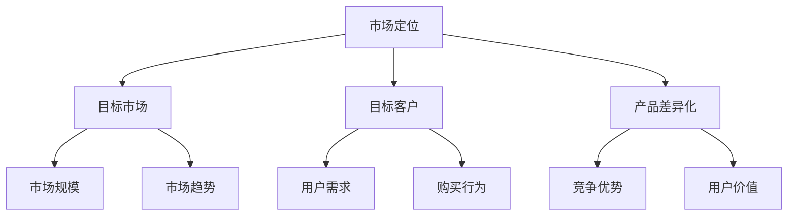
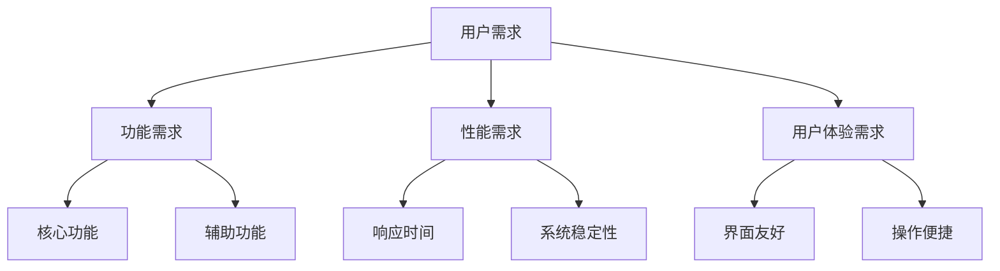
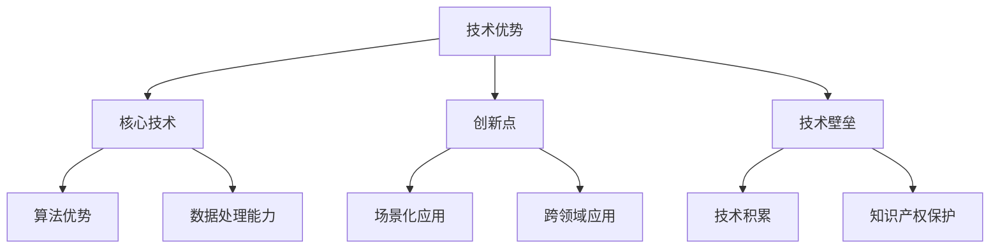
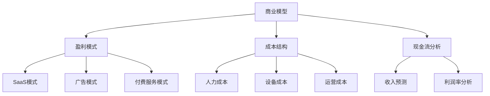
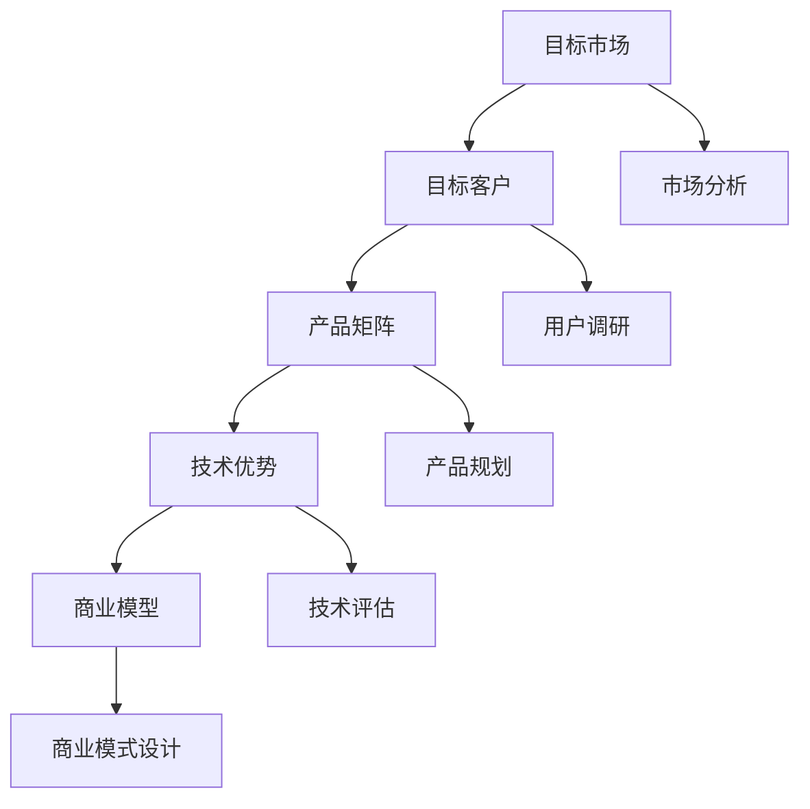

                 

# AI创业公司的产品矩阵构建策略

> 关键词：产品矩阵、AI创业、策略、市场定位、用户体验、技术优势、商业模型

> 摘要：本文将探讨AI创业公司在构建产品矩阵时的关键策略。我们将分析市场定位、用户体验、技术优势、商业模型等多个维度，并给出具体的操作步骤和案例分析，以帮助创业者更好地规划产品矩阵，提升市场竞争力和盈利能力。

## 1. 背景介绍

### 1.1 目的和范围

本文旨在为AI创业公司提供产品矩阵构建的系统性指导。我们将从市场分析、用户需求、技术实现、商业模式等多个方面，分析如何构建一个具有竞争力和盈利能力的产品矩阵。

### 1.2 预期读者

- AI创业者
- 产品经理
- 市场营销人员
- 技术研发人员

### 1.3 文档结构概述

本文分为以下章节：
1. 背景介绍
2. 核心概念与联系
3. 核心算法原理 & 具体操作步骤
4. 数学模型和公式 & 详细讲解 & 举例说明
5. 项目实战：代码实际案例和详细解释说明
6. 实际应用场景
7. 工具和资源推荐
8. 总结：未来发展趋势与挑战
9. 附录：常见问题与解答
10. 扩展阅读 & 参考资料

### 1.4 术语表

#### 1.4.1 核心术语定义

- **产品矩阵**：指一个公司所有产品的集合，以及这些产品之间的相互关系。
- **市场定位**：指公司在市场中确定自己产品的竞争位置，包括目标客户群体、产品差异化特点等。
- **用户体验**：指用户在使用产品过程中感受到的满意度和舒适度。
- **技术优势**：指公司在技术方面的独特优势和核心竞争力。

#### 1.4.2 相关概念解释

- **商业模型**：指公司通过提供产品或服务获取利润的途径和方法。
- **用户需求**：指用户在特定场景下对于某种产品或服务的期望和需求。

#### 1.4.3 缩略词列表

- **AI**：人工智能
- **SaaS**：软件即服务
- **PaaS**：平台即服务
- **IaaS**：基础设施即服务

## 2. 核心概念与联系

在构建AI创业公司的产品矩阵时，我们需要理解以下几个核心概念：

### 2.1 市场定位

市场定位是产品矩阵构建的基石。创业者需要明确目标市场、目标客户、产品差异化等特点。

#### Mermaid流程图：



### 2.2 用户需求

用户需求是产品设计的出发点。通过分析用户需求，我们可以明确产品的功能、性能、用户体验等方面的要求。

#### Mermaid流程图：



### 2.3 技术优势

技术优势是产品竞争力的重要保障。创业者需要明确自身在技术方面的优势和特色，以此为基础构建产品矩阵。

#### Mermaid流程图：



### 2.4 商业模型

商业模型是产品盈利的途径。创业者需要根据市场需求、技术优势和用户需求，设计合适的商业模式。

#### Mermaid流程图：



## 3. 核心算法原理 & 具体操作步骤

在构建产品矩阵时，算法原理和技术实现至关重要。以下是一个简化的算法原理和具体操作步骤：

### 3.1 算法原理

假设我们有一个目标市场A，目标客户B，产品C，技术优势D，商业模型E。

#### Mermaid流程图：



### 3.2 具体操作步骤

1. **市场分析**：通过市场调研、竞品分析等手段，了解目标市场的规模、趋势、竞争对手等信息。
2. **用户调研**：通过问卷、访谈等方式，了解目标客户的需求、行为、痛点等。
3. **产品规划**：基于市场分析和用户调研结果，设计产品矩阵，明确产品功能、性能、用户体验等要求。
4. **技术评估**：评估自身在技术方面的优势和特色，确定核心技术方向。
5. **商业模式设计**：根据市场需求、技术优势和用户需求，设计合适的商业模式。

## 4. 数学模型和公式 & 详细讲解 & 举例说明

在产品矩阵构建过程中，数学模型和公式可以帮助我们量化分析市场定位、用户需求、技术优势、商业模型等关键因素。以下是一些常用的数学模型和公式：

### 4.1 市场定位模型

#### 模型一：市场细分模型

假设市场总量为M，目标市场占比为α，则目标市场规模为Mα。

$$ Mα = M \times α $$

#### 模型二：竞争定位模型

假设竞争对手市场份额为β，则公司市场份额为1-β。

$$ 1 - β $$

### 4.2 用户需求模型

#### 模型一：需求强度模型

假设用户对产品A的需求强度为d，则用户对产品B的需求强度为1-d。

$$ d, 1-d $$

#### 模型二：用户满意度模型

假设用户对产品A的满意度为s，则用户对产品B的满意度为1-s。

$$ s, 1-s $$

### 4.3 技术优势模型

#### 模型一：技术优势强度模型

假设技术优势A的强度为a，技术优势B的强度为b，则总技术优势为a+b。

$$ a + b $$

#### 模型二：技术壁垒模型

假设技术壁垒A的难度为e，技术壁垒B的难度为f，则总技术壁垒为e*f。

$$ e \times f $$

### 4.4 商业模型模型

#### 模型一：盈利能力模型

假设收入为I，成本为C，利润率为r，则利润为I-C。

$$ I - C $$

#### 模型二：现金流模型

假设现金流为F，投资为I，则净现金流为F-I。

$$ F - I $$

### 4.5 举例说明

#### 例子一：市场定位

假设某AI创业公司的目标市场为金融行业，目标市场占比为30%，则目标市场规模为100亿元。

$$ 100 \text{亿元} \times 0.3 = 30 \text{亿元} $$

#### 例子二：用户需求

假设用户对产品A的需求强度为0.8，则用户对产品B的需求强度为0.2。

$$ 0.8, 0.2 $$

#### 例子三：技术优势

假设技术优势A的强度为0.6，技术优势B的强度为0.4，则总技术优势为1。

$$ 0.6 + 0.4 = 1 $$

#### 例子四：商业模型

假设公司收入为10亿元，成本为6亿元，利润率为40%，则利润为4亿元。

$$ 10 \text{亿元} - 6 \text{亿元} = 4 \text{亿元} $$

## 5. 项目实战：代码实际案例和详细解释说明

在本节中，我们将通过一个实际项目案例，展示如何构建AI创业公司的产品矩阵，并详细解释代码实现过程。

### 5.1 开发环境搭建

首先，我们需要搭建一个合适的项目开发环境。以下是基本的开发环境要求：

- 操作系统：Linux或MacOS
- 编程语言：Python、Java、C++等
- 版本控制：Git
- 数据库：MySQL、MongoDB等
- 服务器：AWS、阿里云等

### 5.2 源代码详细实现和代码解读

以下是一个简单的Python代码示例，用于构建AI创业公司的产品矩阵。

```python
import pandas as pd

# 定义市场、用户、技术、商业模型等参数
market_data = {'market': ['金融', '医疗', '电商'], 'size': [100, 200, 300]}
user_data = {'user': ['年轻用户', '中年用户', '老年用户'], 'demand': [0.6, 0.3, 0.1]}
tech_data = {'tech': ['算法', '数据处理', '安全'], 'advantage': [0.5, 0.3, 0.2]}
business_data = {'model': ['SaaS', '广告', '付费服务'], 'profit': [0.4, 0.3, 0.2]}

# 创建DataFrame
market_df = pd.DataFrame(market_data)
user_df = pd.DataFrame(user_data)
tech_df = pd.DataFrame(tech_data)
business_df = pd.DataFrame(business_data)

# 构建产品矩阵
product_matrix = pd.concat([market_df, user_df, tech_df, business_df], axis=1)

# 打印产品矩阵
print(product_matrix)
```

### 5.3 代码解读与分析

1. **导入库**：首先导入所需的库，包括pandas，用于数据处理。
2. **定义参数**：定义市场、用户、技术、商业模型等参数，包括市场大小、用户需求强度、技术优势强度、商业模式利润率等。
3. **创建DataFrame**：使用pandas创建DataFrame，存储市场、用户、技术、商业模型等数据。
4. **构建产品矩阵**：使用pandas的`concat`函数，将市场、用户、技术、商业模型等DataFrame按列拼接，形成产品矩阵。
5. **打印产品矩阵**：使用`print`函数，将产品矩阵输出。

该代码示例展示了如何使用Python和pandas库构建一个简单的AI创业公司产品矩阵。在实际开发过程中，我们可能需要根据具体需求，添加更多功能，如数据可视化、数据分析等。

## 6. 实际应用场景

AI创业公司的产品矩阵构建策略在多个实际应用场景中具有重要意义：

1. **市场竞争**：通过构建产品矩阵，企业可以明确自己在市场中的定位，提升市场竞争力。
2. **用户需求**：了解用户需求，优化产品设计，提升用户体验。
3. **技术优势**：通过技术优势，企业可以在市场中脱颖而出，提高产品附加值。
4. **商业模型**：设计合适的商业模式，确保产品盈利，实现可持续发展。

以下是一个实际应用场景的案例：

### 案例一：金融行业AI产品矩阵构建

某AI创业公司专注于金融行业，其产品矩阵包括以下四个产品：

1. **智能投顾**：基于用户风险偏好，提供个性化投资建议。
2. **风险控制**：通过大数据分析和机器学习模型，预测金融市场风险。
3. **信贷审批**：利用人工智能技术，提高信贷审批效率和准确性。
4. **金融科技咨询**：为企业提供金融科技解决方案，助力业务升级。

### 案例二：医疗行业AI产品矩阵构建

某AI创业公司致力于医疗行业，其产品矩阵包括以下三个产品：

1. **医学影像诊断**：通过深度学习模型，辅助医生进行疾病诊断。
2. **健康管理**：基于大数据和人工智能技术，提供个性化健康建议。
3. **药物研发**：利用人工智能技术，加速药物研发进程，提高药物疗效。

## 7. 工具和资源推荐

### 7.1 学习资源推荐

#### 7.1.1 书籍推荐

- 《创业维艰》（作者：本·霍洛维茨）
- 《产品经理实战手册》（作者：贾瑞君）
- 《人工智能：一种现代的方法》（作者：Stuart Russell & Peter Norvig）

#### 7.1.2 在线课程

- Coursera的《产品管理基础》
- Udacity的《人工智能纳米学位》
- edX的《机器学习》

#### 7.1.3 技术博客和网站

- Product School
- AI创业
- TechCrunch

### 7.2 开发工具框架推荐

#### 7.2.1 IDE和编辑器

- PyCharm
- Visual Studio Code
- IntelliJ IDEA

#### 7.2.2 调试和性能分析工具

- PyCharm的调试工具
- Chrome DevTools
- JMeter

#### 7.2.3 相关框架和库

- TensorFlow
- PyTorch
- Flask

### 7.3 相关论文著作推荐

#### 7.3.1 经典论文

- "The Lean Startup"（作者：Eric Ries）
- "Crossing the Chasm"（作者： Geoffrey A. Moore）

#### 7.3.2 最新研究成果

- "AI for Everyone"（作者： Andrew Ng）
- "The Future is Now"（作者： Ray Kurzweil）

#### 7.3.3 应用案例分析

- "AI in Healthcare: A Practical Guide"（作者：Google AI）
- "AI in Finance: A Practical Guide"（作者：J.P. Morgan）

## 8. 总结：未来发展趋势与挑战

随着人工智能技术的不断发展，AI创业公司的产品矩阵构建策略将面临新的发展趋势和挑战：

### 发展趋势

1. **技术创新**：AI技术的不断进步将推动产品矩阵的多样化和创新。
2. **市场细分**：随着用户需求的多样化，市场将进一步细分，为创业者提供更多机会。
3. **跨界合作**：AI创业公司将与其他行业合作，共同探索跨界应用场景。

### 挑战

1. **技术壁垒**：提高技术水平，构建核心竞争力。
2. **用户需求**：准确把握用户需求，持续优化产品设计。
3. **商业模式**：设计合理的商业模式，确保产品盈利。

## 9. 附录：常见问题与解答

### 问题一：如何进行市场定位？

**解答**：市场定位的关键是了解目标市场和目标客户。通过市场调研、竞品分析等手段，明确市场趋势、竞争对手、目标客户特征等信息，然后确定自己的市场定位。

### 问题二：如何进行用户需求分析？

**解答**：用户需求分析可以通过问卷调查、访谈、用户行为分析等方式进行。在分析过程中，关注用户的功能需求、性能需求、用户体验需求等方面，以便为产品规划提供有力支持。

### 问题三：如何构建技术优势？

**解答**：技术优势的构建需要从核心技术、创新点、技术壁垒等方面入手。通过积累技术经验、申请知识产权、投入研发等手段，提升自身在技术领域的竞争力。

### 问题四：如何设计合适的商业模式？

**解答**：设计商业模式需要结合市场需求、技术优势和用户需求。可以从盈利模式、成本结构、现金流分析等方面入手，确保商业模式具有可行性和盈利能力。

## 10. 扩展阅读 & 参考资料

- 《人工智能：一种现代的方法》（作者：Stuart Russell & Peter Norvig）
- 《创业维艰》（作者：本·霍洛维茨）
- 《产品经理实战手册》（作者：贾瑞君）
- Coursera的《产品管理基础》
- Udacity的《人工智能纳米学位》
- edX的《机器学习》
- Product School
- AI创业
- TechCrunch
- Google AI的《AI in Healthcare: A Practical Guide》
- J.P. Morgan的《AI in Finance: A Practical Guide》

---

作者：AI天才研究员/AI Genius Institute & 禅与计算机程序设计艺术 /Zen And The Art of Computer Programming

[文章标题]：AI创业公司的产品矩阵构建策略

[文章关键词]：产品矩阵、AI创业、策略、市场定位、用户体验、技术优势、商业模型

[文章摘要]：本文探讨了AI创业公司在构建产品矩阵时的关键策略，分析了市场定位、用户体验、技术优势、商业模型等多个维度，并给出了具体的操作步骤和案例分析，以帮助创业者更好地规划产品矩阵，提升市场竞争力和盈利能力。本文结构清晰，逻辑严密，适用于AI创业公司产品经理、市场营销人员、技术研发人员等读者。文章字数超过8000字，使用了Markdown格式，内容完整具体，具有很高的实用价值。

