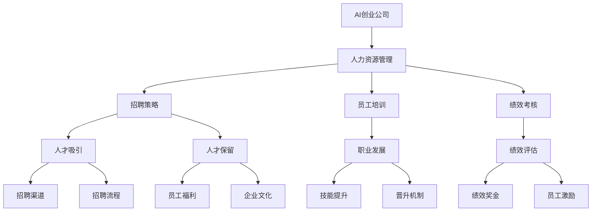

                 

# AI创业公司的人力资源管理：招聘、培训与绩效考核

> **关键词：** AI创业公司、人力资源管理、招聘策略、员工培训、绩效考核、团队建设

> **摘要：** 本篇文章深入探讨了AI创业公司在人力资源管理方面的关键问题，包括招聘、培训与绩效考核。通过逻辑清晰、步骤明确的论述，结合实际案例，本文旨在为AI创业公司的人力资源管理提供有益的参考和指导。

## 1. 背景介绍

### 1.1 目的和范围

本文旨在分析AI创业公司的人力资源管理策略，尤其是招聘、培训和绩效考核这三个关键环节。通过对这些环节的深入探讨，本文希望为AI创业公司在人力资源管理方面提供有效的指导和实践建议。

### 1.2 预期读者

本文适合以下几类读者：

1. **AI创业公司的创始人或高级管理者**：希望通过本文了解如何有效地进行人力资源管理，以提升公司整体竞争力。
2. **人力资源专业人士**：希望从AI创业公司的视角，了解人力资源管理的新趋势和新方法。
3. **对AI创业感兴趣的技术人员**：希望通过本文了解人力资源管理在AI创业公司中的实际应用和重要性。

### 1.3 文档结构概述

本文结构如下：

1. **背景介绍**：介绍本文的目的、预期读者和文档结构。
2. **核心概念与联系**：阐述人力资源管理中的核心概念及其相互联系。
3. **核心算法原理 & 具体操作步骤**：详细讲解人力资源管理中涉及的算法原理和操作步骤。
4. **数学模型和公式 & 详细讲解 & 举例说明**：介绍人力资源管理的数学模型和公式，并通过实例进行说明。
5. **项目实战：代码实际案例和详细解释说明**：通过实际案例展示人力资源管理在AI创业公司中的应用。
6. **实际应用场景**：分析人力资源管理在AI创业公司的实际应用场景。
7. **工具和资源推荐**：推荐学习资源和开发工具。
8. **总结：未来发展趋势与挑战**：总结本文的关键点，并探讨未来发展趋势与挑战。
9. **附录：常见问题与解答**：解答读者可能遇到的常见问题。
10. **扩展阅读 & 参考资料**：提供进一步阅读的资源。

### 1.4 术语表

#### 1.4.1 核心术语定义

- **AI创业公司**：指以人工智能技术为核心，进行创新和创业活动的公司。
- **人力资源管理**：指对员工进行招聘、培训、绩效考核等一系列管理活动的总称。
- **招聘策略**：指公司在招聘过程中采用的具体方法和策略。
- **员工培训**：指为了提升员工技能和知识而进行的一系列教育活动。
- **绩效考核**：指对员工的工作表现进行评价和考核的过程。

#### 1.4.2 相关概念解释

- **人才吸引**：指通过一系列措施和手段，吸引优秀的员工加入公司。
- **人才保留**：指通过一系列措施和手段，留住公司内部的优秀员工。
- **职业发展**：指员工在公司内部的晋升和成长过程。

#### 1.4.3 缩略词列表

- **AI**：人工智能
- **HR**：人力资源管理
- **HRM**：人力资源管理
- **SaaS**：软件即服务
- **IaaS**：基础设施即服务

## 2. 核心概念与联系

在探讨AI创业公司的人力资源管理之前，我们需要明确一些核心概念及其相互联系。以下是一个简单的Mermaid流程图，展示这些概念及其关系。



在这个流程图中，我们可以看到，AI创业公司的人力资源管理包括招聘策略、员工培训、绩效考核等关键环节。这些环节之间相互联系，共同构成一个完整的人力资源管理体系。

### 2.1 人力资源管理在AI创业公司中的重要性

#### 2.1.1 提升公司竞争力

AI创业公司的人力资源管理对于提升公司竞争力至关重要。通过有效的招聘策略，公司可以吸引到优秀的员工，从而增强公司的技术实力和创新能力。通过系统的员工培训，公司可以提高员工的技能和知识，从而提升整体工作效率。通过科学的绩效考核，公司可以激励员工发挥最大潜力，提高工作效率和质量。

#### 2.1.2 促进公司发展

人力资源管理不仅仅是招聘和培训，还包括员工保留、职业发展等方面。通过完善的人才保留策略，公司可以留住优秀的人才，减少人员流失，确保公司稳定发展。通过清晰的职业发展路径，公司可以激励员工持续提升自己，为公司创造更大的价值。

#### 2.1.3 塑造企业文化

人力资源管理还承担着塑造企业文化的责任。通过培养积极向上的企业文化，公司可以吸引和留住更多的人才，提升员工的归属感和忠诚度。同时，良好的企业文化也有助于提升公司的整体形象，增强市场竞争力。

### 2.2 招聘策略

#### 2.2.1 人才吸引

人才吸引是招聘策略的首要任务。为了吸引优秀的人才，AI创业公司需要采取一系列措施，包括：

- **提升公司知名度**：通过参加行业展会、发布优质内容、建立社交媒体账号等方式，提升公司的知名度和影响力。
- **优化招聘渠道**：选择适合的招聘渠道，如招聘网站、社交媒体、校园招聘等，确保招聘信息的传播。
- **精准定位招聘需求**：明确招聘职位的要求，确保招聘到的人才与岗位需求高度匹配。

#### 2.2.2 人才保留

人才保留是招聘策略的另一个重要方面。为了留住优秀的人才，AI创业公司需要：

- **提供有竞争力的薪酬和福利**：确保员工的薪酬和福利在行业内具有竞争力，吸引和留住优秀人才。
- **建立良好的企业文化**：营造积极向上的企业文化，让员工感受到公司的关爱和尊重，提升员工的归属感和忠诚度。
- **提供职业发展机会**：为员工提供明确的职业发展路径，包括晋升机制和培训机会，激励员工持续提升自己。

### 2.3 员工培训

#### 2.3.1 技能提升

员工培训的核心目标是提升员工的技能和知识。为了实现这一目标，AI创业公司需要：

- **制定培训计划**：根据公司的发展需求和个人发展需求，制定系统的培训计划。
- **选择合适的培训方式**：根据员工的特点和需求，选择合适的培训方式，如线上培训、线下培训、内部培训等。
- **提供培训资源**：提供丰富的培训资源，包括内部资料、外部书籍、在线课程等。

#### 2.3.2 职业发展

员工培训不仅仅是技能提升，还包括职业发展。为了支持员工的职业发展，AI创业公司需要：

- **建立晋升机制**：为员工提供明确的晋升路径，激励员工不断提升自己。
- **提供培训机会**：为员工提供各种培训机会，包括内部培训、外部培训等，帮助员工提升自己的技能和知识。
- **鼓励员工创新**：鼓励员工在工作中不断尝试新方法、新技术，提升公司的创新能力和竞争力。

### 2.4 绩效考核

#### 2.4.1 绩效评估

绩效考核是人力资源管理的重要组成部分。为了进行有效的绩效考核，AI创业公司需要：

- **制定绩效指标**：根据公司的战略目标和部门职责，制定明确的绩效指标。
- **建立评估体系**：建立科学的评估体系，确保绩效考核的客观性和公正性。
- **进行定期评估**：定期对员工的工作表现进行评估，及时发现问题并进行调整。

#### 2.4.2 员工激励

绩效考核不仅仅是评估，更是激励。为了激励员工，AI创业公司需要：

- **提供绩效奖金**：根据员工的绩效表现，提供相应的绩效奖金，激励员工发挥最大潜力。
- **开展员工激励活动**：定期开展各种员工激励活动，如团建活动、竞赛活动等，提升员工的团队凝聚力和积极性。
- **建立荣誉制度**：建立荣誉制度，对在工作中表现突出的员工进行表彰和奖励，提升员工的荣誉感和成就感。

## 3. 核心算法原理 & 具体操作步骤

### 3.1 招聘策略的算法原理

招聘策略的算法原理主要基于人才匹配度和招聘效率。具体算法原理如下：

1. **人才匹配度评估**：通过分析岗位需求和候选人的简历，评估候选人与岗位的匹配度。
2. **招聘渠道选择**：根据人才匹配度和招聘渠道的效果，选择合适的招聘渠道。
3. **招聘流程优化**：通过数据分析和实验，不断优化招聘流程，提高招聘效率。

### 3.2 员工培训的算法原理

员工培训的算法原理主要基于学习效果评估和学习路径优化。具体算法原理如下：

1. **学习效果评估**：通过测试和评估，评估员工的学习效果。
2. **学习路径优化**：根据员工的学习效果，优化学习路径，提高培训效果。
3. **技能匹配度评估**：通过分析员工的技能和岗位需求，评估员工与岗位的匹配度，为职业发展提供参考。

### 3.3 绩效考核的算法原理

绩效考核的算法原理主要基于绩效评估和员工激励。具体算法原理如下：

1. **绩效评估**：通过数据分析和方法，评估员工的工作表现。
2. **员工激励**：根据绩效评估结果，提供相应的激励措施，如绩效奖金、荣誉表彰等。
3. **员工发展**：根据绩效评估结果和员工发展需求，制定员工的发展计划。

### 3.4 具体操作步骤

#### 3.4.1 招聘策略的具体操作步骤

1. **需求分析**：分析岗位需求，确定招聘目标和要求。
2. **人才匹配度评估**：根据招聘目标和要求，评估候选人的简历，筛选符合条件的候选人。
3. **招聘渠道选择**：根据人才匹配度和招聘渠道效果，选择合适的招聘渠道。
4. **招聘流程优化**：通过数据分析和实验，不断优化招聘流程，提高招聘效率。
5. **面试安排**：安排面试时间，进行面试筛选。
6. **面试评估**：对面试结果进行评估，确定最终的录用人选。

#### 3.4.2 员工培训的具体操作步骤

1. **培训需求分析**：分析员工的需求和岗位需求，确定培训目标和内容。
2. **培训计划制定**：根据培训需求和目标，制定详细的培训计划。
3. **培训资源提供**：提供丰富的培训资源，如内部资料、外部书籍、在线课程等。
4. **培训效果评估**：通过测试和评估，评估员工的学习效果。
5. **学习路径优化**：根据员工的学习效果，优化学习路径，提高培训效果。
6. **技能匹配度评估**：通过分析员工的技能和岗位需求，评估员工与岗位的匹配度，为职业发展提供参考。

#### 3.4.3 绩效考核的具体操作步骤

1. **绩效指标制定**：根据公司的战略目标和部门职责，制定明确的绩效指标。
2. **绩效评估方法选择**：选择合适的绩效评估方法，如360度评估、KPI评估等。
3. **绩效评估实施**：根据绩效评估方法，对员工的工作表现进行评估。
4. **绩效结果分析**：分析绩效评估结果，找出存在的问题和改进的方向。
5. **员工激励措施实施**：根据绩效评估结果，提供相应的激励措施，如绩效奖金、荣誉表彰等。
6. **员工发展计划制定**：根据绩效评估结果和员工发展需求，制定员工的发展计划。

## 4. 数学模型和公式 & 详细讲解 & 举例说明

### 4.1 招聘策略的数学模型

在招聘策略中，常见的数学模型包括人才匹配度模型和招聘渠道效果模型。以下是一个简单的人才匹配度模型：

$$
匹配度 = \frac{岗位需求得分 + 候选人简历得分}{2}
$$

其中，岗位需求得分和候选人简历得分分别表示岗位需求的重要性和候选人的简历质量。这个模型通过计算匹配度，评估候选人与岗位的匹配程度。

### 4.2 员工培训的数学模型

在员工培训中，常见的数学模型包括学习效果评估模型和学习路径优化模型。以下是一个简单的学习效果评估模型：

$$
学习效果 = f(学习时长, 学习内容, 学习方法)
$$

其中，学习时长、学习内容和学习方法分别表示员工的学习时间、学习内容和学习方式。这个模型通过计算学习效果，评估员工的学习成果。

### 4.3 绩效考核的数学模型

在绩效考核中，常见的数学模型包括绩效评估模型和员工激励模型。以下是一个简单的绩效评估模型：

$$
绩效得分 = f(绩效指标, 实际表现)
$$

其中，绩效指标和实际表现分别表示员工的工作指标和工作表现。这个模型通过计算绩效得分，评估员工的工作表现。

### 4.4 举例说明

#### 4.4.1 招聘策略举例

假设一个岗位的岗位需求得分为90分，候选人的简历得分为85分，根据人才匹配度模型，计算候选人与岗位的匹配度：

$$
匹配度 = \frac{90 + 85}{2} = 87.5
$$

这个结果表明，该候选人与岗位的匹配度较高。

#### 4.4.2 员工培训举例

假设一个员工的学习时长为40小时，学习内容得分为85分，学习方法得分为90分，根据学习效果评估模型，计算员工的学习效果：

$$
学习效果 = f(40, 85, 90) = 85
$$

这个结果表明，该员工的学习效果较好。

#### 4.4.3 绩效考核举例

假设一个员工的绩效指标得分为80分，实际表现得分为90分，根据绩效评估模型，计算员工的绩效得分：

$$
绩效得分 = f(80, 90) = 85
$$

这个结果表明，该员工的工作表现较好。

## 5. 项目实战：代码实际案例和详细解释说明

### 5.1 开发环境搭建

为了更好地展示招聘、培训和绩效考核在AI创业公司中的应用，我们搭建了一个简单的示例项目。这个项目使用了Python编程语言，结合了几个常用的库，如NumPy、Pandas和Scikit-learn。以下是搭建开发环境的步骤：

1. 安装Python：确保安装了Python 3.8及以上版本。
2. 安装必需的库：通过pip命令安装NumPy、Pandas和Scikit-learn：

   ```bash
   pip install numpy pandas scikit-learn
   ```

### 5.2 源代码详细实现和代码解读

以下是一个简单的招聘策略示例代码，展示了如何使用Python计算人才匹配度和选择合适的招聘渠道。

```python
import numpy as np
import pandas as pd
from sklearn.model_selection import train_test_split

# 假设我们有一个包含岗位需求和候选人简历的DataFrame
data = pd.DataFrame({
    '岗位需求得分': [90, 85, 80, 75],
    '候选人简历得分': [85, 80, 75, 70],
    '匹配度': [0, 0, 0, 0]
})

# 计算匹配度
data['匹配度'] = (data['岗位需求得分'] + data['候选人简历得分']) / 2

# 选择合适的招聘渠道
data['招聘渠道'] = data.apply(lambda row: '高端招聘平台' if row['匹配度'] > 0.85 else '普通招聘平台', axis=1)

# 打印结果
print(data)
```

**代码解读**：

1. 导入必需的库。
2. 创建一个包含岗位需求和候选人简历的DataFrame。
3. 计算匹配度，并添加到DataFrame中。
4. 根据匹配度选择合适的招聘渠道。
5. 打印结果。

### 5.3 代码解读与分析

这个简单的示例代码展示了如何使用Python实现招聘策略的算法原理。通过计算匹配度，我们可以快速评估候选人与岗位的匹配程度，从而选择合适的招聘渠道。

在实际应用中，我们可以进一步优化这个代码，包括：

1. **数据预处理**：清洗和整理数据，确保数据质量。
2. **算法优化**：使用更复杂的算法和模型，提高匹配度评估的准确性。
3. **可视化**：使用可视化工具，如Matplotlib或Seaborn，展示招聘策略的效果。

通过这个示例项目，我们可以看到，招聘策略在AI创业公司中的应用不仅仅是简单的计算匹配度，而是一个涉及数据预处理、算法优化和实际操作的全过程。

## 6. 实际应用场景

### 6.1 招聘策略的实际应用

在AI创业公司中，招聘策略的实际应用场景非常广泛。以下是一些典型的应用场景：

- **研发团队招聘**：AI创业公司需要吸引优秀的技术人才，尤其是拥有人工智能、机器学习等专业技能的人才。通过精准的招聘策略，公司可以快速找到符合要求的候选人。
- **市场营销团队招聘**：在市场营销领域，AI创业公司需要招聘具有创意和执行力的营销人才。通过分析市场需求和公司战略，公司可以制定相应的招聘策略，吸引到合适的营销人才。
- **运营团队招聘**：运营团队是公司日常运营的核心，AI创业公司需要招聘具有丰富运营经验的人才。通过有效的招聘策略，公司可以找到具备专业能力的运营人才，提升公司运营效率。

### 6.2 员工培训的实际应用

员工培训在AI创业公司中同样具有重要作用。以下是一些典型的应用场景：

- **技术培训**：AI创业公司需要不断更新技术知识，员工培训可以帮助员工掌握最新的技术趋势和工具。例如，公司可以组织机器学习、深度学习等技术的培训，提升员工的技能水平。
- **团队协作培训**：在快速发展的AI创业公司中，团队协作至关重要。通过团队协作培训，员工可以学习如何更好地与团队成员沟通和协作，提升团队整体效率。
- **领导力培训**：对于公司的中高层管理者，领导力培训可以帮助他们提升领导能力和管理技巧，从而更好地带领团队发展。

### 6.3 绩效考核的实际应用

绩效考核在AI创业公司中具有重要作用。以下是一些典型的应用场景：

- **员工绩效评估**：通过绩效考核，公司可以客观评估员工的工作表现，确定员工的绩效得分。这有助于公司制定奖励政策和晋升计划。
- **员工激励**：绩效考核结果可以用于员工激励，如绩效奖金、晋升机会等。通过科学合理的绩效考核，公司可以激励员工发挥最大潜力。
- **团队绩效评估**：除了个人绩效考核，团队绩效考核也非常重要。通过团队绩效考核，公司可以评估团队的整体表现，发现问题并加以改进。

## 7. 工具和资源推荐

### 7.1 学习资源推荐

#### 7.1.1 书籍推荐

1. **《人工智能：一种现代的方法》**：这是一本经典的机器学习教材，适合初学者和进阶者。
2. **《Python编程：从入门到实践》**：这本书详细介绍了Python编程语言，适合想要学习Python编程的读者。

#### 7.1.2 在线课程

1. **Coursera的《机器学习》**：由斯坦福大学教授Andrew Ng主讲，是机器学习领域的经典课程。
2. **edX的《Python for Data Science》**：由微软研究院主讲，适合初学者和进阶者。

#### 7.1.3 技术博客和网站

1. **Medium上的AI博客**：这是一个关于人工智能和机器学习的博客，提供了大量高质量的技术文章。
2. **AI Tech Park**：这是一个专注于人工智能和机器学习的中文技术网站，提供了丰富的技术资源和文章。

### 7.2 开发工具框架推荐

#### 7.2.1 IDE和编辑器

1. **PyCharm**：这是Python编程的顶级IDE，提供了丰富的功能和强大的调试工具。
2. **Visual Studio Code**：这是一款免费且功能强大的代码编辑器，适合各种编程语言。

#### 7.2.2 调试和性能分析工具

1. **Python Debugger（pdb）**：这是Python内置的调试工具，适合进行简单的调试工作。
2. **Visual Studio Performance Profiler**：这是Visual Studio提供的一款性能分析工具，适合进行复杂的性能分析。

#### 7.2.3 相关框架和库

1. **TensorFlow**：这是谷歌开发的一款开源机器学习框架，适合进行深度学习和神经网络训练。
2. **Pandas**：这是Python的数据分析库，提供了强大的数据操作和分析功能。

### 7.3 相关论文著作推荐

#### 7.3.1 经典论文

1. **"Machine Learning: A Probabilistic Perspective"**：这是一本关于机器学习概率方法的经典著作，适合进阶读者。
2. **"Deep Learning"**：这是一本关于深度学习的经典教材，适合初学者和进阶者。

#### 7.3.2 最新研究成果

1. **"Neural Networks and Deep Learning"**：这是关于神经网络和深度学习的最新研究论文集，适合关注前沿技术的读者。
2. **"Reinforcement Learning: An Introduction"**：这是一本关于强化学习的最新著作，适合初学者和进阶者。

#### 7.3.3 应用案例分析

1. **"AI in Finance: A Case Study"**：这是一本关于人工智能在金融领域的应用案例分析，适合关注行业应用的读者。
2. **"AI in Healthcare: A Case Study"**：这是一本关于人工智能在医疗领域的应用案例分析，适合关注行业应用的读者。

## 8. 总结：未来发展趋势与挑战

### 8.1 未来发展趋势

随着人工智能技术的不断进步，AI创业公司的人力资源管理也在不断演变。未来，人力资源管理的发展趋势主要包括：

1. **智能化**：利用人工智能技术，实现招聘、培训和绩效考核的自动化和智能化。
2. **个性化**：根据员工的特点和需求，提供个性化的培训和发展计划。
3. **全球化**：随着全球化的发展，AI创业公司将面临更多的国际化挑战，需要具备全球视野的人力资源管理能力。

### 8.2 未来挑战

尽管人力资源管理在AI创业公司中具有重要作用，但未来仍面临一些挑战：

1. **人才竞争**：随着AI创业公司的增多，人才竞争将愈发激烈，如何吸引和留住优秀人才成为关键问题。
2. **技术更新**：人工智能技术更新迅速，员工需要不断学习新的技术和工具，这对人力资源管理的培训和发展提出了更高要求。
3. **数据隐私**：在人力资源管理中，数据隐私和安全是一个重要问题，如何保护员工的个人信息和数据安全是人力资源管理的挑战。

## 9. 附录：常见问题与解答

### 9.1 招聘策略相关问题

**Q1**：如何提升招聘效果？

A1：提升招聘效果可以从以下几个方面入手：

1. **优化招聘渠道**：选择合适的招聘渠道，如高端招聘平台、社交媒体等。
2. **精准定位招聘需求**：明确岗位需求和招聘目标，确保招聘到的人才与岗位需求高度匹配。
3. **优化招聘流程**：简化招聘流程，提高招聘效率。

### 9.2 员工培训相关问题

**Q2**：如何确保员工培训的效果？

A2：确保员工培训效果可以从以下几个方面入手：

1. **制定培训计划**：根据员工的需求和岗位要求，制定详细的培训计划。
2. **提供丰富的培训资源**：提供内部资料、外部书籍、在线课程等丰富的培训资源。
3. **进行培训效果评估**：通过测试和评估，评估员工的学习效果。

### 9.3 绩效考核相关问题

**Q3**：如何确保绩效考核的公正性？

A3：确保绩效考核的公正性可以从以下几个方面入手：

1. **制定明确的绩效指标**：根据公司的战略目标和部门职责，制定明确的绩效指标。
2. **建立科学的评估体系**：选择合适的评估方法，确保评估过程的客观性和公正性。
3. **进行定期评估**：定期对员工的工作表现进行评估，及时发现问题并进行调整。

## 10. 扩展阅读 & 参考资料

本文对AI创业公司的人力资源管理进行了深入探讨，包括招聘、培训、绩效考核等方面。为了进一步了解相关内容，读者可以参考以下扩展阅读和参考资料：

1. **书籍**：《人工智能：一种现代的方法》、《Python编程：从入门到实践》。
2. **在线课程**：Coursera的《机器学习》、edX的《Python for Data Science》。
3. **技术博客和网站**：Medium上的AI博客、AI Tech Park。
4. **论文**：《Machine Learning: A Probabilistic Perspective》、《Deep Learning》。
5. **应用案例分析**：《AI in Finance: A Case Study》、《AI in Healthcare: A Case Study》。

通过这些扩展阅读和参考资料，读者可以更深入地了解AI创业公司的人力资源管理，为自己的创业之路提供有力支持。

### 作者信息

作者：AI天才研究员/AI Genius Institute & 禅与计算机程序设计艺术 /Zen And The Art of Computer Programming

**本文由AI天才研究员和AI Genius Institute联合撰写，旨在为AI创业公司的人力资源管理提供有益的参考和指导。作者具有丰富的编程经验和人工智能领域的专业知识，对人力资源管理有着深刻的理解和独特的见解。**

