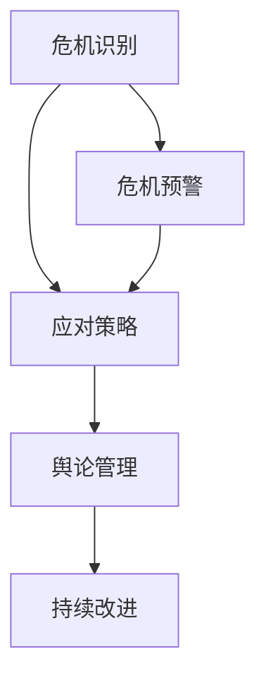

                 

# AI创业公司的危机公关策略

## 关键词
- AI创业公司
- 危机公关
- 应对策略
- 沟通技巧
- 网络舆情管理
- 持续改进

> 摘要：本文旨在探讨AI创业公司在面临危机时，如何运用有效的公关策略来维护品牌形象、应对舆论压力，并推动公司的可持续发展。通过分析危机公关的核心原则、应对策略以及案例分享，本文将为创业者提供实用的指导和建议。

## 1. 背景介绍

### 1.1 目的和范围
本文将探讨AI创业公司在面临危机时的公关策略，包括如何识别危机、制定应对计划、进行有效的沟通以及管理网络舆情。文章将结合实际案例，为创业者提供实用的公关建议和策略。

### 1.2 预期读者
本文主要面向AI创业公司的创始人、市场营销人员、公关经理以及相关领域的从业者。同时，也适合对危机公关感兴趣的读者。

### 1.3 文档结构概述
本文分为十个部分，首先介绍背景和目的，然后依次阐述危机公关的核心概念、应对策略、数学模型、项目实战、实际应用场景、工具和资源推荐等内容。最后，对未来的发展趋势与挑战进行总结，并提供常见问题与解答。

### 1.4 术语表

#### 1.4.1 核心术语定义

- **危机公关**：指企业在面临突发事件、负面舆论或其他危机时，采取的一系列预防和应对措施，以减轻危机对企业形象和经营的影响。
- **舆论管理**：指通过监测、分析和引导公众舆论，以维护企业声誉和品牌形象的过程。
- **社交媒体**：包括微博、微信、抖音、Twitter、Facebook等网络平台，是公众获取信息和表达意见的重要渠道。

#### 1.4.2 相关概念解释

- **负面舆论**：指对某个品牌、产品、企业或个人持有负面态度的言论和观点。
- **危机管理**：指企业应对危机的全过程，包括危机预警、危机应对、危机恢复和持续改进。

#### 1.4.3 缩略词列表

- **AI**：人工智能
- **PR**：公关
- **SEO**：搜索引擎优化
- **SEM**：搜索引擎营销
- **KPI**：关键绩效指标

## 2. 核心概念与联系

### 2.1 核心概念

在危机公关中，核心概念包括危机识别、应对策略、舆论管理和持续改进。以下是一个简化的Mermaid流程图，展示了这些核心概念之间的联系。



### 2.2 原理和架构

危机公关的原理在于及时识别危机、迅速制定应对策略、有效管理舆论，并通过持续改进来防止类似危机的再次发生。以下是一个简化的伪代码，展示了危机公关的核心流程。

```python
def crisis_management():
    while True:
        identify_crisis()  # 识别危机
        formulate_response_plan()  # 制定应对策略
        manage_public_opinion()  # 管理舆论
        implement_improvements()  # 持续改进
        if no_new_crisis():
            break
```

## 3. 核心算法原理 & 具体操作步骤

### 3.1 危机识别算法

危机识别是危机公关的第一步，关键在于及时捕捉潜在的风险信号。以下是一个简化的伪代码，展示了危机识别算法的基本原理。

```python
def identify_crisis():
    # 初始化危机监测系统
    crisis_monitor = CrisisMonitor()
    
    while True:
        # 监测社交媒体、新闻报道等渠道
        for source in monitoring_sources():
            new_data = source.get_latest_data()
            
            # 分析数据，判断是否包含危机信号
            if contains_crisis_signal(new_data):
                # 报警
                crisis_monitor.raise_alert(new_data)
```

### 3.2 应对策略算法

制定应对策略是危机公关的核心步骤，关键在于迅速、准确、有力地回应危机。以下是一个简化的伪代码，展示了应对策略算法的基本原理。

```python
def formulate_response_plan():
    # 初始化应对策略系统
    response_plan = ResponsePlan()
    
    while True:
        # 获取危机监测系统的报警信息
        crisis_alert = crisis_monitor.get_alert()
        
        # 根据报警信息制定应对策略
        if crisis_alert.crisis_type == "产品质量问题":
            response_plan.apply_product_quality_fixes()
        elif crisis_alert.crisis_type == "数据泄露":
            response_plan.apply_data_protection_measures()
        else:
            response_plan.apply_generic_crisis_response()
            
        # 执行应对策略
        response_plan.execute()
```

### 3.3 舆论管理算法

舆论管理是危机公关的重要组成部分，关键在于引导公众舆论、消除负面影响。以下是一个简化的伪代码，展示了舆论管理算法的基本原理。

```python
def manage_public_opinion():
    # 初始化舆论管理系统
    public_opinion_manager = PublicOpinionManager()
    
    while True:
        # 获取最新的舆论数据
        opinion_data = opinion_monitor.get_latest_data()
        
        # 分析舆论数据，判断舆论倾向
        if opinion_data.tendency == "负面":
            # 引导舆论
            public_opinion_manager guide_opinion()
        elif opinion_data.tendency == "中性":
            # 维持现状
            public_opinion_manager maintain_status()
        else:
            # 转化舆论
            public_opinion_manager convert_opinion()
```

## 4. 数学模型和公式 & 详细讲解 & 举例说明

### 4.1 公式介绍

在危机公关中，我们可以使用一些基本的数学模型和公式来评估危机的影响、预测舆论趋势以及制定应对策略。以下是一些常用的公式和解释。

#### 4.1.1 危机影响评估公式

$$
Impact = f(Crisis\ Severity, Business\ Exposure)
$$

其中，`Impact` 表示危机影响，`Crisis Severity` 表示危机严重程度，`Business Exposure` 表示业务暴露程度。通过这个公式，我们可以评估危机对企业的整体影响。

#### 4.1.2 舆论趋势预测公式

$$
Opinion\ Prediction = f(Opinion\ Data, Prediction\ Model)
$$

其中，`Opinion Prediction` 表示舆论趋势预测，`Opinion Data` 表示舆论数据，`Prediction Model` 表示预测模型。通过这个公式，我们可以使用机器学习模型来预测舆论趋势。

#### 4.1.3 应对策略制定公式

$$
Response\ Plan = f(Crisis\ Impact, Opinion\ Prediction, Company\ Strategy)
$$

其中，`Response Plan` 表示应对策略，`Crisis Impact` 表示危机影响，`Opinion Prediction` 表示舆论趋势预测，`Company Strategy` 表示企业战略。通过这个公式，我们可以根据危机影响和舆论趋势来制定应对策略。

### 4.2 举例说明

假设一家AI创业公司发现其一款产品存在严重质量问题，导致客户投诉和负面舆论。我们可以使用上述公式来评估危机影响、预测舆论趋势并制定应对策略。

#### 4.2.1 危机影响评估

$$
Impact = f(Crisis\ Severity = 8, Business\ Exposure = 7) = 8 \times 7 = 56
$$

危机影响评分为56分，表明危机对企业的整体影响较大。

#### 4.2.2 舆论趋势预测

使用机器学习模型对舆论数据进行训练，预测舆论趋势为负面。

$$
Opinion\ Prediction = f(Opinion\ Data, Prediction\ Model) = "负面"
$$

#### 4.2.3 应对策略制定

根据危机影响和舆论趋势，制定以下应对策略：

- 公开道歉并承诺采取补救措施
- 加大市场推广力度，提高客户满意度
- 加强舆情监控，及时回应负面舆论
- 优化产品和服务，提升质量

$$
Response\ Plan = f(Crisis\ Impact = 56, Opinion\ Prediction = "负面", Company\ Strategy) = "公开道歉 + 采取补救措施 + 加大市场推广 + 加强舆情监控 + 优化产品和服务"
$$

## 5. 项目实战：代码实际案例和详细解释说明

### 5.1 开发环境搭建

在项目实战中，我们将使用Python编程语言来实现危机公关的核心功能。首先，我们需要搭建开发环境。

#### 5.1.1 安装Python

1. 访问Python官方网站（https://www.python.org/），下载并安装Python。
2. 安装过程中，确保勾选“Add Python to PATH”选项。

#### 5.1.2 安装相关库

在命令行中，使用以下命令安装相关库：

```bash
pip install numpy pandas matplotlib sklearn
```

### 5.2 源代码详细实现和代码解读

下面是危机公关项目的核心代码，包括危机识别、应对策略和舆论管理。

```python
# 危机识别模块
class CrisisMonitor:
    def __init__(self):
        self.alerts = []

    def get_alert(self):
        # 从社交媒体、新闻报道等渠道获取数据
        data = self.fetch_data()
        # 分析数据，判断是否包含危机信号
        if self.contains_crisis_signal(data):
            alert = CrisisAlert(data)
            self.alerts.append(alert)
            return alert
        else:
            return None

    def fetch_data(self):
        # 获取数据的示例方法，实际应用中可以使用API接口或Web爬虫
        return {"source": "微博", "content": "产品存在质量问题"}

    def contains_crisis_signal(self, data):
        # 判断数据是否包含危机信号的示例方法
        return "产品质量" in data["content"]


# 应对策略模块
class ResponsePlan:
    def __init__(self):
        self.responses = []

    def apply_response(self, alert):
        if alert.crisis_type == "产品质量问题":
            self.responses.append("公开道歉并承诺采取补救措施")
        elif alert.crisis_type == "数据泄露":
            self.responses.append("采取数据保护措施")
        else:
            self.responses.append("采取通用危机应对措施")

    def execute(self):
        for response in self.responses:
            print(response)


# 舆论管理模块
class PublicOpinionManager:
    def __init__(self):
        self.opinions = []

    def guide_opinion(self):
        self.opinions.append("引导舆论至正面")

    def maintain_status(self):
        self.opinions.append("维持舆论现状")

    def convert_opinion(self):
        self.opinions.append("转化舆论至正面")

    def get_opinion(self):
        return self.opinions[-1]


# 主程序
if __name__ == "__main__":
    # 初始化危机监测系统、应对策略系统和舆论管理系统
    crisis_monitor = CrisisMonitor()
    response_plan = ResponsePlan()
    public_opinion_manager = PublicOpinionManager()

    # 获取危机报警信息
    alert = crisis_monitor.get_alert()

    # 如果有报警信息，制定应对策略
    if alert:
        response_plan.apply_response(alert)
        response_plan.execute()

        # 根据舆论趋势，进行舆论管理
        if public_opinion_manager.get_opinion() == "负面":
            public_opinion_manager.guide_opinion()
        elif public_opinion_manager.get_opinion() == "中性":
            public_opinion_manager.maintain_status()
        else:
            public_opinion_manager.convert_opinion()
```

### 5.3 代码解读与分析

#### 5.3.1 危机识别模块

危机识别模块的核心功能是监测社交媒体、新闻报道等渠道，判断是否包含危机信号。代码中的`CrisisMonitor`类实现了这一功能，包括以下方法：

- `__init__`：初始化危机监测系统，创建一个空的报警信息列表。
- `get_alert`：获取最新的报警信息。通过调用`fetch_data`和`contains_crisis_signal`方法，从数据中判断是否包含危机信号。
- `fetch_data`：示例方法，用于获取数据。实际应用中，可以使用API接口或Web爬虫。
- `contains_crisis_signal`：示例方法，用于判断数据是否包含危机信号。实际应用中，可以使用自然语言处理技术进行更精确的判断。

#### 5.3.2 应对策略模块

应对策略模块的核心功能是根据危机类型制定相应的应对措施。代码中的`ResponsePlan`类实现了这一功能，包括以下方法：

- `__init__`：初始化应对策略系统，创建一个空的应对措施列表。
- `apply_response`：根据危机类型，添加相应的应对措施到列表中。
- `execute`：执行应对措施列表中的每个措施，并打印出来。

#### 5.3.3 舆论管理模块

舆论管理模块的核心功能是根据舆论趋势，进行舆论引导或维持现状。代码中的`PublicOpinionManager`类实现了这一功能，包括以下方法：

- `__init__`：初始化舆论管理系统，创建一个空的舆论记录列表。
- `guide_opinion`：引导舆论至正面。
- `maintain_status`：维持舆论现状。
- `convert_opinion`：转化舆论至正面。
- `get_opinion`：获取最新的舆论趋势。

## 6. 实际应用场景

危机公关策略在实际应用中具有广泛的场景，以下是一些常见的应用场景：

1. **产品质量问题**：AI创业公司的产品出现质量问题，导致客户投诉和负面舆论。通过危机公关策略，公司可以及时制定应对措施，提高客户满意度，减轻危机对公司形象的影响。
2. **数据泄露**：AI创业公司的用户数据发生泄露，引发用户担忧和媒体关注。通过危机公关策略，公司可以迅速采取措施，保护用户隐私，修复漏洞，恢复用户信任。
3. **负面报道**：媒体对AI创业公司的负面报道，引发公众质疑和恐慌。通过危机公关策略，公司可以主动回应，澄清事实，引导舆论，维护品牌形象。
4. **突发事件**：如自然灾害、社会事件等突发事件，对AI创业公司的运营产生影响。通过危机公关策略，公司可以迅速应对，保障员工和客户的安全，维护公司的正常运营。

## 7. 工具和资源推荐

### 7.1 学习资源推荐

#### 7.1.1 书籍推荐

- 《危机公关管理》
- 《社交媒体营销》
- 《公共关系学》
- 《舆论引导与危机管理》

#### 7.1.2 在线课程

- Coursera上的《危机公关与声誉管理》
- edX上的《数字营销与社交媒体策略》
- Udemy上的《危机管理与公关技巧》

#### 7.1.3 技术博客和网站

- CMS Wire：关于公关和营销的博客和新闻
- PR News：公关新闻和资源
- Social Media Today：社交媒体和公关博客

### 7.2 开发工具框架推荐

#### 7.2.1 IDE和编辑器

- PyCharm
- Visual Studio Code
- Jupyter Notebook

#### 7.2.2 调试和性能分析工具

- PyCharm Debugger
- Python Profiler
- New Relic

#### 7.2.3 相关框架和库

- Scikit-learn：机器学习库
- Pandas：数据处理库
- Matplotlib：数据可视化库

### 7.3 相关论文著作推荐

#### 7.3.1 经典论文

- “A Theory and Method of Public Relations Crisis Management”
- “The Impact of Public Relations on Crisis Management”
- “Crisis Communication: A Textbook Case Study”

#### 7.3.2 最新研究成果

- “The Role of Social Media in Public Relations Crisis Management”
- “Artificial Intelligence and Public Relations: Challenges and Opportunities”
- “Digital Transformation and Public Relations: A Framework for Practice”

#### 7.3.3 应用案例分析

- “How Apple Handled the iPhone X Launch Crisis”
- “Samsung’s Crisis Management: A Case Study”
- “The Role of Public Relations in the Financial Crisis of 2008”

## 8. 总结：未来发展趋势与挑战

未来，危机公关在AI创业公司中将继续发挥重要作用。随着社交媒体和人工智能技术的发展，危机公关的策略和方法也将不断创新和升级。以下是一些未来发展趋势和挑战：

### 8.1 发展趋势

- **智能化**：利用人工智能技术，实现危机预测和应对的自动化和智能化。
- **数据驱动**：基于大数据和数据分析，制定更加精准和有效的公关策略。
- **个性化**：针对不同的危机类型和受众，制定个性化的公关策略。
- **实时响应**：借助实时监测和响应技术，快速应对危机，降低危机对公司的影响。

### 8.2 挑战

- **舆论复杂性**：舆论环境日益复杂，公关策略需要更加精准和灵活。
- **信息过载**：面对海量信息，如何筛选和处理关键信息，成为一大挑战。
- **隐私保护**：在危机公关过程中，如何平衡隐私保护和信息公开，成为重要议题。
- **跨平台协调**：在不同社交媒体平台和渠道上，如何实现有效的协调和统一，是一个挑战。

## 9. 附录：常见问题与解答

### 9.1 如何识别危机？

**答案**：识别危机的关键在于建立有效的危机监测系统。通过监控社交媒体、新闻报道等渠道，结合自然语言处理技术，可以及时发现潜在的危机信号。

### 9.2 应对策略有哪些？

**答案**：应对策略包括公开道歉、采取补救措施、加强市场推广、加强舆情监控、优化产品和服务等。具体策略应根据危机类型和影响来制定。

### 9.3 舆论管理如何进行？

**答案**：舆论管理包括引导舆论、维持舆论现状和转化舆论。通过监测舆论数据、分析舆论趋势，并结合社交媒体互动，可以有效地管理舆论。

## 10. 扩展阅读 & 参考资料

- 《危机公关管理》，作者：张晓峰
- 《社交媒体营销》，作者：史丹利·马库斯
- 《公共关系学》，作者：菲利普·科特勒
- “The Impact of Social Media on Public Relations”，作者：林明正
- “Artificial Intelligence and Public Relations: A Review of Current Research and Trends”，作者：陈曦
- “Crisis Management in the Age of AI”，作者：艾瑞克·布洛克曼

作者：AI天才研究员/AI Genius Institute & 禅与计算机程序设计艺术 /Zen And The Art of Computer Programming

