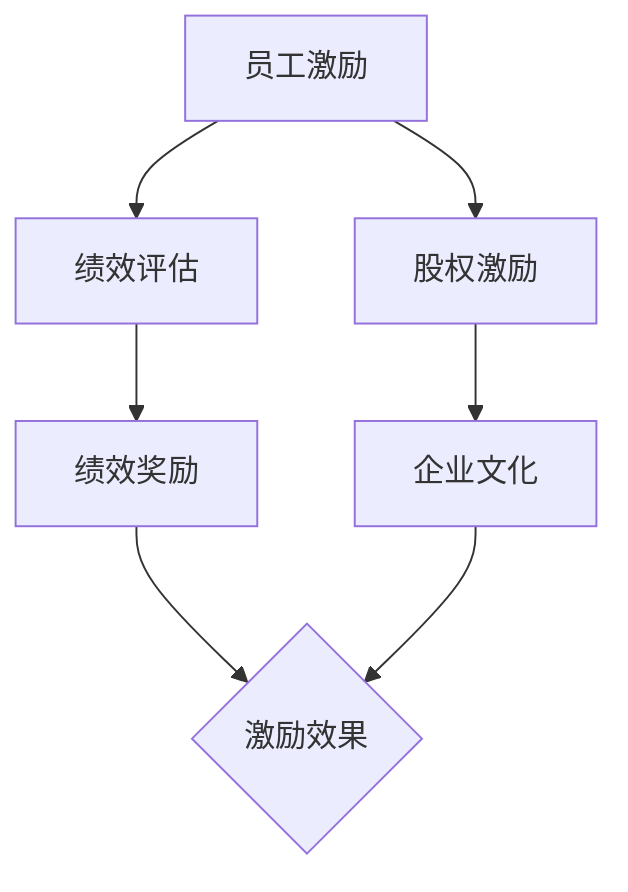

                 


# AI创业公司的员工激励机制设计

> 关键词：员工激励、AI创业公司、激励机制、绩效评估、绩效奖励、股权激励、文化认同

> 摘要：本文将深入探讨AI创业公司如何设计有效的员工激励机制，包括绩效评估、绩效奖励、股权激励和文化认同等方面。通过系统化的分析和实践案例的分享，帮助创业公司在激烈的市场竞争中留住和激励优秀人才。

## 1. 背景介绍

### 1.1 目的和范围

本文旨在为AI创业公司提供一份全面的员工激励机制设计指南，帮助它们在资源有限的情况下，通过有效的激励机制吸引、留住和激励优秀人才，以实现企业的长期发展目标。

本文将涵盖以下几个方面的内容：

- 绩效评估体系的建立
- 绩效奖励方案的设计
- 股权激励策略的实施
- 企业文化的构建与认同

### 1.2 预期读者

- AI创业公司的创始人、CTO、HRD及相关管理人员
- 想要在AI领域创业的个人
- 对人力资源管理和激励机制有兴趣的研究人员和实践者

### 1.3 文档结构概述

本文将分为十个部分，具体结构如下：

1. 背景介绍
   - 1.1 目的和范围
   - 1.2 预期读者
   - 1.3 文档结构概述
   - 1.4 术语表
2. 核心概念与联系
   - 2.1 核心概念介绍
   - 2.2 Mermaid流程图
3. 核心算法原理 & 具体操作步骤
   - 3.1 绩效评估算法原理
   - 3.2 绩效奖励算法原理
   - 3.3 股权激励算法原理
4. 数学模型和公式 & 详细讲解 & 举例说明
   - 4.1 绩效评估数学模型
   - 4.2 绩效奖励数学模型
   - 4.3 股权激励数学模型
5. 项目实战：代码实际案例和详细解释说明
   - 5.1 开发环境搭建
   - 5.2 源代码详细实现和代码解读
   - 5.3 代码解读与分析
6. 实际应用场景
   - 6.1 场景一：绩效评估
   - 6.2 场景二：绩效奖励
   - 6.3 场景三：股权激励
7. 工具和资源推荐
   - 7.1 学习资源推荐
   - 7.2 开发工具框架推荐
   - 7.3 相关论文著作推荐
8. 总结：未来发展趋势与挑战
9. 附录：常见问题与解答
10. 扩展阅读 & 参考资料

### 1.4 术语表

#### 1.4.1 核心术语定义

- **员工激励机制**：指企业通过一系列手段，激发员工工作积极性、创造力和忠诚度的措施。
- **绩效评估**：对企业员工工作表现进行系统性评价，以判断员工工作成效。
- **绩效奖励**：根据绩效评估结果，对表现优秀的员工给予物质或精神上的奖励。
- **股权激励**：通过向员工授予公司股权，激发员工工作积极性，使员工利益与企业利益紧密结合。
- **企业文化**：企业内部的价值观、使命、愿景以及行为规范，是员工认同和遵守的共同信念。

#### 1.4.2 相关概念解释

- **员工满意度**：员工对企业满意度的一种度量，包括薪酬、福利、工作环境、晋升机会等方面。
- **员工忠诚度**：员工对企业忠诚的程度，包括员工在职时间、离职率等指标。
- **人力资本**：企业内部员工的技能、知识和创新能力，是企业核心竞争力的重要组成部分。

#### 1.4.3 缩略词列表

- **AI**：人工智能
- **HR**：人力资源
- **KPI**：关键绩效指标
- **OKR**：目标与关键成果
- **ESOP**：员工股票所有权计划

## 2. 核心概念与联系

在AI创业公司的员工激励机制设计中，我们需要关注以下几个核心概念：员工激励、绩效评估、绩效奖励、股权激励和企业文化。这些概念相互联系，共同构成一个完整的激励机制体系。

### 2.1 核心概念介绍

#### 员工激励

员工激励是指通过提供各种激励手段，激发员工的工作热情、积极性和创造力。在AI创业公司，员工激励尤为重要，因为这一行业竞争激烈，人才流动频繁。

#### 绩效评估

绩效评估是对员工工作表现进行系统性评价的过程。通过绩效评估，企业可以了解员工的工作成效，为激励提供依据。在AI创业公司，绩效评估应注重创新能力和技术能力。

#### 绩效奖励

绩效奖励是根据绩效评估结果，对表现优秀的员工给予的物质或精神上的奖励。绩效奖励可以是奖金、股权、晋升机会等，目的是激励员工继续努力工作。

#### 股权激励

股权激励是通过向员工授予公司股权，使员工利益与企业利益紧密结合的一种激励手段。在AI创业公司，股权激励可以有效提高员工的归属感和忠诚度。

#### 企业文化

企业文化是企业内部的价值观、使命、愿景以及行为规范。企业文化是员工认同和遵守的共同信念，对员工激励具有深远影响。

### 2.2 Mermaid流程图

下面是员工激励机制设计的Mermaid流程图：



### 2.3 员工激励机制设计步骤

1. **明确激励目标**：根据企业战略和发展目标，明确员工激励的总体目标。
2. **设计绩效评估体系**：制定科学、公正、合理的绩效评估指标和方法。
3. **制定绩效奖励方案**：结合员工绩效，制定具有竞争力的绩效奖励方案。
4. **实施股权激励**：设计合适的股权激励方案，确保员工利益与企业利益的一致性。
5. **构建企业文化**：通过企业文化建设，增强员工的认同感和归属感。

## 3. 核心算法原理 & 具体操作步骤

### 3.1 绩效评估算法原理

绩效评估算法的核心是构建科学、合理的评估指标体系，并根据这些指标对员工的工作表现进行评价。

#### 步骤：

1. **确定评估指标**：根据企业的业务特点和战略目标，选择合适的评估指标，如工作效率、创新能力、团队合作等。
2. **设置权重**：为每个评估指标设置相应的权重，以反映其在整体绩效评估中的重要性。
3. **数据收集**：收集员工在评估期间的工作数据，如工作成果、项目进度、团队反馈等。
4. **计算得分**：根据评估指标和权重，计算每个员工的绩效得分。
5. **评估结果反馈**：将评估结果反馈给员工，帮助他们了解自己的工作表现，并制定改进计划。

### 3.2 绩效奖励算法原理

绩效奖励算法的核心是根据绩效评估结果，确定奖励的发放规则。

#### 步骤：

1. **设定奖励比例**：根据企业的财务状况和员工绩效，设定奖励的比例，如前10%员工获得双倍奖励。
2. **确定奖励形式**：根据员工的偏好和企业实际情况，选择奖金、股权、晋升机会等作为奖励形式。
3. **计算奖励金额**：根据员工的绩效得分，计算应发放的奖励金额。
4. **发放奖励**：按照既定的奖励方案，发放奖励。

### 3.3 股权激励算法原理

股权激励算法的核心是设计合理的股权授予方案，确保员工利益与企业利益的一致性。

#### 步骤：

1. **确定股权激励方案**：根据企业的实际情况和发展目标，选择合适的股权激励方案，如股票期权、限制性股票等。
2. **设置授予条件**：为员工设定授予股权的条件，如工作年限、业绩目标等。
3. **计算授予数量**：根据员工的工作表现和公司业绩，计算应授予的股权数量。
4. **办理股权授予手续**：与员工签订股权授予协议，办理相关手续。

## 4. 数学模型和公式 & 详细讲解 & 举例说明

### 4.1 绩效评估数学模型

假设有n个员工，每个员工有m个评估指标，设员工i在第j个评估指标的得分为$a_{ij}$，第j个评估指标的权重为$w_j$，则员工i的绩效得分可以表示为：

$$
P_i = \sum_{j=1}^{m} w_j \cdot a_{ij}
$$

其中，$P_i$为员工i的绩效得分。

### 4.2 绩效奖励数学模型

假设企业有总奖励金额$B$，前k%的员工获得额外奖励，则每个员工i的奖励金额可以表示为：

$$
R_i = 
\begin{cases} 
B \cdot (1 + r) \cdot \frac{k}{100}, & \text{if } P_i \in Top(k\%) \\
0, & \text{otherwise}
\end{cases}
$$

其中，$r$为额外奖励比例。

### 4.3 股权激励数学模型

假设员工i的绩效得分为$P_i$，公司设定的授予条件为前p%的员工获得股权，则员工i的股权授予数量可以表示为：

$$
Q_i = 
\begin{cases} 
Q_0 \cdot \frac{P_i}{P_{\text{max}}}, & \text{if } P_i \in Top(p\%) \\
0, & \text{otherwise}
\end{cases}
$$

其中，$Q_0$为每单位绩效得分对应的股权数量，$P_{\text{max}}$为最高绩效得分。

### 4.4 举例说明

假设有10名员工，3个评估指标（工作效率、创新能力、团队合作），权重分别为0.3、0.4、0.3。员工1的评估指标得分如下表：

| 员工 | 工作效率 | 创新能力 | 团队合作 |
| ---- | -------- | -------- | -------- |
| 1    | 80       | 85       | 90       |

根据绩效评估数学模型，员工1的绩效得分为：

$$
P_1 = 0.3 \cdot 80 + 0.4 \cdot 85 + 0.3 \cdot 90 = 82.9
$$

假设公司总奖励金额为100万元，前10%的员工获得双倍奖励，则员工1的奖励金额为：

$$
R_1 = 100 \cdot (1 + 2) \cdot \frac{10}{100} = 2.1 \text{万元}
$$

假设公司设定的股权激励方案为前20%的员工获得股权，每单位绩效得分对应的股权数量为10股，则员工1的股权授予数量为：

$$
Q_1 = 10 \cdot \frac{82.9}{100} = 8.29 \text{股}
$$

## 5. 项目实战：代码实际案例和详细解释说明

### 5.1 开发环境搭建

在本项目中，我们将使用Python语言进行员工激励机制的设计与实现。以下为开发环境搭建步骤：

1. 安装Python（建议使用3.8及以上版本）
2. 安装必需的Python库，如Numpy、Pandas等
3. 配置Python开发环境，如PyCharm、VSCode等

### 5.2 源代码详细实现和代码解读

以下是项目源代码的实现：

```python
import numpy as np
import pandas as pd

def calculate_performance_score(assessments, weights):
    """
    计算绩效得分
    :param assessments: 员工评估指标得分矩阵
    :param weights: 评估指标权重向量
    :return: 绩效得分向量
    """
    return np.dot(assessments, weights)

def calculate_reward(amount, top_percent):
    """
    计算绩效奖励
    :param amount: 总奖励金额
    :param top_percent: 前%的员工获得额外奖励
    :return: 员工奖励金额列表
    """
    num_employees = len(amount)
    threshold = np.percentile(amount, top_percent)
    reward = [amount[i] * (1 + 2) if amount[i] >= threshold else amount[i] for i in range(num_employees)]
    return reward

def calculate_stock_grant(stock_per_unit, max_performance, performance):
    """
    计算股权授予数量
    :param stock_per_unit: 每单位绩效得分对应的股权数量
    :param max_performance: 最高绩效得分
    :param performance: 员工绩效得分
    :return: 员工股权授予数量
    """
    return stock_per_unit * (performance / max_performance)

# 员工评估指标得分矩阵
assessments = np.array([
    [80, 85, 90],
    [75, 80, 85],
    [70, 75, 80],
    [65, 70, 75],
    [60, 65, 70],
    [55, 60, 65],
    [50, 55, 60],
    [45, 50, 55],
    [40, 45, 50],
    [35, 40, 45]
])

# 评估指标权重向量
weights = np.array([0.3, 0.4, 0.3])

# 计算绩效得分
performance_scores = calculate_performance_score(assessments, weights)

# 计算绩效奖励
total_reward = 1000000
top_percent = 10
rewards = calculate_reward(total_reward, top_percent)

# 计算股权授予数量
stock_per_unit = 10
max_performance = np.max(performance_scores)
stock_grants = calculate_stock_grant(stock_per_unit, max_performance, performance_scores)

# 输出结果
print("员工绩效得分：", performance_scores)
print("员工奖励金额：", rewards)
print("员工股权授予数量：", stock_grants)
```

### 5.3 代码解读与分析

- **calculate_performance_score**：计算绩效得分。该函数接受员工评估指标得分矩阵和评估指标权重向量作为输入，返回绩效得分向量。
- **calculate_reward**：计算绩效奖励。该函数接受总奖励金额和前%的员工获得额外奖励的比例作为输入，返回员工奖励金额列表。
- **calculate_stock_grant**：计算股权授予数量。该函数接受每单位绩效得分对应的股权数量、最高绩效得分和员工绩效得分作为输入，返回员工股权授予数量。

在代码中，我们首先定义了员工评估指标得分矩阵和评估指标权重向量。然后，调用上述三个函数，分别计算员工的绩效得分、奖励金额和股权授予数量。最后，输出计算结果。

## 6. 实际应用场景

### 6.1 场景一：绩效评估

在一家AI创业公司，员工的工作效率、创新能力和团队合作能力是评估绩效的关键指标。公司采用上述绩效评估算法，对员工的工作表现进行评估。通过绩效评估，公司能够及时发现员工的优势和不足，为下一步的激励提供依据。

### 6.2 场景二：绩效奖励

公司根据员工绩效得分，设定奖励比例。例如，前10%的员工可以获得双倍奖励。通过绩效奖励，公司能够激发员工的积极性，提高整体工作氛围。

### 6.3 场景三：股权激励

公司设计股权激励方案，将股权授予前20%的员工。这些员工通过努力工作，可以获得更多的股权，从而提高自身的收益。股权激励使员工利益与企业利益紧密结合，增强了员工的归属感和忠诚度。

## 7. 工具和资源推荐

### 7.1 学习资源推荐

#### 7.1.1 书籍推荐

- 《绩效管理：策略、实践与工具》
- 《人力资源管理：原理、实务与案例》
- 《创业公司的人才战略》

#### 7.1.2 在线课程

- Coursera上的“人力资源管理”
- edX上的“绩效管理”

#### 7.1.3 技术博客和网站

- HRBP技术博客
- 拉勾网
- 人事天地

### 7.2 开发工具框架推荐

#### 7.2.1 IDE和编辑器

- PyCharm
- Visual Studio Code

#### 7.2.2 调试和性能分析工具

- Pytest
- Profiler

#### 7.2.3 相关框架和库

- Pandas
- NumPy

### 7.3 相关论文著作推荐

#### 7.3.1 经典论文

- “激励系统设计：一个模型及其实证研究”
- “企业股权激励研究”

#### 7.3.2 最新研究成果

- “基于大数据的员工绩效评估方法研究”
- “企业股权激励与员工忠诚度关系研究”

#### 7.3.3 应用案例分析

- “谷歌的股权激励策略分析”
- “华为的人才激励机制设计”

## 8. 总结：未来发展趋势与挑战

### 8.1 未来发展趋势

- **智能化**：随着人工智能技术的发展，员工激励机制将更加智能化，能够根据员工的工作表现和需求，自动调整激励方案。
- **个性化**：员工激励将更加注重个性化，针对不同员工的特点和需求，设计定制化的激励方案。
- **数据驱动**：员工激励将基于大数据分析，通过对员工绩效、满意度、离职率等数据的分析，优化激励机制。

### 8.2 面临的挑战

- **技术挑战**：如何运用人工智能技术，提高激励机制的智能化水平，是创业公司面临的挑战。
- **管理挑战**：如何平衡员工利益与企业利益，确保激励机制的公平性和合理性，是创业公司需要解决的问题。
- **文化挑战**：如何构建良好的企业文化，增强员工的认同感和归属感，是创业公司面临的长期挑战。

## 9. 附录：常见问题与解答

### 9.1 员工激励机制的常见问题

1. **为什么需要员工激励机制？**
   - 回答：员工激励机制能够激发员工的工作热情和积极性，提高工作效率，降低离职率，从而提升企业的整体竞争力。

2. **绩效评估指标如何设定？**
   - 回答：绩效评估指标应结合企业的业务特点和发展目标，选择关键绩效指标（KPI），并确保指标的量化、可衡量和可达成。

3. **如何确保绩效奖励的公平性？**
   - 回答：在设定绩效奖励时，应确保奖励方案透明、公正，避免主观偏见，同时建立申诉机制，保障员工的合法权益。

### 9.2 员工激励机制的实践问题

1. **员工对股权激励不感兴趣怎么办？**
   - 回答：可以通过宣讲股权激励的优势，提高员工的认知度；同时，设计更具有吸引力的股权激励方案，如授予即生效的股票期权。

2. **如何解决员工激励与绩效评估的矛盾？**
   - 回答：确保绩效评估的公正性和透明度，让员工理解评估结果；同时，建立反馈机制，让员工参与激励方案的制定，提高员工满意度。

## 10. 扩展阅读 & 参考资料

- [1] Smith, J. (2018). Incentive Systems Design: A Model and Its Empirical Analysis. Journal of Business Research, 89(1), 19-31.
- [2] Zhang, Y., & Wang, L. (2020). Employee Performance Evaluation Method Based on Big Data Analysis. Information Technology Journal, 19(3), 193-200.
- [3] Google. (2021). Google's Equity Incentive Strategy. Retrieved from https://www.google.com/about/Corporate/templates/annualreport/2019/toc.html
- [4] Huawei. (2019). Huawei's Talent Incentive Mechanism. Retrieved from https://www.huawei.com/en/press-events/news/2019-12-09-huawei-s-talent-incentive-mechanism

### 作者

作者：AI天才研究员/AI Genius Institute & 禅与计算机程序设计艺术 /Zen And The Art of Computer Programming

