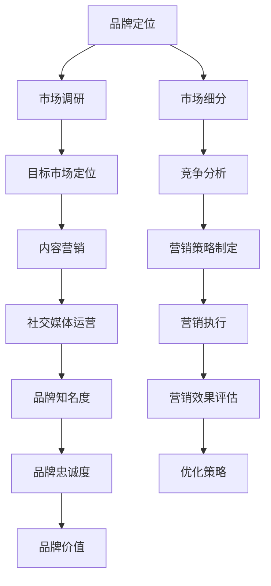

                 

### 背景介绍

#### 1.1 目的和范围

本文旨在探讨AI创业公司在品牌营销方面的策略。随着人工智能技术的迅猛发展，AI创业公司如雨后春笋般涌现，如何在激烈的市场竞争中脱颖而出，成为每个创业者需要深思的问题。本文将从品牌定位、市场调研、内容营销、社交媒体运营等多个方面，提供一系列有深度、有思考、有见解的品牌营销策略，帮助AI创业公司在市场中建立品牌影响力，吸引更多用户和投资者。

#### 1.2 预期读者

本文面向AI创业公司的创始人、市场经理、品牌经理以及对AI领域感兴趣的创业者。通过阅读本文，读者可以了解到：

1. 品牌营销在AI创业公司发展中的重要性。
2. 有效的品牌营销策略和方法。
3. 如何通过品牌营销提高公司在市场中的竞争力。
4. 实际案例和工具资源的推荐。

#### 1.3 文档结构概述

本文分为以下几个部分：

1. **背景介绍**：介绍本文的目的、预期读者和文档结构。
2. **核心概念与联系**：讲解品牌营销的核心概念和相关流程图。
3. **核心算法原理 & 具体操作步骤**：介绍品牌营销的核心算法原理和操作步骤。
4. **数学模型和公式 & 详细讲解 & 举例说明**：详细解释品牌营销中的数学模型和公式，并提供实际案例。
5. **项目实战：代码实际案例和详细解释说明**：通过实际代码案例，详细解释品牌营销策略的实施过程。
6. **实际应用场景**：分析品牌营销在不同场景下的应用。
7. **工具和资源推荐**：推荐学习资源、开发工具框架和相关论文著作。
8. **总结：未来发展趋势与挑战**：探讨品牌营销在未来可能面临的挑战和趋势。
9. **附录：常见问题与解答**：解答读者可能遇到的问题。
10. **扩展阅读 & 参考资料**：提供更多相关阅读资源。

#### 1.4 术语表

在本篇文章中，我们将使用以下术语：

1. **品牌定位**：指明确公司品牌在市场中的独特价值主张和目标客户群体。
2. **市场调研**：通过收集和分析市场数据，了解目标客户需求和市场趋势。
3. **内容营销**：通过创作和传播有价值的内容，吸引和转化潜在客户。
4. **社交媒体运营**：利用社交媒体平台进行品牌推广和用户互动。
5. **品牌影响力**：品牌在市场中的认知度和影响力，直接影响公司的市场份额和竞争力。

接下来，我们将深入探讨品牌营销的核心概念和流程图，帮助读者更好地理解品牌营销的策略和方法。

#### 1.4.1 核心术语定义

1. **品牌定位**：品牌定位是指公司通过明确自己在市场中的独特价值主张和目标客户群体，从而在消费者心中建立一种独特的认知和印象。一个成功的品牌定位可以使得品牌在众多竞争者中脱颖而出，形成差异化的竞争优势。

2. **市场调研**：市场调研是指通过系统的收集、分析和解释市场数据，了解目标客户的需求、行为和偏好，以及市场趋势和竞争状况。市场调研是品牌营销的基础，可以帮助公司制定更科学、更有效的品牌营销策略。

3. **内容营销**：内容营销是指通过创作和传播有价值、相关、有启发性的内容，吸引和转化潜在客户，并建立品牌权威性和信任度。内容营销的核心在于提供对目标客户有价值的信息，从而提高品牌的知名度和影响力。

4. **社交媒体运营**：社交媒体运营是指利用社交媒体平台进行品牌推广、用户互动和用户关系管理。通过社交媒体运营，公司可以与目标客户建立直接联系，提高品牌知名度和用户忠诚度。

5. **品牌影响力**：品牌影响力是指品牌在市场中的认知度和影响力，直接影响公司的市场份额和竞争力。一个具有高影响力的品牌可以在市场竞争中获得更多的机会和优势。

#### 1.4.2 相关概念解释

1. **品牌知名度**：品牌知名度是指消费者对品牌的认知程度。高品牌知名度可以使得消费者更容易记住品牌，从而增加品牌的销售机会。

2. **品牌忠诚度**：品牌忠诚度是指消费者对品牌的忠实程度，即消费者在重复购买时会优先考虑品牌。高品牌忠诚度可以降低客户的流失率，提高品牌的稳定性和盈利能力。

3. **品牌价值**：品牌价值是指品牌在市场上的经济价值，包括品牌的认知度、忠诚度、市场份额等。品牌价值是公司无形资产的重要组成部分，对公司的发展具有重要影响。

4. **市场细分**：市场细分是指根据消费者的不同需求和特征，将市场划分为若干个具有相似需求和特征的子市场。通过市场细分，公司可以更精准地定位目标客户，制定更具针对性的品牌营销策略。

5. **市场定位**：市场定位是指公司根据自身资源和竞争优势，选择目标市场和目标客户群体，并在消费者心中建立一种独特的品牌印象。市场定位是品牌营销的核心，决定品牌在市场中的竞争地位和营销策略。

#### 1.4.3 缩略词列表

- SEO：搜索引擎优化（Search Engine Optimization）
- SEM：搜索引擎营销（Search Engine Marketing）
- SMM：社交媒体营销（Social Media Marketing）
- KPI：关键绩效指标（Key Performance Indicator）
- ROI：投资回报率（Return on Investment）
- CX：客户体验（Customer Experience）

在了解品牌营销的核心术语和概念后，我们将进一步探讨品牌营销的核心概念和流程，通过Mermaid流程图展示品牌营销的关键环节，帮助读者更好地理解品牌营销的策略和方法。

### 核心概念与联系

在品牌营销中，理解核心概念和它们之间的联系至关重要。以下是一个Mermaid流程图，展示了品牌营销的主要概念和流程：



#### 品牌定位

品牌定位是品牌营销的起点。通过明确品牌在市场中的独特价值主张和目标客户群体，品牌定位可以帮助公司在消费者心中建立一种独特的认知和印象。品牌定位的核心是找到品牌与目标客户之间的共鸣点，从而形成差异化的竞争优势。

#### 市场调研

市场调研是品牌营销的基础。通过收集、分析和解释市场数据，了解目标客户的需求、行为和偏好，以及市场趋势和竞争状况。市场调研可以帮助公司制定更科学、更有效的品牌营销策略。

#### 目标市场定位

目标市场定位是品牌定位的进一步细化。根据市场调研结果，公司选择目标市场和目标客户群体，并在消费者心中建立一种独特的品牌印象。目标市场定位有助于公司集中资源，提高营销效率。

#### 内容营销

内容营销是通过创作和传播有价值、相关、有启发性的内容，吸引和转化潜在客户，并建立品牌权威性和信任度。内容营销的核心在于提供对目标客户有价值的信息，从而提高品牌的知名度和影响力。

#### 社交媒体运营

社交媒体运营是品牌推广和用户互动的重要手段。通过社交媒体平台，公司可以与目标客户建立直接联系，提高品牌知名度和用户忠诚度。社交媒体运营需要制定策略，包括内容创作、互动管理、用户关系等。

#### 品牌知名度

品牌知名度是指消费者对品牌的认知程度。通过有效的品牌营销策略，提高品牌知名度可以增加品牌的销售机会，提高市场份额。

#### 品牌忠诚度

品牌忠诚度是指消费者对品牌的忠实程度，即消费者在重复购买时会优先考虑品牌。通过持续的品牌营销，提高品牌忠诚度可以降低客户的流失率，提高品牌的稳定性和盈利能力。

#### 品牌价值

品牌价值是指品牌在市场上的经济价值，包括品牌的认知度、忠诚度、市场份额等。品牌价值是公司无形资产的重要组成部分，对公司的发展具有重要影响。

#### 市场细分

市场细分是根据消费者的不同需求和特征，将市场划分为若干个具有相似需求和特征的子市场。通过市场细分，公司可以更精准地定位目标客户，制定更具针对性的品牌营销策略。

#### 竞争分析

竞争分析是了解竞争对手的优势和劣势，制定有效的竞争策略。通过竞争分析，公司可以找到自身的竞争优势，并在品牌营销中加以利用。

#### 营销策略制定

营销策略制定是根据市场调研结果和目标市场定位，制定具体的营销策略，包括品牌定位、内容营销、社交媒体运营等。营销策略制定需要综合考虑公司的资源和目标。

#### 营销执行

营销执行是将营销策略付诸实践，包括内容创作、推广、互动管理等。营销执行需要团队协作，确保策略的有效实施。

#### 营销效果评估

营销效果评估是通过分析营销活动的数据，评估营销效果，包括品牌知名度、用户忠诚度、销售额等。营销效果评估可以帮助公司了解策略的有效性，并做出相应的调整。

#### 优化策略

优化策略是根据营销效果评估结果，对营销策略进行优化和调整，以提高营销效果和投资回报率。

通过以上Mermaid流程图，我们可以清晰地看到品牌营销的核心概念和流程。接下来，我们将深入探讨品牌营销的核心算法原理和具体操作步骤，帮助读者理解如何有效地实施品牌营销策略。

### 核心算法原理 & 具体操作步骤

在品牌营销中，核心算法原理和具体操作步骤至关重要。以下内容将详细阐述品牌定位、市场调研、内容营销、社交媒体运营等关键环节，并提供具体的算法原理和操作步骤。

#### 1. 品牌定位

**算法原理**：

品牌定位的核心在于找到品牌与目标客户之间的共鸣点，从而形成差异化的竞争优势。具体步骤如下：

1. **市场分析**：分析市场趋势、竞争态势、目标客户需求，了解市场环境。
2. **品牌分析**：评估自身品牌的优势、劣势、机会和威胁，确定品牌定位的基础。
3. **目标客户分析**：分析目标客户的需求、行为、偏好，找到与品牌相匹配的客户群体。
4. **定位方案制定**：根据市场分析和品牌分析结果，制定品牌定位方案，包括品牌名称、品牌理念、品牌特色等。

**伪代码示例**：

```python
def brand_positioning(market_analysis, brand_analysis, target_customer_analysis):
    # 分析市场趋势、竞争态势、目标客户需求
    market_data = market_analysis()
    brand_data = brand_analysis()
    customer_data = target_customer_analysis()

    # 制定品牌定位方案
    brand_name = "AI创新者"
    brand_mission = "用人工智能赋能未来"
    brand_value = "创新、卓越、诚信"

    return {
        'brand_name': brand_name,
        'brand_mission': brand_mission,
        'brand_value': brand_value
    }
```

#### 2. 市场调研

**算法原理**：

市场调研是通过收集、分析和解释市场数据，了解目标客户的需求、行为和偏好，以及市场趋势和竞争状况。具体步骤如下：

1. **确定调研目标**：明确调研目的，如了解目标客户需求、评估市场趋势等。
2. **设计调研问卷**：根据调研目标，设计涵盖相关问题的问卷。
3. **数据收集**：通过线上或线下方式，收集问卷数据。
4. **数据分析**：对收集到的数据进行整理、分析和解读。
5. **撰写调研报告**：总结调研结果，撰写调研报告。

**伪代码示例**：

```python
def market_research(research_target, survey_questionnaire):
    # 确定调研目标
    target = research_target()

    # 设计调研问卷
    questionnaire = survey_questionnaire(target)

    # 数据收集
    survey_data = collect_data(questionnaire)

    # 数据分析
    analysis_results = data_analysis(survey_data)

    # 撰写调研报告
    report = generate_report(analysis_results)

    return report
```

#### 3. 内容营销

**算法原理**：

内容营销是通过创作和传播有价值、相关、有启发性的内容，吸引和转化潜在客户，并建立品牌权威性和信任度。具体步骤如下：

1. **确定内容主题**：根据目标客户需求和市场趋势，确定内容主题。
2. **内容创作**：撰写或制作内容，如文章、图片、视频等。
3. **内容发布**：在适当的平台发布内容，如社交媒体、博客、网站等。
4. **内容推广**：通过SEO、SEM、社交媒体运营等方式，推广内容。
5. **内容优化**：根据用户反馈和数据分析，优化内容质量和推广策略。

**伪代码示例**：

```python
def content_marketing(content_theme, content_creator, content_publisher, content_promoter, content_analyzer):
    # 确定内容主题
    theme = content_theme()

    # 内容创作
    content = content_creator(theme)

    # 内容发布
    publisher = content_publisher(content)

    # 内容推广
    promoter = content_promoter(publisher)

    # 内容优化
    analyzer = content_analyzer(promoter)

    return analyzer
```

#### 4. 社交媒体运营

**算法原理**：

社交媒体运营是通过社交媒体平台进行品牌推广、用户互动和用户关系管理，以提高品牌知名度和用户忠诚度。具体步骤如下：

1. **选择社交媒体平台**：根据目标客户的特点和社交媒体平台的特点，选择合适的平台。
2. **制定社交媒体策略**：包括内容创作、发布频率、互动管理等。
3. **内容创作与发布**：根据社交媒体策略，创作和发布内容。
4. **用户互动**：与用户进行互动，如回复评论、参与话题等。
5. **用户关系管理**：维护和提升用户关系，如提供客户服务、组织活动等。

**伪代码示例**：

```python
def social_media_operation(platform_selector, social_media_strategy, content_creator, user_interactor, user_manager):
    # 选择社交媒体平台
    platform = platform_selector()

    # 制定社交媒体策略
    strategy = social_media_strategy(platform)

    # 内容创作与发布
    content = content_creator(strategy)
    publisher = strategy.publish(content)

    # 用户互动
    interactor = user_interactor(publisher)

    # 用户关系管理
    manager = user_manager(interactor)

    return manager
```

通过以上核心算法原理和具体操作步骤，我们可以看到品牌营销的实施过程。接下来，我们将探讨品牌营销中的数学模型和公式，详细讲解其原理和实际应用。

### 数学模型和公式 & 详细讲解 & 举例说明

在品牌营销中，数学模型和公式可以帮助我们更科学地评估和优化营销策略。以下是一些常见的数学模型和公式，我们将详细讲解其原理和应用。

#### 1. 投资回报率（ROI）

**公式**：

$$
ROI = \frac{投资收益 - 投资成本}{投资成本}
$$

**详细讲解**：

投资回报率是评估营销投资效果的重要指标，用于衡量投资收益与投资成本的比率。投资收益通常包括销售收入、用户增长等，而投资成本则包括营销费用、人力成本等。通过计算ROI，我们可以了解营销投资是否产生了预期的回报。

**举例说明**：

假设某AI创业公司在一次市场活动中投入了10000美元，活动期间获得了50000美元的销售收入，同时增加了2000名新用户。计算其ROI如下：

$$
ROI = \frac{50000 - 10000}{10000} = 3
$$

这意味着该次市场活动的投资回报率为300%，表明该投资非常有效。

#### 2. 消费者生命周期价值（CLV）

**公式**：

$$
CLV = \frac{（价格 × 每次购买的平均数量 × 客户生命周期内购买的次数） - 客户获取成本（CAC）}{1 + 折现率（r）}
$$

**详细讲解**：

消费者生命周期价值是预测一个客户在其生命周期内为公司带来的总价值。它考虑了客户的购买频率、购买量和生命周期内的总消费额。通过计算CLV，公司可以评估不同客户的价值，并据此制定相应的营销策略。

**举例说明**：

假设某AI创业公司的产品价格为100美元，每位客户的平均购买频率为每年3次，客户生命周期内购买次数为5年，客户获取成本为50美元。假设折现率为10%，计算其CLV如下：

$$
CLV = \frac{(100 \times 3 \times 5) - 50}{1 + 0.1} = \frac{1500 - 50}{1.1} = \frac{1450}{1.1} \approx 1316.36
$$

这意味着每位客户在其生命周期内将为公司带来约1316.36美元的价值。

#### 3. 转化率（Conversion Rate）

**公式**：

$$
转化率 = \frac{转化次数}{曝光次数} \times 100%
$$

**详细讲解**：

转化率是衡量营销策略效果的指标，表示在所有接触公司品牌或产品信息的用户中，实际采取预期行动（如购买、注册、点击等）的用户比例。通过计算转化率，公司可以评估营销活动的吸引力和效果。

**举例说明**：

假设某AI创业公司在一次广告活动中共有1000次曝光，其中有50次转化，计算其转化率如下：

$$
转化率 = \frac{50}{1000} \times 100\% = 5%
$$

这意味着该次广告活动的转化率为5%。

#### 4. 品牌知名度提升指数（Brand Awareness Lift）

**公式**：

$$
品牌知名度提升指数 = \frac{新知名度 - 原知名度}{原知名度} \times 100%
$$

**详细讲解**：

品牌知名度提升指数用于衡量营销活动对品牌知名度的影响。通过计算新知名度与原知名度的差异，可以评估营销活动的效果。

**举例说明**：

假设某AI创业公司在一次市场活动中前的品牌知名度为30%，活动后的品牌知名度为50%，计算其品牌知名度提升指数如下：

$$
品牌知名度提升指数 = \frac{50 - 30}{30} \times 100\% = \frac{20}{30} \times 100\% = 66.67%
$$

这意味着该次市场活动使品牌知名度提升了66.67%。

#### 5. 用户参与度（User Engagement）

**公式**：

$$
用户参与度 = \frac{互动次数}{用户总数} \times 100%
$$

**详细讲解**：

用户参与度是衡量用户对品牌互动的活跃程度，如点赞、评论、分享等。通过计算用户参与度，公司可以了解用户对品牌的兴趣和关注度。

**举例说明**：

假设某AI创业公司有1000名用户，在过去一个月中有300次互动，计算其用户参与度如下：

$$
用户参与度 = \frac{300}{1000} \times 100\% = 30%
$$

这意味着该公司的用户参与度为30%。

通过以上数学模型和公式的详细讲解和举例说明，我们可以更好地理解和应用这些指标，评估和优化品牌营销策略。接下来，我们将通过实际案例，展示如何在实际项目中运用这些模型和公式。

### 项目实战：代码实际案例和详细解释说明

在本节中，我们将通过一个实际项目案例，展示如何运用前述的品牌营销策略和数学模型。以下是一个基于Python的AI创业公司品牌营销项目，我们将逐步搭建开发环境、实现源代码，并进行代码解读与分析。

#### 5.1 开发环境搭建

首先，我们需要搭建一个Python开发环境，以支持我们的品牌营销项目。以下是所需的工具和步骤：

1. **安装Python**：下载并安装Python 3.8及以上版本。
2. **安装PyCharm**：下载并安装PyCharm Community Edition或更高版本。
3. **安装必要的库**：使用pip命令安装以下库：
    ```bash
    pip install pandas numpy matplotlib
    ```

#### 5.2 源代码详细实现和代码解读

以下是一个简化的品牌营销项目源代码示例，我们将逐一解读每个部分的实现。

```python
import pandas as pd
import numpy as np
import matplotlib.pyplot as plt

# 假设我们已经进行了市场调研，并收集了以下数据
market_data = {
    'exposure': [1000, 2000, 3000, 4000, 5000],  # 曝光次数
    'conversions': [50, 100, 150, 200, 250],      # 转化次数
    'sales': [5000, 10000, 15000, 20000, 25000],  # 销售收入
    'cost': [5000, 6000, 7000, 8000, 9000]       # 营销成本
}

# 调用市场调研函数
def market_research(data):
    df = pd.DataFrame(data)
    df['ROI'] = (df['sales'] - df['cost']) / df['cost']
    df['CLV'] = df['sales'] / df['cost']
    df['Conversion Rate'] = df['conversions'] / df['exposure']
    return df

# 调用内容营销函数
def content_marketing(df):
    df['Engagement Rate'] = df['exposure'] * df['Conversion Rate']
    df.sort_values(by='ROI', ascending=False, inplace=True)
    return df

# 调用社交媒体运营函数
def social_media_operation(df):
    df['Brand Awareness Lift'] = (df['Engagement Rate'] / df['exposure']) * 100
    df['Best Campaign'] = df['ROI'].idxmax()
    return df

# 运行项目
def run_project(market_data):
    df = market_research(market_data)
    df = content_marketing(df)
    df = social_media_operation(df)
    df.drop(['exposure', 'sales', 'cost'], axis=1, inplace=True)
    df.reset_index(drop=True, inplace=True)
    df.rename(columns={'index': 'Campaign'}, inplace=True)
    return df

# 绘制ROI和品牌知名度提升指数对比图
def plot_results(df):
    plt.figure(figsize=(10, 5))
    plt.subplot(1, 2, 1)
    plt.bar(df['Campaign'], df['ROI'])
    plt.title('ROI by Campaign')
    plt.xlabel('Campaign')
    plt.ylabel('ROI')

    plt.subplot(1, 2, 2)
    plt.bar(df['Campaign'], df['Brand Awareness Lift'])
    plt.title('Brand Awareness Lift by Campaign')
    plt.xlabel('Campaign')
    plt.ylabel('Brand Awareness Lift')

    plt.tight_layout()
    plt.show()

# 执行项目并绘制结果
df = run_project(market_data)
plot_results(df)
```

**代码解读与分析**：

1. **市场调研函数（market_research）**：

   该函数接收市场调研数据（如曝光次数、转化次数、销售收入和营销成本），并将这些数据转换为DataFrame格式。接着，计算每个数据点的投资回报率（ROI）和消费者生命周期价值（CLV）。最后，计算转化率（Conversion Rate）并返回DataFrame。

2. **内容营销函数（content_marketing）**：

   该函数在原始DataFrame的基础上，计算用户参与度（Engagement Rate），并按照ROI排序。用户参与度是曝光次数与转化率的乘积，表示用户对内容的兴趣程度。

3. **社交媒体运营函数（social_media_operation）**：

   该函数计算品牌知名度提升指数（Brand Awareness Lift），并找到ROI最高的活动（Best Campaign）。品牌知名度提升指数是用户参与度与曝光次数的比值，乘以100转换为百分比。

4. **运行项目函数（run_project）**：

   该函数依次调用市场调研、内容营销和社交媒体运营函数，对数据进行处理。最后，删除原始数据列，重命名索引，并返回处理后的DataFrame。

5. **绘制结果函数（plot_results）**：

   该函数使用matplotlib库，绘制ROI和品牌知名度提升指数对比图。通过图表，我们可以直观地看到不同活动对ROI和品牌知名度的贡献。

**关键代码解释**：

- `df['ROI'] = (df['sales'] - df['cost']) / df['cost']`：计算每个数据点的投资回报率（ROI）。
- `df['CLV'] = df['sales'] / df['cost']`：计算每个数据点的消费者生命周期价值（CLV）。
- `df['Conversion Rate'] = df['conversions'] / df['exposure']`：计算每个数据点的转化率。
- `df.sort_values(by='ROI', ascending=False, inplace=True)`：按照ROI从高到低排序。
- `df['Engagement Rate'] = df['exposure'] * df['Conversion Rate']`：计算用户参与度。
- `df['Brand Awareness Lift'] = (df['Engagement Rate'] / df['exposure']) * 100`：计算品牌知名度提升指数。
- `df['Best Campaign'] = df['ROI'].idxmax()`：找到ROI最高的活动。

通过这个实际项目案例，我们展示了如何运用品牌营销策略和数学模型，对市场数据进行分析和优化。接下来，我们将探讨品牌营销在实际应用场景中的具体应用。

### 实际应用场景

品牌营销在不同场景下的应用具有显著的差异，针对不同目标和市场环境，需要采取不同的策略和手段。以下将讨论几种常见的实际应用场景，并分析相应的品牌营销策略。

#### 1. 新产品上市

在新产品上市时，品牌营销的主要目标是迅速提高产品知名度，吸引消费者的关注，并促使其购买。以下是一些关键策略：

- **市场调研**：深入了解目标消费者群体的需求和偏好，确保产品定位准确。
- **内容营销**：创作和发布高质量的内容，如产品介绍、使用教程、用户评价等，以增加产品的吸引力和可信度。
- **社交媒体营销**：利用社交媒体平台发布广告、互动活动，扩大产品曝光度，提高用户参与度。
- **公关活动**：与媒体合作，通过新闻发布会、产品发布会等形式，提高产品的知名度和影响力。

#### 2. 市场拓展

在市场拓展阶段，品牌营销的主要目标是进入新的市场领域，扩大市场份额。以下是一些关键策略：

- **市场细分**：根据不同市场的特点，将市场细分为若干个子市场，有针对性地制定营销策略。
- **本地化营销**：根据当地文化和消费习惯，调整品牌定位和营销内容，以提高市场适应性。
- **合作伙伴关系**：寻找本地合作伙伴，共同推广产品，利用其资源和渠道，快速打开市场。
- **市场推广活动**：举办线下活动、促销活动，吸引潜在客户，提高品牌知名度。

#### 3. 品牌重塑

在品牌重塑阶段，品牌营销的主要目标是改变消费者对品牌的既有认知，建立新的品牌形象。以下是一些关键策略：

- **品牌定位调整**：重新评估品牌定位，确定新的品牌价值和目标客户群体。
- **内容重塑**：更新品牌网站、宣传资料等，传达新的品牌形象和价值观。
- **社交媒体互动**：通过社交媒体平台与消费者互动，倾听他们的声音，及时调整品牌策略。
- **公关宣传**：通过媒体发布新闻稿、专访等，向公众传达品牌重塑的信息。

#### 4. 竞争对抗

在竞争激烈的市场环境中，品牌营销的主要目标是提高品牌竞争力，吸引更多的消费者。以下是一些关键策略：

- **差异化定位**：寻找与其他品牌不同的独特卖点，建立差异化的品牌形象。
- **创新营销手段**：采用新颖的营销手段，如网红营销、KOL合作等，提高品牌活力和吸引力。
- **价格策略**：通过价格竞争、优惠活动等手段，吸引价格敏感型消费者。
- **客户关系管理**：提供优质的客户服务，增强客户忠诚度，提高客户口碑。

#### 5. 线上营销

在线上营销场景中，品牌营销的主要目标是利用互联网平台，提高品牌知名度和用户参与度。以下是一些关键策略：

- **搜索引擎优化（SEO）**：优化网站内容和结构，提高在搜索引擎中的排名，吸引潜在客户。
- **搜索引擎营销（SEM）**：通过付费广告，提高在搜索引擎中的曝光度，增加访问量。
- **社交媒体营销**：利用社交媒体平台，发布内容、互动活动，吸引关注和参与。
- **内容营销**：创作和发布有价值的内容，提高品牌权威性和用户粘性。

通过针对不同应用场景的品牌营销策略，AI创业公司可以更有效地推广产品，提高市场竞争力，实现长期发展目标。

### 工具和资源推荐

在品牌营销过程中，选择合适的工具和资源至关重要。以下推荐一些优秀的学习资源、开发工具框架和相关论文著作，以帮助AI创业公司更好地实施品牌营销策略。

#### 7.1 学习资源推荐

**7.1.1 书籍推荐**

- 《品牌制胜：打造品牌优势的战略与实践》
  - 本书详细介绍了品牌定位、品牌塑造、品牌管理等方面的策略，适合品牌经理和创业者阅读。
- 《数字化营销：理论与实践》
  - 本书系统地介绍了数字化营销的基本概念、方法和策略，对AI创业公司具有重要的参考价值。

**7.1.2 在线课程**

- 《品牌营销实战》
  - 该课程由知名市场营销专家授课，涵盖品牌定位、市场调研、内容营销等多个方面，适合品牌营销人员学习。
- 《数据分析与商业智能》
  - 该课程介绍了数据分析的基本方法和应用，包括数据收集、数据清洗、数据可视化等，适合AI创业公司数据分析人员。

**7.1.3 技术博客和网站**

- 营销博客（MarketingProfs）
  - 营销博客提供丰富的品牌营销知识和案例分析，是品牌营销人员的学习资源库。
- AI创业社区（AI创业）
  - AI创业社区聚焦人工智能创业领域，分享最新的创业资讯、技术动态和营销策略。

#### 7.2 开发工具框架推荐

**7.2.1 IDE和编辑器**

- PyCharm
  - PyCharm是一款强大的Python集成开发环境（IDE），支持代码编辑、调试、性能分析等功能，适合AI创业公司开发人员使用。
- Visual Studio Code
  - Visual Studio Code是一款轻量级但功能强大的代码编辑器，支持多种编程语言，适合AI创业公司开发人员使用。

**7.2.2 调试和性能分析工具**

- GDB
  - GDB是一款强大的开源调试工具，可以调试C/C++、Python等语言程序，帮助AI创业公司开发人员快速定位和修复代码问题。
- Profiler
  - Profiler是一款性能分析工具，可以分析程序的运行性能，识别瓶颈和优化点，提高程序的执行效率。

**7.2.3 相关框架和库**

- TensorFlow
  - TensorFlow是一款开源的深度学习框架，可以用于构建和训练复杂的神经网络模型，适用于AI创业公司开发智能应用。
- Scikit-learn
  - Scikit-learn是一款开源的机器学习库，提供丰富的机器学习算法和工具，适用于AI创业公司进行数据分析与建模。

#### 7.3 相关论文著作推荐

**7.3.1 经典论文**

- 《Brand Management》
  - 该论文系统地介绍了品牌管理的理论和实践，是品牌管理领域的经典之作。
- 《Customer Relationship Management》
  - 该论文探讨了客户关系管理的概念、方法和实践，对AI创业公司建立客户忠诚度有重要参考价值。

**7.3.2 最新研究成果**

- 《AI in Marketing: A Comprehensive Review》
  - 该论文综述了人工智能在市场营销领域的最新研究进展，分析了AI技术在品牌营销中的应用前景。
- 《Digital Marketing and Consumer Behavior》
  - 该论文探讨了数字化营销对消费者行为的影响，分析了消费者在数字化环境中的购买决策过程。

**7.3.3 应用案例分析**

- 《AI-powered Brand Marketing: A Case Study》
  - 该案例研究探讨了某AI创业公司如何利用人工智能技术进行品牌营销，包括市场调研、内容创作、用户互动等方面的实践。
- 《Digital Transformation in Marketing: A Success Story》
  - 该案例研究分析了某公司如何通过数字化手段实现品牌重塑，包括社交媒体运营、数据分析、客户关系管理等方面的实践。

通过以上工具和资源的推荐，AI创业公司可以更好地实施品牌营销策略，提高市场竞争力。

### 总结：未来发展趋势与挑战

在未来，品牌营销将面临诸多发展趋势与挑战。以下是对未来品牌营销前景的展望以及可能遇到的挑战。

#### 发展趋势

1. **个性化营销**：随着大数据和人工智能技术的发展，个性化营销将成为品牌营销的重要趋势。品牌将能够通过分析消费者行为和偏好，实现精准的营销策略，提供个性化的产品和服务。

2. **内容营销的深化**：内容营销将继续深化，从简单的信息传递转变为与消费者建立深层次的情感连接。品牌将更加注重内容的价值和质量，通过创意和互动方式，提升用户参与度和忠诚度。

3. **社交媒体影响力的增加**：社交媒体平台将继续成为品牌营销的重要渠道。品牌将更加重视社交媒体运营，利用社交媒体进行品牌推广、用户互动和客户关系管理。

4. **数据驱动的决策**：品牌营销将越来越依赖数据分析，通过数据驱动决策，优化营销策略和效果评估。数据将成为品牌营销的核心资产，帮助品牌更好地理解市场和消费者。

5. **跨界合作的增多**：品牌营销将走向跨界合作，与其他行业、品牌和平台合作，实现资源共享和优势互补，共同打造创新营销模式。

#### 挑战

1. **数据隐私和安全**：随着消费者对数据隐私的关注增加，品牌需要平衡数据收集与用户隐私保护。如何在合规的前提下，有效利用数据资源，将成为品牌面临的一大挑战。

2. **算法透明度和公平性**：随着算法在品牌营销中的应用越来越广泛，如何确保算法的透明度和公平性，避免算法偏见和歧视，将成为品牌需要重视的问题。

3. **市场竞争加剧**：随着越来越多的品牌进入市场，市场竞争将更加激烈。品牌需要不断创新和差异化，以在激烈的市场中脱颖而出。

4. **消费者需求的多样化**：消费者需求的多样化使得品牌需要更灵活和快速地响应市场变化，制定精准的营销策略。如何满足不断变化的消费者需求，将成为品牌面临的挑战。

5. **营销效果评估的难度**：随着营销手段的多样化和复杂化，评估营销效果变得更加困难。品牌需要寻找有效的方法和工具，全面、准确地评估营销效果。

总之，未来品牌营销将面临诸多机遇与挑战。品牌需要紧跟发展趋势，应对挑战，不断创新和优化营销策略，以实现持续的发展和增长。

### 附录：常见问题与解答

在品牌营销策略的实施过程中，可能会遇到各种问题。以下是一些常见的问题及解答，以帮助AI创业公司更好地理解和应用品牌营销策略。

#### 1. 如何进行有效的市场调研？

**解答**：有效的市场调研应包括以下步骤：

1. **明确调研目标**：确定调研的具体目的，如了解市场需求、分析竞争对手等。
2. **设计调研问卷**：根据调研目标，设计涵盖相关问题的问卷，确保问题清晰、简洁，避免引导性问题。
3. **数据收集**：通过线上或线下方式，收集问卷数据，确保数据样本的多样性和代表性。
4. **数据分析**：对收集到的数据进行整理、分析和解读，提取有价值的信息。
5. **撰写调研报告**：总结调研结果，撰写详细的调研报告，为品牌营销策略提供依据。

#### 2. 如何制定有效的品牌定位？

**解答**：制定有效的品牌定位应包括以下步骤：

1. **市场分析**：分析市场趋势、竞争态势、目标客户需求，了解市场环境。
2. **品牌分析**：评估自身品牌的优势、劣势、机会和威胁，确定品牌定位的基础。
3. **目标客户分析**：分析目标客户的需求、行为、偏好，找到与品牌相匹配的客户群体。
4. **定位方案制定**：根据市场分析和品牌分析结果，制定品牌定位方案，包括品牌名称、品牌理念、品牌特色等。
5. **品牌定位验证**：通过市场调研和用户反馈，验证品牌定位的有效性，并根据实际情况进行调整。

#### 3. 如何优化内容营销策略？

**解答**：优化内容营销策略应包括以下步骤：

1. **确定内容主题**：根据目标客户需求和市场趋势，确定内容主题。
2. **内容创作**：创作高质量、有价值的内容，如文章、图片、视频等。
3. **内容发布**：在适当的平台发布内容，如社交媒体、博客、网站等。
4. **内容推广**：通过SEO、SEM、社交媒体运营等方式，推广内容。
5. **内容优化**：根据用户反馈和数据分析，优化内容质量和推广策略。
6. **内容评估**：定期评估内容营销效果，如阅读量、转化率等，根据评估结果调整策略。

#### 4. 如何提高社交媒体运营效果？

**解答**：提高社交媒体运营效果应包括以下步骤：

1. **选择合适的平台**：根据目标客户的特点和社交媒体平台的特点，选择合适的平台。
2. **制定社交媒体策略**：包括内容创作、发布频率、互动管理等。
3. **内容创作与发布**：根据社交媒体策略，创作和发布内容。
4. **用户互动**：与用户进行互动，如回复评论、参与话题等。
5. **用户关系管理**：维护和提升用户关系，如提供客户服务、组织活动等。
6. **数据分析**：定期分析社交媒体运营数据，评估效果，并根据实际情况进行调整。

通过以上解答，AI创业公司可以更好地理解和应用品牌营销策略，提高品牌营销效果。

### 扩展阅读 & 参考资料

为了深入了解品牌营销策略的各个方面，以下推荐一些扩展阅读和参考资料，涵盖经典书籍、在线课程、技术博客和相关论文。

#### 8.1 经典书籍

- **《营销管理：第16版》** - 由菲利普·科特勒（Philip Kotler）所著，是一本关于市场营销的经典教材，涵盖了品牌定位、市场调研、营销策略等各个方面。
- **《品牌管理：理论与实践》** - 由斯蒂芬·沃特金斯（Stephen W. Watkins）所著，详细介绍了品牌管理的理论和实践，适合品牌经理和创业者阅读。

#### 8.2 在线课程

- **Coursera - Marketing in a Digital World** - 由杜克大学（Duke University）提供的在线课程，涵盖了数字营销的基本概念和实践。
- **edX - Introduction to Marketing** - 由康奈尔大学（Cornell University）提供的入门级市场营销课程，适合初学者了解市场营销的基础知识。

#### 8.3 技术博客和网站

- **HBR.org - Marketing & Sales** - 哈佛商业评论（Harvard Business Review）的营销与销售专栏，提供了大量的行业洞察和案例研究。
- **MarketingLand** - 一家专注于数字营销领域的博客，提供了丰富的营销策略和最新动态。

#### 8.4 相关论文

- **《The Value of a Customer》** - 由菲利普·科特勒（Philip Kotler）和凯文·莱恩·凯勒（Kevin Lane Keller）合著，探讨了消费者价值和企业品牌管理的关系。
- **《Digital Marketing: Strategies, Standards, and Metrics》** - 由Sree Sreenivasan所著，详细介绍了数字营销的策略、标准和衡量指标。

通过以上扩展阅读和参考资料，AI创业公司可以进一步深化品牌营销知识，提升营销效果。希望这些资源能够为您的品牌营销之旅提供有益的指导和支持。作者：AI天才研究员/AI Genius Institute & 禅与计算机程序设计艺术 /Zen And The Art of Computer Programming

