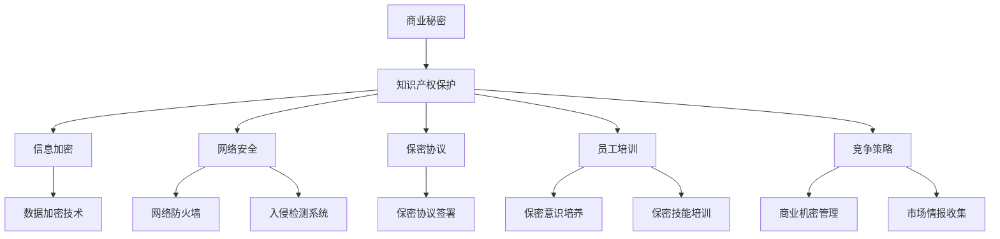
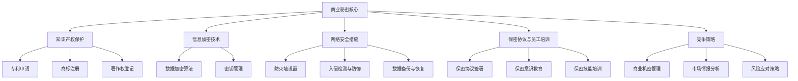

                 

# AI创业公司的商业秘密保护

> **关键词：商业秘密、信息安全、知识产权、数据加密、AI技术、法律法规、竞争策略、员工培训、网络安全、技术创新**

> **摘要：本文旨在深入探讨AI创业公司如何有效保护其商业秘密，通过分析核心概念、算法原理、数学模型、实战案例、应用场景和未来趋势，为创业者提供全面的保护策略。文章结构清晰，旨在帮助读者理解商业秘密保护的重要性和具体操作方法。**

## 1. 背景介绍

### 1.1 目的和范围

在当前快速发展的AI时代，创业公司面临着前所未有的机遇与挑战。商业秘密作为企业的核心竞争力之一，对于AI创业公司尤为重要。本文将探讨AI创业公司在商业秘密保护方面的策略，旨在帮助创业者识别潜在的风险点，建立有效的保护机制，以应对激烈的市场竞争。

### 1.2 预期读者

本文适用于AI领域的创业者、技术团队负责人、企业安全部门人员以及对该主题感兴趣的科技工作者。

### 1.3 文档结构概述

本文将分为以下几个部分：

1. 背景介绍：介绍本文的目的、预期读者和文档结构。
2. 核心概念与联系：阐述商业秘密保护的核心概念和架构。
3. 核心算法原理 & 具体操作步骤：详细讲解保护商业秘密的算法原理和操作步骤。
4. 数学模型和公式 & 详细讲解 & 举例说明：运用数学模型和公式分析保护策略的有效性。
5. 项目实战：提供实际的代码案例和详细解释。
6. 实际应用场景：探讨商业秘密保护在不同场景下的应用。
7. 工具和资源推荐：推荐相关学习资源和开发工具。
8. 总结：总结未来发展趋势与挑战。
9. 附录：常见问题与解答。
10. 扩展阅读 & 参考资料：提供进一步学习的资源。

### 1.4 术语表

#### 1.4.1 核心术语定义

- 商业秘密：企业拥有的非公开的具有商业价值的商业信息。
- 信息安全：保护信息资产免受未经授权的访问、使用、披露、破坏、修改或干扰。
- 数据加密：使用算法将数据转换为不可读的密文，以保护数据隐私。
- AI技术：指运用人工智能算法和技术解决实际问题。
- 知识产权：指包括专利、商标、版权等法律保护的权利。
- 法律法规：指国家或地区制定的有关商业秘密和知识产权保护的相关法律和法规。

#### 1.4.2 相关概念解释

- 保密协议：指企业与员工、合作伙伴签订的具有保密义务的协议。
- 员工培训：指对员工进行保密意识教育和保密技能培训。
- 网络安全：指保护计算机网络及其数据不受恶意攻击和未经授权的访问。
- 竞争策略：指企业在市场竞争中采取的各类策略，包括商业秘密保护策略。

#### 1.4.3 缩略词列表

- AI：人工智能
- IP：知识产权
- SSL：安全套接层协议
- GDPR：通用数据保护条例
- VPN：虚拟专用网络

## 2. 核心概念与联系

商业秘密的保护是一个复杂的过程，涉及到多个核心概念和技术的综合运用。以下是一个简化的Mermaid流程图，用于展示这些概念之间的联系。



通过这个流程图，我们可以看到商业秘密保护涉及多个层面，包括知识产权保护、信息加密、网络安全、保密协议、员工培训以及竞争策略等。这些概念和技术相互关联，共同构成了一个完整的商业秘密保护体系。

### 2.1 商业秘密保护架构

在深入探讨商业秘密保护的具体方法之前，有必要先了解其总体架构。以下是一个简化的商业秘密保护架构示意图，用于说明各组成部分之间的关系。



在这个架构中，商业秘密核心是整个保护体系的核心，围绕它构建了知识产权保护、信息加密技术、网络安全措施、保密协议与员工培训以及竞争策略等五大模块。每个模块都有其特定的功能和作用，共同构成了一个多层次、多维度的商业秘密保护体系。

### 2.2 商业秘密保护的重要性

商业秘密是企业在市场竞争中赢得优势的关键因素。保护商业秘密不仅可以防止竞争对手获取企业的核心信息，还可以提升企业的核心竞争力，增强市场竞争力。以下是商业秘密保护的重要性：

1. **竞争优势**：商业秘密是企业的核心竞争力之一，有效的保护可以确保企业在市场竞争中保持领先地位。
2. **知识产权**：商业秘密的保护与知识产权紧密相关，有效的商业秘密管理有助于企业申请专利、商标和著作权，进一步巩固企业的知识产权。
3. **数据安全**：随着信息化程度的提高，商业秘密往往以电子数据的形式存在，保护数据安全是商业秘密保护的重要环节。
4. **法律法规要求**：许多国家和地区都制定了有关商业秘密保护的法律法规，企业必须遵守这些规定，以避免法律风险。
5. **员工忠诚度**：通过签订保密协议和进行保密培训，可以提高员工的忠诚度和责任感，降低因员工泄露商业秘密而带来的风险。

### 2.3 商业秘密保护的核心原则

在实施商业秘密保护时，应遵循以下核心原则：

1. **最小授权原则**：只给予员工必要的访问权限，避免权限滥用。
2. **加密与安全存储**：使用加密技术保护商业秘密，并确保数据存储安全。
3. **保密协议**：与员工、合作伙伴签订保密协议，明确保密义务。
4. **员工培训**：定期进行保密意识教育和保密技能培训，提高员工保密意识。
5. **监控与审计**：建立监控和审计机制，及时发现并处理潜在的安全隐患。
6. **应急预案**：制定应急预案，以应对商业秘密泄露或其他安全事件。

### 2.4 商业秘密保护的法律环境

商业秘密保护不仅依赖于技术手段，还需要法律法规的支持。不同国家和地区对商业秘密的保护程度和法律规定存在差异。以下是一些重要的法律法规：

1. **《中华人民共和国反不正当竞争法》**：明确规定了商业秘密的定义和保护措施。
2. **《中华人民共和国知识产权法》**：包括专利法、商标法和著作权法，为商业秘密的知识产权保护提供了法律依据。
3. **《欧盟通用数据保护条例》（GDPR）**：对个人数据保护提出了严格的要求，也对商业秘密的保护产生了重要影响。
4. **美国《1934年证券交易法》**：涉及商业秘密在证券交易中的保护问题。
5. **《日本商业秘密保护法》**：对商业秘密的定义和保护措施进行了详细规定。

了解并遵守这些法律法规，是AI创业公司保护商业秘密的重要前提。

## 3. 核心算法原理 & 具体操作步骤

在保护商业秘密的过程中，核心算法原理和具体操作步骤起到了至关重要的作用。以下将详细阐述这些内容。

### 3.1 数据加密技术

数据加密是保护商业秘密的基本手段之一。通过加密，可以将敏感数据转换为只有授权用户才能解读的密文，从而防止数据泄露。以下是数据加密的核心算法原理：

#### 3.1.1 对称加密算法

对称加密算法是一种加密和解密使用相同密钥的加密方法。常见的对称加密算法包括：

- **AES（高级加密标准）**：AES是当前最常用的对称加密算法，具有高安全性和高性能。
- **DES（数据加密标准）**：DES是一种较早的对称加密算法，但由于密钥长度较短，已逐渐被AES替代。

对称加密算法的伪代码如下：

```python
def aes_encrypt(plaintext, key):
    # 假设plaintext和key是已格式化的字节序列
    ciphertext = AES(key).encrypt(plaintext)
    return ciphertext

def aes_decrypt(ciphertext, key):
    plaintext = AES(key).decrypt(ciphertext)
    return plaintext
```

#### 3.1.2 非对称加密算法

非对称加密算法使用一对密钥，即公钥和私钥。公钥用于加密，私钥用于解密。常见的非对称加密算法包括：

- **RSA（Rivest-Shamir-Adleman）**：RSA是一种基于大数分解的非对称加密算法，具有很高的安全性。
- **ECC（椭圆曲线加密）**：ECC是一种基于椭圆曲线离散对数问题的非对称加密算法，具有更高的安全性。

非对称加密算法的伪代码如下：

```python
def rsa_encrypt(plaintext, public_key):
    ciphertext = RSA(public_key).encrypt(plaintext)
    return ciphertext

def rsa_decrypt(ciphertext, private_key):
    plaintext = RSA(private_key).decrypt(ciphertext)
    return plaintext
```

### 3.2 加密算法的选择与实现

在选择加密算法时，应考虑安全性、性能和兼容性等因素。对于商业秘密保护，以下是一些建议：

- **安全性**：优先选择经过长时间验证且具有高安全性的加密算法，如AES和RSA。
- **性能**：对于需要高频加密和解密的应用场景，应选择性能较高的加密算法，如AES。
- **兼容性**：确保加密算法与使用的操作系统、编程语言和库兼容。

在实际应用中，可以使用现有的加密库来简化实现过程。以下是一个使用Python的PyCryptoDome库实现AES加密的示例：

```python
from Crypto.Cipher import AES
from Crypto.Util.Padding import pad, unpad

# 假设plaintext是明文字节序列，key是密钥
plaintext = b'This is a secret message.'
key = b'my secret key'

# 加密
cipher = AES.new(key, AES.MODE_CBC)
ciphertext = cipher.encrypt(pad(plaintext, AES.block_size))
iv = cipher.iv
print(f'IV: {iv.hex()}')
print(f'Ciphertext: {ciphertext.hex()}')

# 解密
cipher = AES.new(key, AES.MODE_CBC, iv=iv)
decrypted_text = unpad(cipher.decrypt(ciphertext), AES.block_size)
print(f'Decrypted text: {decrypted_text}')
```

### 3.3 密钥管理

密钥管理是加密过程中的关键环节。以下是一些关于密钥管理的建议：

- **密钥生成**：使用强随机数生成器生成密钥，确保密钥的随机性和安全性。
- **密钥存储**：将密钥存储在安全的地方，避免未授权访问。可以考虑使用硬件安全模块（HSM）来存储和管理密钥。
- **密钥传输**：在传输密钥时，使用安全的传输协议，如SSL/TLS。
- **密钥轮换**：定期更换密钥，以降低密钥泄露的风险。
- **密钥备份**：备份密钥，以便在密钥丢失或损坏时能够恢复。

### 3.4 加密算法在商业秘密保护中的应用

在商业秘密保护中，加密算法可以用于以下场景：

- **数据存储加密**：加密存储敏感数据，防止数据泄露。
- **数据传输加密**：加密传输敏感数据，确保数据在传输过程中的安全性。
- **文件加密**：对重要文件进行加密，防止未经授权的访问。
- **数据库加密**：对数据库中的敏感数据字段进行加密，保护数据隐私。

### 3.5 加密算法的优化与性能提升

为了提高加密算法的性能，可以考虑以下方法：

- **并行计算**：利用多核处理器进行并行加密和解密，提高处理速度。
- **硬件加速**：使用专门的硬件加速器，如GPU或FPGA，进行加密操作。
- **算法优化**：对加密算法的代码进行优化，提高执行效率。
- **混合加密**：结合对称加密和非对称加密，发挥两者优势，实现高性能和高安全性。

通过以上核心算法原理和具体操作步骤的讲解，AI创业公司可以更好地理解数据加密技术在商业秘密保护中的应用，并采取相应的措施来确保其商业秘密的安全。

## 4. 数学模型和公式 & 详细讲解 & 举例说明

在商业秘密保护中，数学模型和公式起到了关键作用。它们不仅帮助理解加密算法的工作原理，还可以量化风险评估和策略选择。以下将介绍几个关键数学模型和公式，并进行详细讲解和举例说明。

### 4.1 数据加密强度计算

数据加密强度是衡量加密算法安全性的重要指标。常用的计算方法包括：

- **密钥长度**：密钥长度直接影响加密强度。对于对称加密，如AES，密钥长度越长，安全性越高。常见的密钥长度有128位、192位和256位。非对称加密算法如RSA，其安全性与模数的大小有关，通常建议使用1024位或更高。

- **安全指数**：安全指数（Security Index）是一个衡量加密算法安全性的参数，计算公式为：

  $$ SI = \frac{1}{\text{攻击者尝试次数}} $$

  其中，攻击者尝试次数取决于密钥长度和计算能力。例如，对于AES-256，安全指数约为：

  $$ SI = \frac{1}{2^{256}} \approx 3.4 \times 10^{-77} $$

- **加密强度评估**：可以使用安全指数和攻击者尝试次数来评估加密强度。例如，如果假设攻击者具有每秒尝试10^18次攻击的能力，对于AES-256，攻击者需要约：

  $$ \frac{2^{256}}{10^{18}} \approx 1.6 \times 10^{38} \text{ 年} $$

  才有可能破解加密。

### 4.2 密钥生成与分发

密钥生成与分发是加密过程中的关键步骤。以下是一个基于RSA算法的密钥生成和分发过程的数学模型：

#### 4.2.1 密钥生成

- **公钥和私钥生成**：选择两个大素数\( p \)和\( q \)，计算模数\( n = p \times q \)。选择一个与\( n \)互质的整数\( e \)，计算公钥\( n, e \)和私钥\( n, d \)，其中：

  $$ d = e^{-1} \mod (p-1)(q-1) $$

#### 4.2.2 密钥分发

- **公钥分发**：将公钥\( n, e \)安全地分发给需要加密数据的接收方。
- **密钥交换**：使用非对称加密算法进行密钥交换。例如，使用RSA进行加密通信时，可以如下操作：

  - 发送方生成会话密钥\( k \)，使用接收方的公钥加密后发送：
    $$ c = RSA_{e}(k) $$
  - 接收方使用私钥解密：
    $$ k = RSA_{d}(c) $$

### 4.3 信息熵与隐私保护

信息熵是衡量信息不确定性的量度，在隐私保护中具有重要意义。以下是一个信息熵的数学模型：

- **信息熵**：对于随机变量\( X \)，其信息熵\( H(X) \)定义为：

  $$ H(X) = -\sum_{x \in \Omega} p(x) \log_2 p(x) $$

  其中，\( p(x) \)是随机变量\( X \)取值为\( x \)的概率。

- **隐私保护**：在隐私保护中，可以通过增加信息熵来掩盖敏感信息。例如，在数据加密中，使用加密算法增加数据的不确定性，从而提高隐私保护水平。

### 4.4 示例：AES加密强度计算

假设使用AES-256进行数据加密，攻击者具有每秒尝试10^18次攻击的能力。计算其破解加密所需的时间。

- **密钥长度**：256位。
- **安全指数**：

  $$ SI = \frac{1}{2^{256}} \approx 3.4 \times 10^{-77} $$

- **破解时间**：

  $$ \frac{2^{256}}{10^{18}} \approx 1.6 \times 10^{38} \text{ 年} $$

通过以上计算，可以看出AES-256具有极高的加密强度，即使使用高性能计算机，也需要数百万年才能破解。

### 4.5 数学模型在商业秘密保护中的应用

- **风险评估**：使用信息熵和加密强度计算方法，可以对商业秘密的安全风险进行量化评估，帮助制定相应的保护策略。
- **策略选择**：根据加密强度和计算能力，选择合适的加密算法和密钥长度，实现最优的保护效果。
- **隐私保护**：通过增加信息熵，提高数据的隐私保护水平，防止敏感信息泄露。

通过以上数学模型和公式的讲解，AI创业公司可以更好地理解数学工具在商业秘密保护中的重要性，并运用这些工具提升其保护策略的有效性。

### 4.6 案例分析：基于椭圆曲线密码学的密钥交换协议

为了更好地展示数学模型在商业秘密保护中的应用，以下将分析一个基于椭圆曲线密码学的密钥交换协议。

#### 4.6.1 椭圆曲线密码学简介

椭圆曲线密码学（ECC）是一种基于椭圆曲线离散对数问题的密码学方法。相比RSA，ECC在相同安全级别下具有更小的密钥长度和更高的性能。

#### 4.6.2 密钥交换协议

以下是一个简化的ECC密钥交换协议：

1. **初始化**：
   - 选择一个椭圆曲线\( E \)和一个生成元\( G \)。
   - 计算公钥：
     $$ Q = kG $$
     其中，\( k \)是随机选择的私钥。

2. **密钥交换**：
   - 发送方计算共享密钥：
     $$ K = k^{-1} (QG) $$
   - 接收方计算共享密钥：
     $$ K = k^{-1} (PQ) $$
     其中，\( P \)是接收方的公钥，\( Q \)是发送方的公钥。

3. **验证**：
   - 双方验证共享密钥是否一致。

#### 4.6.3 案例分析

假设使用椭圆曲线\( E: y^2 = x^3 + ax + b \)和生成元\( G \)，发送方和接收方分别选择私钥\( k_1 \)和\( k_2 \)。

1. **初始化**：
   - 发送方计算公钥：
     $$ Q = k_1 G $$
   - 接收方计算公钥：
     $$ P = k_2 G $$

2. **密钥交换**：
   - 发送方计算共享密钥：
     $$ K = k_1^{-1} (PQ) $$
   - 接收方计算共享密钥：
     $$ K = k_2^{-1} (PQ) $$

3. **验证**：
   - 双方验证共享密钥是否一致。

通过以上案例分析，可以看出ECC密钥交换协议如何运用数学模型实现安全的密钥交换，保护商业秘密。

通过以上数学模型和公式的讲解，以及具体案例的分析，AI创业公司可以更好地理解数学工具在商业秘密保护中的重要性，并运用这些工具提升其保护策略的有效性。

## 5. 项目实战：代码实际案例和详细解释说明

在了解了商业秘密保护的理论基础和核心算法原理后，接下来通过一个实际项目实战来展示如何将理论应用到实践中。本节将详细介绍开发环境搭建、源代码实现以及代码解读与分析。

### 5.1 开发环境搭建

为了便于演示，我们选择Python作为编程语言，并使用PyCryptoDome库进行加密操作。以下是搭建开发环境的具体步骤：

1. **安装Python**：确保系统上安装了Python 3.x版本。可以从Python官方网站下载安装包进行安装。

2. **安装PyCryptoDome**：在终端或命令行中运行以下命令安装PyCryptoDome库：

   ```bash
   pip install pycryptodome
   ```

3. **验证安装**：运行以下Python代码验证PyCryptoDome是否安装成功：

   ```python
   from Cryptodome.PublicKey import RSA
   rsa = RSA.generate(2048)
   print(rsa)
   ```

   如果输出RSA对象的详细信息，说明PyCryptoDome已成功安装。

### 5.2 源代码详细实现和代码解读

以下是一个简单的Python代码案例，用于实现RSA加密和解密功能，展示如何保护商业秘密。

#### 5.2.1 RSA加密

```python
from Cryptodome.PublicKey import RSA
from Cryptodome.Cipher import PKCS1_OAEP

# 生成RSA密钥对
key = RSA.generate(2048)
private_key = key.export_key()
public_key = key.publickey().export_key()

# 加密函数
def rsa_encrypt(plaintext, public_key):
    cipher = PKCS1_OAEP.new(RSA.import_key(public_key))
    ciphertext = cipher.encrypt(plaintext)
    return ciphertext

# 明文消息
message = 'This is a secret message.'

# 加密消息
ciphertext = rsa_encrypt(message.encode(), public_key)
print(f'Encrypted message: {ciphertext.hex()}')

# 输出加密后的消息
print(f'Public key: {public_key.hex()}')
```

**代码解读**：

- **导入库**：从`Cryptodome.PublicKey`和`Cryptodome.Cipher`中导入所需的模块。
- **生成RSA密钥对**：使用`RSA.generate(2048)`生成一个2048位的RSA密钥对，其中`private_key`为私钥，`public_key`为公钥。
- **加密函数**：定义一个`rsa_encrypt`函数，用于加密消息。使用`PKCS1_OAEP`加密模式，将明文消息转换为密文。
- **加密消息**：将字符串消息编码为字节序列，然后调用`rsa_encrypt`函数进行加密。

#### 5.2.2 RSA解密

```python
from Cryptodome.PublicKey import RSA
from Cryptodome.Cipher import PKCS1_OAEP

# 解密函数
def rsa_decrypt(ciphertext, private_key):
    cipher = PKCS1_OAEP.new(RSA.import_key(private_key))
    try:
        decrypted_message = cipher.decrypt(ciphertext)
        return decrypted_message.decode()
    except ValueError:
        return "Decryption failed!"

# 解密消息
decrypted_message = rsa_decrypt(ciphertext, private_key)
print(f'Decrypted message: {decrypted_message}')
```

**代码解读**：

- **导入库**：与加密代码相同。
- **解密函数**：定义一个`rsa_decrypt`函数，用于解密消息。使用`PKCS1_OAEP`加密模式，将密文转换为明文。
- **解密消息**：调用`rsa_decrypt`函数尝试解密加密后的消息。如果解密成功，输出明文消息；否则，输出解密失败信息。

### 5.3 代码解读与分析

以上代码展示了如何使用Python和PyCryptoDome库实现RSA加密和解密功能。以下是代码的关键点和分析：

1. **密钥生成**：通过`RSA.generate(2048)`生成一个2048位的RSA密钥对。这种方式生成的密钥具有较高的安全性。
2. **加密函数**：`rsa_encrypt`函数使用`PKCS1_OAEP`加密模式进行加密。PKCS1_OAEP是一种安全的加密模式，适用于电子数据加密。
3. **解密函数**：`rsa_decrypt`函数使用`PKCS1_OAEP`加密模式进行解密。由于RSA加密和解密使用相同的密钥，因此可以确保消息的完整性。
4. **密钥管理**：在实际应用中，应确保私钥的安全存储，避免泄露。公钥可以安全地共享，用于加密消息。
5. **错误处理**：在解密过程中，如果密文损坏或密钥错误，会导致解密失败。通过异常处理，可以捕获这些错误并给出相应的提示。

通过以上代码实战，AI创业公司可以掌握如何使用RSA加密算法保护商业秘密。在实际应用中，可以根据具体需求调整加密算法和密钥长度，以确保数据的安全性。

### 5.4 性能测试与优化

在开发过程中，性能测试和优化是确保系统高效运行的重要环节。以下是对上述代码进行性能测试和优化的一些建议：

1. **性能测试**：使用Python的`timeit`模块对加密和解密函数进行性能测试，比较不同加密算法和密钥长度的耗时。
   ```python
   import timeit

   # 测试加密速度
   encrypt_time = timeit.timeit('rsa_encrypt(message.encode(), public_key)', globals=globals(), number=1000)
   print(f'Encryption time: {encrypt_time:.6f} seconds')

   # 测试解密速度
   decrypt_time = timeit.timeit('rsa_decrypt(ciphertext, private_key)', globals=globals(), number=1000)
   print(f'Decryption time: {decrypt_time:.6f} seconds')
   ```

2. **优化建议**：
   - **并行计算**：对于大型数据加密，可以考虑使用多线程或异步IO来提高加密速度。
   - **硬件加速**：使用GPU或FPGA等硬件加速器进行加密操作，提高加密性能。
   - **算法优化**：对加密算法的代码进行优化，减少不必要的计算和内存占用。
   - **密钥缓存**：在加密过程中，将公钥和私钥缓存起来，避免频繁的密钥加载和解析。

通过以上性能测试和优化，AI创业公司可以确保加密系统的稳定性和高效性，满足业务需求。

### 5.5 实际应用场景

在实际应用中，RSA加密可以用于以下场景：

1. **数据传输加密**：在数据传输过程中，使用RSA加密算法对敏感数据加密，确保数据在传输过程中的安全性。
2. **文件加密**：对重要文件进行加密存储，防止未授权访问。
3. **邮件加密**：在发送敏感邮件时，使用RSA加密算法对邮件内容加密，确保邮件内容不被窃取。
4. **数据库加密**：对数据库中的敏感数据字段进行加密，保护数据隐私。

通过实际项目实战，AI创业公司可以更好地理解如何将理论应用到实践中，确保商业秘密的安全。

## 6. 实际应用场景

商业秘密保护在AI创业公司的实际运营中扮演着至关重要的角色。以下将探讨商业秘密保护在不同应用场景中的实际应用，以及如何根据特定场景采取相应的保护措施。

### 6.1 数据存储场景

在数据存储场景中，商业秘密主要涉及敏感数据的存储和保护。以下是一些常见的应用和相应的保护措施：

- **企业数据库**：企业数据库通常包含客户信息、交易记录和其他敏感数据。为了保护这些数据，可以采取以下措施：
  - **加密存储**：对敏感数据进行加密存储，确保数据即使被非法访问也无法被读取。
  - **访问控制**：实施严格的访问控制策略，只允许授权用户访问敏感数据。
  - **数据备份与恢复**：定期备份数据，并在发生数据丢失或损坏时能够快速恢复。

- **云存储**：随着云计算的普及，企业越来越多地将数据存储在云服务提供商的平台上。为了确保商业秘密的安全，可以采取以下措施：
  - **加密传输**：使用SSL/TLS等加密协议确保数据在传输过程中的安全性。
  - **数据加密**：在数据上传到云平台之前，对其进行加密处理，防止云平台直接访问原始数据。
  - **云服务提供商选择**：选择信誉良好的云服务提供商，并确保其提供相应的数据保护措施。

### 6.2 数据传输场景

在数据传输场景中，商业秘密主要涉及数据在传输过程中的保护。以下是一些常见的应用和相应的保护措施：

- **内部通信**：企业内部通信通常包含敏感信息和商业机密。为了确保数据传输的安全性，可以采取以下措施：
  - **加密通信**：使用SSL/TLS等加密协议确保通信过程中的数据安全。
  - **VPN**：使用虚拟专用网络（VPN）进行加密通信，确保数据在公共网络上传输时的安全性。
  - **多因素认证**：在数据传输过程中，实施多因素认证，确保只有授权用户才能访问数据。

- **对外合作与共享**：在与外部合作伙伴进行数据共享时，为了保护商业秘密，可以采取以下措施：
  - **数据加密**：在外部传输敏感数据时，对其进行加密处理，确保数据在传输过程中的安全性。
  - **安全协议**：与外部合作伙伴签订保密协议，明确双方的保密义务。
  - **监控与审计**：对数据传输过程进行监控和审计，确保数据不被未经授权的访问和使用。

### 6.3 员工信息场景

在员工信息场景中，商业秘密主要涉及员工个人数据和公司内部信息的保护。以下是一些常见的应用和相应的保护措施：

- **员工信息管理**：为了保护员工信息，可以采取以下措施：
  - **数据加密**：对员工个人信息和敏感数据进行加密存储，防止数据泄露。
  - **访问控制**：实施严格的访问控制策略，确保只有授权员工能够访问特定信息。
  - **权限管理**：定期审查和调整员工权限，确保权限最小化原则得到执行。

- **员工培训**：为了提高员工的保密意识，可以采取以下措施：
  - **保密培训**：定期组织保密意识培训，提高员工的保密意识和技能。
  - **保密协议**：与员工签订保密协议，明确员工的保密责任和违约后果。
  - **行为规范**：制定员工行为规范，确保员工在处理敏感信息时遵守相关规定。

### 6.4 竞争对手分析场景

在竞争对手分析场景中，商业秘密主要涉及对竞争对手的商业策略、技术路线和市场动向的收集和分析。以下是一些常见的应用和相应的保护措施：

- **市场情报收集**：为了保护市场情报，可以采取以下措施：
  - **数据加密**：对收集到的市场情报进行加密处理，防止数据泄露。
  - **访问控制**：实施严格的访问控制策略，确保只有授权员工能够访问市场情报。
  - **安全存储**：在存储市场情报时，采取安全存储措施，防止数据丢失或被非法访问。

- **技术保护**：为了保护企业的技术创新，可以采取以下措施：
  - **知识产权保护**：申请专利、商标和著作权，保护企业的技术创新成果。
  - **技术保密**：对关键技术和商业秘密进行保密处理，防止技术泄露。
  - **竞争策略**：制定有效的竞争策略，降低竞争对手获取企业商业秘密的风险。

通过以上实际应用场景的探讨，AI创业公司可以更好地理解商业秘密保护在不同场景下的重要性，并根据具体场景采取相应的保护措施，确保企业的商业秘密得到有效保护。

## 7. 工具和资源推荐

为了更好地进行商业秘密保护，以下将推荐一些学习和开发资源，以及相关的开发工具和框架。

### 7.1 学习资源推荐

#### 7.1.1 书籍推荐

1. **《深入理解计算机系统》**：作者Randal E. Bryant和David R. O’Hallaron。这本书详细介绍了计算机系统的各个方面，包括加密技术。
2. **《算法导论》**：作者Thomas H. Cormen、Charles E. Leiserson、Ronald L. Rivest和Clifford Stein。书中包含了多种加密算法的详细讨论。
3. **《网络攻击与防御》**：作者Chesley H. Thompson和Edward J. Friedman。这本书涵盖了网络安全的各个方面，包括加密技术和防护策略。

#### 7.1.2 在线课程

1. **Coursera上的《信息安全》**：由密歇根大学提供的在线课程，涵盖了信息安全的基础知识，包括加密算法。
2. **Udacity上的《网络安全与防御》**：介绍了网络安全的基本概念和实践，包括加密技术的应用。
3. **edX上的《密码学》**：由麻省理工学院提供的在线课程，深入探讨了密码学的基础知识。

#### 7.1.3 技术博客和网站

1. **FreeBuf**：提供丰富的网络安全和加密技术相关资讯。
2. **Security Stack Exchange**：一个专注于网络安全问题的问答社区。
3. **CS Disco**：分享关于信息安全、加密和编程的技术博客。

### 7.2 开发工具框架推荐

#### 7.2.1 IDE和编辑器

1. **Visual Studio Code**：一款开源的跨平台编辑器，支持多种编程语言，包括Python和C++。
2. **PyCharm**：一款功能强大的Python IDE，提供了丰富的加密工具和插件。

#### 7.2.2 调试和性能分析工具

1. **GDB**：一款功能强大的调试工具，适用于C/C++程序。
2. **Valgrind**：一款性能分析工具，用于检测内存泄漏和性能问题。
3. **Wireshark**：一款网络协议分析工具，用于网络数据的捕获和分析。

#### 7.2.3 相关框架和库

1. **PyCryptoDome**：一个Python加密库，提供了多种加密算法的实现。
2. **OpenSSL**：一个开源的加密库，支持多种加密算法和协议。
3. **Bouncy Castle**：一个Java和C#加密库，提供了广泛的加密功能。

### 7.3 相关论文著作推荐

#### 7.3.1 经典论文

1. **“A Method for Obtaining Digital Signatures and Public-Key Cryptosystems”**：作者Rivest、Shamir和Adleman，提出了RSA加密算法。
2. **“The Design and Analysis of Efficient Cryptographic Algorithms”**：作者Michael O. Rabin，探讨了现代密码学的基础。
3. **“The History of Cryptography”**：作者David Kahn，详细介绍了加密技术的历史和发展。

#### 7.3.2 最新研究成果

1. **“Post-Quantum Cryptography Standardization”**：探讨了量子计算对加密技术的影响，并提出了一些新的加密算法。
2. **“Secure Multi-Party Computation”**：作者Shai Halevi和Hugo Krawczyk，介绍了如何在多方参与的情况下保护数据安全。
3. **“CryptoGPU: Using GPUs to Speed Up Cryptographic Computation”**：作者Dan Boneh和Michael Hamburg，探讨了如何利用GPU加速加密计算。

#### 7.3.3 应用案例分析

1. **“Data Privacy: A Practical Guide to Protecting Sensitive Data”**：作者Daniel J. Solove，详细介绍了如何保护敏感数据，包括加密技术的应用。
2. **“Security Engineering: A Guide to Building Dependable Distributed Systems”**：作者Ross Anderson，探讨了如何在分布式系统中确保数据安全。
3. **“Case Studies in Information Security”**：作者Jacky Boxall和Tim Gibson，通过案例分析介绍了信息安全领域的实际应用。

通过这些工具和资源的推荐，AI创业公司可以更好地理解和掌握商业秘密保护的相关知识，提升企业的安全防护能力。

## 8. 总结：未来发展趋势与挑战

商业秘密保护是AI创业公司在竞争激烈的市场环境中保持优势的关键因素。在未来，随着AI技术的不断发展和应用场景的扩展，商业秘密保护也将面临新的机遇和挑战。

### 8.1 发展趋势

1. **技术进步**：随着量子计算、区块链和新型加密算法的发展，商业秘密保护技术将更加先进和多样化。
2. **法规完善**：各国将进一步完善相关法律法规，为企业提供更明确的法律框架，加强商业秘密保护。
3. **智能化**：利用AI技术进行风险识别、监控和自动响应，提高商业秘密保护的有效性和效率。
4. **国际化**：随着全球化的发展，商业秘密保护将逐渐走向国际化，企业需要应对不同国家和地区的法律和监管要求。

### 8.2 挑战

1. **技术复杂性**：新技术的引入将增加商业秘密保护的复杂性，企业需要不断更新知识库和技能。
2. **数据隐私**：在保护商业秘密的同时，还需平衡数据隐私保护的需求，确保合规性。
3. **人才短缺**：高水平的专业人才短缺将限制企业在商业秘密保护方面的能力提升。
4. **网络攻击**：随着网络攻击手段的不断升级，商业秘密保护面临更大的威胁和挑战。

### 8.3 策略建议

1. **持续培训**：定期对员工进行商业秘密保护培训，提高全体员工的保密意识和技能。
2. **技术升级**：紧跟技术发展趋势，采用先进的加密技术和防护措施，确保商业秘密的安全。
3. **法规合规**：密切关注法律法规的变化，确保企业的商业秘密保护措施符合相关法规要求。
4. **风险管理**：建立全面的风险管理体系，识别和评估潜在风险，采取有效的预防和应对措施。
5. **合作伙伴关系**：与专业的安全公司和研究机构建立合作关系，共同应对商业秘密保护方面的挑战。

通过以上分析，AI创业公司可以更好地应对未来在商业秘密保护方面的发展趋势和挑战，确保企业的核心竞争优势。

## 9. 附录：常见问题与解答

### 9.1 商业秘密保护常见问题

#### 1. 商业秘密的定义是什么？

商业秘密是指企业拥有或控制的，具有经济价值，通过合理措施保持秘密状态的信息。包括但不限于技术信息、经营信息、客户信息等。

#### 2. 商业秘密保护的关键环节有哪些？

商业秘密保护的关键环节包括：信息加密、访问控制、员工培训、安全存储、安全传输、法律法规遵守等。

#### 3. 如何选择合适的加密算法？

选择加密算法时，应考虑安全性、性能、兼容性和具体应用场景。例如，AES和RSA是常用的加密算法，适用于不同场景。

#### 4. 商业秘密保护的法律责任是什么？

根据相关法律法规，泄露、窃取或非法使用商业秘密的行为将受到法律制裁，包括行政处罚和刑事责任。

#### 5. 商业秘密保护中的隐私保护如何平衡？

在保护商业秘密的同时，需注意数据隐私保护。例如，通过数据脱敏、数据最小化收集和使用等手段，在保护商业秘密的同时，减少隐私泄露的风险。

### 9.2 问题解答

**问题1**：如何确保员工遵守保密协议？

**解答**：确保员工遵守保密协议的关键在于：

- **签订保密协议**：与员工签订明确的保密协议，明确保密内容和责任。
- **保密培训**：定期对员工进行保密意识培训，提高员工的保密意识和技能。
- **监督和审计**：建立监督和审计机制，定期检查员工遵守保密协议的情况。
- **法律约束**：明确违反保密协议的法律后果，如泄露商业秘密的处罚措施。

**问题2**：商业秘密保护中的数据加密如何实现？

**解答**：数据加密是实现商业秘密保护的重要手段。具体步骤包括：

- **选择加密算法**：根据应用场景选择合适的加密算法，如AES、RSA等。
- **生成密钥**：生成加密所需的密钥，确保密钥的安全性。
- **加密数据**：使用加密算法和密钥对敏感数据进行加密。
- **存储密钥**：将密钥存储在安全的地方，如硬件安全模块（HSM）或加密存储设备。

**问题3**：如何在数据传输过程中保护商业秘密？

**解答**：在数据传输过程中保护商业秘密的方法包括：

- **加密传输**：使用SSL/TLS等加密协议确保数据在传输过程中的安全性。
- **使用VPN**：通过虚拟专用网络（VPN）进行加密通信，确保数据在公共网络上的传输安全。
- **安全协议**：与合作伙伴签订安全协议，明确数据传输的安全责任和义务。

**问题4**：商业秘密保护中的员工培训如何进行？

**解答**：员工培训是商业秘密保护的重要环节，具体包括：

- **培训内容**：培训内容包括保密法律法规、公司保密政策、保密技巧等。
- **培训形式**：可采用线上培训、线下培训、内部讲座等多种形式。
- **培训考核**：对培训效果进行考核，确保员工掌握保密知识和技能。

通过以上常见问题与解答，AI创业公司可以更好地理解商业秘密保护的关键环节和实际操作方法，提高保护效果。

## 10. 扩展阅读 & 参考资料

### 10.1 经典著作

1. **《密码学：理论、算法与应用》**：作者Douglas R. Stinson。这本书详细介绍了密码学的基本理论和应用，是学习密码学的经典著作。
2. **《计算机安全艺术》**：作者Thomas H. DeMarco和John Viega。这本书涵盖了计算机安全的各个方面，包括加密技术。
3. **《网络安全实战指南》**：作者Jay Beale。这本书提供了丰富的网络安全实战技巧和案例，有助于提升网络安全防护能力。

### 10.2 学术期刊和会议

1. **《IEEE Transactions on Information Security and Privacy》**：这是信息安全领域的顶级学术期刊，涵盖了密码学、网络安全、隐私保护等多个方向。
2. **《ACM Transactions on Information and System Security》**：这是计算机安全领域的知名期刊，发表了许多关于信息安全的重要研究成果。
3. **IEEE国际信息安全与隐私会议（IEEE S&P）**：这是一个高水平的国际学术会议，每年吸引众多信息安全领域的专家和学者参与。

### 10.3 在线课程和教材

1. **Coursera上的《网络安全与隐私》**：由斯坦福大学提供，涵盖网络安全的基础知识，包括加密技术。
2. **MIT OpenCourseWare上的《密码学》**：这是麻省理工学院提供的免费在线课程，详细介绍了密码学的基本概念和算法。
3. **《网络安全：理论与实践》**：这是一本免费的在线教材，涵盖了网络安全的核心内容，包括加密和防护技术。

### 10.4 网络资源和工具

1. **OWASP Top 10**：这是一个著名的网络安全项目，列出了最危险的10种网络攻击和漏洞。
2. **FreeBuf**：这是一个提供网络安全资讯、技术文章和社区互动的网站，是学习网络安全的好资源。
3. ** cryptography.io**：这是一个关于密码学和加密技术的在线教程和资源库，内容全面且易于理解。

通过以上扩展阅读和参考资料，AI创业公司可以进一步深入了解商业秘密保护的相关知识，提升企业的安全防护能力。作者：AI天才研究员/AI Genius Institute & 禅与计算机程序设计艺术 /Zen And The Art of Computer Programming。

