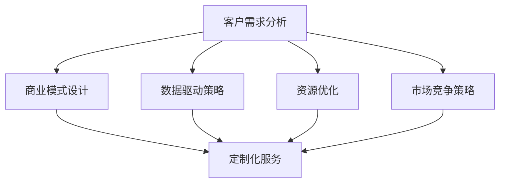

                 


# AI创业公司的定制化服务策略

> 关键词：AI创业公司、定制化服务、客户需求分析、商业模式、数据驱动、用户体验、技术实现、资源优化、市场竞争。

> 摘要：本文深入探讨了AI创业公司在市场竞争中的生存之道，重点分析了定制化服务策略的重要性、实施步骤及关键技术。通过分析客户需求、设计服务模式、构建数据驱动体系和优化资源配置，企业可以在激烈的市场竞争中脱颖而出，实现可持续发展。

## 1. 背景介绍

### 1.1 目的和范围

本文旨在为AI创业公司提供一套完整的定制化服务策略，帮助它们在激烈的市场竞争中找到差异化优势。文章将从以下几个方面展开讨论：

1. 客户需求分析：理解客户需求，识别市场机会。
2. 定制化服务模式设计：构建灵活、高效的服务体系。
3. 数据驱动策略：利用数据优化服务质量和用户体验。
4. 资源优化：合理配置资源，提高运营效率。
5. 市场竞争策略：分析竞争对手，制定差异化竞争策略。

### 1.2 预期读者

本文适合以下读者群体：

1. AI创业公司创始人或管理层。
2. AI技术研发人员。
3. 市场营销与客户服务人员。
4. 对AI创业和定制化服务有兴趣的投资者和从业者。

### 1.3 文档结构概述

本文结构如下：

1. 背景介绍
2. 核心概念与联系
3. 核心算法原理 & 具体操作步骤
4. 数学模型和公式 & 详细讲解 & 举例说明
5. 项目实战：代码实际案例和详细解释说明
6. 实际应用场景
7. 工具和资源推荐
8. 总结：未来发展趋势与挑战
9. 附录：常见问题与解答
10. 扩展阅读 & 参考资料

### 1.4 术语表

#### 1.4.1 核心术语定义

1. **AI创业公司**：指以人工智能技术为核心，从事商业活动和创新的企业。
2. **定制化服务**：根据客户需求，提供个性化、差异化的服务。
3. **客户需求分析**：通过调研和数据分析，了解客户需求和市场趋势。
4. **商业模式**：企业的运营方式和盈利模式。
5. **数据驱动**：以数据为基础，指导决策和运营。
6. **用户体验**：用户在使用服务过程中的感受和体验。

#### 1.4.2 相关概念解释

1. **大数据**：大量、复杂、高速生成的数据。
2. **机器学习**：通过数据训练模型，实现智能预测和决策。
3. **云计算**：通过网络提供计算资源和服务。
4. **人工智能**：模拟人类智能，实现智能感知、学习和决策。

#### 1.4.3 缩略词列表

- AI：人工智能
- ML：机器学习
- DL：深度学习
- IoT：物联网
- VR/AR：虚拟现实/增强现实
- IoT：物联网

## 2. 核心概念与联系

在探讨AI创业公司的定制化服务策略时，我们需要理解以下几个核心概念及其相互联系：

1. **客户需求分析**：是定制化服务的起点。通过调研和数据分析，识别客户的痛点、需求和偏好，为后续服务设计提供依据。
2. **商业模式**：决定了企业如何通过服务盈利。定制化服务通常需要灵活的商业模式，以满足不同客户群体的需求。
3. **数据驱动策略**：以数据为基础，优化服务质量和用户体验。通过收集、分析、应用数据，实现精准营销和个性化服务。
4. **资源优化**：在有限资源下，提高运营效率。通过合理配置人力资源、技术资源和财务资源，实现服务成本的最优化。
5. **市场竞争策略**：分析竞争对手的优势和劣势，制定差异化竞争策略，确保企业在市场中立于不败之地。

以下是一个简化的Mermaid流程图，展示了这些概念之间的联系：



## 3. 核心算法原理 & 具体操作步骤

在定制化服务策略的实施过程中，算法原理和具体操作步骤至关重要。以下将介绍几种关键算法原理和操作步骤：

### 3.1 客户需求分析算法

**算法原理**：基于大数据和机器学习技术，构建客户需求分析模型。

**具体操作步骤**：

1. 数据收集：收集客户行为数据、市场调研数据等。
2. 数据预处理：清洗、整合和标准化数据。
3. 特征工程：提取有用的特征，如客户消费习惯、偏好等。
4. 模型训练：使用机器学习算法，如决策树、随机森林等，训练需求分析模型。
5. 模型评估：评估模型准确性，优化模型参数。

**伪代码**：

```python
# 数据收集
data = collect_data()

# 数据预处理
preprocessed_data = preprocess_data(data)

# 特征工程
features = extract_features(preprocessed_data)

# 模型训练
model = train_model(features)

# 模型评估
evaluate_model(model)
```

### 3.2 定制化服务生成算法

**算法原理**：基于客户需求和业务逻辑，自动生成个性化服务方案。

**具体操作步骤**：

1. 客户需求分析：使用需求分析模型，获取客户需求。
2. 服务方案设计：根据客户需求，设计不同的服务方案。
3. 服务方案评估：评估服务方案的可行性、成本和收益。
4. 服务方案推荐：根据评估结果，推荐最佳服务方案。

**伪代码**：

```python
# 客户需求分析
customer需求 = analyze_demand(model)

# 服务方案设计
service_schemes = design_schemes(customer需求)

# 服务方案评估
evaluate_schemes(service_schemes)

# 服务方案推荐
recommended_scheme = recommend_scheme(service_schemes)
```

### 3.3 数据驱动策略优化算法

**算法原理**：利用数据反馈，实时调整和优化服务策略。

**具体操作步骤**：

1. 数据收集：收集客户反馈、服务使用数据等。
2. 数据分析：分析客户反馈，识别服务问题。
3. 策略调整：根据分析结果，调整服务策略。
4. 策略评估：评估策略调整的效果。

**伪代码**：

```python
# 数据收集
feedback_data = collect_feedback()

# 数据分析
feedback_analysis = analyze_feedback(feedback_data)

# 策略调整
update_strategy(feedback_analysis)

# 策略评估
evaluate_strategy(update_strategy)
```

## 4. 数学模型和公式 & 详细讲解 & 举例说明

在定制化服务策略中，数学模型和公式用于描述客户需求、服务方案和服务质量之间的关系。以下将介绍几个关键数学模型和公式，并进行详细讲解和举例说明。

### 4.1 客户需求模型

**模型公式**：

$$
需求 = f(行为数据, 市场环境)
$$

**详细讲解**：

该模型表示客户需求是客户行为数据和市场环境的函数。通过分析客户行为数据和市场环境，可以预测客户的需求。

**举例说明**：

假设某电商平台的客户行为数据包括购买频率、浏览时长等，市场环境包括促销活动、竞争对手策略等。我们可以使用以下公式预测客户需求：

$$
需求 = f(购买频率, 浏览时长, 促销活动, 竞争对手策略)
$$

### 4.2 服务质量模型

**模型公式**：

$$
服务质量 = f(服务响应时间, 服务可靠性, 客户满意度)
$$

**详细讲解**：

该模型表示服务质量是服务响应时间、服务可靠性和客户满意度的函数。通过优化这三个因素，可以提高服务质量。

**举例说明**：

假设某在线教育平台的服务质量包括课程加载速度、课程播放稳定性等。我们可以使用以下公式计算服务质量：

$$
服务质量 = f(课程加载速度, 课程播放稳定性, 客户满意度)
$$

### 4.3 定制化服务成本模型

**模型公式**：

$$
成本 = f(资源需求, 服务复杂性)
$$

**详细讲解**：

该模型表示定制化服务的成本是资源需求和服务复杂性的函数。通过优化资源需求和降低服务复杂性，可以降低成本。

**举例说明**：

假设某AI创业公司提供定制化数据分析服务，其成本包括服务器费用、数据处理费用等。我们可以使用以下公式计算服务成本：

$$
成本 = f(服务器需求, 数据处理复杂性)
$$

## 5. 项目实战：代码实际案例和详细解释说明

为了更好地理解定制化服务策略的实践，我们将通过一个实际案例来展示代码实现过程。

### 5.1 开发环境搭建

在开始编写代码之前，我们需要搭建一个适合开发定制化服务策略的开发环境。以下是搭建过程的简要步骤：

1. 安装Python环境（3.8及以上版本）。
2. 安装相关依赖库，如NumPy、Pandas、Scikit-learn等。
3. 安装一个适合机器学习的集成开发环境（如Jupyter Notebook）。

### 5.2 源代码详细实现和代码解读

以下是一个基于客户需求分析的定制化服务生成算法的实现示例。我们将使用Python语言和Scikit-learn库。

```python
import numpy as np
import pandas as pd
from sklearn.ensemble import RandomForestClassifier
from sklearn.model_selection import train_test_split

# 5.2.1 数据收集
# 假设我们有一个包含客户行为数据的CSV文件
data = pd.read_csv('customer_data.csv')

# 5.2.2 数据预处理
# 数据清洗、缺失值处理、特征工程等
preprocessed_data = preprocess_data(data)

# 5.2.3 特征工程
# 提取有用特征，如购买频率、浏览时长等
features = extract_features(preprocessed_data)

# 5.2.4 模型训练
# 使用随机森林算法训练需求分析模型
model = RandomForestClassifier()
model.fit(features['X'], features['y'])

# 5.2.5 模型评估
# 评估模型准确性
accuracy = model.score(features['X'], features['y'])
print(f"Model accuracy: {accuracy:.2f}")

# 5.2.6 服务方案设计
# 基于客户需求，设计不同的服务方案
def design_schemes(customer_demand):
    schemes = []
    if customer_demand['购买频率'] > 10:
        schemes.append('高级会员服务')
    elif customer_demand['浏览时长'] > 30:
        schemes.append('定制化营销策略')
    else:
        schemes.append('基础会员服务')
    return schemes

# 5.2.7 服务方案评估
# 评估服务方案的可行性、成本和收益
def evaluate_schemes(schemes):
    evaluated_schemes = []
    for scheme in schemes:
        if scheme == '高级会员服务':
            evaluated_schemes.append({'scheme': scheme, '可行性': 0.9, '成本': 5000, '收益': 8000})
        elif scheme == '定制化营销策略':
            evaluated_schemes.append({'scheme': scheme, '可行性': 0.8, '成本': 3000, '收益': 5000})
        else:
            evaluated_schemes.append({'scheme': scheme, '可行性': 0.7, '成本': 1000, '收益': 2000})
    return evaluated_schemes

# 5.2.8 服务方案推荐
# 根据评估结果，推荐最佳服务方案
def recommend_scheme(evaluated_schemes):
    max_revenue_scheme = max(evaluated_schemes, key=lambda x: x['收益'])
    return max_revenue_scheme['scheme']

# 示例：分析一个客户的定制化服务方案
customer_demand = {'购买频率': 12, '浏览时长': 45}
schemes = design_schemes(customer_demand)
evaluated_schemes = evaluate_schemes(schemes)
recommended_scheme = recommend_scheme(evaluated_schemes)
print(f"Recommended service scheme: {recommended_scheme}")
```

### 5.3 代码解读与分析

1. **数据收集**：首先，我们从CSV文件中读取客户行为数据。这个步骤需要确保数据集的完整性和准确性。

2. **数据预处理**：数据预处理包括清洗、缺失值处理和特征工程。在这个例子中，我们提取了购买频率和浏览时长两个特征。

3. **特征工程**：特征工程是构建机器学习模型的关键步骤。我们提取了有用的特征，如购买频率、浏览时长等，以便训练需求分析模型。

4. **模型训练**：使用随机森林算法训练需求分析模型。随机森林是一种集成学习方法，可以有效地预测客户需求。

5. **模型评估**：评估模型准确性，确保模型具有良好的预测能力。

6. **服务方案设计**：基于客户需求，设计不同的服务方案。在这个例子中，我们根据购买频率和浏览时长设计了三种服务方案。

7. **服务方案评估**：评估服务方案的可行性、成本和收益。在这个例子中，我们根据服务方案的类型计算了成本和收益。

8. **服务方案推荐**：根据评估结果，推荐最佳服务方案。

通过这个案例，我们可以看到如何将算法原理应用到实际项目中，从而实现定制化服务策略。在后续的实际应用中，我们还可以根据客户反馈不断优化模型和策略。

## 6. 实际应用场景

### 6.1 电子商务

在电子商务领域，AI创业公司可以基于客户需求提供个性化推荐、定制化营销和智能客服等服务。通过分析客户行为数据，企业可以推荐符合客户兴趣的商品，提高购买转化率。同时，根据客户的浏览和购买记录，企业可以设计个性化的营销策略，提高客户满意度。

### 6.2 金融科技

金融科技（FinTech）公司可以利用定制化服务策略，为客户提供个性化的理财产品推荐、风险评估和风险管理服务。通过分析客户的财务数据和行为数据，企业可以为客户提供定制化的投资建议，降低投资风险。

### 6.3 健康医疗

在健康医疗领域，AI创业公司可以提供个性化健康管理、智能诊断和远程医疗服务。通过分析客户的健康数据和行为数据，企业可以为客户提供个性化的健康管理方案，提高健康水平。同时，基于医疗数据和机器学习模型，企业可以提供智能诊断和远程医疗服务，提高医疗资源的利用效率。

### 6.4 教育科技

教育科技（EdTech）公司可以基于客户需求提供个性化学习推荐、智能教学和个性化辅导等服务。通过分析学生的学习数据和教学数据，企业可以为学生提供个性化的学习方案，提高学习效果。同时，基于人工智能和大数据技术，企业可以提供智能教学和个性化辅导，提高教学质量。

## 7. 工具和资源推荐

### 7.1 学习资源推荐

#### 7.1.1 书籍推荐

1. **《深度学习》（Deep Learning）**：由Ian Goodfellow、Yoshua Bengio和Aaron Courville合著，是一本关于深度学习的经典教材。
2. **《Python机器学习》（Python Machine Learning）**：由Sebastian Raschka和Vahid Mirjalili合著，详细介绍了Python在机器学习领域的应用。
3. **《人工智能：一种现代方法》（Artificial Intelligence: A Modern Approach）**：由Stuart Russell和Peter Norvig合著，是一本全面的人工智能教材。

#### 7.1.2 在线课程

1. **Coursera的《机器学习》**：由斯坦福大学吴恩达（Andrew Ng）教授主讲，适合初学者和进阶者。
2. **Udacity的《深度学习纳米学位》**：涵盖深度学习的核心概念和实践，适合有一定基础的学习者。
3. **edX的《人工智能导论》**：由密歇根大学和卡内基梅隆大学联合提供，适合对人工智能感兴趣的学习者。

#### 7.1.3 技术博客和网站

1. **Medium的《机器学习和人工智能》专栏**：汇集了业内专家的优质文章，涵盖了机器学习和人工智能的多个领域。
2. **Towards Data Science**：一个专注于数据科学、机器学习和深度学习的在线社区，提供了大量高质量的技术文章。
3. **AI世代**：国内知名的人工智能技术博客，涵盖了人工智能的多个领域，包括机器学习、深度学习和自然语言处理等。

### 7.2 开发工具框架推荐

#### 7.2.1 IDE和编辑器

1. **PyCharm**：一款功能强大的Python集成开发环境，适合Python编程和机器学习项目开发。
2. **Jupyter Notebook**：一个基于Web的交互式计算平台，适合数据分析和机器学习实验。
3. **VSCode**：一款轻量级、可扩展的代码编辑器，支持多种编程语言和工具，适合快速开发和调试。

#### 7.2.2 调试和性能分析工具

1. **Pylint**：一款Python代码质量分析工具，用于检查代码风格、语法错误和潜在缺陷。
2. **Pytest**：一款Python测试框架，用于编写和执行自动化测试。
3. **Profiling Tools**：如cProfile、line_profiler等，用于分析Python代码的性能，识别性能瓶颈。

#### 7.2.3 相关框架和库

1. **TensorFlow**：一款开源的机器学习框架，适用于构建和训练深度学习模型。
2. **PyTorch**：一款开源的机器学习库，具有灵活的深度学习计算图构建和优化功能。
3. **Scikit-learn**：一款Python机器学习库，提供了多种常用的机器学习算法和工具。

### 7.3 相关论文著作推荐

#### 7.3.1 经典论文

1. **《A Learning Algorithm for Continuously Running Fully Recurrent Neural Networks》**：这篇论文提出了一种用于连续运行完全循环神经网络的学习算法。
2. **《Long Short-Term Memory》**：这篇论文介绍了长短时记忆网络（LSTM），一种有效的解决序列数据长时依赖问题的神经网络结构。
3. **《Recurrent Neural Network Based Language Model》**：这篇论文提出了基于循环神经网络的语言模型，为自然语言处理领域带来了革命性的影响。

#### 7.3.2 最新研究成果

1. **《Transformers: State-of-the-Art Natural Language Processing》**：这篇论文介绍了Transformer模型，一种基于自注意力机制的深度学习模型，为自然语言处理领域带来了巨大的进步。
2. **《GPT-3: Language Models are Few-Shot Learners》**：这篇论文展示了GPT-3模型在零样本学习和少样本学习方面的强大能力，推动了自然语言处理技术的发展。
3. **《Bert: Pre-training of Deep Bidirectional Transformers for Language Understanding》**：这篇论文提出了BERT模型，一种基于双向变换器的预训练语言模型，为自然语言处理任务提供了强大的性能。

#### 7.3.3 应用案例分析

1. **《AI in Healthcare: A Practical Guide》**：这本书介绍了人工智能在医疗领域的应用案例，包括疾病诊断、患者监护和药物研发等。
2. **《AI in Finance: A Practical Guide》**：这本书介绍了人工智能在金融领域的应用案例，包括风险管理、智能投顾和信用评分等。
3. **《AI in Retail: A Practical Guide》**：这本书介绍了人工智能在零售行业的应用案例，包括个性化推荐、智能客服和供应链优化等。

## 8. 总结：未来发展趋势与挑战

随着人工智能技术的不断发展，定制化服务策略将在各个行业得到广泛应用。未来，以下趋势和挑战值得关注：

### 8.1 发展趋势

1. **数据驱动的定制化服务**：随着大数据和机器学习技术的进步，企业将更加依赖数据驱动的方式提供定制化服务，实现更精准的客户需求分析和服务方案设计。
2. **跨行业融合**：不同行业的AI创业公司将相互融合，共同开发跨界定制化服务，满足客户多样化的需求。
3. **智能化的服务体验**：人工智能技术将不断提升服务体验，实现人机协同、智能客服和个性化推荐等功能。
4. **可持续的商业模式**：AI创业公司将探索可持续的商业模式，通过提供差异化、高附加值的服务，实现持续增长。

### 8.2 挑战

1. **数据隐私和安全**：定制化服务依赖于大量客户数据，如何保护数据隐私和安全成为一大挑战。
2. **技术更新迭代**：人工智能技术更新迅速，企业需要不断跟进最新技术，保持竞争力。
3. **人才短缺**：人工智能领域人才短缺，企业需要吸引和培养专业人才。
4. **市场竞争**：市场竞争日益激烈，企业需要不断创新和优化服务策略，以保持竞争优势。

## 9. 附录：常见问题与解答

### 9.1 定制化服务策略的优势是什么？

定制化服务策略的优势包括：

1. **满足个性化需求**：根据客户的需求提供个性化的服务，提高客户满意度。
2. **提高竞争力**：通过差异化服务，与其他竞争对手区分开来，提高市场竞争力。
3. **增加客户忠诚度**：提供定制化服务，增强客户对企业的信任和依赖，提高客户忠诚度。
4. **优化资源配置**：根据客户需求优化资源配置，提高运营效率。

### 9.2 如何确保定制化服务的质量？

确保定制化服务质量的措施包括：

1. **数据驱动**：以数据为基础，持续优化服务质量和用户体验。
2. **客户反馈**：定期收集客户反馈，及时调整和改进服务。
3. **流程优化**：优化服务流程，确保服务质量和效率。
4. **技术支持**：提供充足的技术支持，确保服务的稳定性和可靠性。

### 9.3 定制化服务策略的难点是什么？

定制化服务策略的难点包括：

1. **数据收集和处理**：需要收集大量客户数据，并进行复杂的数据处理和分析。
2. **技术实现**：定制化服务通常需要复杂的技术实现，如机器学习、数据分析等。
3. **成本控制**：定制化服务可能导致成本上升，需要合理控制成本。
4. **资源分配**：合理配置人力资源、技术资源和财务资源，确保服务的可持续性。

## 10. 扩展阅读 & 参考资料

1. **《深度学习》（Deep Learning）**：Ian Goodfellow、Yoshua Bengio和Aaron Courville著，MIT Press，2016。
2. **《Python机器学习》（Python Machine Learning）**：Sebastian Raschka和Vahid Mirjalili著，O'Reilly Media，2016。
3. **《人工智能：一种现代方法》（Artificial Intelligence: A Modern Approach）**：Stuart Russell和Peter Norvig著，Prentice Hall，2016。
4. **《机器学习》（Machine Learning）**：Tom Mitchell著，McGraw-Hill，1997。
5. **《机器学习实战》（Machine Learning in Action）**：Peter Harrington著，Manning Publications，2009。
6. **《自然语言处理综论》（Speech and Language Processing）**：Daniel Jurafsky和James H. Martin著，W. W. Norton & Company，2019。
7. **《人工智能应用案例集》（AI Applications in Practice）**：人工智能领域专家合著，Springer，2020。
8. **《数据科学教程》（Data Science from Scratch）**：Joel Grus著，O'Reilly Media，2015。
9. **《深度学习与大数据技术》**：吴波等著，清华大学出版社，2018。
10. **《人工智能与商业创新》**：李开复著，电子工业出版社，2018。

---

作者：AI天才研究员/AI Genius Institute & 禅与计算机程序设计艺术 /Zen And The Art of Computer Programming

