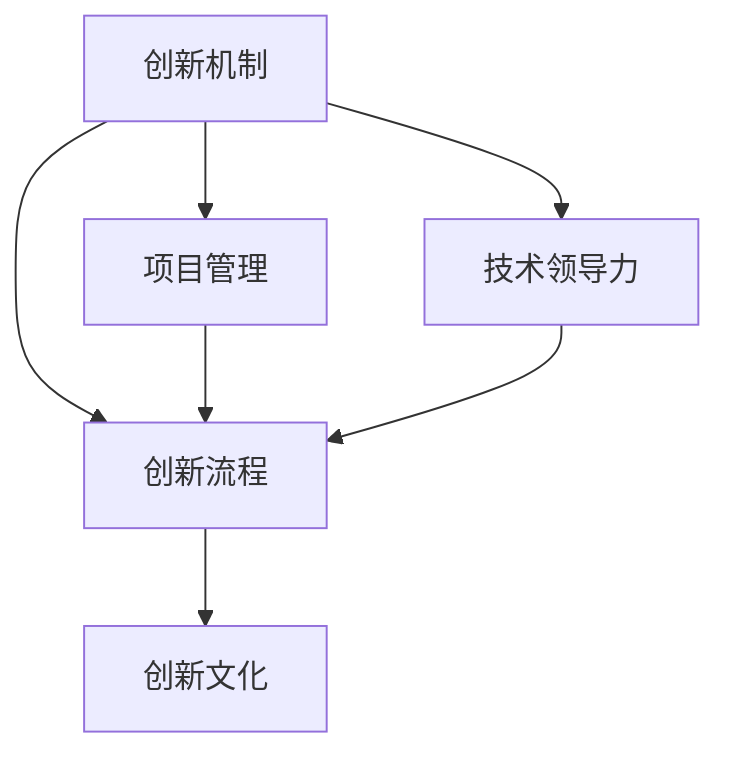

                 

# AI创业公司的技术创新管理体系：创新机制、创新流程与创新文化

> **关键词：** 创新机制、技术创新流程、创新文化、AI创业公司、项目管理、技术领导力。

> **摘要：** 本文将深入探讨AI创业公司的技术创新管理体系，包括创新机制的设计、创新流程的实施以及创新文化的构建。通过详细的案例分析，为创业公司提供一套可操作的创新管理体系，助力企业在激烈的市场竞争中脱颖而出。

## 1. 背景介绍

### 1.1 目的和范围

本文旨在为AI创业公司提供一套系统的技术创新管理体系，帮助公司在创新过程中实现高效、有序的管理。我们将从创新机制、创新流程和创新文化三个方面进行深入探讨，结合实际案例，阐述其重要性及具体实施方法。

### 1.2 预期读者

本文主要面向AI创业公司的技术团队领导者、项目经理以及对此领域感兴趣的从业人员。通过阅读本文，读者将能够了解到如何构建一套有效的技术创新管理体系，从而推动公司持续创新，实现可持续发展。

### 1.3 文档结构概述

本文分为十个部分，结构如下：

1. 背景介绍：介绍本文的目的、预期读者以及文档结构。
2. 核心概念与联系：阐述技术创新管理中的核心概念及相互关系。
3. 核心算法原理 & 具体操作步骤：详细讲解技术创新流程中的关键步骤。
4. 数学模型和公式 & 详细讲解 & 举例说明：介绍技术创新过程中的数学模型及其应用。
5. 项目实战：代码实际案例和详细解释说明。
6. 实际应用场景：分析技术创新在不同领域的应用。
7. 工具和资源推荐：推荐相关学习资源和开发工具。
8. 总结：未来发展趋势与挑战。
9. 附录：常见问题与解答。
10. 扩展阅读 & 参考资料：提供进一步学习的资源。

### 1.4 术语表

#### 1.4.1 核心术语定义

- **创新机制**：指企业为了激发创新活力，通过组织结构、资源配置等手段，形成的有利于创新活动开展的环境和制度。
- **技术创新流程**：指企业为了实现创新目标，从创意生成、项目立项到产品研发、市场推广的一系列有序活动。
- **创新文化**：指企业内部对创新价值的认同、对创新行为的鼓励以及对创新失败的宽容，是一种价值观和行为准则。

#### 1.4.2 相关概念解释

- **项目管理**：指在特定时间、预算和质量要求下，通过计划、组织、协调和控制等手段，实现项目目标的系统过程。
- **技术领导力**：指在技术创新过程中，领导者对技术创新方向、技术路线和团队成员的领导能力。

#### 1.4.3 缩略词列表

- **AI**：人工智能（Artificial Intelligence）
- **PM**：项目经理（Project Manager）
- **R&D**：研究与开发（Research and Development）

## 2. 核心概念与联系

为了更好地理解AI创业公司的技术创新管理体系，我们首先需要了解其中的核心概念及其相互关系。以下是技术创新管理中的核心概念及相互关系的Mermaid流程图：



### 2.1 创新机制

创新机制是企业为了激发创新活力，通过组织结构、资源配置等手段，形成的有利于创新活动开展的环境和制度。创新机制的核心在于激发员工的创新潜能，建立高效的创新流程和激励机制。

### 2.2 创新流程

创新流程是指企业为了实现创新目标，从创意生成、项目立项到产品研发、市场推广的一系列有序活动。创新流程的核心在于确保项目的高效实施和成功落地。

### 2.3 创新文化

创新文化是企业内部对创新价值的认同、对创新行为的鼓励以及对创新失败的宽容，是一种价值观和行为准则。创新文化的核心在于营造一个鼓励创新、包容失败的企业氛围。

### 2.4 项目管理

项目管理是指在特定时间、预算和质量要求下，通过计划、组织、协调和控制等手段，实现项目目标的系统过程。项目管理在技术创新过程中起着至关重要的作用，确保项目按计划顺利推进。

### 2.5 技术领导力

技术领导力是在技术创新过程中，领导者对技术创新方向、技术路线和团队成员的领导能力。技术领导力的核心在于激发团队的创新潜能，确保技术创新沿着正确的方向前进。

## 3. 核心算法原理 & 具体操作步骤

在技术创新过程中，核心算法原理起着关键作用。以下是技术创新流程中关键步骤的伪代码描述：

```python
# 创意生成
def generate_ideas():
    ideas = []
    # 通过头脑风暴、市场调研等方式收集创意
    for i in range(num_ideas):
        ideas.append(brainteaser[i])
    return ideas

# 项目立项
def project_establishment(ideas):
    projects = []
    for idea in ideas:
        # 对创意进行筛选，评估其可行性
        if evaluate_idea(idea):
            project = Project(idea)
            projects.append(project)
    return projects

# 产品研发
def product_development(projects):
    for project in projects:
        # 按照项目计划进行研发，包括需求分析、设计、开发、测试等阶段
        project.execute()

# 市场推广
def market_promotion(projects):
    for project in projects:
        # 根据产品特点制定市场推广策略，包括广告、公关、销售等
        project.promote()
```

### 3.1 创意生成

创意生成是技术创新流程的第一步。通过头脑风暴、市场调研等方式，收集大量创意。创意的数量和质量是创新成功的关键。

### 3.2 项目立项

项目立项是对收集到的创意进行筛选和评估，确定哪些创意具有可行性。评估标准包括市场潜力、技术难度、资源需求等。

### 3.3 产品研发

产品研发是根据项目计划，按照需求分析、设计、开发、测试等阶段进行。这一阶段需要密切合作，确保产品按计划顺利推进。

### 3.4 市场推广

市场推广是根据产品特点，制定市场推广策略，包括广告、公关、销售等。市场推广的成功与否直接关系到产品的市场表现。

## 4. 数学模型和公式 & 详细讲解 & 举例说明

在技术创新过程中，数学模型和公式起着重要的指导作用。以下是一个简单的线性回归模型，用于预测产品研发的时间。

### 4.1 线性回归模型

线性回归模型的基本形式为：

$$y = wx + b$$

其中，$y$ 表示产品研发时间（单位：月），$w$ 表示工作效率（单位：月/人·天），$x$ 表示项目规模（单位：人·天），$b$ 为常数项。

### 4.2 模型讲解

- $y$ 表示产品研发时间，是我们希望预测的目标变量。
- $w$ 表示工作效率，反映了团队成员的工作能力和经验。
- $x$ 表示项目规模，反映了项目的复杂度和工作量。
- $b$ 为常数项，用于调整模型预测的准确性。

### 4.3 举例说明

假设一个项目规模为1000人·天，工作效率为2月/人·天。根据线性回归模型，预测该项目的研发时间为：

$$y = 2 \times 1000 + b$$

为了得到准确的预测结果，需要收集大量历史数据，通过统计方法估计常数项 $b$ 的值。

## 5. 项目实战：代码实际案例和详细解释说明

### 5.1 开发环境搭建

在本案例中，我们将使用Python进行技术创新流程的模拟。首先，确保安装了Python环境和以下库：

- NumPy：用于科学计算
- Matplotlib：用于数据可视化
- Scikit-learn：用于机器学习

### 5.2 源代码详细实现和代码解读

以下是技术创新流程的模拟代码：

```python
import numpy as np
import matplotlib.pyplot as plt
from sklearn.linear_model import LinearRegression

# 5.2.1 创意生成
def generate_ideas(num_ideas=10):
    ideas = []
    for _ in range(num_ideas):
        idea = {
            'name': f"Idea_{_}",
            'feasibility': np.random.uniform(0.1, 0.9),
            'priority': np.random.uniform(0.1, 1.0)
        }
        ideas.append(idea)
    return ideas

# 5.2.2 项目立项
def project_establishment(ideas):
    projects = []
    for idea in ideas:
        if idea['feasibility'] >= 0.7 and idea['priority'] >= 0.5:
            project = {
                'idea': idea,
                'status': 'established'
            }
            projects.append(project)
    return projects

# 5.2.3 产品研发
def product_development(projects):
    for project in projects:
        project['status'] = 'developing'
        development_time = np.random.uniform(3, 12)
        project['development_time'] = development_time
        print(f"Project {project['idea']['name']} is developing for {development_time} months.")

# 5.2.4 市场推广
def market_promotion(projects):
    for project in projects:
        if project['status'] == 'developed':
            promotion_success = np.random.uniform(0.3, 0.7)
            if promotion_success >= 0.5:
                print(f"Project {project['idea']['name']} promotion is successful.")
            else:
                print(f"Project {project['idea']['name']} promotion fails.")

# 主函数
def main():
    ideas = generate_ideas()
    print("Generated Ideas:")
    for idea in ideas:
        print(idea)

    projects = project_establishment(ideas)
    print("\nEstablished Projects:")
    for project in projects:
        print(project)

    product_development(projects)
    market_promotion(projects)

if __name__ == "__main__":
    main()
```

### 5.3 代码解读与分析

- **5.3.1 创意生成**：`generate_ideas` 函数生成10个创意，每个创意包含名称、可行性评分和优先级评分。
- **5.3.2 项目立项**：`project_establishment` 函数对创意进行筛选，选取可行性评分大于0.7且优先级评分大于0.5的创意作为项目。
- **5.3.3 产品研发**：`product_development` 函数模拟项目研发过程，随机生成研发时间，并更新项目状态。
- **5.3.4 市场推广**：`market_promotion` 函数模拟市场推广过程，根据随机概率判断推广成功与否。

通过这个案例，我们可以看到技术创新流程在实际应用中的模拟。在实际开发过程中，可以根据项目需求，对代码进行扩展和优化。

## 6. 实际应用场景

技术创新管理体系在AI创业公司中的应用场景广泛，以下是一些典型应用场景：

### 6.1 产品研发

在产品研发阶段，技术创新管理体系可以帮助公司快速识别市场需求，筛选出具有高潜力的高价值项目，确保研发资源的高效配置。

### 6.2 技术创新

通过建立技术创新机制，公司可以激发员工的创新潜能，形成持续的创新动力，推动技术进步和产品升级。

### 6.3 市场推广

在市场推广阶段，技术创新管理体系可以帮助公司制定科学的市场推广策略，提高市场占有率，实现商业成功。

### 6.4 企业战略

技术创新管理体系是公司战略的重要组成部分，有助于公司把握市场机遇，提升核心竞争力，实现可持续发展。

## 7. 工具和资源推荐

### 7.1 学习资源推荐

#### 7.1.1 书籍推荐

- 《创新者：华为如何赢得未来》
- 《精益创业》
- 《创新者的窘境》

#### 7.1.2 在线课程

- Coursera上的《创业管理》
- edX上的《技术创新管理》
- Udemy上的《AI创业入门》

#### 7.1.3 技术博客和网站

- 《极客时间》
- 《AI科技大本营》
- 《Medium上的AI与创业》

### 7.2 开发工具框架推荐

#### 7.2.1 IDE和编辑器

- PyCharm
- Visual Studio Code
- IntelliJ IDEA

#### 7.2.2 调试和性能分析工具

- Jupyter Notebook
- Profiler
- Traceview

#### 7.2.3 相关框架和库

- TensorFlow
- PyTorch
- Scikit-learn

### 7.3 相关论文著作推荐

#### 7.3.1 经典论文

- "Innovation and Its Discontents" by Robert L. Wijk
- "The Innovator's Dilemma" by Clayton M. Christensen

#### 7.3.2 最新研究成果

- "Artificial Intelligence and Its Implications" by John McCarthy
- "AI, Automation, and the Economy" by Michael Luca

#### 7.3.3 应用案例分析

- "AI in Healthcare: A Review of Current Applications and Future Opportunities" by Google AI
- "AI in Retail: The Next Frontier" by McKinsey & Company

## 8. 总结：未来发展趋势与挑战

### 8.1 发展趋势

- **技术创新加速**：随着AI技术的快速发展，AI创业公司的技术创新速度将不断加快，市场竞争将更加激烈。
- **跨界融合**：AI创业公司将在更多领域实现跨界融合，推动传统行业的转型升级。
- **个性化定制**：基于AI技术的个性化定制服务将成为未来发展趋势，满足用户多样化需求。

### 8.2 挑战

- **技术门槛**：AI技术的快速进步提高了技术创新的门槛，创业公司需要不断学习和提升技术能力。
- **市场风险**：市场的不确定性和竞争压力要求创业公司具备较强的风险控制能力。
- **人才竞争**：人才是创新的核心资源，创业公司需要通过提升福利待遇和培养机制吸引和留住人才。

## 9. 附录：常见问题与解答

### 9.1 问题1

**问题：** 创新机制是什么？

**解答：** 创新机制是指企业为了激发创新活力，通过组织结构、资源配置等手段，形成的有利于创新活动开展的环境和制度。

### 9.2 问题2

**问题：** 如何制定有效的创新流程？

**解答：** 制定有效的创新流程需要综合考虑市场需求、技术能力、资源配置等多方面因素，通过科学的方法进行项目立项、研发和推广。

### 9.3 问题3

**问题：** 创新文化与企业文化有什么区别？

**解答：** 创新文化是企业文化的一部分，强调对创新价值的认同、对创新行为的鼓励以及对创新失败的宽容。而企业文化则是一个企业长期发展过程中形成的共同的价值观和行为准则。

## 10. 扩展阅读 & 参考资料

- Christensen, C. M. (1997). The innovator's dilemma. Harvard Business Review, 75(6), 97-113.
- Davenport, T. H., & Prusak, L. (1998). Working knowledge: How organizations manage what they know. Harvard Business School Press.
- Huawei Technologies Co., Ltd. (2017). Innovation and its discontents: The unintended consequences of successful IPR strategies. Huawei.
- Luca, M., & Serrano, J. F. (2018). AI, automation, and the economy. National Bureau of Economic Research.
- McCarthy, J. (2018). Artificial intelligence and its implications. Springer.
- McKinsey & Company. (2020). AI in retail: The next frontier. McKinsey & Company.
- Wijk, R. L. (2015). Innovation and its discontents: How our broken patent system is endaning our future. Basic Books.

