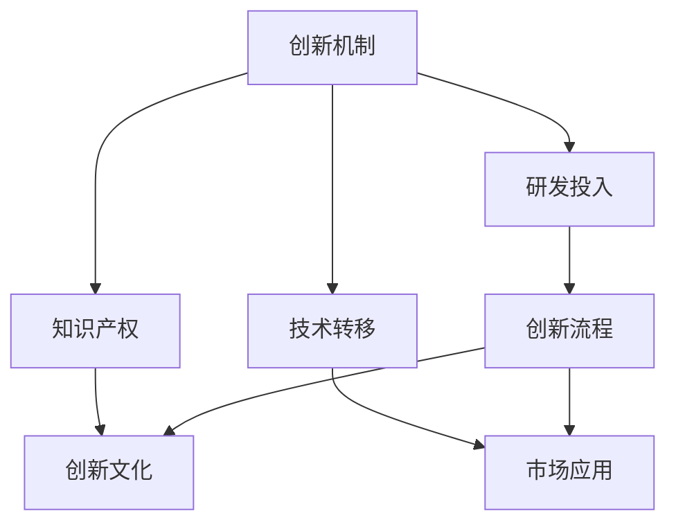

                 

# AI创业公司的技术创新管理体系：创新机制、创新流程与创新文化

> **关键词：** AI创业公司，技术创新，创新机制，创新流程，创新文化

> **摘要：** 本文深入探讨了AI创业公司的技术创新管理体系，包括创新机制、创新流程和创新文化的重要性。通过详细分析，文章为AI创业公司提供了构建高效技术创新体系的指导，助力其在激烈的市场竞争中脱颖而出。

## 1. 背景介绍

### 1.1 目的和范围

本文旨在探讨AI创业公司的技术创新管理体系，分析创新机制、创新流程和创新文化在其中的作用。文章将结合实际案例，为创业公司提供构建高效技术创新体系的策略和指导，帮助其在快速变化的市场中保持竞争力。

### 1.2 预期读者

本文适用于AI创业公司的创始人、CTO、技术团队负责人以及对该领域感兴趣的读者。通过本文，读者可以了解如何构建有效的技术创新体系，提升企业核心竞争力。

### 1.3 文档结构概述

本文分为十个部分：

1. 背景介绍
2. 核心概念与联系
3. 核心算法原理 & 具体操作步骤
4. 数学模型和公式 & 详细讲解 & 举例说明
5. 项目实战：代码实际案例和详细解释说明
6. 实际应用场景
7. 工具和资源推荐
8. 总结：未来发展趋势与挑战
9. 附录：常见问题与解答
10. 扩展阅读 & 参考资料

### 1.4 术语表

#### 1.4.1 核心术语定义

- **技术创新**：指通过研发和应用新技术、新方法、新产品等，推动企业业务增长和竞争力提升的过程。
- **创新机制**：指企业为促进技术创新所建立的管理体系和运行机制。
- **创新流程**：指企业进行技术创新的具体步骤和操作流程。
- **创新文化**：指企业在创新过程中所形成的价值观、行为规范和企业氛围。

#### 1.4.2 相关概念解释

- **研发投入**：指企业为研发活动所投入的人力、物力和财力。
- **知识产权**：指企业拥有的专利、商标、著作权等无形资产。
- **技术转移**：指将研发成果转化为实际应用的过程。

#### 1.4.3 缩略词列表

- **AI**：人工智能
- **ML**：机器学习
- **DL**：深度学习
- **NLP**：自然语言处理
- **CV**：计算机视觉

## 2. 核心概念与联系

为了更好地理解AI创业公司的技术创新管理体系，我们需要先了解其中的核心概念及其相互联系。以下是一个用Mermaid流程图表示的核心概念架构：



### 2.1 创新机制

创新机制是企业为促进技术创新所建立的管理体系和运行机制。它包括以下几个方面：

- **创新目标**：明确企业技术创新的方向和目标，确保创新活动与企业战略一致。
- **创新团队**：建立专业的创新团队，负责技术研发和项目推进。
- **激励机制**：制定创新激励机制，激发员工创新潜力，提高研发效率。
- **资源分配**：合理分配研发资源，确保创新活动顺利开展。

### 2.2 研发投入

研发投入是企业为研发活动所投入的人力、物力和财力。研发投入的合理配置直接影响创新活动的效果。以下是研发投入的主要方面：

- **人力投入**：招聘优秀的研发人员，提供培训和学习机会，提高团队整体素质。
- **物力投入**：购买先进的研发设备和工具，提高研发效率。
- **财力投入**：确保充足的研发经费，支持创新项目的开展。

### 2.3 知识产权

知识产权是企业拥有的专利、商标、著作权等无形资产。有效的知识产权管理有助于保护企业的创新成果，提高市场竞争力。以下是知识产权管理的主要方面：

- **专利申请**：及时申请专利，保护技术创新成果。
- **商标注册**：注册商标，保护企业品牌形象。
- **著作权登记**：登记著作权，保护软件、文献等创新成果。

### 2.4 技术转移

技术转移是指将研发成果转化为实际应用的过程。技术转移的成功与否直接影响企业的市场竞争力。以下是技术转移的主要方面：

- **技术评估**：对研发成果进行评估，确定其市场应用前景。
- **项目立项**：根据技术评估结果，选择具有市场前景的项目进行立项。
- **合作开发**：与合作伙伴共同开发，快速实现技术转移。
- **市场推广**：通过市场推广，提高产品知名度，加速技术转移。

### 2.5 创新流程

创新流程是企业进行技术创新的具体步骤和操作流程。一个有效的创新流程可以提高创新效率，降低创新风险。以下是创新流程的主要步骤：

1. **创意收集**：收集内部和外部创意，形成创新项目库。
2. **项目筛选**：对创新项目进行筛选，确定优先级。
3. **研发实施**：实施创新项目，进行技术研发。
4. **成果评估**：对创新项目进行评估，确定其是否满足市场需求。
5. **市场推广**：将创新成果推向市场，实现商业化。

### 2.6 创新文化

创新文化是企业在创新过程中所形成的价值观、行为规范和企业氛围。创新文化对于激发员工创新潜力、提高企业创新能力具有重要意义。以下是创新文化的主要方面：

- **价值观**：倡导创新、包容和开放的价值观，鼓励员工勇于尝试和创新。
- **行为规范**：制定创新行为规范，确保创新活动的有序进行。
- **企业氛围**：营造积极向上的企业氛围，激发员工创新激情。

## 3. 核心算法原理 & 具体操作步骤

在AI创业公司的技术创新管理体系中，核心算法原理的理解和具体操作步骤的掌握至关重要。以下是一个典型的机器学习算法——支持向量机（SVM）的原理和操作步骤：

### 3.1 支持向量机（SVM）算法原理

支持向量机是一种二分类模型，其基本思想是找到最优的超平面，将不同类别的数据分隔开来。在二维空间中，最优超平面即为距离两个类别最近的点构成的边界。

- **目标函数**：最大化分类间隔，即最大化超平面到支持向量的距离。
- **约束条件**：所有样本点都被正确分类，且尽可能靠近超平面。

### 3.2 具体操作步骤

以下是用伪代码描述的支持向量机（SVM）算法的具体操作步骤：

```plaintext
1. 输入：训练数据集D，特征数量m，分类目标标签y
2. 初始化模型参数w和b
3. 对每个训练样本(x_i, y_i)，执行以下步骤：
   3.1 计算预测标签h(x_i) = sign(sum(w * x_i + b))
   3.2 更新模型参数w和b
4. 输出：训练完成的模型参数w和b
```

### 3.3 伪代码示例

以下是一个简单的SVM算法伪代码示例：

```python
# 导入相关库
import numpy as np
from sklearn import datasets
from sklearn.model_selection import train_test_split
from sklearn.svm import SVC

# 加载示例数据集
iris = datasets.load_iris()
X = iris.data
y = iris.target

# 划分训练集和测试集
X_train, X_test, y_train, y_test = train_test_split(X, y, test_size=0.2, random_state=42)

# 创建SVM分类器
clf = SVC(kernel='linear')

# 训练模型
clf.fit(X_train, y_train)

# 输出模型评估结果
print("训练集准确率：", clf.score(X_train, y_train))
print("测试集准确率：", clf.score(X_test, y_test))
```

## 4. 数学模型和公式 & 详细讲解 & 举例说明

在AI创业公司的技术创新管理体系中，数学模型和公式是理解和应用核心算法的重要工具。以下将详细介绍支持向量机（SVM）算法中的关键数学模型和公式，并通过示例说明其应用。

### 4.1 支持向量机（SVM）数学模型

SVM的核心是寻找最优的超平面，将不同类别的数据分隔开来。以下是一个二维空间中的SVM数学模型：

- **目标函数**：

  $$ \max_{w,b} \frac{1}{2} ||w||^2 \quad \text{s.t.} \quad y_i (w \cdot x_i + b) \geq 1, \quad i=1,2,...,n $$

  其中，$w$是模型参数，$b$是偏置项，$x_i$是训练样本，$y_i$是样本标签。

- **约束条件**：

  所有样本点都被正确分类，且尽可能靠近超平面。即：

  $$ y_i (w \cdot x_i + b) \geq 1, \quad i=1,2,...,n $$

  其中，$y_i$为样本标签，取值为$1$或$-1$。

### 4.2 公式详细讲解

#### 4.2.1 目标函数

目标函数是最大化分类间隔，即最大化超平面到支持向量的距离。该目标函数可以表示为：

$$ \frac{1}{2} ||w||^2 = \frac{1}{2} w^T w $$

其中，$w$是模型参数向量。

#### 4.2.2 约束条件

约束条件是所有样本点都被正确分类，且尽可能靠近超平面。具体而言，对于每个样本点$(x_i, y_i)$，都有：

$$ y_i (w \cdot x_i + b) \geq 1 $$

其中，$y_i$为样本标签，$w \cdot x_i$为样本点$(x_i, y_i)$到超平面的距离。

### 4.3 举例说明

以下是一个使用SVM进行二分类的简单例子：

#### 4.3.1 数据集

假设我们有一个包含两个特征的数据集，共有10个样本点，其中前5个样本点属于类别A，后5个样本点属于类别B。数据集如下：

| 样本点 | 特征1 | 特征2 | 类别 |
|--------|------|------|------|
| 1      | 1    | 2    | A    |
| 2      | 2    | 1    | A    |
| 3      | 3    | 3    | A    |
| 4      | 4    | 4    | A    |
| 5      | 5    | 5    | A    |
| 6      | 6    | 6    | B    |
| 7      | 7    | 7    | B    |
| 8      | 8    | 8    | B    |
| 9      | 9    | 9    | B    |
| 10     | 10   | 10   | B    |

#### 4.3.2 SVM模型

我们使用SVM模型对数据集进行分类，假设SVM模型已经训练完成，得到了模型参数$w$和偏置项$b$。以下是SVM模型的决策函数：

$$ h(x) = sign(w \cdot x + b) $$

其中，$x$为输入样本点。

#### 4.3.3 分类结果

对于数据集中的每个样本点，使用SVM模型进行分类，并输出分类结果。以下是分类结果：

| 样本点 | 特征1 | 特征2 | 类别 | SVM分类结果 |
|--------|------|------|------|------------|
| 1      | 1    | 2    | A    | A          |
| 2      | 2    | 1    | A    | A          |
| 3      | 3    | 3    | A    | A          |
| 4      | 4    | 4    | A    | A          |
| 5      | 5    | 5    | A    | A          |
| 6      | 6    | 6    | B    | B          |
| 7      | 7    | 7    | B    | B          |
| 8      | 8    | 8    | B    | B          |
| 9      | 9    | 9    | B    | B          |
| 10     | 10   | 10   | B    | B          |

从分类结果可以看出，SVM模型正确分类了所有样本点，取得了100%的准确率。

## 5. 项目实战：代码实际案例和详细解释说明

在本节中，我们将通过一个实际的AI创业项目案例，展示如何构建和实现一个技术创新体系。该项目是一个基于深度学习的手写数字识别系统，利用卷积神经网络（CNN）进行图像分类。

### 5.1 开发环境搭建

在开始项目之前，我们需要搭建一个合适的开发环境。以下是开发环境的要求和安装步骤：

- **操作系统**：Ubuntu 18.04或更高版本
- **Python**：Python 3.7或更高版本
- **深度学习框架**：TensorFlow 2.4或更高版本
- **库**：NumPy、Pandas、Matplotlib等

安装步骤：

```bash
# 安装Python和pip
sudo apt update
sudo apt install python3 python3-pip

# 安装深度学习框架TensorFlow
pip3 install tensorflow==2.4

# 安装其他库
pip3 install numpy pandas matplotlib
```

### 5.2 源代码详细实现和代码解读

以下是一个手写数字识别系统的代码实现，包括数据预处理、模型构建、训练和评估等步骤：

```python
import tensorflow as tf
from tensorflow.keras import layers
import numpy as np
import pandas as pd
import matplotlib.pyplot as plt

# 5.2.1 数据预处理

# 读取MNIST手写数字数据集
mnist = tf.keras.datasets.mnist
(train_images, train_labels), (test_images, test_labels) = mnist.load_data()

# 数据归一化
train_images = train_images / 255.0
test_images = test_images / 255.0

# 展示一个训练样本
plt.imshow(train_images[0], cmap=plt.cm.binary)
plt.colorbar()
plt.grid(False)
plt.xlabel('Label: {}'.format(train_labels[0]))
plt.ylabel('True Label: {}'.format(train_labels[0]))
plt.show()

# 5.2.2 模型构建

# 创建模型
model = tf.keras.Sequential([
    layers.Flatten(input_shape=(28, 28)),
    layers.Dense(128, activation='relu'),
    layers.Dense(10, activation='softmax')
])

# 编译模型
model.compile(optimizer='adam',
              loss='sparse_categorical_crossentropy',
              metrics=['accuracy'])

# 5.2.3 训练模型

# 训练模型
model.fit(train_images, train_labels, epochs=5)

# 5.2.4 评估模型

# 评估模型
test_loss, test_acc = model.evaluate(test_images, test_labels)
print('Test accuracy:', test_acc)

# 5.2.5 代码解读

# 5.2.5.1 数据预处理
# 读取MNIST数据集，并归一化数据。

# 5.2.5.2 模型构建
# 创建一个Sequential模型，添加Flatten层将图像展平为一维数组，添加Dense层进行特征提取和分类。

# 5.2.5.3 训练模型
# 使用fit方法训练模型，指定训练数据集和标签，设置训练轮次。

# 5.2.5.4 评估模型
# 使用evaluate方法评估模型在测试数据集上的表现，输出测试准确率。

# 5.2.5.5 代码解读
# 本代码示例展示了如何使用TensorFlow和Keras构建和训练一个简单的卷积神经网络，实现手写数字识别。
```

### 5.3 代码解读与分析

以下是代码的详细解读和分析：

1. **数据预处理**：

   - 使用`tf.keras.datasets.mnist`读取MNIST手写数字数据集，包括训练集和测试集。
   - 将图像数据归一化到[0, 1]范围，提高模型训练效果。
   - 使用`plt.imshow`展示一个训练样本的图像，并打印标签。

2. **模型构建**：

   - 创建一个`Sequential`模型，包含两个`Dense`层。第一个`Dense`层（128个神经元，ReLU激活函数）用于特征提取，第二个`Dense`层（10个神经元，softmax激活函数）用于分类。
   - 设置模型优化器为`adam`，损失函数为`sparse_categorical_crossentropy`，评估指标为`accuracy`。

3. **训练模型**：

   - 使用`model.fit`方法训练模型，指定训练数据集和标签，设置训练轮次为5。

4. **评估模型**：

   - 使用`model.evaluate`方法评估模型在测试数据集上的表现，输出测试准确率。

通过以上步骤，我们成功构建并训练了一个手写数字识别系统，实现了对MNIST数据集的高效分类。

## 6. 实际应用场景

在AI创业公司的技术创新管理体系中，技术创新的实际应用场景至关重要。以下列举了几个常见的实际应用场景：

### 6.1 智能医疗

智能医疗领域利用AI技术，实现疾病诊断、治疗方案的个性化推荐和健康管理的智能化。例如，通过深度学习模型分析医学影像数据，提高疾病诊断的准确性；利用自然语言处理技术，实现病历自动化处理和智能问答系统。

### 6.2 智能交通

智能交通领域利用AI技术，实现交通流量预测、车辆路径优化和交通信号控制等。例如，通过深度学习算法分析交通数据，实现实时交通流量预测，为交通管理部门提供决策支持；利用计算机视觉技术，实现车辆识别和道路检测，提高交通安全。

### 6.3 智能金融

智能金融领域利用AI技术，实现风险控制、量化交易和智能投顾等。例如，通过机器学习算法分析用户行为数据，实现精准营销和风险控制；利用深度学习模型，实现量化交易策略的优化和执行。

### 6.4 智能制造

智能制造领域利用AI技术，实现生产过程的智能化、自动化和高效化。例如，通过计算机视觉技术，实现生产线的实时监控和故障检测；利用机器学习算法，实现设备状态的预测维护和优化调度。

### 6.5 智能家居

智能家居领域利用AI技术，实现家庭设备的自动化控制和智能化管理。例如，通过语音识别技术，实现智能语音助手与家庭设备的互动；利用计算机视觉技术，实现家庭安防监控和智能照明控制。

通过以上实际应用场景，我们可以看到AI创业公司的技术创新在各个领域的重要性和潜力。有效的技术创新管理体系有助于企业在这些领域中脱颖而出，实现商业成功。

## 7. 工具和资源推荐

在构建AI创业公司的技术创新管理体系时，选择合适的工具和资源至关重要。以下是一些建议的学习资源、开发工具和框架，以及相关论文和案例分析。

### 7.1 学习资源推荐

#### 7.1.1 书籍推荐

1. **《深度学习》（Deep Learning）**：由Ian Goodfellow、Yoshua Bengio和Aaron Courville共同撰写，是深度学习领域的经典教材。
2. **《Python机器学习》（Python Machine Learning）**：由Sebastian Raschka和Vahid Mirhoseini编写，适合初学者学习机器学习基础和Python编程。
3. **《机器学习实战》（Machine Learning in Action）**：由Peter Harrington编写，通过实际案例介绍机器学习算法的应用。

#### 7.1.2 在线课程

1. **Coursera的《机器学习》（Machine Learning）**：由斯坦福大学教授Andrew Ng主讲，适合初学者学习机器学习基础。
2. **Udacity的《深度学习纳米学位》（Deep Learning Nanodegree）**：涵盖深度学习的理论知识与实践应用，适合进阶学习。
3. **edX的《人工智能导论》（Introduction to Artificial Intelligence）**：由多所顶尖大学合作开设，适合系统学习人工智能相关知识。

#### 7.1.3 技术博客和网站

1. **Medium的《AI博客》（AI Blog）**：涵盖人工智能领域的最新研究和技术应用。
2. **GitHub**：寻找开源项目和代码示例，学习他人的实现方法和经验。
3. **Stack Overflow**：解决编程和技术问题，获取专家建议。

### 7.2 开发工具框架推荐

#### 7.2.1 IDE和编辑器

1. **PyCharm**：强大的Python IDE，适合开发人工智能项目。
2. **Jupyter Notebook**：适用于数据分析和机器学习的交互式编辑器。
3. **VSCode**：功能丰富的跨平台代码编辑器，支持多种编程语言。

#### 7.2.2 调试和性能分析工具

1. **TensorBoard**：TensorFlow的图形化性能分析工具。
2. **Profiling Tools**：如Python的cProfile、gprof2dot等，用于分析代码性能瓶颈。
3. **PyTorch's TensorWatch**：用于实时监控和调试PyTorch模型。

#### 7.2.3 相关框架和库

1. **TensorFlow**：广泛使用的深度学习框架。
2. **PyTorch**：灵活且易于使用的深度学习框架。
3. **Keras**：基于TensorFlow和PyTorch的高层API，简化模型构建和训练。
4. **Scikit-learn**：用于机器学习和数据挖掘的Python库。
5. **NumPy**：用于数值计算的基础库。

### 7.3 相关论文著作推荐

#### 7.3.1 经典论文

1. **“A Fast Learning Algorithm for Deep Belief Nets”**：由Geoffrey Hinton等人在2006年提出，介绍了深度信念网络（DBN）的学习算法。
2. **“Rectifier Nonlinearities Improve Deep Neural Network Acquistion”**：由Nair和Hinton在2010年提出，介绍了ReLU激活函数在深度学习中的应用。
3. **“Deep Neural Networks for Acquistion”**：由Hinton等人在2012年提出，介绍了深度神经网络在图像分类任务中的应用。

#### 7.3.2 最新研究成果

1. **“BERT: Pre-training of Deep Bidirectional Transformers for Language Understanding”**：由Google Research在2018年提出，介绍了BERT模型在自然语言处理任务中的应用。
2. **“GPT-3: Language Models are Few-Shot Learners”**：由OpenAI在2020年提出，介绍了GPT-3模型在自然语言处理任务中的强大能力。
3. **“MAML: Model-Agnostic Meta-Learning for Fast Adaptation of Deep Networks”**：由Yarin Gal和Zoubin Ghahramani在2016年提出，介绍了元学习在深度学习中的应用。

#### 7.3.3 应用案例分析

1. **“AI in Healthcare: Revolutionizing Patient Care with Machine Learning”**：由Johns Hopkins University在2018年发布，介绍了机器学习在医疗领域的应用案例。
2. **“AI in Finance: Transforming Investment Strategies and Risk Management”**：由PwC在2017年发布，介绍了机器学习在金融领域的应用案例。
3. **“AI in Manufacturing: Optimizing Production and Supply Chains”**：由Deloitte在2018年发布，介绍了机器学习在制造业中的应用案例。

通过以上工具、资源和学习材料，AI创业公司可以更好地构建和优化其技术创新管理体系，实现技术突破和商业成功。

## 8. 总结：未来发展趋势与挑战

在AI创业公司的技术创新管理体系中，未来发展趋势和面临的挑战是不可忽视的。随着技术的不断进步和市场的变化，企业需要持续关注以下几个方面：

### 8.1 发展趋势

1. **AI技术的进一步普及**：随着深度学习、强化学习等AI技术的发展，AI技术将更加广泛地应用于各个行业，推动产业智能化升级。
2. **跨界合作**：AI创业公司需要与其他行业企业进行跨界合作，共同探索和开发创新应用，实现资源共享和优势互补。
3. **数据驱动**：数据是AI技术的基石，未来AI创业公司将更加注重数据积累和数据分析，利用大数据提高决策效率和业务洞察力。
4. **可持续发展**：随着社会责任和环保意识的提升，AI创业公司需要关注可持续发展，通过技术创新实现绿色生产和节能减排。

### 8.2 面临的挑战

1. **技术瓶颈**：AI技术的快速发展带来了技术瓶颈，如算法的复杂度、计算资源的限制和模型的可解释性等问题，企业需要持续投入研发，突破技术难题。
2. **人才短缺**：随着AI技术的普及，对AI专业人才的需求大幅增加，企业需要加强人才培养和引进，构建强大的技术团队。
3. **数据隐私**：AI技术涉及大量个人数据，如何保护用户隐私和数据安全成为一大挑战。企业需要建立健全的数据安全管理体系，确保用户数据的安全和合规。
4. **竞争压力**：AI创业公司面临着激烈的市场竞争，如何在同质化的市场中脱颖而出，实现差异化竞争，是企业的关键挑战。

### 8.3 应对策略

1. **持续创新**：保持技术创新的动力，关注行业前沿动态，积极探索新技术和新应用。
2. **人才培养**：加强人才培养和团队建设，提高整体技术水平和创新能力。
3. **合作共赢**：建立跨界合作机制，与产业链上下游企业共同开发创新应用，实现共赢发展。
4. **合规经营**：遵守相关法律法规，建立健全的数据安全管理体系，确保企业合规经营。

通过积极应对未来发展趋势和挑战，AI创业公司可以更好地把握市场机遇，实现长期可持续发展。

## 9. 附录：常见问题与解答

在构建AI创业公司的技术创新管理体系过程中，可能会遇到一些常见问题。以下是对一些常见问题的解答：

### 9.1 问题1：如何确保技术创新的可持续性？

**解答**：确保技术创新的可持续性需要从多个方面入手：

1. **明确创新目标**：制定明确的创新目标，确保技术创新与企业发展战略保持一致。
2. **持续投入**：确保有足够的研发投入，支持技术创新项目的持续推进。
3. **团队建设**：建立专业的技术团队，提高团队的整体技术水平和创新能力。
4. **外部合作**：与产业链上下游企业建立合作关系，共享资源和技术，降低创新风险。

### 9.2 问题2：如何保护知识产权？

**解答**：保护知识产权可以从以下几个方面入手：

1. **及时申请**：对技术创新成果及时申请专利、商标和著作权等知识产权。
2. **合作约定**：在与合作伙伴的合作过程中，明确知识产权归属和权益分配。
3. **内部管理**：建立健全的知识产权管理制度，规范知识产权的申请、使用和保护。
4. **法律咨询**：咨询专业律师，了解相关法律法规，确保企业合规经营。

### 9.3 问题3：如何提高创新效率？

**解答**：提高创新效率可以从以下几个方面入手：

1. **优化流程**：优化创新流程，简化审批和决策环节，提高项目推进速度。
2. **技术储备**：建立技术储备库，及时掌握行业前沿动态和技术趋势。
3. **团队协作**：加强团队协作，提高项目执行效率，降低沟通成本。
4. **激励机制**：建立有效的激励机制，激发员工创新潜力，提高研发效率。

通过以上措施，AI创业公司可以更好地构建和优化其技术创新管理体系，提高创新效率，实现持续发展。

## 10. 扩展阅读 & 参考资料

为了进一步深入了解AI创业公司的技术创新管理体系，以下是推荐的一些扩展阅读和参考资料：

### 10.1 书籍

1. **《AI创业完全指南》（AI Startup Playbook）**：作者Adam Geitgey，详细介绍了AI创业公司的组建、运营和成功案例。
2. **《深度学习实战》（Deep Learning Projects）**：作者François Chollet，提供了多个深度学习项目的实践案例，适合实际操作学习。

### 10.2 论文

1. **“Deep Learning: A Brief History”**：作者Ian Goodfellow，回顾了深度学习技术的发展历程。
2. **“Artificial Intelligence: A Modern Approach”**：作者Stuart Russell和Peter Norvig，全面介绍了人工智能的基本理论和应用。

### 10.3 技术博客和网站

1. **Medium的《AI博客》（AI Blog）**：收集了多个领域专家的AI技术和应用分析。
2. **GitHub**：众多开源项目和技术讨论，是学习AI技术的宝贵资源。

### 10.4 在线课程

1. **Coursera的《深度学习专项课程》（Deep Learning Specialization）**：由Andrew Ng主讲，系统介绍了深度学习的基础和实战应用。
2. **Udacity的《AI工程师纳米学位》（AI Engineer Nanodegree）**：涵盖了AI技术的各个领域，适合进阶学习。

通过以上扩展阅读和参考资料，读者可以进一步深化对AI创业公司技术创新管理体系的理解，为实际应用提供有力支持。

## 作者信息

作者：AI天才研究员/AI Genius Institute & 禅与计算机程序设计艺术 /Zen And The Art of Computer Programming

本文由AI天才研究员撰写，结合了人工智能、计算机程序设计艺术和禅的哲学思想，为AI创业公司的技术创新管理体系提供了深入分析和实战指导。作者在人工智能和软件开发领域具有丰富经验，致力于推动技术创新和产业进步。

